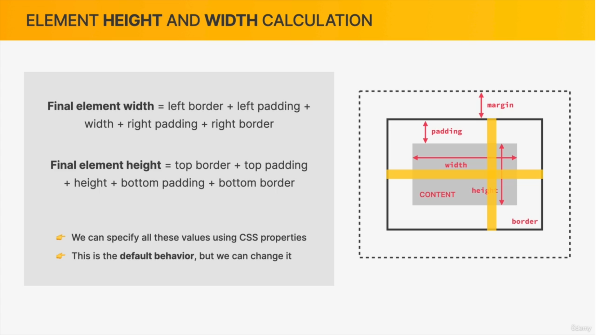
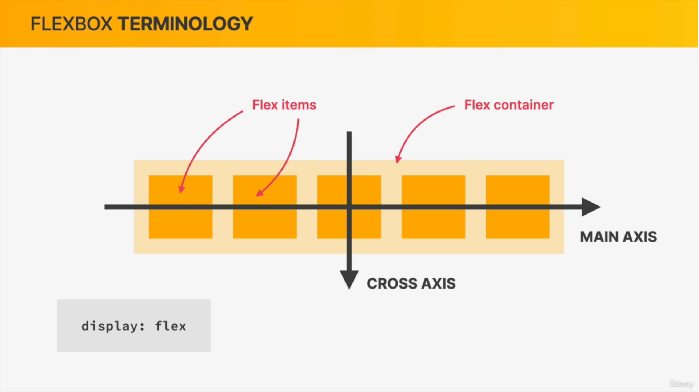

## 📘Information
1. HTML : Content Display/ Structure
2. CSS : Style & Design
3. Always follow Separation of concern like write css in css files and js in js files for good practice
4. **kebab case** mostly use in CSS example **main-heading**
5. Real world we mostly use classes instead of id for future use
6. html validator is use to check html validations

---

# 📔Html

* **Block Element** : Which takes **100% width** example **Div, header, footer, section, aside, nav, main, article or all Semantic tags**
* **InLine Element** : which takes **content width** example **a , span**

**⚠️ Note :** To check the weather element is block or inline use **Border Style Property**

---

# 📔CSS

## 📘How we select and style element


---

## 📘Various types of CSS

1. Inline
2. Internal
3. External

---

## 📘Styling-Text
* Serif : Has Edges
* Sans Serif : has not Edges (best one)

```css
h1 {
    font-family: sans-serif;
    font-size: 18px;
    text-transform: uppercase;
    text-decoration: none;
    line-height: 10px;
    font-style: italic;
}
```
---

## 📘Aligning Only Text

* it will only align the text not the other elements like div etc

```css
h1 {
    text-align: right;
    text-align: center;
    text-align: left;
    text-align: justify;
}
```

---

## 📘Selectors


| Sr No | Name               | Selection Criteria                                                                       |
| ----- | ------------------ | ---------------------------------------------------------------------------------------- |
| 1     | Class              | . (dot symbol)                                                                           |
| 2     | id                 | # (hash symbol)                                                                          |
| 3     | Element            | name of element (body, p, h1)                                                            |
| 4     | Nested Element     | article div p (selecting p element which exist in article then div)                      |
| 5     | Multiple Selectors | h1, h2, h3, p, li {  color: green;}                                                      |
| 6     | Adjacent Selectors | h1 + p (it will select all only those p elements which are immediately after h elements) |
| 7     | Pseudo-Classes     | : (colon symbol)                                                                         |
| 8     | Pseudo Element     | :: (double colon) ,   it will create new element after or before the selected element    |


1. **Adjacent Selector**

```html
<style>
h2+p {
    color: blue;
}
</style>

<h2>This is a heading</h2>
<p>This paragraph will be blue because it's immediately preceded by an h2 element.</p>

<h2>Another heading</h2>
<p>This paragraph will NOT be blue because it's not immediately preceded by an h2 element.</p>

 <!-- Will not work here --->

<h3>Yet another heading</h3>
<p>This paragraph will be blue because it's immediately preceded by an h2 element.</p>
```

2. **Pseudo-Classes**
* These classes are work on all elements like p, headings etc but it should always exist with in the select element eg in below we have selected article element

```css
/*Selecting First element*/
article li:first-child {
    color: red;
}

/*Selecting last element*/
article li:first-child {
    color: red;
}

/*Selecting nth/any element
selecting first
*/
article li:nth-child(1) {
    color: red;
}

/* Selecting Second */
article li:nth-child(2) {
    color: red;
}

article li:nth-child(odd) {
    color: red;
}

article li:nth-child(even) {
    color: red;
}

article li:hover {
    color: green;
}
```

3. **Pseudo Elements :** these are use to create new element also before or after the selected element

1. ::first-letter
2. ::first-line
3. ::after{content  : "Text Here", color : red, font-size:10px}
4. ::before{content  : "Text Here", color : red, font-size:10px}

---

## 📘Specificity (Associativity)

**id > Class > Element**


---

## 📘Inheritance

1. Inheritance by using **body element**


```css
body {
    color: red;
    font-family: sans-serif;
    font-size: 10px;
    /* This will not apply on all elements, it will apply on body element */
    border : 2px solid red;
}
```


2. Inheritance by using **Universal Multi-Selector**

```css
* {
    color: red;
    font-family: sans-serif;
    font-size: 10px;
    /* this property will applied*/
    border: 2px solid red;
}
```


---

## 📘Color
* We always use **hexadecimal** colors, and rgb when we need **transparency**
```css
body {
    /* Names */
    color: red;

    /* Regular REB Model*/
    color: rgb(1, 1, 1);

    /* RGB with transparency ("alpha")*/
    background-color: rgb(255, 0, 0, 0.6);

    /* Hexadecimal Notation*/
    color: #474638;
}
```

**⚠️ Note :** **rbg(0, 0, 0) / #000000 / #000** are same thing

---


## 📘Background

```css
body {
    background: url("./test.jpg");
    background-repeat: no-repeat;
    background-position: center center;
    background-size: cover;
}
```
---

## 📘Box-Model and Box-sizing





* There is always **margin and padding** by default on elements such as h1, p, etc., in every browser.
* To Eliminate this issue we us **CSS Reset**.
* After using this we have to set margin and padding for each elements.
```css
/* Called CSS Reset */
* {
    /* Removing padding in body*/
    padding: 0;

    /* removing margin from view port/ Browser Window*/
    margin: 0;

    /* to reset all width (best one)*/
    box-sizing: border-box;
}
```


**⚠️ Note :** All above properties are placed in **multi-selector** instead of body because it will apply on each and every element otherwise it will apply to body only, as we know only **text-properties** are inheritance.


* Padding & Margin Short-Hand
```css
body {
    /* Top Left Bottom Right */
    padding: 10px 20px 10px 20px;

    /* Top/Bottom Left/Right */
    padding: 10px 20px;
}
```

**⚠️ Note :**
1. ul/ol element has by default **40px padding**

2. When we have two margins that occupied the same space only one of them is actually visible on the page and that is usually the larger of the two and this phenomena is called **collapsing margins** lets say one element has 40px margin-top and one has 20px margin bottom then distance between two margin will be 40px not 65px
---

## 📘Dimensions
1. Height : px/auto
2. width : px/%

---

## 📘Units

* px
* % : to parent element
* em : font size of parent element
* rem : to font size of root element (mostly use this and belongs to  root element : html)
* vw : to 1% of viewport width
* vh : to 1% of viewport height


**⚠️Note :** by default **font-size** of html is **16px**

---
## 📘Block-Inline

* **Block Elements :**
1. Are those elements which takes whole width example **li, div, p, h1** and create line breaks after them.
2. We can apply margin, padding, positions like top, right etc.

```css
#box{
    display : block;
}
```


* **Inline Elements :**
1. Are those elements which does not take whole width instead only takes element/content width example **img, a, strong**
2. We cannot apply margin-top/bottom, padding-top/bottom, positions like top, right etc

```css
#box {
    display: inline
}
```


* **Inline-Block** :
1. this will create element block and inline element in which will not take whole width
2. We can also apply margin-top/bottom, padding-top/bottom, positions like top, right etc

```css
#box {
    display: inline-Block;
}
```


**⚠️Note :** **img** elements are inline-block elements, so margie-top/bottom & padding-top/width also width-height will work on it

---


## 📘Position values
1. Static : Not Effected by Top, Bottom, Left, Right properties/values
2. Relative : tblr value cause element to be moved from its **normal position**
3. Absolute : Positioned relative to its parent element that is positioned **relative**. If we does not provide relative to its parent then it will take **body** is reference.
4. Fixed : Position relative to the **viewport**
5. Sticky : Positioned based on scroll position


---

## 📘Page-Layouts


1. **Float Concept** : by using float the element will out of flow from normal flow just like absolute position concept


Solution For this example : by clear float from both the sides

```html
<!-- Example 1 -->
 <style>
    header {
        background-color: red;
        padding: 20px;
    }

    .heading-primary {
        float: left;
    }

    .heading-secondary {
        float: right;
    }

    /* This is use to fix the problem of flow out */
    .clear {
        clear: both;
    }
</style>

<header>
    <h2 class="heading-primary">Heading Primary</h2>
    <h2 class="heading-secondary">Heading Secondary</h2>
    
    <!-- We have to use this all the time to fix the out of flow issue-->
    <div class="clear"></div>
</header>


<!-- Example 2 -->
 <style>
    header {
        background-color: red;
        padding: 20px;
    }

    .heading-primary {
        float: left;
    }

    .heading-secondary {
        float: right;
    }

    .clearFix::after {
        content: "";
        clear: both;
        display: block;
    }
</style>

<header class="clearFix">
    <h2 class="heading-primary ">Heading Primary</h2>
    <h2 class="heading-secondary">Heading Secondary</h2>
</header>
```

2. **Flex-box**





* Horizontally each of these elements takes up exactly the space that is necessary for its content. However, vertically things are little different so vertically by default all the flex items are tall as the tallest element 


---


## 📘Max-width & Min-Width

* Width create horizontal scrollbar

Example :
* When we use **width** in **px** then it will fixed our image size hence responsiveness will not work
* When we use **width** in **%** then it will become responsive but in this case we cannot set fixed size of image up to a particular dimension

```html
<!DOCTYPE html>
<html lang="en">

<head>
    <meta charset="UTF-8">
    <meta name="viewport" content="width=device-width, initial-scale=1.0">
    <title>Document</title>
    <style>
        body {
            font-size: 24px;
        }

        .main {
            margin: 20px auto 0px auto;
            width: 700px;
        }

        .main img {
            width: 100%;
        }

        .main article {
            width: 100%;
            padding: 10px;
        }
    </style>
</head>

<body>

</body>
<div class="main">
    
    <article>
        Lorem ipsum dolor sit amet consectetur adipisicing elit. Voluptas deserunt est culpa, nihil debitis incidunt
        facilis saepe. Atque, tempore praesentium doloremque minima ipsam maiores sunt officia molestiae sint, nam at?
    </article>
</div>

</html>
```
1. When we using px


2. When we using %


3. When we using min/max width

```css
.main {
    margin: 20px auto 0px auto;
    min-width: 300px;
    max-width: 600px;
}
```

in this case our image wil not get bigger in size up to 600px and will not get smaller in size up to 300px  and in between it become responsive and can resize itself


---

## 📘Responsive Design

Using HTML/CSS to make a website or app layout adapt to different screen size

* **Practice To use**

1. Set the viewport/scale
2. Use Fluid widths as oppose to fixed (max-widths)
3. Media-queries - different css styling for different screen sizes
4. Rem units over px
5. Mobile first methods

* **Concept of max-min width screen**

```js
// default value
let backgroundColor = 'yellow';

// max-width
if(windowWidth < 500px) {
    body {
        backgroundColor: red;
    }
}

// min-width
if(windowWidth > 500px) {
    body {
        backgroundColor: green;
    }
}

// Width is between ((min-width : 500px) and (max-width : 780px))
if(windowWidth > 500px && windowWidth < 780px ) {
    body {
        background-color: green;
    }
}
```

* **Types of media**

1. Screen : means it will work for screens only not for print etc

```css
@media only screen and (max-width:500px) {
    .smartphone {
        display: block;
    }
}

```

* **Screen Sizes (also called Break points)**

| Sr No | Device Name            | Screen size |
| ----- | ---------------------- | ----------- |
| 1.    | Mobile                 | 480-500px   |
| 2.    | Table                  | 768px       |
| 3.    | Laptop (small screens) | 1024px      |


Example

```html
<!DOCTYPE html>
<html lang="en">

<head>
    <meta charset="UTF-8">
    <meta name="viewport" content="width=device-width, initial-scale=1.0">
    <title>Document</title>
    <style>
        body {
            background-color: grey;
            color: white;
            margin: 0;
            padding: 0;
            box-sizing: border-box;
            text-align: center;
            font-size: large;
            font-family: Arial, Helvetica, sans-serif;
        }

        .widescreen,
        .normal,
        .tablet,
        .smartphone,
        .landscape {
            display: none;
        }

        @media only screen and (max-width:500px) {
            .smartphone {
                display: block;
            }
        }

        @media(min-width : 500px) and (max-width : 768px) {
            .tablet {
                display: block;
                color: white;
            }
        }
    </style>
</head>

<body>
    <div class="widescreen">Wide Screen</div>
    <div class="normal">Normal</div>
    <div class="tablet">Tablet</div>
    <div class="smartphone">Smart Phone</div>
    <div class="landscape">Landscape</div>
</body>

</html>
```


---

## 📘Center Div

1. using margin auto

```css
 #container {
    margin: auto;
    max-width: 930px;
}
```

2. Using Flex Box

```css
body {
    height: 100vh;
    width: 100vw;
    display: flex;
    justify-content: center;
    align-items: center;
}
```