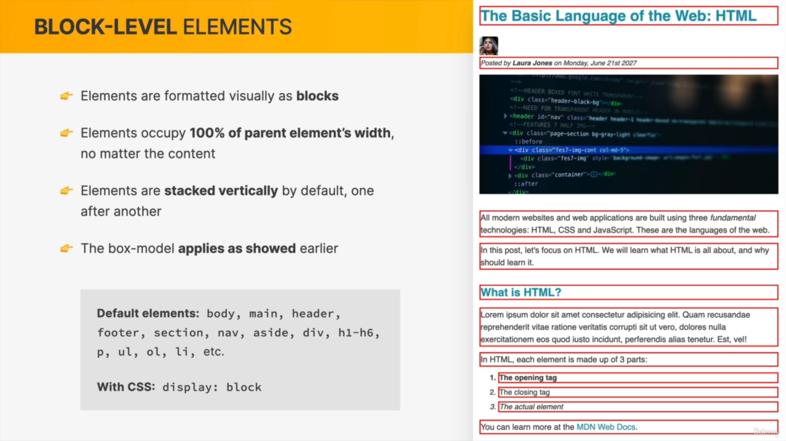
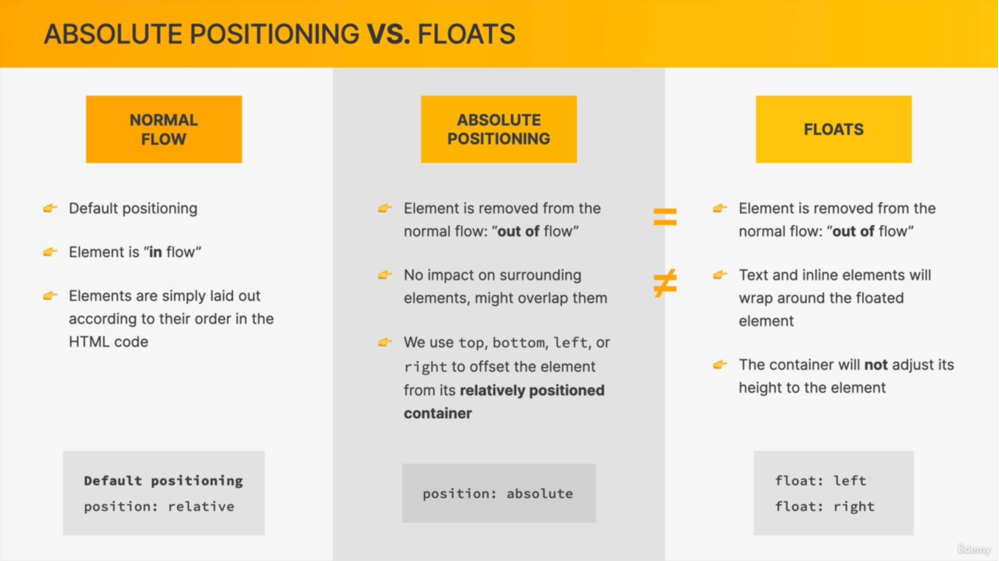

## 📘Information
1. HTML : Content Display/ Structure
2. CSS : Style & Design
3. Always follow Separation of concern like write css in css files and js in js files for good practice
4. **kebab case** mostly use in CSS example **main-heading**
5. Real world we mostly use classes instead of id for future use
6. Always use Vector Images (SVG)
7. For Icons [PhosphorIcons](https://phosphoricons.com/) [HeroIcons](https://heroicons.com/)
8. Fallback Mechanism : means if one thing is fail then other will handle example

```css
* {
    font-family: 'Franklin Gothic Medium', 'Arial Narrow', Arial, sans-serif;
}
/* if first font  does not exist then it will check for next and so on... */
```

---

# 📔Html

1. Block/Inline element
* **Block Element** : Which takes **100% width** example **form, div, header, footer, section, aside, nav, main, article or all Semantic tags**
* **InLine Element** : which takes **content width** example **a , span, button, all inputs**
* **⚠️Note :** To check the weather element is block or inline use **Border Style Property**

2. **Page layout** :
   1. Semantics tags : like header,footer etc its a good practice and always use
   2. Non-semantic tags : like div or span

3. **Paths**
   1.  **Absolute Path** : cdn links is called absolute path.
   2.  **Relative Path** : Reference to current files/folder is called relative path.

4. **Number System** :
   1. Decimal : Means Dec means 10 digits (0-9), in mathematic we use decimal system example 2534161 etc
   2. Binary : Means Bin means 2 digits (0-1), in computer sci we use Binary system example 1001001010
   3. Hexadecimal : Means Hex means 6 and dec mean 10, means 16 digits [0-9, A-F] so we can write from 00 to ff example #00ff00 (green)  #ff0000 (red) #0000ff (blue)
---


# 📔CSS

## 📘How we select and style element


---

## 📘Various types of CSS

1. Inline
2. Internal
3. External

---

## 📘Styling-Text
* Serif : Has Edges
* Sans Serif : has not Edges (best one)

```css
h1 {
    font-family: sans-serif;
    font-size: 18px;
    text-transform: uppercase;
    text-decoration: none;
    line-height: 10px;
    font-style: italic;
}
```
---

## 📘Aligning Only Text

* it will only align the text not the other elements like div etc

```css
h1 {
    text-align: right;
    text-align: center;
    text-align: left;
    text-align: justify;
}
```

---

## 📘Selectors

1. Simple Selectors
| Sr No | Name               | Selection Criteria                  |
| ----- | ------------------ | ----------------------------------- |
| 1     | Universe Selector  | * (asterisk symbol)                 |
| 2     | Class Selector     | . (dot symbol)                      |
| 3     | id Selector        | # (hash symbol)                     |
| 4     | Element Selector   | name of element (body, p, h1)       |
| 5     | Multiple Selectors | h1, h2, h3, p, li {  color: green;} |


2. Advanced Selectors

| 6     | Attribute Selectors | input\[type="text"] will select on  the basis of attribute                               |
| 7     | Nested Element      | div p (selecting  all p element which exist in div)                                      |
| 8     | Direct Child        | div > p (it will select only those elements which are direct)                            |
| 9     | Adjacent Selectors (like sibling)  | h1 + p (it will select all only those p elements which are immediately after h1 elements) |
| 10    | Pseudo-Classes      | : (colon symbol)                                                                         |
| 11    | Pseudo Element      | :: (double colon) ,   it will create new element after or before the selected element    |


1. **Attribute Selector**

```html
<style>
    .input[name="firstName"] {
        border: 2px solid red;
        padding: 10px;
    }
</style>
<input type="text" class="input" name="firstName" placeholder="Enter your name">
<input type="text" class="input" name="lastName" placeholder="Enter your last name">
```


2. **Nested Selectors**

```html
<style>
   /* background color will apply on all p elements */
    div p {
        background-color: #f4f4f4;
    }
</style>


<div>
    <p>Lorem ipsum dolor sit amet consectetur adipisicing elit. Fugiat, inventore.</p>
    <ul>
        <li>
            <p>item 1</p>
        </li>
        <li>item 2</li>
        <li>item 3
        </li>
    </ul>
    <p>Lorem ipsum dolor sit amet consectetur adipisicing elit. Fugiat, inventore.</p>
</div>
<p>Lorem ipsum dolor sit amet consectetur adipisicing elit. Fugiat, inventore.</p>
```

3. **Direct Child**
```html
<style>
   /* background color will apply on all p elements */
    div > p {
        background-color: #f4f4f4;
    }
</style>


<div>
<!-- Background Color apply here -->
    <p>Lorem ipsum dolor sit amet consectetur adipisicing elit. Fugiat, inventore.</p>
    <ul>
        <li>
            <p>item 1</p>
        </li>
        <li>item 2</li>
        <li>item 3
        </li>
    </ul>
    <!-- Background Color apply here -->
    <p>Lorem ipsum dolor sit amet consectetur adipisicing elit. Fugiat, inventore.</p>
</div>
<p>Lorem ipsum dolor sit amet consectetur adipisicing elit. Fugiat, inventore.</p>
```

4. **Adjacent Selector** (Like a sibling)

```html
<style>
    div+p {
        background-color: #f4f4f4;
    }
</style>
<div>
    <!-- It will not work here because its a child not a sibling -->
    <p>Lorem ipsum dolor sit amet consectetur adipisicing elit. Fugiat, inventore.</p>
    <ul>
        <li>
            <p>item 1</p>
        </li>
        <li>item 2</li>
        <li>item 3
        </li>
    </ul>
    <p>Lorem ipsum dolor sit amet consectetur adipisicing elit. Fugiat, inventore.</p>
</div>
<!-- It will work here only -->
<p>Lorem ipsum dolor sit amet consectetur adipisicing elit. Fugiat, inventore.</p>
```

3. **Pseudo-Classes**
* These classes are work on all elements like p, headings etc but it should always exist with in the select element eg in below we have selected article element

```css
/*Selecting First element*/
article li:first-child {
    color: red;
}

/*Selecting last element*/
article li:first-child {
    color: red;
}

/*Selecting nth/any element
selecting first
*/
article li:nth-child(1) {
    color: red;
}

/* Selecting Second */
article li:nth-child(2) {
    color: red;
}

article li:nth-child(odd) {
    color: red;
}

article li:nth-child(even) {
    color: red;
}

article li:hover {
    color: green;
}
```

4. **Pseudo Elements :** these are use to create new element also before or after the selected element

1. ::first-letter
2. ::first-line
3. ::after{content  : "Text Here", color : red, font-size:10px}
4. ::before{content  : "Text Here", color : red, font-size:10px}

---

## 📘Specificity (Associativity)

**id > Class > Element**


---

## 📘Inheritance

1. Inheritance by using **body element**


```css
body {
    color: red;
    font-family: sans-serif;
    font-size: 10px;
    /* This will not apply on all elements, it will apply on body element */
    border : 2px solid red;
}
```


2. Inheritance by using **Universal Multi-Selector**

```css
* {
    color: red;
    font-family: sans-serif;
    font-size: 10px;
    /* this property will applied*/
    border: 2px solid red;
}
```


---

## 📘Color
* We always use **hexadecimal** colors, and rgb when we need **transparency**
```css
body {
    /* Names */
    color: red;

    /* Regular REB Model*/
    color: rgb(1, 1, 1);

    /* RGB with transparency ("alpha")*/
    /* opacity : 0.6        values from 0 - 1 */
    background-color: rgba(255, 0, 0, 0.6);

    /* Hexadecimal Notation*/
    color: #474638;
}
```

**⚠️ Note :** **rbg(0, 0, 0) / #000000 / #000** are same thing

---


## 📘Background

```css
body {
    background-image: url("./test.jpg");
    background-size: cover;
    background-repeat: no-repeat;
    background-position: center center;
}
```
---

## 📘Box-Model and Box-sizing


For Width


For Height


* There is always **margin and padding** by default on elements such as h1, p, etc., in every browser.
* To Eliminate this issue we us **CSS Reset**.
* After using this we have to set margin and padding for each elements.
```css
/* Called CSS Reset */
*,
*::after,
*::before {
     /* to reset all width (best one)*/
    box-sizing: border-box;
}

* {
    /* Removing padding in body*/
    padding: 0;

    /* removing margin from view port/ Browser Window*/
    margin: 0;
}
```


**⚠️ Note :** All above properties are placed in **multi-selector** instead of body because it will apply on each and every element otherwise it will apply to body only, as we know only **text-properties** are inheritance.


* Padding & Margin Short-Hand
```css
body {
    /* Top Left Bottom Right */
    padding: 10px 20px 10px 20px;

    /* Top/Bottom Left/Right */
    padding: 10px 20px;
}
```

**⚠️ Note :**
1. ul/ol element has by default **40px padding**

2. When we have two margins that occupied the same space only one of them is actually visible on the page and that is usually the larger of the two and this phenomena is called **collapsing margins** lets say one element has 40px margin-top and one has 20px margin bottom then distance between two margin will be 40px not 65px
---

## 📘Dimensions
1. Height : px/auto
2. width : px/%

---

## 📘Units

* px
* % : to parent element
* em : font size of parent element. (font size of the parent, in the case of typographical like font-size, and font size of the element itself, in the case of the other properties like width)

```html
 <style>
    #container {
        font-size: 10px;
    }

    #btn {
        display: inline-block;
        /* This io depend upon parent */
        font-size: 2em;
        
        /* This is depend upon itself */
        width: 10em;

        /* This is depend upon root */
        width: 10rem;
    }
</style>
 <div id="container">
    <button id="btn">Click Button</button>
</div>
```

* rem : to font size of root element (mostly use this and belongs to  root element : html)
* vw : to 1% of viewport width
* vh : to 1% of viewport height


**⚠️Note :**
* em and rem units depends upon font-size property
* by default **font-size** of html is **16px**

---
## 📘Block-Inline

* **Block Elements :**
1. Are those elements which takes whole width example **li, div, p, h1** and create line breaks after them.
2. We can apply margin, padding, positions like top, right etc.

```css
#box{
    display : block;
}
```



* **Inline Elements :**
1. Are those elements which does not take whole width instead only takes element/content width example **img, a, strong**
2. We cannot apply margin-top/bottom, padding-top/bottom, positions like top, right etc

```css
#box {
    display: inline
}
```


* **Inline-Block** :
1. this will create element block and inline element in which will not take whole width
2. We can also apply margin-top/bottom, padding-top/bottom, positions like top, right etc

```css
#box {
    display: inline-Block;
}
```


**⚠️Note :** **img** elements are inline-block elements, so margie-top/bottom & padding-top/width also width-height will work on it

---


## 📘Position values

[Position-Reference](https://www.youtube.com/watch?v=MxEtxo_AaZ4)

1. Static : Not Effected by Top, Bottom, Left, Right and z-index properties
2. Relative : tblr value cause element to be moved from its **normal position** (itself position)
3. Absolute : Positioned relative to its parent element that is positioned **relative**. If we does not provide relative to its parent then it will take **body** is reference.
4. Fixed : Position relative to the **viewport** (browser)
5. Sticky : Positioned based on scroll position




**⚠️Note :** **z-index** property play role in positions. it decides the stack level of elements.

---

## 📘Page-Layouts


1. **Float Concept** : by using float the element will out of flow from normal flow just like absolute position concept


Solution For this example : by clear float from both the sides

```html
<!-- Example 1 -->
 <style>
    header {
        background-color: red;
        padding: 20px;
    }

    .heading-primary {
        float: left;
    }

    .heading-secondary {
        float: right;
    }

    /* This is use to fix the problem of flow out */
    .clear {
        clear: both;
    }
</style>

<header>
    <h2 class="heading-primary">Heading Primary</h2>
    <h2 class="heading-secondary">Heading Secondary</h2>

    <!-- We have to use this all the time to fix the out of flow issue-->
    <div class="clear"></div>
</header>


<!-- Example 2 -->
 <style>
    header {
        background-color: red;
        padding: 20px;
    }

    .heading-primary {
        float: left;
    }

    .heading-secondary {
        float: right;
    }

    .clearFix::after {
        content: "";
        clear: both;
        display: block;
    }
</style>

<header class="clearFix">
    <h2 class="heading-primary ">Heading Primary</h2>
    <h2 class="heading-secondary">Heading Secondary</h2>
</header>
```

2. **Flex-box**

[CSS-Best-Tutorial](https://www.youtube.com/watch?v=phWxA89Dy94)


* **align-content :** alignment of space between and around the content along cross-axis
* **flex-grow :** how much a flex item will grow relative to the rest of the flex items if space is available (use full when we items width is not exist or less than container width)

```html
<!-- Flex Grow Example but with container width -->
<style>
    #container {
        background-color: #f4f4f4;
        /* this is initial width */
        width: 600px;
        height: 200px;
        display: flex;
        flex-direction: row;
    }

    .box {
        /* we are not providing any width to any items */
        padding: 10px;
    }

    .box1 {
        background-color: brown;
        /* box -1 will take automatically width according to ratio */
        flex-grow: 1;
    }

    .box2 {
        background-color: blue;
    }

    .box3 {
        background-color: green;
        /* setting width for box-3 */
        flex-basis: 200px
    }
</style>
<div id="container">
    <div class="box box1">Box - 1</div>
    <div class="box box2">Box - 2</div>
    <div class="box box3">Box - 3</div>
</div>
```


```html
<!-- Flex grow example but without container width  -->
 <style>
    * {
        padding: 0;
        margin: 0;
        box-sizing: border-box;
    }

    .box {
        /* this is initial width for all boxes */
        width: 150px;
        height: 50px;
        background-color: #f4f4f4;
        border: 2px solid #ccc;
        border-radius: 6px;
        padding: 10px;
    }

    .container {
        display: flex;
        flex-direction: row;
    }

    .box-1 {
        /* In box-1 case it will take whole remaining width (because we use div element in container which is 100%) and while resizing the browser window it will adjust size */
        flex-grow: 1;
    }
</style>

<div class="container">
    <div class="box box-1">box-1</div>
    <div class="box box-2">box-2</div>
    <div class="box box-3">box-3</div>
    <div class="box box-4">box-4</div>
</div>
```


* **flex-shrink :** how much a flex items will shrink relative to the rest of the items if space is available (use full when items width is greater than container width)

```html
<!-- flex-shrink example with container width -->
<style>
    #container {
        background-color: #f4f4f4;
        /* here container width is 600 px which is less then items width */
        width: 600px;
        height: 200px;
        display: flex;
        flex-direction: row;
    }

    .box {
        padding: 10px;
        /* in flex-shrink case we need to provide width. here items width are greater then container width */
        width: 500px;
    }

    .box1 {
        background-color: brown;
        /* This property when item width is greater than container width, it will not allow to resize or shrink when we set to zero */
        flex-shrink: 0;
    }

    .box2 {
        background-color: blue;
    }

    .box3 {
        background-color: green;
    }
</style>
<div id="container">
    <div class="box box1">Box - 1</div>
    <div class="box box2">Box - 2</div>
    <div class="box box3">Box - 3</div>
</div>
```


```html
<style>
    * {
        padding: 0;
        margin: 0;
        box-sizing: border-box;
    }

    .box {
        width: 150px;
        height: 50px;
        background-color: aliceblue;
        background-color: #f4f4f4;
        border: 2px solid #ccc;
        padding: 10px;
    }

    .container {
        display: flex;
        flex-direction: row;

    }

    .box-1 {
        /* in box-1 case its width will not shrink but other will shrink while resizing browser window */
        flex-shrink: 0;
    }
</style>
<div class="container">
    <div class="box box-1">box-1</div>
    <div class="box box-2">box-2</div>
    <div class="box box-3">box-3</div>
    <div class="box box-4">box-4</div>
</div>
```

**⚠️Note :** 
1. If the container width/height is smaller than the child width/height, the child will always remain fitted within the container until its content length becomes either too short or too long
2. align-self > align-items


* Horizontally each of these elements takes up exactly the space that is necessary for its content. However, vertically things are little different so vertically by default all the flex items are tall as the tallest element


1. **Grid-Box**


* fr : 1frm (fractional, use in grid) it will shrink and grow in same proportion its like flex-grow (will fill all the empty space)

```css
/*
1fr 1fr 1fr 1fr = repeat(4, 1fr) = 1fr 1fr 1fr auto

1fr 1fr 1fr auto (the auto parameter will take remaining with automatically)

*/

.container {
    grid-template-column : repeat(4, 1fr)
}
```

* use height and width for best use to container

---


## 📘Max-width & Min-Width

* Width create horizontal scrollbar

Example :
* When we use **width** in **px** then it will fixed our image size hence responsiveness will not work
* When we use **width** in **%** then it will become responsive but in this case we cannot set fixed size of image up to a particular dimension

```html
<!DOCTYPE html>
<html lang="en">

<head>
    <meta charset="UTF-8">
    <meta name="viewport" content="width=device-width, initial-scale=1.0">
    <title>Document</title>
    <style>
        body {
            font-size: 24px;
        }

        .main {
            margin: 20px auto 0px auto;
            width: 700px;
        }

        .main img {
            width: 100%;
        }

        .main article {
            width: 100%;
            padding: 10px;
        }
    </style>
</head>

<body>

</body>
<div class="main">
    
    <article>
        Lorem ipsum dolor sit amet consectetur adipisicing elit. Voluptas deserunt est culpa, nihil debitis incidunt
        facilis saepe. Atque, tempore praesentium doloremque minima ipsam maiores sunt officia molestiae sint, nam at?
    </article>
</div>

</html>
```
1. When we using px


2. When we using %


3. When we using min/max width

```css
.main {
    margin: 20px auto 0px auto;
    min-width: 300px;
    max-width: 600px;
}
```

in this case our image wil not get bigger in size up to 600px and will not get smaller in size up to 300px  and in between it become responsive and can resize itself


---

## 📘Responsive Design

Using HTML/CSS to make a website or app layout adapt to different screen size

* **Practice To use**

1. Set the viewport/scale
2. Use Fluid widths as oppose to fixed (max-widths)
3. Media-queries - different css styling for different screen sizes
4. Rem units over px
5. Mobile first methods


* Max-width property works with desktop first and **Min-Width** property works with mobile first


* **Concept of max-min width screen**

```css
/* means width is = 600px */
@media(width:600px) {
    body{
        background-color : red
    }
}

/* means width is <= 600px */
@media(max-width:600px) {
    body{
        background-color : red
    }
}
/* means width is >= 600px */
@media(min-width:600px) {
    body{
        background-color : red
    }
}

/* means width is 600px - 700px (width >=600px and width <=700px)*/
@media(min-width:600px) and (max-width:700px) {
    body{
        background-color : red
    }
}
```


* Break Points & Types of media


**Screen Sizes (also called Break points)**

| Sr No | Device Name            | Screen size |
| ----- | ---------------------- | ----------- |
| 1.    | Mobile                 | 480-500px   |
| 2.    | Table                  | 768px       |
| 3.    | Laptop (small screens) | 1024px      |


1. Screen : means it will work for screens only not for print etc

```css
@media only screen and (max-width:500px) {
    .smartphone {
        display: block;
    }
}
```


---

## 📘Center Div

1. using margin auto

```css
 #container {
    margin: auto;
    max-width: 930px;
}
```

2. Using Flex Box

```css
body {
    height: 100vh;
    width: 100vw;
    display: flex;
    justify-content: center;
    align-items: center;
}
```