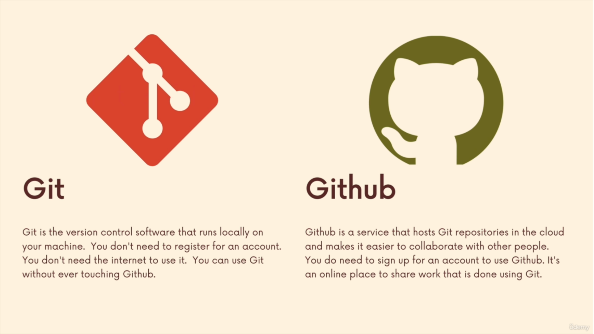

## 📘What is Git ?	
1. it is Distribution version Control System (to keep tracks of files) 
2. it's system that records changes to our files over time 
3. we can recally specfic versions of those files at any given time
4. Many people can easily collaborate on a project and have their own version project files on their computer 
5. Full form of GIT **Global Information Tracker**

> and main advantages of this

* Easily recovers files 
* Who intrduce issue and when
* RollBack to previous working state
* it is based on Distribution System 
* It capture sanpshot not the difference
* Almost every operation is local 
* Git has integrity (Check sum (is used to check the origniality (kind of public and private key))) 
* Git Generaly only adds data (increasing Reposirtoy)

---

## 📘What is GitHub 

* it is git is website which store the git hub repository
* it is not just a cloud storage but a full version control System powered by git.
* Central online repository which mutiple team-members could access 
* github alternatives are gitlab, bitbucket 

---

## 📘Git-Architecture
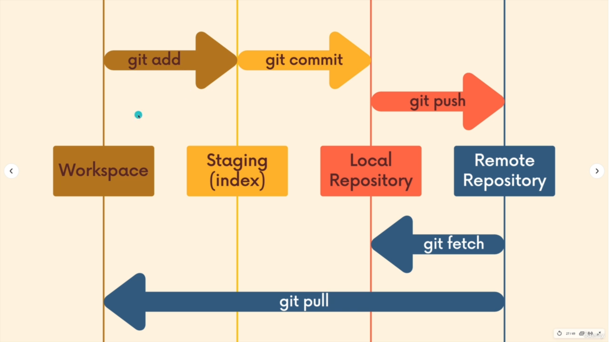

---


## 📘Download Git

Downlaod : type git install ( web site name : git-scm) <br/>
gitbash (called terminal or powershell)   :  it is command line Tool

---

## 📘Configuration of Username and Email  
1. To set the username 

```
git config --global user.name "Deepinder Singh" 
```	
2. To set the email address
```
git config --global user.email "Deepinder999@gmail.com"  
```
3. return the usernane 
```
git config user.name
```
4. return the email 
```
git config user.email
```
5. return Username and Email address + other infromations
```
git config --global --list
```
6. return the current version of git 
```
git version
```
---
## 📘Linux Commnds 
1. Return Present Directory path 
```
pwd
```
2. Return the list of all the files and directory in current Directory
```
ls
```
3. Change Directory example cd shortName/ (move to shortName Directory)
```
cd
```
4. Create blank file in directory example touch error.log
```
touch fileName
```
5. This is used to rename the files and also add into stage area 
```
git mv first.txt first_rename.txt
```
6. To delete the file
```
rm fileName
```
7. To delete the directory 	
```
rmdir folderName
```
8. To delete the directory or file
``` 
rm -rf folderName/fileName
```
9. Open Folder or Current Directory (in window)
 
```
start .
```
---
## 📘Initialisation

1. will create git Directory

```
git init
```
2. to delete git Repository 
```
rm -rf .git
```	
3. to delete file and also add file into stage area

```
git -rm fileName
```
---

⚠️ **Note :** Never create **git repo** inside another **git repo**

## 📘Status	
1. Return the current directory status like staging , branch details 

```
git status
```
---
## 📘Staging


1. Put all the files into staging area
```
git add --a / git add .
```
1. put particular file (name is first.txt) into staging area

```
git add first.txt
```	
3. **Unstage or even discard** uncommitted local changes. (work when your file)
```
git restore filename
```
```
git checkout HEAD fileName
```

4. it will **remove** particalur file from **stagging area** (work when your file is in stagging area)
```
git restore --staged fileName
```
5. it will remove all the file from stagging area (work when your file is in stagging area)
```
git restore --staged .
```
6. remove the file from the stagging area
```
git rm --cached fileName
```
7. git clean removes untracked files from your working directory.
```
git clean -f
```
---

## 📘Commit
1. use to commit the staging area with commit Message
```
git commit -m "Initial Commit" 
```
2. use to commit the by skipping the stagging the files 

```
git commit -am "Initial commit"
```

1. To fix last commit message 

```
git commit -amend
```
---
## 📘Log

1. Return all the commits in the 
```
git log
```
2. Return the difference between the commits (git log -p command displays the patch representing each commit.)
```
git log -p
```
3. Return the difference between the 2 commits
```
git log -p -2
```
4. Return the difference between the commits very small information
```
git log --stat
```
5. Return all the commits with message and hash (very shot description)
```
git log --oneline
```
6. Return all the commits with message and hash (shot description)
```
git log --pretty=oneline
```
7. Return all the commits with message and hash (full description)
```
git log --pretty=full
```
8. Return the 2 days work 
```
git log --since=2.days
```
9. Return the 2 months work
```
git log --since=2.months
```
10. use to change the commit data ->after this command window will open called wim editior -> Change any thing that you want to do -> esc (key) -> ':wq' + enter
```
git log --amend
```
---

## 📘 GitIgnore

**.gitignore** this file ignore all files or directory which are written in this file  
1. ***.log :** will ignore any files with **.log** extension
2. **folderName/ :** will ignore an entire directory
3. **.DS_Store :** will ignore files named **.DS_Store**
4. **/folderName/ :** this will ignore only outer folder(main Directory) not the inner folders (other than main directory)
5. **folderName/folderName/ :** this will ignore only particalur folder 

⚠️**Note :** Gitignore ignore all the blank folder by default 

---

## 📘Branch


1. Create new branch
```
git branch branchName
```
2. to create new branch and checkout to new branch
```
git switch -c branchName
```
```
git checkout -b branchName
```
3. Switch to another branch
```
git switch branchName
```
```
git checkout branchName
```	
4. Return all the names of branches 
```
git branch
```	
5. use to delete the branch no matter its merge or not 
```
git checkout -D branchName
```
6. wiil delete merge branch (if branch is not merge it will show error message)
```
git branch -d branchName
```
---

7. Rename the branch (switch to branch first) 

```
git checkout test
git branch -m new-test
```
---

## 📘Merging
⚠️**Note :** when ever you want to merge branch in a particalur branch you have to go in that branch first for example you want to merge 'test-mail' branch into 'master' branch so you have to go first in master branch then make a requst to merge like -> git merge test-mail

1. it will merge the branch to master branch (if conflict occur it will ask you to accept incoming changes and current changes )
```
 git merge branchName
```
**Steps :** 
1. Git checkout master
2. git Pull
3. git checkout branchName
4. doing codes all the things etc 
5. git checkout master 
6. git merge branchName

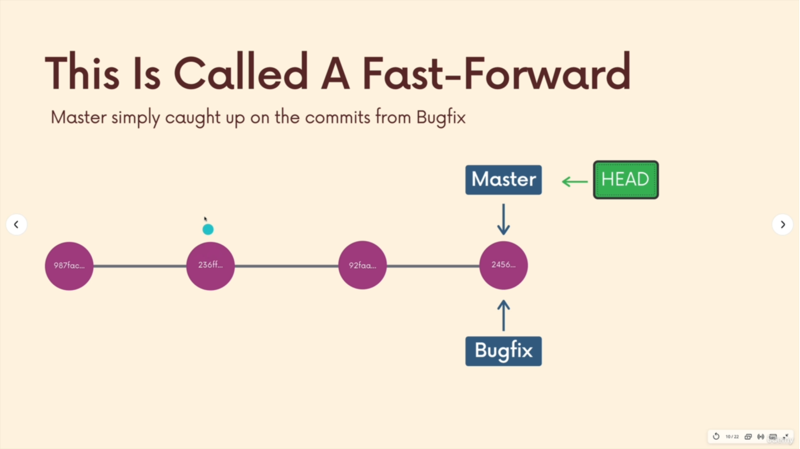
* in **fast forward** merge we did not commit any thing on **master** branch just only commit in **child branch** and then merge that barnch

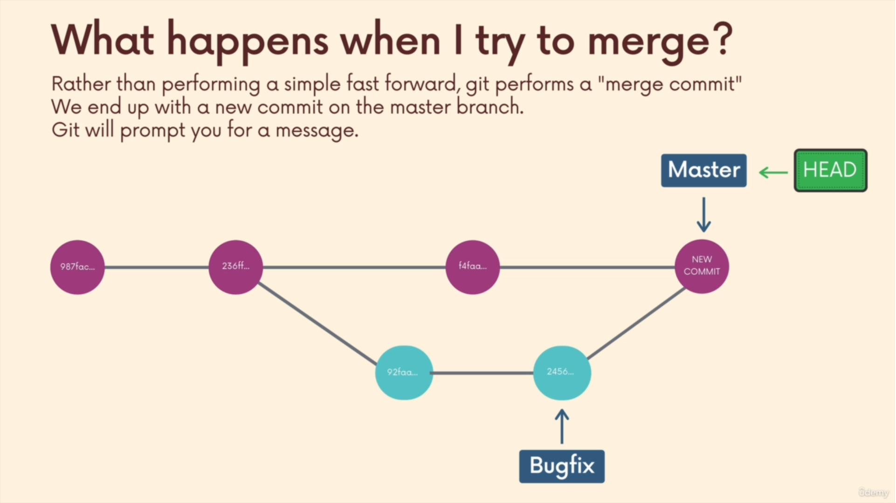
* In **Merge Commit** we did commits in **master** branch as well and commit in **child branch** as well, then **git** automatically merge both commits when ever we do **merge**

## 📘Merging Conflicts & Resolves

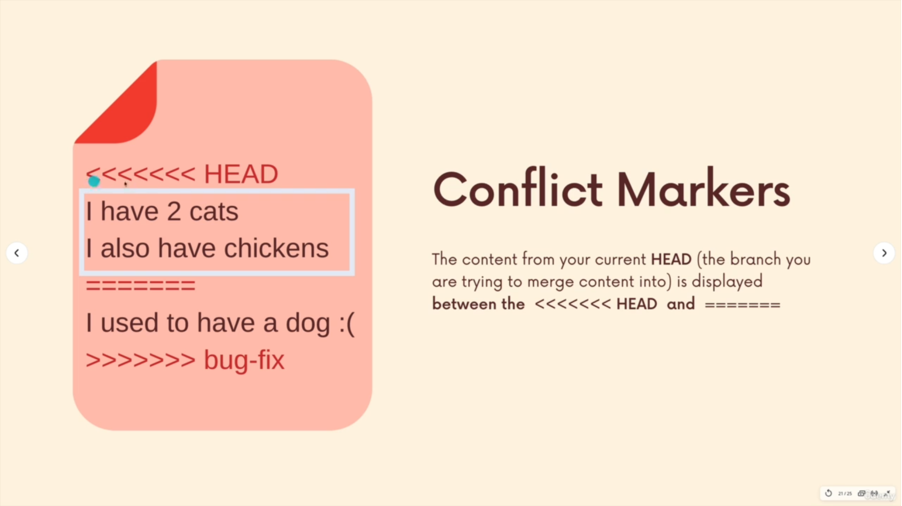

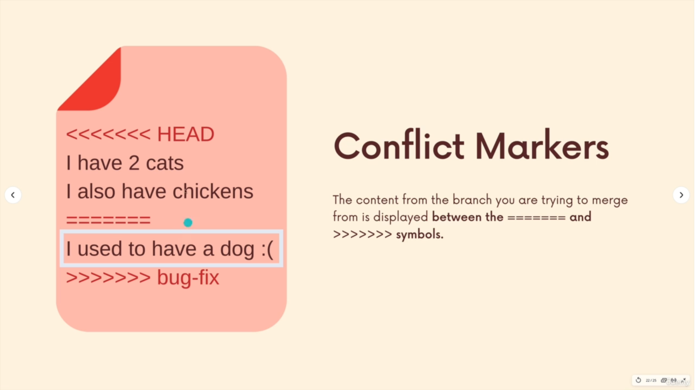

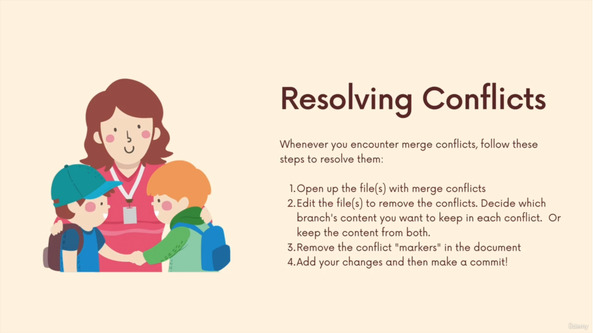

---

## 📘HEAD
1. Show the last commit detail with commit id
```
git show Head
```
2. Show the last commit detail with commit id
```
git show gitCommitId
```
---
## 📘Difference
1. Return the difference between the stage area and working directory (modified area (changes done after staging)) and also command compares two specified branches		
```
git diff
```	

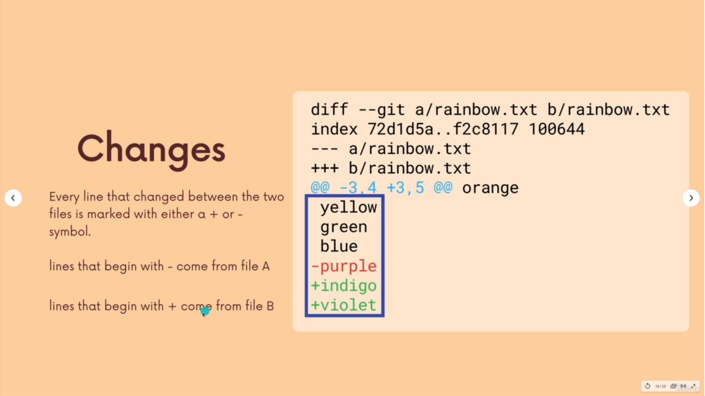

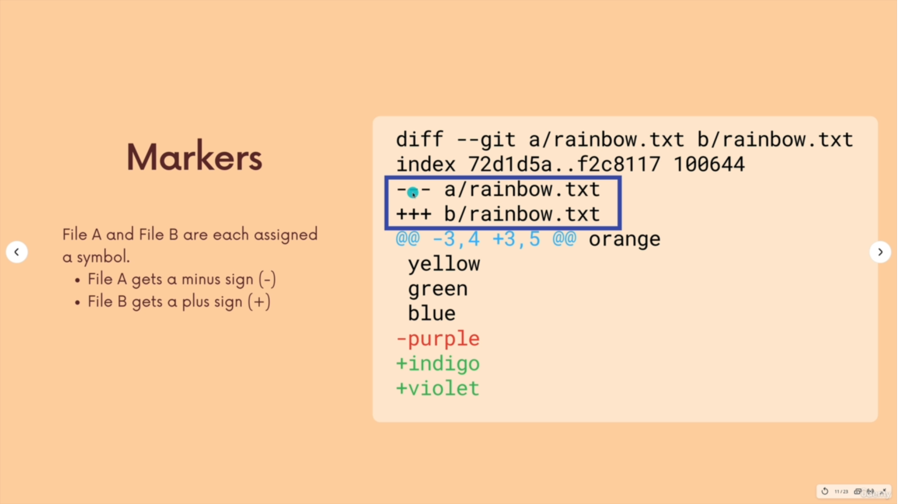

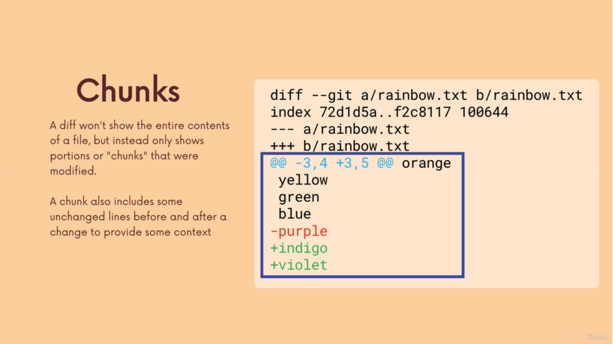

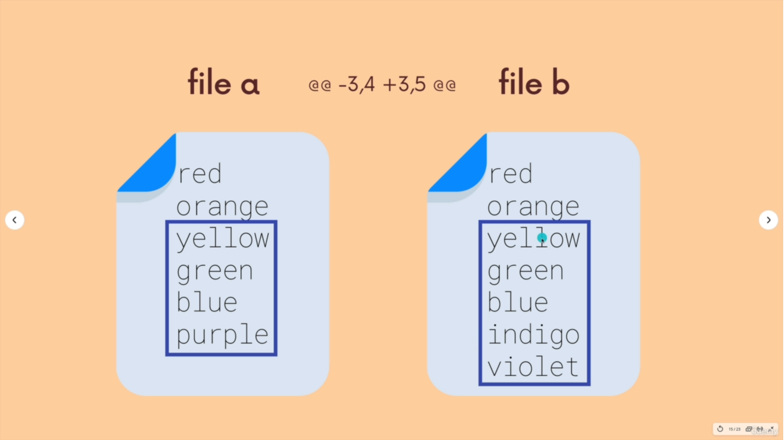

1. Return the difference between the two stages
```
git diff --staged
```
```
git diff --cached
```
   
2. To see particular stagged files difference

```
git diff --staged fileName
```

3. List all changes in the working tree since your last commit
```
git diff HEAD
```

1. Return the difference between two commits with two windows 
```
git difftool gitCommitId gitCommitId
```
1. Return the difference between two commits with two windows  	
```
git difftool HEAD gitCommitId
```
---

## 📘Stash

1. **git stash** is super useful command that helps you save changes that you are not ready to commit. you can stash changes and then come back to them later. 
*Running git stash* will take all uncommitted changes (staged and unstaged) and stash them, reverting the changes in your working copy. 

```
git stash
```

1. This command is use to remove the most recently stashed change in your stash and **re-apply** them to your working copy.

```
git stash pop
```
2. this command is use to **apply** whatever is stashed away, without removing it from the stash.*This can be useful if you want to apply stashed changes to multiple branches*
```
git stash apply
```

3. To view all stash

```
git stash list
```
4. To Delete **recent** stash

```
git stash drop
```
5. To delete **all** Stash

```
git stash clear
```
---

## 📘Checkout

```
git checkout d8973d79
```
```
git switch master
```
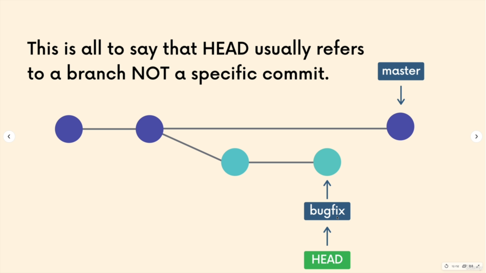

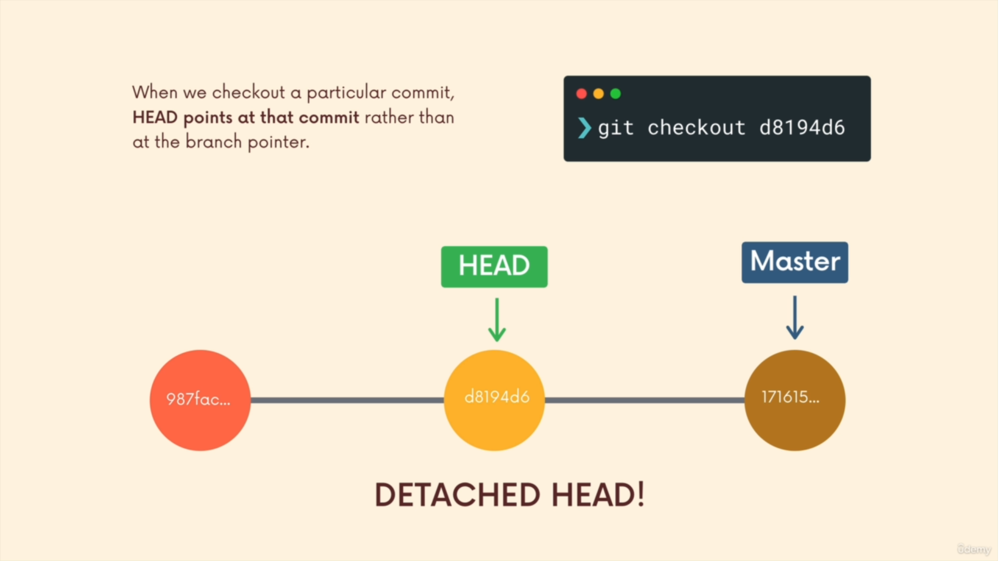

```
git checkout HEAD~1
```
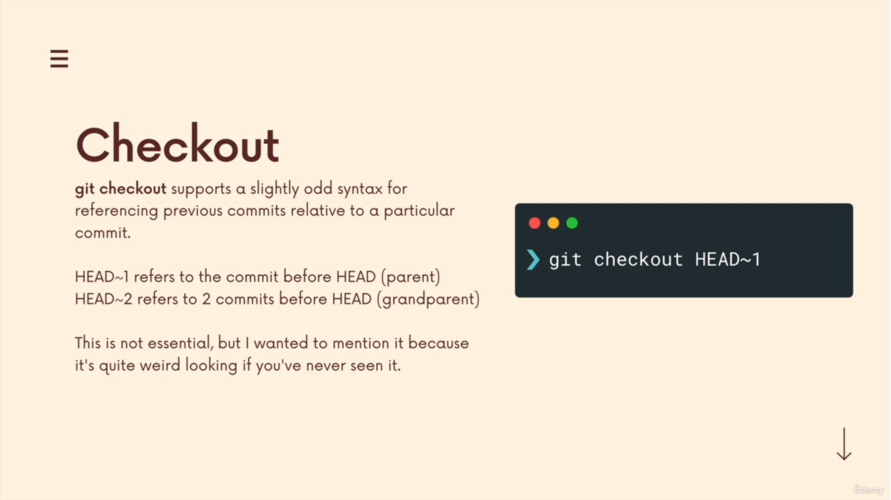

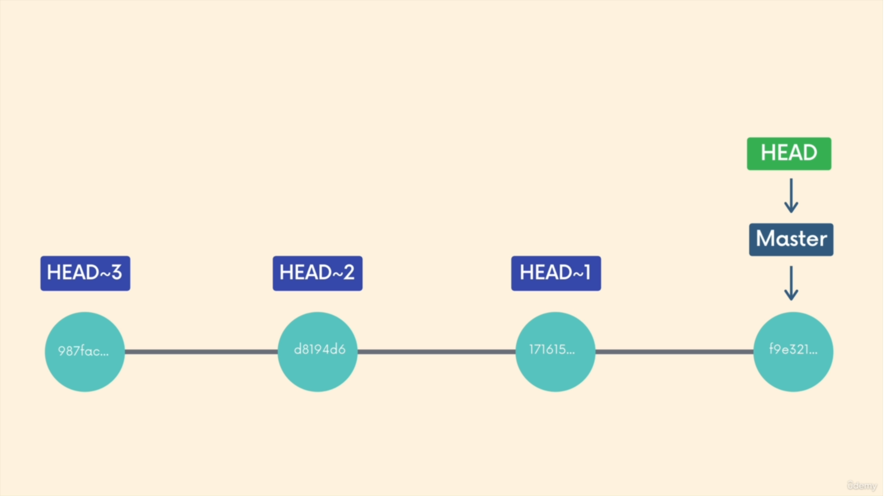
---

## 📘Undo Change (Reset & Revert)

Suppose you've just made a couple of commits on the master branch, but you actually meant to make them on a seperate branch instead. To undo those commits, you can use **git reset**

1. This command will reset the repo back to a sepecific commit. The commit are gone. *(we don't lose the changes we lose the commits)*
```
git reset <commit-hash>
```
2. if you want to undo both the commits AND the actual changes in your files, you can use the **--hard** option

```
git reset --hard HEAD~1
```
```
git reset --hard <commit-id>
```

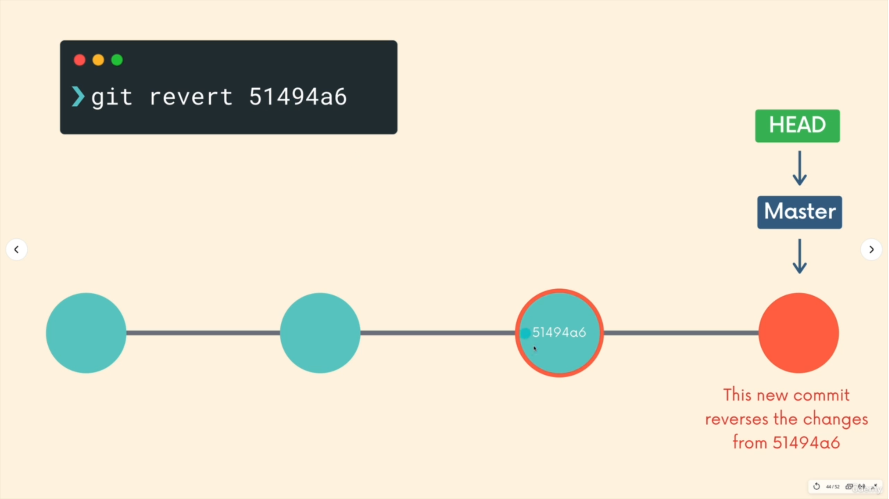

3. **git revert** instead creates a brand new commit which reverses/undos the changes from a commit. Because it results in a new commit, you will be prompted to enter a commit message.

```
git revert 5637353
```
⚠️ **Note :** 
* *if  you want to reverse some commites that other people already have on their machines, you should use revert.*
* if you want to reverse commits that you haven't shared with others, use reset and no one will ever know!  

---

## 📘Clone
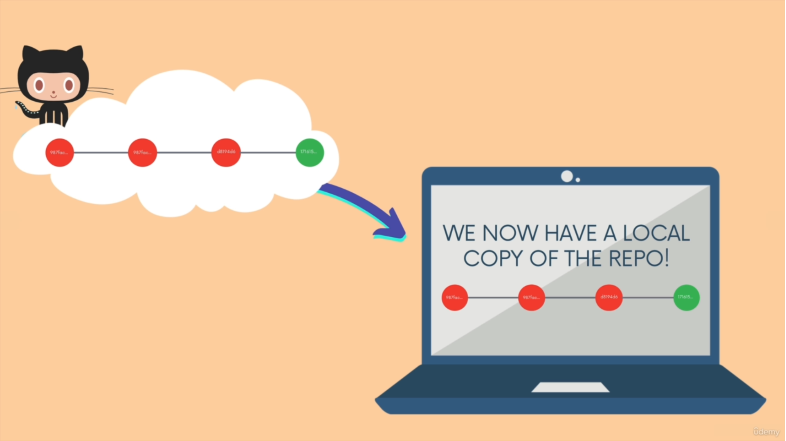

we can clone a remote respository hosted on Github or similar websites. All we need is a URL that we can tell git to clone for use.

```
git clone <repository-Address>
```
---

## 📘SSH-Keys
* You need to be authenticated on github to do certian operations, like pushing up code from your local machine. your terminal will prompt you every single time for your github email and password, unless
* You generate and configure an SSH key! Once configured, you can connect to github without having to supply your **username/password**


1. Go to base directory first

```
cd ~
```
2. Change Directory 

```
cd .ssh
```
3. List all the keys
* test_rsa : **private key**
* test_rsa.pub : **public key**
 
```
ls
```
4. Generate Key

```
ssh-keygen -f test_rsa
```
* then hit enters again and again

5. Add private key into your system

```
ssh-add ~/.ssh/test_rsa
```

6. Copy Public key and Paste into Git Key section

```
cat test_rsa.pub
```
* Example like this then copy this command and paste into git ssh key section

```
ssh-rsa AAAAB3NzaC1yc2EAAAADAQABAAABgQC1rp765Vk6e6KICDaHMJCySMohSzfFKNPzR/lS7kB0A4l1ebpXB3Zdt61PkxYk7QhS7hV1rRQT3WNkDytZZYF6EuFD4fm3n3Gg17yaAi8BaUTuUkqUBkwthEbBUhYNaux.......
```
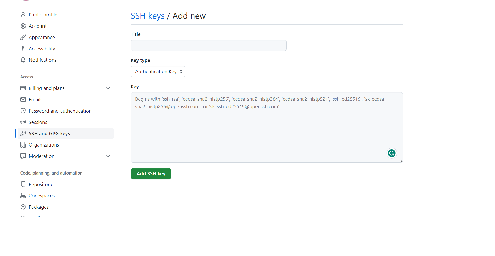

---

## 📘Remote

1. it a label name
```
git remote -v
```
* Example

```
origin  https://github.com/DeepuBhasin/Web-Developer-Notes.git (fetch)
origin  https://github.com/DeepuBhasin/Web-Developer-Notes.git (push)
```
2. Adding a New Remote (origin is a conventional git remote name, but it is not at all special)

```
git remote add <name> <url>
```

```
git remote add origin https://...........
```

⚠ **️Note :** most of the commands you will get after creating *new repository*.

---

## 📘 Push or Pull

1. Push Command
```
git push origin <branch-name>
```
2. Pull command
```
git pull origin <branch-name>
```
3. The -u option, Running **git push -u origin master** sets the upstream of the local master branch so that it tracks the master branch on the origin repo.

```
git push -u origin master
```
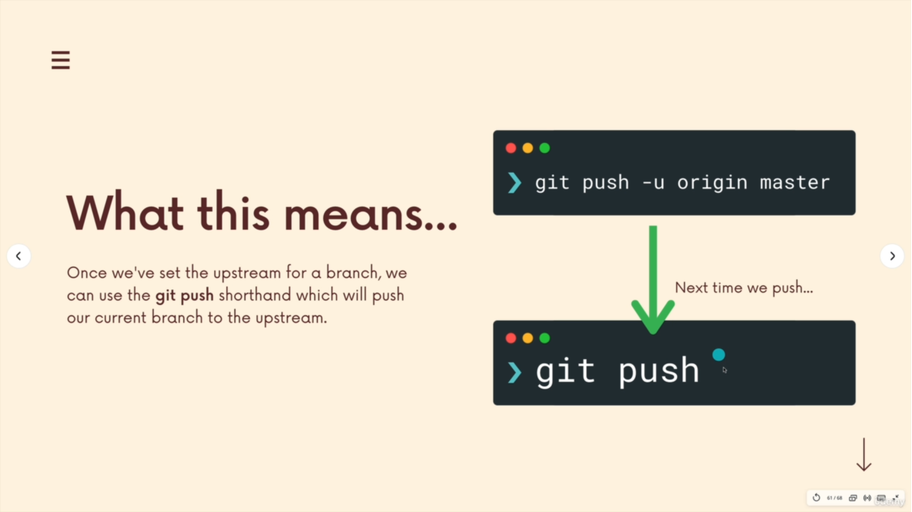
---
## 📘Tracking Branches
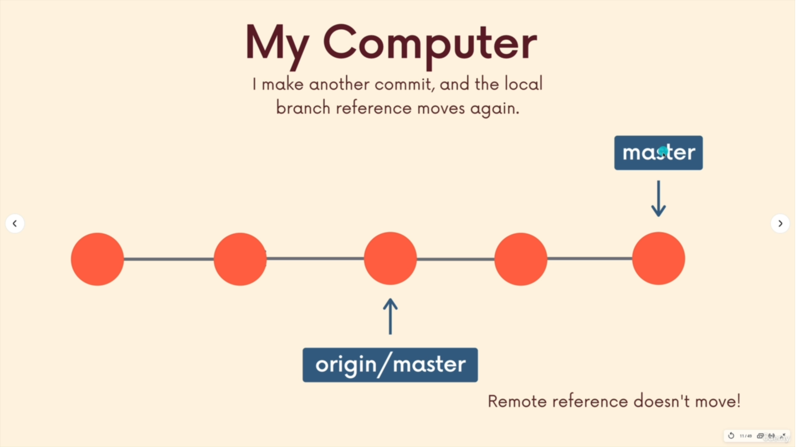

1. Return all server branches
```
git branch -r
```
2. Will help to switch into another branch, basically **git switch puppies** makes me a local puppies branch AND set it up to track the remote branch **origin/puppies** . *This command is very easy*
```
git switch puppies
```
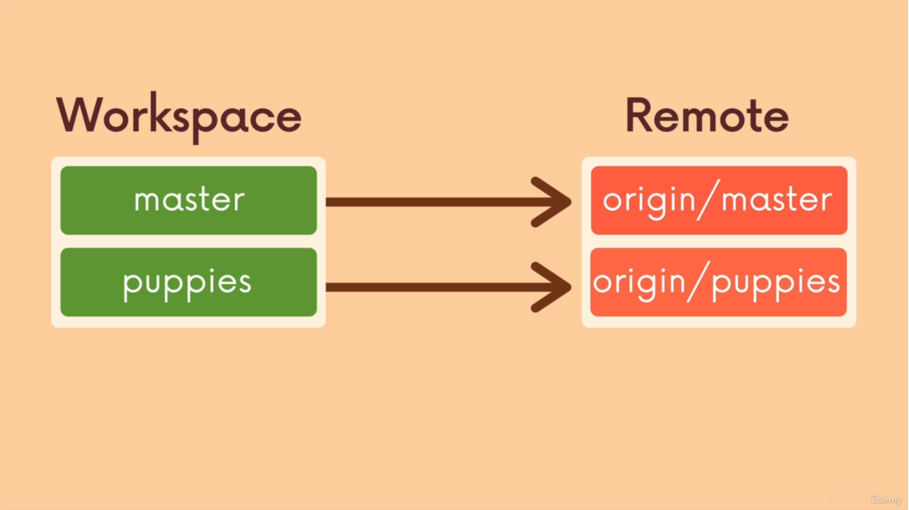

```
git checkout origin/puppies
```
---

## 📘Fetching Vs Pulling


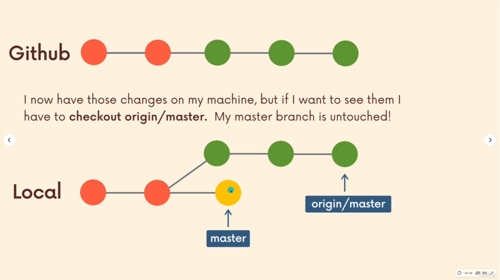


1. **Fetching :** Fetching allow us to download changes from a remote repository, but those **changes will not be automatically intergrated** into our working file. *git fetch origin* OR *get fetch remote* & then you have to use **git merge** command to merge all changes

```
git fetch origin master
```
```
git merge <localbranch>
```
---

2. **Pulling :** git pull is another command we can use to retrieve changes from a remote repository. Unlike fetch, pull actually updates our HEAD branch with whatever changes are retrieved from the remote. *"go and download data from Github And immiediately update my local repo with those changes"*. **git pull = git fetch + git merge**

* it matters where we run this command from. whatever branch we run it from is where the changes will be merged into. Example **git pull origin master** *would fetch the latest information from the origin's master branch and merge those changes into current branch*.
```
git pull origin branch
```

---
## 📘Other Topics
* Public and Private Repository
  * **Settings** > **Change visibility** (under Danger Zone) 
* **README.md**	: is **text to Html** convertion tool for web writers.
* **Git hub Gists :** are a simple way to share code snippets and uesful fragments with others. Gists are much easier to create, but offer far fewer features than a typical github respository.
* **Github Pages :** are public webpages that are **hosted** and **published via Github**. They allow you to create a website simply bypushing your code to Github.
  * Github Pages is a hosting services for static webpages, so it does not support server-side code like Paython, Ruby or Node. Just HTML/CSS/JS!
  * Very use full for Portfolio
---

## 📘Workflow
* **Centralized workflow** : The Simplest collaborative workflow to have everyone work on the master branch (or main, or any other Single branch)
*  **Feature Branches :** Rather than working directly on master/main, all new development should be done on **separate branches!**. 

* **Fork & Clone :** The "fork & clone" workflow is different from anything we've seen so far. Instead of just one centeralized  Github respository, every developer has their own Github repository in addition to the "main" repo. Developers make changes and push to their own forks before making pull request.
  * It's very commonly used on large open-source projects where there may be thousands of contributors with only a couple maintainers.
  * **Forking :** Github (and similar tools) allow us to create personal copies of other peoples repositories. We call those copies a "fork" of the original.

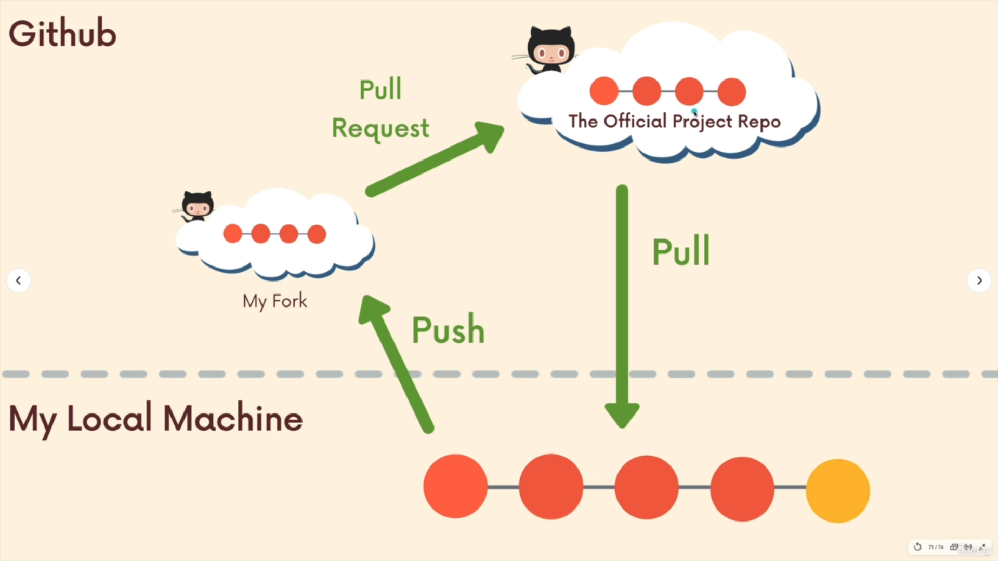

---
## 📘Rebasing 
* There are two main ways to use the git rebase command : 
  * as a **alternative** to merging
  * as **cleanup tool**

* Rebase is also a way of combining the work between different branches. Rebasing takes a set of commits, copies them and stores them outside your repository. The advantage of rebasing is that it can be used to make linear sequence of commits. The commit log or History of the repository stays clean if rebasing is done 
* first go into the branch where you want to start the base of master exmaple checkout into testing branch then exceute the rebase command 
* **difference between merge and rebase is** : in merge command only last commit is merge into parent branch but in rebase command all commit are marge into parent branch


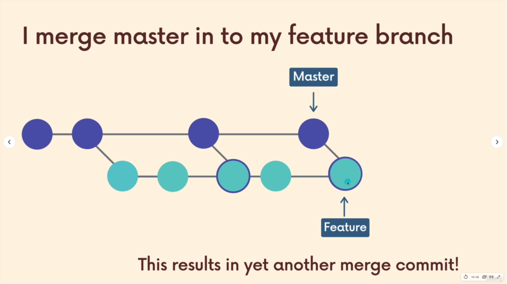
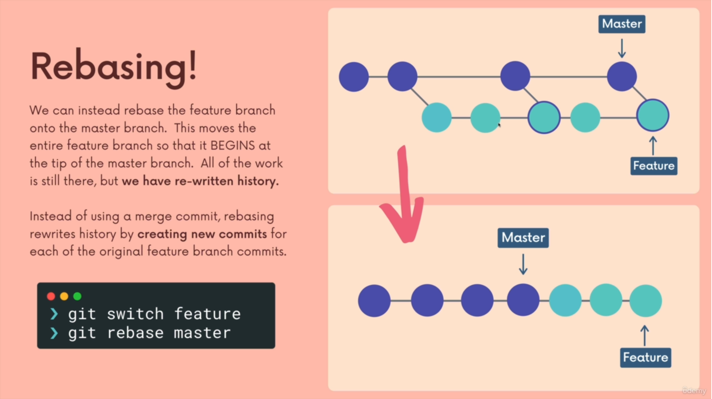

```
git switch feature
git rebase master
```

* **master** branch commit history remain same while **feature** branch commit change

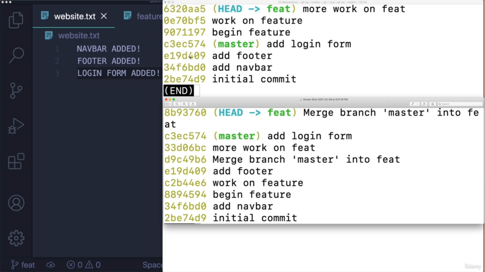

* Suppose we performed a rebase on the **feature branch**. Later, we made additional new commits in the **master branch**. Even in this scenario, we can perform another rebase, and the new commits will be merged afterward.

⚠ **️Note :**
* never **rebase master** branch it will re-write the whole history. 
* Never rebase commits that have been shared with others. If you have already pushed commits up to Github. DO NOT rebase them unless you are positive no one on the team is using those commits.

* This command is use to **undo** rebase
```
git rebase --abort
```
* If conflic occurse while **during Rebase**
1. Resolve the Conflicts

2. Add Files

```
git add fileName

```
3. Continue rebase

```
git rebase --continue
```
---

## 📘 Rewriting History

* Sometimes we want to write, delete, rename, or even reorder commits (before sharing them) we can do this using **git rebase !**

```
git rebase -i HEAD~4
```
* Running git rebase with the *-i* option will enter the interactive mode, which allows us to edit commits, add files drop commits etc. Not e that we need to specify how far back we want to rewrite commits.
* Also, Notice that we are not rebasing onto another branch instead, we are rebasing a series of commits onto the HEAD they currently are based on.

---

## tags 

---

### alias and Vi Editior

	1. vi ~/.bashrc : to open source 2. to save: esc -> : ->wq -> enter
	2. to read all the aliases to currently opened terminal : source ~/.bashrc 
	3. to quit : esc -> : -> q   -> enter
	4. to show all Commands : type : alias -> enter

```	
alias gst="git status"
alias gpl="git pull origin"
alias gst="git status"
alias gpl="git pull origin"
alias gcm="git commit -m "
alias gaa="git add ."
alias ga="git add"
alias virc="vi ~/.bashrc"
alias sorc="source ~/.bashrc"
alias gpu="git push origin"
alias gcb="git checkout -b"
alias gc="git checkout"
alias gb="git branch"
alias gbd="git branch -D"
alias gl="git log"
alias glpo="git log --pretty=oneline"
alias glo="git log --oneline"
alias gs="git stash"
alias gsa="git stash apply"
alias gsl="git stash list"
alias gsc="git stash clear"
alias gr="git reset"
alias grv="git revert"
alias gsk="git commit -am "
alias grh="git reset --hard "
alias grs="git reset "
alias gra="git restore ."
alias gr="git restore "
```
---

## 📘Squash 
* Combining commits into a single Commit

* Example 3 commit from the starting combining into single commit
```
git rebase -i Head~3		
```
* after this command vi editior will open to edit the commit with below commands 

1. '#' -> means ignore 
2. pick 	 -> use the commit
3. reword -> use the commit, but edit the commit message (renaming)
4. edit 	 -> use commit, but stop for amending 
5. Squash -> meld into previous commit
6. drop 	 -> remove commit	
* after that vi editior will open to create commit message 	   
---

## 📘add two account


		1. get the invitaion for the repository Admin 
		
		2. create public and private key -> ssh-keygen idea_rsa	

		3. copy public -> cat idea_rsa.pub
			
		4. Open github account -> setting -> SSH and GPG keys  
			a. click on New SSH key 
			b. Add Title 
			c. Paste Public key -> in key
		
		5. create config file in .ssh folder -> add below Code 

			Host idearepos						// random name 
			HostName github.com 				// host name 
			IdentityFile ~/.ssh/idea_rsa 		// private key path 
			IdentitiesOnly yes					


		4. now suppose this is directory we want to clone  "git@github.com:idea-repos/dcltr.git"

			command will be : git clone git@idearepos:idea-repos/dcltr.git

			directory will clone automatically into a folder 
		
		5. then make code in that dircetory and then push 

			thats it 		


	

	


