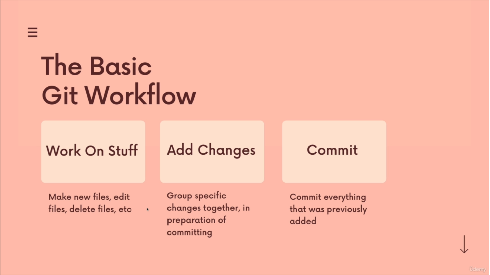
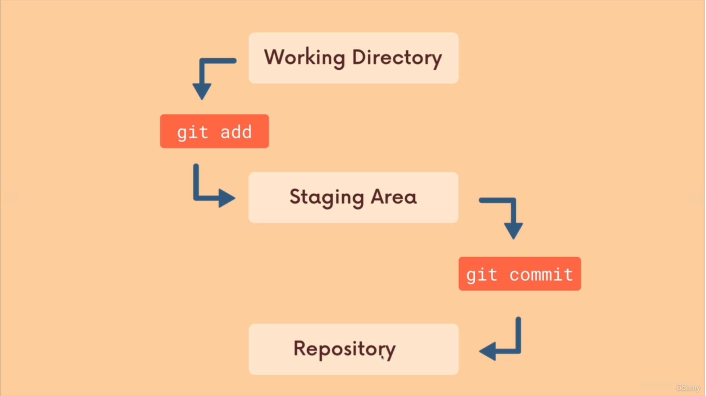
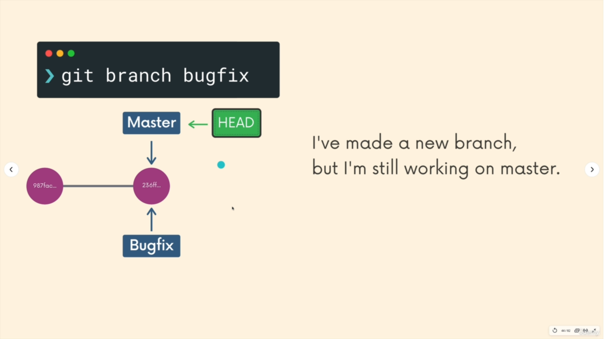

## 📘What is Git ?	
1. it is Distribution version Control System (to keep tracks of files) 
2. it's system that records changes to our files over time 
3. we can recally specfic versions of those files at any given time
4. Many people can easily collaborate on a project and have their own version project files on their computer 
5. Full form of GIT **Global Information Tracker**

> and main advantages of this

* Easily recovers files 
* Who intrduce issue and when
* RollBack to previous working state
* it is based on Distribution System 
* It capture sanpshot not the difference
* Almost every operation is local 
* Git has integrity (Check sum (is used to check the origniality (kind of public and private key))) 
* Git Generaly only adds data (increasing Reposirtoy)

---

## 📘What is GitHub 

* it is git is website which store the git hub repository
* it is not just a cloud storage but a full version control System powered by git.
* Central online repository which mutiple team-members could access 
* github alternatives are gitlab, bitbucket 

---

## 📘Download Git

Downlaod : type git install ( web site name : git-scm) <br/>
gitbash (called terminal or powershell)   :  it is command line Tool

---

## 📘Configuration of Username and Email  
1. To set the username 

```
git config --global user.name "Deepinder Singh" 
```	
2. To set the email address
```
git config --global user.email "Deepinder999@gmail.com"  
```
3. return the usernane 
```
git config user.name
```
4. return the email 
```
git config user.email
```
5. return Username and Email address + other infromations
```
git config --global --list
```
6. return the current version of git 
```
git version
```
---
## 📘Linux Commnds 
1. Return Present Directory path 
```
pwd
```
2. Return the list of all the files and directory in current Directory
```
ls
```
3. Change Directory example cd shortName/ (move to shortName Directory)
```
cd
```
4. Create blank file in directory example touch error.log
```
touch fileName
```
5. This is used to rename the files and also add into stage area 
```
git mv first.txt first_rename.txt
```
6. To delete the file
```
rm fileName
```
7. To delete the directory 	
```
rmdir folderName
```
8. To delete the directory or file
``` 
rm -rf folderName/fileName
```
9. Open Folder or Current Directory (in window)
 
```
start .
```
---
## 📘Initialisation

1. will create git Directory

```
git init
```
2. to delete git Repository 
```
rm -rf .git
```	
3. to delete file and also add file into stage area

```
git -rm fileName
```
---

⚠️ **Note :** Never create **git repo** inside another **git repo**

## 📘Status	
1. Return the current directory status like staging , branch details 

```
git status
```
---
## 📘Staging




1. Put all the files into staging area
```
git add --a / git add .
```
1. put particular file (name is first.txt) into staging area

```
git add first.txt
```	
3. unstage or even discard uncommitted local changes. (work when your file)
```
git restore filename
```
4. it will remove particalur file from stagging area (work when your file is in stagging area)
```
git restore --staged fileName
```
5. it will remove all the file from stagging area (work when your file is in stagging area)
```
git restore --staged .
```
6. remove the file from the stagging area
```
git rm --cached fileName
```
7. git clean removes untracked files from your working directory.
```
git clean -f
```
---

## 📘Commit
1. use to commit the staging area with commit Message
```
git commit -m "Initial Commit" 
```
2. use to commit the by skipping the stagging the files 

```
git commit -am "Initial commit"
```

1. To fix last commit message 

```
git commit -amend
```
---
## 📘Log

1. Return all the commits in the 
```
git log
```
2. Return the difference between the commits (git log -p command displays the patch representing each commit.)
```
git log -p
```
3. Return the difference between the 2 commits
```
git log -p -2
```
4. Return the difference between the commits very small information
```
git log --stat
```
5. Return all the commits with message and hash (very shot description)
```
git log --oneline
```
6. Return all the commits with message and hash (shot description)
```
git log --pretty=oneline
```
7. Return all the commits with message and hash (full description)
```
git log --pretty=full
```
8. Return the 2 days work 
```
git log --since=2.days
```
9. Return the 2 months work
```
git log --since=2.months
```
10. use to change the commit data ->after this command window will open called wim editior -> Change any thing that you want to do -> esc (key) -> ':wq' + enter
```
git log --amend
```
---

## 📘 GitIgnore

**.gitignore** this file ignore all files or directory which are written in this file  
1. ***.log :** will ignore any files with **.log** extension
2. **folderName/ :** will ignore an entire directory
3. **.DS_Store :** will ignore files named **.DS_Store**
4. **/folderName/ :** this will ignore only outer folder(main Directory) not the inner folders (other than main directory)
5. **folderName/folderName/ :** this will ignore only particalur folder 

⚠️**Note :** Gitignore ignore all the blank folder by default 

---

## 📘Branch


1. Create new branch
```
git branch branchName
```
2. to create new branch and checkout to new branch
```
git checkout -b branchName
```
3. Switch to another branch
```
git checkout branchName
```	
4. Return all the names of branches 
```
git branch
```	
5. use to delete the branch no matter its merge or not 
```
git checkout -D branchName
```
6. wiil delete merge branch (if branch is not merge it will show error message)
```
git branch -d branchName
```
---


1. Git - Three Stages Acrhitecture 

								Local Operations 
	1. Working Directory 		2. Staging Area 		3. git directory(repository)
			|<--------------------------|-----------------------|
			|	(Checkout the project)	|						|
			|-------------------------->|						|
			|	 (Stage files)			|						|
			|							|---------------------->|	
												(commit)

2. File Status Life Cycle :
		how will u understand this : 
			1. First enter git status : you will notice that files are not staged here
			2. second enter git add --a : you will stage all the files it means unmodified files 
			3. if we edit files after staging then enter status : change file will reflect in modifed as well in stage area     (here if you use commit command then only staging area will 	run and modified area will ignore )
			4. after that again git add -a : then all files will reflect into stage area (unmodifed)

			hence we can commit only those files which are in Staging area (green Color files) and can not commit those files which is in modified area/untracked area (red color files)

											 Local Operations 

							   (also stage area)			 
	1. Untarcked 				2. unmodified 			3. modified				4. Staged
			|                           |---------------------->|               	 |
			|-------------------------->|    (Edit the file)  	|					 |
			|     (add the file)        |                       |------------------->|
			|<--------------------------|                       |	(stage the file) |			
			|     (remove the file)     |<----------------------|--------------------|
			|                           |                    (commit)                |

3. Branch By default branch is master (main directoty or main branch)
=========================================================================================================================================
#Extra 
	1. Best Website : https://www.atlassian.com/git/tutorials/learn-git-with-bitbucket-cloud
	2. Command Line Interface : https://cmder.net/
	3. For Merging Interface  : MELD Software
	4. Git Bash command line environment is used for interacting with Git .	
	5. best you tube tutorials : https://www.youtube.com/watch?v=8JJ101D3knE


==========================================================================================================================================
#alias and Vi Editior

	1. vi ~/.bashrc  			: 			to open source Editior Files 
			
			example : 
				1. alias gl="git pull orign dev"
				2. alias gcm="git commit -m "

	2. to save: esc -> : ->wq -> enter
	3. to read all the aliases to currently opened terminal : source ~/.bashrc 
	4. to quit : esc -> : -> q   -> enter
	5. to show all Commands : type : alias -> enter
	
	alias gst="git status"
	alias gpl="git pull origin"
	alias gcm="git commit -m "
	alias gaa="git add ."
	alias ga="git add"
	alias virc="vi ~/.bashrc"
	alias sorc="source ~/.bashrc" 
	alias gpu="git push origin"
	alias gcb="git checkout -b"
	alias gc="git checkout" 
	alias gb="git branch" 
	alias gbd="git branch -D"
	alias gl="git log"
	alias glpo="git log --pretty=oneline" 
	alias glo="git log --oneline"  
	alias gs="git stash"
	alias gr="git reset"
	alias grv="git revert"
	alias gsk="git commit -am "

======================================================================================================================================
#Various Shortcut for GITBASH code editior

	1. Zoom in or Zoom out 				: ctrl + or Ctrl -
	2. List of commands  				: git (press enter)       {commands also run in power shell}
	3. q (key) 							: to quit
	4. paste 							: shift + ins (key)
	5. close terminal 					: ctrl + d


========================================================================================================================================
#Squash : Combining commits into a single Commit

	1. git rebase -i Head~3		:: add 3 commit from the starting combining into single commit

	after this command vi editior will open to edit the commit with below commands 

	Note : 1. # -> means ignore 
		   2. pick 	 -> use the commit
		   3. reward -> use the commit, but edit the commit message 
		   4. edit 	 -> use commit, but stop for amending 
		   5. Squash -> meld into previous commit
		   4. drop 	 -> remove commit	

	after that vi editior will open to create commit message 	   


========================================================================================================================================
#clone		
	
	1. git clone https://github.com/tensorflow/tensorflow.git 

	example :  	
		Cloning into 'tensorflow'...
		remote: Enumerating objects: 12, done.
		remote: Counting objects: 100% (12/12), done.
		remote: Compressing objects: 100% (10/10), done.
		remote: Total 1090924 (delta 2), reused 6 (delta 2), pack-reused 1090912
		Receiving objects: 100% (1090924/1090924), 649.18 MiB | 18.16 MiB/s, done.
		Resolving deltas: 100% (889372/889372), done.
		Updating files: 100% (24448/24448), done.

=========================================================================================================================================
#difference
	
	1. git diff 								:: return the difference between the stage area and working directory (modified area (changes done after staging)) and also command compares two specified branches		
	2. git diff --staged 						:: return the difference between the two stages 
	3. git difftool gitCommitId gitCommitId		:: return the difference between two commits with two windows 
	4. git difftool HEAD gitCommitId			:: return the difference between two commits with two windows  

	Note : you can use MELD Software to see difference its like VI editior

===========================================================================================================================================

=====================================================================================================================================
#HEAD

	1. git show Head 			:: show the last commit detail with commit id
	2. git show gitCommitId 	:: show the last commit detail with commit id

=====================================================================================================================================
#undoing/Reverting/Reset Codes/RollBack

a. Revert back on files	
======================	
	
		1. git checkout -- fileName 			:: this will roll back all the changes upto lastest commit in the particular file 
		2. git checkout -- . /git checkout -f 	:: this will roll back all the changes upto lastest commit in all the the files/directories 
	
(best) 3. git checkout gitCommitId				:: you will move to the particular commitid (best use to get back in time to see what was there actually) and also if you want to go back to the current commitid then use -> Git checkout branchName (this comand should run after 'git checkout gitCommitId' command )

	Note : 
		1. if you have to perform this action then your file should already in stagging area before these commands  
		2. This is ver usefull when have to do so many undo, its same alot of time
		3. Above changes cannot rollback after commit
		
b. Revert back on files after commit
===================================

		1. git revert gitCommitId										:: it will revert all the data upto a particular commit-id but it will maintain History as well
(best)	2. git reset --hard gitCommitId									:: it will revert all the data upto a particular commit-id 
		3. git reset gitCommitId /	git reset --soft gitCommitId		:: it will revert all the data upto a particular commit-id but also the changes will stay there which we have done after this selected commitid will remain there and it will reflect in modifed stagging area (use full when you want to save every commit into single commit)

	Note : 	1. Checkout Commit : is save 
			2. Revert commit   : between save and Danger
			3. Reset Commit	   : Complete Danger

======================================================================================================================================

======================================================================================================================================
#Merging

	Note a. which ever you want to merge branch in a particalur branch you have to go in that branch first for example you want to merge 'test-mail' branch into 'master' branch so you have to go first in master branch then make a requst to merge like -> git merge test-mail

		b. When you changes in same file in  master as well in branche  and when you merge after changing then conflict always generate		

	1. git merge branchName 			:: it will merge the branch to master branch (if conflict occur it will ask you to accept incoming changes and current changes )
	
	303a192 (HEAD -> master, testing1) commit 4 in testing branch	//representing  two branches has merged example (master and testing1) and listed below commits are no get merge into a single sheet
	dd1f5bb commit 3 in testing branch
	87586c4 commit 2 in testing branch
	81384a9 commit 1 in testing branch
	f5a56c6 commit 4
	f9b6f8c commit 3
	39c9586 commit 2
	9699a44 commit 1


	Steps : 1. Git checkout master
			2. git Pull
			3. git checkout branchName
			4. doing codes all the things etc 
			5. git checkout master 
			6. git merge branchName
		

	2. git branch -v  				:: will return all the last commit message [branches , hash numbers , last commit message ] 
	3. git branch --merged 			:: will return all the merge branches
	4. git branch --no-merged		:: will return all the non merge branches 
	 

(note) when ever you want to merge you should be in the master branch and and every thing should be commit before merging every thing 

=====================================================================================================================================
#Push and Pull

	1. git push origin branchName	:: is use to push data in the repository (branchName)
	2. git pull origin branchName	:: is use to pull data from the repository (branchName)

	Note : here origin is the http address of your git hub repository
====================================================================================================================================
#cherry-pick		
		
		a. Bring in changes from a a specfic commitid
		b. choose one or more commits
		c. cherry picking in git means to choose a commit from one branch and apply it into another
		d. This is contrast with other way such as merge and rebase which normally applies many commits into another branch
	
	1. git cherry-pick gitCommitId
====================================================================================================================================
#Rebase

	a. Rebase is also a way of combining the work between different branches. Rebasing takes a set of commits, copies them and stores them outside your repository. The advantage of rebasing is that it can be used to make linear sequence of commits. The commit log or History of the repository stays clean if rebasing is done 
	b. first go into the branch where you want to start the base of master exmaple checkout into testing branch then exceute the rebase command 
	c. difference between merge and rebase is : in merge command only last commit is merge into parent branch but in rebase command all commit are marge into parent branch

		1. git rebase master 	:: to start the base from master branch of the branch 


		steps -> 	1. git checkout testing			// now in testing 
					2. git rebase master			// now in testing 
					3. git checkout master			// now in master
					4. git merge testing			// now in master

	Note : best explanation on this : https://www.youtube.com/watch?v=f1wnYdLEpgI	


=====================================================================================================================================
#working with Remote Repositores

	1. Add Repository :: login to git hub -> Click on '+'' sign(right hand at top) -> select 'New Repository' -> enter Repository Name -> Enter Discription -> 

	2. git remote add origin https://github.com/DeepuBhasin/gitTituorial_demo.git		:: to add remote 
			
			-> remote 		:: remote repository
			-> add 	  		:: adding address of repository
			-> origin 		:: means alias the name of http address example https://github.com/DeepuBhasin/gitTituorial_demo.git is now become origin
	
	3. git remote 			:: to get remote name
	4. git remote -v 		:: to get push and pull remote address 

======================================================================================================================================	

(Permisssions)			go to settings -> SSH & GPG keys -> New SHS key -> enter title -> to add key first go to ssh git hub website (just enter ssh git hub in google) 
						-> Generating a new SSH key and adding it to the ssh-agent -> 
						enter this in git bash '$ ssh-keygen -t ed25519 -C "your_email@example.com" '			
						-> press enter 
						-> agian enter 
						-> again 
						->enter -> eval `ssh-agent -s` (to check agent) -> command ' ssh-add ~/.ssh/id_ed25519 ' is used to private key press enter -> key will added successfullly -> click on this ' Add the SSH key to your GitHub account. ' -> then ' tail ~/.ssh/id_ed25519.pub' to print ssh key in git bash 
						-> ' ssh-ed25519 AAAAC3NzaC1lZDI1NTE5AAAAIITbmVNe877PXIoq7lzbkMvGOvqE/19c6dJTUYDGiIz0 ' this kind of key will generate then copy this key -> paste this key into your account where you are creating key -> click on Add SSH -> '$ git push -u origin master' use this command
									
									Enumerating objects: 13, done.
									Counting objects: 100% (13/13), done.
									Delta compression using up to 8 threads
									Compressing objects: 100% (7/7), done.
									Writing objects: 100% (13/13), 971 bytes | 485.00 KiB/s, done.
									Total 13 (delta 2), reused 0 (delta 0), pack-reused 0
									remote: Resolving deltas: 100% (2/2), done.
									To https://github.com/DeepuBhasin/gitTituorial_demo.git
									 * [new branch]      master -> master
									Branch 'master' set up to track remote branch 'master' from 'origin'.


======================================================================================================================================	
Directory 
	
	1. cd ~
	2. cd .ssh
	3. ls 
	
	4. various key extention  
		a. dee 				 // private key
		b. deee.pub  		 //	public key 

	5. public key 
		cat deee 	

	6. to open software with config file 
		a. Notepad config 						// to open notepad and config file 
		b. code config 							// to open visual code and config file 

	7. ssh-keygen -f idea_rsa				// generate key then key name 

	8. eval `ssh-agent -s`

	9. ssh-add ~/.ssh/idea_rsa		// adding key into system and idea_rsa -> is key name	

	8. git config --global -e   // get the global configuration file 


	# add two account
	================= 

		1. get the invitaion for the repository Admin 
		
		2. create public and private key -> ssh-keygen idea_rsa	

		3. copy public -> cat idea_rsa.pub
			
		3. Open github account -> setting -> SSH and GPG keys  
			a. click on New SSH key 
			b. Add Title 
			c. Paste Public key -> in key
		
		4. create config file in .ssh folder -> add below Code 

			Host idearepos						// random name 
			HostName github.com 				// host name 
			IdentityFile ~/.ssh/idea_rsa 		// private key path 
			IdentitiesOnly yes					


		4. now suppose this is directory we want to clone  "git@github.com:idea-repos/dcltr.git"

			command will be : git clone git@idearepos:idea-repos/dcltr.git

			directory will clone automatically into a folder 
		
		5. then make code in that dircetory and then push 

			thats it 		


	

	


