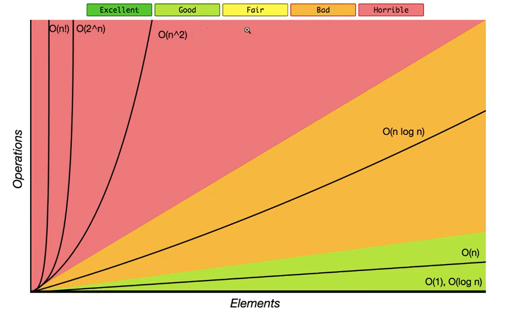

### 📘How to represent complexity ? 


---

### 📘Big-O Notation


---

### 📘Big O Notation Bar Graph



---

## What does _Better_ implementation means ?

> "Better" means faster time to finish and to use less memory (RAM), although there is much stronger emphasis on the former


```javascript
const sumUpToV1 = n => {
 let total = 0;
 for (let i = 1; i <= n; i++) {
  total += i;                        // here is 1 * N operations => O(n) : Big O Notation
 };
 return total;
}

const sumUpToV2 = n => {
    return (n * (n + 1) / 2);        // here is 3 operations = O(3)  : Big O Notation
}

console.time('v1');
console.log(sumUpToV1(100000000));
console.timeEnd('v1');

console.time('v2');
console.log(sumUpToV2(100000000));
console.timeEnd('v2');	
```
---

### 📘Objects-Big-O
An Object is a collection of key value pairs
1. Insert - O(1)
2. Remove - O(1)
3. Access - O(1)
4. Search - O(n)
5. Object.keys - O(n)
6. Object.values - O(n)
7. Object.entries - O(n)

---

### 📘Array-Big-O
An array is an ordered collection of values

1. Insert / Remove at end - O(1)
2. Insert / Remove at beginning - O(n)
3. Access - O(1)
4. Search - O(n)
5. Push / Pop - O(n)
6. Shift / UnShift / Concat / Slice / Splice - O(n)
7. forEach / map / filter / reduce - O(n)

---

### 📘Identifying Runtime Complexity (Rules of Thumb)

1. Iterating over a collection OR using N as a pointer with a for loop  : O(n)
2. Iterating over the same collection with nested for loops  : O(n^2)
3. Iterating over different collection with nested for loops : O(n*m)

---
## Rules for big O Notation
1. Constants do Not Matter 
		
	* O(12)  	-> O(1)
	* O(702)  	-> O(1)
	* O(2n)   	-> O(n)
	* O(n/2)  	-> O(n)
	* O(13n^2) -> O(n^2)

1. Smaller Terms do Not Matter

	* O(n+10) 			-> O(n)
	* O(1337n + 50)		-> O(n)
	* O(n^2 + 13n + 8)	-> O(n^2)

> Other terms for Big O Notation/ Time Complexity

   * O(1) 	-> Constant Time 	: good_
   * O(n) 	-> Linera Time 		: fair		
   * O(n^2) -> Quaratic Time	: bad
	 
	 _O(1) > O(n) > O(n^2)		: performance_ 

---
## Space Complexity versus Time Complexity

* Space Complexity : How much more memory use (RAM) do we need as the inputs provided to the code gets larger ?
* Time Complexity : How much more runtime do we need as the inputs provided to the code gets larger ? 
 
	> *Both of the above still use Big O notation*

Space Complexity Rules of thumb
* Storing values in variables always takes up memory
1. Most Primitive (Boolean and Numbers) takes up O(1) / Constant Space
	* var x=100 and var x = 200 take up same amount of memory
1. String, Arrays and Objects take up O(n) / Linear Space
	* An Array with 4 elements takes up twice the memory of Array with 2 elements 

Examples 

```javascript		
function Owith1(n) {
  for (let i = 0; i < n; i++) {
    console.log("whats up DP ?");
  }
}

//O(1) Space Complexity

function Owith1withNumber(arr) {
  let total = 0;
  arr.map(item => total += item);
  return total;
}
//O(1) Space Complexity

function OwithN(str) {
  let reveresedStr = '';
  for (let i = 0; i < str.length; i++) {
    reveresedStr = str[i] + reveresedStr;
  }
  return reveresedStr;
}
//O(n) Space Complexity

function OwithNDivideBy2(arr) {
  let resArr = [];
  arr.map(item => {
    if (Math.random() < 0.5) {
      resArr.push(item)
    }
  })
  return resArr;
};

//O(n/2) -> O(n) Space Complexity    (because removing of constants rule)
```
> Why is Time Complexity Prioritized Over space Complexity
	
* Costs to produce and run processors are much higher compared to RAM. 
* Better use of time writing code that is easier on the processor...
* Consumers / users in general care more about speed than Ram usage. example : Google Chrome...    		 		
---
## Logarithms
	
	 Log2 8 = 3						Log2 16 = 4 

> if the input / N is doubled then we only have to do one more operation.

Example : 
1. Question : 
	
	I am thinking of a #from 1 to 50 (Answers is 1)
		
		is the number 25 ? -> "No it is less than that"
		is the number 12 ? -> "No it is less than that"
		is the number 6 ? -> "No it is less than that"
		is the number 3 ? -> "No it is less than that"
		is the number 2 ? -> "No it is less than that"	
		is the number 1 ? -> "Yes"

		6 "Operations" / Guesses (Worst Case)

2. Question : 

	I am thinking of a #from 1 to 100 (Answers is 1)

		is the number 50 ? -> "No it is less than that"
		is the number 25 ? -> "No it is less than that"
		is the number 12 ? -> "No it is less than that"
		is the number 6 ? -> "No it is less than that"
		is the number 3 ? -> "No it is less than that"
		is the number 2 ? -> "No it is less than that"	
		is the number 1 ? -> "Yes"
		
		7 "Operations" / Guesses (Worst Case)

		Big notiation only considered worst case	

The Guessing Numbers Game : Log N

* Our Guessing Numbers game has log N implementation, because we can elminate Half the remaining gusesse with each guess.
* We are able to elminate Half the gusesse with each guess, since the game rules allow us to know if our guess is SMALLER or 
		GREATER on each guess
* what would a more "inefficent" and less "fun" Guessing Numbers Game look like ?

1. Question  
	
	I am thinking of a #from 1 to 50 (Answers is 1)

		is the number 25 ? -> "No it is less than that"
		is the number 12 ? -> "No it is less than that"
		is the number 6 ? -> "No it is less than that"
		is the number 3 ? -> "No it is less than that"
		is the number 2 ? -> "No it is less than that"	
		is the number 1 ? -> "Yes"
		
		50 "Operations" / Guesses (Worst Case)

2. Question
		
	I am thinking of a #from 1 to 100 (Answers is 1)

		is the number 50 ? -> "No it is less than that"
		is the number 25 ? -> "No it is less than that"
		is the number 12 ? -> "No it is less than that"
		is the number 6 ? -> "No it is less than that"
		is the number 3 ? -> "No it is less than that"
		is the number 2 ? -> "No it is less than that"	
		is the number 1 ? -> "Yes"
		
		100 "Operations" / Guesses (Worst Case)
		
		Big notiation only considered worst case

		
* *O(log N) - Logarithmic Time Complexity*
	* you can think of it as either ....
	* If the input is doubled then we only have to do one more Operation. 
		
		OR
	* EveryTime we do an "operation" like Guessing, we can elminate Half the remaining operations.							

---
## Algorithms 
 
> Algorithms require consistent pratice to remain after the initial leaning period

Link : [Youtube-Alg-DS-Course-Starter-Code](https://github.com/KevinRSDNguyen/Youtube-Alg-DS-Course-Starter-Code "Youtube-Alg-DS-Course-Starter-Code")

---
## Reverse Algorithm
	
1. Turn the string into an array
2. Use array method of reverse() to reverse contents of array
3. Turn the reversed array back into string

> Without inbuilt Methods

1. Forward Loop
				
```javascript
function reverse(str) {
  let count = str.length;
  let strRev = '';
  for (let i = 0; i < count; i++) {
    strRev = str[i] + strRev;
  }
  return strRev;
}

```	
2. Backward loop
		
```javascript
function reverse(str) {
  let count = str.length;
  let strRev = '';
  for (let i = count - 1; i >= 0; i--) {
    strRev += str[i];
  }
  return strRev;
}
```
> With inbuilt methods
1. Split + reverse + join
	
```javascript
function reverse(str) {
  return str.split('').reverse().join('');
}
```	
2. Reduce
	
```javascript	
function reverse(str) {
  let reverseString = str.split('').reduce((acc, cum) => {
    acc = cum + acc;
    return acc;
  }, '');

  return reverseString;
}
```	
* *Time Complexity : O(N) we go over every charcter in input String Space Complexity : O(N )* 

---


## 📔Algorithm 

### 📘Fibonacci sequence
---

Problem : Give a number 'n', find the first 'n' elements of the Fibonacci sequence.

in Mathematics, the Fibonacci sequence is a sequence in which each number is the sum of the two proceeding ones.

**Formula** : fn = fn-1 + fn-2

the first two numbers is the sequence are 0 and 1.

Example

1. fibonacci(2) = [0, 1]
2. fibonacci(3) = [0, 1, 1]
3. fibonacci(7) = [0, 1, 1, 2, 3, 5, 8]

```js
function fibonacciProgram(n) {
    let fib = [0, 1];
    if (n === 0 || n === 1) return { number: 0, sum: 0 };
    if (n === 2) return { number: 1, sum: fib };

    if (n > 2) {
        for (let i = 2; i < n; i++) {
            fib[i] = fib[i - 1] + fib[i - 2];
        }
    }

    return { number: n, sum: fib }
}

console.log(fibonacciProgram(7));
```

---

### 📘Factorial of a number

Problem : Give an integer 'n', find the factorial of that integer

In mathematics, the factorial of a non-negative integer 'n', denoted n!, is the product of all positive integers less than or equal to 'n'.

Factorial of zero is 1

factorial(4) = 24

factorial(5) = 120

```js
function factorial(n) {
    if (n === 0) {
        return 1
    }

    let fact = 1;
    for (let i = 1; i <= n; i++) {
        fact = fact * i;
    }
    return fact
}

console.log(factorial(5));
```


## Palindrome Algorithm

Example
* Madam === madaM
* TEsT  === TsET	 

Without inbuilt method

```javascript	
function palindrome(str) {
  str = str.toLowerCase();
  let revrseString = str.split('').reverse().join('');
  if (str == revrseString) return true;
  else return false;
}
```	
With inbuilt method
```javascript
function palindrome(str) {
  str = str.toLowerCase();
  let reverse = '';

  for (let i = 0; i < str.length; i++) {
    reverse = str[i] + reverse;
  }
  if (reverse === str) return true;
  else return false;
}
```	
---
## ReverseInt Algorithm

Example 
* reverseInt(13) === 31
* reverseInt(404) === 404
* reverseInt(100) === 1
* reverseInt(-13) === -31
* reverseInt(-100) === -1

Steps
1. Turn numbers into string
1. Reverse the String1
1. Turn the string into a number
```javascript
function reverseInt(n) {
  let reverse = n.toString().split('').reverse().join('');
  reverse = parseInt(reverse);
  if (n < 0) {
    reverse = reverse * -1;
  }
  return reverse;
}	
```
* *Time complexity : O(Log N) if the input increse by factor of 10, we do one more operation*

---
## MaxChar Algorithm
* maxChar("I loveeeeeee noodles") === "e"
* maxChar("1337") === "3"
```javascript
function maxChar(str) {
  let charCountObj = {};
  let maxChar = '';
  let maxCount = 0;

  if (typeof (str) !== 'string') return 'Please provide valid String';

  for (let i of str) {
    charCountObj[i] = charCountObj[i] + 1 || 1;
    if (charCountObj[i] > maxCount) {
      maxChar = i;
      maxCount = charCountObj[i];
    }
  }
  return maxChar;
}
```	
* *Time Complexity : O(N)* we visit every charcter in input string
* *Space Complexity : O(1)* charcter count Obj will have at most 26 key-val pairs (beacuse 26 charcter in our Letters)	
---
## Fizzbuzz Algorithm
Write a program that console logs the numbers
	 from 1 to n. But for multiples of three print
	 “fizz” instead of the number and for the multiples
	 of five print “buzz”. For numbers which are multiples
	 of both three and five print “fizzbuzz”.

Example	 
* fizzBuzz(5);
* 1
* 2
* fizz
* 4
* buzz

```javascript
function fizzBuzz(n) {
  for (let i = 1; i <= n; i++) {
    let str = '';
    if (i % 3 === 0) {
      str += 'fizz';
    }

    if (i % 5 === 0) {
      str += 'buzz';
    }

    if (str == '') {
      str = i;
    }
    console.log(str)
  }
}
```
* *Time complexity for fizzBuzz Complexity Analysis : O(N)*
---
## Capitalize Algorithm

```javascript
function capitalize(str) {
  str = str.toLowerCase();
  str = str.split(" ");
  for (let i = 0; i < str.length; i++) {
    str[i] = str[i][0].toUpperCase() + str[i].slice(1);
  }
  str = str.join(" ");
  return str;
}
```	
* *Time complexity for Capitalize Complexity Analysis : O(N)*
---
## Chunk Algorithm
Examples
* chunk(["a", "b", "c", "d"], 2) --> [[ "a", "b"], ["c", "d"]]
* chunk([0, 1, 2, 3, 4, 5], 4) -->  [[0, 1, 2, 3], [4, 5]]

>My soluction 
 
 ```javascript
function chunk(array, size) {
  let count = array.length;
  let newArray = [];
  let temp = [];
  for (let i = 0; i < count; i++) {
    let tempNumber = i + 1;

    temp.push(array[i]);

    if (tempNumber % size == 0) {
      newArray.push(temp)
      temp = [];
    }

    if (count === tempNumber) {
      if (temp.length > 0) {
        newArray.push(temp)
        temp = [];
      }
    }
  }
  return newArray;
}
```	
> Provide Solution
 ```javascript
function chunk(array, size) {
  let res = [];
  for (let i = 0; i < array.length; i++) {
    const item = array[i];
    const last = res[res.length - 1];
    console.log(last);

    if (!last || last.length === size) {
      res.push([item]);
    } else {
      last.push(item)
    }
  }
  return res;
}
```
* *Time complexity and Space Complexity : chunk Complexity Analysis : O(N)*
---
## Anagrams Algorithm
Examples
* anagrams('heart', 'earth') --> True
* anagrams('heart', '  earth') --> True
* anagrams('Heart!', 'EARTH') --> True
* anagrams('lol', 'lolc') --> False

> Without inBuilt Method
 ```javascript
function anagrams(stringA, stringB) {
  stringA = stringA.toLowerCase().replace(/[\W_]+/g, '').trim();
  stringB = stringB.toLowerCase().replace(/[\W_]+/g, '').trim();

  if (stringA.length !== stringB.length) return false;

  let stringACharCount = {};

  for (let i of stringA) {
    stringACharCount[i] = stringA[i] + 1 || 1;
  }

  for (let i of stringB) {
    if (!stringACharCount[i]) {
      return false;
    } else {
      stringACharCount[i]--;		// setting character to zero or undefined
    }
  }
  return true;
}
```
* *Time complexity : O(N + M) we go over character in both input string*
* *Space Complexity : O(1) Character Count object has at most 26 key-val pairs*

>With in Built Method

```javascript
function anagrams(stringA, stringB) {
  stringA = stringA.toLowerCase().replace(/[\W_]+/g, '').trim();
  stringB = stringB.toLowerCase().replace(/[\W_]+/g, '').trim();

  stringA = stringA.split('').sort().join('');
  stringB = stringB.split('').sort().join('');

  if (stringA !== stringB) {
    return false;
  }
  return true;
}
```
* *Time complexity : O(N * Log N) we made use of a Sort algorithm beacuse of sort() it is implementing nested for loop*
* *Space complexity : O(N) Sorted Strings as long as input string*
---

## caesarCipher Algorithm
Examples
* caeserCipher("abcd", 1) === "bcde";
* caeserCipher("yz", 1) === "za";
* caeserCipher("abcd", 100) === "wxyz";
* caeserCipher("gurer ner 9 qbtf!", 13) === "there are 9 dogs!"

```javascript
function caesarCipher(str, shift) {
  const alphabetArr = 'abcdefghijklmnopqrstuvwxyz'.split("");
  let res = '';
  for (let i = 0; i < str.length; i++) {
    const char = str[i];
    const idx = alphabetArr.indexOf(char);
    if (idx === -1) {
      res += char;
      continue;
    }
    const encodeIdx = (idx + shift) % 26;
    res += alphabetArr[encodeIdx];
  }
  return res;
}
```
## Steps Algorithm
Examples
* steps(2)
	* '# '
	* '##'
* steps(3)
	* '#  '
	* '## '
	* '###'
* steps(4)
    * '#   '
    * '##  '
    * '### '
    * '####'

```javascript
function steps(n) {
  str = '';
  for (let i = 1; i <= n; i++) {
    for (let j = 1; j <= i; j++) {
      str += '#';
    }
    for (let j = n; j > i; j--) {
      str += '*';
    }
    str += '\n';
  }
  console.log(str);
  return str
}
```
* *Time Complexity : O(N^2) Both Inner and Outer For loops run N Times*
---
## Pyramid Algorithm

Examples
* pyramid(1)
  * '#'
* pyramid(2)
 	* ' # '
 	* '###'
* pyramid(3)
 	* '  #  '
 	* ' ### '
 	* '#####'
```javascript
function pyramid(n) {
  let str = ''
  for (let i = 1; i <= n; i++) {
    for (let j = n; j > i; j--) {
      str += ' '
    }
    for (let j = 0; j < i; j++) {
      str += '#'
    }
    for (let j = 1; j < i; j++) {
      str += '#'
    }
    str += '\n';
  }
  return str;
}	
```
* *Time Complexity : O(N^2) Outer loop runs N times, Inner Loop run roughly N Times*
---

## Vovles Count Algorithm
Examples
* vowels('What') --> 1
* vowels('Why?') --> 0
* vowels('aEiOu') --> 5
* vowels('I am a world-class developer using iterations') --> 16

> With indexOf  

```javascript
function vowels(str) {
  let count = 0;
  let vovles = 'aeiou'.split('');
  for (let i of str.toLowerCase()) {
    if (vovles.indexOf(i) !== -1) {
      count++
    }
    return count;
  }
}
```

> With includes  
```javascript
function vowels(str) {
  let count = 0;
  let vovles = 'aeiou'.split('');
  for (let i of str.toLowerCase()) {
    if (vovles.indexOf(i) !== -1) {
      count++
    }
    if (i.includes('a')
      || i.includes('e')
      || i.includes('i')
      || i.includes('o')
      || i.includes('u')
    ) {
      count++;
    }
  }
  return count;
}
```
* *Time Complexity : O(N) All Characters of input string must be checked to see if it is a vowel*
* *Space Complexity : O(1)*

---
## Searching Algorithm
Various Methods
* inclues()
* indexOf()
* find()
* findIndex()
* filter()

```javascript
const inventory = ["bikes", "backpackes", "laptops", "eggs"];

 
inventory.findIndex(item => item == "backpackes") 	// 1
inventory.filter(item => item == "backpackes"); 	// ["backpackes"]

```
## Linear Search
A Searching Algorithm that searches by manually checking everything in the data set to see if is the value we are searching for. 

Example 
* const foods = ["pizza", "orange", "yogurt"];
* linearSearchIndexOf(foods, "pizza") --> 0
* linearSearchIncludes(foods, "pizza") --> true
* linearSearchFind(foods, food => food === "pizza") --> "pizza"
*  linearSearchFind(people, person => person.name === "Kevin"),

```javascript
// kind of creating Prototypes for all functions

function linearSearchIndexOf(arr, val) {

  for (let i = 0; i < arr.length; i++) {
    if (arr[i] === val) {
      return i;
    }
  }
  return -1;
}

function linearSearchIncludes(arr, val) {
  for (let i = 0; i < arr.length; i++) {
    if (arr[i] === val) {
      return true;
    }
  }
  return false;
}

function linearSearchFind(arr, cb) {
  for (let i = 0; i < arr.length; i++) {
    if (cb(arr[i])) {
      return arr[i]
    }
  }
  return undefined;
}
``` 
* *Time Complexity for Linear Search : O(N) /  Linear Time Complexity*
* Our Search Algorithm in the worst case needs to iterate over every item in Array to check if it is the value we are looking for.
* *O(N) / Linear Time Complexity* is the best we can do for searching an __unsorted array__. On a __sorted array__ we can get a much better time compexity with *Binary Search*.
---
## Binary Search
* It is a Searching Algorithm that can search in O(log n) time for a __sorted__ array, compared to Linear Search's O(N) time for an unsorted array.
* Binary Search can achieve O(Log N) Time Compexity by eliminating __HALF__ of remaining things to search for with each search 
* const sortedNumsArray = [0, 1, 2, 3, 4, 5, 6, 7, 8, 9, 10];

```javascript
const binarySearch = (sortedArr, value) => {
  let left = 0;
  let right = sortedArr.length - 1;
  while (left <= right) {
    const mid = Math.floor((left + right) / 2);
    const midVal = sortedArr[mid];
    if (midVal === value) {
      return mid;
    } else if (midVal < value) {
      left = mid + 1;
    } else {
      right = mid + 1;
    }
  }
  return -1;
};
```
* *Time Complexity for Binary Search: O(Log n)*
* if N is doubled, we only have to do one more operation. This is beacuse with each operation, we can eliminate half of remaining array.
* __Binary search only works on sorted arrays__   

## String Pattern Search Algorithm
Example
* how many times the pattern occurs in the text.
* stringPatternSearch("lollipop", "lol") --> 1
* stringPatternSearch("lolol", "lol") --> 2

```javascript
function stringPatternSearch(text, pattern) {
  let count = 0;
  for (let i = 0; i < text.length; i++) {
    for (let j = 0; j < pattern.length; j++) {
      const patternChar = pattern[j];
      if (patternChar !== text[j + i]) {
        break;
      }
      if (j === pattern.length - 1) {
        count++;
      }
    }

  }
  return count;
}
```
* *Time Complexity for Binary Search: O(N * M)* for each character in text, go over every  character in Pattern

* *Space Complexity : O(1)* 

## What is Sorting
* Sorting is the process of rearranging the items in a collection, to be in a certain order.
* Sorting is so commonly needed and used

> Different Sorting Algorithms
* Bubble Sort
* Insertion Sort
* Selection Sort
* Quick Sort
* Merge Sort
* Radix Sort
* Bucket Sort
* Tim Sort

All these different sorts have different time complexities and vary in their difficulty to conceptualize and implement.

## Bubble Sort Pseudopod
* Create a for-loop that checks if the current iterated number and the next iterated number are generated or less than each other
* if current number greater than next number, swap using helper function (using temp variable or Snap shot)
* Nest above loop in an for-loop that runs Array Length times.
* Return the now sorted Array

```javascript

// Swapping Code
function swap(arr, i, j) {
  let temp = arr[i];
  arr[i] = arr[j];
  arr[j] = temp;
}

// Bubble Sort
let array = [5, 4, 3, 2, 1];
function bubbleSort(array) {
  for (let i = 0; i < array.length; i++) {
    for (let j = 0; j < array.length - i; j++) {
      if (array[j] > array[j + 1]) {
        let temp = array[j];
        array[j] = array[j + 1];
        array[j + 1] = temp;
      }
    }
  }
  return array;
}
```
* *Time Complexity for Bubble Sort : O(N^2) / Quadratic Time Complexity* with the minor optimization, the true time complexity is 0.5(N^2 + N). But with Big O Simplification, this is still O(N^2)

* Optimization Example
  * For unOptimized solution, let's assume we pass in Array of length 5 to sort
    * 5^2 : 5 * 5 -> 5 + 5 + 5 + 5 + 5
  * For optimization solution, let's assume we pass in Array of length 5 to sort
    * 5 + 4 + 3 + 2 + 1
    * We are really doing : N + (N - 1) + (N - 2) + ...... + 1 -> n(n+1)/2 -> 0.5(N^2 + N) 

## What is Selection sort
* It is another Sorting Algorithm
* For sorting an array of numbers from least to greatest, Selection Sort sorts by moving smaller values to the start as iterates thru array
* Bubble Sort moved larger values to the end as it iterated thru away.

```javascript
function selectionSort(arr) {
  for (let i = 0; i < arr.length; i++) {
    for (let j = i; j < arr.length; j++) {
      if (arr[i] > arr[j]) {
        let temp = arr[i];
        arr[i] = arr[j];
        arr[j] = temp;
      }
    }
  }
  return arr;
}
```
* *Time Complexity for Bubble Sort : O(N^2) / Quadratic Time Complexity* with the minor optimization, the true time complexity is 0.5(N^2 + N). But with Big O Simplicfication, this is still O(N^2)

## Merge Complexity Analysis

```javascript
let array1 = [1, 4, 6];
let array2 = [2, 3, 5, 7];

function merge(sortedArr1, sortedArr2) {
  let p1 = 0;
  let p2 = 0;
  let newArray = [];
  
  while (p1 < sortedArr1.length && p2 < sortedArr2.length) {
    if (sortedArr1[p1] < sortedArr2[p2]) {
      newArray.push(sortedArr1[p1]);
      p1++;
    } else {
      newArray.push(sortedArr2[p2]);
      p2++;
    }
  }

  while (p1 < sortedArr1.length) {
    newArray.push(sortedArr1[p1]);
    p1++;
  }

  while (p2 < sortedArr2.length) {
    newArray.push(sortedArr2[p2]);
    p2++;
  }
 return newArray;
}
```
* *Time Complexity : O(N + M)* where N and M are length of sorted input Arrays
* *Space Complexity : O(N + M)* Result arrays as long as input Arrays Combined

| Sri No | Operation                                                                                                  | Examples Algorithm    | Time Complexity |
| ------ | ---------------------------------------------------------------------------------------------------------- | --------------------- | --------------- |
| 1.     | Iterating over Half a collection with a for loop                                                           | reverseString         | O(n)            |
| 2.     | Iteration over Half a collection with a loop                                                               |                       | O(n)            |
| 3.     | Iterating over two different collections with separate for-loops                                           | Anagrams, merge       | O(n + m)        |
| 4.     | Iterating over some collection with Nested for-loops                                                       | Bubble/Secltion Sort  | O(n^2)          |
| 5.     | Iterating over a collection with a for loop that has Nested for-loop iterating over a Different collection | stringPatternSearch   | O(n * m)        |
| 6.     | Sorting (Bubble and Selection Sort)                                                                        | Bubble/Selection Sort | O(n^2)          |
| 7.     | Sorting                                                                                                    | Anagrams(Solution 2)  | O(n * log n)    |
| 8.     | Search(on unsorted Array)                                                                                  | Linear Search         | O(n)            |
| 9.     | Searching (on sorted Array)                                                                                | Binary Search         | O(log n)        |

## What are Data Structures?
* Data Structures are structures that hold data and define how we both access and modify that data.
* Array and JS Objects are examples of two different Data structures

| Sri No | Name                         |
| ------ | ---------------------------- |
| 1.     | __Hash Tables (JS Objects)__ |
| 2.     | __Arrays__                   |
| 3.     | Stacks                       |
| 4.     | Queues                       |
| 5.     | Trees                        |
| 6.     | Binary Search Trees          |
| 7.     | Binary Heaps                 |
| 8.     | Graphs                       |
| 9.     | Linked List                  |
| 10.    | Double Linked List           |


## Big O of Objects
* Javascript Objects : __unordered, key value paris__
  
| Sri No | Operation       | Time Complexity      |
| ------ | --------------- | -------------------- |
| 1.     | Insert          | O(1) / Constant Time |
| 2.     | Removal         | O(1) / Constant Time |
| 3.     | Object.keys()   | O(N) / Liner Time    |
| 4.     | Object.values() | O(N) / Liner Time    |
| 5.     | Searching       | O(N) / Liner Time    |
| 6.     | Accessing (key) | O(1) / Constant Time |

> When to use JS Objects to store your Data
* when you do not need order
* when you need fast access by __key value__, and fast insertion and removal

## Big O of Arrays
* Arrays : __Ordered list of data__
  
| Sri No | Operation         | Time Complexity      |
| ------ | ----------------- | -------------------- |
| 1.     | Searching         | O(N) / Liner Time    |
| 2.     | Accessing (index) | O(1) / Constant Time |
| 3.     | Insert            | O(N) / O(1) for end  |
| 4.     | Removal           | O(N) / O(1) for end  |


> Big O of Arrays Methods

| Sri No | Operation                     | Time Complexity |
| ------ | ----------------------------- | --------------- |
| 1.     | push                          | O(1)            |
| 2.     | pop                           | O(1)            |
| 3.     | shift                         | O(N)            |
| 4.     | unshift                       | O(N)            |
| 5.     | concate                       | O(N)            |
| 6.     | Slice                         | O(N)            |
| 7.     | splice                        | O(N)            |
| 8.     | sort                          | O(N * log N)    |
| 9.     | forEach/map/filter/reduce/etc | O(N)            |

> When to use JS Objects to store your Data
* when you do not need order
* when you need fast access by __key value__, and fast insertion and removal

> Array vs Object
> 
| Sri No | Operation | Array Time Complexity | Object Time Comlexity |
| ------ | --------- | --------------------- | --------------------- |
| 1.     | Insertion | O(1) / O(1) for end   | O(1)                  |
| 2.     | Removal   | O(N) / O(1) for end   | O (1)                 |
| 3.     | Searching | O(N)                  | O(N)                  |
| 4.     | Accessing | (index) O(1)          | (Key) O(1)            |

## What's the best Data Structure
* There is none
* Since Data structure store data in different ways, each have strengths and weaknesses in different things
* You use different Data structure depending on your needs.
* Asking what is the best data structure is like asking "what is the best vehicle ?"

## Optimixing Time Complexity with Hash Maps

```javascript
const data = Array.apply(null, { length: 100000 }).map(
 Function.call,
 Math.random
);

const naiveRemoveDupes = arr => {
 const unique = [];

 for (let i = 0; i < arr.length; i++) {
   const inputNum = arr[i];
   if (!unique.includes(inputNum)) {
     unique.push(inputNum);
   }
 }

 return unique;
};

const optimizedRemoveDupes = arr => {
 const unique = [];
 const hashMap = {}; // {0.34752843846832215: true, 0.6305316867816426: true}

 for (let i = 0; i < arr.length; i++) {
   const inputNum = arr[i];

   if (!hashMap[inputNum]) {
     unique.push(inputNum);
   }

   hashMap[inputNum] = true;
 }

 return unique;
};

let t1, t2;

console.log(data.slice(0, 10));
t1 = Date.now();
naiveRemoveDupes(data);
t2 = Date.now();

console.log(`${(t2 - t1) / 1000} seconds`);

t1 = Date.now();
optimizedRemoveDupes(data);
t2 = Date.now();

console.log(`${(t2 - t1) / 1000} seconds`);

```

## Comman ways to improve Time Compexity
* use a hashMap (Js Object) to look up data rather than an Array (nm/n^2 ->n)
* Avoiding nested for loop (nm/n^2 -> n)
* if working with __sorted__ data, have your code take advantages of it (n -> log n)