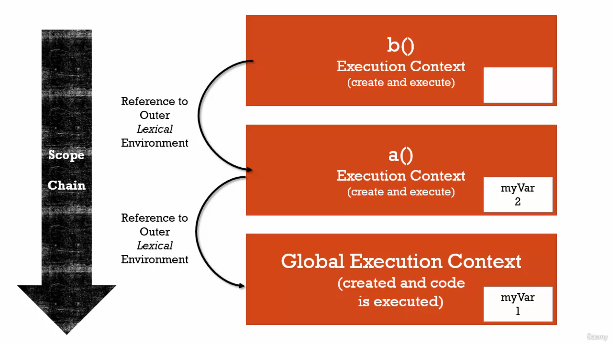
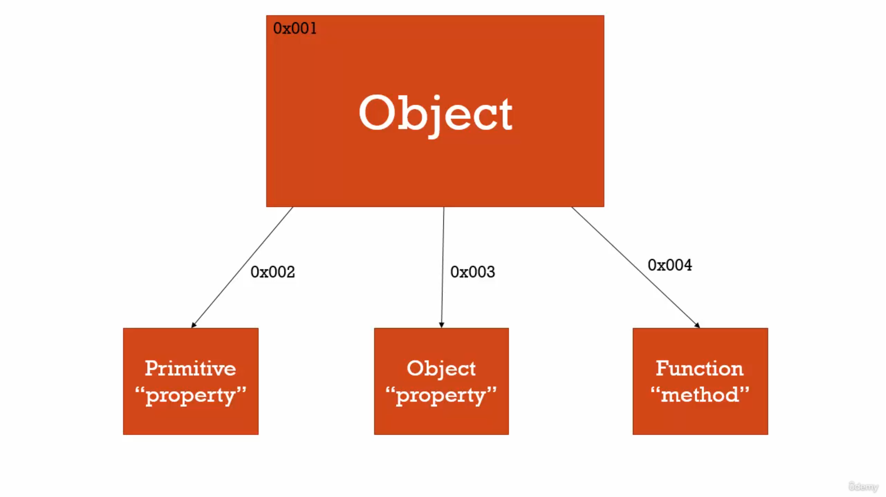
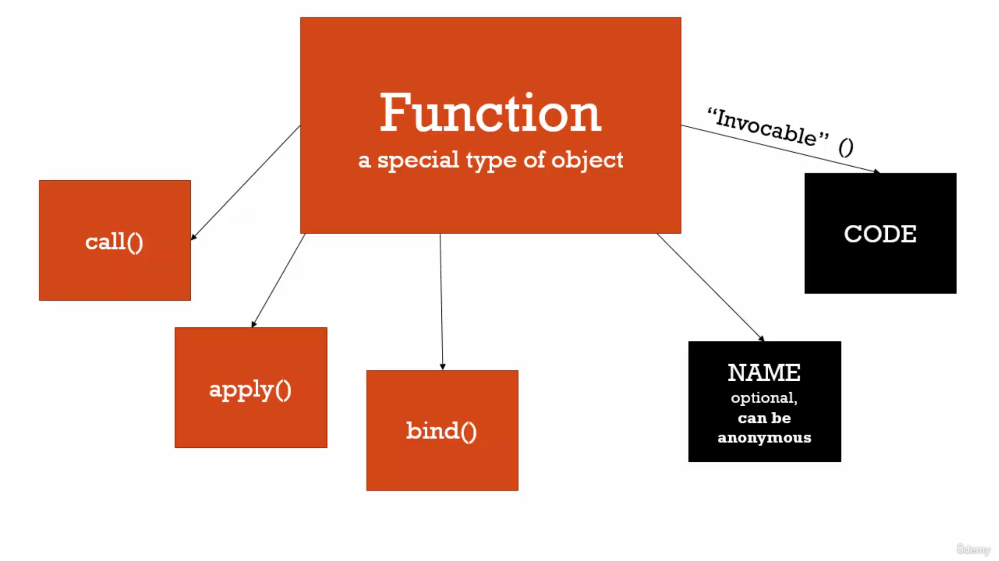
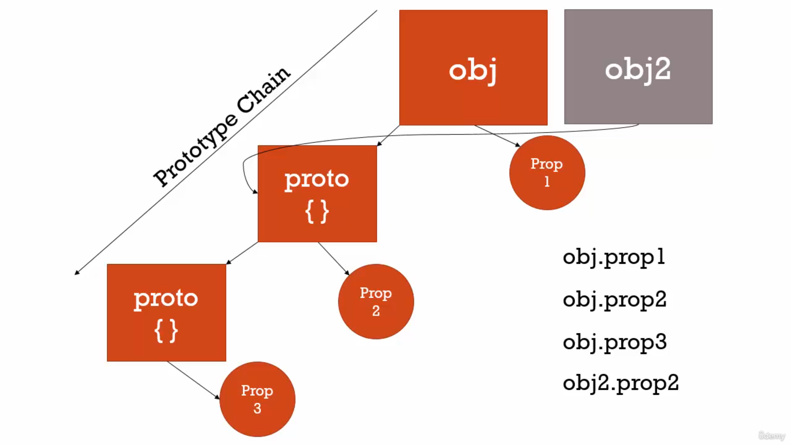
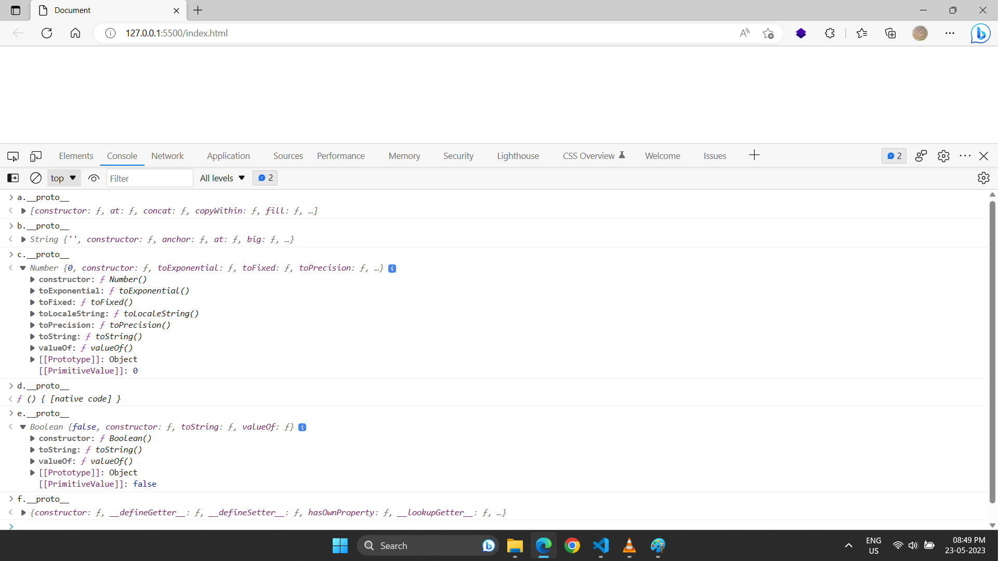
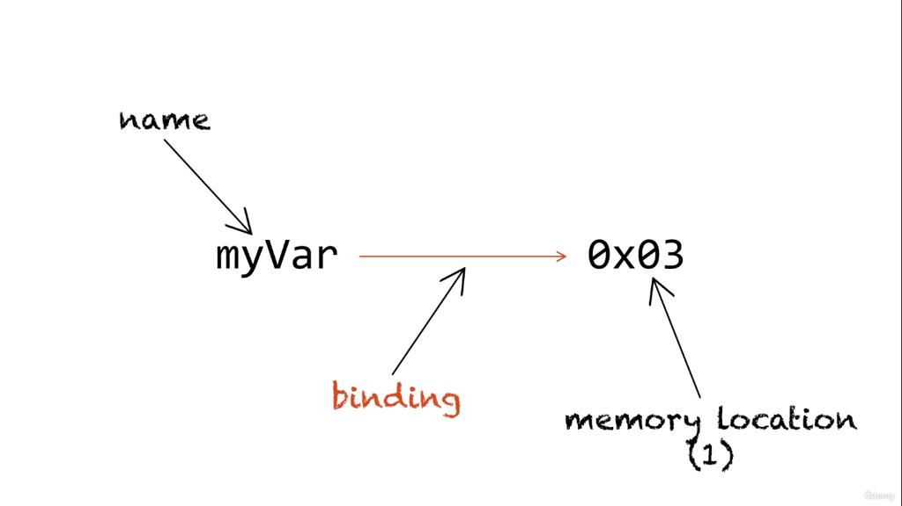
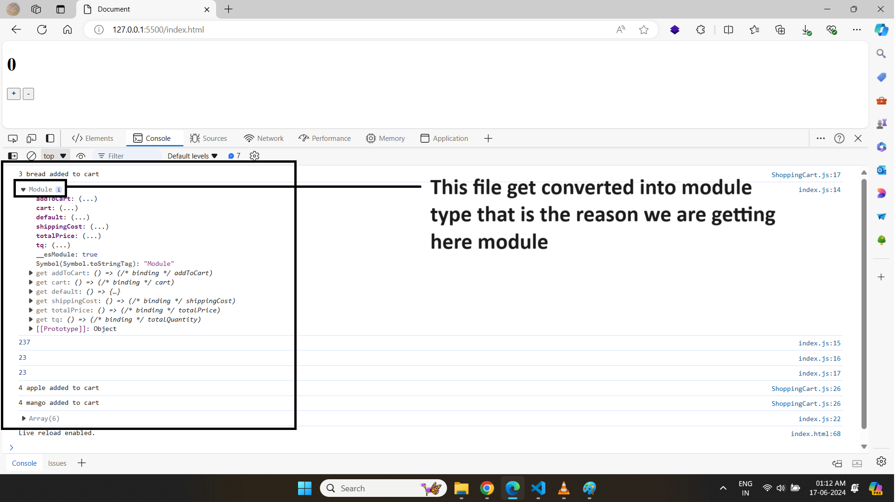

# 📔 ES5
## 📘 Developer Responsibility

* Write good code so everyone can read and understand easily.
* the harder is to understand code and to reason about the code the more difficult it will be to add new features add to more the functionality to the application. Hence it is called bad code.
* An important part of web-development is actually handle the errors. because its very common that errors happen in web-application.
* To test *APi* use *Network tab* with various **Throttling** options *fast/slow/offline*
---
## 📘 Operators are functions

* in Example 1 : **=** is an *operator (function)*  which takes **2** parameters **a** and **3** and then assign value.
* in Example 2 : **+** is an *operator (function)*  which takes **2** parameters **3** and **2** and then return and expression.

```javascript
// Example 1
var a = 3;

// Example 2
var b = 3 + 2;
```
---

## 📘 Conceptual Aside
1. **Syntax Parsers** : A program that reads your code and determines what it does and if its grammar is valid, e.g., an interpreter or a compiler.
2. **Execution Contexts** : *A Wrapper to help manage the code that is running*. There are lots of lexical environments. which one is currently running is managed via execution context. it can contain things beyond what you've written in your code.
3. **Lexical Environments** : *where something sits physically in the code you write*. 'Lexical' means 'having' to do with words or grammar. A lexical environment exists in programming languages in which **where** you write something is important.

---
## 📘 Name/Value Pairs and Objects
* A Name which **maps** to a **unique value**. eg *Address = '100 Main St.'*.
* The name may be defined more than once, but only can have one value in any given **context**.
* That value may be more name/value pairs.
* **Object** : *A Collection of name values pairs*. The simplest definition when talking about javascript.


---
## 📘Creation & Hoisting

⚠️ **Why Hoisting?**
* Using function before actual declaration.
* var hoisting is just a byproduct.

Javascript Execution Context has two phase<br/>
1. **Creation Phase** : Set up memory for variables and functions, also set placeholder for variables called **undefined**.
2. **Execution Phase** : means assigns values to variables but not for functions.

In javascript __variables and functions__ are all hoisted to the top of the scope in which they are declared. The scope is usually either global scope or a function scope.

 * variables are always __partially hoisted__ and set to __undefined__.
 * functions are always __fully hoisted__.


so during the creation phase javascript engine moves your variables and function declarations of the top their respective scope
```javascript
console.log(number1);
var number1 = 10;

// javascript is doing this process in background
var number1;

console.log(number1);

number1 = 10;
```

```javascript
var num = 50;

function logNumber() {
    console.log(num);   // undefined
    var num = 10;
}

logNumber();
```

⚠️ Note <br/>
* __let, const, function Expression and classes__ are not hoisted.
* In **const** : Only **Primitive Values** are **immutable** but *Array and Objects* are **non-primitive** types values
* __Temporal Dead Zone__ :
  * is the time between the __declaration__ and __the initialization__ of _let_ and _const_ variables.
  * Temporal Dead Zone is the term to describe the state where variables are in the scope but they are not yet declared.
  * why TDZ : **Make it easier to avoid and catch errors**, accessing variables before declaration is a bad practice and should be avoided.


```javascript
function logNumber() {
    var num1 = num2 = 10;
}

console.log(num1)   // error
console.log(num2)   // 20 because it become global variable

logNumber();
```


```javascript
function test() {
    let total = 0;
    if (true) {
        var numberOne = 10;
        let numberTwo = 20;
        total = numberOne + numberTwo;
    }
    numberOne; // 10 because of function scope
    numberTwo; // error because of block scope
    total; // 30 because of test function block scope
}
test();


// Var case
age = 10;
console.log(age);   // 10
let var;

// Let case
age = 10;
console.log(age);   // cause error
let age;


// setting value
function test() {
    age = 10;
}

let age;
test();
console.log(age);   // 10
```
---
## 📘Undefined vs Not Defined
* **undefined** : is special value in javascript, it will take memory space.

```javascript
// undefined : means value is not set
var number1;
console.log(number1);
number1 = 10;
```
```javascript
// Not defined : means does not exist
console.log(number1);
```
---
## 📘The Global Environment and The Global Object
* when ever code is run in javascript it's run inside an execution context. Meaning a wrapper that the javascript engine wrap that up, that code that you've written in **global execution**.


* There will be always a **Global Object**. in *Browser* it is **window**, each new tab have there own Global Execution context hence has its own window object
* in **Browser** : *window==this*

```javascript
var a = 10;
function b() {
    console.log('hello world');
}
a         // 10
window.a  // 10
this.a    // 10

b();        // hello world
window.b();
this.window.b();
```
---
## 📘 The Execution Context : Code Execution (Your Code)
Code Execute line by line

```javascript
test();

console.log(a);             // undefined

var a = 'Hello world';

console.log(a);

function test() {
    console.log('Hello world');
}
```
---
## 📘Single Threaded, Synchronous Execution
 * **Single Threaded :** one command at a time. Under the hood of the browser, maybe not.
 * **Synchronous :** one at a time.
---

## Function Invocation and The Execution Stack
* **Invocation** : Running a function. in javascript, by using **parenthesis()**
* when ever a function get invoke it will create new **Execution Context** for it for example **a() && b()** creating its own execution context.


---
## 📘 Functions, Context and Variable Environments
* **Variable Environments :** Where the variables live. and how they related to each other in memory.


* Value of variables also depend upon **scope**. in below example the value of **myVar** depends upon scope.
```javascript
function b(){
    var myVar;
    console.log(myvar);
}
function a() {
    var myVar = 2;
    console.log(myVar);
    b();
}

var myVar = 1;
console.log(myVar);
a();
console.log(myVar);
```
---
## The Scope Chain

* **Scope :** where a variable is available in your code. and if it's truly the same variable or a new copy

```javascript
// function 'b' is sit lexically sits on top of global environment, in the other words it's not inside function 'a', it is sitting at the global level

function b() {
    console.log(myVar);
}

function a() {
    var myVar = 2;
    b();
}

var myVar = 1;
a();

```


```javascript
// function 'b' is sit lexically inside the function 'a'

function a() {
    function b() {
        console.log(myVar);
    }

    var myVar = 2;
    b();
}

var myVar = 1;
a();

```


---

## 📘 What about Asynchronous Callbacks
* **Asynchronous :** more than one at a time.

```javascript
// long running function

function waitThreeSeconds() {
    var ms = 3000 + new Date().getTime();
    while(new Date() < ms){}
    console.log('finished function');
}

function clickHandler() {
    console.log('click event!');
}

// listen for the click event
document.addEventListener('click', clickHandler)

waitThreeSeconds();
console.log('finished execution');
```
---

* Long running code also effect event loops events for example while executing this code if you click immediately click it will not print because while loop is executing that time.

---
## 📘 Types and Javascript
* **Dynamic Typing :** : you don't tell the engine what type of data a variable holds, it figures it out while your coding is running. Variables can hold different types of values because it's all figured out during execution.

``` javascript
// Static  Typing

bool isNew = 'hello'; // an error

// Dynamic Typing
var isNew = true;   // no error
isNew = 'yup!';
isNew = 1;
```
---
## 📘 Primitive types and Non Primitives types
* **Primitive type :** A type of data that represents a single value. That is, not an object.

1. **undefined :** undefined represents lack of existence (you should'nt set a variable to this)
2. **Null :** null represents lack of existence (you can set a variable to this)
3. **Boolean** : true or false
4. **Number :**
   1. Floating point number (there's always some decimals). Unlike other programming languages, there's only one 'number' type ... and it can make math weird.
   2. *in javaScript, all numbers are represented internally as floating point numbers so basically always as decimals no matter we are writing as integer or as decimal*. example *23 == 23.00 (true)*
5. **String :** a sequence of character (both '' and "" can be used)
6. **Symbol :** used in ES6

* **Non-Primitive** : A type of data that represents multiple value.

1. **Object**
2. **Array**
3. **Functions**
4. **Classes**

## 📘 Other Data-Structures (ES6)
1. **Sets :**
* A collection of unique values, so that means that a set can never have any duplicates. (its kind of array not exactly array)
* Actual use is to **remove duplicate** values from arrays.
* In **set** order does not matter, hence we cannot access values by using **index**. only use to check the values exist or not.
* **Set** are iterable.
```js
const orderset = new Set(['pasta', 'pizza', 'pizza', 'Risotto', 'pasta', 'pizza']);
console.log(orderset);  //  {'pasta', 'pizza', 'Risotto'}

console.log(orderset.size);
console.log(orderset.has('pizza')); // true
console.log(orderset.has('maggi')); // false

orderset.add('Garlic Bread');
orderset.add('Garlic Bread');   // this will not added

console.log(orderset);  // {'pasta', 'pizza', 'Risotto', 'Garlic Bread'}

orderset.delete('pasta');
console.log(orderset);  // {'pizza', 'Risotto', 'Garlic Bread'}

for(let i of orderset) {
    console.log(i)          // 'pizza', 'Risotto', 'Garlic Bread'
}


// Actual Real Example of Set
const arr = ['pasta', 'pizza', 'pizza', 'Risotto', 'pasta', 'pizza'];
const orderset = [...new Set(arr)];
console.log(orderset);  //  {'pasta', 'pizza', 'Risotto'}
```

2. **Maps :**
* its like *Objects* but the major difference is that, in objects the **keys are basically always strings**, but in maps we can have any type of key. it could even **be objects, or arrays or other maps.**

```js
// 1. Creating Map in this way

const rest = new Map()  // always create empty map here
rest.set('name', 'Deepu Bhasin');
rest.set(1, 'web-developer');
rest.set(true, 'apple')

const arr = [1, 2];
rest.set(arr, 'array value')


console.log(rest.get(arr)); // array value
console.log(rest.get(1));   //web-developer
console.log(rest.get('1')); // undefined

console.log(rest.has(true));    // true
console.log(rest.has('test'));  // false

console.log(rest.size);     // 3


// 2. Creating Map in this way

const question = new Map([
    ['question', 'what is the best programming language in the world'],
    [1, 'c'],
    [2, 'java'],
    [true, 'correct'],
    [false, 'Try Again']
]);

console.log(question)   //  {'question' => 'what is the best programming language in the world', 1 => 'c', 2 => 'java', true => 'correct', false => 'Try Again'}

 for (let [key, value] of question) {
    console.log(key + ' : ' + value);
}

// question : what is the best programming language in the world
// 1 : c
// 2 : java
// true : correct
// false : Try Again


// Converting into array once again
const array = [...questions];
```
---

## 📘Source of Data


---

## 📘Numbers
* Conversion

```js
Number('23')    // 23
+'23'           // 23
```
* Parsing

```js
Number.parseInt('2px')      // 2
Number.parseFloat('2.5rm')  // 2.5
```

* Checking Number
```js
// Only check number or not
Number.isNaN(10)        // false
Number.isNaN('20')      // false
Number.isNaN(+'20px')   // true
Number.isNaN(20/0)      // false

// For checking Integer Values
Number.isInteger(10)        // true
Number.isInteger(10.2)      // false
Number.isInteger('20')      // false
Number.isInteger(+'20px')   // false
Number.isInteger(20/0)      // false

// For checking Float Values (best)
Number.isFinite(10)        // true
Number.isFinite('20')      // false
Number.isFinite(+'20px')   // false
Number.isFinite(20/0)      // false
```
---

## 📘Stings & String Methods

```js
let firstname = "Deepinder Singh";

console.log(firstname[0];)   // D
console.log(firstname[1];)   // e
console.log(firstname[2];)   // e
```

* conversion
```js
let age = 10;

console.log(''+ 10);
console.log(age.toString())

```

* Methods

1. indexOf
2. lastIndexOf
3. slice
4. splice
5. includes
6. replace
7. toLowerCase
8. toUpperCase
9. split
10. join
11. at(1) & at(-1)
12. padStart & padEnd
13. charCodeAt()
14. charAt()

* Examples

```js
console.log('I am Web Developer'[0]);   // I
console.log('I am Web Developer'[2]);   // a
console.log('I am Web Developer'.length);   // 18

// Methods
// 1. indexOf
console.log('I am Web Developer'.indexOf('a'));   // 2
console.log('I am Web Developer'.indexOf('Web')); // 5

// 2. lastIndexOf
console.log('I am Web Developer'.lastIndexOf('Web')); // 5
console.log('I am Web Developer'.lastIndexOf('e'));   // 16

// 3. slice
console.log('I am Web Developer'.slice(3));    // m Web Developer
console.log('I am Web Developer'.slice(3, 7)); // m We

// 4. includes
console.log('I am Web Developer'.includes('Web'));  // true
console.log('I am Web Developer'.includes('test')); // false

// 5. charCodeAt
"X".charCodeAt()

// 6. charAt
"Xabcd".charAt(1)   // 'a'

```
---

## 📘 Operator Precedence and Associativity
* **Operator Precedence :** which operator function gets called first. Functions are called in order of precedence (HIGHER precedence wins). Example : BDMAS
```javascript
var a = 3 + 4 * 5;
console.log(a); //23
```
* **Associativity :** What order operator functions get called in: LEFT-TO-RIGHT or RIGHT-TO-LEFT. when functions have the *same* precedence. Example : 1+2+3/3/4
---
## 📘 Coercion
* **Coercion :** Converting a value from one type to another. This happens quite in javascript because it's dynamically typed. This happens quite often in javascript because it's dynamically typed.

```javascript
var a = 1 + '2';
console.log(a);
```
## 📘 Comparison

```javascript
var a = 3 < 2 < 1 ;
console.log(a);

var a = 1 < 2 < 3
console.log(a);

Number(undefined) // NaN
Number(null)    // 0
Number(false)   // 0
Number(true)    // 1

1 == '1'    // true
1 === '1'   // false
1 + null    // 1
```
---
## 📘 Existence and Booleans

```javascript
Boolean(undefined)      // false
Boolean(null)           // false
Boolean("")             // false
Boolean(0)              // false

// Example 1
var a;
if(a) {                 // will not execute
    console.log('Something is there');
}

// Example 2
var a;
a = 0;

if(a || a === 0) {      // will execute
//  because === has higher order precedence than || operator
 console.log('Something is there');
}

// Example 3

console.log(!true);     // false
console.log(!!true);    // true
```
---


## 📘 Default Value
* operators are functions example || (OR Operator is a function)
```javascript
undefined || 'hi'       // hi
'hi' || 'hello'         // hi
null || 'hi'            // hi
0 || 'hi'               // hi

// Example 1
function greet(name) {
    // '||' operator has high precedence then '='
    name = name || '<Your name here>';
    console.log('Hello' + name);
}
greet();

// Example 2
var libraryName = "Lib 1";
window.libraryName = window.libraryName || 'lib 2';
console.log(libraryName);
```
---
## 📘 Objects and Dot



```javascript
var person = new Object();

// [] is a operator

person['firstname'] = "Tony";
person['lastname'] = "Alicea";

var firstNameProperty = "firstname";
console.log(person);
console.log(person[firstNameProperty]);

// . is a operator
console.log(person.firstname);

person.address = new Object();

// . has left-to-right associativity
person.address.street = "51 d street no 3 ranjit nagar near seona chowk patiala punjab";

console.log(person.address.street);
console.log(person['address']['street']);
```
⚠️ **Note** :
1. Major difference between **Dot** and **Brackets** by using *brackets* we can *access or create* any dynamic value for example

```js
const nameKey = "name";
var obj = {
    firstname : "Deepinder",
    lastname : "Singh"
}

obj['first' + nameKey];
obj['last' + nameKey];
```
2. If we try to **access** value which does not exist in Object then we will get **undefined**
---
## 📘Objects and Object Literals
1. With **ES5**
```javascript
// comparing current example with above example the object literals are easy to write and easy to read
var person = {
    firstname : 'Tony',
    lastname : 'Alicea',
    addres : {
        street : "51 d street no 3 ranjit nagar near seona chowk patiala punjab"
    }
};
console.log(person);

// Example of creating Object on Fly
function greet(person) {
    console.log('Hi' + person.firstname);
}

var Tony = {
    firstname : 'Tony',
    lastname : 'Alicea',
    addres : {
        street : "51 d street no 3 ranjit nagar near seona chowk patiala punjab"
    }
};

greet(Tony);

// creating object on fly
greet({
    firstname : 'Mary',
    lastname : 'Doe'
});

```
2. With **ES6**

* Properties short-cut
```js
const firstname = "Deepinder";
let obj = {
    firstname
}
console.log(obj);   // {firstname: 'Deepinder'}
```
* Function Short-cut
```js
const firstname = "Deepinder";
let obj = {
    firstname,
    getFullName() {     // writing short name
        return this.firstname
    },
    "getFname"() {
        return this.firstname
    },
    "get Full name"() {
        return this.firstname
    }
}
console.log(obj.getFullName());
console.log(obj["getFname"]());
console.log(obj["get Full name"]());
```
* Computed Properties

```js
const weeks = [1, 2, 3, 4, 5, 6, 7];
let obj = {
    [weeks[0]]: "Monday",
    [weeks[1]]: "Tuesday",
    [weeks[2]]: "Wednesday",
    [weeks[3]]: "Thursday",
    [weeks[4]]: "Friday",
    [weeks[5]]: "Saturday",
    [weeks[6]]: "Sunday"
}
console.log(obj);   // {1: 'Monday', 2: 'Tuesday', 3: 'Wednesday', 4: 'Thursday', 5: 'Friday', 6: 'Saturday', 7: 'Sunday'}
```
---
## 📘 Chaining, Optional-Chaining and Chaining Method
* Access the variables with **Dot** which are nested or deeply nested

1. Chaining & Optional Chaining
```js
let obj = {
    first: 'Deepu',
    last: 'Singh',
    address: {
        house: '51-d',
        streetNo: '3'
    }
}
// Chaining
console.log(obj.address.streetNo);  // 3

// Optional Chaining
console.log(obj.address?.near);     // undefined
```
⚠️ **Note :** in *Optional Chaining* instead of *reference error* it will return *undefined*, if the value does not exist.

2. Chaining Method

* Calling one method after another, and each method. Affects the parent object. So obj.method1().method2() where both methods end up with a 'this' variable pointing at 'obj'

```js
 let obj = {
    value: 0,
    add(number) {
        this.value += number;
        console.log('Current Value : ', this.value);
        return this;
    },
    subtract(number) {
        this.value -= number;
        console.log('Current Value : ', this.value);
        return this;
    },
    multiply(number) {
        this.value *= number;
        console.log('Current Value : ', this.value);
        return this;
    },
    divide(number) {
        this.value /= number;
        console.log('Current Value : ', this.value);
        return this;
    }
};
obj.add(6).subtract(1).multiply(4).divide(2);
```

---

## 📘Useful In-built Objects Properties

```js
let obj = {
    firstName: "Depeu",
    lastName: "Singh"
}

// return only keys in array
console.log(Object.keys(obj));
//Output :  ['firstName', 'lastName']

// returns only values in array
console.log(Object.values(obj));
//Output : ['Depeu', 'Singh']

// return Array which include key-value as individual arrays
console.log(Object.entries(obj));
// [Array(2), Array(2)]
// 0 : ['firstName', 'Depeu']
// 1 : ['lastName', 'Singh']

const entries = [['name', 'John'], ['age', 30], ['city', 'New York']];
const obj = Object.fromEntries(entries);

console.log(obj);
// Output: { name: 'John', age: 30, city: 'New York' }
```
⚠️ **Conceptual Example :** Destructuring in for-of loop

```js
let obj = {
    firstName: "Depeu",
    lastName: "Singh"
}

for (const [firstName, lastName] of Object.entries(obj)) {
    console.log(firstName + ' : ' + lastName);
}
```

---
## 📘 Namespace :
* **Namespace :** a container for variables and functions. Typically to keep variables functions with the same name separate.

```javascript
var greet = 'Hello!';
var greet = 'Hola!';
console.log(greet);

// name spacing helping to resolve the issue of namespace collisions (means same name variables)
var english = {};
var spanish = {};

english.greet = 'Hello!';
spanish.greet = 'Hola!';

console.log(english.greet);
console.log(spanish.greet);
```
---
## 📘 JSON and Object Literals

* **JSON :** javascript object notation.

```javascript

var objectLiteral = {
    firstname : 'Mary',
    isAprogrammer : true
}

console.log(objectLiteral)

// json format
{
    "firstname" : 'Mary',
    "isAprogrammer" : true
}
```
1. **JSON,stringify(ObjectLiteral) :** it will convert JS Object into JSON String.
2. **JSON.parse(string) :** it will convert JSON string into JS Object.

## 📘 Functions are Object
* **First Class Functions :** Everything you can do with other types you can do with functions. Assign them to variables, pass them around, create them on the fly.


```javascript

function greet() {
    console.log('hi');
}

// adding property to function
greet.language = 'english';

// print name property of function
console.log(greet)

// printing property which we are attaching to it
console.log(greet.language)
```


---

## 📘 Function Statements and Function Expressions
* **Expression :** A unit of code that results in a value. It does n't have to save to a variable.

```javascript
// mean concept is that what ever the variable returning a value is called expression like number, object etc
var a = 3
var b = 1 + 2;
var c = {greeting : 'hi'}

// here (a === 3) is expression because it return some value && if is just simply statement it not returning any value.

// so statement just does work and an expression results in a value
if (a == 3) {

}
```
* **Function Statement :** the statement which does not return any thing, it just statement.

```javascript
function greet() {
    console.log('hi');
}
```
* **Function Expression :** the statement which return any thing.

```javascript
// because here function is considered as object and creating on fly && it returns an object hence its a value
var anonymousGreet = function () {
    console.log('hi');
}
anonymousGreet();


```


⚠️ **Note** : Function Expressions are not hoisted this is the only main difference between **Function Declaration** and **Function Expressions**

```javascript
// Functions expressions considered as variable and According to Hoisting variables are set to undefined

anonymousGreet();   // error : undefined is not a function

var anonymousGreet = function () {
    console.log('hi');
}
```

📚 **Conceptual Example :**

```javascript
function log(a) {
    console.log(a);     // for not function
    a();                // for function
}

log(1);             // create number on fly

log('Hello');       // create string on fly

log(function(){ console.log('Hi')}) // create function as  object on fly && it is considered as function expression
```
Functions can pass as parameter in which you can pass function as parameter use them like you do variables to other functions as well *introduces an entirely new class of programming called **Functional Programming***

---
## 📘 Pass By Value Vs By Reference

* **Mutate :** To change something.
* **Immutable :** means it can't be changed.


```javascript
var a = 10;
var b = a;
var a = 11;

console.log(a) // 11
console.log(b) // 10
```


*  __Pass by Reference__ : Objects in javascript are stored in memory and are passed by reference. This means that we don't copy the value are did with primitive types. All **Objects types** are *Pass by reference* examples. array, functions and objects

```javascript
let obj1 = { name: "Deepu", password: "123" };
let obj2 = obj1;
obj2.password = '456';

// { name: "Deepu", password: "456" };
console.log(obj1);

// { name: "Deepu", password: "456" };
console.log(obj2);
```

* **By Reference (even as Parameter)**

```javascript
function changeGreeting(obj) {
    obj.name = 'dp'; // mutate
}

changeGreeting(obj2);

// { name: "dp", password: "456" };
console.log(obj1);

// { name: "dp", password: "456" };
console.log(obj2);

// equals operators sets up a new memory space (new Address)
obj1 = {name : 'Noni', password : '123'};

console.log(obj1)
// {name : 'Noni', password : '123'}

console.log(obj2)
// { name: "dp", password: "456" };
```

## 📘Cloning of Object

1. **Shallow Cloning :** Copy all properties up to only for *first level*, it is done by **Object.assign({}, alreadyDeclaredObject)**

```js
 const obj1 = {
    firstName: "Deepinder",
    lastName: "Singh",
    age: 29
}

const obj2 = Object.assign({}, obj1);
obj2.firstName = "Deepu";
obj2.lastName = "Bhasin";

console.log('obj1', obj1);  // {firstName: 'Deepinder', lastName: 'Singh', age: 29}
console.log('obj2', obj2)   // {firstName: 'Deepu', lastName: 'Bhasin', age: 29}
```
2. **Deep Cloning :** Copy all properties up to *all level*. it is done by
* **JSON.parse(JSON.stringify(alreadyDeclaredObject))**
* Lodash library
```js
const obj1 = {
    firstName: "Deepinder",
    lastName: "Singh",
    age: 29
}

const obj2 = JSON.parse(JSON.stringify(obj1));
obj2.firstName = "Deepu";
obj2.lastName = "Bhasin";

console.log('obj1', obj1);  // {firstName: 'Deepinder', lastName: 'Singh', age: 29}
console.log('obj2', obj2)   // {firstName: 'Deepu', lastName: 'Bhasin', age: 29}
```

---
## 📘 Objects, Functions and This
The __this__ keyword is actually pretty straightforward to understand __what is does is it refers to whatever object it is directly inside (property) of.__

* On Global Level : __this === window object__
* On Object Level : __this === current Object__

```javascript
// globals execution context
console.log(this);       // window object

// Function A Execution context and getting own this keyword but it pointing to window object (same memory location)
function a() {
    console.log(this);   // window object
    this.newVariable = 'hello';
}
a();

// Function B Execution context and getting own this kwyword but it pointing to window object (same memory location)
var b = function () {
    console.log(this);   // window object
}

console.log(newVariable);   // hello

b();
```
```javascript
let obj = {
    firstName: 'Deepu',
    lastName: 'Singh',
    // here this is attached to the current object by javascript engine
    log: function(){
        this.name = 'Deepinder',
        console.log(this);
    },
    getFullName: function () {
        return this.firstName + ' ' + this.lastName;
    }
}

obj.firstName // Deepu
obj.getFullName() // Deepu Bhasin
```


### 📑Self and Scope (with This)
Problem

```javascript
var firstName = "Deepinder";

let obj = {
    firstName: "Deepu",
    getFullName: function () {
        console.log('First Name', this.firstName);

        function test() {
        // here it 'this' will refere to the window object
            console.log('First Name', this.firstName);
        }
        test();
    }
}

obj.getFullName();
```

Solution

1. By Passing reference of current object

```javascript
var firstName = "Deepinder";

let obj = {
    firstName: "Deepu",
    getFullName: function () {
        console.log('First Name', this.firstName);

        // passing reference
        var self = this;

        function test() {
            console.log('First Name', self.firstName);
        }
        test();
    }
}

obj.getFullName();
```
2. By binding 'this' with bind function

```javascript
var firstName = "Deepinder";

let obj = {
    firstName: "Deepu",
    getFullName: function () {
        console.log('First Name', this.firstName);

        function test() {
            console.log('First Name', this.firstName);
        }
        test.bind(this)();
    }
}

obj.getFullName();
```

3. By using Arrow function

```javascript
var firstName = "Deepinder";
let obj = {
    firstName: "Deepu",
    getFullName: function () {
        console.log('First Name', this.firstName);
        const test = () => {
            console.log('First Name', this.firstName);
        }
        test();
    }
}
obj.getFullName();
```
## 📘 Arrays (Collections of Anything)

* Arrays are dynamically type in javascript

```javascript
var arr = new Array();

// Array Literals
var arr = [1, 2, 3];

var array = [
    1,                  // number
    false,              // boolean
    {                   // object
        name : 'Tony',
        address : '51 -d street no 3 ranjit nagar'
    },
    function (name) {   // function expression
        var gretting = 'Hello',
        console.log(greeting + ' ' + name)
    },
    "hello"             // string
];

arr[3](arra[2].name)   // Hello Tony
```
**📚 Conceptual Example :** Destructing of array method

```js
function test(arr) {
    var length = arr.length;
    console.log(length);
}
test([1, 2, 3, 4]);
```


---

## 📘 Functions and Default Parameters

```js
const bookings = [];
const createBooking = function (
    flightNum,
    numPassengers = 1,
    price = 199 * numPassengers
) {
    console.log(flightNum, numPassengers, price);
};

createBooking('LH1')
createBooking('LH1', 3);
createBooking('LH1', undefined, 2);
```
⚠️ **Note :**
* *javascript does not have passing by reference, only passing* by value even though it look like it's passing by reference. so there are language like c++, where you can pass a reference to any value, instead of the value itself. this works even with primitives, so you could pass a reference to the value of five. and then the original value outside of the function, would be changed and this is called pass by reference.
* for Objects, we do in fact pass in a reference so the memory address of the object. However that reference itself is still a value, it's simply a value that contains a memory address, so basically we pass a reference to the function but we do not pass by reference this is important thing.
---

## 📘First-Class functions Vs Higher-Order functions


```js
const oneWord = function (str) {
    return str.replace(/ /g, '').toLowerCase();
}

const upperFirstWord = function (str) {
    const [first, ...others] = str.split(' ');
    return [first.toUpperCase(), ...others].join(' ');
}

// Higher Order function (transform)
const transform = function (str, fn) {
    console.log(`Original string : ${str}`);
    console.log(`Transformed string: ${fn(str)}`);
    console.log(`Transformed by : ${fn.name}`);
}
transform('Javascript is the best !', upperFirstWord);  // here upperFirstWord is a callback function

// Original string : Javascript is the best
// Transformed string: JAVASCRIPT is the best
// Transformed by : upperFirstWord

transform('Javascript is the best !', oneWord); // here oneWord is a callback function
// Original string : Javascript is the best !
// Transformed string: javascriptisthebest!
// Transformed by : oneWord
```

---
## 📘 arguments and Spread
* **Arguments :** The parameters you pass to a function. javascript gives you keyword of the same name which contains them all. These are useful when you want to **send more parameter then defined**.
* 'arguments' : is something special that the javascript engine sets up for you.
* **Arrow Functions** do not have this **arguments** keyword. means it will not work in arrow functions


```javascript

function greet(firstname, lastname, language, ...other){

    language = language || 'en';

    if(arguments.length ===0){
        console.log('Missing Parameters !');
        console.log('--------------------');
        return;
    }

    console.log(firstname);
    console.log(lastname);
    console.log(language);
    console.log(arguments);    //["john", "Doe", "en"]
    console.log('arg 0 ' + arguments[0]);      // john
    console.log('-------------------');
    console.log(others);
}

greet();                    // undefined , undefined, undefined
greet('john');              // john , undefined, undefined
greet('john','Doe');        // john , Doe, undefined
greet('john','Doe', 'es');  // john , Doe, es
greet('john','Doe', 'es', 'patiala', 'punjab');  // john , Doe, es
```
⚠️ **Note** : In javascript *Function OverLoading Does not exist*.

---
## 📘Framework Aside
* *Dangerous Aside :* Automatic Semicolon Insertion, means its not compulsory to add Semicoln at the end of line because javascript do automatically.
* It only occurs in the case of **returns**


```javascript
// Problem
function getPerson() {
    return
    {
        firstname : 'Tony'
    }
}

// because of automatic semicolon
console.log(getPerson());       // undefined


// Solution
function getPerson() {
    return {
        firstname : 'Tony'
    }
}

console.log(getPerson());       // {firstname : 'Tony'}
```
* **WhiteSpace :** invisible character that create literal 'space' in your written code. Carriage returns, tabs, spaces.

* javascript remove automatically white space if we provided.
* White spaces allowed to add comments which make easy to read code.

```javascript
var
    // firstname
    firstname,

    //lastname
    lastname,

    // language
    language

var person = {
    // firstname
    firstname : 'john',

    // lastname
    lastname : 'Doe'
}
```
---
## 📘 IIFEs
* **Immediately Invoked Function Expressions** - A function that is executed right after it is created.
* This function run once means not get store any where so we cannot call at any instance.

```javascript

3;                  // valid
"Hello World";      // valid
{
    name : "Deepu"  // valid
};

function(name) {    // invalid
    return name
}

// () is a operator which help to execute expresions like (3+4)
(3 + 5) * 5;        // valid

// we are creating function and running it all the same time
(function (name){   // valid
    return name
}('Deepu'))

// you never put statements in expressions
(if () {})          // invalid

// function are special objects, here we are creating function object and function has sepcial property that '() invoking a function' hence called IIFE
(function doubleNumber(num){
    return num * 2;
}(5));  // 10


// Function object get called
var greeting = function(name) {
    return 'Hello' + name;
}('Tony');

console.log(greeting)       // Hello Tony
```


```javascript
// Execution Context

(function (name){
    var greeting = 'Hello';
    console.log(greeting +' '+ name);
}('john'));
```


⚠️ Why are they used ? <br/>

The main reason to use and IIFE that, its __preserve a private scope with in your function__ which help to not overridding any global variables.

```javascript
var greeting = 'Hola';

(function (name){
    var greeting = 'Hello';
    console.log(greeting + ' ' + name);
}('John'));
```


---

## 📘Closure
* **closure** is an inner function that has access to the scope of an enclosing function.
* we don't create closure manually like we create a new array or a new function so a closure simply happens automatically in certain situations, we just need to recognize those situations.

> Closure has access to **variables** in 3 separate Scopes :
1. Variables in its own scope.
2. Variables in the scope of the outer function.
3. Variables in the global scope.

The closure also has access to __parameters__ :
1. Its own Parameters.
2. Parameters of outer function(s).

```javascript
const globalVariable = 'global var';

function outerFunc(param1) {

    const variable1 = 'var one';

    function innerFunc(param2) {
        const variable2 = 'var two';
        console.log('globalVariable: ', globalVariable);
        console.log('variable1: ', variable1);
        console.log('variable2: ', variable2);
        console.log('param1: ', param1);
        console.log('param2: ', param2);
    }

    innerFunc('param one');
}

outerFunc('param two');
```

```javascript
function greet(whattosay){
    // it return function object which is created on fly
    return function (name) {
        console.log(whattosay + ' ' + name)
    }
}

var sayHi = greet('Hi');

// then we are invoking a function
sayHi('Tony');
```


```javascript
// Common Example
function buildFunctions () {
    var arr = [];
    for(var i = 0; i < 3; i++) {
        arr.push(function(){console.log(i)});
    }
    return arr;
}

var fs = buildFunctions();
// all are getting same 3 value because there environment is same means they all are referring to same 'i' variable
fs[0]();    //3
fs[1]();    //3
fs[2]();    //3

// solutions
// 1. Let : by block scope
// 2. IIFE : if execute the function same time (on fly) not after some time then IIFE can help us

arr.push(
    (
        function(j){
            return function () {
            // it create new execution context for j variable
                console.log(j)
            }
        }(i))
    );
```
📚 **Conceptual Example :** Function Factories Pattern

```javascript
function makeGreeting (language) {
    return function (firstname, lastname){
        if(language === 'en') {
            console.log('Hello '+ firstname + ' ' + lastname)
        }

        if(language === 'es') {
            console.log('Hola '+ firstname + ' ' + lastname)
        }
    }
}
// it will create its own execution context even though it have same lexical environment
var greetEnglish = makeGreeting('en');

// it will create its own execution context even though it have same lexical environment
var greetSpanish = makeGreeting('es');

greetEnglish('john', 'Doe');
greetSpanish('john', 'Doe');
```


⚠️ **Note :** conceptual Example

```js
let f;
const g = function () {
    const a = 23;
    f = function () {
        console.log(a * 2)
    }
}
g();
f();
```

---

## 📘Closures and Callbacks

* **Callback Function :** A function you give to another function, to be run when the other function is finished. so the function you call (i.e invoke), 'calls back' by calling the function you gave it when it finishes.

```javascript
function tellMeWhenDone(callback) {
    var a = 1000;
    var b = 2000;

    callback();
}

// send function expression
tellMeWhenDone(function() {
    console.log('I am Done !');
})

// send function expression
tellMeWhenDone(function() {
   alert('I am Done !');
})
```
---
## 📘Currying
* This is technique in which, __function can take multiple parameters and__ instead using __currying , modify it into a function that takes one parameter at a time__
* **Function Currying :** Creating a copy of a function but with some preset parameters. Very useful in mathematical situations.

```javascript
function tripleAdd(num1, num2, num3) {
    return num1 + num2 + num3;
}

// converted into currying function

const tripleAdd = num1 => num2 => num3 => num1 + num2 + num3;

tripleAdd(10)(20)(30); // 60
```
Why is this usefull ? <br/>

Because now i can create __mulitple utility functions__ out of this For example:

```javascript
const carriedMultiple = (number1) => number2 => number1 * number2;

const carriedMutipleBy5 = carriedMultiple(5);

carriedMutipleBy5(4); // 20
```

```javascript
// Write a function that keep track of how many times it was called and return that number
function myfunction() {
    let count = 0;
    return function () {
        count++;
        return count;
    }
}

let output = myfunction();

console.log(output());  // 1
console.log(output());  // 2
console.log(output());  // 3
console.log(output());  // 4
console.log(output());  // 5
```
---

## 📘 Call, Apply and Bind Methods

These methods are used to __manipulate__ the __this__ keyword.




```javascript

functionObject.call(object, argument1,agrgument2, argument3, ...argumentn);

functionObject.apply(object,[argument1,agrgument2, argument3, ...argumentn]);

// it will return new copy of function
functionObject.bind(object, argument1,agrgument2, argument3, ...argumentn);

```

Mostly used cases <br/>
1. __Function Borrowing__ : Taking function from other


```javascript
let obj1 = {
    firstName: "Deepu",
    lastName: "Bhasin",
    getFullName() {
        return this.firstName + ' ' + this.lastName
    }
}

let obj2 = {
    firstName: "Deepinder",
    lastName: "Singh"
}

obj1.getFullName.apply(obj2);

```

2. __Partial application__ : Partial refers to partially giving function parameter and then provide all parameter later.

```javascript
function multiply(a, b) {
    return a * b;
}

// window == this

let multiplyByTwo = multiply.bind(window, 2);
multiplyByTwo(4)    // 8

let multiplyByTen = multiply.bind(this, 10);
multiplyByTwo(5)    // 50
```

**📚Conceptual Example :**

```js
function test(firstName) {
    console.log(firstName);
}
setTimeout(test.bind(null, 'Deepinder Singh'), 1000);
```

---

## 📘 Functional Programming

* Libraries : underscore , lodash

```javascript
// Example 1
function mapForEach(arr, fn) {
    var newArr = [];
    for (var i =0; i < arr.length; i++) {
        newArr.push(fn(arr[i]));
    }
}

var arr1= [1, 2, 3];
console.log(arr1);

var arr2 = mapForEach(arr1, function(item) {
    return item * 2;
});
console.log(arr2);

var arr3 = mapForEach(arr1, function(item) {
    return item > 2;
});
console.log(arr3);

var checkPastLimit = function (limiter, item) {
    return item > limiter
}
var arr4 = mapForEach(arr1, checkPastLimit(this, 1));
console.log(arr4);

// this is good one for conceptual thing
var checkPastLimitSimplified = function (limiter) {
    return function (limiter, item) {
        return item > limiter;
    }.bind(this, limiter);
}
var arr5 = mapForEach(arr1, checkPastLimitSimplified(1));
console.log(arr5);

// Example 2
function sum(a , b) {
    return a + b;
}

function sub(a , b) {
    return a - b;
}

function mulitply(a , b) {
    return a * b;
}

function divide(a , b) {
    return a / b;
}

function mathProgram(num1, num2, fn) {
    fn(num1,num2);
}

var output1 = mathProgram(1,2, sum);
var output2 = mathProgram(2,1, sub);
```
---

## 📘 Object-Oriented Javascript and Prototypal Inheritance (Classical Vs Prototypal Inheritance)
* **Inheritance :** One object gets access to the properties and methods of another object.
* Classical Inheritance :  Verbose.
* Prototypal Inheritance : Simple.

---
## 📘 Understanding the Prototype
* **Prototype Chain :** is a chain which allow you to access properties of methods of another object.



```javascript
var person = {
    firstName: 'Deepinder',
    lastName: 'Singh',
    age: 29,
    getfullName() {
        return this.firstName + ' ' + this.lastName;
    }
}
var john = {
    firstName: 'john',
    lastName: 'Doe'
}

// don't do this EVER! for demo purposes only
john.__proto__ = person;
console.log(john);
console.log(john.age);

```


```javascript
var a = [];
var b = '';
var c = 1;
var d = () => { };
var e = true;
var f = {};

a.__proto__ = Array.prototype   // true
```



## 📘 Reflection and Extend
* **Reflection :** An Object can look at itself, listing and changing its properties and methods.

```javascript

// 1. by Key Value
if (objectName.key !== undefined) {
    // value Exist
}

// 2. in Operator
if ('keyName' in ObjectName) {
    // value Exist
}

// 3. For loop (it will also print prototype chaine values)
for (var key in ObjectName) {
    console.log(key)
}

// 4. Check Property in Base Object
if (ObjectName.hasOwnProperty('keyName')) {
    // value exist in its base object not in prottotype property
}

```
---
## 📘 Building Objects
1. Object Literals
```javascript
var object = {};
```

2. **Function Constructors :** A Normal function that is used to *construct objects*. The 'this' variables points a new empty object, and that object is returned from the function automatically.

   1. **new** keyword will create an empty object first.
   2. then **Person('john','Deo')** function will called with values, which help to add new **properties** and **methods** to *newly created object*
   3. then **this** keyword will bind according to the current object by new keyword.
   4. if we do not use **return** keyword it will return empty object other wise normal return value

```javascript
// Conceptual Example
function Test() {
    console.log(this);
}
new Test();

// Normal Example
function Person(firstname, lastname) {
    this.firstname = firstname;
    this.lastname = lastname;
}

// this means we are storing the result
var john = new Person('john','Deo');
var dp = new Person('Deepinder', 'Singh');
```
---

## 📘 Function Constructors and '.prototype'
* **'.prototype' :** property always created automatically  with function constructor only, each and every function in javascript automatically has a property called prototype and that includes ofcourse constructor functions. **Person.prototype**
* Now every object that's created by a certain constructor function will get access to all the methods and properties that we define on the constructors prototype property.

* Function Constructors has **first letter** always **capital**


```javascript
function Person(firstname, lastname) {
    this.firstname = firstname;
    this.lastname = lastname;
}

Person.prototype.getFullName = function () {
    return this.firstname + ' ' + this.lastname;
}

var john = new Person('John', 'Doe');
var jane = new Person('Jane', 'Doe');

console.log(john.getFullName());
console.log(john.getFullName == Person.prototype.getFullName)   // true

console.log(john.__proto__ == Person.prototype);    // true
```
⚠️ Why we are adding function into prototype ?
* because **it save our memory**. When ever we create an object it use memory to store properties and methods, if we storing same method in every object then every object consume very large amount of memory, while creating method using prototype then all objects will refers to that method.
* so for better optimization always add methods to prototype
---
## 📘 Built-in function Constructors

```javascript
var a = new String('Hello');    // here a will become object
var b = new Array([1,2,3,4]);   // here b will become object
var c = new Boolean(0);         // here c will become object
var d = new Number(3);          // here d will become object

var date = new Date('31/1/2023')// here date will become object

'Hello'.lenght      // String class will create wrapper and produce object.

// Prototype Inheritance Example
String.prototype.isLengthGreaterThan = function (limit) {
    return this.length > limit;
}

// isLengthGreaterThan method will access by all string because of prototype inheritence
console.log("John".isLengthGreaterThan(3))
```

📚 **Conceptual Example :**

```javascript
Number.prototype.isPostive = function () {
    return this > 0;
}

3.isPostive()   // error  : Unexpected token Illegal

'Hello'.lenght  // no error

// because javascript is not to much smart because javascript convert string into object automatically but not to number

var a = new Number(3).isPostive();  // true
```

**Dangerous Aside :**

```javascript
var a = 3;             // primitve value
var b = new Number(3); // b is not number here its a object
var c = Number("3")    // its converting into number
a == b                 // true
a === b                // false (number === object)
```

⚠️ Note : **Moment.js** (is best library for related to dates)

---

## 📘Dangerous Side Arrays and for-in
In javascript Arrays are objects that is the reason we access property like this
```javascript
var a = ['aa','bb','cc'];

a[0] // a

// 0 : Key name & aa : is Value name
```
⚠️ **Note :**

* For Array always use **simple for loop** and **for-of**, You cannot print index in for-of Loop
* For Objects always use **for-in Loop**

```javascript
Array.prototype.myCustomeFeatures = 'cool!';

var arr = ['john', 'jane', 'jim'];

for(var prop in arr) {
    console.log(prop + ' : ' + arr[prop]);
}

// john
// jane
// jim
// 'cool!'      // it will occur because Array are objects

```
## 📘 Object.create and Pure Prototypal Inheritance

```javascript
const personPrototype = {
            greet: function () {
        return this.name ?? this.name;
    }
};

// it will create new empty object and then pointing out this prototype object
const person = Object.create(personPrototype);
console.log(person);     // empty object

// Add Properties to the empty object
person.name = "John";
person.age = 30;

console.log(person); // { name :"John", person.age : 30}
console.log(person.greet()); // john
```
* **PolyFill :** code that adds a features which the engine may lack.

```javascript
// PolyFill of Object.create

if (!Object.create) {
    Object.create = function (o) {
        if (arguments.length > 1) {
            throw new Error('Object.create implementation only accept the first parameter');
        }
        function F() { }
        F.prototype = o;
        return new F();
    }
}
```
## 📘ES6 and Classes
* Classes are another way to create Object
* **Syntactic Sugar :** A Different way to type something that doesn't change how it works under the hood.
* at the end, its all Prototypol Inheritance
```javascript
/*
//just like

function Person (firstName, lastName) {
    this.firstname = firstname;
    this.lastname = lastname
}

Person.prototype.greet = function () {
    return 'Hi ' + this.firstname
}

var john = new Person('john', 'Doe');
*/

class Person {
    constructor(firstname, lastname) {
        this.firstname = firstname;
        this.lastname = lastname;
    }

    greet() {
        return 'Hi ' + this.firstname;
    }
}

var john = new Person('john', 'Doe');

/*
//just like

var InformalPerson.__proto__ = Person;
*/

class InformalPerson extends Person {
    constructor(firstname, lastname) {
        super(firstname, lastname)
    }
    greet() {
        return 'Yo ' + this.firstname;
    }
}
```
---
## 📘 Odds and Ends
### 1. typeOf , instanceOf and FiguringOut what Something is

```javascript
var a = 3;
console.log(typeof a);              // number

var b = "Hello";
console.log(typeof b);              // string

var c = {};
console.log(typeof c);              // Object

var d = [];
console.log(typeof d);  // weird
console.log(Object.prototype.toString.call(d)); // [object Array]
console.log(Array.isArray(d));      // true

function Person(name) {
    this.name = name;
}

console.log(typeof Person);         // function

var e = new Person('Jane');
console.log(typeof e);              // object
console.log(e instanceof Person);   // true

console.log(typeof undefined);      // undefined
console.log(typeof null);           // object

var z = function () { };
console.log(typeof z)               // function
console.log(typeof Array);          // function
console.log(typeof Object)          // function
```

### 2. Strict Mode

__Main Purpose :__ Enforce stricter parsing and error handling in your code.

1. Prevents the use of global variables

```javascript
// Example 1
city = 'London';    // become global variable

console.log(city);

// Example 2
var city;

cityy = 'London';    // cityy is undefined
console.log(cityy);

// another example
function test(){
   'use strict'
    var a = b = 10;
    console.log(a); // error
    console.log(b); // error
}
test();
```
⚠️ Note : it is very usefull but every browser do not work according "use strict mode"

---
## 📘Transpile
Convert the syntax of one programming language, to another. In this case language that don't really ever run anywhere, but instead are processed by 'transpilers' that generate javascript.

---
## How Internet works


---
## Asynchronouse Code


---

## 📘Ajax
* **https://github.com/public-apis/public-apis** : Free Public api for various data

```js
let request = new XMLHttpRequest();
request.open('GET', 'https://restcountries.com/v3.1/name/india');

// data request.send();, we cannot do This because this code will run at the background : working as asynchronous
request.send();

request.addEventListener('load', function () {
    const data = JSON.parse(this.responseText);
    console.log(data);
})
```
## 📘Callback-Hell
* Callback hell : is when we have a lot of nested callbacks in order to execute asynchrounous tasks in sequence. and in fact this happens for all asynchronouse tasks, which are handled by callbacks and not just AJAX calls. for example let's say we have a set timeout function

```js
setTimeout(function () {
    console.log('1 second Passed');
    setTimeout(function () {
        console.log('2 second Passed');
        setTimeout(function () {
            console.log('3 second Passed');
            setTimeout(function () {
                console.log('4 second Passed');
                setTimeout(function () {
                    console.log('5 second Passed');
                    setTimeout(function () {
                        console.log('6 second Passed');
                    }, 1000)
                }, 1000)
            }, 1000)
        }, 1000)
    }, 1000)
}, 1000)
```
## 📘Promises, Fetch and consume Promise
* **Promise :** A Standarized approach to dealing with asynchronouse events and callbacks.


* Fetch Method + Consuming promise

```js
// Fetch method +  consuming Promise
fetch('https://restcountries.com/v3.1/name/india')
// .json() is a method that is available on all the response objects that is coming from fetch function so all of the resolved values
// this .json() is also a asynchronous function so it means it will also return a new promise.
.then(result => result.json())
.then(result => console.log(result))
.catch(error => console.log(error));
```
---
## 📘Chaining Promises method

```js
fetch('https://restcountries.com/v3.1/name/india')
.then(result => result.json())
.then(result => {
    return fetch('https://restcountries.com/v3.1/name/india')
})
// this then is dealing with the second fetch method
.then(response => response.json())
.then(response => console.log(response))
.catch(error => console.log(error));
```
---
## 📘 Handling Error in Promises
* All error will catch by **.catch** method.
* **.catch** method at the end of the chain will basically catch any errors that occurs in any place in this whole promise chain no matter where that is.
* so errors basically propogate down the chain until they are caught and only if they're not caught anywhere *then we get that uncaught error*

```js
// in this example we are getting status 404 but this request is success hence its not a fully valid request
fetch('https://restcountries.com/v3.1/name/indiassss')
.then(result => result.json())
.then(response => console.log(response))
.catch(error => console.log(error));
```
---
 ## 📘Finally Method
* This method execute always
* Practical use for showing/Hidding loading Spinners, printing logs etc

```js
 fetch('https://restcountries.com/v3.1/name/india')
.then(result => {
    if (result.ok == false) {
        throw new Error('Country not found')
    }
    return result.json()
})
.then(response => console.log(response))
.catch(error => console.log(error.message))
.finally(data => console.log('finally Call Always'));
```
---
## 📘Thorwing Error Manually (best one)
* Main concept is that when we throw an error **then method** will immiedately reject the promise, so then that rejected promise will travel down the chain until it is eventually caught somewhere.
* **result** object which are getting in first then is very usefull for execute function related to HTTP request.
* We are creating Error Manually using **Constructor Function**.
```js
 fetch('https://restcountries.com/v3.1/name/indiasss')
.then(result => {
    console.log(result);
    if (result.ok == false) {
        throw new Error('Country not found')
    }
    return result.json()
})
.then(response => console.log(response))
.catch(error => console.log(error.message))
.finally(data => console.log('finally Call Always'));
```

---

## 📘Javascript Runtime
* Javascript has only one thread but in Java it has multiithread
* Callback Queue never execute until Microtask Queue get empty, even though callback has only one task and we are keep adding promises in microtask still call back will never execute untill microtask get empty.


## 📘Build Simple Promise, Promisifying, Promise Shorthand and Polyfil of Promise

* Simple Example of Promise
```js
let executor = function (resolve, reject) {
    // make current function as asynchronous function (it just an example)
    setTimeout(() => {
        if (Math.random() >= 0.5) {
            resolve('You win');
        } else {
            reject(new Error('You lost your money'));
        }
    }, 2000)
}

let lotteryPromise = new Promise(executor);
lotteryPromise
    .then(res => console.log(res))
    .catch(err => console.log(err))
```
* **Promisifying** : means to convert callback based asynchronous behaviour to promise based.
```js
// Example 1
const wait = function (second) {
    return new Promise(function (resolve) {
        setTimeout(resolve, 1000 * second)
    });
}

wait(2).then(result => console.log('code executed'))


// Example 2
navigator.geolocation.getCurrentPosition(position => console.log(position), reject => console.log(reject))

// converting into this

const getPosition = function () {
    return new Promise((reject, resolve) => {
        navigator.geolocation.getCurrentPosition(resolve, reject);
    });
}
getPosition()
    .then(result => console.log(result))
    .catch(error => console.log(error));
```

* **Shorthand of Promise**

```js
// Resolved Promise
Promise.resolve('This is resolved Promise').then(result => console.log(result));

// Rejected Promise
Promise.reject(new Error("This is Rejected Promise")).catch(error => console.log(error));
```

📚 **conceptual Example :** To understand Polyfill for promise.

```js
// Prototyoe Example
function test(c) {
    function a() {
        console.log('function a get called');
    }
    function b() {
        console.log('function b get called');
    }
    c(a, b);
}

test(function (aa, bb) {
    aa();
    bb();
})
```
* **Polyfill of Promise**
```javascript

const PENDING = 0;
const FULFILLED = 1;
const REJECTED = 2;

function CustomPromise(executor) {
    let state = PENDING;
    let value = null;
    let handlers = [];
    let catches = [];

    function resolve(result) {
        if (state !== PENDING) {
            return;
        }
        state = FULFILLED;
        value = result;
        handlers.forEach((h) => h(value));
    }

    function reject(err) {
        if (state !== PENDING) {
            return;
        }

        state = REJECTED;
        value = err;
        catches.forEach((c) => c(value));
    }

    this.then = function (callback) {
        if (state === FULFILLED) {
            callback(value);
        } else {
            handlers.push(callback);
        }
    }

    executor(resolve, reject);
}

const doWork = (res, rej) => {
    setTimeout(() => { res("hello World") }, 1000)
}

let someText = new CustomPromise(doWork);

someText.then((val) => {
    console.log('1st log : ' + val);
});

someText.then((val) => {
    console.log('2st log : ' + val);
});

setTimeout(() => {
    someText.then(val => {
        console.log('3rd log : ' + val);
    })
}, 3000);
```

## 📘Async/Await, Error Handling, Ordering of Async-Await
* it is special type of function which is called Async Function
* It is just **Syntactic Sugar** of promise-then method
* await == then
```js
// Simple Example
async function getData() {
    let data = await fetch('https://jsonplaceholder.typicode.com/posts');
    data = await data.json();
    console.log(data);
}
```

📚 **conceptual Example :**
* if we get any kind of error that will get automatically in **catch block**

```js
 try {
    let x = 10;
    const y = 20;
    y = 30;
} catch (error) {
    // get error variable automatically
    console.log(error.message);     //  Assignment to constant variable.
}
```
* **Ordering of Async-Await**

```js
async function getData() {
    try {
        let data = await fetch('https://jsonplaceholder.typicode.com/posts');
        if (data.ok === false) {
            throw new Error('Page not found');
        }
        console.log('data', data)
        console.log('console 2')
        data = await data.json();
        console.log(data);
    } catch (error) {
        console.log(error.message);
    }
}
console.log('console 1');
getData();
console.log('console 3');
```


---

## 📘 Return with async-await
* Resolve Promise (not a good example)
```js
async function getData() {
    try {
        let data = await fetch('https://jsonplaceholder.typicode.com/posts');
        if (data.ok === false) {
            throw new Error('Page not found');
        }
        data = await data.json();
        return data
    } catch (error) {
        // if did not write this line then the current whole promise goes into then statement hence concidered as resolve

        // Reject promise returned from async function (rejecting manually)
        throw error.message;
    }
}
getData()
.then(result => {
    console.log('console 2');
    console.log(result)
    return result;
})                                                 // get value if promise get resolve automatically
.catch(error => console.log('Error : ' + error))   // get value if promise get reject manually
.finally(() => console.log('console 3'));
```

* Rejected Promise (not a good example)
```js
async function getData() {
    try {
        let data = await fetch('https://jsonplaceholder.typicode.com/posts');
        if (data.ok === false) {
            throw new Error('Page not found');
        }
        data = await data.json();
        return data
    } catch (error) {
        // if did not write this line then the current whole promise goes into then statement hence concidered as resolve

        // Reject promise returned from async function (rejecting manually)
        throw error.message;
    }
}
getData()
.then(result => {
    console.log('console 2');
    console.log(result)
    return result;
})                                                 // get value if promise get resolve automatically
.catch(error => console.log('Error : ' + error))   // get value if promise get reject manually
.finally(() => console.log('console 3'));
```
* best example

```js
 async function getData() {
    try {
        let data = await fetch('https://jsonplaceholder.typicode.com/posts ');
        if (data.ok === false) {
            throw new Error('Page not found');
        }
        data = await data.json();
        return data
    } catch (error) {
        // Reject promise returned from async function
        throw error.message;
    }
}
console.log('console 1');
(async function () {
    try {
        const data = await getData();
        console.log(data);
    } catch (error) {
        console.log('Error : ' + error);
    }
    console.log('console 3')
}());
```
## 📘Prmise.all
* The Promise.all() static method takes an iterable of promises as input and returns a single Promise. This returned promise fulfills when all of the input's promises fulfill (including when an empty iterable is passed), with an array of the fulfillment values. *It rejects when any of the input's promises rejects, with this first rejection reason*.
* when ever you have a situation in which you need to do multiple asychrounous operations at the same time and operation that don't depend on one another then you should always run them in parallel.
* it save our bandwidth to run all calls in parallel.
* if the one promise get reject all promise will reject.
```js
async function getData() {
    try {
        let data1 = await fetch('https://jsonplaceholder.typicode.com/posts/1');
        let data2 = await fetch('https://jsonplaceholder.typicode.com/posts/2');
        let data3 = await fetch('https://jsonplaceholder.typicode.com/posts/3');

        const urls = [
            'https://jsonplaceholder.typicode.com/posts/1',
            'https://jsonplaceholder.typicode.com/posts/2',
            'https://jsonplaceholder.typicode.com/posts/3'
        ];

        const promises = urls.map(async url => {
            const response = await fetch(url);
            return response.json();
        });

        return [data1, data2, data3] = await Promise.all(promises);

    } catch (error) {
        // Handle errors here or rethrow them if needed
        console.error(error);
        throw error;
    }
}

getData()
    .then(data => {
        console.log(data); // You can access the fetched data here
    })
    .catch(error => {
        console.error("An error occurred:", error);
    });
```


## Promise.race
* it receive promise and return a promise
*  it fulfills if the first promise to settle is fulfilled, and rejects if the first promise to settle is rejected.

```js
function sleep(time, value, state) {
    return new Promise((resolve, reject) => {
        setTimeout(() => {
            if (state === "fulfill") {
                return resolve(value);
            } else {
                return reject(new Error(value));
            }
        }, time);
    });
}

const p1 = sleep(500, "one", "fulfill");
const p2 = sleep(100, "two", "fulfill");

Promise.race([p1, p2]).then((value) => {
    console.log(value); // "two"
    // Both fulfill, but p2 is faster
});

const p3 = sleep(100, "three", "fulfill");
const p4 = sleep(500, "four", "reject");

Promise.race([p3, p4]).then(
    (value) => {
        console.log(value); // "three"
        // p3 is faster, so it fulfills
    },
    (error) => {
        // Not called
    },
);

const p5 = sleep(500, "five", "fulfill");
const p6 = sleep(100, "six", "reject");

Promise.race([p5, p6]).then(
    (value) => {
        // Not called
    },
    (error) => {
        console.error(error.message); // "six"
        // p6 is faster, so it rejects
    },
);
```
## 📘Promise.allSettled, Promise.all, Promise.any
* **Promise.allSettled :** We return all promise like reolved or rejected in single promise example in below code we will get all promise values

```js
Promise.allSettled([
    Promise.resolve('Success'),
    Promise.reject('Error'),
    Promise.resolve('Another Error'),
]).then(result => {
    console.log(result);
});
```
* **Promise.all :** in this case it will only return reject promise because in reject promise if one of the promise get rejected then whole promise get reject.
```js
   Promise.all([
    Promise.resolve('Success'),
    Promise.reject('Error'),
    Promise.resolve('Another Error'),
]).then(result => {
    return result;
}).then(result => {
    console.log(result);
}).catch(error => console.log(error))
```
* **Promise.any :** it will return only settled value which will resolve first, similar to promise.reject but it will return only reolved values.

```js
Promise.any([
    Promise.resolve('Success'),
    Promise.reject('Error'),
    Promise.resolve('Another Error'),
]).then(result => {
    return result;
}).then(result => {
    console.log(result);
}).catch(error => console.log(error))
```

---
# 📔ES6

## 📘Block Scoping
* **Block Scoping :** variable scope is defined lexically by a block. in Javascript's case, curly braces.
---
## 📘Block Statements and Lexical Environments

* In the Execution Context there are two types of Environment

  1. **Lexical Environment :** when ever we use *curly braces {}* like with *if-statement, function statements etc* a new **lexical environment is cerated with in same execution context**

  2. **Variable Environment** so when ever we create variable with **var** example *myVar* it will automatically created in **Variable Environment**


---
## 📘Let

* Variable defined by **let or const** are moved to lexical Envrionment because both have block scope.


* *Lexical enviroment* has also has reference to the outer variables like as *Variable Environment*


* Creating 2 lexical environment
```javascript
// First one lexical environment
let firstname = 'Tony';

// second one lexical environment
{
    let firstname = 'Anthony';
    console.log(firstname);     // 'Anthony'
}

console.log(firstname)      // 'Tony'
```
* Let Variable get hoisted

```javascript
let firstname;
console.log(firstname)  // undefined
```

* *let or const* variable do not attached with **window object**

```javascript
let firstname = 'Tony';

console.log(firstname)          // Tony

// because firstname sit in lexical environment not in variable Environment
console.log(window.firstname)   // undefined
```

📚 **Conceptual Example :**

```javascript
let firstname = 'Tony';
switch (firstname) {
    case 'Tony':
        let lastname = 'Singh'
    case 'Deepu':
        let lastname = 'Bhasin' //  'lastname' has already been declared (at index.html:18:21)
}

// because here both lastname are on same lexical environment example : curly braces for switch block

// solution
let firstname = 'Tony';
switch (firstname) {
    case 'Tony':
        { let lastname = 'Singh' }
    case 'Deepu':
        { let lastname = 'Bhasin' }
}
```
---

## 📘Binding

* The connection (pointer) bewteen a variable name and a specific location in the computer's memory that holds a value;




---

## 📘Const

* **const :** with const, what cannot be changed is the binding, not the value.

```javascript

const firstname = 'Tony';
firstname = 'Anthony';      // cause error
console.log(firstname);

// because '=' create a new memory location eg binding new address which cause error in case of const.
```
---
## 📘Templates

**Why ?** : To remove the concationation Problem.

**Featurs :**
1. Can add white space
2. can add Multi-line strings

```javascript
var fullname = `Deepinder
Singh bhasin from
patiala punjab
`;
```
---

## 📘Interpolation

* Replacing portions of string with other strings. you 'insert' or 'inject' strings into another string.
* Can print variables
* Can print expressions
* Can print functions
```javascript
// Simple Example
const firstname = 'Tony';
const lastname = 'Alicea';
const fullname = `Hello,
` + firstname + `
` + lastname ;

console.log(fullname);


// in better way
const firstname = 'Tony';
const lastname = 'Alicea';
const fullname = `Hello, ${firstname}'s ${lastname} ${1 + 1}`;

console.log(fullname);
```
---
## 📘Class
* A structure in a programing language that provides a way to create objects.
* Classes in other languages like C# or Java are fundamental structures for creating new types.
* In javascript they are just a way of creating objects and the prototype chain.
* **Syntactic Sugar :** A Different way to accomplish something in a prohgramming language, that doesn't actually introduce anything new under-the-hood.

## 📘 The 4 Fundamental OOPS Principles


1. Abstraction : Ignoring or hiding details that **don't matter**, allowing us to get an **overview** perspective of the thing we're implementing, instead of messing with details that don't really matter to our implementation.


2. Encapsulation : Keeping properties and methods **private** inside the class, so they are **not accessible from outside the class**. Some methods can be **exposed** as a public interface (API).


3. Inheritance : Making all properties and methods of a certian class **available to a child class**, forming a heriarchical relationship between classes. This allows us to **reuse common logic** and to model real-world realtionships.


4. Polymorphism : A child class can **overwrite** a method it inherited from a parent class [it's more complex that, but enough for our purpose]


---
## 📘Declarations and Expressions
```javascript
// Declarations

class Person {

}

// Expression

let P = class {

}

typeof(p)   // function

// Hence in the javascript there is no Classes Object in javascript, they are Syntactic Sugar , they are functions
```
```javascript
// class === function

// isClassConstructor = true;
class Person {

}

function person {

}

// both are same thing, at the backend javascript engine convert that class into function.

// Class object has special property called isClassConstructor = true which help to make differenciate
```

```javascript
class Person {

}

class p = class {

}

function logClass(c) {
    console.log(c);
}

logClass(p);

// creating class on fly
logClass(class {});
```
⚠️ Note : Main Concept is **classes are objects**

---
## 📘 Instance :

* The actual Object created from an object feature (like a class).
* **Public :** Directly accessible to both code written inside the object (methods), and code written outside the object.

```javascript

class Person {
    firstname = 'Tony';         // creating variable
}

let me = new Person();

console.log(me) // {firstname : 'Tony'}

// trying to invoke function but it will give me error

Person();   // Class Constructor Person cannot be invoked without 'new'
```

---
## 📘 Constructor
* Constructor methods always exist wheather you defined or not defined.
```javascript
class Person {
    firstname;

    constructor(name) {
        this.firstname = name;
    }
}

let me = new Person('Tony');
let me2 = new Person('Dp');

console.log(me);
console.log(me2);

// Prototype chain
me.__proto // {constructor: ƒ}
me.__proto__ === Person.prototype   // true
```


---
## 📘 Methods

```javascript

class Person {
    firstname;

    constructor(name) {
        this.firstname = name;
    }

    greet() {
        return `Hello, ${this.firstname}`
    }
}

let me = new Person('Tony');
console.log(me.greet());

console.log(me.__proto__);
console.log(me);
```


---
## 📘 Extends and Prototypal Inheritance
1. Simple Example with class only
```javascript

class Person {
    firstname;

    constructor(name) {
        this.firstname = name;
    }
    greet() {
        return `hello ${this.firstname}`;
    }
}

class Tony extends Person {
    meet() {
        return `Nice to meet you`;
    }
}

let me = new Tony('Tony');

console.log(me.greet());
console.log(me.meet());

console.log(me.__proto__);
console.log(me.__proto__ === Tony.prototype);
console.log(me.__proto__.__proto__);
console.log(Tony.prototype.__proto__ === Person.prototype);
console.log(Tony.__proto__);
```


2. Pure Prototype Inheritence example with prototype

```js
const Person = fconst Person = function (firstname, birthYear) {
    this.firstname = firstname;
    this.birthYear = birthYear;
}

Person.prototype.calcAge = function () {
    console.log(2037 - this.birthYear);
}

const Student = function (firstname, birthYear, course) {
    Person.call(this, firstname, birthYear);
    this.course = course;
}

// This will help to create Connection between two objects
Student.prototype = Object.create(Person.prototype)

Student.prototype.introduce = function () {
    console.log(`My name is ${this.firstname} and study ${this.course}`);
}

const mike = new Student('Mike', 2020, 'Computer Science');
mike.introduce()
mike.calcAge()
```
Due this line, **Student.prototype = Object.create(Person.prototype)** that should be write on the exact line where it is written right now, this line create connection before add any new methods to the prototype object of student and that's because *Object.create* ill return an empty *object* and so at this point, *student.prototype* is empty. and so then onto that empty object *we can add methods* like *student.prototype.introduce* but id we did it the other way around means adding this *Student.prototype = Object.create(Person.prototype)* after *student.prototype.introduce*  method then *object.create* would basically overwrite to *student.prototype.introduce* this method.


3. Class Example

```js
class Person {
    constructor(firstname, birthYear) {
        this.firstname = firstname;
        this.birthYear = birthYear;
    }
    calcAge() {
        console.log(2037 - this.birthYear);
    }
}

class Student extends Person {
    constructor(firstname, birthYear, course) {
        super(firstname, birthYear)
        this.course = course;
    }
    introduce() {
        console.log(`My name is ${this.firstname} and study ${this.course}`);
    }
}

const mike = new Student('Mike', 2020, 'Computer Science');
mike.introduce()
mike.calcAge()

// Prototype of Student which is Person
console.log(mike.__proto__);

// Prototype of Prototype of Student which is Person prototype
console.log(mike.__proto__.__proto__);
```

4. Object.create() prototype inhertitence (this is best one as per standared)

```js
const Person = {
    calcAge() {
        console.log(2037 - this.birthYear);
    }

    inti(firstname, birthYear) {
        this.firstname = firstname;
        this.birthYear = birthYear;
    }
}
const Student = Object.create(Person);
Student.inti = function (firstname, birthYear, course) {
    Person.inti.call(this, firstname, birthYear);
    this.course = course;
};

Student.introduce = function () {
    console.log(`My name is ${this.firstname} and I study ${this.course}`);
}

const jay = Object.create(Student);
jay.inti('Jay', 2010, 'Computer Sci');
jay.introduce();
jay.calcAge();
```


📚 **Conceptual Example :** Extending Existing Class
1. Number Example

```javascript

class myNumber extends Number{
    addOne() {
        return this + 1;
    }
}

let num = new myNumber(3.053);
console.log(num.toFixed(1));
console.log(num.addOne());
```

2. Array Example

```js
class ConvertabelArray extends Array {
    convert() {
        let returnArray = [];
        this.forEach(value => returnArray.push('Converted !! ' + value));
        return returnArray;
    }
}

let numberArray = new ConvertabelArray();

numberArray.push(3)
numberArray.push(4)
numberArray.push(5)

let result = numberArray.convert();
console.log(result);
```

---
## 📘Super
* Simple Example
```javascript

class Person {
    firstname;
    constructor(name) {
        this.firstname = name;
    }

    greet() {
        return `Hello, ${this.firstname}`;
    }
}

class Tony extends Person {
    constructor() {
        super('Tony');
    }

    greet() {
        let greeting = super.greet();
        return `${greeting}. I'm Tony.`;
    }
    meet() {
        return `Nice to meet you`;
    }
}

let me = new Tony();
console.log(me.greet());
```
* Example with **this** concept

```js
class Parent {
    constructor() {
        this.name = "Parent";
        this.age = 29;
    }
    greet() {
        console.log(`Hello, my name is ${this.name} and I am ${this.age}`);
    }
}

class Child extends Parent {
    constructor() {
        super();
        this.name = "Child";
        this.age = 30;
    }
    greet() {
        console.log('Child Parent');
    }
     greetParentFunction() {
        // calling parent function but with child values
        this.greet();
        super.greet();
    }
}
let parent = new Parent();
let child = new Child();

parent.greet();
child.greet();

child.greetParentFunction();

/* Output
Hello, my name is Parent and I am 29
Child Parent
Child Parent
Hello, my name is Child and I am 30
*/
```

---
## 📘Public Field, Public Methods & Public Static Fields
* in public Field not using any kind of **let, const, var** etc


```javascript
class Person {
    // Public Field
    firstname;

    // this will attach to Person Property (Means to function directly)
    // Public static Field
    static residence = 'Earth';

    constructor(name) {
        this.firstname = name;
    }

    // this will be added to prototype property (also called instance methods)
    // Public Method
    greet() {
        return `Hello, ${this.firstname}`;
    }

    // this will attach to Person Property (Means to function directly)
    static goodMorning() {
        return 'Good Morning';
    }
}

let me = new Person();

me.residence        // error
me.goodMorning()    // error

console.log(Person.goodMorning());      // Earth
console.log(Person.residence);          // Good Morning
console.log(me.__proto__);
```

⚠️ **Note :** functions which are attach to **prototype** property only those functions get inhertited through prototypal chain and functions which are directly attached to **Constructor functions** are not get inherited are called **static methods**

* Array Function
```js
// this function is not available in prototype object hence not get inherited & this method is called static Method
Array.from()

// this is available in prototype object hence get inherited
Array.prototype.map()
```

* Custom Function

```js
Array.myMap = function () {
    return 'Hello Attaching this function on Array function Constructor';
}

Array.prototype.myMap = function () {
    return 'Hello Attaching this function on Array Prototype Object';
}
```

---

## 📘Private Fields with Public Getters and Setters, Private Methods

```javascript
// Object literals
  const account = {
    owner: 'Deepu',
    get fname() {
        return this.owner;
    },
    set fname(name) {
        this.owner = name;
    }
}

console.log(account.fname);

account.fname = 'Deepinder';
console.log(account.fname);

// Classes
class Person {

    // Private Field/ Private Variables
    #firstName;
    #lastName;

    constructor(fname,lname) {
        this.#firstName = fname;
        this.#lastName = lname;
    }
    // getter
    get fname() {
        return this.#firstName;
    }

    // setter
    set fname(fn) {
        this.#firstName = fn;
    }

    // Public method
    greet() {
        return `Hello , ${this.#firstName}`;
    }

    // Private Method
    #fullName() {
        return {id : 1};
    }

    // Public Method
    getFullName() {
        return this.#fullName();
    }
}

let me = new Person('Tony', 'Alicea');
console.log(me.greet());
me.#firstName = 'Anthony';      // Cause Error

console.log(me.greet());

// calling that function and setting fname as simple property
me.fname = 'Anthony';
console.log(me.greet());

// calling that function and getting as simple property
console.log(me.fname);
console.log(me.getFullName())
```
---
## 📘 Arrow Functions

Why ?

* F(x) = x<sup>2</sup> (is Mathematic Expression)
* F:x |-> x<sup>2 </sup> (isn Mathematic Expression)
* by default **arrow functions** are *anonymous*
```javascript
// Normal Syntax
let add = (a, b) => {
    return a + b;
}

// Arrow Function Expression
(()=>{console.log('Hello World')}());

// Arrow Function on Fly
function logThis(fn) {
    console.log(fn(1,2));
}

logThis((a, b) => { return a + b});
```

---
## 📘Arrow with 'this'

* **Arrow Function** doen't have **this** keyword byDefault as other function.


```javascript
let me = {
    firstname : 'Tony',
    greet: function() {
        console.log(this);

        let logMe = () => {
            console.log(this);
        }
        logMe();
    }
}

me.greet();
```
---
## 📘Returning Value
* Arrow function has **Implecit (automatically return)** feature
```javascript
let add = (a, b) => a + b;

let sqr = x => x * x;

// this line will create Object : {firstName: 'Deepinder', lastName: 'Singh'}
let obj = (()=> ({firstName : "Deepinder", lastName : "Singh"}))();
```
## 📘Readability & Limitation

```javascript
// good for if you are from mathematic background
let longExpression = x => y => z => z ? y : x;

// 1. Count '=>' , hence 3 functions
// 2. check parameters

// good for if you are not from mathematic background
let longExpression = function(x) {
    return function(y) {
        return function (z) {
            return z ? y : x;
        }
    }
}
let result1 = longExpression('Tony')('Anthony')(true);
let result2 = longExpression('Tony')('Anthony')(false);
```

```javascript
// limitation
let me = {
    firstname : 'Tony',
    greet: function() {
        console.log(this);

        let logMe = () => {
            console.log(this);
        }
        logMe();
    },
    greet2 : () => {
        console.log(this.firstname);    // undefined
    }
}

me.greet();
me.greet2();
```


----
## 📘Symbols & Using Symbols
* **Hash Code :** A value generated from another value. The same value is always generated from the same input.
* Symbols use **Memory Address** as value and return that value because its always unique. The value which we are providing is called **label** for reference Example
* To print Symbol value **toString()** method is used.

```javascript
// symbol returning a unique value which will be memory address and 'firstname' is label for that address
const firstname = Symbol('firstname');
```
* Name is Really not important in **Symbol** Example

```javascript
const grt1 = Symbol('greet');
const grt2 = Symbol('greet');

console.log(grt1.toString()) // Symbol(greet)

console.log(typeof grt1)    // symbol

grt1 === grt2   // false
```

* Symbol Majorly use in **Object Properties** as *Property Name (string)* so cannot overwrite the property

```javascript
const firstname = Symbol('firstname');

let obj = {};
// its like obj[464847xvdgd646474] = 'Deepinder';
obj[firstname] = 'Deepinder';

obj.firstname = 'Dp';

console.log(obj); // {firstname: 'Dp', Symbol(firstname): 'Deepinder'}

console.log(obj.firstname)  // Dp

// accessing Symbol Value
console.log(obj[firstname]) // 'Deepinder'
```

* **Symbol are not iterable **, that means if you loop over an object with a for loop.

* **Magic Strings :** Strings that have a special meaning or usage in your program. This makes your program fragile, easily susceptible to bugs.
* For Global use, we create **Global variables** with **Symbol.for** to avoid *collision* and *stop retendency*, example you might have the case where you want *two Symbols which actually share the same ID*.

```javascript
// Creating Symbol
const HAIR_STRAIGHT = Symbol.for('Stright');
const HAIR_CURLY = Symbol.for('Curly');
const HAIR_WAVY = Symbol.for('Wavy');

let curly = Symbol.for('Curly');
console.log(curly === HAIR_CURLY); // true
console.log(Symbol.keyFor(HAIR_CURLY));

// Change Property of Symbol (its help you'u to not accidentally change properties)
const ageSymbol1 = Symbol.for('age');

let person = {
    [ageSymbol1]: 29,
    age : 32
}

function changeValue(person) {
    const newAgeSymbol = Symbol.for('age');
    person[newAgeSymbol] = 30;
}
changeValue(person);

console.log(person["age"])          // 32
// its not same, its different label for age === ageSymbol1 (false)
console.log(person[ageSymbol1]);    // 30
```

**Well-Known Symbols :** Symboles already built into the javascript engine, used by the engine for certain tasks.

---
## 📘ITeration
* **Repeating a block of code, often by moving through a list or sequence of values.**
* **Enumerable :** A Property which will appear when looping over the properties of an object (it's 'enumerable' flag is set to true). The term comes from mathematics, where it means 'countable'.

## 📘For.of and For.in

```javascript
let names = ['Tony', 'Anthony', 'Alicea'];

// For values
for( const name of names) {
    console.log(name)
}
// Tony
// Anthony
// Alicea

// For keys
for(const name in names) {
    console.log(name)
}

// 0
// 1
// 2
```
## 📘 Iterators & Generators
* Iterators are basically *all objects* that know how access values in a collection of one at a time for example *array is such an iterator*, that means yo can loop through it and has a collection of objects and it know to output them one after another. You can create your own objects with your own iterator logic which doesn't necessarily means that you only have array where user enters numbers or what ever he want to output one after another, you might have an object where you have a completly different logic.

* **Generators :** A generator is a function whic doesn't necessarily run to the end when we execute it. specifically a *generator is a function which yields certian values*, each time you call it yields the next value and you may your 5 - 10 and unlimited or only one value, and that of course closely resembles the behaviour of iterators where you also yield or get one value.

* **Protocol :** Rules for how to exchange information
* **Iteration Protocol :** The information that must be provided by an object to let itself be iterated over.
* **Iterate Over :** To move from value to value across a set or list of values.

```javascript
// concept of iterator in javascript
let numbers = {
    getIterator : function (start, end) {
        let nextValue = start;
        return {
            next: () => {
                if(nextValue < end) {
                    let nextObj = { value : nextValue, done : false};
                    nextValue++;
                }
                return { value : nextValue, done: true}
            }
        }

    }
}

let iterator = numbers.getIterator(2, 5);
console.log(iterator.next());
console.log(iterator.next());
console.log(iterator.next());
console.log(iterator.next());
console.log(iterator.next());
```
---
## 📘Iterable and Symbol.Iterable

* **iterable :** An object that has the expected function which returns an iterator.

```javascript
// concept of iterator in javascript
let numbers = {
    [Symbol.iterator] : function () {
        const start = 0;
        const end = 5;
        let nextValue = start;
        return {
            next: () => {
                if(nextValue < end) {
                    let nextObj = { value : nextValue, done : false};
                    nextValue++;
                }
                return { value : nextValue, done: true}
            }
        }

    }
}

for (const num of numbers) {
    console.log(num);
}

let iterator = numbers[Symbol.iterator]();
let next = iterator.next();

while(!next.done) {
    console.log(next.value);
    next = iterator.next();
}
```

## 📘 Default Parameters

```javascript
function greet(fname = 'Tony', lname = 'Alicea') {
    return `Hi ${fname} ${lname}`;
}

let greeting1 = greet();
console.log(greeting1); //Hi Tony Alicea

let greeting2 = greet('Anthony');
console.log(greeting2); // Hi Anthony Alicea

// Good Example
let greeting3 = greet(null, 'p. Alicea');
console.log(greeting3); // Hi null p.Alicea

// Good Example
let greeting4 = greet(undefined, 'P. Alicea');
console.log(greeting4); // Hi Tony P.Alicea```
```

```javascript
function greet(fname = 'Tony', lname = 'Alicea', phrase = () => {return `Hi ${fname} ${lname}`}) {
    return phrase();
}

let greeting1 = greet();
console.log(greeting1);     // Hi Tony Alicea


// Good example
function greet(fname = 'Tony', phrase = () => {return `Hi ${fname} ${lname}`}, lname = 'Alicea') {
    return phrase();
}

let greeting1 = greet();
console.log(greeting1);     // Hi Tony Alicea
```

## 📘Destructuring  (on Array and Objects)
* Destructuring is used to Destructure the values
* Major Differnec beteen Object And Array Destructuring is **Order matter in array Destructuring but in Object only name**
* Rest Operator is used for get all values and always use at the end

1. Array Destructuring

* Simple Example
```js
// Main Problem with out destructuring
const array = [1, 2, 3];
const first = array[0];
const second = array[1];
const third = array[2];

// Solution
const array = [1, 2, 3];
const [first, second, third] = array;
```
* Swaping Two Numbers
```js
let a = 10;
let b = 20;
[b, a] = [a, b];
```

* Destructuring Nested Array
```js
const array = [1, 2, [3, 4]];
const [first, second, [three, four]] = array;
console.log(three);
```

* Default Values

```js
const array = [1, 2];
const [first = 1, second = 2, three = 3] = array;
console.log(three);
```

2. Object Destructuring

* Aliase Name
```js
const obj = {
    firstname: "Deepinder",
    lastname: "singh",
    phone: "9915099247",
    address: {
        street: 3,
        houseNo: "51D"
    }
}

const { firstname: first, lastname: last } = obj;
console.log(first);
console.log(last);
```
* Nested Object

```js
const obj = {
    firstname: "Deepinder",
    lastname: "singh",
    phone: "9915099247",
    address: {
        street: 3,
        houseNo: "51D"
    }
}

const { firstname, lastname, address: { street } } = obj;
console.log(street);
```


* Providing Default Value (even values does not exist we can provide default value)
```js
const obj = {
    firstname: "Deepinder",
    lastname: "singh",
    phone: "9915099247",
    address: {
        street: 3,
        houseNo: "51D"
    }
}
const { job = "Frontend Engineer" } = obj;
console.log(job);
```
* Using Rest Operator for getting other values
```js
const data = {
    "employees": [
        {
            "id": 1,
            "name": "John Doe",
            "age": 30,
            "department": "IT",
            "email": "john.doe@example.com"
        },
        {
            "id": 2,
            "name": "Jane Smith",
            "age": 28,
            "department": "Marketing",
            "email": "jane.smith@example.com"
        }
    ],
    "products": [
        {
            "id": "p1",
            "name": "Widget A",
            "price": 19.99,
            "stock": 50
        },
        {
            "id": "p2",
            "name": "Widget B",
            "price": 24.99,
            "stock": 30
        }
    ],
    "customers": [
        {
            "id": "c1",
            "name": "Alice Johnson",
            "email": "alice.johnson@example.com",
            "address": "123 Main Street"
        },
        {
            "id": "c2",
            "name": "David Brown",
            "email": "david.brown@example.com",
            "address": "456 Oak Avenue"
        }
    ],
    "developer": {
        firstName: "Deepinder",
        lastName: "Singh",
        mobile: "9915099247",
        job: "React Developer"
    }
}

// Destructuring & Rest Operator
const { products, developer: frontEnd, ...others } = data

products    // print all products object
others      // print all other values which are not destructures
frontEnd    // print only developer object


// Spread Oparator
const company = [...products, {     // creating new Object
    firstName: "Deepinder",
    lastName: "Singh",
    mobile: "9915099247",
    job: "React Developer"
}]

```
* **Conceptual Example :** for destructring of object in which order does not matter
```js
function test({ first = 'default', last = 'default', job = 'default', dob = 'default' }) {
    console.log(dob, job, last, first);
}

test({
    job: "Web Developer",
    dob: "24-11-1993",
    last: - "Singh",
    first: "Deepu"
});
```
---
## 📘 Spread Operator
* basically use to expand an array into all its elements, so basically unpacking all the array element at one.
* All the **data structures** in Javascript are **iterables** eg arrays, strings, maps, sets but **Objects** are not.
* Sperad Operators work with both **iterables** and Objects

* Spread Opertor do this

```js
const arr = [1, 2, 3];
console.log(..arr)  // (1, 2, 3)
console.log(1, 2, 3)
```

```js
// Problem
const arr = [7, 8, 6];
const badNewArr = [1, 2, arr[0], arr[1], arr[2]];
console.log(badNewArr); //[1, 2, 7, 8, 6]

// Solution (creating new array)
const arr = [7, 8, 6];
const badNewArr = [1, 2, arr[0], arr[1], arr[2]];
console.log(badNewArr); //[1, 2, 7, 8, 6]

// Solution (creating new object)
const obj = {first : 'Deepu'}
const obj1 = {...obj, last : 'Singh'}
console.log(obj1);
```
---
## 📘Rest Operator
* The **spread operator** is to unpack an array while **rest operator** is to pack elements into an array

* For Arrays
```js
// spread because on right side of =
const arr = [1, 2, ...[3, 4]];

// Rest because on the left side of =
const [a, b, ...others] = [1, 2, 3, 4, 5];
console.log(a, b, others);
```
* For Objects
```js
let obj = { first: 'Deepu', last: 'Singh', phone: '9915099247' };
const { first, ...others } = obj
console.log(first);
console.log(others);
```

* For Functions
```js
function sum(...numbers) {
     // its now array
    console.log(numbers);
}
sum(1, 2, 3, 4, 5, 6, 7, 8, 9);
```
---

## 📘Short Circuit
* OR Operator (||)  : it will return **true** value always

```js
undefined || null || '' || false || 0 || 'Hello' || 23  // 'Hello'
'test' || 'ok'  // test
'' || 'ok'  // ok
```
* AND Operator (&&) : it will return **false** value if the first value is false, it works opposite to **OR Operator**

```js
0 && 'jonas'    // 0
1 && 'Deepu'    // Deepu
'hello' && 23 && null && 'jonas'    // null
```
---

## 📘Nullish
* Only check **null** or **undefined** value
* Not include **0 (zero)** or **"" (empty string)**
```js
const test = 0;
console.log(test || 'Hello');   // hello

// Nullish : null and undefined (Not 0 or '')
console.log(test ?? 'Hello');   // 0
```
---
## 📘Arrays Methods
1. slice
2. splice  (mutate original)
3. reverse (mutate original)
4. join
5. at(1) & at(-1)
6. Map
7. Filter
8. Reduce
9. Sort
10. some (return true/false)
11. every (return true/false)
12. include (return true/false)
13. indexOf (return index)
14. find (return first find value)
15. findIndex(return first find index)
16. flat
17. flatMap
18. new Array(7).fill(1)

* Slice & Splice
```js
// Slice
var startPosition = 0;
var endPosition = 2;
[1, 2, 3, 4, 5].slice();       // [1, 2, 3, 4, 5]   // shallow copy
[1, 2, 3, 4, 5].slice(startPosition, endPosition);   // [1, 2]            // length = 2 - 0 = 2

// Splice
let arr = [1, 2, 3, 4, 5];
var startPosition = 1;
var howManyNeedToDelete = 1;
var arrayNeedToAdd = [6, 7, 8, 9, 10];
arr.splice(startPosition, howManyNeedToDelete, ...arrayNeedToAdd)
console.log(arr);   // [1, 6, 7, 8, 9, 10, 3, 4, 5]
```
* Filter

```js
const fruits = [
    { id: 1, name: "apple", price: 10, quantity: 5 },
    { id: 2, name: "Banana", price: 15, quantity: 10 },
    { id: 3, name: "Mango", price: 25, quantity: 15 },
    { id: 1, name: "apple", price: 25, quantity: 15 },
];

let filterData = fruits.filter(e => {
    return e.price < 20 && e.quantity < 14
});

console.log(filterData);

// [
//   { id: 1, name: 'apple', price: 10, quantity: 5 },
//   { id: 2, name: 'Banana', price: 15, quantity: 10 }
// ]
```
* Find
```js
const fruits = [
    { id: 1, name: "apple", price: 10, quantity: 5 },
    { id: 2, name: "Banana", price: 15, quantity: 10 },
    { id: 3, name: "Mango", price: 25, quantity: 15 },
    { id: 1, name: "apple", price: 25, quantity: 15 },
];

let filterData = fruits.find(e => {
    return e.name === "apple"
});

console.log(filterData);
//{ id: 1, name: 'apple', price: 10, quantity: 5 }
```

* Sort
```js
// Sort
const arr = [3, 7, 1, 9, 6];
const sorted = arr.sort((a, b) => a - b);
sorted  // [ 1, 3, 6, 7, 9 ]

const desc = arr.sort((a, b) => b - a)
desc    // [ 9, 7, 6, 3, 1 ]
```

* Flatten Array
```js
var arr = [1, [2, [3, [4, [5, [6, [7, 8, [9, 10]]]]]]]];
var result = arr.flat();
console.log(result);

var result = arr.flat(Infinity);
console.log(result);
```
* Creating & filling Array

```js
var arr = new Array(7).fill(1);
console.log(arr);   //  [1, 1, 1, 1, 1, 1, 1]


// basically this Array.from method create array from other data structure example array from iterable things example [...new Set()]
var arr = Array.from(
    { length: 10 },
    (element, index) => index + 1
);
console.log(arr);   // [1, 2, 3, 4, 5, 6, 7, 8, 9, 10]
```

⚠️ **Note :**
* in **forEach loops** you cannot add **continue & break** statements only in for loops you can.
* **forEach methods** create **sideEffects** because of forEach we mutate the orginal array while in **map method** we cannot mutate the original array because it create new arra, and when we are doing sideEffect are not use *return* statement as well example in **forEach method**
* In **for loops** we create extra variables to store the results which create Problem while reading variables. but **map, filter, reduce** also reduce this problem.
```js
let array = [1, 2, 3, 4, 5];

let mapArray = array.map(element => element * element);

// Map Method
console.log(array);     // original Array
console.log(mapArray);  // Map array

array.forEach((element, i) => {
    array[i] = element * element;
});

// Foreach Method
console.log(array); // original & forEach array
```


---
## 📘Delete Element from Object OR Array
* **delete Method** (for array and Object)
```js
let array = [1, 2, 3, 4, 5];
delete array[2];    // [1, 2, empty, 4, 5]
console.log(array);

let obj = {
    firstname: "Deepinder",
    lastname: "Singh"
};
delete obj['lastname'];
console.log(obj);   // {firstname: 'Deepinder'}
```
* **splice method** (for array)

```js
let array = [1, 2, 3, 4, 5];
array.splice(1, 1)  // [1, 3, 4, 5]
```


---
## 📘Math
* squaroot

```js
Math.sqrt(25)   // 5
```

* Min and Max
```js
Math.max(5, 1, 2, 3, 4)  // 5
Math.min(5, 1, 2, 3, 4)  // 1
```

* Creating Random Number

```js
// this will give number between 0 and 1
Math.random()

// this will give number between 0 and 6
Math.random() * 6

// this will convert 19.9999999 into 19
Math.trunc(Math.random() * 6)

// this will add 1 so we cannot get 0
let dice = Math.trunc(Math.random() * 6) + 1;

console.log(dice)

//OR
let max = 6;
let min = 2;
console.log(Math.trunc(Math.random() * (max - min + 1) + min));
```

* Round, ceil, floor, trunc
```js
Math.round(23.4) // 23
Math.round(23.7) // 24

Math.ceil(23.3)  // 24
Math.ceil(23.7)  // 24

Math.floor(23.4) // 23
Math.floor(23.7) // 23

Math.trunc(23.4) // 23
Math.trunc(23.4) // 23
```

* for Decimal

```js
(23.345).toFixed(2)     // 23.34
```
---
## 📘Dates and Time
* create Date
```js
let now = new Date();
console.log(now);
//Thu Sep 07 2023 15:43:55 GMT+0530 (India Standard Time)

now = new Date('Aug 02 2023');
console.log(now);
// Wed Aug 02 2023 00:00:00 GMT+0530 (India Standard Time)

now = new Date('December 24, 2015');
console.log(now);
//Thu Dec 24 2015 00:00:00 GMT+0530 (India Standard Time)
```
* Get Date Paramters : **getMethods()**

```js
const d = new Date();
console.log(d.getDate());
console.log(d.getMonth());
console.log(d.getFullYear());
console.log(d.getHours());
console.log(d.getMinutes());
console.log(d.getSeconds());
console.log(d.toLocaleString());
console.log(d.getTime());
console.log(Date.now());
```

* Set Date Parameters : **setMethods()**
```js
// Set Month
const d = new Date();
d.setMonth(1);
console.log(d);
//Tue Feb 07 2023 15:56:57 GMT+0530 (India Standard Time)

// Set Date
const date = new Date("june 21 2017");
// Adding One Day in given Date
date.setDate(date.getDate() + 1)
// Subtracting One Day in given Date
date.setDate(date.getDate() - 1)
date.toDateString()

// Set Minute
const c = new Date();
c.setMinutes(c.getMinutes() + 2);
let t = c.getTime();
console.log(t)
```
* Operations on Dates (minus two dates)

```js
let d = (new Date(2023, 8, 7) - new Date(2023, 8, 5)) / (60 * 60 * 1000 * 24)
console.log(Math.abs(d));   // 2 days
```

## 📘Internationlisation
* Show data according to Countries like date format, currenct format, time, 5 days ago etc

1. Dates : day, month, year, hours, minuts, seconds,  date, weekend, week,
```js
let now = new Date();
let d = new Intl.DateTimeFormat('en-US', {
    hour: 'numeric',
    minute: 'numeric',
    day: "numeric",
    month: "long",
    year: "2-digit",
    weekday: "long"
});
console.log(d.format(now));

// Thursday, September 7, 23 at 11:24 PM
```

```js
// Simple
const f = new Intl.DateTimeFormat('en-us', {
})
console.log(f.format());        //  6/17/2023

// Simple
const f = new Intl.DateTimeFormat('en-us', {
    dateStyle: "full",
    timeStyle: "full"
})
console.log(f.format());        // Saturday, June 17, 2023 at 7:30:41 PM India Standard Time

// Complex One
const today = new Date();
console.log(today.toLocaleString());    // 17/6/2023, 7:21:53 pm

const f = new Intl.DateTimeFormat('en-us', {
    dateStyle: "full",
    timeStyle: "full"
    // dayPeriod: "long"
})

console.log(f.format(today));   // Saturday, June 17, 2023 at 7:22:03 PM India Standard Time
```
* Relative Time
```js
const f = new Intl.RelativeTimeFormat('en-us', {
    style: "long"
})
console.log(f.format(-4, "days"))
```


2. Numbers : currency, style, units, useGroping

```js
// Simple Representation
const number = 1111122223333444.1;
const f = new Intl.NumberFormat("en-us", {
    currency: 'USD',
    style: "currency"
})

console.log(f.format(number));  // $1,111,122,223,333,444.10


// Compact Representation

const number = 11133444.1;
const f = new Intl.NumberFormat("en-us", {
    notation: "compact"
})

console.log(f.format(number));          // 11M  (Million)
```
---
# 📔DOM (Document Object Model)

## 📘What is DOM
* *In Simple words DOM is basically a connection point between HTML documents and Javascript Code. *
* DOM is automatically created by the browser as soon as the HTML page loads and it's stored in a tree structure like in the given image, in this each html element **is one object**


* Every single node in the DOM Tree is of the type **Node** and such as everthing else in javascript each node is represented in javascript by an Object. This object get access to special node methods and properties, such as text content, child nodes parent nodes, clone nodes and many others.


* **DOM** and **DOM Methods** are actually part of something called the **web APIs**. so the web API are like **libraries** that browsers implement and that we can access from our javascript.
* Web Api are basically libraries that are also written in javascript and that are automatically available for us to use.
* And there is actually an official DOM specification that browser implement, which is the reason why DOM manipulation works the same in all browsers.
* There are various API like timer, fetch
---
## Selecting Element
1.  **querySelector**

* use to select particular element.

```js
document.querySelector('body')
```

* for **class** use **'.'** and for **id** use **#**.
```html
<div id="message">Hello World ...</div>
<script>
    console.log(document.querySelector('#message'));
</script>
```


---
## 📘Assigner

* **textContent**
* use to **get** the text content in the element
* use to **set** the text content for the element
```js
const msg = document.querySelector('#message');1
// Hello World ...
console.log(msg.textContent);

// setting new test
msg.textContent = 'testing ....';

// to select Body element
const bodyElement = document.querySelector('body');

```
---

## 📘Create Element
* select, Create, Insert, Delete Example
```js
// Select
let body = document.querySelector('body');

// create
let div = document.createElement('div');

// Adding Class
div.classList.add('demo1');
div.classList.add('demo2');

// Inserting Content
div.textContent = 'Text Content';
div.innerHTML = `<h1>Hello World</h1>`;

let p = document.createElement('p');
p.classList.add('hello');
p.innerHTML = "This is html element"

// Add
body.prepend(div);
body.append(p);

// Remove
div.addEventListener('click', function () {
    this.remove();
})

let header = document.querySelector('header');
let headerP = document.createElement('p');
header.append(headerP);
```


* append
* prepend
* after
* before
* remove / parentElement.removeChild(elementName)
---
## 📘Style, Attributes, Data Sets & Classes

1. Style
```html
<button id="btn">Change</button>
<div id="message">Hello World</div>
<script>
    let btn = document.querySelector("#btn");
    btn.addEventListener("click", function () {
        const msg = document.querySelector('#message');
        msg.style.color = 'red';
        msg.style.fontStyle = 'italic';
        msg.style.fontSize = '50px';
        msg.style.backgroundColor = 'yellow';
        msg.style.marginTop = '20px'
        msg.style.marginLeft = '20px';
    })
</script>
```


⚠️ **Note :**

* You can get style values as for only inline css using **style.height** etc
* To get all values **getComputedStyle(element).color** it will return the color
* **stye.setProperty('nameOfProperty', 'value')** for setting values

2. Attribute (set, get)
```html

<body>
    
</body>

<script>
let logo = document.querySelector('.navLogo');

// these are accessble because these are standard values
console.log(logo.alt)   // selecting alt attribute value
console.log(logo.src)   // selecting src attribute value
console.log(logo.className)

// non- standard
console.log(logo.getAttribute('designer'))

// setter
logo.setAttribute('company', 'Bankist');
<script/>
```

3. Data Set
* Always get using dataset
* Always use **camalCase** instedOf **hyphen**


```html
<body>
    
</body>

<script>
let logo = document.querySelector('.navLogo');

logo.dataset.testId // image-data
<script/>
```

4. Classes

```js
logo.classList.add('className1','className2','className3','className4');
logo.classList.remove('');
logo.classList.toggle('');
logo.classList.contains('');

// Dont'use
logo.className = 'className1'
```

## 📘 Browers related things using javascript

* we can access any element in the browser for example position from x & y direction with respect to view-port, Height & width of the Element.
```js
e.target.getBoundingClientRect()
```

* We can also get current **scroll position** & set scroll Postion
```html
<header style="height: 1700px; width: 100%; background: grey;">
    <h3>Hello From Header</h3>
</header>

<main>
    hello Main
</main>

<script>
document.querySelector('header').addEventListener('click', function (event) {

    // Print Current Mouse Pointer
    let x = event.clientX;
    let y = event.clientY;
    console.log('x & y', x, y);

    // Print view port your browser
    console.log('Height & Width ', document.documentElement.clientHeight, document.documentElement.clientWidth);

    // Scroll to
    window.scrollTo({
        left: x,
        top: y,
        behavior: "smooth"
    });

    // OR For Scrolling
    document.querySelector('main').scrollIntoView({ behavior: })

});
</script>
```
## 📘Event Listeners
* An Event is something that happens on the page for example a **mouse click**, or a **mouse moving** or a **key press**, **scrolling**, **bigger screen** or many other events Then with an event listener we can wait for a certain event to happen and then react to it.

1. mouseenter (like mouse hover)


```html
<button id="btn"> Click Me</button>
<script>
    let btn = document.querySelector("#btn");
    btn.addEventListener("click", function () {
        alert("Hello World")
    })
</script>
```
⚠️ **Note :** when ever you get *any value* from DOM  the *type* of that value is always **string**

---

## 📘Buubling and Capturing

* let say click happens on the link and as we already know then DOM then generate a click event right away. However this event is actually not generated at the target element, instead *the event is actually generated at the root of the document so at the very top of the DOM tree* and from there the so-called **capturing phase** happens, where the event then travells all the way down from the document route to the target element And as the event travels down the tree it will pass through every single parent element of the target element. in example (image), as soon as the event reaches the target, the target phase begins where event can be handled right at the target. and as we already know we do that with eventListeners, So EventLsietners wait for a certain event to happen on a certain element and as soon as the event occurs it runs the attached callback function.


⚠️ **Note :** by Default **Bubbling** behaviour is active hence 3rd parameter of **addEventListener** is *false*, For **Capturing** behaviour we have set it *true*.

```html
<div id="gp"
    style="height: 200px;width: 200px; border: 2px solid red; display: flex; align-items: center; justify-content: center;">
    <div id="p"
        style="height: 150px; width:150px; border: black 2px solid; display: flex; align-items: center; align-content: center; justify-content: center;">
        <div id="c" style="height: 100px; width:  100px; border: 2px yellow solid;"></div>
    </div>
</div>

<script>
    // means tell about current element
    // e.currentTarget == this

    // means tell about where the event happens (and it will always same)
    // e.target

    let gp = document.querySelector('#gp');
    let p = document.querySelector('#p');
    let c = document.querySelector('#c');

    gp.addEventListener('click', function (e) {
        console.log('Grand Parent');
        console.log('target', e.target);
        console.log('current', e.currentTarget);
        console.log(e.currentTarget === this);
    }, false);
    p.addEventListener('click', function (e) {
        console.log('Parent');
        console.log('target', e.target);
        console.log('current', e.currentTarget);
        console.log(e.currentTarget === this);
    }, false);
    c.addEventListener('click', function (e) {
        console.log('Child');
        console.log('target', e.target);
        console.log('current', e.currentTarget);
        console.log(e.currentTarget === this);
    }, false);
</script>
```


* **To Stop this problem we use**

```js
c.addEventListener('click', function (e) {
    e.stopPropagation()
})
```

## 📘Event Delegation
* In event delegation we use the fact the events bubble up and we do that by putting the eventListener on a comman parent of all the elements that we are interested in.

* In event delegation we need two things basically
1. First, we add the event listener to a common parent element of all the elements that we're interested in.
2. Determine what element originated the event so that we can than work with that element where the event was actually created.

```html
<ul id="categories">
    <li data-category-value="apple">Apple</li>
    <li data-category-value="mango">Mango</li>
    <li data-category-value="banana">Banana</li>
    <li data-category-value="kiwi">Kiwi</li>
</ul>
<script>
    let cat = document.querySelector('#categories');
    cat.addEventListener('click', function (e) {
        console.log(e.target);

        if (e.target.dataset.categoryValue === 'apple') {
            alert('You have Selected Apple')
        }
    })
</script>
```
## 📘DOM Traversing
* is basically walking through the DOM. which means that we can select an element based on another element for example a direct child or a direct parent element or sometimes we don't even know the structure of DOM at runtime.


📔 Modern Javascript Development
 * **webpack :** is called bundler which take raw code and tranform it into a javascript bundle.


## 📘Modules


## 📘Importing and Exporting Module
* Imports are not copies of the export. They are instead like a live connection and so what that means is that I point to the same place in memory because again, otherwise if it was a copy then here we would not get anything in the array.
* Importing script file with **type="module"**, the file download in *async* manner.

```js
//ShoppingCrat.js

// Exporting Module
console.log('Exporting Module');
```

```js
//script.js

// Importing module
import "./ShoppingCart.js";
console.log('Importing module');
```

```html
<!-- index.html -->
<!DOCTYPE html>
<html lang="en">

<head>
    <meta charset="UTF-8">
    <meta name="viewport" content="width=device-width, initial-scale=1.0">
    <title>Document</title>

</head>

<body>
    <!-- Importing File with type module -->
    <script type="module" src="./script.js"></script>
</body>

</html>
```
---
## 📘Named and Default Exports
* Every thing which we define in modules get scope in their own module untill unless we don't export them for example variables, function etc, hence become private
* it will not put any variable on global scope.

```js
// ShoppingCart.js

// Exporting Module
export const shippingCost = 10;
export const cart = [];

export const addToCart = function (product, quantity) {
    cart.push(product, quantity);
    console.log(`${quantity} ${product} added to cart`);
}

const totalPrice = 237;
const totalQuantity = 23;

export { totalPrice, totalQuantity as tq }

// only use when we export only one thing from whole module
export default function (product, quantity) {
    cart.push(product, quantity);
    console.log(`${quantity} ${product} added to cart`);
}
```


```js
// script.js

// Importing module
import defaultExport, { addToCart, totalPrice as price, tq } from "./ShoppingCart.js";

// now its become object
import * as ShoppingCart from "./ShoppingCart.js"

// import default export no matter what's that called
import add from "./ShoppingCart.js"


addToCart('bread', 3);

console.log(price);
console.log(tq);

console.log(ShoppingCart.tq);

add('apple', 4);
defaultExport('mango', 4);

// printing all live values from array, hence its a live connection between modules
console.log(ShoppingCart.cart);
```
⚠️ **Note :**  best practice is just use one default export per module.


---
## 📘await with module (Top level await)
* It is *best and worst* for us as well because all code will block untill inless *await* does not get result from api.

```html
<!-- index.html -->

<!-- Importing File with type module -->
<script type="module" src="./script.js"></script>
```
* Worst Examples
```js
// Example 1

// script.js
console.log('Fetching');
let data = await fetch('https://jsonplaceholder.typicode.com/posts');
data = await data.json();
console.log(data);
console.log('Something');

// no need of this code due to Top level await
async function () {
    let data = await fetch();
}
```

```js
// Example 2

// ShoppingCart.js

console.log('Start Fetching');
// Blocking module (this code will block other code as well as other modules where we are exporting this file untill this api get resolve)
await fetch('https://jsonplaceholder.typicode.com/posts');
console.log('End Fetching');

export default function (product, quantity) {
    console.log('Hello World');
}

// Script.js

import add from "./ShoppingCart.js"
add()

async function getLastPost() {
    let data = await fetch('https://jsonplaceholder.typicode.com/posts');
    data = await data.json();
    return {
        title: data.at(-1).title,
        text: data.at(-1).body
    }
}
// // best way
const lastPost2 = await getLastPost();
console.log('using await', lastPost2);
```

* Use full Example for **Top level Await**

```js
//script.js
async function getLastPost() {
    let data = await fetch('https://jsonplaceholder.typicode.com/posts');
    data = await data.json();
    return {
        title: data.at(-1).title,
        text: data.at(-1).body
    }
}

const lastPost = getLastPost();
console.log('using direct', lastPost);

// Not very clean
lastPost.then(last => {
    console.log('using then', last);
})

// best way
const lastPost2 = await getLastPost();
console.log('using await', lastPost2);
```


---

## 📘The Module Pattern
* Main goal of Module pattern is *encapsulate functionality*, to have private data and expose a *public API*, the best way you can achieving by using functions, *because functions give us privte data by default and allow us to return values which can become our public API*.

* Now the problem, is that if we wanted one module per file like we have with ES6 modules then we would have to create different scripts and link all of them in the HTML file and that then creates a couple of problem like we have to be careful with the order in which we declare them in html and we would have all of the variables living in the global scope and finally we also couldn't bundle them together using a module bundler.
```js
 const ShoppingCart = (function () {
const cart = [];
const shippingCost = 10;
const totalPrice = 237;
const totalQuantity = 23;
const addToCart = function (product, quantity) {
    cart.push({ product, quantity });
    console.log(`${quantity} ${product} added to cart`);
};
const orderStock = function (product, quantity) {
    console.log(`${quantity} ${product} ordered from supplier`);
}

return {
    addToCart,
    cart,
    totalPrice,
    totalQuantity
}
}());

ShoppingCart.addToCart('apple', 4);
ShoppingCart.addToCart('pizza', 3);
```
---

## 📘Common.js (another module system use in Node)

```js
export.addToCart = function (product) {
    console.log('This is your ' + product);
}

const { addToCart } = require('./script.js');
```
---
## 📘NPM
* its a software as well package repository.
* **Why we need npm ?** : back in the day before we have NPM we used to include external libraries right into our HTML so basicallu using the script tag and this would then expose a global variable that we could use, but could create problems
  1. it doesn't make much sense having the html loading all of the javascript that is just really messy
  2. Also many times we would actually download a library file to our computer directly for example a jQuery Javascript file but then whenever a new version would come out, we would have to manually go to the site download the new version change the file in our file system manually and then include it here again, maybe with some other name with some other version number
  3. before npm, there simply wasn't a single repository that conatined all the pacakages that we might need and so this made it even worse and more difficult to manually download libraries and manage them on our computer.

* **Solution** : we really need a way to manage our dependencies in a better and more modern way and NPM is exactly how we do that.

* command to install npm packages

```
npm init
```
* Just hitting enter, then it will end up with creating file **pacake.json**
```js
{
  "name": "javascript",
  "version": "1.0.0",
  "description": "",
  "main": "script.js",
  "scripts": {
    "test": "echo \"Error: no test specified\" && exit 1"
  },
  "author": "",
  "license": "ISC",
  "dependencies": {
    "lodash-es": "^4.17.21"
  }
}
```


```
npm install leaflet
```

* After installing packages (dependencies) **node_modules** folder get created and it will contain leaflet folder with various dependencies files.
* More pacakages we installed it will goes into **node_modules** folder

**Note :**
1. if we want to use any bundler that wouldn't be easy without a module bundler and that's because leaflet library actually uses the common js module system. therefore we connot directly import it into our code. *We could only do that if later we used a module bundler*

```js
// loading module
import cloneDeep from "lodash-es";

const state = {
    cart: [
        {
            product: 'bread',
            quantity: 5
        },
        {
            product: 'pizza',
            quantity: 5
        }
    ],
    user: {
        loggedIn: true
    }
}

let deepClone = cloneDeep(state);
deepClone.user = false;

console.log('State', state);
console.log('new State', deepClone);
```

2.  Another way by importing *actuall path*

```
npm install lodash-es
```

```js
import cloneDeep from "./node_modules/lodash-es/cloneDeep.js";

const state = {
    cart: [
        {
            product: 'bread',
            quantity: 5
        },
        {
            product: 'pizza',
            quantity: 5
        }
    ],
    user: {
        loggedIn: true
    }
}

let newState = cloneDeep(state);
newState.user = false;

console.log('State', state);
console.log('new State', newState);
```
---
## 📘Parcel (Module Bundler)
* *its a bundler which allow you to run your application by bundling (merge) all your module files.*
* When we install any bundler other dependencies also get installed like *live server* etc. In React we get webpack bundler by default which com with default settings in it like *build, run server* etc.
* *devDependency* is basically like a tool that we need to build our application but it's not a dependency that we actually include in our code.

* install package
```
npm i parcel --save-dev
```

* html files
```html
<!-- index.html -->
<!DOCTYPE html>
<html lang="en">

<head>
    <meta charset="UTF-8">
    <meta name="viewport" content="width=device-width, initial-scale=1.0">
    <title>Document</title>

</head>

<body>
    <script type="module" src="./script.js"> </script>
</body>

</html>
```

* JS File
```js
// script.js
import cloneDeep from "lodash-es";

const state = {
    cart: [
        {
            product: 'bread',
            quantity: 5
        },
        {
            product: 'pizza',
            quantity: 5
        }
    ],
    user: {
        loggedIn: true
    }
}

let newState = cloneDeep(state);
newState.user = false;

console.log('State', state);
console.log('new State', newState);
```

* Run Bundler to run your application, *npx* is used to run application in local project and command will create a dist folder which have a build files

```
npx parcel index.html
```

**Note :** *parcel index.html* will not work because *it intsalled in local package.json project*. So *npx parcel index.html* to run application locally.

---
## 📘Create Manually Commands
* creating manual command
```js
// adding comand
"scripts": {
    "start" : "npx parcel index.html",
    "build" : "npx parcel build index.html"
}
```
* running command
```
npm run start
```
---
## 📘Install Package Globally
* by installing package globally you can run your package in whole computer
```
npm install parcel -g
```
* best is always use locally package that you can always stay on the latest version.

---
## 📘Babel
* Babel is transpiler which convert you all kind of super code into ES5 code so browser can understand.
* *parcel bundler* is automatically use *Babel* to transpile or code.
* *Babel* works with *plugin and preset*. *Plugin* is a specific javascript feature that we want to transpile for example only want to convert *arrow functions* back to *ES5* not the other things, it does not make lots of sense because we want to convert every thing at the same time so usually instead of using single plugins for each features babel actually uses *presets*. **Preset** is basically a bunch of plugins bundled together, by default every bundler like *parcel or webpack* use **@babel/preset-env** and this preset will automatically select which javascript features should be compiled based on browser support and that will all happen automatically.
* *Babel* only can convert ES6 Snytax not the features like *arrow functions, spread operators, classes, const, spread operators etc.* not the *promise, find methods, map methods* features. so we do **polyfilling** some time. For polyfilling we have stable library

```
npm install core-js
```
```js
import 'core-js/stable';
```

* This is Polifilling async functions

```
npm install regenerator-runtime
```
```js
import 'regenerator-runtime/runtime'
```
---
## 📘Clean Code


---
## 📘Declarative and Functional Javascript Principles


```js
// Impure Function because it is disturbing the outer environment (sideEffect)
const arr = [];
function addingElement() {
    arr.push(1);
}

addingElement();
addingElement();
addingElement();
addingElement();
console.log(arr);

// Pure Function because it is not disturbing the outer environment (no sideEffect)
const arr = [1, 2];

function addingNewElement(arr) {
    const temp = [...arr];
    temp.push(1);
    return temp;
}

const arrNew = addingNewElement(arr);
console.log('old', arr);
console.log('new', arrNew);
```
# 📔Extra
* To Excape characters

```js
var firstname = "Deepinder";
console.log(`i am \${firstname} Singh`);
```

* Throw Error in Error-Handling

```js
try {
    throw new Error('Error Message')
    
    // or

    throw {message : 'Error', status : '404'}
}
```

### 📘Form Data
```html
<form onsubmit="getFormData(event)">
    <label for="name">Name:</label>
    <input type="text" id="name" name="name" required>
    <label for="email">Email:</label>
    <input type="email" id="email" name="email" required>
    <button type="submit">Submit</button>
</form>

<script>
    function getFormData(e) {
        e.preventDefault();
        let formData = new FormData(e.currentTarget);
        console.log(Object.fromEntries(formData));
    }
</script>
```