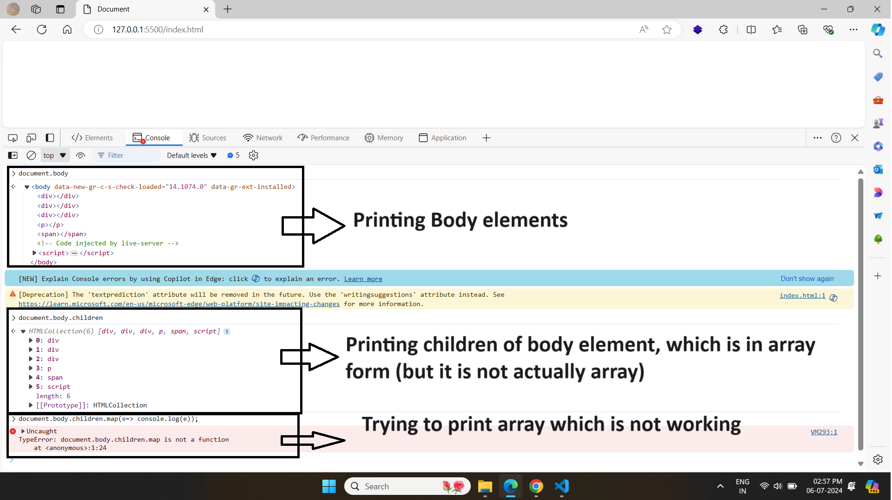
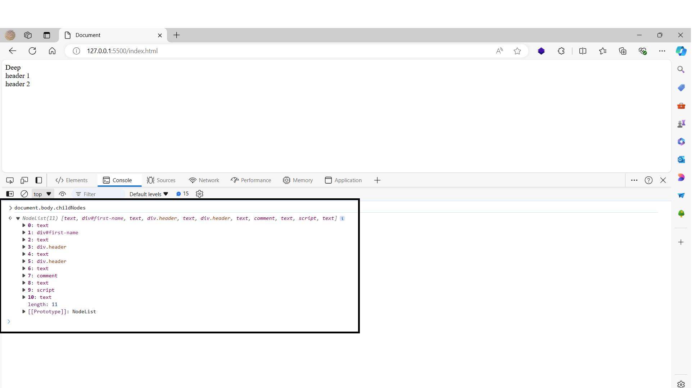
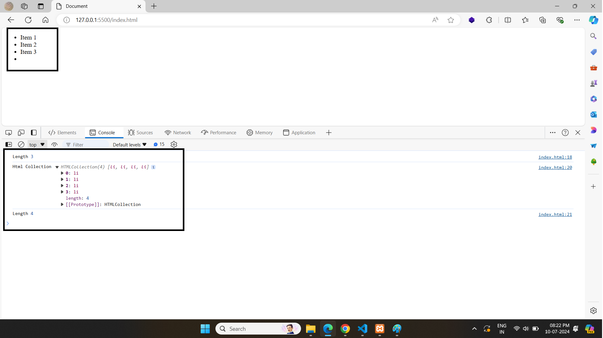
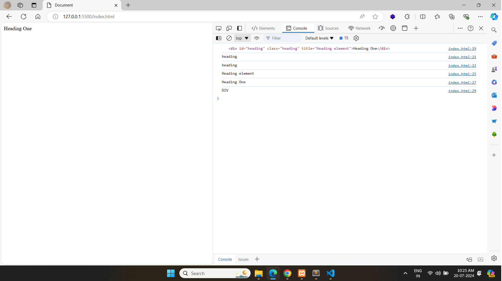

### 📘Information

* The DOM is often referred as DOM Tree (the tree contains thousand of object called as nodes example head node body node etc)

* If you want to work in a browser environment, it's essential to understand the DOM (Document Object Model). However, on the Node.js side, understanding the DOM is not necessary.

* Best Example to Understand DOM Tree (parent, child, siblings)

    

---


* Element change there name according to environment
  * In html world its called **elements**
  * In DOM world its called **Node**
  * In Javascript its called **object**

---

### 📘What is the DOM? & How the DOM Works


**What is the DOM?**

The DOM (Document Object Model) is a way to represent a web page as a tree of objects.

**How it Works**

1. **Loading**: When a browser loads a web page, it reads the HTML and creates a tree-like structure called the DOM.
2. **Structure**: This tree has nodes for each part of the page (e.g., elements like \<div>, \<p>, attributes, and text).
3. **Manipulation**: JavaScript can use the DOM to change the page. For example, it can add or remove elements, change text, or modify styles.
In simple terms, the DOM lets you use JavaScript to make your web page dynamic and interactive by changing the content and structure on the fly.

---

### 📘Document Object

The window object is the global object in a web browser. The document object, which is part of the window, contains all the properties and methods needed to access and manipulate HTML elements.

To access the document object, you can use:

```js
window.document

// OR

document
```
Both references point to the same object, making it easy to work with the structure and content of a webpage.

---

### 📘console.log() vs console.dir for document
* **console.log()**: Displays the element in a readable format, showing its HTML structure.

* **console.dir()**: Displays the element as a JavaScript object, showing its properties and methods.

Use console.log() to see the element as it appears in the HTML, and use console.dir() to explore its detailed JavaScript object structure.

```js
document

// or

console.log(document)
```


```js
console.dir(document)
```


---

### 📘 DOM vs Html Vs Javascript Vs BOM

1. HTML (HyperText Markup Language)

    * What it is: The standard language used to create and structure web pages.

    * Purpose: Defines the structure and content of a web page (e.g., paragraphs, headings, links, images).

    * Example: \<p>This is a paragraph.\</p>


2. JavaScript

    * What it is: A programming language used to create interactive and dynamic content on web pages.

   * Purpose: Adds functionality and behavior to web pages (e.g., form validation, animations, responding to user actions).

   * Example: document.getElementById("myButton").onclick = function() { alert("Button clicked!"); };

3. DOM (Document Object Model)
    * What it is: A programming interface for HTML and XML documents.

   * Purpose: Represents the structure of a document as a tree of objects, allowing JavaScript to access and manipulate the content, structure, and styles of a web page.

   * Example: document.getElementById("myDiv").innerHTML = "Hello, World!";

4. BOM (Browser Object Model)
   * What it is: A set of objects provided by the browser to interact with the web browser itself (outside of the document content).

   * Purpose: Allows JavaScript to interact with the browser (e.g., control the browser window, manage cookies, retrieve browser information).

   * Example: window.alert("This is a BOM example!");

Summary

* HTML defines what elements appear on a web page.

* JavaScript makes those elements interactive.

* DOM is the bridge that lets JavaScript interact with and modify the HTML content.
* BOM is how JavaScript interacts with the browser outside of the web page content (like alert boxes and browser navigation).

---

### 📘Whats is DOM API ?

* A DOM API (Document Object Model Application Programming Interface) is a set of tools that allows developers to interact with and manipulate the structure, style, and content of web pages using programming languages like JavaScript.

* It plays a role of bridge in between Javascript and Browser.

---

### 📘DOM Vs Critical Render Vs CSSOM VS Node

1. DOM Tree

    DOM (Document Object Model) Tree:

    * It's a tree-like structure that represents the content of a web page.

    * The tree is made up of nodes, which can be elements, attributes, or text.

    Example:

    Imagine you have this HTML:

    ```html
    <html>
    <body>
        <h1>Hello World</h1>
        <p>This is a paragraph.</p>
    </body>
    </html>
    ```

    The DOM tree for this HTML looks like this:

    ```css
    html
    └── body
        ├── h1
        │    └── Text: "Hello World"
        └── p
            └── Text: "This is a paragraph."
    ```


2. Render Tree

    Render Tree:

    * It's another tree structure used by the browser to display the web page.

    * It combines the visual aspects (CSS) with the content from the DOM.

    * Only visible elements are included in the render tree (e.g., hidden elements in the DOM won't be in the render tree).

    Example:

    Using the same HTML with some CSS:

    ```html
    <html>
    <body>
        <h1 style="display:none;">Hello World</h1>
        <p>This is a paragraph.</p>
    </body>
    </html>
    ```

    The render tree will look like this:

    ```css
    body
    └── p
        └── Text: "This is a paragraph."
    ```

3. CSSOM

    CSSOM (CSS Object Model) Tree represents the styles for the document. It is built from all the CSS rules in the document and any styles applied directly to the elements

    ```css
    h1 {
        color: blue;
    }
    p {
        font-size: 14px;
    }
    ```
    CSSOM Tree:

    ```css
    h1 {
        color: blue;
    }
    p {
        font-size: 14px;
    }
    ```

4. Node in DOM

    Node in DOM:

    * A node is a single point in the DOM tree.

    * It can be an element (like \<p>), text within an element, or even an attribute.

    Example:

    In the HTML example above:

    * The \<html> tag is a node.

    * The \<body> tag is a node.

    * The text "Hello World" is a text node within the \<h1> element.

    * The style="display:none;" is an attribute node of the \<h1> element.

In summary:

* The DOM tree represents all the content of the web page.
* The render tree represents only the parts of the content that are visible and styled.
* A node in the DOM is any single item in the DOM tree, like an element, text, or attribute.

**⚠️ Note :** The DOM has to consists the HTML code and the HTML spec required that all content must be inside in body tag.

---

### 📘Difference DOM Code, Javascript Code & Access DOM Elements (without nodes)




**Various DOM methods to access elements (without nodes)**

| Sr No | Method Name                       | Return type                                                                                 | notes                                                                                                                                                                                                                                                                        |
| ----- | --------------------------------- | ------------------------------------------------------------------------------------------- | ---------------------------------------------------------------------------------------------------------------------------------------------------------------------------------------------------------------------------------------------------------------------------- |
| 1.    | document.getElementById();        | element object                                                                              |                                                                                                                                                                                                                                                                              |
| 2.    | document.getElementByClassName(); | HtmlCollection (its like an array but not an array but only native for loop will work here) |                                                                                                                                                                                                                                                                              |
| 3.    | document.getElementByTagName();   | HtmlCollection (its like an array but not an array but only native for loop will work here) | Avoid as much you can because it create performance issue                                                                                                                                                                                                                    |
| 4.    | document.querySelector();         | element Object                                                                              | **Always return single element** <br/> **#id**: select Id <br/> **.className** : select class <br/>      **a : hover** : select pseudo classes <br/> **#text.className** : Select that element which have text id and className class <br/> it work same as in css selectors |
|       |
| 5.    | document.querySelectorAll();      | NodeList                                                                                    | **Always return multiple elements**                                                                                                                                                                                                                                          |


```html
<!-- Good Example of querySelector -->
<ul class="language">
    <li>JavaScript</li>
    <li>PHP</li>
    <li>MySql</li>
    <li>React</li>
</ul>
<script>
    let liElement = document.querySelector("li:nth-child(2)");
    liElement.style.backgroundColor = 'red';
</script>
```


**⚠️ Note :**

* on HtmlCollection forEach loop will not work only native for-loop will work, but on NodeList both will work. But both are not array type

* to check various method availability just check their prototype

* **(Best)** you can convert HtmlCollection into Array


```html
<ul>
    <li>Item 1</li>
    <li>Item 2</li>
    <li>Item 3</li>
</ul>

<script>
    let el = document.getElementsByTagName('li');

    // convert into array
    let arr = Array.from(el);

    // will print into array
    console.log(arr);
</>
```


**Apply JS on the fly**


**Example**

```html
<div id="first-name">Deep</div>
<div class="header">header 1</div>
<div class="header">header 2</div>
<script>
    const firstName = document.getElementById('first-name');
    firstName.style.background = 'red';
    firstName.style.color = 'white'

    const headers = document.getElementsByClassName('header');
    for (let i = 0; i < headers.length; i++) {
        headers[i].style.border = '1px solid black';
        headers[i].style.padding = '10px';
    }
</script>
```

---

### 📘 Whats is node and How can Access

* A text node is a part of the HTML structure that contains only text. It's the actual text content you see between the HTML tags.

* Each node can have html attributes. Nodes can also have content including other nodes and text.

**Why You Are Getting Text Nodes:**

When you have spaces, tabs, or newlines between HTML elements, the browser treats these as text nodes. In your HTML:


```html
<body>
    <div id="first-name">Deep</div>
    <div class="header">header 1</div>
    <div class="header">header 2</div>
</body>
```

The spaces and newlines between the \<div> elements are counted as text nodes. So, when you look at the childNodes of the \<body> element, you see these text nodes along with the actual \<div> elements.

Example:

Imagine you have this simplified HTML:

```html
<div>Hello</div>

```

The DOM structure would be:

```css
div
└── Hello
```

Here, the text node contains the word "Hello."

In your case, the newlines and spaces are also text nodes, even though they don't contain visible text. They look like this:

* "\n " (a newline and spaces)

* "\n " (another newline and spaces)

**Why They Matter:**

its because every character in the document has to eventually become part of the DOM like spaces and newlines are valid characters

This is because for the critical rendering process we had to form render tree. In order to display the data in browser, a render tree has to be constructed and part of that render tree is to combine DOM with CSSOM and in this forming of DOM we need to include all the characters within your html. In short, we need every character to from part of our DOM and that's why new lines or spaces are included in our nodes.


* **Preserving Formatting :** Text nodes keep the formatting of your HTML (like spaces and newlines are valid characters).
* **Accessing Content :** Text nodes let you access and change the text inside your elements.

**How can access**

```html
<body>
    <div id="first-name">Deep</div>
    <div class="header">header 1</div>
    <div class="header">header 2</div>
</body>
```



| Sr No | property/Method Name     | Detail                   |
| ----- | ------------------------ | ------------------------ |
| 1     | document.body.childNodes | Return all body elements |

---

### 📘Whats nodeType, nodeValue, nodeName

1. nodeType

   * What it is: A property of a DOM (Document Object Model) node.

   * What it does: Tells you what kind of node it is.

   * Types of values:
        * 1: Element (like \<div>, \<p>)

        * 3: Text (the text inside an element)
        * 8: Comment (a comment in the HTML, like \<!-- comment -->)

        Example:

        ```js
        Copy code
        let element = document.getElementById('myElement');
        console.log(element.nodeType); // 1 for element
        ```

2. nodeName

   * What it is: Another property of a DOM node.

   * What it does: Gives you the name of the node.

   * For an element: It's the tag name (like DIV, P).

   * For a text node: It's #text.

    Example:

    ```javascript
    Copy code
    let element = document.getElementById('myElement');
    console.log(element.nodeName); // 'DIV' if the element is a <div>
    ```
3. nodeValue

   * What it is: A property of a DOM node.

   * What it does: Contains the value of the node.

   * For a text node: It's the text content.

   * For an element: It's usually null.

   Example:
   ```javascript
   Copy code
   let textNode = document.createTextNode('Hello, world!');
   console.log(textNode.nodeValue); // 'Hello, world!'
   ```

**Quick Summary** (you can check on internet)

* **nodeType**: Tells you what kind of node it is (e.g., element, text).
  * 1 : Element
  * 2 : Attr
  * 3 : Text
  * 8 : Comment
  * 9 : Document

* **nodeName**: Tells you the name of the node (e.g., DIV, #text).

* **nodeValue**: Holds the value of the node (e.g., the text in a text node).


**⚠️Note :**

* Use **tagName** when you specifically need to work with element tags.

* Use **nodeName** when you need to identify the type of any node in the DOM.

---

### 📘What is $0


---

### 📘Difference between HTML Collection and NodeList

1. **Html Collection :**
   1. can contains only one type of node, and that one type of node is element node.

2. **Node List :**
   1. can contains any NodeType. That means with its collection it can text nodes, comments nodes, elements nodes etc.


**Major Difference between them**

1. Html Collection can be accessed by their name, by the id or by the index number within that collection

2. A Node list item though can only be accessed by their index number

3. (Major one) HTML collections are live and node list items are typically static


Example

* Html Collection Example

```html
<!-- This will add element into live html -->
<ul>
    <li>Item 1</li>
    <li>Item 2</li>
    <li>Item 3</li>
</ul>
<script>
    let listItem = document.getElementsByTagName('li');
    console.log('Length', listItem.length)
    listItem[0].parentNode.appendChild(document.createElement('li'));
    console.log('Html Collection', listItem);
    console.log('Length', listItem.length)
</script>
```



* NodeList Example

```html
<ul>
    <li>Item 1</li>
    <li>Item 2</li>
    <li>Item 3</li>
</ul>
<script>
    let listItem = document.querySelectorAll('li');
    console.log('Length', listItem.length)
    listItem[0].parentNode.appendChild(document.createElement('li'));

    console.log('Html Collection', listItem);

    console.log('Length', listItem.length)

</script>
```


---

### 📘DOM Traversing

* DOM traversing is the process of moving through the HTML structure (Document Object Model) to access and manipulate different elements and nodes. This can include moving up to parent elements, down to child elements, or across to sibling elements.

* Before understand Traversing you need to understand DOM Tree family. There are three types of nodes in the DOM can be expressed as parents, children and siblings

---

### 📘Most 3 Objects in DOM Traversing

 Best Example to Understand DOM Tree (parent, child, siblings)


Three objects

* **window :** Which is accessible on global level
* **document :** which is accessible on global level and will returns all dom
* **document.documentElement** which will return all written Html element


---

### 📘Accessing Nodes

1. **To Access Parent**

    | Sr No | property/Method Name        | Detail           |
    | ----- | --------------------------- | ---------------- |
    | 1     | document.body.parentNode    | Return html node |
    | 2     | document.body.parentElement | Return html node |


2. **To First and last Child**

    | Sr No | property/Method Name | Detail                      |
    | ----- | -------------------- | --------------------------- |
    | 1     | .firstElementChild   | Return first element (best) |
    | 2     | .firstChild          | Return child node           |
    | 3     | .lastElementChild    | Return last (best)element   |
    | 4     | .lastChild           | Return last node            |

    **⚠️ Note**

    * If element don't have any child then it will return empty HtmlCollection

    * If element have only child then his first & last child will be same.

    * If element have more then one then it will return HtmlCollection


3. **To Access all Children**


    | Sr No | property/Method Name | Detail                                                                 |
    | ----- | -------------------- | ---------------------------------------------------------------------- |
    | 1     | .children            | Return all children element with html Collection (best)                |
    | 2     | .childNodes          | Return child node  (with all text nodes as well to maintain structure) |


4. **To Access Sibling**

    | Sr No | property/Method Name    | Detail                         |
    | ----- | ----------------------- | ------------------------------ |
    | 1     | .nextElementSibling     | Return sibling element (best)  |
    | 2     | .nextSibling            | Return sibling node            |
    | 3     | .previousElementSibling | Return previous element (best) |
    | 4     | .previousSibling        | Return previous node           |

**⚠️Note :** methods like XXXElementXXX are useful when you want to show data in console window, otherwise XXXSibling are very use while accessing nodes in codes

```html
<body>
    <h1>Hello</h1>
    <p>World</p>

    <script>
        let div = document.createElement('div');
        div.innerHTML = 'Javascript';

        let h1Element = document.querySelector('h1');
        document.body.insertBefore(div, h1Element.nextSibling)

        // OR

        document.body.insertBefore(div, h1Element.nextElementSibling)

    </script>
</body>
```


---

### 📘document Vs Document Vs Html Document


**Document:**

* Refers to the JavaScript global object that represents the entire web page loaded in the browser.

* It's a standard object in the web programming language.

**document:**

* This is an instance of the Document object, representing the content of the web page.

* It includes methods and properties to access and manipulate the content, like getElementById or createElement.

**HTML Document:**

* This is the specific type of document that is an HTML file.

* When the Document object represents an HTML page, it's referred to as an HTML Document.

* It contains elements like \<html>, \<body>, \<head>, etc.


**Summary**
* Document: Think of it as the big container holding everything you see on a web page.

* document: This is like the blueprint or instructions inside the container that helps you find and change things on the web page.

* HTML Document: This is the specific type of container for web pages that use HTML, with tags like <html>, <body>, etc.

---

### 📘CreateElement

Steps

1. Create an element and add some HTML content.

2. Find the parent where you want to add the element.

3. Attach the created element to the parent.


**Syntax**


```js
document.createElement('div')
```


* **createElement**

    ```js
    let div = document.createElement('div');
    console.log(div)    // <div><div>
    div.innerHTML = 'hello';
    document.body.appendChild(div);
    ```

**⚠️ Note :** we can create any element use createElement example div, script, head, html etc and created same like normal html tags

---

### 📘Insert Element

**Syntax**

```js
parentElement.appendChild()

parentElement.insertBefore()
```


* **appendChild :** always add element at last of selected element


    ```js
    let div = document.createElement('div');
    console.log(div)    // <div><div>
    div.innerHTML = 'hello';
    document.body.appendChild(div);
    ```

* **insertBefore :** always add element before selected element

    ```html
    <body>

        <h1>Hello World</h1>
        <h2>Hello John</h2>

        <script>
            let div = document.createElement('div');

            div.innerHTML = '<h1>Hello Deep</h1>'

            document.body.insertBefore(div, document.body.firstChild);

        </script>
    </body>
    ```

    **⚠️Note :** There is no method like insertAfter so we can us hack


    ```html
    <body>
        <h1>Hello</h1>
        <p>World</p>

        <script>
            let div = document.createElement('div');
            div.innerHTML = 'Javascript';

            let h1Element = document.querySelector('h1');
            document.body.insertBefore(div, h1Element.nextSibling)

            // OR

            document.body.insertBefore(div, h1Element.nextElementSibling)

        </script>
    </body>
    ```

---

### 📘Replace Element

```html
<ul id="myList">
    <li id="item1">Item 1</li>
    <li id="item2">Item 2</li>
    <li id="item3">Item 3</li>
</ul>
<script>
    // Create a new li element to replace the old one
    const newItem = document.createElement('li');
    newItem.textContent = 'This is the new item';

    // Select the old li element
    const oldItem = document.getElementById('item2');

    // Replace the old li element with the new li element
    oldItem.replaceWith(newItem);

</script>
```

---

### 📘Remove Element


**Syntax**

```js
// if you element directly (best one) & its a new method introduce in browser
Node.remove()

// In case if you know parent or can access to parent easily
parentElement.removeChild(Node)
```


* **remove()**

    ```html
    <h1>Hello</h1>
    <p>World</p>

    <script>
        document.body.children[0].remove()

    </script>
    ```
* **removeChild()**

    ```html
    <h1>Hello</h1>
    <p>World</p>

    <script>
      document.body.removeChild(document.querySelector('h1'));
    </script>
    ```

---

### 📘Copy

```html
<body>
    <h1>Clone Node</h1>

    <ul>
        <li>Item 1</li>
    </ul>

    <script>
        let ulElement = document.querySelector('ul');


        let liElement1 = document.createElement('li');
        liElement1.textContent = 'Item 1';
        ulElement.appendChild(liElement1);

        // OR

        let liElement = document.querySelector('li');

        // true means copy every thing like text also, false means copy only the element
        ulElement.appendChild(liElement.cloneNode(true));
    </script>
</body>
```

---

### 📘Attributes

**Access and Set Attribute**

1. DOM Property Method (Short way & best One) : it will give you dynamic value if change value from previous state

    ```html
    <div id="heading" class="heading" title="Heading element">Heading One</div>
    <script>
        let element = document.querySelector('#heading');

        console.log(element);

        console.log(element.id);

        console.log(element.className);

        console.log(element.title);

        console.log(element.textContent);

        console.log(element.tagName)
    </script>
    ```

    


2. HTML Attribute (Long way) : it will give you static value if change value from previous state

    ```html
    <body>
        <div id="heading">Heading One</div>
        <script>
            let headingElement = document.getElementById("heading");

            // To Get Attribute
            headingElement.setAttribute("class", "heading-class");
            headingElement.setAttribute("title", "heading title");

            // To Set Attribute (it will give you static value if change value from previous state)
            console.log(headingElement.getAttribute("class"));
        </script>
    </body>
    ```
    

    **⚠️Note :** setAttribute method will always replace existing attributes.


3. using Create Element

    ```html
    <script>
        let div = document.createElement('div');
        div.innerHTML = "Hello world"
        div.id = "div-id";
        div.className = "div-class";
        div.setAttribute('data-key', 'random-value');
        div.style.backgroundColor = 'red';
        div.style.color = "#fff"
        div.style.padding = '10px'

        document.body.appendChild(div);
    </script>
    ```

---

### 📘CSS

* Adding Style
    ```js
    document.body.style.backgroundColor = "red";
    document.body.style.fontSize = "20px";
    document.body.style.padding = "10px";

    // OR

    let h1Element = document.querySelector('h1');
    h1Element.setAttribute('style', 'color : red; background-color : pink');
    ```
* Toggling Class

    ```html
    <style>
        .danger {
            color: red;
        }
    </style>
    <h1>Hello World</h1>
    <button id="btn">Change Color</button>
    <script>
        let btn = document.getElementById('btn');
        btn.addEventListener('click', function () {
            let h1 = document.querySelector('h1');
            h1.classList.toggle('danger');
        })
    </script>
    ```
---

### 📘Text

1. .textContent : it will give you hidden text as well

2. .innerText : it will not give hidden text

3. .innerHtml : it will give complete html elements

4. .outerHtml : similar to innerHtml


```html
<div id="">Hello <span style="display: none;">World</span></div>
<script>
    let div = document.querySelector("div");
    console.log(div.innerText);     // Hello

    console.log(div.textContent);   // Hello World

    console.log(div.innerHTML);     // Hello <span style="display: none;">World</span>
</script>
```
---

### 📘Normal Vs Optimize

```html
<ul class="language">
    <li>JavaScript</li>
</ul>
<script>
    function addLanguage(langName) {
        const li = document.createElement('li');
        li.innerHTML = langName;
        document.querySelector('.language').appendChild(li);
    }

    function addOptimizedLanguage(langName) {
        const li = document.createElement('li');
        const addText = document.createTextNode(langName);
        li.appendChild(addText);
        document.querySelector('.language').appendChild(li);
    }

    addOptimizedLanguage('C++');
    addLanguage('Java');
    addOptimizedLanguage('Python');
    addLanguage('C#');
</script>
```
---

### 📘Events
Events are not part of the core JavaScript language. They are provided by the DOM (Document Object Model) API built into the browser.

To master events, we need to understand two key concepts:

1. Event Handlers (e.g., click, key press)

2. Event Listeners


An **Event listener** attaches a responsive interface to an element, allowing it to wait and listen for a specific event to occur.

There are three ways to attach event listeners to an element:

1. Inline Event Listeners

```html
<button onclick="alert('Hello World')">Click Me </button>
```


2. Inline Properties


```html
<button>Click me</button>

<script>
    let btn = document.querySelector('button');
    btn.onclick = function () {
        alert('Hello World!');
    }
</script>
```
* Can only attach single method on single eventListener( only last function will work)

```html
<button id="btn">Click Me</button>
<script>
    const btn = document.getElementById('btn');

    function test() {
        console.log('test');
    }

    function helloWorld() {
        console.log('Hello World');
    }

    btn.onclick = test
    btn.onclick = helloWorld;
</script>
```

3. addEventListener Method : (best one)


```html
<button>Click me</button>

<script>
    let btn = document.querySelector('button');

    /*
        Parameters are
        1. Event Type
        2. Event Handler
    */
   btn.addEventListener('click', function () {
       alert('Hello World!');
    });
</script>
```
* Can attach multiple methods on single eventListener (both method will work)

```html
<button id="btn">Click Me</button>
<script>
    const btn = document.getElementById('btn');

    function test() {
        console.log('test');
    }

    function helloWorld() {
        console.log('Hello World');
    }

    btn.addEventListener('click', test);
    btn.addEventListener('click', helloWorld);
</script>
```


**Small Example for Read more**

```html
<!-- Hide and show div height -->
<!DOCTYPE html>
<html lang="en">

<head>
    <meta charset="UTF-8">
    <meta name="viewport" content="width=device-width, initial-scale=1.0">
    <title>Document</title>
    <style>
        body {
            background-color: #eee;
        }

        #content {
            background-color: white;
            width: 400px;
            padding: 5px;
            margin: auto;
            max-height: 100px;
            overflow: hidden;
            transition :max-height 1s;
        }

        #link {
            display: block;
            text-decoration: none;
            width: 200px;
            margin: 5px auto;
            background-color: aqua;
            padding: 5px;
            text-align: center;
            color: black;
        }

        #content.open {
            max-height: 1000px;
            transition :max-height 1s;
        }
    </style>
</head>

<body>
    <div id="content">
        <p>Lorem ipsum dolor sit amet consectetur adipisicing elit. Dolorem fugiat recusandae id illum corporis
            voluptas, possimus sed delectus? Officia a nisi necessitatibus quae itaque totam, distinctio velit maiores
            atque at sunt! Aperiam porro natus nemo recusandae quam alias veritatis esse neque, placeat, minus amet
            praesentium vitae iusto necessitatibus rem facere?</p>
        <p>Lorem ipsum dolor sit amet consectetur adipisicing elit. Consequatur debitis amet quidem, minima non, sed
            blanditiis molestiae iste eveniet voluptatem voluptates alias natus accusamus provident tempore molestias
            error quas obcaecati nihil perferendis hic. Quod labore quisquam reprehenderit nisi sequi aliquid ab
            consequatur placeat atque error ullam alias, deleniti nesciunt mollitia!</p>
    </div>
    <div>
        <a href="#" id="link">Click here for more details</a>
    </div>
    <script>
        let content = document.querySelector("#content");
        let btn = document.querySelector("#link");
        btn.addEventListener('click', function (e) {
            e.preventDefault();
            if (content.className == "open") {
                content.className = "";
            } else {
                content.className = "open";
            }
        })
    </script>
</body>

</html>
```

```html
<!-- Random Color -->
<button id="btn">Click</button>
<script>
    function changeBgColor() {
        let randomColor = Math.floor(Math.random() * 16777215).toString(16);
        randomColor.padStart(6, "0");
        document.body.style.backgroundColor = "#" + randomColor;
    }

    document.getElementById("btn").addEventListener("click", changeBgColor);
</script>
```

---

### 📘Bubbling, Capturing, StopPropagation, StopImmediatePropagation and Event Delegation,

* All are written in JS documentation

```html
<!-- Event Delegation Example -->
<style>
    .hidden {
        display: none;
    }
</style>
<div id="food">
    <ul>
        <li>Meats
            <ul>
                <li>Red Meat
                    <ul>
                        <li>Beef</li>
                        <li>Pork</li>
                        <li>Lamb</li>
                    </ul>
                </li>
                <li>Other
                    <ul>
                        <li>Fish</li>
                        <li>Prawns</li>
                        <li>Chicken</li>
                    </ul>
                </li>
            </ul>
        </li>
        <li>Vegetables
            <ul>
                <li>Favorite
                    <ul>
                        <li>Potatoes</li>
                        <li>Sweet Corns</li>
                        <li>Carrot</li>
                    </ul>
                </li>
                <li>Not Favorite
                    <ul>
                        <li>Radish</li>
                        <li>Beetroot</li>
                        <li>Bottle guard</li>
                    </ul>
                </li>
            </ul>
        </li>
    </ul>
</div>
<script>
    let foodElement = document.querySelector('#food');
    foodElement.addEventListener('click', function (e) {
        let liElement = e.target;

        let ulElement = liElement.querySelector('ul');

        if (ulElement) {
            ulElement.classList.toggle('hidden');
        }
    });
</script>
```


---

### 📘Host Objects Vs Native Objects

**Host Objects :**  Host objects are objects provided by the environment in which your JavaScript code runs (like the browser or Node.js).

Examples in a Browser:

1. window: Represents the browser window.

2. document: Represents the HTML document loaded in the window.

3. XMLHttpRequest: Used to make network requests.

Examples in Node.js:

1. fs: Used for file system operations.

2. http: Used to handle HTTP requests and responses.

**Native Objects :** Definition: Native objects are built-in objects provided by the JavaScript language itself, regardless of the environment.

Examples:

1. Array: Used to create and manipulate arrays.
2. String: Used to create and manipulate strings.
3. Object: The base object that other objects inherit from.
4. Function: Used to create and manipulate functions.

Summary:

1. Host Objects: Provided by the environment (like browser or Node.js).
2. Native Objects: Built into the JavaScript language itself.

In simple terms, host objects are like tools given by the place where your JavaScript runs, while native objects are like the basic building blocks provided by JavaScript itself.


---

### 📘Element Node Object Hierarchy and the prototype available for HTML element

```js
let p = document.createElement('p');
console.log(p);     // <p></p>

console.dir(p);     // p object

console.log(p.__proto__)    // HTMLParagraphElement
```


* **EventTarget** : It is a root object and serves as the base for all event-handling objects in the DOM. In other words, EventTarget allows all nodes in our DOM to utilize events. It provides the addEventListener method, among others, to handle events. EventTarget is a DOM interface implemented by various objects, including all Node objects, Window, XMLHttpRequest, and others.

* **NodeObject** : The Node object provides methods for traversing the DOM. It includes properties such as parentNode, childNodes, nextSibling, and others.

* **Element** : This class is the base of all DOM elements. It allows us to traverse only element nodes. It provides properties and methods such as nextElementSibling, children, querySelector, and more.

* **Html Element** :  This class provides specific operations and queries that can be performed on any HTML element. It includes properties and methods tailored for HTML elements.

* **HtmlParagraph Element :** This is the object for the \<p> element. Each HTML tag has its own unique object, and the HTMLParagraphElement inherits properties and methods from its ancestors.