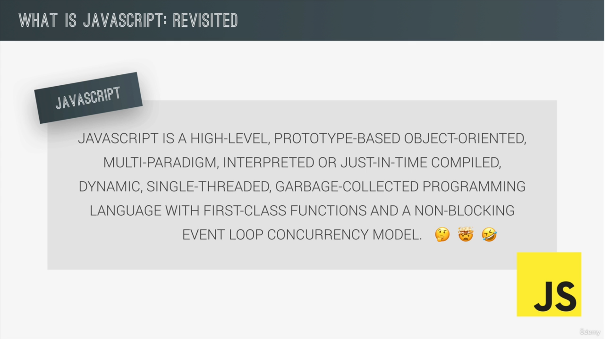
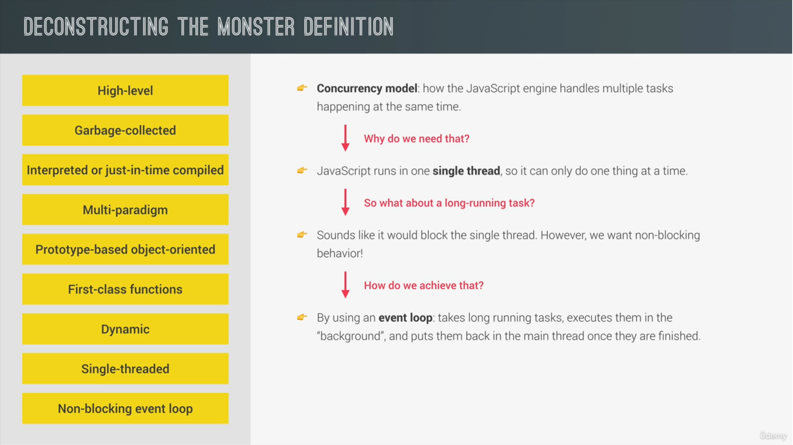
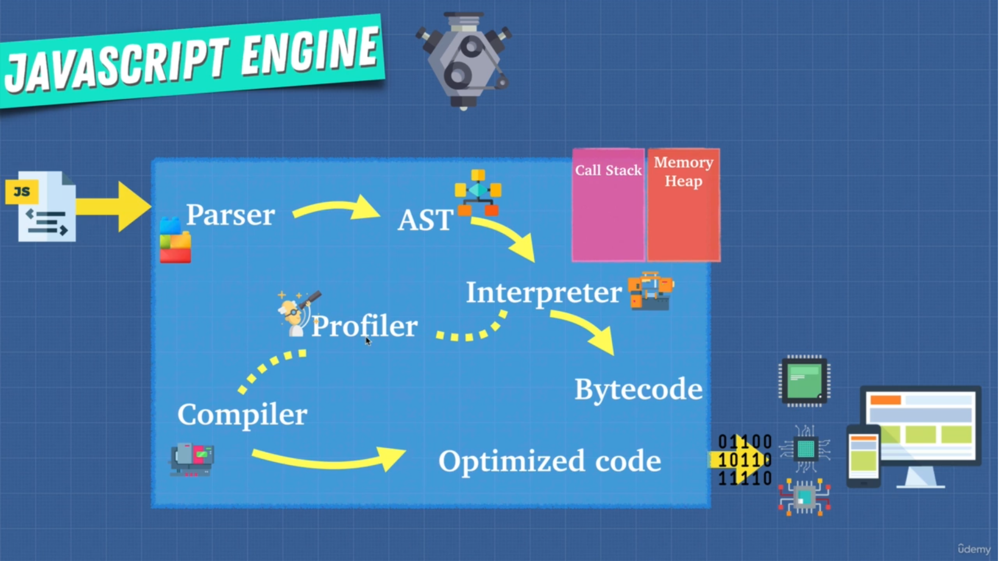
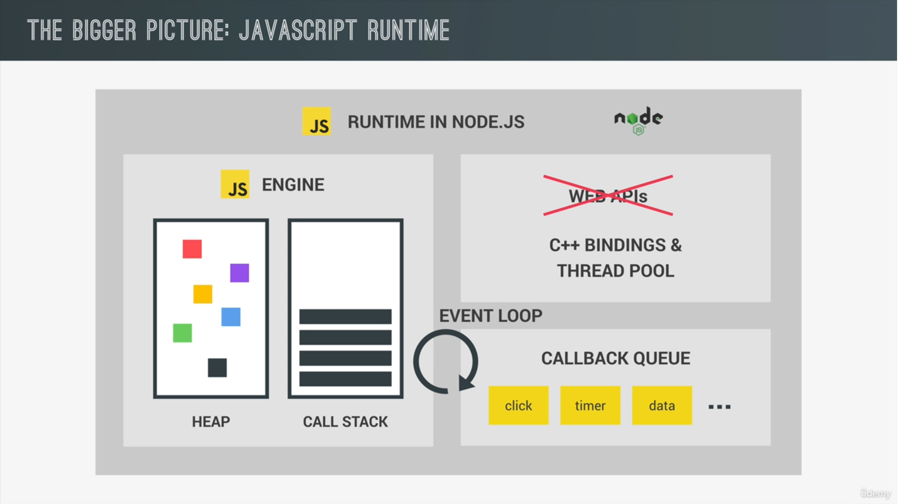

 # 📔Javascript Tricks

## 📘Basic Information









---
## 📘Destructuring

* Converting Array into object
```js
var techBrand = [
    "Facebook",
    "Apple",
    "Amazons",
    "Netflix",
    "Google"
]

var object = { ...techBrand };
console.log(object);
```
* Bases on condition

```js
const state = true;
const student = {
    sid: 101,
    ...(state && { grade: 'pass' })
}

console.log(student);
```


## 📘Operators

* use the **!!** operator to convert the result of an **expression into Boolean value**
```js
const grade1 = 'Pass';
console.log(!!grade1);

const grade2 = '';
console.log(!!grade2);
```


* Return Expression

```js
function isAdult(age) {
    return age >= 18;       // true or false
}
```
* This **+** operator is use for
  * concatenate the strings
  * Converting into Number
  * Adding the Numbers

```js
console.log("a" + "b");     // ab
console.log("a" + +"b");    // aNaN
console.log(+"a" + +"b");   // NaN
console.log(+"a" + "b");    //NaNb
```

---
## 📘Arrays

* Sort Method (for string)

```js
const array = [
{
    id: 5,
    description: 'Hello ij'
},
{
    id: 4,
    description: 'Hello ef'
},
{
    id: 1,
    description: 'Hello cd'
},
{
    id: 3,
    description: 'Hello gh'
},
{
    id: 2,
    description: 'Hello ab'
}
];

let sortedArray = array.slice().sort((a, b) => a.description.localeCompare(b.description))

// Comparing String
/*output
Hello ab
Hello cd
Hello ef
Hello gh
Hello ij
*/

let sortedArray = array.slice().sort((a, b) => a.id - (b.id))
// comparing Numbers
/*
1. Hello cd
2. Hello ab
3. Hello gh
4. Hello ef
5. Hello ij
*/

```
---
## 📘Extra Features

* **Generate Random Numbers** in javascript

```js
console.log(crypto.randomUUID());   // 1d35cbb8-e3ff-47b0-a9dc-8d0c499b9a56
```
* use of **use strick** mode
  * Not allowed to make unwanted variables (like created after spelling mistake)
```js
const superLongVariable = "hi";
superLongVariables = "bye";
console.log(superLongVariables);    // bye

// Correct one
"use strict"
const superLongVariable = "hi";
superLongVariables = "bye";
console.log(superLongVariables);    // bye
```

```html
<!-- using by Module -->
<script type="module">
    const superLongVariable = "hi";
    superLongVariables = "bye";         // error
    console.log(superLongVariables);    // bye
</script>
```

## 📘Loops
* Use **For in** always on **Objects**
* Use **For of** always on **Array**
---

## 📘If-else

* Avoid nested simple if-else and use **ternary Operator**
* Avoid if-else leader and use **Guard Clauses Technique**
```js
// wrong
function test() {
    if(wifi) {
        if(login){
            if(admin) {
                seeAdminPanel();
            }else {
                console.log('Must be Authorized')
            }
        }else {
            console.log('Must be Login')
        }
    }else {
        console.log('must be wifi')
    }
}

// correct one
function test() {
    if(!wifi) {
        console.log('must be wifi')
        return;
    }
    if(!login){
        console.log('Must be Authorized')
        return;
    }
    if(!admin) {
        console.log('Must be Login')
        return;
    }
    seeAdminPanel();
}
```
* if you have **very large if-else** statements then use **switch-case** code