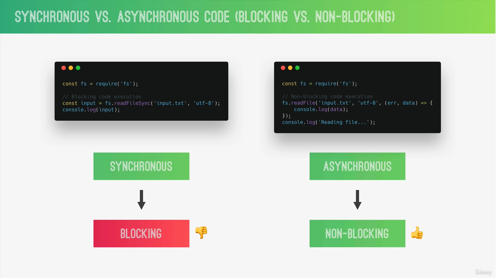
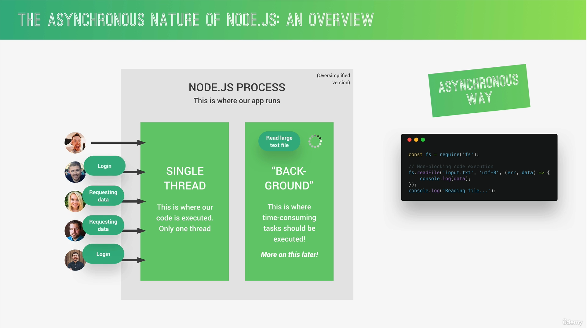

### 📘Information

1. For Node Documentations (all api's)

```
https://nodejs.org/docs/latest/api/
```
2. In Node first parameter in every function (callback) will be **error** parameter and second one will be **data**

```js
// Example
fs.readFileSync('./input.txt', 'utf-8', (error, data) => {
    console.log('data : ', data);
    console.log('error', error);
})
```

3. Data Can be store in following modules
   
   1. Json-File
   2. Mysql
   3. MondoDB 

---

### 📘What is Node.js


---

### 📘Javascript on the server Side

* Build fast, highly scalable network applications (back-end).

* Node.js can access file system.

* Better networking capabilities.


### 📘Global variables

* Open terminal and type **node** then hit enter

* Press **tab** key word you can see a list of global variables

* You can see various methods in function constructor using **String.** then press tab

* _ (underscore) it will store your previous result.

    ```js
    3 + 4   // 7
    _ + 5   // 12
    ```

* We can write any thing in terminal like js example creating variable, print output etc

---


## 📘Synchronous Vs Asynchronous







---

## 📘Reading and Writing Files in Synchronous way VS Asynchronous way

```js
// This 'fs' module allows us to read, write functions on files
const fs = require('fs');
```


**Synchronous Way**


* **input.txt**
```
Hello may name is Deep Singh. I am working as front end engineer. My Primary technology is React.
```

* **app.js**
```js
// default function for files
const fs = require('fs');

/*
    Read data from file
    1. First parameter is path name
    2. second parameter is character set
*/
const textIn = fs.readFileSync('./input.txt', 'utf-8');
console.log(textIn);

const textOut = `this is text which is adding through coding. ${textIn}\n Created on ${Date.now()}`;


/*
    writing content in file
    1. First parameter is path name (it wll generate new file)
    2. second parameter is write text to
*/
fs.writeFileSync('./output.txt', textOut);  // this file will generate automatically
```

```
node app.js
```

**Asynchronous Way**


* **Reading Data**

```js
console.log('Execute Start');

/*
    Read data from file
    1. First parameter is path name
    2. second parameter is character set
    3. Callback function
*/

const fs = require('fs');
fs.readFile('./input.txt', 'utf-8', (error, data) => {
    console.log('data : ', data);
    console.log('error', error);
})

console.log('Executed End');

/*
    Output

    Execute Start
    Executed End
    data :  Hello may name is Deep Singh. I am working as front end engineer. My Primary technology is React.
    error null */
```

* **Reading and writing Data**

```js
console.log('Execute Start');

const fs = require('fs');
fs.readFile('./input.txt', 'utf-8', (error, data) => {
    if (error) {
        return console.log('Error !!! file not found')
    }
    console.log('data : ', data);
    console.log('error', error);

    fs.writeFile('./output.txt', data + ' Coming data from async code', 'utf-8', err => {
        console.log('Your fetch file and code written successfully');
    })
})

console.log('Executed End');
```
---

## 📘Creating a Simple Web Server with server response


This built-in http module, which allows you to create an HTTP server.

```js
const http = require('http');
```


* Steps to build server
  
  1. Create a server
  
  2. Start a server to consume


**Create Server**


* app.js
```js
const http = require('http');

/* 
    use to create server 
    1. First parameter will be request Parameter
    2. Second Parameter will be response Parameter
*/

const http = require('http');

// creating server
const server = http.createServer((request, response) => {
    
    // use to send response to client
    console.log(request)

    // use to send response to client
    response.end('Hello from server!');
});


/* 
    use to create server 
    1. First parameter will be Port Number
    2. Second Parameter will be Address
    3. Optional parameter for response
*/

// Listening request
server.listen(8000, '127.0.0.1', () => {
    console.log('Listening to request on port 8000');
});
```

* Run Command
```
node index.js
```

* Hit this address in google chrome
```
http://127.0.0.1:8000/
```


**📖 Theory :** 

```js
const server = http.createServer((request, response) => {
    // use to send response to client
    console.log(request)

    // use to send response to client
    response.end('Hello from server!');
});
```

Here, an HTTP server is created using the http.createServer method. This method takes a callback function that will be executed every time a request is received. The callback function has two parameters: request and response.

* request: Contains information about the client's request (e.g., URL, headers, method).

* response: Used to send a response back to the client.

Inside the callback function:

* console.log(request): Logs the request object to the console.

* response.end('Hello from server!'): Sends a response back to the client with the message 'Hello from server!' and ends the response.


```js
server.listen(8000, '127.0.0.1', () => {
    console.log('Listening to request on port 8000');
});
```

This line starts the server, making it listen for incoming requests on port 8000 and the IP address 127.0.0.1 (localhost). The callback function inside server.listen will be executed once the server starts listening, logging 'Listening to request on port 8000' to the console.

---


### 📘Routing using Http Module & Returning json Data


```js
const http = require('http');
const fs = require('fs');


/* This code will run only once */
const data = fs.readFileSync('./product.json', 'utf-8');
$responseBody = data;


/* this code will run again and again because it is in callback function of http.createServer so when ever we hit request this call back function will be executed */
const server = http.createServer((request, response) => {

    const pathName = request.url;

    if (pathName === '/' || pathName === '/overview') {
        response.end('Welcome to our homepage');
    } else if (pathName === '/about') {
        response.end('Welcome to our about page');
    } else if (pathName === '/product') {
        // sending json data

        $statusCode = 200;
        $headers = {
            'Content-type': 'application/json',
        }

        response.writeHead($statusCode, $headers);
        response.end($responseBody);

    } else {
        // sending html data

        $statusCode = 404;
        $headers = {
            'Content-type': 'text/html',
            'my-own-header': 'hello-world'
        }
        $responseBody = '<h1>page not found</h1>';

        response.writeHead($statusCode, $headers);
        response.end($responseBody);
    }
});

server.listen(8000, '127.0.0.1', () => {
    console.log('Listening to request on port 8000');
});
```

---

## 📘Creating and Loading Modules

* In Node every single file ic called Module


* Exporting with using Object
```js
// app.js
function sayHello(name) {
    console.log('Hello ' + name)
}

module.exports.sayHello = sayHello;
```

```js
// script.js
var app = require('./app');

app.sayHello('Deepinder Singh')
```
* Exporting with names
```js
// app.js
function sayHello(name) {
    console.log('Hello ' + name)
}

module.exports= sayHello;
```

```js
// script.js
var app = require('./app');

app('Deepinder Singh')
```

```
node script.js
```
