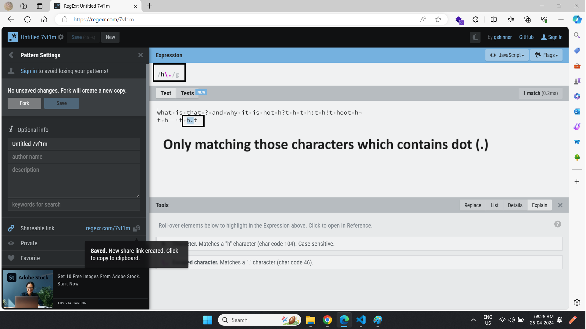
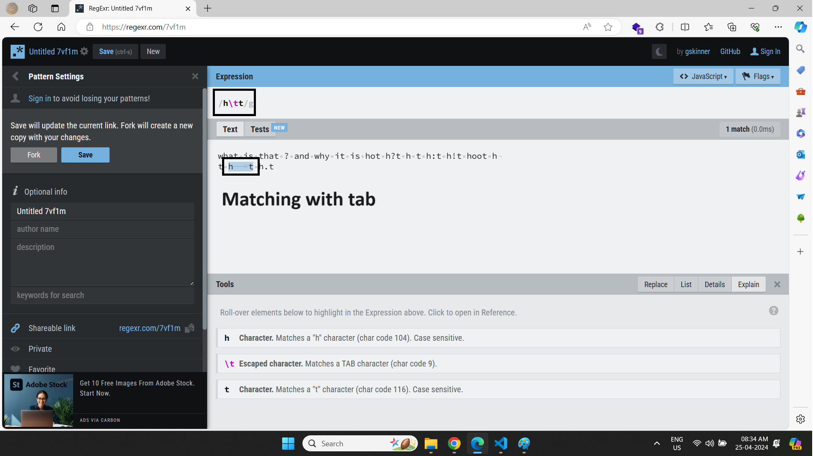
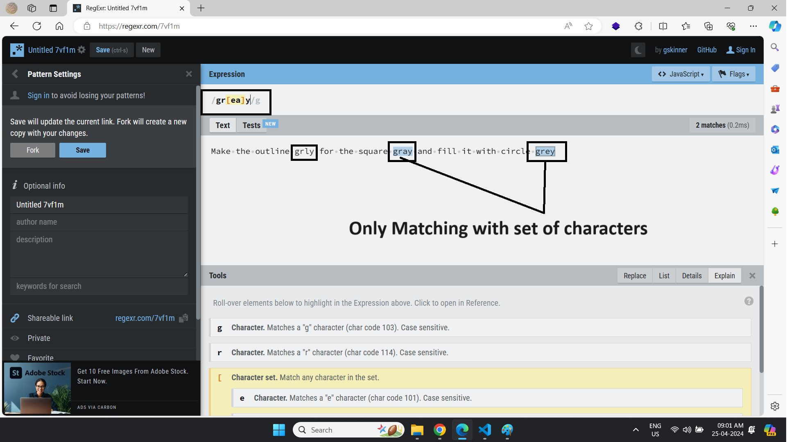
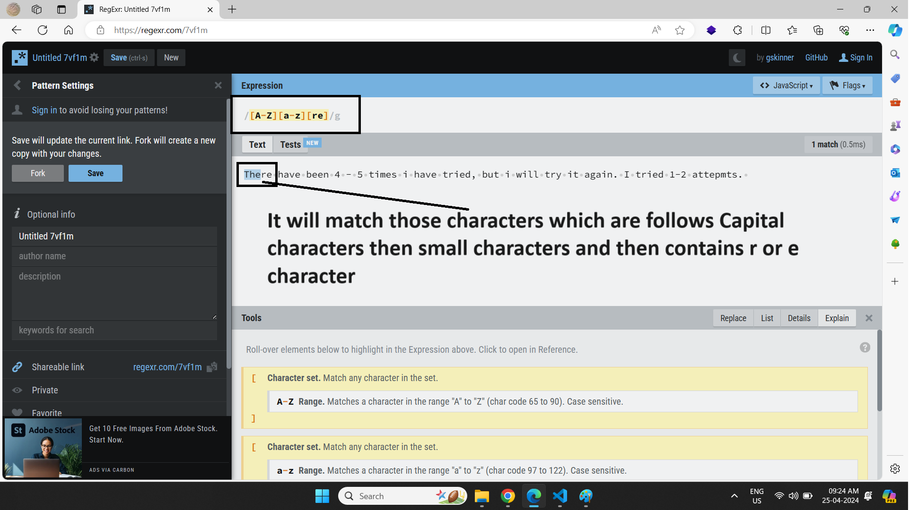
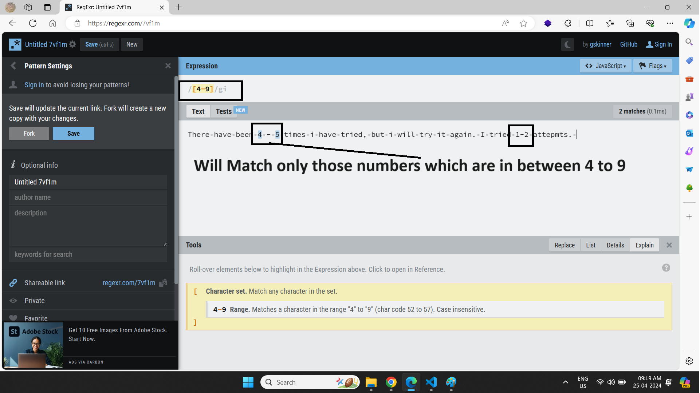
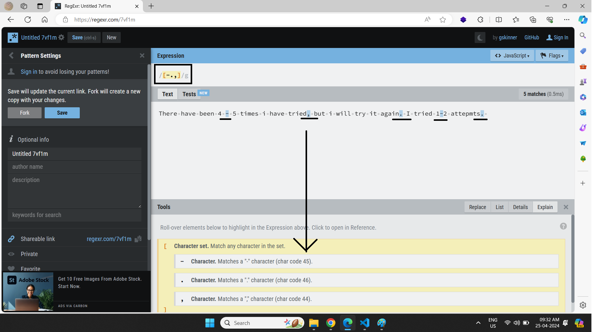
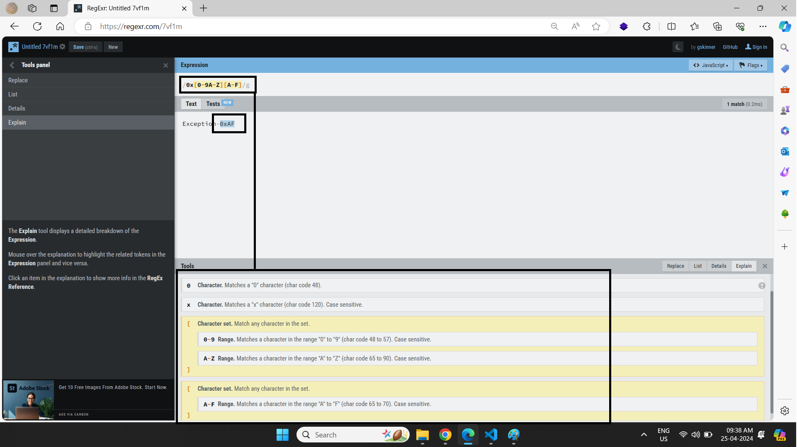

### 📘What is Regular Expression
1. It is use to find the things in the text
2. Regular expression world exist between these **/Regular expression world/** (forward slash) and this syntax called regular expression literals
3. Every thing in a string is called character example space, new-line, tab, special character, alpha character, numeric character etc

---

### 📘Reference

[Regexr](https://regexr.com/)

---

### Flags
1. **Single and exact Match** : it will check only first occurrence

```js
let str = "Hello World. Hello Deep";
let regex = /Hello/;    // only check first Hello
```


2. **Global flag** : it will check whole string now

```js
let str = "Hello World. Hello Deep";
let regex = /Hello/g;   // check every Hello
```

3. **Case-insensitivity** : it will check small and big characters

```js
let str = "Hello World. Hello Deep";
let regex = /hello/i;
```
---

### 📘Function to match expression
1. **exec()** : This function will return an array for match or null for no match

```js
// Example 1
let str = "Hello World. Hello Deep";
let regex = /hello/i;

let output = regex.exec(str);
console.log(output);

// Example 2
let str = "Hello World. Hello Deep";
let regex = /o/g;

let match = '';
while ((match = regex.exec(str)) !== null) {
    console.log(match);
}
```

2. **test()** : Returns true or false if the regular expression exist in a string (best method)

```js
let str = "Hello World. Hello Deep";
let regex = /hello/i;

let output = regex.test(str);
console.log(output);    // true
```

3. **match()** : It will return an array of results or null (good one)

```js
let str = "Hello World. Hello Deep";
let regex = /Hello/g;

let output = str.match(regex);
console.log(output);
```

4. **search()** : return index of first match else -1

```js
let str = "Hello World and Hello Deep";
let regex = /world/gi;

let output = str.search(regex);
console.log(output);    // 6
```

5. **replace()** : Returns new replaced string with all replacement, if we use regular expression with 'g' flag then it work like replaceAll() method

```js
let str = "Hello World and Hello Deep";
let regex = /hello/gi;

let output = str.replace(regex, "Universe");
console.log(output);
```
---


### 📘Meta Characters

Various Meta Characters : **^$.*+?=!|\/()[]{}**

1. **Wild Card Meta Characters** : 
   1. The wild card is represented by a period(.). Wild card means it can be anything. so when a period is used in a regular expression, it represents any single character.
   2. But it has exceptions with some control characters like new line. 
   3. It is important to remember that it is only for single character not multiple characters.

```js
let regex = /h./gm
```


2. **Escaping Meta Character** : Using the forward slash ('\'), basically behave meta characters as normal string(called literal value)

```js
let regex = /h\./gm
```



**⚠️Note :** if you put meta character into meta it will behave like normal string

```js
let regex = /[.]/g  // it will check only dot not the whole character
```

3. **Control Characters** : 
   1. \t : tab
   2. \n : new line (best one)
   3. \r : carriage tab
   4. \v : vertical tab



4. **Character Sets** : Matching the group of characters in the text using [] with characters sets but only exception with hyphen '-' character.

```js
let regex = /gr[ae]y/g
```






5. **Specific Range** : Specify range of characters using-meta characters

```js
let regex = /[1-4]/g
```


**⚠️Note :** When you using '-' in starting then it behave like a normal string so no need to escape character.






