## 📔React with Typescript

### 📘Command
```
npx create-react-app rts --template typescript
```

```
npx create-vite@latest rts
```
---

### 📘Rules for TypeScript in React

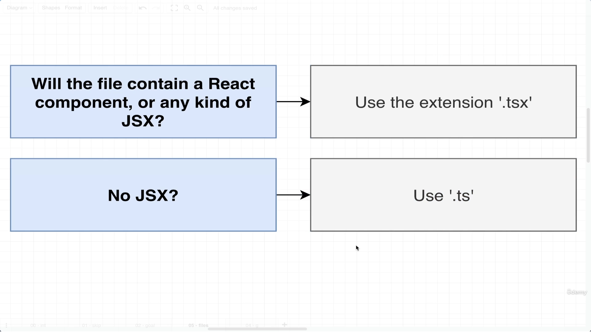

* There is no major change in react code like adding any special of fantastic code. 
* It only help in checking types
---

## 📔Types Around Props and State

### Changes with typescript

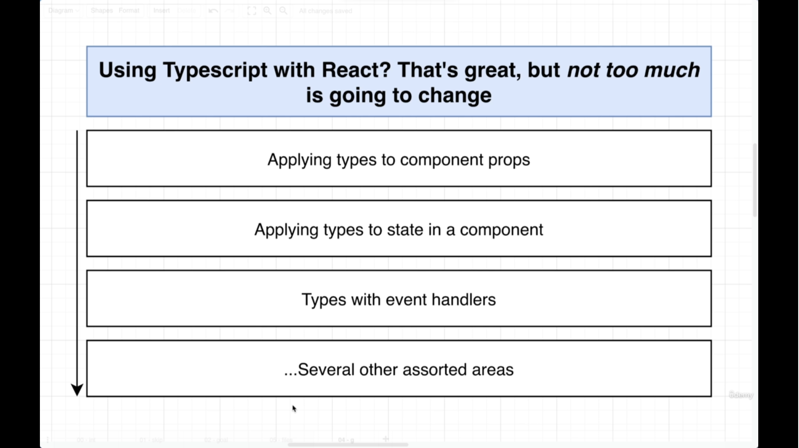

----

### 📘Types in Props
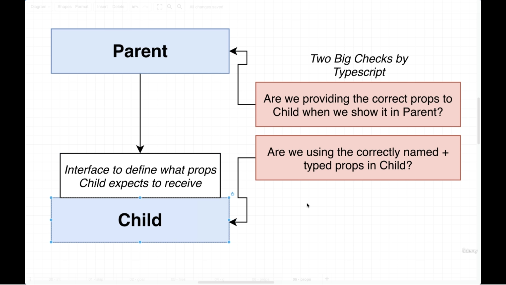

Example

```javascript
import './App.css';

// creating interface 
interface ChildProps {
  color : string
}
function Child({color} : ChildProps) {
  return (
    <div>Hello World {color}</div>
  );
}

function App() {
  return (
    <div className="App">
        <Child color='red'/>
    </div>
  );
}

export default App;
```
---

### 📘Explicit Component Type Annotations

* Here is problem in this approach because its basically strictly tight to only *Typescript* not to *React*.

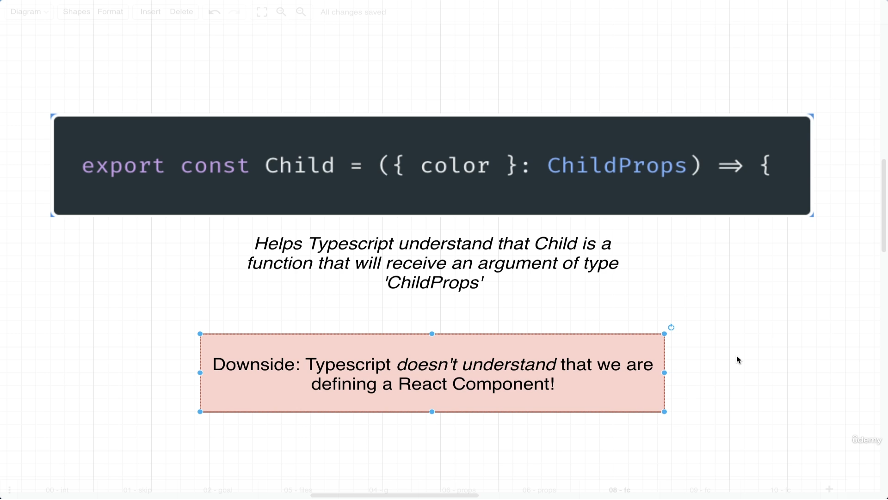

* We did not get various options according to React like default value etc

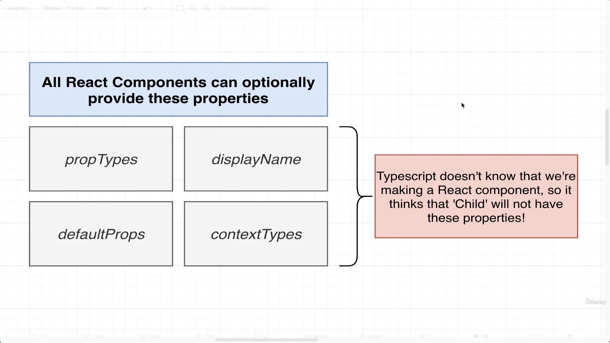

```javascript
interface ChildProps {
  color : string
}

const Child: React.FC<ChildProps> = ({color})=> {
  return (
    <div>Hello World {color}</div>
  );
}

// Or 

const Child: React.FunctionComponent<ChildProps> = ({color})=> {
  return (
    <div>Hello World {color}</div>
  );
}

```
* Best Approach for React with TypeScript and you will get all the various above options as well like default value etc.
* It also take care the children props automatically if we pass child elements in it (will not produce any error)

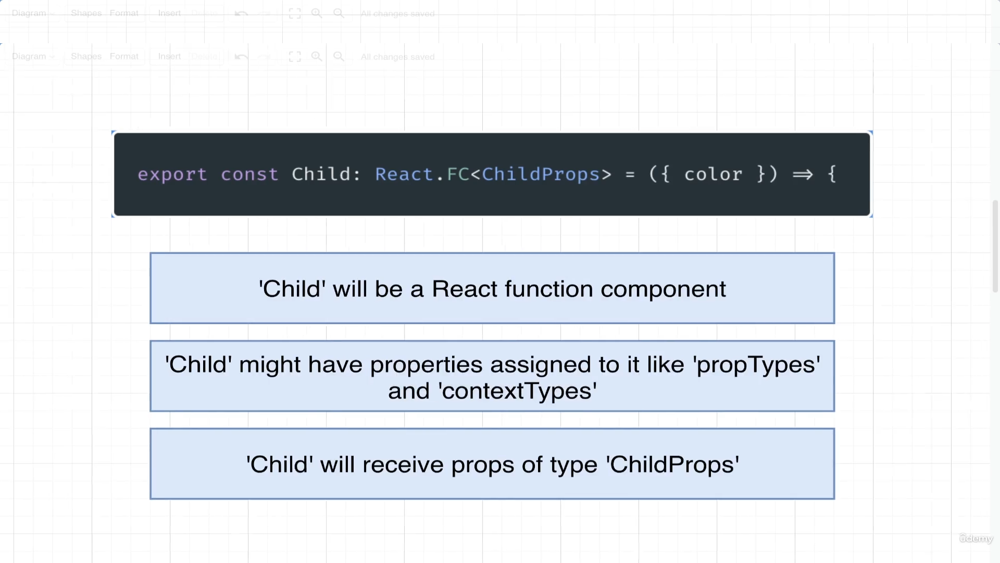

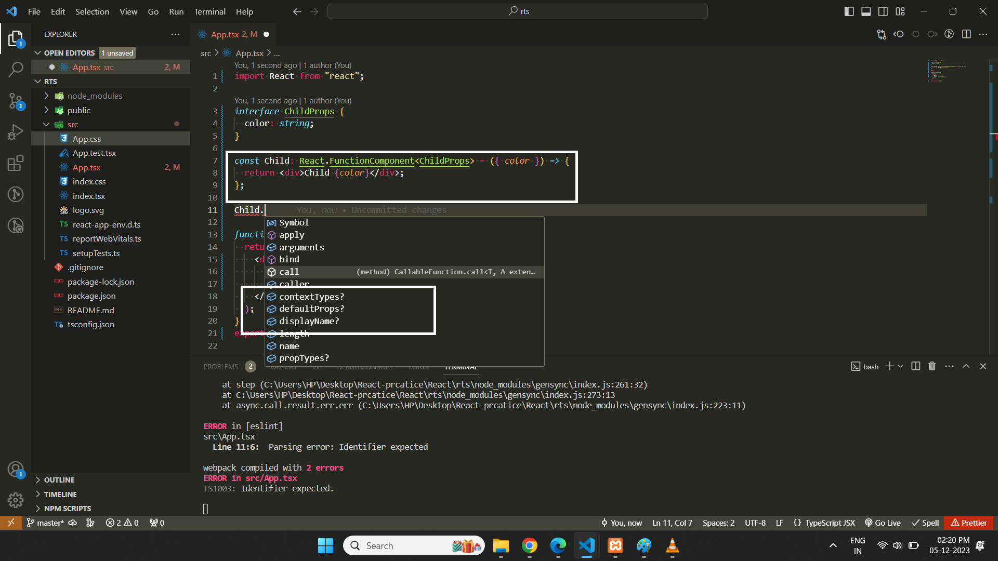
---


### 📘Annotations with Children(String, Function)
```js
import {type FC, type PropsWithChildren, type ReactNode } from "react";

// 1
type CourseType = {
  title: string;
  description: string;
  children: ReactNode;
};

// OR

type CourseType = PropsWithChildren<{ title: string; description: string }>;
// 1

// 2
function Course({ title, description, children }: CourseType) {
  return (
    <section>
      <div>
        <h2>Title : {title}</h2>
      </div>
      <div>
        <p>Description : {description}</p>
      </div>
      {children}
    </section>
  );
}

// OR

const Course: FC<CourseType> = ({ title, description, children }) => {
  return (
    <section>
      <div>
        <h2>Title : {title}</h2>
      </div>
      <div>
        <p>Description : {description}</p>
      </div>
      {children}
    </section>
  );
};
// 2

function App() {
  return (
    <div>
      <Course title="Hello" description="This is hello world">
        <p>This is child Element</p>
      </Course>
    </div>
  );
}

export default App;
```


---

### 📘State with TypeScript UseState

```javascript

// string type
const [name, setName] = useState<string>('');

// Array of String
const [guest, setGuest] = useState<string[]>([]);

// Union Type
const [user, setUser] = useState<{name : string, age : number} | undefined>();

{user && user.name}

// Array for Object
type UserType = {
  name : string;
  age : number
}[]

/* 1 or */
const [user, setUser] = useState<UserType[]>([]);
// or
const [user, setUser] = useState<Array<UserType>>([]);
/* 1 or */
```

---

## 📔Types Around Events and Refs

### 📘Event Handlers Events

```javascript
const EventComponent : React.FC= () => {
    
  const onChange = (event:React.ChangeEvent<HTMLInputElement>)  => {
          console.log(event.target.value);
  };

  const onClick = (event:React.MouseEvent<HTMLButtonElement>) => {
      console.log('Mouse Click')
  }

  const onDrag = (event : React.DragEvent<HTMLDivElement>) => {
      console.log('Drag Element');
      
  }

  return <div>
      <input onChange={onChange}/>
      <button onClick={onClick}>Click Me </button>
      <div draggable onDragStart={onDrag}>Drag Me !!!</div>
  </div>
}

export default EventComponent;
```

⚠️ Note : 
* You can get type of event by __Hovering__ on __Event Handler__ but its only work in __inline events__. 

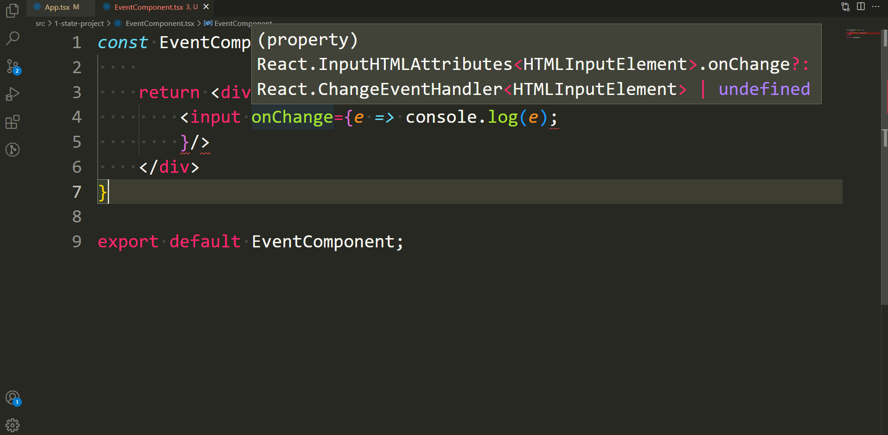

* You can get list of __Various Events__ by clicking on the __Event Interface__  and then click on __Go to Defination__
  
 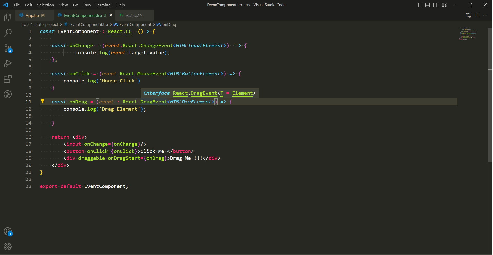

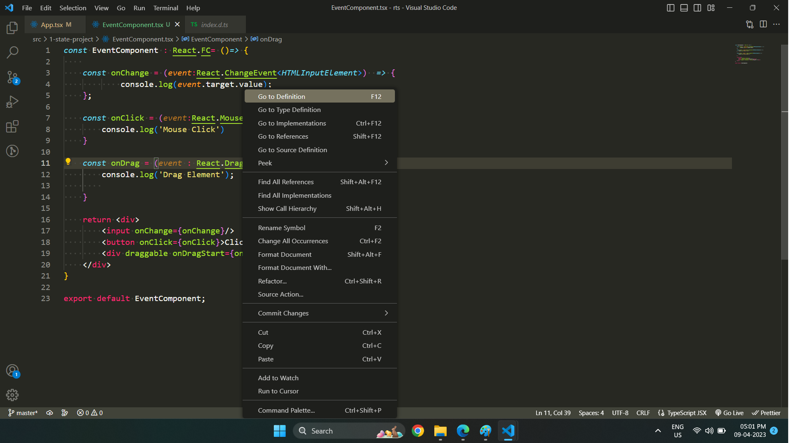

---

### 📘useRef

```js
import React, { useRef } from "react";

function App() {
  const inputName = useRef<HTMLInputElement>(null);
  const inputEmail = useRef<HTMLInputElement>(null);

  const handleSubmit = (e: React.FormEvent<HTMLFormElement>) => {
    e.preventDefault();

    const name = inputName.current!.value;
    console.log(name);

    const email = inputEmail.current!.value;
    console.log(email);

    // to reset value
    e.currentTarget.reset();
  };
  return (
    <div>
      <form onSubmit={handleSubmit}>
        <label htmlFor="name">Name:</label>
        <input type="text" id="name" name="name" required ref={inputName} />
        <label htmlFor="email">Email:</label>
        <input type="email" id="email" name="email" required ref={inputEmail} />
        <button type="submit">Submit</button>
      </form>
    </div>
  );
}

export default App;
```
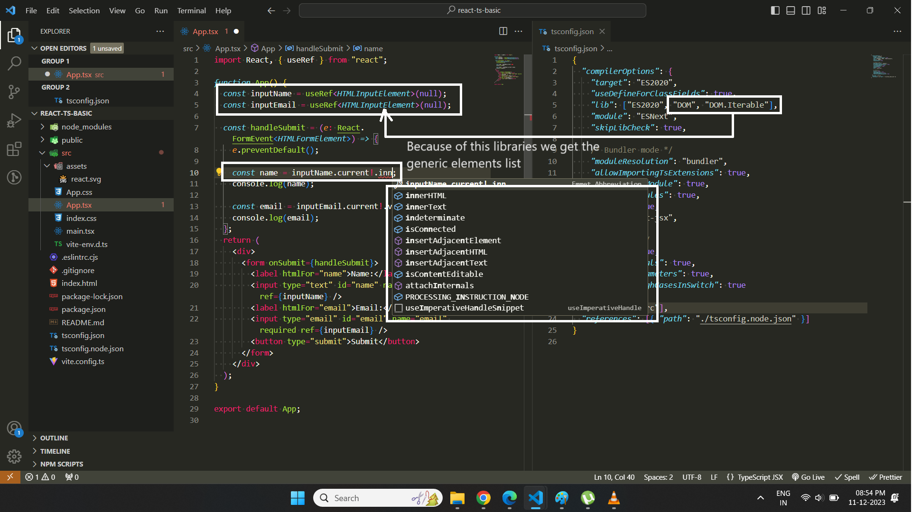

* **useRef** will give error in starting because react it create to *undefined* thats why we provide default as *null*.
* *goal.current!* this *!* sign represent that we are sure about the value, it will never null (because we get the value according to above example **after** submitting the form)
---

### Complete Example of all type
```js
import React, { useState } from "react";

function App() {
  const [name, setName] = useState<string>("Default");
  const [isLogged, setIsLogged] = useState<boolean>(false);
  const [users, setUsers] = useState<
    { name: string; age: number }[] | undefined
  >([]);

  const setNameHandler = (e: React.MouseEvent<HTMLButtonElement>) => {
    setName("Mike Singh");
  };

  const setAuthenticationHandler = (e: React.MouseEvent<HTMLButtonElement>) => {
    setIsLogged((e) => !e);
  };

  const setUsersHandler = (e: React.MouseEvent<HTMLButtonElement>) => {
    setUsers([
      { name: "Deo Singh", age: 29 },
      { name: "Micheal", age: 29 },
    ]);
  };

  return (
    <div>
      <h1>Name : {name}</h1>
      <h1>IsLogged In : {isLogged ? "Yes" : "No"}</h1>
      <ul>
        {users?.map((e) => {
          return (
            <li key={e.name}>
              Name {e.name} Age {e.age}
            </li>
          );
        })}
      </ul>
      <button onClick={setNameHandler}>Set Name</button>
      <button onClick={setAuthenticationHandler}>Set Authentication</button>
      <button onClick={setUsersHandler}>Set Users</button>
    </div>
  );
}

export default App;
```
---

## 📔Advanced Component Types Dynamic Component

### 📘Dynamic Component
```js
import React, {
  type PropsWithChildren,
  type FC,
  useState,
  type ReactNode,
} from "react";

type HintType = {
  mode: "hint";
  heading: "h1" | "h2" | "h3";
  children: ReactNode;
};

type WarningType = {
  mode: "warning";
  children: ReactNode;
};

type InfoProps = HintType | WarningType;

const Info: FC<InfoProps> = (props) => {
  if (props.mode === "warning") {
    return (
      <React.Fragment>
        <h2>Warning</h2>
        <p>{props.children}</p>
      </React.Fragment>
    );
  }

  return <props.heading>{props.children}</props.heading>;
};

function App() {
  const [name, setName] = useState<string>("");
  const [inputName, setInputName] = useState<string[]>([]);
  const handleSubmit = (e: React.FormEvent<HTMLFormElement>) => {
    e.preventDefault();
    setInputName([...inputName, name]);
    setName("");
  };

  let warningBox: ReactNode;
  if (inputName.length >= 4) {
    warningBox = <Info mode="warning">You have enter more than 4 names</Info>;
  } else {
    warningBox = (
      <Info mode="hint" heading="h3">
        You can enter More names
      </Info>
    );
  }

  return (
    <div>
      <form onSubmit={handleSubmit}>
        <input
          placeholder="Enter Name"
          type="text"
          id="name"
          name="name"
          required
          value={name}
          onChange={(e: ChangeEventHandler<HTMLInputElement>) =>
            setName(e.target.value)
          }
        />
        <button type="submit">Submit</button>
      </form>
      {warningBox}

      <ul>
        {inputName.map((e: string) => {
          return <li key={e}>{e}</li>;
        })}
      </ul>
    </div>
  );
}

export default App;
```

---

### 📘Building Better Wrapper Components with ComponentPropsWithoutRef

```js
import React, { ComponentPropsWithoutRef } from "react";

type InputType = {
  label: string;
  type: string;
} & ComponentPropsWithoutRef<"input">;

function Input({ label, type, ...props }: InputType) {
  return (
    <p>
      <label htmlFor="">{label}</label>
      <input type={type} {...props} />
    </p>
  );
}

function App() {
  return (
    <div>
      <form>
        <Input
          label="FirstName"
          type="text"
          placeholder="Enter FirstName"
          disabled
        />
      </form>
    </div>
  );
}

export default App;
```