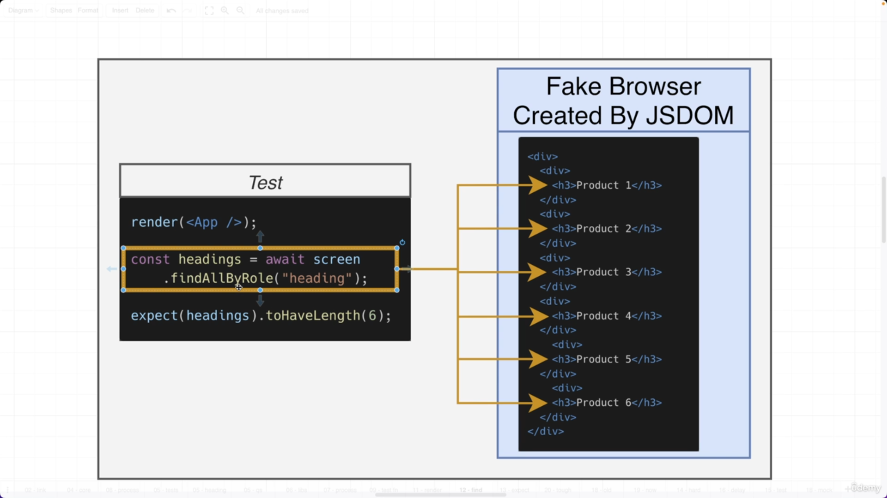
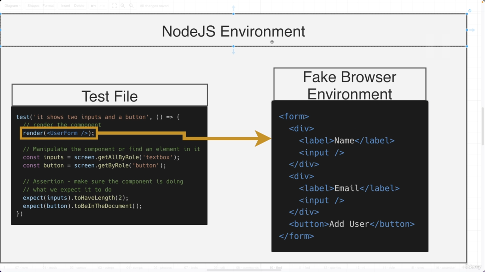
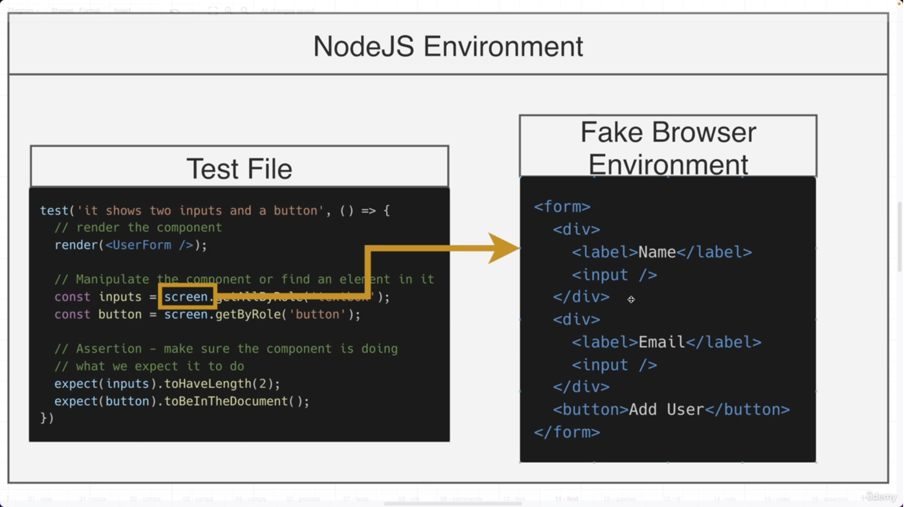
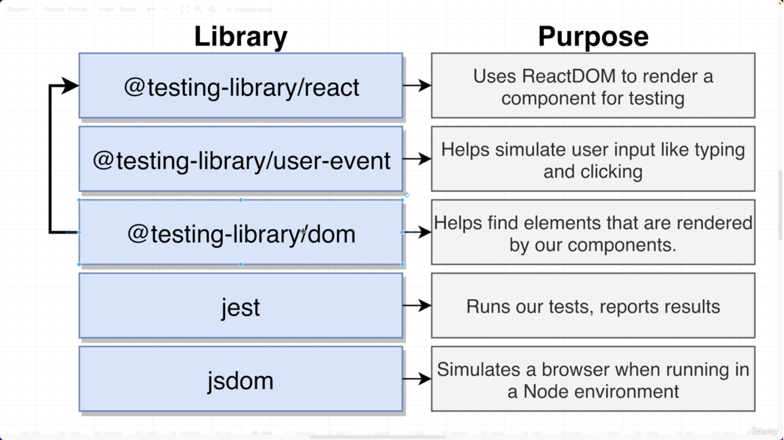
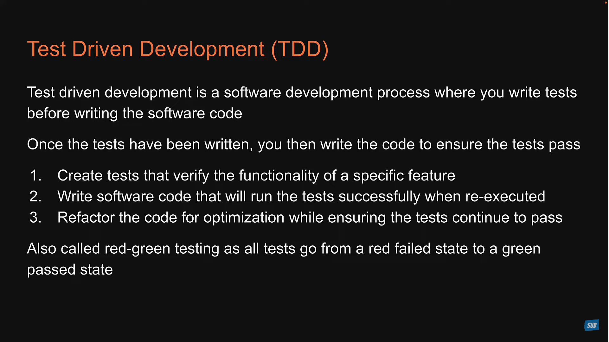
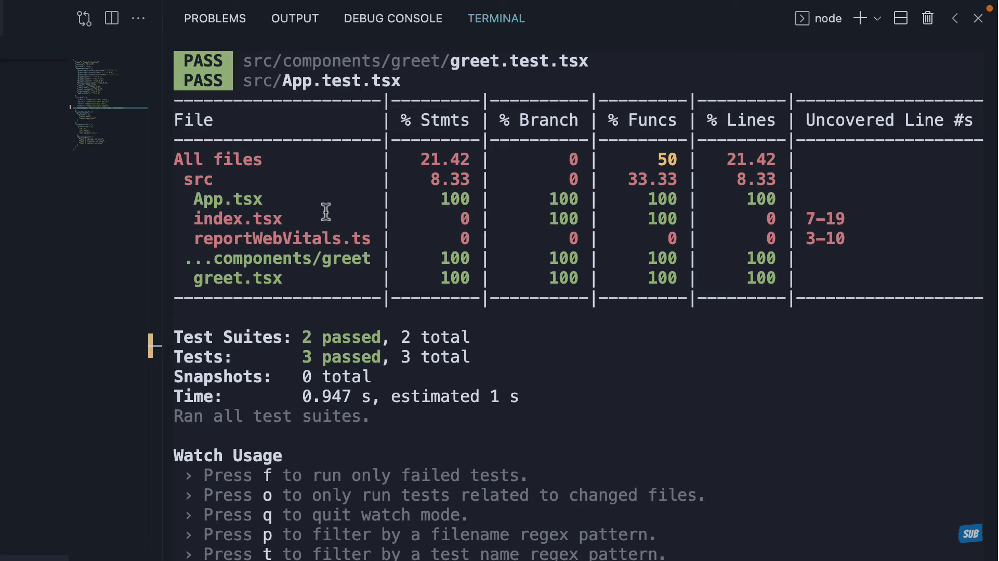
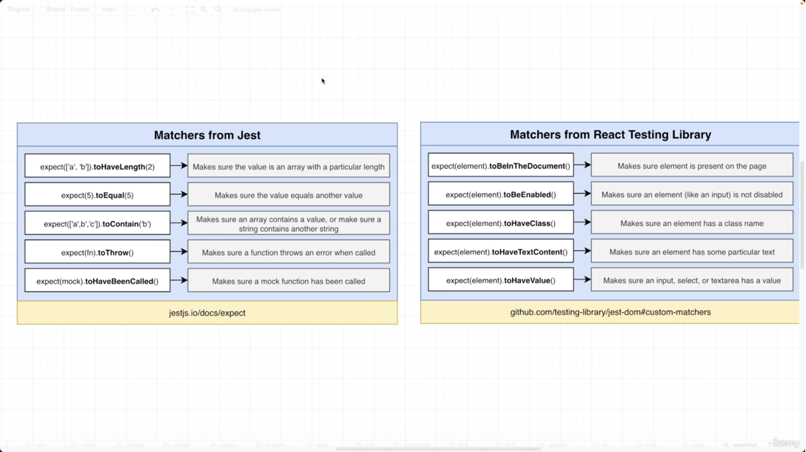

## 📔Code Step by Step

Library Link

```
https://jestjs.io/docs/api
```

### 📘Complete Explanation






in this image, when ever we __render__ a __component__ a __Fake Browser Environment__ is created in __NodeJs Environment__ by library called __JS Dom__ it like create html elements over there.



in this image, we can access the element that are created in Fake Browser Environment by using __screen__ object and that is imported from __react-testing-library__


### 📘Basic

* To run test

```
npm run test
```
* To run Particular File

```
npm run test App
```


```js
export const sum = (a: number, b: number): number => {
  return a + b;
};

import { sum } from "./sum";

test("Sum of two numbers", () => {
  const number1 = 10;
  const number2 = 20;
  const output = 30;

  // this code is use to test things
  expect(sum(number1, number2)).toBe(output);
});
```


### 📘Groups

```js
// Helping to creating group
describe('Text Here', ()=> {});

// To Run particular group only
describe.only('Text Here',()=> {});

// To Skip group
describe.skip("Text Here", ()=> {});
```
### 📘Events

1. OnChange Event on input

```js
import React, { useState } from "react";

export const App = () => {
  const [firstName, setFirstName] = useState<string>("");

  function handleSetFirstName(e: React.ChangeEvent<HTMLInputElement>): void {
    setFirstName(e.target.value);
  }

  return (
    <div className="App">
      <input
        type="text"
        placeholder="Enter First Name"
        name="firstName"
        value={firstName}
        onChange={handleSetFirstName}
      />
    </div>
  );
};

// Test File
import { fireEvent, render, screen } from "@testing-library/react";
import { App } from "./App";

describe("Testing only UI Elements", () => {
  test("Testing input Element", () => {
    render(<App />);

    // creating event object
    const eventObject = {
      target: {
        value: "Deepinder Singh",
      },
    };
    const toBeText = screen.getByRole("textbox") as HTMLInputElement;

    // Means we are trigging event like putting values into input
    fireEvent.change(toBeText, eventObject);

    // expecting that value after entering value
    expect(toBeText.value).toBe(eventObject.target.value);
  });
});
```
2. OnClick of Button

```js
import React, { useState } from "react";

function App() {
  const [firstName, setFirstName] = useState<string>("Deepu Bhasin");

  function handleSetFirstName(
    e: React.MouseEvent<HTMLButtonElement, MouseEvent>
  ): void {
    setFirstName("Deepinder Singh");
  }

  return (
    <div>
      <p>{firstName}</p>
      <button type="button" onClick={handleSetFirstName}>
        Click Me
      </button>
    </div>
  );
}

export default App;

// Test File
import { fireEvent, render, screen } from "@testing-library/react";
import App from "./App";

describe("Testing only UI Elements", () => {
  test("Rendering Button Only", () => {
    render(<App />);
    const firstName = screen.getByText("Deepu Bhasin");
    expect(firstName).toBeInTheDocument();
  });

  test("Firing event from button", () => {
    render(<App />);
    const btn = screen.getByRole("button") as HTMLButtonElement;

    // Means we are trigging event like clicking button
    fireEvent.click(btn);

    // expecting that value after entering value
    expect(screen.getByText("Deepinder Singh")).toBeInTheDocument();
  });
});
```


### 📘Hooks

1. beforeAll() : run only once before all test
2. beforeEach() : run every time before each test
3. afterAll() : run only once after all test
4. afterEach() :  run every time after each test

```js
before(("Text Here")=> {
    // initialization every thing here
})
```

### 📘Functional Component Method(functions) Testing

* Helper.ts
```js
export const getString = (): string => {
  console.log("hi");

  return "hi";
};

export const getSum = (a: number, b: number): number => {
  console.log(a + b);
  return a + b;
};
```

* App.tsx

```js
import React, { useState } from "react";
import { getString, getSum } from "./helper";

function App() {
  const [firstName, setFirstName] = useState<string>("Deepu Bhasin");

  function handleSetFirstName(
    e: React.MouseEvent<HTMLButtonElement, MouseEvent>
  ): void {
    setFirstName("Deepinder Singh");
  }

  return (
    <div>
      <p>{firstName}</p>
      <button
        type="button"

        // using of test data id

        data-testid="btn-click"
        onClick={handleSetFirstName}
      >
        Click Me
      </button>
      <button onClick={getString}>Get String</button>
      <button onClick={() => getSum(1, 2)}>get Sum</button>
    </div>
  );
}

export default App;
```

* App.test.tsx

```js
import { fireEvent, render, screen } from "@testing-library/react";
import App from "./App";
import { getString, getSum } from "./helper";

describe("Internal Component Functions", () => {
  test("Firing event from button", () => {
    render(<App />);

    // get value from the test id
    const btn = screen.getByTestId("btn-click") as HTMLButtonElement;
    fireEvent.click(btn);
    expect(screen.getByText("Deepinder Singh")).toBeInTheDocument();
  });
});

describe("External Component Functions", () => {
  test("Helper functions", () => {
    expect(getString()).toMatch("hi");
    expect(getSum(1, 2)).toBe(3);
  });
});
```

### Overriding test-id
```js
import { useState } from "react";

function App() {
  const [firstName, setFirstName] = useState<string>("Deepu");
  const handlerSetFirstName = (): void => {
    setFirstName("Deepinder Singh");
  };

  return (
    <div>
      <h1>Name : {firstName}</h1>
      <button id="testId" onClick={handlerSetFirstName}>
        Change Name
      </button>
    </div>
  );
}
export default App;


// test
import { fireEvent, render, screen, configure } from "@testing-library/react";
import App from "./App";
configure({ testIdAttribute: "id" });
describe("Check UI", () => {
  test("Re-Rendering", () => {
    render(<App />);
    let btn = screen.getByTestId("testId");
    fireEvent.click(btn);
    expect(
      screen.getByRole("heading", { name: "Name : Deepinder Singh" })
    ).toBeInTheDocument();
  });
});
```


### 📘getAllByRole

```js
function App() {
  return (
    <div>
      <button>Click</button>
      <button>Click</button>
      <button>Click</button>
      <button>Click</button>
      <button>Click</button>
      <button>Click</button>
      <button>Click</button>
      <button>Click</button>
    </div>
  );
}

export default App;

// test 
import { render, screen } from "@testing-library/react";
import App from "./App";

describe("Checking getAllByRole", () => {
  test("Calculate the total length", () => {
    render(<App />);
    const btn = screen.getAllByRole("button");

    // Checking length
    expect(btn).toHaveLength(8);

    // checking exist of not
    for (let i = 0; i < btn.length; i++) {
      expect(btn[i]).toBeInTheDocument();
    }
  });
});
```

### 📘getByDisplayValue
```js
function App() {
  return (
    <div>
      <input type="text" name="firstName" defaultValue="Deepu" />
      <input type="text" name="firstName" defaultValue="Deepinder Singh" />
    </div>
  );
}

export default App;

// Test
import { render, screen, configure } from "@testing-library/react";
import App from "./App";
configure({ testIdAttribute: "id" });
describe("Check UI", () => {
  test("Re-Rendering", () => {
    render(<App />);
    let inputValue1 = screen.getByDisplayValue("Deepu");
    expect(inputValue1).toBeInTheDocument();

    let inputValue2 = screen.getByDisplayValue("Deepinder Singh");
    expect(inputValue2).toBeInTheDocument();
  });
});
```


---

### 📘queryByRole
* is use for not visible in DOM
```js
import { useState } from "react";

function App() {
  const [show, setShow] = useState<boolean>(false);

  return (
    <div>
      <button type="button" onClick={() => setShow((n) => !n)}>
        Switch Button
      </button>
      <br />
      {show && (
        <button type="button" onClick={() => alert("Hello World")}>
          Profile Button
        </button>
      )}
    </div>
  );
}

export default App;

// test
import { render, screen, configure } from "@testing-library/react";
import App from "./App";
configure({ testIdAttribute: "id" });

describe("Check UI", () => {
  test("testing with queryByAll", () => {
    render(<App />);
    let btn = screen.queryByRole("button", { name: "Profile Button" });
    expect(btn).not.toBeInTheDocument();
  });
});
```

---

### 📘findByRole
* is use for async/await task

```js
import { useEffect, useState } from "react";

function App() {
  const [show, setShow] = useState<boolean>(false);

  useEffect(() => {
    const timeoutId = setTimeout(function () {
      setShow((n) => !n);
    }, 1000);

    // Clear the timeout on component unmount (cleanup)
    return () => clearTimeout(timeoutId);
  }, []);

  return (
    <div>
      <button type="button" onClick={() => setShow((prevShow) => !prevShow)}>
        Switch Button
      </button>
      <br />
      {show && (
        <button type="button" onClick={() => alert("Hello World")}>
          Profile Button
        </button>
      )}
    </div>
  );
}

export default App;

// test
import { render, screen, configure } from "@testing-library/react";
import App from "./App";
configure({ testIdAttribute: "id" });

describe("Check UI", () => {
  test("testing with queryByAll", async () => {
    render(<App />);
    let btn = await screen.findByRole(
      "button",
      { name: "Profile Button" },
      { timeout: 3000 }
    );
    expect(btn).toBeInTheDocument();
  });
});
```


---

### 📘withIn()
* To find the text or element in element

```js
function App() {
  return (
    <div>
      Hi div
      <p>Hi</p>
      <p>Hello World</p>
    </div>
  );
}

export default App;

// test
import { render, screen, configure, within } from "@testing-library/react";
import App from "./App";
configure({ testIdAttribute: "id" });

describe("Check UI", () => {
  test("testing with queryByAll", () => {
    render(<App />);
    let btn = screen.getByText("Hi div");
    let childElement = within(btn).getByText("Hi");
    expect(childElement).toBeInTheDocument();
    expect(btn).toBeInTheDocument();
  });
});
```

### 📘UserEvent Library + Act function
1. Click Event

Please first update your version to 14

```
npm install user-event@14
```
Example

```js
import { useState } from "react";

function App() {
  const [name, setName] = useState<string>("Hello World");
  return (
    <div>
      <h1>{name}</h1>
      <button onClick={() => setName("Hi World")}>Change</button>
    </div>
  );
}

export default App;

// test
import { render, screen } from "@testing-library/react";
import userEvent from "@testing-library/user-event";
import App from "./App";

test("Testing User Event", async () => {
  userEvent.setup();
  render(<App />);
  let btn = screen.getByRole("button", { name: "Change" });
    await act(async () => await userEvent.type(btn, "Hi World"));
  expect(
    screen.getByRole("heading", { name: /Hi world/i })
  ).toBeInTheDocument();
});

```
2. OnChange Event

```js
import { useState } from "react";

function App() {
  const [name, setName] = useState<string>("");
  return (
    <div>
      <h1>{name}</h1>
      <label htmlFor="name">Name</label>
      <input
        id="name"
        type="text"
        name="firstName"
        value={name}
        onChange={(e) => setName(e.target.value)}
      />
    </div>
  );
}

export default App;

// test
import { render, screen } from "@testing-library/react";
import userEvent from "@testing-library/user-event";
import App from "./App";

test("Testing User Event", async () => {
  userEvent.setup();
  render(<App />);
  let btn = screen.getByRole("textbox", { name: "Name" });
  await act(async () => await userEvent.type(btn, "Hi World"));
  expect(
    screen.getByRole("heading", { name: /Hi world/i })
  ).toBeInTheDocument();
});
```

### 📘Props Testing 
1. Passing values only

```js
export function Child({ name }: { name: string }) {
  return <h1>{name}</h1>;
}

function App() {
  return (
    <div>
      <Child name="Hello World" />
    </div>
  );
}

export default App;

// test
import { render, screen } from "@testing-library/react";
import { Child } from "./App";

test("Testing User Event", () => {
  const props = "Hello World";

  render(<Child name={props} />);
  const text = screen.getByRole("heading", { name: props });
  expect(text).toBeInTheDocument();
});
```
2. Passing Function

```js
export function Child({
  onClick,
}: {
  onClick: MouseEventHandler<HTMLButtonElement>;
}) {
  return (
    <button type="button" onClick={onClick}>
      Call
    </button>
  );
}

function App() {
  return (
    <div>
      <Child onClick={() => alert("Hello World")} />
    </div>
  );
}

export default App;

// test
import { render, screen } from "@testing-library/react";
import { Child } from "./App";
import userEvent from "@testing-library/user-event";

test("Testing User Event", async () => {
  userEvent.setup();
  const props = jest.fn();

  render(<Child onClick={props} />);
  const btn = screen.getByRole("button", { name: "Call" });
  await userEvent.click(btn);

  expect(props).toBeCalled();
});
```


### 📘Testing Libraries


---


---
### Testing Playground

```javascript
screen.logTestingPlaygroundURL();


//  https://testing-playground.com/#markup=DwEwlgbgfMAuCGAjANgUxrAFq+IMCcNMoA5eAW1WAHosioBRc+MZGu9w97XDRAexABPAhjwAreADsqtPHAnTUAAUkyAdAGN+5dvNpdYhvAGcKs2PMtQzlZba069MAy9gDhbpGhfhoQA
```
this comment will give you __URL__ in terminal you just need to copy paste that link after that you will get suggestions for various __queries__


---
Code Evolution

### Jest Vs RTL

__JEST__ :
* Jest is javascript testing framework
* Jest is a test runner that find tests, runs the tests, determines whether the tests passed or failed and reports it back in a human readable manner.

__RTL__ :
* javascript testing utility that provides virtual DOM for testing React Component.
* Testing library is infect a family packages which helps test UI components
* The core library is called DOM testing library and RTL is simply a wrapper around this core library to test React applications in an easier way.
---

### 📘Anatomy of a Test

```javascript
// syntax
test(name, fn, timeout);
```
1. __name__ : This first argument is the test name used to identify the test.
2. __fn__ : The second argument is a function that contains the expectations to test.
3. __timeout__ : The Third argument is timeout which is an optional argument for specifying how long to wait before aborting the test. The default timeout value is 5 second.

📖 Example
```javascript
// Greet.tsx
type GreetProps  = {
    name? : string
}
const Greet = (props : GreetProps) => {
    return (
        <div>Hello {props.name}</div>
    )
}

export default Greet;

// Great.test.tsx
import { render, screen } from "@testing-library/react"
import Greet from "./Greet"

test('Greet Render Correctly',()=> {
    render(<Greet/>);
    const textElement = screen.getByText(/Hello/i);
    expect(textElement).toBeInTheDocument();
})

test('Greet Render Correctly',()=> {
    render(<Greet name="Deepu"/>);
    const textElement = screen.getByText(/Hello Deepu/i);
    expect(textElement).toBeInTheDocument();
})
```
```
npm run test
```
⚠️Note :  __test__ and __expect__ we are getting _globally_ from the _jest library_


### 📘Test Drive Development

---

### 📘Jest Watch Mode
* Watch mode is an option that we can pass to **jest asking** to watch files that have changed since the last commit and execute tests related only to those changed files.
* An Optimization designed to make your tests run fast regardless of how many tests you have.

### 📘Code Coverage
A metric that can help you understand how much of your software code is tested.

* __Statement Coverage__ : how many of the statements in the software code have been executed.
* __Branches coverage__ : how many of the branches of the control strcutues(if statement for instance) have been executed.
* __Function Coverage__ : how many of the function defined have been called and finally.
* __Line Coverage__ : how many of lines of source code have been tested.

```javascript
// add this line into json-packege.json
"coverage" : "npm run test --coverage"
```
1. _npm run test --coverage_ : will return data when files get changed.
2. _npm run test --coverage --watchAll_ : will return all test with meaningful report.
3. _npm run test --coverage --watchAll --collectCoverageFrom='src/components/**/*.{ts,tsx}'_ : it will cover all the files which are located in __src/component/__ folders with __ts__ or __tsx__ extensions
4. _npm run test --coverage --watchAll --collectCoverageFrom='!src/components/**/*.{types, stories,constants,test,spec}.{ts,tsx}'_ : this is use for ignoring all other files which are located in src folder using __!__ (not operator)


---

### 📘Extensions
1. For Files
   * App.test.js
   * App.test.tsx
   * App.test.jsx
   * App.spec.js
   * App.spec.tsx
   * App.spec.jsx

2. For Folder
   * \_\_tests\_\_ : You can put any file name in this folder it will run that file automatically

---

### 📘Describe Method

* use for grouping the test

```javascript
describe('string',()=> {});
```

```javascript
describe('Greet', ()=> {
    test('Greet Render Correctly',()=> {
        render(<Greet/>);
        const textElement = screen.getByText(/Hello/i);
        expect(textElement).toBeInTheDocument();
    })

    test('Greet Render Correctly',()=> {
        render(<Greet name="Deepu"/>);
        const textElement = screen.getByText(/Hello Deepu/i);
        expect(textElement).toBeInTheDocument();
    })
})

```

### 📘Assertions & All Expect functions
* When writing tests, we often need to check that values meet certain conditions.
* its use **expect** method

> expect(value)

* The argument should be the value that your code produces
* Typically, you will use expect along with a matcher function to assert something about value
* A matcher can optionally accept an argument which is the correct expected value

> Table 3.1 - For Positive Assertion Cases

| Sr No | Method Name                                      | Description                           |
| ----- | ------------------------------------------------ | ------------------------------------- |
| 1.    | expect(elementToBeTest).toHaveValue("anyValue")  | to check value                        |
| 2.    | expect(elementToBeTest).toHave("anyValue")       | to check exact result                 |
| 3.    | expect(elementToBeTest).toHaveClass("className") | To class exist in that element        |
| 4.    | expect(elementToBeTest).toHaveAttribute("id")    | To check attribute exist of not       |
| 5.    | expect(elementToBeTest).toBeInTheDocument()      | To check element exist in the DOM     |
| 6.    | toBeEnable() / toBeEDisabled()                   | To check element is enable / disabled |
| 7.    | toBeCalled()                                     | To to call function in the document   |

>Table 3.2 - For Negative Assertion Cases (use only **not**)

| Sr No | Method Name                   | Description                 |
| ----- | ----------------------------- | --------------------------- |
| 1.    | expect(sum(2, 4)).not.toBe(5) | to not check the value same |



### 📘What to test / What not to test
1. Should
   1. Test Component renders
   2. Test component renders with props
   3. Test component renders in different states
   4. Test Component reacts to events 

2. Not 
   1. Implementation details (login)
   2. Third party code
   3. Code that is not important from a user point of view


### 📘RTL
* This is test library which is use to find UI Elements on the page like button, input, heading, any thing etc.

* Steps in testing UI
  1. Render Component
  2. Find element and action
  3. Assertions 

* Type of RTL Queries
  
  1. Find Single elements
     1. getBy
     2. queryBy
     3. findBy
  
  2. Find Multiple elements
     1. getAllBy
     2. queryAllBy
     3. findAllBy

📚 **Note :  The suffix can be one of Role, LabelText, PlaceHolderText, Text, DisplayValue, AltText, Title and finally TestId**

---

## 📔getBy... Queries

* getBy.. class of queries return the matching node for a query, and **throw a descriptive error if no elements match or if more than one match is found**

### 📘getByRole
* Always give high priority than other **getBy...**
* **getByRole** queries for elements with the given role. 
* **Role** refers to the **ARIA (Accessible Rich Internet Applications)** role which provides **semantic meaning** to content to ensure people using assistive technologies are able to use them. 


* By default, **many semantics elements in HTML have a role**
 
  | Sr  | Type              | Role                        |
  | --- | ----------------- | --------------------------- |
  | 1   | input,type="text" | screen.getbyRole('textbox') |
  | 2   | Button            | button role                 |
  | 3   | anchor            | link role                   |
  | 4   | h1 to h6          | Heading role                |
  | 5   | checkbox          | checkbox role               |
  | 6   | Radio buttons     | radio role                  |
  | 7   | ul li             | list                        |
  | 8   | table thead       | rowgroup                    |
  | 9   | table tbody       | rowgroup                    |
  | 10  | table td          | cell                        |
  | 11  | table tr          | row                         |
  | 10  | table th          | columnheader                |


* if you can want to make **custom-role**

  ```html
  <div role="hello-world-text"> Hello Worl </div>
  ```

> Table of all getByQueries

| Sr No | Type                 | Description                               |
| ----- | -------------------- | ----------------------------------------- |
| 1     | getByRole            | use for Semantics tags                    |
| 2     | getAllByRole         | use for Semantics tags                    |  |  |
| 3     | getByPlaceHolder     | elements which have placeholder property  |  |  |
| 4     | getAllByPlaceHolder  | elements which have placeholder property  |  |
| 5     | getByText            | usefor div, p,headings, buttons           |
| 6     | getAllByPlaceHolder  | use for div, p,headings, buttons          |
| 7     | getByTestId          | use for attach data-testId to any element |
| 8     | getAllByTestId       | use for attach data-testId to any element |
| 9     | getByDisplayValue    | for showing value in inputs               |
| 10    | getAllByDisplayValue | use for showing value in inputs           |
| 11    | getByTitle           | use for title attributes                  |
| 12    | getAllByTitle        | use for title                             |
| 13    | getByAltText         | use for image alt attribute               |
| 14    | getAllByAltText      | use for image alt attribute               |
| 15    | getByLabelText       | use for label of form elements            |
| 16    | getAllByLabelText    | use for label of form elements            |
<br/>


> Various options for getRole

1. **name** : the accessible name is for simple cases equal to
   1. label for a form element
   2. text content of a button
   3. the value of the aria-label attribute

```js
function App() {
  return (
    <div>
      <form>
        <label htmlFor="firstName">First Name</label>
        <input type="text" name="firstName" id="firstName" />
        <label htmlFor="lastName">Last Name</label>
        <input type="text" name="lastName" id="lastName" />
        <button type="button">Submit</button>
      </form>
    </div>
  );
}

export default App;

// test
import { render, screen } from "@testing-library/react";
import App from "./App";
test("Testing getByRole with name option", () => {
  render(<App />);
  const firstNameInput = screen.getByRole("textbox", { name: /First Name/i });
  const lastNameInput = screen.getByRole("textbox", { name: /Last Name/i });
  const submitBtn = screen.getByRole("button", { name: "Submit" });

  expect(firstNameInput).toBeInTheDocument();
  expect(lastNameInput).toBeInTheDocument();
  expect(submitBtn).toBeInTheDocument();
});
```

