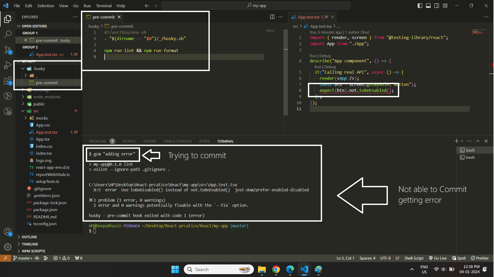

Library Link

```
https://jestjs.io/docs/api
```
---

### 📘Testing Libraries


---


### 📘Complete Explanation


in this image, when ever we __render__ a __component__ a __Fake Browser Environment__ is created in __NodeJs Environment__ by library called __JS Dom__ it like create html elements over there.


in this image, we can access the element that are created in Fake Browser Environment by using __screen__ object and that is imported from __react-testing-library__

---

### 📘Basic

* To run test

```
npm run test
```
* To run Particular File

```
npm run test App
```


```js
export const sum = (a: number, b: number): number => {
  return a + b;
};

import { sum } from "./sum";

test("Sum of two numbers", () => {
  const number1 = 10;
  const number2 = 20;
  const output = 30;

  // this code is use to test things
  expect(sum(number1, number2)).toBe(output);
});
```


### 📘Events

1. OnChange Event on input

```js
import React, { useState } from "react";

export const App = () => {
  const [firstName, setFirstName] = useState<string>("");

  function handleSetFirstName(e: React.ChangeEvent<HTMLInputElement>): void {
    setFirstName(e.target.value);
  }

  return (
    <div className="App">
      <input
        type="text"
        placeholder="Enter First Name"
        name="firstName"
        value={firstName}
        onChange={handleSetFirstName}
      />
    </div>
  );
};

// Test File
import { fireEvent, render, screen } from "@testing-library/react";
import { App } from "./App";

describe("Testing only UI Elements", () => {
  test("Testing input Element", () => {
    render(<App />);

    // creating event object
    const eventObject = {
      target: {
        value: "Deepinder Singh",
      },
    };
    const toBeText = screen.getByRole("textbox") as HTMLInputElement;

    // Means we are trigging event like putting values into input
    fireEvent.change(toBeText, eventObject);

    // expecting that value after entering value
    expect(toBeText.value).toBe(eventObject.target.value);
  });
});
```
2. OnClick of Button

```js
import React, { useState } from "react";

function App() {
  const [firstName, setFirstName] = useState<string>("Deepu Bhasin");

  function handleSetFirstName(
    e: React.MouseEvent<HTMLButtonElement, MouseEvent>
  ): void {
    setFirstName("Deepinder Singh");
  }

  return (
    <div>
      <p>{firstName}</p>
      <button type="button" onClick={handleSetFirstName}>
        Click Me
      </button>
    </div>
  );
}

export default App;

// Test File
import { fireEvent, render, screen } from "@testing-library/react";
import App from "./App";

describe("Testing only UI Elements", () => {
  test("Rendering Button Only", () => {
    render(<App />);
    const firstName = screen.getByText("Deepu Bhasin");
    expect(firstName).toBeInTheDocument();
  });

  test("Firing event from button", () => {
    render(<App />);
    const btn = screen.getByRole("button") as HTMLButtonElement;

    // Means we are trigging event like clicking button
    fireEvent.click(btn);

    // expecting that value after entering value
    expect(screen.getByText("Deepinder Singh")).toBeInTheDocument();
  });
});
```
### 📘Functional Component Method(functions) Testing

* Helper.ts
```js
export const getString = (): string => {
  console.log("hi");

  return "hi";
};

export const getSum = (a: number, b: number): number => {
  console.log(a + b);
  return a + b;
};
```

* App.tsx

```js
import React, { useState } from "react";
import { getString, getSum } from "./helper";

function App() {
  const [firstName, setFirstName] = useState<string>("Deepu Bhasin");

  function handleSetFirstName(
    e: React.MouseEvent<HTMLButtonElement, MouseEvent>
  ): void {
    setFirstName("Deepinder Singh");
  }

  return (
    <div>
      <p>{firstName}</p>
      <button
        type="button"

        // using of test data id

        data-testid="btn-click"
        onClick={handleSetFirstName}
      >
        Click Me
      </button>
      <button onClick={getString}>Get String</button>
      <button onClick={() => getSum(1, 2)}>get Sum</button>
    </div>
  );
}

export default App;
```

* App.test.tsx

```js
import { fireEvent, render, screen } from "@testing-library/react";
import App from "./App";
import { getString, getSum } from "./helper";

describe("Internal Component Functions", () => {
  test("Firing event from button", () => {
    render(<App />);

    // get value from the test id
    const btn = screen.getByTestId("btn-click") as HTMLButtonElement;
    fireEvent.click(btn);
    expect(screen.getByText("Deepinder Singh")).toBeInTheDocument();
  });
});

describe("External Component Functions", () => {
  test("Helper functions", () => {
    expect(getString()).toMatch("hi");
    expect(getSum(1, 2)).toBe(3);
  });
});
```

### Overriding test-id
```js
import { useState } from "react";

function App() {
  const [firstName, setFirstName] = useState<string>("Deepu");
  const handlerSetFirstName = (): void => {
    setFirstName("Deepinder Singh");
  };

  return (
    <div>
      <h1>Name : {firstName}</h1>
      <button id="testId" onClick={handlerSetFirstName}>
        Change Name
      </button>
    </div>
  );
}
export default App;


// test
import { fireEvent, render, screen, configure } from "@testing-library/react";
import App from "./App";
configure({ testIdAttribute: "id" });
describe("Check UI", () => {
  test("Re-Rendering", () => {
    render(<App />);
    let btn = screen.getByTestId("testId");
    fireEvent.click(btn);
    expect(
      screen.getByRole("heading", { name: "Name : Deepinder Singh" })
    ).toBeInTheDocument();
  });
});
```


---

### Jest Vs RTL

__JEST__ :
* Jest is javascript testing framework
* Jest is a test runner that find tests, runs the tests, determines whether the tests passed or failed and reports it back in a human readable manner.

__RTL__ :
* javascript testing utility that provides virtual DOM for testing React Component.
* Testing library is infect a family packages which helps test UI components
* The core library is called DOM testing library and RTL is simply a wrapper around this core library to test React applications in an easier way.
---

### 📘Anatomy of a Test

```javascript
// syntax
test(name, fn, timeout);
```
1. __name__ : This first argument is the test name used to identify the test.
2. __fn__ : The second argument is a function that contains the expectations to test.
3. __timeout__ : The Third argument is timeout which is an optional argument for specifying how long to wait before aborting the test. The default timeout value is 5 second.

📖 Example
```javascript
// Greet.tsx
type GreetProps  = {
    name? : string
}
const Greet = (props : GreetProps) => {
    return (
        <div>Hello {props.name}</div>
    )
}

export default Greet;

// Great.test.tsx
import { render, screen } from "@testing-library/react"
import Greet from "./Greet"

test('Greet Render Correctly',()=> {
    render(<Greet/>);
    const textElement = screen.getByText(/Hello/i);
    expect(textElement).toBeInTheDocument();
})

test('Greet Render Correctly',()=> {
    render(<Greet name="Deepu"/>);
    const textElement = screen.getByText(/Hello Deepu/i);
    expect(textElement).toBeInTheDocument();
})
```
```
npm run test
```
⚠️Note :  __test__ and __expect__ we are getting _globally_ from the _jest library_


### 📘Test Drive Development

---

### 📘Jest Watch Mode
* Watch mode is an option that we can pass to **jest asking** to watch files that have changed since the last commit and execute tests related only to those changed files.
* An Optimization designed to make your tests run fast regardless of how many tests you have.

### 📘Code Coverage
A metric that can help you understand how much of your software code is tested.

* __Statement Coverage__ : how many of the statements in the software code have been executed.
* __Branches coverage__ : how many of the branches of the control strcutues(if statement for instance) have been executed.
* __Function Coverage__ : how many of the function defined have been called and finally.
* __Line Coverage__ : how many of lines of source code have been tested.

```javascript
// add this line into json-packege.json
"coverage" : "npm run test --coverage"
```
1. _npm run test --coverage_ : will return data when files get changed.
2. _npm run test --coverage --watchAll_ : will return all test with meaningful report.
3. _npm run test --coverage --watchAll --collectCoverageFrom='src/components/**/*.{ts,tsx}'_ : it will cover all the files which are located in __src/component/__ folders with __ts__ or __tsx__ extensions
4. _npm run test --coverage --watchAll --collectCoverageFrom='!src/components/**/*.{types, stories,constants,test,spec}.{ts,tsx}'_ : this is use for ignoring all other files which are located in src folder using __!__ (not operator)


---

### 📘Extensions
1. For Files
   * App.test.js
   * App.test.tsx
   * App.test.jsx
   * App.spec.js
   * App.spec.tsx
   * App.spec.jsx

2. For Folder
   * \_\_tests\_\_ : You can put any file name in this folder it will run that file automatically

---

### 📘Describe Method

* use for grouping the test

Syntax
```js
// Helping to creating group
describe('Text Here', ()=> {});

// To Run particular group only
describe.only('Text Here',()=> {});

// To Skip group
describe.skip("Text Here", ()=> {});
```

Example

```javascript
describe('Greet', ()=> {
    test('Greet Render Correctly',()=> {
        render(<Greet/>);
        const textElement = screen.getByText(/Hello/i);
        expect(textElement).toBeInTheDocument();
    })

    test('Greet Render Correctly',()=> {
        render(<Greet name="Deepu"/>);
        const textElement = screen.getByText(/Hello Deepu/i);
        expect(textElement).toBeInTheDocument();
    })
})

```

---


### 📘Assertions & All Expect functions
* When writing tests, we often need to check that values meet certain conditions.
* its use **expect** method

> expect(value)

* The argument should be the value that your code produces
* Typically, you will use expect along with a matcher function to assert something about value
* A matcher can optionally accept an argument which is the correct expected value

> Table 3.1 - For Positive Assertion Cases

| Sr No | Method Name                                      | Description                                        |
| ----- | ------------------------------------------------ | -------------------------------------------------- |
| 1.    | expect(elementToBeTest).toHaveValue("anyValue")  | to check value                                     |
| 2.    | expect(elementToBeTest).toHave("anyValue")       | to check exact result                              |
| 3.    | expect(elementToBeTest).toHaveClass("className") | To class exist in that element                     |
| 4.    | expect(elementToBeTest).toHaveAttribute("id")    | To check attribute exist of not                    |
| 5.    | expect(elementToBeTest).toBeInTheDocument()      | To check element exist in the DOM                  |
| 6.    | toBeEnable() / toBeEDisabled()                   | To check element is enable / disabled              |
| 7.    | toBeCalled()                                     | To to call function in the document                |
| 7.    | toHavBeenCalledTimes()                           | To to call function in the document how many times |
| 8.    | toHaveBeenCalledWith()                           | this is use to match the exact value               |
| 9.    | expect(elementToBeTest).toHaveLength()           | to calculate the length                            |
| 10.   | expect(elementToBeTest).toBe()                   | to Check the exact value                           |

>Table 3.2 - For Negative Assertion Cases (use only **not**)

| Sr No | Method Name                   | Description                 |
| ----- | ----------------------------- | --------------------------- |
| 1.    | expect(sum(2, 4)).not.toBe(5) | to not check the value same |


### 📘What to test / What not to test
1. Should
   1. Test Component renders
   2. Test component renders with props
   3. Test component renders in different states
   4. Test Component reacts to events

2. Not
   1. Implementation details (login)
   2. Third party code
   3. Code that is not important from a user point of view

---

### 📘RTL (React Testing Library)
* This is test library which is use to find UI Elements on the page like button, input, heading, any thing etc.

* Steps in testing UI
  1. Render Component
  2. Find element and action
  3. Assertions

* Type of RTL Queries

  1. Find Single elements
     1. getBy : **if not found return error**
     2. queryBy : **return null if no elements match**
     3. findBy: **return a Promise which resolves when an element is found**

  2. Find Multiple elements
     1. getAllBy :
     2. queryAllBy
     3. findAllBy

📚 **Note :  The suffix can be one of Role, LabelText, PlaceHolderText, Text, DisplayValue, AltText, Title and finally TestId**


---

### 📘When to use each

| Sri | Goal of Test                          | Use                 |
| --- | ------------------------------------- | ------------------- |
| 1.  | Prove an element exist                | getBy, getAllBy     |
| 2.  | Prove an element does not exist       | queryBy, queryAllBy |
| 3.  | Make sure an element eventually exist | findBy, findAllBy   |

---

## 📔getBy... & getAllBy... Queries

* **getBy..** class of queries return the matching node for a query, and **throw a descriptive error if no elements match or if more than one match is found**

* **getAllBy...** returns an array of all matching nodes for a query and throws an error if no elements match.

> 8 Different query methods & Priority Order for Queries
1. getByRole
2. getByLabelText
3. getByPlaceholderText
4. getByText
5. getByDisplayValue
6. getByAltText
7. getByTitle
8. getByTestId (because we are modifying the html Code)

> Table of all getByQueries

| Sr No | Type                    | Description                                                                        |
| ----- | ----------------------- | ---------------------------------------------------------------------------------- |
| 1     | getByRole               | use for Semantics tags                                                             |
| 2     | getAllByRole            | use for Semantics tags                                                             |  |  |
| 3     | getByPlaceholderText    | use for elements which have placeholder attribute                                  |  |  |
| 4     | getAllByPlaceholderText | use for elements which have placeholder attribute                                  |  |
| 5     | getByText               | use for div, p,headings, buttons                                                   |
| 6     | getAllByPlaceHolder     | use for div, p,headings, buttons                                                   |
| 7     | getByTestId             | use for attach data-testId attribute to any element                                |
| 8     | getAllByTestId          | use for attach data-testId attribute to any element                                |
| 9     | getByDisplayValue       | returns the input, textarea, or select element that has the matching display value |
| 10    | getAllByDisplayValue    | returns the input, textarea, or select element that has the matching display value |
| 11    | getByTitle              | use for title attribute                                                            |
| 12    | getAllByTitle           | use for title attribute                                                            |
| 13    | getByAltText            | use for image alt attribute                                                        |
| 14    | getAllByAltText         | use for image alt attribute                                                        |
| 15    | getByLabelText          | use for label of form elements                                                     |
| 16    | getAllByLabelText       | use for label of form elements                                                     |


---

### 📘getByRole & getAllByRole

1. **getByRole**

* Always give high priority than other **getBy...**
* **getByRole** queries for elements with the given role.
* **Role** refers to the **ARIA (Accessible Rich Internet Applications)** role which provides **semantic meaning** to content to ensure people using assistive technologies are able to use them.


* By default, **many semantics elements in HTML have a role**

  | Sr  | Type              | Role                        |
  | --- | ----------------- | --------------------------- |
  | 1   | input,type="text" | screen.getbyRole('textbox') |
  | 2   | Button            | button role                 |
  | 3   | anchor            | link role                   |
  | 4   | h1 to h6          | Heading role                |
  | 5   | checkbox          | checkbox role               |
  | 6   | Radio buttons     | radio role                  |
  | 7   | ul                | list                        |
  | 7   | li                | listitem                    |
  | 8   | table thead       | rowgroup                    |
  | 9   | table tbody       | rowgroup                    |
  | 10  | table td          | cell                        |
  | 11  | table tr          | row                         |
  | 10  | table th          | columnheader                |


* if you can want to make **custom-role**

  ```html
  <div role="hello-world-text"> Hello Worl </div>
  ```


> Various options for getRole

1. **name** : the accessible name is for simple cases equal to
   1. label for a form element
   2. text content of a button
   3. the value of the aria-label attribute

```js
// Label + button Example
function App() {
  return (
    <div>
      <form>
        <label htmlFor="firstName">First Name</label>
        <input type="text" name="firstName" id="firstName" />
        <label htmlFor="lastName">Last Name</label>
        <input type="text" name="lastName" id="lastName" />
        <button type="button">Submit</button>
      </form>
    </div>
  );
}

export default App;

// test
import { render, screen } from "@testing-library/react";
import App from "./App";
test("Testing getByRole with name option", () => {
  render(<App />);
  const firstNameInput = screen.getByRole("textbox", { name: /First Name/i });
  const lastNameInput = screen.getByRole("textbox", { name: /Last Name/i });
  const submitBtn = screen.getByRole("button", { name: "Submit" });

  expect(firstNameInput).toBeInTheDocument();
  expect(lastNameInput).toBeInTheDocument();
  expect(submitBtn).toBeInTheDocument();
});


// Aria-Label Example
// this is use when we don't have any label for button etc
import React from "react";
import log from "./logo.svg";

function App() {
  return (
    <div>
      <button aria-label="sign-up">
        
      </button>
      <button aria-label="sign-out">
        
      </button>
    </div>
  );
}
export default App;


// test
import { render, screen } from "@testing-library/react";
import App from "./App";

test("Driven Approach", () => {
  render(<App />);
  const signUpBtn = screen.getByRole("button", { name: /sign-up/i });
  const signOutBtn = screen.getByRole("button", { name: /sign-out/i });
  expect(signUpBtn).toBeInTheDocument();
  expect(signOutBtn).toBeInTheDocument();
});
```
2. **getAllByRoles**

```js
const userName = ["Deep", "Dp", "Deepinder Singh"];
function App() {
  return (
    <div>
      <ul>
        {userName.map((e) => (
          <li key={e}>{e}</li>
        ))}
      </ul>
    </div>
  );
}

export default App;

// test
import { render, screen } from "@testing-library/react";
import App from "./App";

describe("App.test", () => {
  test("Render Ul element", () => {
    render(<App />);
    const ulElement = screen.getByRole("list");
    expect(ulElement).toBeInTheDocument();
  });

  test("Render li elements", () => {
    render(<App />);
    const liItems = screen.getAllByRole("listitem");
    expect(liItems).toHaveLength(liItems.length);
  });
});
```
---

### 📘Throw-Error
* When are already know in advance that it will throw error
```js
function App() {
  return <div>App</div>;
}

export default App;

// test

import { render, screen } from "@testing-library/react";
import App from "./App";

test("Driven Approach", () => {
  render(<App />);
  // we already know that, this textbox role does not exist so it will throw error
  expect(() => screen.getByRole("textbox")).toThrow();
});
```


---

### 📘textMatch

* TextMatch represents a type which can be either a
  1. String
  2. Regex
  3. Function (no need to learn)

Example

```html
<div>Hello World</div>
```

1. String

```js
screen.getByText('Hello World') // full string match

screen.getByText('llo Wor', {exact : false}) // substring match

screen.getByText('hello world', {exact : false}) // ignore case
```

2. Regex

```js
screen.getByText(/World/) // substring match

screen.getByText(/world/i) // substring match, ignore case

screen.getByText(/^hello world$/i) // full string match ignore case
```

3. Function

```js
screen.getByText((content)=> content.startsWith('Hello'))
```

---

## 📔queryBy... & queryAllBy... Queries
1. **queryBy**

* Returns the matching node for a query and **return null if no elements match**
* **UseFull for asserting an element that is not present in the DOM**
* Throws an error if more than one match is found

2. **queryAllBy**

* Returns an array of all matching nodes for a query and return an empty array no elements match
---

### 📘queryByRole
* is use for not visible in DOM

```js
import { useState } from "react";

function App() {
  const [show, setShow] = useState<boolean>(false);

  return (
    <div>
      <button type="button" onClick={() => setShow((n) => !n)}>
        Toggle Button
      </button>
      <br />
      {show && <h1>Hello World</h1>}
    </div>
  );
}
export default App;

// test
import { render, screen } from "@testing-library/react";
import App from "./App";

test("testing with queryByAll", () => {
  render(<App />);
  let btn = screen.queryByRole("heading", { name: /Hello World/i });
  expect(btn).not.toBeInTheDocument();
});
```

---

## 📔findBy... & findAllBy... Queries

* What if elements are not present in the DOM to begin but make their way into the DOM after some time ?
  * For example, data that is fetched from a server will be rendered only after a few milliseconds

1. **findBy**
* Returns a Promise which resolves when an element is found which matches the given query
* **The Promises is rejected of no element is found or if more than one element is found after a default timeout of 1000ms**

---

### 📘findByRole
* is use for async/await task

1. **SetTimeOut**
```js
import { useEffect, useState } from "react";

function App() {
  const [show, setShow] = useState<boolean>(false);

  useEffect(() => {
    let id = setTimeout(() => {
      setShow((n) => !n);
    }, 1000);
    return () => clearTimeout(id);
  }, []);

  return (
    <div>
      <button type="button" onClick={() => setShow((prevShow) => !prevShow)}>
        Toggle Button
      </button>
      <br />
      {show && <h1>Hello World</h1>}
    </div>
  );
}

export default App;

// test
import { render, screen } from "@testing-library/react";
import App from "./App";

test("testing useEffect with findBy", async () => {
  render(<App />);
  let btn = await screen.findByRole(
    "button",
    { name: /Toggle Button/i },
    { timeout: 3000 }
  );
  expect(btn).toBeInTheDocument();
});
```
2. **Real Api**

```js
import React, { useEffect, useState } from "react";

function App() {
  const [users, setUsers] = useState<string[]>([]);
  const [error, setError] = useState<string | null>(null);

  useEffect(() => {
    fetch("https://jsonplaceholder.typicode.com/users")
      .then((res) => res.json())
      .then((data) => setUsers(data.map((user: { name: string }) => user.name)))
      .catch((error) => setError("Error fetching users"));
  }, []);

  return (
    <div>
      <h1>Users</h1>
      {error && <p>{error}</p>}
      <ul>
        {users.map((user) => (
          <li key={user}>{user}</li>
        ))}
      </ul>
    </div>
  );
}

export default App;

// test
import { render, screen } from "@testing-library/react";
import App from "./App";

describe("App component", () => {
  it("Calling real API", async () => {
    render(<App />);
    const users = await screen.findAllByRole("listitem");
    expect(users).toHaveLength(users.length);
  });
});
```


---
## 📔Debugging

1. Debug

```js
// use this line any where and it will print DOM in terminal
screen.debug();
```

2. logRoles

```js
import { render, screen, logRoles } from "@testing-library/react";
import App from "./App";

test("testing useEffect with findBy", async () => {
  const { container } = render(<App />);

  // to print all roles on page
  logRoles(container;)

  let btn = await screen.findByRole(
    "button",
    { name: /Toggle Button/i },
    { timeout: 2000 }
  );

  expect(btn).toBeInTheDocument();
});
```
---
### 📘Testing Playground
1. Testing playground extension


2. Testing playground Function
```javascript
screen.logTestingPlaygroundURL();


//  https://testing-playground.com/#markup=DwEwlgbgfMAuCGAjANgUxrAFq+IMCcNMoA5eAW1WAHosioBRc+MZGu9w97XDRAexABPAhjwAreADsqtPHAnTUAAUkyAdAGN+5dvNpdYhvAGcKs2PMtQzlZba069MAy9gDhbpGhfhoQA
```
this comment will give you __URL__ in terminal you just need to copy paste that link after that you will get suggestions for various __queries__

---

## 📔User Interactions

### 📘user-event

* A companion library for testing library that simulates user interactions by dispatching  the event that would happen if the interaction took place in browser

>fireEvent vs user-event

* fireEvent is a method from RTL which is used to dispatch DOM events
* user-event simulates full interactions, which may fire multiple events and do additional checks along the way.


**Please first update your version to 14**

```
npm install user-event@14
```

**📚 Note :** All userEvents are **async**

---


### 📘Various userEvent Interaction


1. Mouse Event : **Click Event **

Example

```js
import { useState } from "react";

function App() {
  const [name, setName] = useState<string>("Hello World");
  return (
    <div>
      <h1>{name}</h1>
      <button onClick={() => setName("Hi World")}>Change</button>
    </div>
  );
}

export default App;

// test
import { render, screen } from "@testing-library/react";
import userEvent from "@testing-library/user-event";
import App from "./App";

test("Testing userEvent for mouse event", async () => {
  userEvent.setup();
  render(<App />);
  let btn = screen.getByRole("button", { name: "Change" });
    await act(async () => await userEvent.type(btn, "Hi World"));
  expect(
    screen.getByRole("heading", { name: /Hi world/i })
  ).toBeInTheDocument();
});

```
2. Keyboard Event : **OnChange Event**

```js
import { useState } from "react";

function App() {
  const [name, setName] = useState<string>("");
  return (
    <div>
      <h1>{name}</h1>
      <label htmlFor="name">Name</label>
      <input
        id="name"
        type="text"
        name="firstName"
        value={name}
        onChange={(e) => setName(e.target.value)}
      />
    </div>
  );
}

export default App;

// test
import { act, render, screen } from "@testing-library/react";
import userEvent from "@testing-library/user-event";
import App from "./App";

test("Testing User Event", async () => {
  userEvent.setup();
  render(<App />);
  let inputElement = screen.getByRole("textbox", { name: "Name" });
  await act(async () => await userEvent.type(inputElement, "Hello World"));
  expect(
    screen.getByRole("heading", { name: /Hello world/i })
  ).toBeInTheDocument();
});

test("Elements are focused in the right order", async () => {
  userEvent.setup();
  render(<App />);
  let inputElement = screen.getByRole("textbox", { name: "Name" });
  let btn = screen.getByRole("button", { name: /Button/i });

  // for input
  await act(async () => await userEvent.tab());
  expect(inputElement).toHaveFocus();

  // for button
  await act(async () => await userEvent.tab());
  expect(btn).toHaveFocus();
});

```

| Sr No | Category  | Events                                                                                                                |
| ----- | --------- | --------------------------------------------------------------------------------------------------------------------- |
| 1     | Mouse     | 1. click() <br/> 2.dbClick() <br/> 3.tripleClick() <br/> 4. hover() <br/> unhover()                                   |
| 2     | keyboard  | 1. type <br/> 2. tab() <br/> 3. clear() <br/> 4. selectOption()   <br/> 5. deselectOptions() <br/> 6. upload() {file} |
| 3     | clipboard | 1. copy() <br/> 2. cut() <br/> 3. paste()                                                                             |
---
### 📘 Custom-Hook testing

```js
//useCount.tsx
import React, { useState } from "react";

type CountType = {
  initialCount?: number;
};

export function useCount({ initialCount = 0 }: CountType) {
  const [count, setCount] = useState<number>(initialCount);

  function handleIncrementSetCount(): void {
    setCount((n) => n + 1);
  }
  function handleDecrementSetCount(): void {
    setCount((n) => n - 1);
  }

  return {
    count,
    handleIncrementSetCount,
    handleDecrementSetCount,
  };
}

// test
import { renderHook, act } from "@testing-library/react";
import { useCount } from "./useCount";

describe("useCount", () => {
  it("should increment and decrement count correctly", () => {
    // get result property
    const { result } = renderHook(() => useCount({ initialCount: 0 }));

    // get current property in result
    expect(result.current.count).toBe(0);

    act(() => result.current.handleIncrementSetCount());

    expect(result.current.count).toBe(1);

    act(() => result.current.handleDecrementSetCount());

    expect(result.current.count).toBe(0);
  });
});
```

### Props & Mocking functions

1. **Passing values only** : just simply passing parameters thats it

```js
export function Child({ name }: { name: string }) {
  return <h1>{name}</h1>;
}

function App() {
  return (
    <div>
      <Child name="Hello World" />
    </div>
  );
}

export default App;

// test
import { render, screen } from "@testing-library/react";
import { Child } from "./App";

test("Testing User Event", () => {
  const props = "Hello World";

  render(<Child name={props} />);
  const text = screen.getByRole("heading", { name: props });
  expect(text).toBeInTheDocument();
});
```
2. **Passing Function** :
* Passing function is done by **Mocking functions**.
* In Mocking we *don't care about real functions (means not implement real function), just only care that functions are called*

```js
export function Child({
  onClick,
}: {
  onClick: MouseEventHandler<HTMLButtonElement>;
}) {
  return (
    <button type="button" onClick={onClick}>
      Call
    </button>
  );
}

function App() {
  return (
    <div>
      <Child onClick={() => alert("Hello World")} />
    </div>
  );
}

export default App;

// test
import { render, screen } from "@testing-library/react";
import { Child } from "./App";
import userEvent from "@testing-library/user-event";

test("Testing User Event", async () => {
  userEvent.setup();
  const props = jest.fn();

  render(<Child onClick={props} />);
  const btn = screen.getByRole("button", { name: "Call" });
  await userEvent.click(btn);

  expect(props).toBeCalled();
});
```
---

### 📘MSW
* Mocking HTTP Request

---

## 📔Static analysis testing
* **Testing checks if your code works or not, whereas static analysis checks if it is written well or not**
* Process of verifying that your code meets certain expectations without actually running it
  * Ensure consistent style and formatting
  * Check for common mistakes and possible bugs
  * Limit the complexity of code and
  * Verify type consistency

* Static testing analyses such as readability, consistency error handling, type checking and alignment with best practices

* Various tools for static analysis testing tool
  1. TypeScript
  2. Eslint
  3. Prettier
  4. Husky
  5. lint-staged

---
### 📘ESlint
* ESlint is a tool for identify and reporting on petters found in ECMAScript/Javascript code, with the goal of making code more consistent and avoiding bugs
* **ESlint get byDefault installed in *create-react-app*

Steps

1. First install ESlint extension
2. To install eslint for jest-dom

```
npm install --save-dev eslint-plugin-jest-dom
```
3. Add the below code in **package.json**

```js
"eslintConfig": {
  "extends": [
    "react-app",
    "react-app/jest",
    "plugin:jest-dom/recommended" // this one
  ]
},
```

4. Add this line in your **package.json** under **scripts**. (here we ignoring all the files and folder which are in gitignore file)

```js
"lint": "eslint --ignore-path .gitignore ."
```
5. Run Command

```js
npm run lint
```


---

### 📘Prettier
* Prettier is an opinionated code formatter that ensure that all outputted code conforms to a consistent style

1. Add Extension **prettier**

2. First install package

```
npm install --save-dev --save-exact prettier
```

3. Add this line in your **package.json** under **scripts**. (here we ignoring all the files and folder which are in gitignore file & for all the other files in the project that end with extension ts,tsx,css,scss please format the code)

```js
"format": "prettier --ignore-path .gitignore --write \"**/*.{ts,tsx,css,scss}\""
```
4. If you want to Add External File with Configuration (create file with below name)

```
.prettierrc.json
```

5. Add Code

```js
{
    "semi": true,
    "singleQuote": false
}
```
6. Command

```
npm run format
```

7. To configure with your project (optional)

```
npm install --save-dev eslint-config-prettier
```

```js
"eslintConfig": {
  "extends": [
    "react-app",
    "react-app/jest",
    "plugin:jest-dom/recommended",
    "eslint-config-prettier"  // this line
  ]
},
```

---
### 📘Husky

* **It help to make sure the code is automatically linted and formatted before somebody commits their code**
* Husky adds a pre-commit script in which you can check every thing like **formatting, linting etc**
* Husky is a tool that helps improve your commits and more

1. To install package
```
npm install husky --save-dev
```
2. To install File
```
npx husky-init
```
3. After the run of above command the **.husky** folder will create then -> **pre-commit** file & add below command (make sure your **lint and format command** should be in package.json file)

```
#!/usr/bin/env sh
. "$(dirname -- "$0")/_/husky.sh"

npm run lint && npm run format
```

4. When you **do commit husky** will run automatically



---

### 📘lint-Staged
* It helps to lint or formate specific files that are about to be committed
* Run linters (and formatters) against staged git files

1. Install Package
```
npm install lint-staged
```

2. Add this Code in **package.json**

```js
"lint-staged": {
  "*.{ts,tsx}": [
    "eslint"
  ],
  "*.{ts,tsx,css,scss}": [
    "eslint",
    "prettier --write"
  ]
}
```

3. Add this code in **pre-commit** file

```
#!/usr/bin/env sh
. "$(dirname -- "$0")/_/husky.sh"

npx lint-staged
```

4. Now **do commit**


---

### 📘withIn()
* To find the text or element in element

```js
function App() {
  return (
    <div data-testid="user">
      <h1>Hello World</h1>
      <h2>Hello User</h2>
    </div>
  );
}

export default App;


// test
import { render, screen, within } from "@testing-library/react";
import App from "./App";

test("Testing WithIn", () => {
  render(<App />);
  let element = screen.getByTestId("user");
  let childElement = within(element).getByRole("heading", { level: 2 });
  expect(element).toBeInTheDocument();
  expect(childElement).toBeInTheDocument();
});
```
---

### 📘Hooks

1. beforeAll() : run only once before all test
2. beforeEach() : run every time before each test
3. afterAll() : run only once after all test
4. afterEach() :  run every time after each test

```js
before(("Text Here")=> {
    // initialization every thing here
})
```

⚠️ **Note :** Avoid BeforeHooks if you can instead you can make this

```js
import React from "react";

export function Child({ users }: { users: { name: string }[] }) {
  return (
    <React.Fragment>
      <ul>
        {users.map((e) => (
          <li key={e.name}>name</li>
        ))}
      </ul>
    </React.Fragment>
  );
}

function App() {
  return (
    <div>
      <Child users={[{ name: "John" }, { name: "dp" }, { name: "deep" }]} />
    </div>
  );
}

export default App;


// test
import { render, screen } from "@testing-library/react";
import { Child } from "./App";

function renderComponent() {
  const users = [{ name: "Deepinder" }, { name: "dp" }, { name: "deep" }];
  render(<Child users={users} />);
}

test("Checking Length", () => {
  renderComponent();
  const li = screen.getAllByRole("listitem");
  expect(li).toHaveLength(3);
});

test("Checking to be in the document", () => {
  renderComponent();
  const li = screen.getAllByRole("listitem");
  for (let i = 0; i < li.length; i++) {
    expect(li[i]).toBeInTheDocument();
  }
});
```