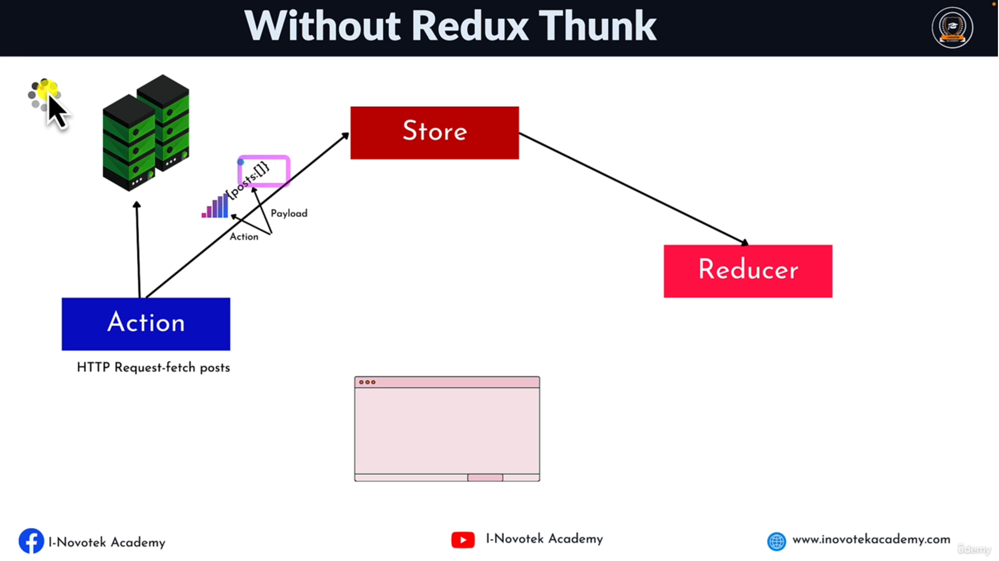

## 📔Topics
1. Core Redux and Core Functions
2. Combine Reducer
3. Middleware
   1. Custom Middleware
   2. Third-party like thunk, logger
4. React-Redux and React-redux-thunk

---
### 📘Information
1. Always create three states while calling any Api data, loading, error
2. Always create three actions while calling any dispatch method request, success, fail

---

### 📘What is Redux ?
* Redux is an open-source javascript library for __managing__ and __centralizing__ application state.
* A __Predictable State Container__ for JS APP.

---

### 📘Redux Road Map


---

### 📘Whats is State ?
* Any data in your application that can change based on conditions.
* Its a data store that is used to manage the component data.
---

### 📘What is state management ?
* it's the ability to control the information that is passed between React Component.
* State management is the process of determining how to manage state information in a web application.
* State management can be used to track
  * User Data
  * Session Data
  * Application Data
  * Component Data
---

### 📘Type of Data Source
* Server Data (like from api)
* Global state (like redux)
* Local State (useState)
* Url State (passing id in address bar)
* Routing (like queries)
* Local Storage (save token or cart)
---

### Ways of managing state in react
* useState()
* useContext()
* Redux
* RTK (redux toolkit)
* RTK (redux toolkit Query)
---

### 📘When to Use Redux
* You should use Redux when you have a complex state object that is difficult to manage with the local state alone.
* The app state is updated frequently
* The logic to update that state may be complex
* The app has a medium or large-sized codebase and might be worked on bt many people
---

### 📘Redux Terminologies
* __Actions__ : Actions are the driving force of every dynamic application, as they are the medium by which all changes are communicated within a Redux Application.
* __Reducers__ : Reducers are event Listeners which handles event based on the actions type.
* __Store__ : It stores the application data.
---

### 📘How Redux Works


---

### 📘Example Of Redux


---

### 📘Store Methods
* __getState()__ : Returns the current State tree of your application.
* __dispatch()__ : This is the only way to trigger a state change.
* __subscribe()__ : Listening to any change.

---
### 📘Action Vs Action Creator

* __Action__ : An Action is simply a __javascript object__ that contains information about an event that has occurred in your app.
* __Action Creator__ : Action Creators are __function__ that create and returns actions.

Action Properties (parameters)

* It has a __type__ field as a property which is required.
* It can accept additional properties __(payload)__. This is optional

Action Types OR Action Constants

* const **CONSTANT_NAME** = **"CONSTANT_VALUE"**;

---

### 📘Reducer
A Reducer is a function that receives the __current state__ and __an action object__, _decides how to update the state base on the action and returns the new state._

Rules of Reducers

* The new state value should only be calculated based on the state and action arguments.
* Reducers are not allowed to modify the **existing state.**
---

### 📘Store
* __It store the application data__.
* __It doesn't contain business logic.__
* It receives actions and pass to all the registered middleware.
* The only way to change the state inside it is to dispatch an action.

**⚠️ Note :** When it receives an actions that causes a change to the state, the store will notify all the registered listeners that a change to the state has been made. This allow various parts of the system, like the UI, to update themselves according to the new state.

> 01-redux-counter-app
---

### 📘Combine Reducer

* it's a function that combine individual reducers to pass to redux store.


> 02-redux-user-post-app
---

### 📘Asynchronous Redux

* Problems
  * data is never received, or is received out of order.
  * it can make it difficult to debug your code.
  * the redux store will not be updated and no changes will be made to your application state.

* Answer
  * **Reducers** are immediately return a new data if the correct action is dispatch without waiting for the action payload.

**⚠️ Note :** we can add api fetch method in reducer but in that case our code will not become predictable, hence therefore we add middleware to make our code predictable.

---

### 📘Middleware
* Middleware is a function that execute between request and response means that function hav access to their request and then response.
* Redux middleware is a powerful tool that can be used to customize and extend the functionality of Redux.
* **Middleware is basically a function that takes in an action and can decide how to handle it.**

* Types of Middleware
  * Third-party Middlewares
  * Custom Middleware

* Uses of Middleware
  * Handle the action
  * Dispatch new action (i.e create a side-effect such as making an API Call)
  * Log the action to the console / inside the browser by using **redux-dev-extension** tool.

**⚠️ Note :**
* Middlewares are used to enable advanced functionality in a redux store that would not be possible with just a reducer alone.
* Middlewares are composed and executed within a Redux store using the **applyMiddleware()** function.

> 03-redux-custom-and-third-party-middleware
---

### 📘Redux Thunk

* **Thunk** : the word thunk is a programming term that means *"a piece of code that some delayed work"*.
* Redux Thunk is a **middleware** that allows you to write **asynchronous** actions




**Facts about redux thunk (important)**

* **it's function (action creator) that return a function instead of an action object.**
* This function receives this dispatch method and getState as an argument, which allows you to dispatch actions inside the function
* This is often used when you need to perform an async operation, such as making an **Ajax request**, before dispatching an action.

> 04-redux-thunk-middleware-app
---

### 📘React-Redux
* React-redux is help us to connect with between React components and Redux library, which help components to dispatch actions and access store

> 05-react-redux-notes-app

> 06-react-redux-thunk-app

**Redux Problems**

* Configuring a Redux store is too complicated
* I have to add a lot of packages to get Redux to do anything useful
* Redux requires too much boilerplate code
---

###  📘What is Redux Toolkit (RTK) ?
* Redux toolkit is complete rewrite of the standard Redux Library.
* It is designed to make it easier to write redux applications by providing a set of helper functions (like thunk etc).
* The Redux toolkit library is divided into 2 parts: 
  * The Core library.
  * The React bindings.

**Importance of RTK**
  * To make Redux development easier like by default we have dev-tool extension configured on it.
  * Easy Store Configuration.
  * To reduce the size of Redux bundles.
---

### 📘Redux Toolkit common API's

1. CreateAction : Action Creator + Action
2. CreateReducer : it's the easiest way of creating Redux reducer functions
3. CreateSlice : CreateAction + CreateReducer to generate actions and reducer
4. CreateAsyncThunk : Handle Async Actions (redux-thunk)
5. ConfigureStore : Easiest way to create Redux Store

**CreateAction (action + action-creator)**
* It combines action type constants and the action together to create action creator.
* The action creator can be called with or without a payload
* By default it accept one parameter(action type) but can customized.
* Action type is a required as a parameter.

**CreateReducer**
* It's the easiest way of creating Redux reducer functions.
* We can directly mutate the data because it uses immer internally (immer is package name).
* It doesn't use switch or case statement.
* There are two types of creating reducers 
  1. Builder callback 
  2. Map object notation).

> 07-redux-toolkit-notes-app
---

### 📘createSlice (use in SavATree Project)
* createSlice = createAction + createReducer.
* It simplifies the creation of action creators and reducers.
* It doesn't use switch or case statement.
* Each Slice reducer "owns" it state independently.

**createSlice Arguments**
1. name : is used in action type, and it must be unique, it represent a particular reducer in the state.
2. initialState
3. reducer/extraReducer : it handle specific action type/ implement business logic.

---

### 📘createAsync Thunk
* it's the recommended approach the handling async request lifecycle
* This API has eliminated the traditional of installing redux thunk for async actions.
* This returns a promise

**lifeCycles of createAsyncThunk**

* Pending
* Fulfilled
* rejected

> 09-redux-toolkit-createAsync-post-app

### Example Redux-toolKit-RTK
```
// Main Dependencies
npm install @reduxjs/toolkit
npm install react-redux
```

```
// for Js
npm create-react-app --template redux

// for Typescript
npm create-react-app --template redux-typescript
```


```javascript
//store.js
import { configureStore, getDefaultMiddleware } from "@reduxjs/toolkit";
import { createApi, fetchBaseQuery, setupListeners } from "@reduxjs/toolkit/query/react";


export const todoApi = createApi({
    reducerPath: 'api', // key name for caching
    baseQuery: fetchBaseQuery({ baseUrl: 'http://localhost:3004/' }),   // its like axios
    tagTypes: ['Todos'],  // slice name
    endpoints: builder => ({
        getToDos: builder.query({           // for get method
            query: () => ({
                url: 'todos',
                method: 'GET',          // this is address
                transformResponse: res => res.sort((a, b) => b.id - a.id),
            }),
            providesTags: ['Todos']
        }),
        getSinglePost: builder.query({
            query: (id) => ({
                url: `todos/${id}`,
                method: 'GET',
            }),
            providesTags: ['Todos']
        }),
        addToDo: builder.mutation({
            query: (payload) => ({
                url: 'todos',
                method: 'POST',
                body: payload,
                headers: {
                    'Content-type': 'application/json;charset=UTF-8'
                }
            }),
            invalidatesTags: ['Todos']
        }),
        updateToDo: builder.mutation({
            query: (payload) => ({
                url: `todos/${payload.id}`,
                method: 'PUT',
                body: payload               // containing all data
            }),
            invalidatesTags: ['Todos']
        }),
        deleteToDo: builder.mutation({
            query: (payload) => ({
                url: `todos/${payload}`,
                method: 'DELETE',
            }),
            invalidatesTags: ['Todos']
        }),

    })
});


export const store = configureStore({
    reducer: {
        [todoApi.reducerPath]: todoApi.reducer
    },
    middleware: (getDefaultMiddleware) => getDefaultMiddleware().concat(todoApi.middleware)
})

setupListeners(store.dispatch);

export const { useGetToDosQuery, useGetSinglePostQuery, useAddToDoMutation, useUpdateToDoMutation, useDeleteToDoMutation } = todoApi;
```

```js
// Todo.js
import React, { useState } from 'react'
import { Provider } from 'react-redux';
import { useGetToDosQuery, useGetSinglePostQuery, useUpdateToDoMutation, useAddToDoMutation, useDeleteToDoMutation, store } from './store';
import { BrowserRouter as Router, Routes, Route, Link, useParams } from "react-router-dom"

const ToDoComponent = () => {
    const [newTodo, setNewTodo] = useState('');
    const { data, isLoading, isSuccess, isError, error } = useGetToDosQuery();
    const [addToDo] = useAddToDoMutation();
    const [updateToDo] = useUpdateToDoMutation();
    const [deleteToDo] = useDeleteToDoMutation();

    const handleSubmit = (e) => {
        if (newTodo === '') {
            alert('Enter Todo');
            return
        }
        addToDo({ title: newTodo, completed: false })
        setNewTodo('');
    }

    let content;
    if (isLoading) {
        content = <p>Loadiing ....</p>
    } else if (isSuccess) {
        content = data.map(item => {
            return <div key={item.id} style={{ border: '2px solid red', margin: '10px', padding: '10px' }}>
                <h3>id : {item.id}</h3>
                <p>title : {item.title}</p>
                <p>Status : {item.completed ? 'Completed' : 'Pending'}</p>
                <Link to={`showTodo/${item.id}`}>View</Link><br />
                <button onClick={() => updateToDo({ ...item, completed: !item.completed })}>Update</button>
                <button onClick={() => deleteToDo(item.id)}>Delete</button>
            </div>
        });

    } else if (isError) {
        content = <p>{error.message}</p>
    }

    return (
        <div style={{ padding: '10px' }}>
            <br />
            <form>
                <label>Enter Task</label> <br />
                <input type='text' name='' value={newTodo} onChange={e => setNewTodo(e.target.value)} placeholder='Enter To' required />
                <button type='button' onClick={handleSubmit}>Submit</button>
            </form>
            <br />
            <h1>Todo List</h1>
            {content}
        </div>
    );
}

const ShowSinglePost = () => {
    const { id } = useParams();
    const { data, isLoading, isSuccess, isError, error } = useGetSinglePostQuery(id);

    let content;
    if (isLoading) {
        content = <p>Loadiing ....</p>
    } else if (isSuccess) {
        content = <div style={{ margin: '10px', border: '2px solid red', padding: '5px' }}>
            <h3>id : {data.id}</h3>
            <p>title : {data.title}</p>
            <p>Status : {data.completed ? 'Completed' : 'Pending'}</p>
        </div>
    } else if (isError) {
        content = <p>{error.message}</p>
    }
    return (<>
        {content}
    </>)
}


const Todo = () => {
    return (
        <Provider store={store}>
            <Router>
                <Link to="/">Home</Link>
                <Routes>
                    <Route path='/' element={<ToDoComponent />} />
                    <Route path='/showTodo/:id' element={<ShowSinglePost />} />
                </Routes>
            </Router>
        </Provider >
    )
}

export default Todo;
```

### JSON-placeHolder
```
npm install -g json-server
npx json-server --watch db.json --port 3004
```
```javascript
//db.json
{
  "posts": [
    {
      "id": 1,
      "title": "json-server",
      "author": "typicode"
    }
  ],
  "todos": [
    {
      "title": "Javascript",
      "completed": true,
      "id": 2
    },
    {
      "title": "chqh",
      "completed": false,
      "id": 4
    },
    {
      "title": "dhdh",
      "completed": false,
      "id": 5
    },
    {
      "title": "djdj",
      "completed": false,
      "id": 6
    }
  ]
}
```