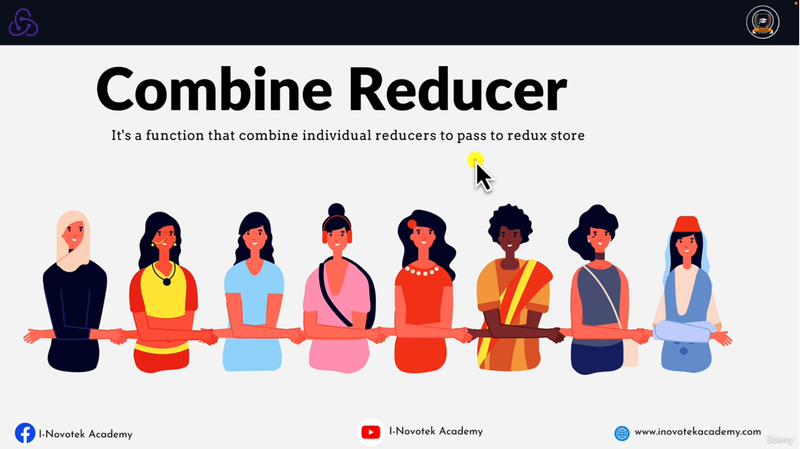

## 📔Topics
1. Core Redux and Core Functions
2. Combine Reducer

---

### 📘What is Redux ?
* Redux is an open-source javascript library for __managing__ and __centralizing__ application state.
* A __Predictable State Container__ for JS APP.

---  

### 📘Redux Road Map


---

### 📘Whats is State ?
* Any data in your application that can change based on conditions. 
* Its a data store that is used to manage the component data.
---

### 📘What is state management ?
* it's the ability to control the information that is passed between React Component.
* State management is the process of determining how to manage state information in a web application.
* State management can be used to track
  * User Data
  * Session Data
  * Application Data
  * Component Data
---

### 📘Type of Data Source
* Server Data (like from api)
* Global state (like redux)
* Local State (useState)
* Url State (passing id in address bar)
* Routing (like queries)
* Local Storage (save token or cart)
---

### Ways of managing state in react
* useState()
* useContext()
* Redux
* RTK (redux toolkit)
* RTK (redux toolkit Query)
---

### 📘When to Use Redux
* You should use Redux when you have a complex state object that is difficult to manage with the local state alone.
* The app state is updated frequently
* The logic to update that state may be complex
* The app has a medium or large-sized codebase and might be worked on bt many people
---

### 📘Redux Terminologies
* __Actions__ : Actions are the driving force of every dynamic application, as they are the medium by which all changes are communicated within a Redux Application.
* __Reducers__ : Reducers are event Listeners which handles event based on the actions type.
* __Store__ : It stores the application data.
---  

### 📘How Redux Works


---

### 📘Example Of Redux


---

### 📘Store Methods
* __getState()__ : Returns the current State tree of your application.
* __dispatch()__ : This is the only way to trigger a state change.
* __subscribe()__ : Listening to any change.

---
### 📘Action Vs Action Creator

* __Action__ : An Action is simply a __javascript object__ that contains information about an event that has occurred in your app.
* __Action Creator__ : Action Creators are __function__ that create and returns actions.

Action Properties (parameters)

* It has a __type__ field as a property which is required.
* It can accept additional properties __(payload)__. This is optional

Action Types OR Action Constants

* const **CONSTANT_NAME** = **"CONSTANT_VALUE"**;

---

### 📘Reducer
A Reducer is a function that receives the __current state__ and __an action object__, _decides how to update the state base on the action and returns the new state._

Rules of Reducers

* The new state value should only be calculated based on the state and action arguments.
* Reducers are not allowed to modify the **existing state.**
---

### 📘Store 
* __It store the application data__.
* __It doesn't contain business logic.__
* It receives actions and pass to all the registered middleware.
* The only way to change the state inside it is to dispatch an action.

**⚠️ Note :** When it receives an actions that causes a change to the state, the store will notify all the registered listeners that a change to the state has been made. This allow various parts of the system, like the UI, to update themselves according to the new state. 

---

### 📘Combine Reducer

* it's a function that combine individual reducers to pass to redux store.



---

### Asynchronous Redux

Problems 

* data is never received, or is received out of order.
* it can make it difficult to debug your code.
* the redux store will not be updated and no changes will be made to your application state.

Answer

⚠️ **Reducers** are immediately return a new data if the correct action is dispatch without waiting for the action payload. 

### Configuration of store
#### Middleware
* Redux middleware is a powerful tool that can be used to customize and extend the functionality of Redux. 
* **Middleware** is basically a **function** that takes in **an action** and can decide how to handle it.

#### Uses of Middleware
* Handle the action
* Dispatch new action (i.e create a side-effect such as making an API Call)
* Log the action to the console / inside the browser by using **redux-dev-extension** tool.

⚠️ Note
* Middlewares are used to enable advanced functionality in a redux store that would not be possible with just a reducer alone.
* Middlewares are composed and executed within a Redux store using the **applyMiddleware()** function.

Example 

```
npm install redux-logger
```

```javascript
const { createStore, applyMiddleware } = require("redux");

// third party middleware
const loggerMiddleware = require("redux-logger").createLogger();

// initial Post State
const initialState = {
    posts: []
};

// custom middleware 
const customLogger = () => next => action => {
    console.log('Action Fired', action);
    next(action);
}

// Action constanst
const FETCHREQUEST = "fetch_request";
const FETCHSUCCESS = "fetch_success";
const FETCHFAILED = "fetch_failed"

//Action + Action creator
const fetchPostRequestAction = (payload) => {
    return {
        type: FETCHREQUEST,
        payload: payload
    }
}

const fetchPostSuccessAction = (payload) => {
    return {
        type: FETCHSUCCESS,
        payload: payload
    }
}

const FetchPostFailedAction = (payload) => {
    return {
        type: FETCHFAILED,
        payload: payload
    }
}

// Reducer
const postReducer = (state = initialState, action) => {
    switch (action.type) {
        case FETCHREQUEST: {
            return { ...state, posts: ["HTML"] };
        }
        default: {
            return { ...state };
        }
    }
};


// store
const store = createStore(postReducer, applyMiddleware(loggerMiddleware, customLogger));

// subscribe 
store.subscribe(() => {
    const data = store.getState()

    console.log("--------------------Output ------------------------------");
    console.log('users', data);

});

// dispatch
store.dispatch(fetchPostRequestAction('ok'));
```
### Redux Thunk 
* **Thunk** : the word thunk is a programming trem that means *"a piece of code that some delayed work"*. 
* Redux Thunk is a **middleware** that allows you to write **asynchronous** actions


#### Facts about redux thunk (important)

* it's function (action creator) that **return a function** instead of an action object.
* This function *receives* this **dispatch** method as an *argument*, which allows you to **dispatch** *actions inside the function*
* This is often used when you need to perform an async operation, such as making an **Ajax request**, before dispatching an action.

#### Example of Thunk 
```
npm install redux
npm install redux-thunk
npm install axios
```
```javascript
const axios = require("axios");
const { createStore, applyMiddleware } = require("redux");
const thunk = require("redux-thunk").default;

// initial Post State
const initialState = {
    posts: [],
    error: "",
    loading: false
};

// Action constanst
const REQUESTSTARTED = "REQUEST_STARTED";
const FETCHSUCCESS = "FETCH_SUCCESS";
const FETCHFAILED = "FETCH_FAILED";


//Action + Action creator
const fetchPostRequestAction = () => {
    return {
        type: REQUESTSTARTED,
    }
}

const fetchPostSuccessAction = (payload) => {
    return {
        type: FETCHSUCCESS,
        payload: payload
    }
}

const FetchPostFailedAction = (payload) => {
    return {
        type: FETCHFAILED,
        payload: payload
    }
}

// MiddleWare [Redux Thunx] (action to make request)
const fetchPosts = () => {
    return async (dispatch, getState) => {
        try {
            console.log('Current State', getState());
            dispatch(fetchPostRequestAction());
            const data = await axios.get('https://jsonplaceholder.typicode.com/posts');
            dispatch(fetchPostSuccessAction(data.data));

        } catch (error) {
            dispatch(FetchPostFailedAction(error.message))
        }
    }
}


// Reducer
const postReducer = (state = initialState, action) => {
    switch (action.type) {
        case REQUESTSTARTED: {
            return { ...state, loading: true };
        }
        case FETCHSUCCESS: {
            return { ...state, loading: false, posts: action.payload }
        }
        case FETCHFAILED: {
            return { ...state, loading: false, error: action.payload }
        }
        default: {
            return { ...state };
        }
    }
};

// store
const store = createStore(postReducer, applyMiddleware(thunk));

// subscribe 
store.subscribe(() => {
    const data = store.getState()

    console.log("--------------------Output ------------------------------");
    console.log('users', data);

});

// dispatch
store.dispatch(fetchPosts());
```
---

### Example of React-Reduc-Thunk

```
npm install redux
npm install react-redux
npm install redux-thunk
npm install axios
npm install redux-devtools-extension
```

```javascript
import axios from "axios";
import { applyMiddleware, combineReducers, createStore } from "redux"
import { composeWithDevTools } from "redux-devtools-extension";
import thunk from "redux-thunk";

// Url Address
export const apiURL = 'https://jsonplaceholder.typicode.com/posts';

// initial State
const initialState = {
    loading: false,
    error: "",
    posts: [],
    post: {}
}

// Action Constants
const FETCH_POSTS_REQUEST = "FETCH_POSTS_REQUEST";
const FETCH_POSTS_SUCCESS = " FETCH_POSTS_SUCCESS";
const FETCH_POSTS_FAILURE = " FETCH_POSTS_FAILURE";

const SEARCH_POST_REQUEST = "SEARCH_POST_REQUEST";
const SEARCH_POST_SUCCESS = " SEARCH_POST_SUCCESS";
const SEARCH_POST_FAILURE = " SEARCH_POST_FAILURE";

// Actions Creator
const fetchPostsRequest = () => {
    return {
        type: FETCH_POSTS_REQUEST
    }
}

const fetchPostsSuccess = (payload) => {
    return {
        type: FETCH_POSTS_SUCCESS,
        payload: payload
    }
}

const fetchPostsFail = (payload) => {
    return {
        type: FETCH_POSTS_FAILURE,
        payload: payload
    }
}

const fetchPostRequest = (payload) => {
    return {
        type: SEARCH_POST_REQUEST,
        payload: payload
    }
}

const fetchPostSuccess = (payload) => {
    return {
        type: SEARCH_POST_SUCCESS,
        payload: payload
    }
}

const fetchPostFail = (payload) => {
    return {
        type: SEARCH_POST_FAILURE,
        payload: payload
    }
}


// Redux Thunks
const fetchPostsAction = () => {
    return async (dispatch, getState) => {
        dispatch(fetchPostsRequest());
        try {
            let data = await axios.get(apiURL);
            dispatch(fetchPostsSuccess(data.data));
        } catch (error) {
            dispatch(fetchPostsFail(error.message))
        }
    }
}

const fetchPostAction = (id) => {
    return async (dispatch, getState) => {
        dispatch(fetchPostRequest());
        try {
            let data = await axios.get(`${apiURL}/${id}`);
            dispatch(fetchPostSuccess(data.data));
        } catch (error) {
            dispatch(fetchPostFail(error.message))
        }
    }
}

// Reducers 
const postsReducer = (state = initialState, action) => {
    switch (action.type) {
        case FETCH_POSTS_REQUEST: {
            return { ...state, loading: true, error: "" }
        }
        case FETCH_POSTS_SUCCESS: {
            return { ...state, posts: action.payload, loading: false, error: "" }
        }
        case FETCH_POSTS_FAILURE: {
            return { ...state, posts: [], loading: false, error: action.payload }
        }
        case SEARCH_POST_REQUEST: {
            return { ...state, loading: true, error: "" }
        }
        case SEARCH_POST_SUCCESS: {
            console.log(action.payload);
            return { ...state, posts: [action.payload], loading: false, error: "" }
        }
        case SEARCH_POST_FAILURE: {
            return { ...state, posts: {}, loading: false, error: action.payload }
        }
        default: {
            return state;
        }
    }
}


const rootReducer = combineReducers({
    postsData: postsReducer
})
const store = createStore(rootReducer, composeWithDevTools(applyMiddleware(thunk)));

export { fetchPostsAction, fetchPostAction, store };
```
---
### Redux Problems
* Configuring a Redux store is too complicated
* I have to add a lot of packages to get Redux to do anything usefull
* Redux requires too much bolierplates code

### What is Redux Toolkit ?
* Redux toolkit is complete rewrite of the standard Redux Library.
* It is designed to make it easier to write redux applications by providing a set of helper functions.
* The Redux toolkit library is divided into 2 parts: the core library and the react bindings.

Importance of RTK <br/>

* To make Redux development easier.
* Easy Store Configuration.
* To Reduc the size of redux bundles.

---
### Redux Toolkit common API's

1. **CreateAction** : *Action Creator + Action Types*
2. **CreateReducer** : *it's the easiest way of creating Redux red*ucer functions* 
3. **creatSlice** : *CreateAction + CreateReducer to generate act*ions and reducer*
4. **CreateAsyncThunk** : *Handle Async Actions (redux-thunk)*
5. **ConfigureStore** : *Easiest way to create Redux Store*

---
### CreateAction
* It combines action type **constants** and the **action together** to create action creator.
* The action creator can be called with or without a **payload**
* By default it accept one **parameter(action type)** but can customized.
* Action type is a required as a parameter.

---

### createReducer
* It's the easiest way of creating Redux reducer functions.
* we can directly mutate the data beacuse it uses immer internally. 
* It doesn't use switch or case statment.
* There are two types of creating reducers (builder callback or map object notation).
---
#### Example (createAction && createReducer)

```
npm install @reduxjs/toolkit
npm install redux-logger
```

```javascript

const { createAction, nanoid, createReducer, configureStore } = require("@reduxjs/toolkit");
const logger = require("redux-logger").createLogger();
// initial state
const initialState = {
    counter: 0
}

//Action constants
const INCREMENT = "INCREMENT";
const DECREMENT = "DECREMENT";
const RESET = "RESET";
const INCREMENT_BY = "INCREMENT_BY";

//Action Creator
const incrementAction = createAction(INCREMENT);
const decrementAction = createAction(DECREMENT);
const resetAction = createAction(RESET);
const incrementByAction = createAction(INCREMENT_BY, (payload) => {
    return {
        payload
    }
});

// console.log(incrementAction({ id: nanoid(), title: 'Deepu' }));

// Reducer
// 1. Builder callback notation
const counterSlice = createReducer(initialState, builde => {
    builde.addCase(INCREMENT, (state) => {
        state.counter += 1
    })
    builde.addCase(DECREMENT, (state) => {
        state.counter -= 1
    })
    builde.addCase(RESET, (state) => {
        state.counter = 0
    })
    builde.addCase(INCREMENT_BY, (state, action) => {
        state.counter += action.payload
    })
})

// 2. map object notation (not recommended)
// const counterSlice2 = createAction(initialState,, {
//     [INCREMENT]: state => state.counter += 1,
//     [DECREMENT]: state => state.counter -= 1,
//     [RESET]: state => state.counter = 0,
//     [INCREMENT_BY]: (state, action) => state.counter += action.payload
// })


const store = configureStore({
    reducer: counterSlice,
    middleware: (getDefaultMiddleware) => getDefaultMiddleware().concat((logger))
});


// dispatch action

store.dispatch(incrementAction());
console.log('------------output------------------');
console.log(store.getState());

store.dispatch(incrementAction());
console.log('------------output------------------');
console.log(store.getState());

store.dispatch(decrementAction());
console.log('------------output------------------');
console.log(store.getState());


store.dispatch(resetAction());
console.log('------------output------------------');
console.log(store.getState());


store.dispatch(incrementByAction(40));
console.log('------------output------------------');
console.log(store.getState());
```
---
### createSlice
* **It simplifies the creation of action creators and reducers.**
* **createSlice = createAction + createReducer.**
* It doesn't use switch or case statement.
* Each Slice reducer "owns" it state indpendently. 
---
#### createSlice Arguments 
  * name
  * initialState
  * reducer/extraReducer

* name : is used in action type, and it must be unique, it represent a particular reducer in the state.
* reducer : it handle specific action type/ implement business logic.

#### Example (createSlice (action constants + actionCreator))  

```javascript
const { configureStore, createSlice } = require("@reduxjs/toolkit");
const logger = require("redux-logger").createLogger();

// initial state
const initialState = {
    counter: 0
}

// CreateSlice
counterSlice = createSlice({
    name: "COUNTER_APPLICATION",
    initialState,
    reducers: {
        incrementAction: (state) => { state.counter += 1 },
        decrementAction: (state) => { state.counter -= 1 },
        resetAction: (state) => { state.counter = 0 },
        incrementByAction: (state, action) => { state.counter += action.payload }
    }
});

// Generate actions
const { incrementAction, decrementAction, resetAction, incrementByAction } = counterSlice.actions;

//Generate reducer
const counterReducer = counterSlice.reducer;

const store = configureStore({
    reducer: counterReducer,
    middleware: (getDefaultMiddleware) => getDefaultMiddleware().concat((logger))
});


//dispatch action
store.dispatch(incrementAction());
console.log('------------output------------------');
console.log(store.getState());

store.dispatch(incrementAction());
console.log('------------output------------------');
console.log(store.getState());

store.dispatch(decrementAction());
console.log('------------output------------------');
console.log(store.getState());


store.dispatch(resetAction());
console.log('------------output------------------');
console.log(store.getState());


store.dispatch(incrementByAction(40));
console.log('------------output------------------');
console.log(store.getState());

```
---
### createAsync Thunk
* it's the recommended approach the handling **async request lifecycls**
* This API has eliminated the tradintional of installing redux thunk for async actions.
* This returns a promise

#### lifeCycles of createAsyncThunk
* Pending
* Fulfilled
* rejected

Example 

```
npm install axios
npm install @reduxjs/toolkit
```

```javascript
const { createAsyncThunk, createSlice, configureStore, createAction } = require("@reduxjs/toolkit");
const axios = require("axios");
const API = "https://jsonplaceholder.typicode.com/posts";

const initialState = {
    posts: [],
    loading: false,
    error: null
}

//Action Constant 
const POST_CONST = "post/fetchPosts";

// Action Type
const posts = createAction(POST_CONST);

//create Async Thunk 
const fetchPosts = createAsyncThunk(posts.type, async () => {
    const data = await axios.get(API);
    return data.data;
});

const postsSlice = createSlice({
    name: 'postSliceName',
    initialState,
    // for handle promise based calls
    extraReducers: (builder) => {
        // pending
        builder.addCase(fetchPosts.pending, (state, action) => {
            state.loading = true;
        });

        // fullfilled
        builder.addCase(fetchPosts.fulfilled, (state, action) => {
            state.posts = action.payload;
            state.loading = false;
        });

        // rejected 
        builder.addCase(fetchPosts.rejected, (state, action) => {
            state.posts = [];
            state.loading = false;
            state.error = action.payload;
        })
    }
});

// generate reducer 
const postsReducer = postsSlice.reducer;

const store = configureStore({
    reducer: postsReducer
});

store.subscribe(() => {
    const data = store.getState();
    console.log(data);
})

// dispatch 
store.dispatch(fetchPosts())
```
#### Example React-Redux-toolkit-Async

```javascript

import { configureStore, createAsyncThunk, createSlice } from "@reduxjs/toolkit";
import axios from "axios";

// Url Address
export const apiURL = 'https://jsonplaceholder.typicode.com/posts';

// initial State
const initialState = {
    loading: false,
    error: undefined,
    posts: [],
}

// action
const fetchPosts = createAsyncThunk('posts/fetch', async (payload, { rejectWithValue, getState, dispatch }) => {
    const res = await axios.get(apiURL);
    return res.data;


    // try {
    //     const res = await axios.get(apiURL);
    //     return res.data;
    // } catch (error) {
    //     // console.log(error);
    //     // console.log(rejectWithValue(error.response));
    //     // return rejectWithValue(error.response.message);
    //     // return rejectWithValue(error.response.status);
    //     return
    // }

});


const searchPost = createAsyncThunk('post/fetch', async (payload, { rejectWithValue, getState, dispatch }) => {
    const res = await axios.get(`${apiURL}/${payload}`);
    return [res.data];
});

// slice 
const postsSlice = createSlice({
    name: 'posts',
    initialState,
    extraReducers: (builder) => {
        builder.addCase(fetchPosts.pending, (state, action) => {
            state.loading = true;
            state.error = undefined;
        })
        builder.addCase(fetchPosts.fulfilled, (state, action) => {
            state.loading = false;
            state.posts = action.payload;
            state.error = undefined;
        });
        builder.addCase(fetchPosts.rejected, (state, action) => {
            state.loading = false;
            state.error = action.error.message;
            state.posts = [];
        });
        builder.addCase(searchPost.pending, (state, action) => {
            state.loading = true;
            state.error = undefined;
        })
        builder.addCase(searchPost.fulfilled, (state, action) => {
            state.loading = false;
            state.posts = action.payload;
            state.error = undefined;
        });
        builder.addCase(searchPost.rejected, (state, action) => {
            state.loading = false;
            state.error = action.error.message;
            state.posts = [];
        });
    }
});


// Generate reducer 
const postsReducer = postsSlice.reducer;

const store = configureStore({
    reducer: {
        posts: postsReducer
    }
})

export { store, fetchPosts, searchPost };
```
### Example Redux-toolKit-RTK
```
// Main Dependencies
npm install @reduxjs/toolkit
npm install react-redux
```

```
// for Js
npm create-react-app --template redux 

// for Typescript
npm create-react-app --template redux-typescript 
```


```javascript
//store.js
import { configureStore, getDefaultMiddleware } from "@reduxjs/toolkit";
import { createApi, fetchBaseQuery, setupListeners } from "@reduxjs/toolkit/query/react";


export const todoApi = createApi({
    reducerPath: 'api', // key name for caching 
    baseQuery: fetchBaseQuery({ baseUrl: 'http://localhost:3004/' }),   // its like axios 
    tagTypes: ['Todos'],  // slice name 
    endpoints: builder => ({
        getToDos: builder.query({           // for get method
            query: () => ({
                url: 'todos',
                method: 'GET',          // this is address
                transformResponse: res => res.sort((a, b) => b.id - a.id),
            }),
            providesTags: ['Todos']
        }),
        getSinglePost: builder.query({
            query: (id) => ({
                url: `todos/${id}`,
                method: 'GET',
            }),
            providesTags: ['Todos']
        }),
        addToDo: builder.mutation({
            query: (payload) => ({
                url: 'todos',
                method: 'POST',
                body: payload,
                headers: {
                    'Content-type': 'application/json;charset=UTF-8'
                }
            }),
            invalidatesTags: ['Todos']
        }),
        updateToDo: builder.mutation({
            query: (payload) => ({
                url: `todos/${payload.id}`,
                method: 'PUT',
                body: payload               // containing all data 
            }),
            invalidatesTags: ['Todos']
        }),
        deleteToDo: builder.mutation({
            query: (payload) => ({
                url: `todos/${payload}`,
                method: 'DELETE',
            }),
            invalidatesTags: ['Todos']
        }),

    })
});


export const store = configureStore({
    reducer: {
        [todoApi.reducerPath]: todoApi.reducer
    },
    middleware: (getDefaultMiddleware) => getDefaultMiddleware().concat(todoApi.middleware)
})

setupListeners(store.dispatch);

export const { useGetToDosQuery, useGetSinglePostQuery, useAddToDoMutation, useUpdateToDoMutation, useDeleteToDoMutation } = todoApi;
```

```javascript
// Todo.js
import React, { useState } from 'react'
import { Provider } from 'react-redux';
import { useGetToDosQuery, useGetSinglePostQuery, useUpdateToDoMutation, useAddToDoMutation, useDeleteToDoMutation, store } from './store';
import { BrowserRouter as Router, Routes, Route, Link, useParams } from "react-router-dom"

const ToDoComponent = () => {
    const [newTodo, setNewTodo] = useState('');
    const { data, isLoading, isSuccess, isError, error } = useGetToDosQuery();
    const [addToDo] = useAddToDoMutation();
    const [updateToDo] = useUpdateToDoMutation();
    const [deleteToDo] = useDeleteToDoMutation();

    const handleSubmit = (e) => {
        if (newTodo === '') {
            alert('Enter Todo');
            return
        }
        addToDo({ title: newTodo, completed: false })
        setNewTodo('');
    }

    let content;
    if (isLoading) {
        content = <p>Loadiing ....</p>
    } else if (isSuccess) {
        content = data.map(item => {
            return <div key={item.id} style={{ border: '2px solid red', margin: '10px', padding: '10px' }}>
                <h3>id : {item.id}</h3>
                <p>title : {item.title}</p>
                <p>Status : {item.completed ? 'Completed' : 'Pending'}</p>
                <Link to={`showTodo/${item.id}`}>View</Link><br />
                <button onClick={() => updateToDo({ ...item, completed: !item.completed })}>Update</button>
                <button onClick={() => deleteToDo(item.id)}>Delete</button>
            </div>
        });

    } else if (isError) {
        content = <p>{error.message}</p>
    }

    return (
        <div style={{ padding: '10px' }}>
            <br />
            <form>
                <label>Enter Task</label> <br />
                <input type='text' name='' value={newTodo} onChange={e => setNewTodo(e.target.value)} placeholder='Enter To' required />
                <button type='button' onClick={handleSubmit}>Submit</button>
            </form>
            <br />
            <h1>Todo List</h1>
            {content}
        </div>
    );
}

const ShowSinglePost = () => {
    const { id } = useParams();
    const { data, isLoading, isSuccess, isError, error } = useGetSinglePostQuery(id);

    let content;
    if (isLoading) {
        content = <p>Loadiing ....</p>
    } else if (isSuccess) {
        content = <div style={{ margin: '10px', border: '2px solid red', padding: '5px' }}>
            <h3>id : {data.id}</h3>
            <p>title : {data.title}</p>
            <p>Status : {data.completed ? 'Completed' : 'Pending'}</p>
        </div>
    } else if (isError) {
        content = <p>{error.message}</p>
    }
    return (<>
        {content}
    </>)
}


const Todo = () => {
    return (
        <Provider store={store}>
            <Router>
                <Link to="/">Home</Link>
                <Routes>
                    <Route path='/' element={<ToDoComponent />} />
                    <Route path='/showTodo/:id' element={<ShowSinglePost />} />
                </Routes>
            </Router>
        </Provider >
    )
}

export default Todo;
```

### JSON-placeHolder
```
npm install -g json-server
npx json-server --watch db.json --port 3004
```
```javascript
//db.json
{
  "posts": [
    {
      "id": 1,
      "title": "json-server",
      "author": "typicode"
    }
  ],
  "todos": [
    {
      "title": "Javascript",
      "completed": true,
      "id": 2
    },
    {
      "title": "chqh",
      "completed": false,
      "id": 4
    },
    {
      "title": "dhdh",
      "completed": false,
      "id": 5
    },
    {
      "title": "djdj",
      "completed": false,
      "id": 6
    }
  ]
}
```