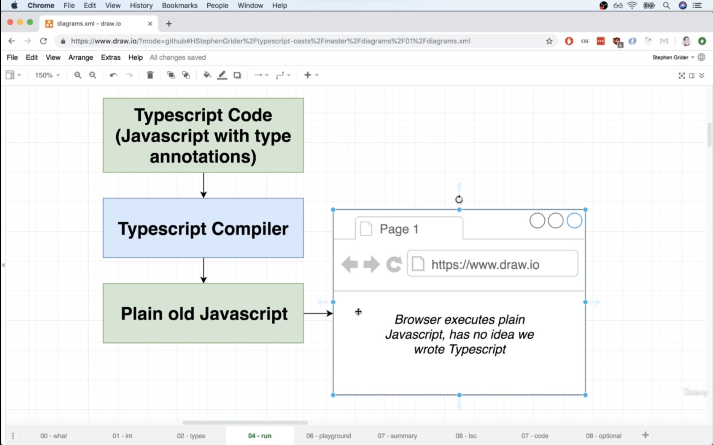

## 📔Getting Started with Typescript

* **TypeScript :**
1. Helps us catch errors during development  (i.e before the code gets **compiled**) which force you to write Filter, cleaner and better code.
2. **Uses 'type annotations' to analyze our code.**
3. Our active during development.
4. Doesn't provide any performance optimization.
5. It fix all errors on **run-time**.





---

### 📘Informatics things

1. After putting colons **:** we enter into the *typeScript* world.

2. Where to use or not
```javascript
// its not a good practice
let age : number = 1;


// Good practice
let age : number;
age = 10;
```
3. Run-Time vs Compile-Time


4. TypeScript only cares about **types** not about any **logic**

```js
function add(a : number, b : number) : number {
  return a - b ;  // here we are return subtraction not addition
}

add(1, 3);
```

5. We get common methods when we define type more than one


---
### 📘Environment Setup
* Command for installing Typescript on Globally
```
npm install -g typescript ts-node
```

* To check
```
npx tsc --help
```

* TypeScript is *Programming language* hance need **complier** for execute the codes.
* Extension is **.ts**

Example

```javascript
// index.ts
const btn = document.querySelector('#button')! as HTMLButtonElement;
const num1 = document.querySelector('#num1')! as HTMLInputElement;

function add(num1 : number, num2 : number) {
    return +num1 + +num2;

}
console.log(add(1, 2));
```

Command to execute File
```
npx tsc index.ts
```
Command to execute File and See output
```
npx ts-node index.ts
```

---

### 📘 Type Annotations Vs Type Inference
* **Type annotations :** Code we add to tell typescript what type of value a variable will refer to
*  **Type inference :** Typescript tries to figure out what type of value a variables refers to


* Understand the Type Inference


* When to use Type Inference


* Inference around function


## 📔TypeScript Basics Basic Types

### 📘Core Types


Core javascript Example for **type checking**, but we are checking Error on **Run Time**, which effect our speed

```js
function add(n1, n2) {
    if (typeof n1 !== 'number' || typeof n2 !== 'number') {
        throw new Error('Invalid Input');
    }
    return n1 + n2;
}

console.log(add(2, 3.5));   // 5.5
console.log(add('2', 3));   // Error
```
⚠️ **Note :** The key difference is: **Javascript use "dynamic types"** (resolved at runtime), **TypeScript uses "static types"** (set during development)

---

### 📘Various types in TypeScript

1. Number Type
```javascript
let age : number = 1;

function add (n1:number, n2:number) {
    return n1 + n2;
}
```


2. Boolean Type
```javascript
let isLogin : boolean = true;
```
3. String Type

```javascript
let fullName : string = 'Deepinder Singh';
```
4. Object Type : you can use with *type* and *interface*
* **interface** : Describe the structure of object. More stronger than **type**
```javascript
// 1. Defining only object type
let Person : Object {
  name : 'Deep',
  age : 30
}

// 2. Type Annotation
type Person = {
  name: String;
  age: Number;
};

let person: Person = {
  name: "Deepu",
  age: 30,
};
console.log(person.name);

//3. interface
interface Person = {
  name: string;
  age: number
};

let person: Person = {
  name: "Deepu",
  age: 33,  // this line will cause error
};

console.log(person.name);
```


5. Array of String & Nested Array

```javascript
const hobbies : (string | number)[] = ['kite', 10, 'Study']
```
6. Tuple
```javascript
type Person {
    name : String;
    age : Number;
    role : [Number, String];    // only can add two types with fixed length
}

let person : Person = {
    name : 'Deepinder',
    age : 19,
    role : [2, 'Admin']
}

// Because in tupal we cannot add more than two element
person.role.push('operator')    // Error
```
7. Enum Type : 
* **Enumeration**
* when want to **use like constants** (when we use *same words* all over that application)
* Major difference between *enum and object* is **objects** are use to store various information where are **enum** are collection of very closely related values eg only User-Types : Admin, View, Operator etc like a constant.

```javascript
enum Role {
  ADMIN = "admin",
  READ_ONLY = "read_only",
  AUTHOR = "author",
}

let person = {
  name: "Deepinder",
  age: 19,
  role: Role.ADMIN,   // providing value just like constant
};

if (person.role === Role.ADMIN) {
  console.log("Admin");
}
```
**⚠️ Note :** if we don't provide any value in *enum type* then it will take *index values* automatically.

```js
enum Role {
  ADMIN,
  READ_ONLY,
  AUTHOR,
}

let person = {
  name: "Deepinder",
  age: 19,
  role: Role.ADMIN,
};

if (person.role === 1) {
  console.log("Admin");
}
```
* Where you should use


8. Any
* When we use **any** it disabled all type checking.
* Means TS has no idea what this is - can't check for correct property references.
* Avoid as much you can.

```javascript
let obj: any = {
  name: 'Deep',
  age: 3,
};

obj.test; // no error from type script
```
9. Union Type (means OR)

```javascript
let age : number | string;

// Conceptual Example
function combined(a: number | string, b: number | string): number | string {

  let result: string | number;

  if (typeof a === "number" && typeof b === "number") {
    result = a + b;
  } else {
    result = a.toString() + b.toString();
  }
  return result;
}

console.log(combined(1, 2));
console.log(combined("1", "2"));
```
10. Literal Type :
* when you provide **specific values** not the **data types**.
* It always use with **union type** in example we are providing two values *Deepu OR Dp*
```javascript
// Example with values
type MyName = "Deepu" | "Dp";

function test(name: MyName) {
  return name;
}

test("Dp");
test("ok"); // cause error because value not in option
```
11. unknown
* Think of **unknown** in TypeScript like a box that could contain any type of value, but you're not sure exactly what's inside. TypeScript wants you to be careful when using values of unknown types, so you have to do some checks before you use them.

```js
// Using any
let valueAny: any = "Hello, TypeScript!";
let lengthAny: number = valueAny.length; // No type-checking, TypeScript assumes any type

// Using unknown
let valueUnknown: unknown = "Hello, TypeScript!";

// Uncommenting the line below will result in a TypeScript error
// let lengthUnknown: number = valueUnknown.length; // Error! You need to check the type first

// Checking the type before using it
if (typeof valueUnknown === "string") {
  let lengthUnknown: number = valueUnknown.length; // OK, TypeScript is satisfied with the type-checking
  console.log(lengthUnknown); // Outputs the length: 18
} else {
  a;
  console.log("Not a string"); // This branch is taken if the type is not a string
}
```

12. never

* In TypeScript, never is a type that represents a situation where something will never happen. It's like saying, **"This function will never return anything" or "This code will never reach this point"**
* In this example, the throwError function is declared to never return anything (never). It always throws an error, and once an error is thrown, the function doesn't continue executing. The never type is used to describe situations where your code won't proceed any further.
* Another example is **Infinite Loop**
```js
function throwError(message: string): never {
    throw new Error(message);
}
```
13. Null

```js
let nothingMuch : null = null;
```

14. Void

```js
function test() : void {
  console.log('Hello World')
}
test();
```

15. Classes

```js
class Car {

}

let car1 : Car = new Car();
```

---

### 📘Types Aliases Custom Types

```javascript
let role : number | string;

// instead of above we can use the below statement

type Role = number | string;
type ValidUser = boolean | number;
type AddingTwoNumber = (a: number, b: number) => number;

let role: Role;
let isLogin: ValidUser;
let sum: AddingTwoNumber = (a, b) => {
  return a + b;
};

sum(3, 3);
```

---

### 📘Interfaces

1. Only Care about property mandatory property

```js
interface DriveSpeed {
  // its only cares about this property and it should be exist in object
  drive: () => string;
}

const civicCar = {
  name: "Civic",
  model: 2018,
  speed: 1000,
  drive: function () {
    return `${this.name} car with ${this.model} runs at ${this.speed} on highway`;
  },
};

const fordCar = {
  name: "Ford",
  isHandBreak: true,
  isSuspension: true,
  speed: 1000,
  drive: function () {
    return `${this.name} car runs at ${this.speed} on highway`;
  },
};

function checkCarSpeed(obj: DriveSpeed): void {
  console.log(obj.drive());
}

checkCarSpeed(civicCar);
checkCarSpeed(fordCar);

```

2. Difference between Interface and Type

```js
// In General we always use type keyword

/*
For type
1 you can use on the other data types like on string boolean but interface are only use on object data types only
*/

type UserType = "Admin" | "Viewer"; // like here we are using on string

interface UserType  {
  value = "Admin" | "View"
}

const User = interface.value  // error

/*
for Interfaces
1. Implement in Classes
*/

interface Credentials {
  email: string;
  password: string;
}

let cred: Credentials;
cred = {
  email: "dp",
  password: "dp",
};

class AuthCredentials implements Credentials {
  email: string = "ok";
  password: string = "ok";
  username: string = "ok";
}

function Login(credentials: Credentials) {
  return;
}

Login(cred);
Login(new AuthCredentials());

// 2. Extend Interface
interface CredentialsMode extends Credentials {
  mode: string;
}
```


---

### 📘Functions Type


1. Return type as Data Type : data type like **number, string, void etc**

```js
// Number Type
function sum(n1 : number, n2 : number) : number {
    return n1 + n2;
}
sum(1, 2);

// Void Type
function printValue (n1: number, n2 : number) : void {
    console.log(n1 + n2);
}

printValue(1, 2);
```

**⚠️Note :**
* *void functions* has *undefined* return type.
* *void* is also standard way to return type instead of *undefined*
* Typescript never allow us to place *undefined* instead of *void*

```js
// if we want undefined then we have to place return;
function sum() : undefined{
    return;     // undefined
}

sum()
```
2. Function as type itself

```js
let sumOfTwoNumber: (a: number, b: number) => number = (
  a: number,
  b: number
): number => {
  return a + b;
};

sumOfTwoNumber(1, 2);
```


3. Callback Type

```javascript
function cal(n1 : number, n2 : number, cb : (res : number) => void) : void{
    let result  = n1 + n2;
     cb(result);
}

cal(1, 2, (result) => console.log(result));
```
**⚠️ Note :** ShortHand for functions returns

```js
interface User {
  firstName: string;
  lastName: string;
  getFullName(): string;
}

let user: User = {
  firstName: "",
  lastName: "",
  getFullName: function (): string {
    return this.firstName + this.lastName;
  },
};
```


---

### 📘Destructure using Object Notation

```js
let obj = {
  firstName: "Deep",
  lastName: "Singh",
  age: 3,
  address: {
    houseNo: "51-d",
    streetNo: 3,
  },
};

let {
  firstName,
  lastName,
  address: { houseNo, streetNo },
}: {
  firstName: string;
  lastName: string;
  address: { houseNo: string; streetNo: number };
} = obj;

console.log(firstName);
console.log(lastName);
console.log(houseNo);
```


---

## 📔The TypeScript Compiler and its Configuration

### 📘Using Watch Mode (for single file)
```js
"scripts": {
  "compile": "npx tsc index.ts --w"
}
```
```
npm run compile
```

---
### 📘Using Watch Mode (for Multiple file/Complete Folder)
* this command will create *tsconfig.json* file which only use during setup only
```
npx tsc --init
```

* After set up *tsconfig* file, then this command will compile whole ts files in folder

```
npx tsc
```

* now this command will watch all ts files in the folder

```
npx tsc --watch
```

### 📘Exclude and Include Files
* Add this property in *tsconfig.json*

```js
"exclude": ["./node_modules", "./sending.ts", "*.proposal.ts"],
"include": ["./index.ts"],
"files": ["./index.ts"]   // same like include but you cannot include folders here
```
---

### 📘Setting a Compilation Target
*  Set the JavaScript language version for emitted JavaScript and include compatible library declarations like *let const & var*.

```js
"target": "es2016",
```

---
### 📘Understanding TypeScript Core Libs

*  Specify a set of bundled library declaration files that describe the target runtime environment.

```js
"lib": [
  "DOM",
  "ES6",
  "DOM.Iterable",
  "ScriptHost"
]
```
---

### 📘Working with Source Maps

* Create source map files for emitted JavaScript files, this will help to debug our code on the browser
* This files help use for *Debugging and Development* like for example *just in case we want to see js files in our browser (source tab) in that case we are not able to understand that code because it get minified or compiled version*

```js
"sourceMap": true
```


---

## 📔Classes

* Class, Object, Members, Functions
* Inheritance (extends & super method)
* Members and function over-ridding
* Access Specifiers (public private protected)
* Static Members & Static methods
* Abstract Classes (cannot create object of this class)
* interfaces
---

### 📘Private and public Access Modifiers

```js
class Department {
  public name: string;
  constructor(n: string) {
    this.name = n;
  }

  public getName() {
    console.log(this.name);
  }

  private describe(this: Department) {
    console.log("ok", this.name);
  }
}

let obj1 = new Department("Computer Sci");
obj1.getName();
//obj1.describe();  // this will cause Error
```

### 📘Shorthand Initialization
* no need to create variables
* no need to create variables with in constructor method
* just only need to initialize in parameters
```js
class Department {
  constructor(public name: string) {}

  public getName(): void {
    console.log(this.name);
  }
}

class Administrator extends Department {
  constructor(public headName: string, name: string) {
    super(name);
  }

  public headNameHandler(): void {
    console.log(this.headName);
  }
}

let obj1 = new Department("Computer Sci");
obj1.getName();

let obj2 = new Administrator("Computer Sci", "Deep");
obj2.getName();
```

**📚 Conceptual Example :**

```js
import { faker } from "@faker-js/faker";

class User {
  name: string;
  location: {
    lat: number;
    lng: number;
  };
  constructor() {
    this.name = faker.person.fullName();
    /*
      Because in the above code we have said that it will object and have lat and lng properties but we did not declare hence we will get error if do like in below code
      this.location.lat = "111"  // cause error
      this.location.lng = "111"  // cause error
    */
    this.location = {
      lat: faker.location.latitude(),
      lng: faker.location.longitude(),
    };
  }
 }

const obj = new User();
```
### 📘Abstract Classes

```js
abstract class College {
  abstract name: string;
  abstract getName(): string;
  abstract setName(name: string): void;
}

class Student extends College {
  name: string;
  getName(): string {
    return this.name;
  }
  setName(n: string) {
    this.name = n;
  }
}

let obj = new Student();
```

### 📘Abstract Vs Interface


---

## 📔Advanced Types

### 📘Intersection Types
* Intersection allows us to combine the other types

1. Type Interface

```js
type Admin = {
  name: string;
  privileges: string[];
};

type Employees = {
  name: string;
  startDate: Date;
};

type ElevatedEmployee = Admin & Employees;

const e1: ElevatedEmployee = {
  name: "Deep",
  startDate: new Date(),
  privileges: ["create-server"],
};
```
2. Interface Type

```js
interface Admin {
  name: string;
  privileges: string[];
}

interface Employees {
  name: string;
  startDate: Date;
}

type ElevatedEmployee = Admin & Employees;

interface ElevatedEmployeeInterface extends Admin, Employees {}

const e1: ElevatedEmployee = {
  name: "Deep",
  startDate: new Date(),
  privileges: ["create-server"],
};
```
### 📘More on Type Guards

1. **For Primitives** : we use *typeof* like : string, number, boolean, symbol

```js
function add(a, b) {
    if (typeof a === "number" && typeof b === "number") {
        // this is called type guard
        return a + b;
    }
    else {
        return a.toString() + a.toString();
    }
}
add(1, 2);
add("a", "b");
```

2. **For Non-Primitives** : we use *in* for objects only

```js
var obj = {
    name: "Deep",
    age: 30,
};
if ("name" in obj) {
    console.log("name property exist in obj");
}
else {
    console.log("name property does not exist");
}
```
3. **For Function Constructor** : we use *instanceOf* like classes, function constructors

```js
class Car {
  drive() {
    console.log("Driving....");
  }
}

class Truck {
  drive() {
    console.log("Driving Truck....");
  }
  loadCargo(amount: number) {
    console.log("Loading cargo..." + amount);
  }
}

type Vehicle = Car | Truck;

const v1 = new Car();
const v2 = new Truck();

function useVehicle(vehicle: **Vehicle**) {
  vehicle.drive();

  if (vehicle instanceof Truck) {
    vehicle.loadCargo(1000);
  }
}

useVehicle(v1);
useVehicle(v2);
```

---

### 📘Type Casting

* Typecasting : helps typescript that some value is of specific type where typescript not able to detected by its own but you as developer know.

```js
let inputElement = document.getElementById("#firstName")!; // refer to not null by using ! sign
let inputElement = <HTMLInputElement>document.getElementById("#firstName")!; // type casting
let inputElement = document.getElementById("#firstName")! as HTMLInputElement; // type casting

inputElement.value = "Deep Singh";

// or
let inputElement = document.getElementById("#firstName");

if (inputElement) {
  (inputElement as HTMLInputElement).value = "Deep Singh";
}
```
---

## 📔Generics

## 📘Creating a Generic Function
* Generic Type : is a type which is kind of connected with some other type and really flexible regarding which exact type that other type is.

```js
const names : Array<string> = [];

// 1. For Type
type DataStorage<T> = {
  // here T is called place holder
  storage: T[];
  add: (data: T) => void;
};

type User = {
  name: string;
  age: number;
};

let textStorage: DataStorage<string> = {
  storage: ["f", "g"],
  add: (d) => console.log(d),
};

let userStorage: DataStorage<User> = {
  storage: [{ name: "dp", age: 30 }],
  add: (user) => console.log(user),
};

//2. For Functions
function merge<T, U>(a: T, b: U) {
  return {
    ...a,
    ...b,
  };
}

const userFn1 = merge<{ name: string }, { age: number }>(
  { name: "Dp" },
  { age: 29 }
);

// type script is intelligent enough that what parameter you are sending and where we have to bind it
const userFn2 = merge({ name: "Dp" }, { age: 29 });
```

---

### 📘Working with Constraints (extends)
* Make Generic placeholder for specific type

```js
function merge<T extends object, U extends object>(objA: T, objB: U) {
  return Object.assign(objA, objB);
}

const mergeObj = merge(
  { name: "Deep", hobbies: ["sports"] },
  { job: "web development" }
);

console.log(mergeObj);
```

---

### 📘Another Generic Function
* We are just care about that *datatype* or *custom datatype* which have *length* property nothing else.
```js
interface Lengthy {
  length: number;
}

function countAndDescribe<T extends Lengthy>(element: T): [T, string] {
  let describeElement = "Got no Value";
  if (element.length === 1) {
    describeElement = "Got 1 Element.";
  } else if (element.length > 1) {
    describeElement = "Got " + element.length + " elements";
  }
  return [element, describeElement];
}

countAndDescribe("Hello World");
countAndDescribe(["Hello World"]);
countAndDescribe([]);
countAndDescribe(2525);
```
---

### 📘The keyof Constraint
* to check the key in the object
```js
function extractAndConvert<T extends object, U extends keyof T>(
  obj: T,
  key: U
) {
  return obj[key];
}

extractAndConvert({ name: "Dp" }, "name");

// cause Error
extractAndConvert({}, "name");
```
### 📘Type Definition Files

* It create a bridge between typescript file and javascript file
* It help typescript to understand what kind of datatype of parameter required for function and what kind of parameter data type function will return.


* to Instal type definition files for particular files.
* these files are with **\<anyFilename>\.d.ts**

