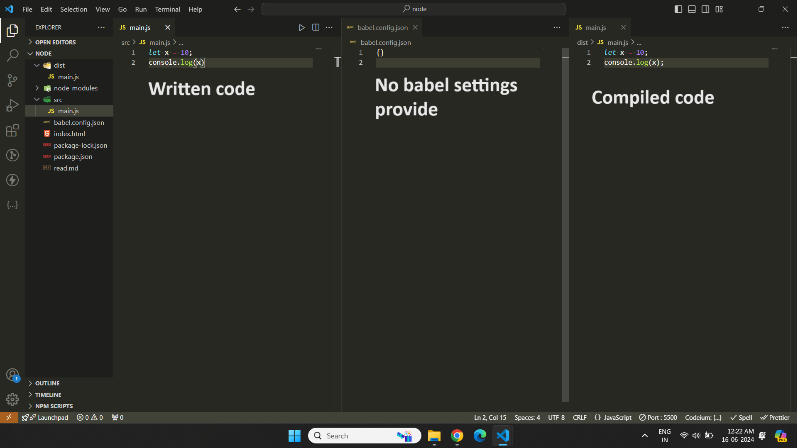
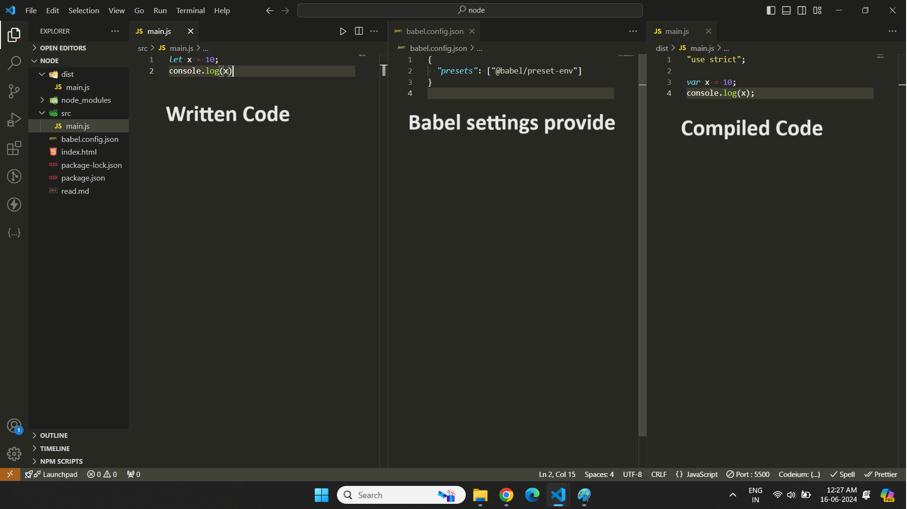

## 📔Babel
* In the other languages like java code get compiled by compiler and get convert into byte code but in babel it will convert js code into js code.
* Babel is used to convert modern JavaScript code into basic JavaScript (ES6 or earlier) so that older browsers can understand it.
* You can get all settings from babel documentation.
### 📘Difference between Babel & Webpack
* **Babel** is used to convert modern JavaScript code into basic JavaScript (ES6 or earlier) so that older browsers can understand it.
* **Webpack** is use to bundle all files into a single which includes minify, remove extra codes or unwanted codes etc.


### 📘Installation, configuration & Check installation version

**1. For basic packages**

* Create src folder and place js files

```js
let x = 10;
console.log(x)
```

* Packages (core library)
```
npm install --save-dev @babel/cli @babel/core
```

* packages.json

```js
"scripts": {
  "build": "webpack --config webpack.config.js",
  "babel": "babel src -d dist",
  "version": "babel --version"  // to check version in local
}
```
* To check installation version (go into directory)

```
node_modules/.bin/babel --version
```


* Command
```
npm run build
```



**2. To convert es2016+ code into es2015**

* Packages
```
npm install @babel/preset-env --save-dev
```
* Create **babel.config.json** (place the below code), on older version file name was **.babelrc**
```js
{
  "presets": ["@babel/preset-env"]
}
```
* packages.json

```js
"build": "babel src -d dist"
```

* Command
```
npm run build
```



### 📘Async-Await Conversion example

* No need to write type="module" for compiled code.

```html
<script src="dist/main.js"></script>
```


### 📘Babel Loader in webpack

* Already covered in webpack notes (in Js Loader and babel loader topic)

### 📘Various plugins

1. **Babel can convert JSX syntax**

```
npm install --save-dev @babel/preset-react
```

2. **For type checking**

* You can install the flow preset with
```
npm install --save-dev @babel/preset-flow
```
*  or the typescript preset with
```
npm install --save-dev @babel/preset-typescript
```