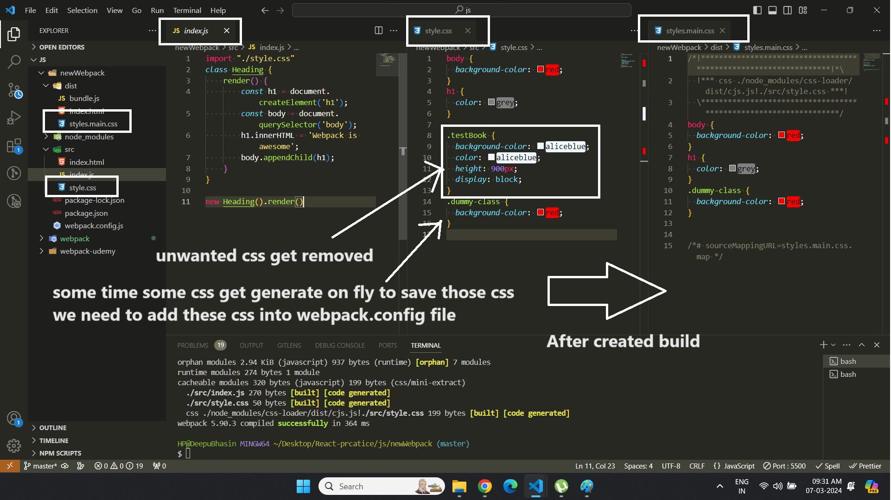
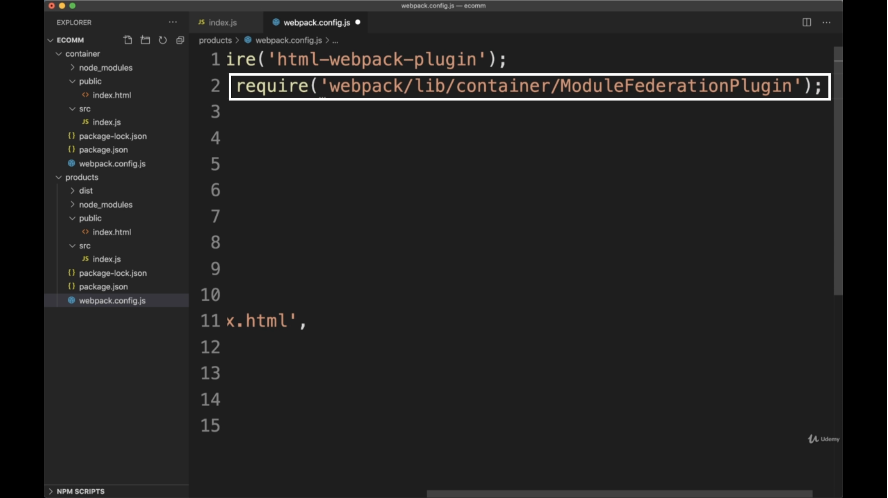
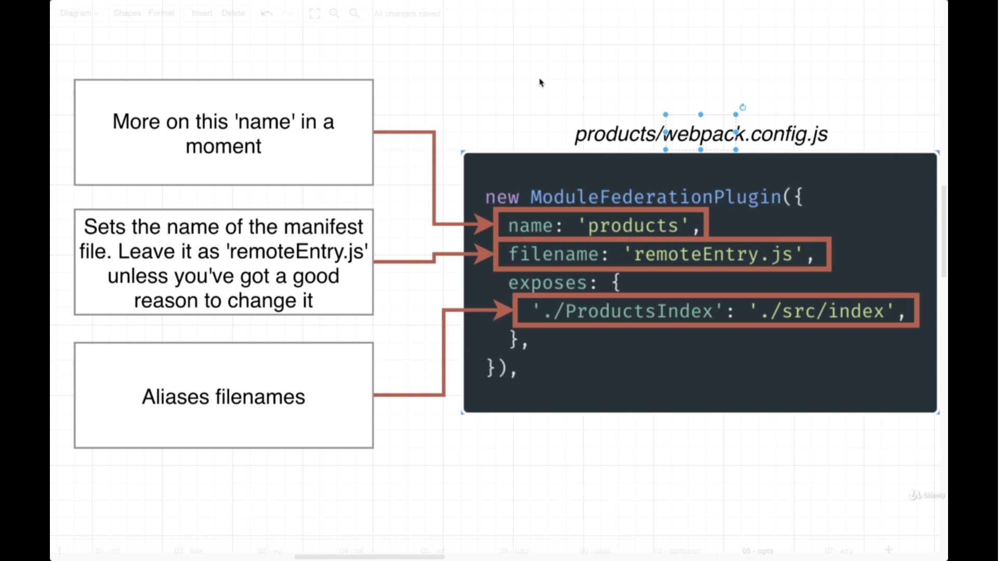

## 📘Information

* If you want more information about particular plugin you must go onto official documentation always
* Main Concept of Webpack : **Load all stuff from webpack rather than loading from different-different files in a single html file example Images, CSS files, Js Files, Json Files etc**

* Reference : [https://github.com/gauravsoni1/webpack-udemy](https://github.com/gauravsoni1/webpack-udemy)

* Make Starting point for directory : [https://github.com/vp-online-courses/webpack-optimization-starter](https://github.com/vp-online-courses/webpack-optimization-starter)

* To install in dev we use
```
npm i --save-dev <package-name>
```
* To install multiple packages

```npm
npm i --save lodash jquery validate.js toaster bootstrap
```
* Parameter : By using **"--"** sign you provide parameter
```js
"build" : "webpack --config=webpack.config.js --mode=development"
```

* Concept of ("\*\*/\*") : This is a wildcard pattern often used in file path patterns. Here's what it means:
  1. /\*\*/: Matches any directory and any subdirectories recursively. The double asterisk (**) matches zero or more directories.
  2. \*: Matches any file within those directories.

* All bundlers are using concept of common.js

```js
module.exports= {

}
```
---

## 📘Syllabus

1. Import Modules (es6 and common.js)
2. Custom Configuration
3. Asset (loading images)
4. Loaders
   1. CSS Loaders (CSS, S[AS]SS,POSTCSS)
   2. JS Loaders
5. Multiple Entry Files
6. Webpack plugins
7. Improving Browser support
8. Strategies for code splitting
9. Source Maps
10. Dev & Hot Middleware
11. Optimization (production and development builds)
    1.  Bundle analysis
    2.  Duplicating prevention
    3.  Lazy Loading
    4.  Dead code elimination
    5.  Shimming
    6.  Tree Shaking
    7.  CSS Splitting
    8.  Compressing your bundles
    9.  Optimization Images
12. Module Federation
13. Build React App using webpack
    1.  React specification Configurations
    2.  Route Management
    3.  CSS enhancement


---
## 📘How Webpack works


Webpack will locate the **index.js** file as the entry point for the project. Upon entry, it will identify files, such as JavaScript, CSS, or image files, with dependencies using **require or import statements**, while disregarding any files that are not imported into any other file. This demonstrates Webpack's intelligence in recognizing and managing dependencies within the project. After all optimizations, it will create bundle files (such as bundle.js, bundle.css). These bundle files are then used in the **index.html** file.

---


## 📘Why do we need
1. Eliminate the sequence of including javascript
2. Make Build, Js & CSS Minify & entry File
3. **Load all stuff from webpack rather than loading from different-different files in a single html file example Images, CSS files, Js Files, Json Files etc**


4. When we are loading every thing from **webpack** we have to load webpage after run **npx webpack** command

Example
```html
<!DOCTYPE html>
<html lang="en">

<head>
    <title>Document</title>
</head>

<body>
    <script src="./index.js"></script>
    <script src="./hello-world.js"></script>
</body>
</html>
```
```javascript
// hello-world.js
function helloWorld() {
    console.log('Hello world')
}
```

```javascript
//index.js
helleWorld();
```


---
## 📘 Install Package

* It require 3 things to create Structure
  * dist folder & create *index.html* file for **Entry Point**
  * src folder & create *index.js* file for **Entry Point**
  * package.json file

1. Run Commands
```
npm inti -y
```

```
npm install webpack webpack-cli --save-dev
```
* webpack-cli : its a tool which allow you to run webpack from terminal

2. Create **src Folder** and Place all js files over there
* hello-world.js

```javascript
export default function helloWorld() {
    console.log('Hello world')
}
```

* Index.js
```javascript
import helloWorld from './hello-world.js'
helloWorld();
```
3. Create **index.html** as same level of **src folder** and include only singel file

```html
<!DOCTYPE html>
<html lang="en">

<head>
    <title>Document</title>
</head>

<body>
    <script src="./src/index.js"></script>
</body>
</html>
```
4. Run command

```
npx webpack
```
* this command will create **dist** folder and create **main.js** file in it

---

## 📘Module Export/Import using Node & ES6

**By using ES6 (Import/Export)**
```js

// sum1.js
export default (function (a, b) {
    return a + b
})

// sum2.js
export default (function (a, b, c) {
    return a + b + c;
})

//index.js
import sumOfTwo from "./sum1.js";
import sumOfThere from "./sum2.js";


console.log(sumOfTwo(1, 2));
console.log(sumOfThere(1, 2, 3));

```

```html
<!-- index.html -->
<!DOCTYPE html>
<html lang="en">

<head>
    <meta charset="UTF-8">
    <meta name="viewport" content="width=device-width, initial-scale=1.0">
    <title>Document</title>
</head>

<body>
    <script type="module" src="./index.js"></script>
</body>

</html>
```
OR

```
npm install webpack webpack-cli --save-dev
```

```js
// using webpack
const path = require('path');

module.exports = {
    // entry point for webpack
    entry: './index.js',

    output: {
        // output file name
        filename: 'bundle.js',

        // it will create bundler.js file in dist folder
        path: path.resolve(__dirname, './dist')
    }
}
```

```js
//package.json
"scripts": {
    "build": "npx webpack --mode development --config webpack.config.js"
}
```
```
npm run start
```
```
cd dist/
node bundle.js
```


**By using Node.js (require)**

```js
//sum1.js
function sum(a, b) {
    return a + b
}

function multiply(a, b) {
    return a * b
}

module.exports = {
    sum,
    multiply
}

// sum.js
function sum(a, b, c) {
    return a + b + c;
}

module.exports = sum

//index.js
// no need to add ".js" because node.js understand automatically
const { sum: sumOfTwoNumber, multiply } = require("./sum1");
const sumOfThere = require("./sum2");

// Note : instead of multiple line of import you can create a index.js file where you will import all files then we will import this index.js file

console.log(sumOfTwoNumber(1, 2));
console.log(sumOfThere(1, 2, 3));
console.log(multiply(2, 2));
```
```
node index.js
```

---
# 📔Environment variable

* **Parsing Environment variable on windows**

1. By using package.json file

```json
"scripts": {
"dev": "set NODE_ENV=development && webpack --config=webpack.development.js",
"prod": "set NODE_ENV=production &&  webpack --config=webpack.production.js"
},
```

2. By using webpack.config.js file

```js
mode : "production"
// OR
mode : "development"
```

* **For any platform like window, mack, linux**

1. Package name

```
npm i cross-env
```

2. package.json

```json
"scripts": {
"dev": "cross-env NODE_ENV=development && webpack --config=webpack.development.js",
"prod": "cross-env NODE_ENV=production &&  webpack --config=webpack.production.js"
},
```


* index.js

```javascript

console.log(process.env.NODE_ENV);

if(process.env.NODE_ENV === 'development') {

}
```


## 📘Static and Dynamic loading

```js
// synchronous
import {} from "node_module";

// asynchronous
import('file.js');
```

---


## 📘Custom Configuration (Basic)
* create **webpack.config.js**
* Entry Point and Output Point


```js
// to get the absolute path, it is available in node automatically
const path = require('path');

module.exports = {
    // entry point for webpack
    entry: './src/index.js',

    output: {
         // output file name
        filename: 'bundle.js',

        // it will create bundler.js file in dist folder
        path: path.resolve(__dirname, './dist')
    },
    mode: 'none'
}
```

* Then run this command
```
npx webpack
```


**⚠️ Note :** In both development and production environments, regardless of the number of JavaScript files involved, all code will be merged into a single file specified by the output filename parameter in the configuration. For example, if the output filename parameter is set to "bundle.js", the merged JavaScript code will be saved in a file named "bundle.js


---

# 📔Loaders

1. CSS Loader (loading css files)
2. SCSS Loader (loading s[a|c]ss files)
3. JS Loader (loading js files)
4. File Loader (only loading png, svg, jpg, jpeg, gif files etc not optimizing)
5. TypeScript Loader

## 📘1. Loaders (CSS/Style)

a. Simple CSS

* It help to load that files which we cannot import using modules
* Import **CSS** Files like *SASS, LESS, Handlebars, XML* and so much
* Loaders are javascript libraries which allowed you to load all stuffs
* These loader always inject our CSS code into **style tags**

**1. Normal CSS files**

```js
const path = require('path');

module.exports = {
    entry: './src/index.js',
    output: {
        // by the way, using style loader bundles your CSS together with your javascript into a single resulting file called bundle
        filename: 'bundle.js',
        path: path.resolve(__dirname, './dist'),
    },
    mode: 'none',
    module: {
        rules: [
            {
                test: /\.css$/,
                use: [
                    //Then second the style loader takes the CSS and inject it into the page using style tags
                    'style-loader',

                    //first the css loader reads the contents of the css file and return this contents, but it doesn't do anything  else with this css
                    'css-loader'
                ]
            }
        ]
    }
}
```
⚠️ **Note:**
* Loader always load from **right to left**
* When we were using asset modules **'asset/source'**, we didn't have to install any additional NPM packages because Webpack include asset modules out of the box
* On the other hand, when using **loaders** we need to install them **explicitly**, Every Webpack loader comes as NPM package that you can add as a dependency to your application, so in this case we have to add loaders
   1. CSS Loaders
   2. Styles Loaders

```
npm install css-loader style-loader --save-dev
```

2. hello-world-button.css

```css
.hello-world-button{
    font-size: 20px;
    padding :7px 15px;
    background: green;
    color: white;
    outline: none;
}

.hello-world-text {
    color : green;
    font-weight: bold;
}
```

3. hello-world-button.js

```js
import "./hello-world-button.css"

class HelloWorldButton {
    render() {
        const button = document.createElement('button');
        button.innerHTML = 'Hello World';
        button.classList.add('hello-world-button')
        button.onclick = function () {
            const p = document.createElement('p');
            p.innerHTML = 'Hello World';
            p.classList.add('hello-world-text');
            body.appendChild(p);
        }
        const body = document.querySelector('body');
        body.appendChild(button);
    }
}

export default HelloWorldButton
```
4. index.js

```js
import HelloWorldButton from './components/hello-world-button'

const helloWorldButton = new HelloWorldButton();
helloWorldButton.render();
```

5. Command

```
npx webpack
```


**b. Module CSS**

**1. By Using CSS-Loader**

1. Webpack

```js
const path = require('path');

module.exports = {
    entry: './src/index.js',
    output: {
        filename: 'bundle.js',
        path: path.resolve(__dirname, './dist'),
    },
    mode: 'none',
    module: {
        rules: [
            {
                test: /\.css$/,
                use: [
                    {
                        loader: 'style-loader'
                    },
                    {
                        // this option enable to load css as module
                        loader: 'css-loader', options: { modules: true }
                    }
                ]
            }
        ]
    }
}
```

2. clearButton.css

```css
button {
  background-color: yellow;
}

.button {
  background-color: red;
}

```

3. clearButton.js

```js
import style from "./clearButton.css";

export default function renderTestButton() {
    const el = document.createElement("button");
    el.classList.add([`${style.button}`])
    el.innerHTML = "clear";
    el.onclick = function () {
        alert("clear button")
    }
    document.body.appendChild(el);
}
```
4. index.js

```js
import renderTestButton from "./clearButton"

renderTestButton();
```

5. index.html

```html
<!DOCTYPE html>
<html lang="en">

<head>
    <title>Document</title>
    <link rel="stylesheet" href="./dist/styles.css">
</head>

<body>
    <h1 class="header">Hey this is webpack</h1>
    <button class="button">Click Me</button>
    <script src="./dist/bundle.js"></script>
</body>

</html>
```
6. Package.json
```json
"scripts": {
    "build": "webpack --mode development --config=webpack.config.js"
},
```


**2. By Using MiniCssExtractPlugin (best one)**

1. webpack.config.js

```js
const path = require("path");
const MiniCssExtractPlugin = require('mini-css-extract-plugin');

module.exports = {
    entry: path.resolve(__dirname, "./src/index.js"),
    output: {
        filename: "bundle.js",
        path: path.resolve(__dirname, "dist"),
        clean: true
    },
    module: {
        rules: [
            {
                // for loading normal css
                test: /\.css$/,
                exclude: /\.module\.css$/,
                use: ['style-loader', 'css-loader']
            },
            {
                // for loading module css
                test: /\.module\.css$/,
                use: [
                    MiniCssExtractPlugin.loader,
                    {
                        loader: 'css-loader',
                        options: {
                            modules: {
                                // for production mode
                                // localIdentName: '[hash:base64]'

                                // for development mode
                                localIdentName: '[local]--[md4:hash:7]'
                            }
                        }
                    }
                ]
            },
        ]
    },
    plugins: [
        new MiniCssExtractPlugin({
            filename: 'styles.css',
        })
    ]
};
```

2. clearButton.module.css

```css
button {
  background-color: yellow;
}

.button {
  background-color: red;
}
```

3. clearButton.js

```js
import style from "./clearButton.module.css";

export default function renderTestButton() {
    const el = document.createElement("button");
    el.classList.add([`${style.button}`])
    el.innerHTML = "clear";
    el.onclick = function () {
        alert("clear button")
    }
    document.body.appendChild(el);
}
```

**⚠️Note :** you can load other css/sass into another css/sass files by using

1. For CSS
```css
@import url("./path/to/css/file.css");
```

2. For SASS

```css
@import "./path/to/scss/file.scss";
```


## 📘2. Loaders (SCSS/SASS)

* Command to install package

```
npm install sass-loader sass --save-dev
```

* only this code is change rest of the above code is same
```scss
// hello-world-button.scss
$font-size : 20px;
$background-color : green;
$button-font-color: white;
$text-font-color :red;

.hello-world-button {
    font-size: $font-size;
    padding: 7px 15px;
    background: $background-color ;
    color: $button-font-color;
    outline: none;
}

.hello-world-text {
    color: $text-font-color;
    font-weight: bold;
}
```

* Webpack File

```js
const path = require('path');

module.exports = {
    entry: './src/index.js',
    output: {
        filename: 'bundle.js',
        path: path.resolve(__dirname, './dist'),
    },
    mode: 'none',
    module: {
        rules: [
            {
                test: /\.css$/,
                use: ['style-loader', 'css-loader']
            },
            {
                // load scss/sass file
                test: /\.s[ac]ss$/,
                // loader will load from right to left
                use: ['style-loader', 'css-loader', 'sass-loader']
            }
        ]
    }
}
```

## 📘3. Loader (JS)
* by default **we don't** need any loader to load JS files
* But If we to add latest feature of javascript on not fully advanced browsers in that case we use JS loader called **babel**.
* It is compiler which convert Latest javascript code into browser compatible.

* Command to install packages

```
npm install @babel/core babel-loader @babel/preset-env @babel/plugin-proposal-class-properties --save-dev
```

* Webpack.config.js File
```js
const path = require('path');

module.exports = {
    entry: './src/index.js',
    output: {
        filename: 'bundle.js',
        path: path.resolve(__dirname, './dist'),
    },
    mode: 'none',
    module: {
        rules: [
            {
                test: /\.js$/,
                exclude: /node_modules/,
                use: {
                    loader: 'babel-loader',
                    options: {
                        // convert ES1-N => ES5 , support all latest features of ES6
                        presets: ['@babel/env'],

                        // Load all Latest JS Class features
                        plugins: ['@babel/plugin-proposal-class-properties']

                    }
                }
            }
        ]
    }
}
```
* hello-world-button.js

```js
import "./hello-world-button.scss"

class HelloWorldButton {
    render() {
        this.buttonCssClass = 'hello-world-text';
        const button = document.createElement('button');
        button.innerHTML = 'Hello World';
        button.classList.add('hello-world-button')
        button.onclick = function () {
            const p = document.createElement('p');
            p.innerHTML = 'Hello World';
            p.classList.add(this.buttonCssClass);
            body.appendChild(p);
        }
        const body = document.querySelector('body');
        body.appendChild(button);
    }
}

export default HelloWorldButton
```

## 📘4. Loader (File Loader (png, svg, jpg, gif files etc))

1. Command
```
npm install file-loader
```

2. webpack.config.js

```js
const path = require('path');
const { CleanWebpackPlugin } = require('clean-webpack-plugin');
const HtmlWebpackPlugin = require('html-webpack-plugin');

module.exports = {
    mode: 'none',
    entry: './src/work.js',
    output: {
        filename: 'bundle.js',
        path: path.resolve(__dirname, './dist/'),
        publicPath: './',
    },
    module: {
        rules: [
            {
                test: /\.(png|svg|jpg|gif|tiff)$/,
                use: ['file-loader']
            }
        ]
    },
    plugins: [
        new CleanWebpackPlugin(),
        new HtmlWebpackPlugin({
            title: 'Hello World',
            filename: 'index.html',
            user: 'Admin',
            template: './index.html',
            // to minify the output of file
            minify : false
        })
    ]
}
```

3. Work.js

```js
// any random file
import wok from "./download.png"

class WorkImage {
    render() {
        const img = document.createElement('img');
        img.src = wok;
        img.alt = "Work Image";
        const bodyDomElement = document.querySelector('body');
        bodyDomElement.appendChild(img);
    }
}
export default WorkImage;
```

4. index.html

```html
<!DOCTYPE html>
<html lang="en">

<head>
    <meta charset="UTF-8">
    <meta name="viewport" content="width=device-width, initial-scale=1.0">
    <title>
        <%= htmlWebpackPlugin.options.title %>
    </title>
</head>

<body>
    <h1>Hello <%= htmlWebpackPlugin.options.user %>
    </h1>
</body>

</html>
```
5. Command

```
npx webpack
```


---

## 📘5.Typescript Loader

* Helps to catch more bugs at **compile type**

1. Packages names

```
npm i @babel/preset-typescript @babel/core @babel/preset-env typescript
```

2. webpack.config.js

```js
const path = require('path');

module.exports = {
    entry: './src/index.js',
    output: {
        filename: 'bundle.js',
        path: path.resolve(__dirname, './dist'),
    },
    resolve: {
        // this will help you the check import file extensions
        extensions: [".ts", ".js"]
    },
    module: {
        rules: [
            {
                // this rule is for javascript and typescript
                test: /\.(ts|js)$/,
                exclude: /node_modules/,
                use: {
                    loader: 'babel-loader',
                    options: {
                        presets: [
                            '@babel/env',

                            // this babel loader will help to execute typescript file
                            "@babel/preset-typescript"
                        ],
                    }
                }
            }
        ]
    }
}
```

3. tsconfig.json

```json
{
  "compilerOptions": {
    "module": "ES2015",
    "target": "ES2015",
    "noImplicitAny": true,
    "noUnusedParameters": true
  },
  "include": ["src/**/*"],
  "exclude": ["/node_modules", "dist"]
}
```
4. package.json

```js
// here we are only checking files not emitting
"scripts": {
    "dev": "webpack --config=webpack.development.js",
    "prod": "webpack --config=webpack.production.js",
    "typecheck": "tsc --noEmit"
},
```

5. utils.ts

```js
export function sum(num1: number, num2: number) {
  return num1 + num2;
}
```

6. index.js

```js
import { sum } from "./utils.ts"
console.log(sum(1, 2));
```

7. index.html

```html
<!DOCTYPE html>
<html lang="en">

<head>
    <title>Document</title>
</head>

<body>
    <script src="./dist/bundle.js"></script>
</body>

</html>
```

---

## 📔CSS-in-JS

* This will allow you to write **CSS** code into **JS** like **Material UI**


## 📘1.By Using JSS :

* this will allow you write css in js and need **some presets**

**Advantages**

* No class name collision
* Business Logic and styles for your components can live together
* Styles can depend on javascript variables (like we can use styles variables in if-else conditions)

**Disadvantages**

* bundle size (here you will get so much larger size because all css will merge into js file) , you can code splitting and lazy loading
* you can't cache your javascript and CSS separately
* Performance

1. Packages

```
npm install jss-preset-default jss
```
2. index.html

```html
<!DOCTYPE html>
<html lang="en">

<head>
    <title>Document</title>
    <link rel="stylesheet" href="./dist/styles.css">
</head>

<body>
    <script src="./dist/bundle.js"></script>
</body>

</html>
```

3. infoButton.js
```js
import jss from "jss";
import preset from "jss-preset-default";

jss.setup(preset())

const jssStyles = {
    button: {
        backgroundColor: "skyBlue",
        border: "none",
        color: "white",
        fontSize: "15px",
        borderRadius: "3px",
        padding: "5px",
        cursor: "pointer",
        margin: "3px"
    }
}

const { classes } = jss.createStyleSheet(jssStyles).attach()


export default function renderInfoButton() {
    const el = document.createElement("button");
    el.classList.add([`${classes.button}`])
    el.innerHTML = "Clear";
    el.onclick = function () {
        alert("Clear button")
    }
    document.body.appendChild(el);
}
```
4. SuccessButton.js

```js
import jss from "jss";
import preset from "jss-preset-default";

jss.setup(preset())

const jssStyles = {
    button: {
        backgroundColor: "lightgreen",
        border: "none",
        color: "white",
        fontSize: "15px",
        borderRadius: "3px",
        padding: "5px",
        cursor: "pointer",
        margin: "3px"
    }
}

const { classes } = jss.createStyleSheet(jssStyles).attach()


export default function renderSuccessButton() {
    const el = document.createElement("button");
    el.classList.add([`${classes.button}`])
    el.innerHTML = "Success";
    el.onclick = function () {
        alert("Success button")
    }
    document.body.appendChild(el);
}
```

5. index.js

```js
import renderInfoButton from "./InfoButton";
import renderSuccessButton from "./SuccessButton";

renderSuccessButton();
renderInfoButton();
```

6. webpack.config.js

```js
const path = require("path");

module.exports = {
    entry: path.resolve(__dirname, "./src/index.js"),
    output: {
        filename: "bundle.js",
        path: path.resolve(__dirname, "dist"),
        clean: true
    }
};
```


 ## 📘2.By Using Emotion :

 this will allow you write css easily **without any presets, no babel configuration or any other configuration**

There are two types

* By using Framework Agnostic (without frame work)
* By using react Framework


1. Packages

```
npm install --save @emotion/css
```

2. index.html

```html
<!DOCTYPE html>
<html lang="en">

<head>
    <title>Document</title>
    <link rel="stylesheet" href="./dist/styles.css">
</head>

<body>
    <script src="./dist/bundle.js"></script>
</body>

</html>
```
3. infoButton.js
```js
import { css } from "@emotion/css"

const button = css`
    background-color: skyBlue;
    border: none;
    color: white;
    font-size: 15px;
    border-radius: 3px;
    padding: 5px;
    cursor: pointer;
    margin: 3px`;


export default function renderInfoButton() {
    const el = document.createElement("button");
    el.classList.add([`${button}`])
    el.innerHTML = "Clear";
    el.onclick = function () {
        alert("Clear button")
    }
    document.body.appendChild(el);
}
```

4. SuccessButton.js

```js
import { css } from "@emotion/css"

const button = css`
    background-color: lightGreen;
    border: none;
    color: white;
    font-size: 15px;
    border-radius: 3px;
    padding: 5px;
    cursor: pointer;
    margin: 3px`;


export default function renderSuccessButton() {
    const el = document.createElement("button");
    el.classList.add([`${button}`])
    el.innerHTML = "Success";
    el.onclick = function () {
        alert("Success button")
    }
    document.body.appendChild(el);
}
```
5. index.js

```js
import renderInfoButton from "./InfoButton";
import renderSuccessButton from "./SuccessButton";

renderSuccessButton();
renderInfoButton();
```
6. webpack.config.js

```js
const path = require("path");

module.exports = {
    entry: path.resolve(__dirname, "./src/index.js"),
    output: {
        filename: "bundle.js",
        path: path.resolve(__dirname, "dist"),
        clean: true
    }
};
```


---

# 📔Assets (loading of image/ font)

* There are four types of assets
1. asset/resource : use when importing large files
2. asset/inline : use when importing small files
3. asset : webpack decide automatically select one from above conditions ( condition : asset/resource > 10 kilobytes > asset/inline )
4. asset/source : Read the string and injects that string directly into javascript bundles

## 📘1. Importing Image through webpack (Asset/Resource) + font family

1. Write rules in webpack (because webpack cannot understand the image files)

```js
const path = require('path');

module.exports = {
    entry: './src/index.js',
    output: {
        filename: 'bundle.js',
        path: path.resolve(__dirname, './dist')

        // export into particular folder
        assetModuleFilename: "images/[hash][ext]",

        // this parameter will automatically delete all files and images from build folder which are not in use
        clean: true
    },
    mode: 'none',

    // adding rules for loading images
    module: {
        rules: [
            {
                // loading font families
                test: /\.(ttf | woff | woff2)$/,
                type: 'asset/resource'

            },
            {
                // loading png or jpg files
                test: /\.(png|jpg|svg)$/,
                type: 'asset/resource'
            }
        ]
    }
}
```
2. writing a function for importing image file (add-images.js)

```js
import work from "./wok.jpg";

function addImage() {
    const img = document.createElement('img');
    img.alt = 'Work';
    img.width = 300;
    img.src = work;
    const body = document.querySelector('body');
    body.appendChild(img);
}

export default addImage;
```

3. importing files

```js
import helloWorld from './hello-world.js'
import addImage from "./add-image.js"

helloWorld();
addImage();
```

4. Run Command

```
npx webpack
```

5. You will get out put in **dist folder** with **bundle.js** and **ff034541606f59c6b4e5.jpg** (some random name)

**⚠️ Note :**

**PublicPath Option**

1. Adding Specific Folder
* this is use to load image from specific path like **local Path**, **CDN Path**
* this features only works in **webpack5**
```js
output: {
    filename: 'bundle.js',
    path: path.resolve(__dirname, './dist'),

    // this is use to get the file from particular folder
    publicPath: './dist/'
}
```


2. Adding CDN Link
* this link will **append to every images which will generated from webpack**
```js
// For CDN link
publicPath: 'https://some-random-url.com/'
```


## 📘2. Importing Image through webpack (Asset/Inline)
* Like Importing File like **base64**
* Main disadvantage is that it will **increase** js file size
* Main Advantage is that if the sizes if Normal images are very large our web page will make a **http request** to load images which is very expensive so converting into **base64** will save our **http request**

```js
const path = require('path');

module.exports = {
    entry: './src/index.js',
    output: {
        filename: 'bundle.js',
        path: path.resolve(__dirname, './dist'),
    },
    mode: 'none',
    module: {
        rules: [
            {
                test: /\.(png|jpg)$/,
                // creating base 64 images file
                type: 'asset/inline'
            }
        ]
    }
}
```


## 📘3. Importing Image through webpack (Asset)
* webpack decide automatically and select one option from above conditions
* ( condition : asset/resource > 10 kilobytes > asset/inline )

```js
const path = require('path');

module.exports = {
    entry: './src/index.js',
    output: {
        filename: 'bundle.js',
        path: path.resolve(__dirname, './dist'),
    },
    mode: 'none',
    module: {
        rules: [
            {
                test: /\.(png|jpg)$/,
                // asset type
                type: 'asset',
            }
        ]
    }
}
```

* Make condition for loading converting image up to a particular condition

```js
const path = require('path');

module.exports = {
    entry: './src/index.js',
    output: {
        filename: 'bundle.js',
        path: path.resolve(__dirname, './dist'),
    },
    mode: 'none',
    module: {
        rules: [
            {
                test: /\.(png|jpg)$/,
                type: 'asset',

                // Making condition
                 parser: {
                    dataUrlCondition: {
                        maxSize: 10 * 1024
                    }
                },
                // this parameter is use for generating output file into a particular folder
                generator: {
                    filename: "./images/[name].[contenthash:12][ext]"
                }
            }
        ]
    }
}
```
## 📘4. Importing Image through webpack (Asset Source)
* Asset source reads the contents of the file into a Javascript String and injects that string directly into the javascript bundle as is without any modifications similarly to asset in line
* This type of asset module doesn't generate any file in the output directory
* **Below we are reading text file**

1. Create **text** file
```js
// work.txt
Work image file
```

2. Webpack File

```js
const path = require('path');

module.exports = {
    entry: './src/index.js',
    output: {
        filename: 'bundle.js',
        path: path.resolve(__dirname, './dist'),
    },
    mode: 'none',
    module: {
        rules: [
            {
                test: /\.(png|jpg)$/,
                type: 'asset',
            },
            {
                test: /\.txt/,
                type: 'asset/source'
            }
        ]
    }
}
```
3. Command
```
npx webpack
```


---

# 📔Other Features


## 📘1. Multiple Entry Points
* mostly use where you have multiple html pages like home, about, contact us etc.
* Not use in frontEnd Frameworks like react, angular, vue etc

```js
const path = require('path');
const HtmlWebpackPlugin = require('html-webpack-plugin');

module.exports = {
    entry: {
        indexFile: path.resolve(__dirname, "./src/index.js"),
        productsFile: path.resolve(__dirname, "./src/products.js"),
    },
    output: {
        // [name] is a variable, these are the key names of entry object
        filename: './[name].bundle.js',
        path: path.resolve(__dirname, './dist'),
        clean: true
    },
    mode: 'none',
    plugins: [
        // instance of creating html file
        new HtmlWebpackPlugin({
            template: path.resolve(__dirname, "src/index.html"),
            // basically entry files
            chunks: ["indexFile"],
            inject: true,
            filename: "index.html"
        }),
        new HtmlWebpackPlugin({
            template: path.resolve(__dirname, "src/products.html"),
            // basically entry files
            chunks: ["productsFile"],
            inject: true,
            filename: "products.html"
        }),
    ]
}
```


---


# 📔Plugins

* Plugins are additional javascript libraries that do everything that loaders cannot do.
* Plugins can also modify how the bundles themselves are created. For Example, **uglifyJSplugin** takes the bundle.js and minimize the contents to decrease the bundle size.
* You can add other various **plugins from webpack official website**


## 📘1. Minification Plugin (for javascript)
* if the javascript files size is less hence your websites will load fast.
* if you have mobile uses then your website is crucial for them
* Less size website consume less internet traffic

* **TerserPlugin :** this plugin is use to reduce the size of **bundle.js**


1. Packages

```
npm install terser-webpack-plugin
```

2. webpack.config.js
```js
const path = require('path');

// Loading terser-webpack-plugin plugin, this is inbuilt in webpack 5 otherwise we have to install separately
const TerserPlugin = require('terser-webpack-plugin');

module.exports = {
    entry: './src/index.js',
    output: {
        filename: 'bundle.js',
        path: path.resolve(__dirname, './dist'),
    },
    mode: 'none',
    module: {
        rules: [
            {
                test: /\.css$/,
                use: ['style-loader', 'css-loader']
            },
            {
                test: /\.scss$/,
                use: ['style-loader', 'css-loader', 'sass-loader']
            }
            ]
    },
    plugins: [
        new TerserPlugin()
    ]
}
```

2. Run Command

```
npx webpack
```

## 📘2. MiniCssExtractPlugin (with single File for css)
* Use to Extract our CSS into a separate File with minify version
* It also remove duplicate files
* If some of files using same css file it will create into a single common file so every one can use
* This will create a single file where it will put all css code into single file, but in **css-loader & style-loader** it will inject css code into style according to files.

1. Command for install package

```
npm install mini-css-extract-plugin --save-dev
```

2. webpack.config.js

```js
const path = require('path');
const TerserPlugin = require('terser-webpack-plugin');
const MiniCssExtractPlugin = require('mini-css-extract-plugin');

module.exports = {
    entry: './src/index.js',
    output: {
        filename: 'bundle.js',
        path: path.resolve(__dirname, './dist'),
    },
    mode: 'none',
    module: {
        rules: [
            {
                test: /\.css$/,

                // loading MiniCssExtractPlugin style loader instead of normal Loader, basically all loaders will inject into MiniCSS file
                use: [MiniCssExtractPlugin.loader, 'css-loader']
            },
            {
                test: /\.scss$/,

                // loading MiniCssExtractPlugin style loader instead of normal Loader, basically all loaders will inject into MiniCSS file
                use: [MiniCssExtractPlugin.loader, 'css-loader', 'sass-loader']
            },
            {
                test: /\.js$/,
                exclude: /node_modules/,
                use: {
                    loader: 'babel-loader',
                    options: {
                        presets: ['@babel/env'], // convert ES1-N => ES5 , support all latest features of ES6
                        plugins: ['@babel/plugin-proposal-class-properties']

                    }
                }
            }
        ]
    },
    plugins: [
        new TerserPlugin(),
        // loading MiniCssExtractPlugin Class
        new MiniCssExtractPlugin({

            // Making output file name
            filename: 'styles.css',

            //or
            //filename: "[name].css",
        })
    ]
}
```

## 📘3. MiniCssExtractPlugin (with double Files for css)
* Create Two separate files for **js and css**
* When we **build**, all **CSS** code goes into **style.css** and all **js** code goes into **bundle.js**

1. webpack.config.js (same code above one)
2. hello-world-button.js & hello-world-button.css (same code above one)
3. heading.js

```js
import './heading.css';

class Heading {
    render() {
        const h1 = document.createElement('h1');
        const body = document.querySelector('body');
        h1.innerHTML = 'Webpack is awesome';
        body.appendChild(h1);
    }
}
export default Heading;
```

4. heading.css

```css
h1 {
    color:  grey;
}
```
5. Run build Command

```
npx webpack
```


## 📘4.Compressing and Removing duplicate css code (best one)
* To remove compress and duplicate css we use **CssMinimizerPlugin**

* Package command
```
npm i css-minimizer-webpack-plugin
```

* Webpack.config.js

```js
const path = require("path");
const MiniCssExtractPlugin = require('mini-css-extract-plugin');
const CssMinimizerPlugin = require("css-minimizer-webpack-plugin");

module.exports = {
    entry: path.resolve(__dirname, "./src/index.js"),
    output: {
        filename: "bundle.js",
        path: path.resolve(__dirname, "dist"),
        clean: true
    },
    optimization: {
        // this is use to use other minimizer as well, otherwise it is disabling js minimizers
        '...',
        minimize: true,
        minimizer: [
            new CssMinimizerPlugin({
                minimizerOptions: {
                    preset: [
                        'default',
                        {
                            discardComments: {
                                removeAll: true
                            }
                        }
                    ]
                }
            })
        ],
    },
    module: {
        rules: [
            {
                // for loading normal css
                test: /\.css$/,
                exclude: /\.module\.css$/,
                use: ['style-loader', 'css-loader']
            },
            {
                // for loading module css
                test: /\.module\.css$/,
                use: [
                    MiniCssExtractPlugin.loader,
                    {
                        loader: 'css-loader',
                        options: {
                            modules: {
                                // for production mode
                                // localIdentName: '[hash:base64]'

                                // for development mode
                                localIdentName: '[local]--[md4:hash:7]'
                            }
                        }
                    }
                ]
            },
        ]
    },
    plugins: [
        new MiniCssExtractPlugin({
            filename: 'styles.css',
        })
    ]
};
```

* clearButton.js

```js
import style from "./clearButton.module.css";

export default function renderTestButton() {
    const el = document.createElement("button");
    el.classList.add([`${style.button}`])
    el.innerHTML = "clear";
    el.onclick = function () {
        alert("clear button")
    }
    document.body.appendChild(el);
}
```

* clearButton.module.css

```css
button {
  background-color: yellow;
  background-color: yellow;
  background-color: yellow;
  background-color: yellow;
}
.button {
  background-color: red;
}
```

* index.js

```js
import renderTestButton from "./clearButton"

renderTestButton();
```

* index.html

```html
<!DOCTYPE html>
<html lang="en">

<head>
    <title>Document</title>
    <link rel="stylesheet" href="./dist/styles.css">
</head>

<body>
    <h1 class="header">Hey this is webpack</h1>
    <button class="button">Click Me</button>
    <script src="./dist/bundle.js"></script>
</body>

</html>
```


---

## 📘5. CopyPlugin
* This plugin is used to copy stuff from **source folder** to **dist folder**

* Command
```
npm i --save-dev copy-webpack-plugin
```

* webpack

```js
const path = require('path');
const HtmlWebpackPlugin = require('html-webpack-plugin');
const CopyPlugin = require("copy-webpack-plugin");

module.exports = {
    entry: './src/index.js',
    output: {
        filename: 'bundle.js',
        path: path.resolve(__dirname, './dist'),
        clean: true
    },
    plugins: [
        new HtmlWebpackPlugin({
            filename: 'index.html',
            template: path.resolve(__dirname, "src/index.html"),
            inject: true
        }),
        new CopyPlugin({
            patterns: [
                {
                    // don't use "./" here
                    from: path.resolve(__dirname, "src/images"),
                    to: path.resolve(__dirname, "dist/images")
                },
                {
                    from: path.resolve(__dirname, "src/assets"),
                    to: path.resolve(__dirname, "dist/assets")
                }
            ]
        })
    ]
}
```


---


## 📘6. Cleaning Dist Folder Before Generating New Bundle (best one)

1. Command to install Package
```
npm install clean-webpack-plugin
```

2. webpack.config.js

* by using **mini-css-extract-plugin** Plugin
* This is best option then other
```js
const path = require('path');
const TerserPlugin = require('terser-webpack-plugin');
const MiniCssExtractPlugin = require('mini-css-extract-plugin');

// package
const { CleanWebpackPlugin } = require('clean-webpack-plugin');
module.exports = {
    entry: './src/index.js',
    output: {
        filename: 'bundle.[contenthash].js',

        // this is our default folder which will delete while cleaning files
        path: path.resolve(__dirname, './dist'),
    },
    mode: 'none',
    module: {
        rules: [
            {
                test: /\.css$/,
                use: [MiniCssExtractPlugin.loader, 'css-loader']
            },
            {
                test: /\.scss$/,
                use: [MiniCssExtractPlugin.loader, 'css-loader', 'sass-loader']
            },
            {
                test: /\.js$/,
                exclude: /node_modules/,
                use: {
                    loader: 'babel-loader',
                    options: {
                        presets: ['@babel/env'], // convert ES1-N => ES5 , support all latest features of ES6
                        plugins: ['@babel/plugin-proposal-class-properties']

                    }
                }
            }
        ]
    },
    plugins: [
        new TerserPlugin(),
        new MiniCssExtractPlugin({
            filename: 'styles[contenthash].css',
        }),

        // creating instance for cleaning webpack
        new CleanWebpackPlugin()
    ]
}
```
* By using **clean:true** parameter in **output** Object, but will work in greater than **5.20** version of webpack
* Not very useful

```js
output: {
    filename: 'bundle.[contenthash].js',
    path: path.resolve(__dirname, './dist'),

    //just add this line
    clean: true
}
```

## 📘7. Generating HTML Files Automatically During Webpack Build Process

* This **html-webpack-plugin** plugin is use to create html file with adding newly generated files (with random names) of **js** or **css** automatically.
* It will create a new **index.html** file in **dist folder** (because we have mention about dist folder)


1. webpack.config.js

```js
const path = require('path');
const TerserPlugin = require('terser-webpack-plugin');
const MiniCssExtractPlugin = require('mini-css-extract-plugin');
const { CleanWebpackPlugin } = require('clean-webpack-plugin');

// Plugin to create html file
const HtmlWebpackPlugin = require('html-webpack-plugin');

module.exports = {
    entry: './src/index.js',
    output: {
        filename: 'bundle.[contenthash].js',

        // Output file folder
        path: path.resolve(__dirname, './dist/'),

        // Adding directory in file
        publicPath: './'
    },
    mode: 'none',
    module: {
        rules: [
            {
                test: /\.css$/,
                use: [MiniCssExtractPlugin.loader, 'css-loader']
            },
            {
                test: /\.scss$/,
                use: [MiniCssExtractPlugin.loader, 'css-loader', 'sass-loader']
            },
        ]
    },
    plugins: [
        new TerserPlugin(),
        new MiniCssExtractPlugin({
            filename: 'styles[contenthash].css',
        }),
        new CleanWebpackPlugin(),

        // instance of creating html file
        new HtmlWebpackPlugin()
    ]
}
```
2. Command

```
npx webpack
```


* For Various Options to create HTML File

1. Setting Filename and Title
```js
 new HtmlWebpackPlugin({
    // to add titles
    title : 'Hello World',
    // output file name
    filename :'custom_filename.html',
    meta : {
        description: 'Some Description'
    }
 })

```
⚠️ Note : you can check various other options on internet

---
## 📘8. Integration with Template

* With **webpack** (best one)
1. webpack.config.js

```js
const path = require('path');
const { CleanWebpackPlugin } = require('clean-webpack-plugin');
const HtmlWebpackPlugin = require('html-webpack-plugin');

module.exports = {
    mode: 'none',
    // it just empty file
    entry: './src/index.js',
    output: {
        filename: 'bundle.js',
        path: path.resolve(__dirname, './dist/'),
        publicPath: './'
    },
    plugins: [
        new CleanWebpackPlugin(),
        new HtmlWebpackPlugin({
            title: 'Hello World',
            filename: 'index.html',
            user: 'Admin',
            template: './index.html'
        })
    ]
}
```
2. index.html

```html
<!DOCTYPE html>
<html lang="en">

<head>
    <meta charset="UTF-8">
    <meta name="viewport" content="width=device-width, initial-scale=1.0">
    <title>
        <!-- Adding Dynamic Content to html using webpack -->
        <%= htmlWebpackPlugin.options.title %>
    </title>
</head>

<body>
    <!-- Adding Dynamic Content to html using webpack -->
    <h1>Hello <%= htmlWebpackPlugin.options.user %>
    </h1>
</body>

</html>
```

3. command

```
npx webpack
```


* With **Handlebars**


Handlebars

* Handlebars is a template engine for javascript that allows you to separate the business login from presentation.
* If you find yourself generating HTML inside your javascript then probably need some kind of a template engine

1. Create HandleBar file **index.hbs** (file saved in src folder in our example)

```html
<!DOCTYPE html>
<html>

<head>
    <meta charset="utf-8">
    <title>{{htmlWebpackPlugin.options.title}}</title>
    <meta name="viewport" content="width=device-width, initial-scale=1">
</head>

<body>
    <h1>{{htmlWebpackPlugin.options.heading}}</h1>
</body>

</html>
```

2. webpack.config.js

```js
const path = require('path');
const TerserPlugin = require('terser-webpack-plugin');
const MiniCssExtractPlugin = require('mini-css-extract-plugin');
const { CleanWebpackPlugin } = require('clean-webpack-plugin');
const HtmlWebpackPlugin = require('html-webpack-plugin');

module.exports = {
    entry: './src/index.js',
    output: {
        filename: 'bundle.[contenthash].js',
        path: path.resolve(__dirname, './dist/'),
        publicPath: './'
    },
    mode: 'none',
    module: {
        rules: [
            {
                test: /\.css$/,
                use: [MiniCssExtractPlugin.loader, 'css-loader']
            },
            {
                test: /\.scss$/,
                use: [MiniCssExtractPlugin.loader, 'css-loader', 'sass-loader']
            },
            {
                test: /\.js$/,
                exclude: /node_modules/,
                use: {
                    loader: 'babel-loader',
                    options: {
                        presets: ['@babel/env'], // convert ES1-N => ES5 , support all latest features of ES6
                        plugins: ['@babel/plugin-proposal-class-properties']

                    }
                }
            },
            {
                //Adding handling handle for a Handlebar File
                test: /\.hbs$/,
                use: ['handlebars-loader']
            }
        ]
    },
    plugins: [
        new TerserPlugin(),
        new MiniCssExtractPlugin({
            filename: 'styles[contenthash].css',
        }),
        new CleanWebpackPlugin(),

        new HtmlWebpackPlugin({
            // take template file from this folder
            template: './src/index.hbs',

            // variable name
            title: 'Hello World',

            // variable name
            heading: 'Hello Deepinder Singh'
        })
    ]
}
```
3. Command

```
npx webpack
```


---

## 📘Production Vs Development Builds

* Usually production builds require a different setup than development builds in production
* In Production, we want our website to be fast as possible and our bundles should be as small as possible
* On the other hand, during development we often want to see an additional information inside our javascript code like for example source maps and other stuff

1. webpack.config.js
```js
// to set mode
module.exports = {
    mode: 'production',
}


// OR

"scripts": {
    "build": "webpack --mode=development",
    "dev": "webpack --mode=production"
  },


```
* You us need to add **mode** option, and various options are
  * none
  * development
  * production

⚠️ **Note :
* ** when we use **production mode** our bundle get automatically minified  and in **Development mode** our files get remain same as written.
* In **Production mode** by default **TerserPlugin** is already installed

2. Js file

```js
// to Print variable
if (process.env.NODE_ENV === 'production') {
    console.log('Production Mode');
} else if (process.env.NODE_ENV === 'development') {
    console.log('Development Mode');
} else if (process.env.NODE_ENV === 'none') {
    console.log('None Mode');
} else {
    console.log('No mode');
}
```

Example

* for Development file : **webpack.dev.config**

```js
const path = require('path');
const { CleanWebpackPlugin } = require('clean-webpack-plugin');
const HtmlWebpackPlugin = require('html-webpack-plugin');

module.exports = {
    mode: 'development',
    entry: './src/index.js',
    output: {
        filename: 'bundle.js',
        path: path.resolve(__dirname, './dist/'),
        publicPath: './'
    },
    module: {
        rules: [
            {
                test: /\.css$/,
                use: ['style-loader', 'css-loader']
            },
            {
                test: /\.scss$/,
                use: ['style-loader', 'css-loader', 'sass-loader']
            },
            {
                test: /\.js$/,
                exclude: /node_modules/,
                use: {
                    loader: 'babel-loader',
                    options: {
                        presets: ['@babel/env'], // convert ES1-N => ES5 , support all latest features of ES6
                        plugins: ['@babel/plugin-proposal-class-properties']

                    }
                }
            }
        ]
    },
    plugins: [
        new CleanWebpackPlugin(),
        new HtmlWebpackPlugin()
    ]
}
```
* For Production : **webpack.production.config.js**

```js
const path = require('path');
const MiniCssExtractPlugin = require('mini-css-extract-plugin');
const { CleanWebpackPlugin } = require('clean-webpack-plugin');
const HtmlWebpackPlugin = require('html-webpack-plugin');

module.exports = {
    mode: 'production',
    entry: './src/index.js',
    output: {
        filename: 'bundle.[contenthash].js',
        path: path.resolve(__dirname, './dist/'),
        publicPath: './'
    },
    module: {
        rules: [
            {
                test: /\.css$/,
                use: [MiniCssExtractPlugin.loader, 'css-loader']
            },
            {
                test: /\.scss$/,
                use: [MiniCssExtractPlugin.loader, 'css-loader', 'sass-loader']
            },
            {
                test: /\.js$/,
                exclude: /node_modules/,
                use: {
                    loader: 'babel-loader',
                    options: {
                        presets: ['@babel/env'], // convert ES1-N => ES5 , support all latest features of ES6
                        plugins: ['@babel/plugin-proposal-class-properties']

                    }
                }
            }
        ]
    },
    plugins: [
        new MiniCssExtractPlugin({
            filename: 'styles[contenthash].css',
        }),
        new CleanWebpackPlugin(),
        new HtmlWebpackPlugin()
    ]
}
```

* Package.json File

```js
"scripts": {
    "build": "webpack --config=webpack.production.config.js",
    "dev": "webpack --config=webpack.dev.config.js"
}

// OR

"scripts": {
    "build": "webpack --mode=production --config=webpack.production.config.js",
    "dev": "webpack --mode=development --config=webpack.dev.config.js"
},
```

---

## 📘1. Live Server
* it will run our application as **live server**
* When ever we change any thing in the file and then save the file, it will reload automatically.


1. webpack.config.js : Add this Object in **module.exports**
```js
devServer: {
    port: 9000,
    static: {
        // point to which directory to be run (this is main point)
        directory: path.resolve(__dirname, './dist')
    },
    devMiddleware: {
        // pointing file name which will use as index file
        index: 'index.html',
        // application will write in disk means in ram
        writeToDisk: true
    },
    open: true,

    // this parameter is use for routing purpose (to make http request)
    historyApiFallback: true,
    hot: true,
    compress: true
}
```
1. Package need to install
```
npm install webpack-dev-server --save-dev
```


3. Package.json

```
"dev": "webpack serve --mode=development --config=webpack.dev.config.js --hot"
```

3. Command

```
npm run dev
```


---

# 📔Optimization

## 📘Adding hash to output bundles
* If the content is not change then filename will be same, if the content get change it will create new file and file name will change
* This is use remove to cache files and it is important when you are creating new bundles
* **[contenthash]** with **:8, :12, :16, :20** are use to create md5 algo string
* **[hash:7]** with **:8, :9, :10**
* **[name]** are use to create fileName as it is

1. For Javascript Files
```js
filename: '[name].[contenthash].js',
```
2. For CSS Files
```js
filename: '[name].[contenthash].css',
```

---

## 📘Optimizing and Compressing Images

**1. With image-webpack-loader**

* complete optimization and compress with good quality

1. Packages

```
npm i image-webpack-loader
```


2. webpack.config.js

```js
const path = require("path");

module.exports = {
    entry: path.resolve(__dirname, "./src/index.js"),
    output: {
        filename: "bundle.js",
        path: path.resolve(__dirname, "dist"),
        clean: true
    },
    module: {
        rules: [
            {
                // loading font families
                test: /\.(ttf | woff | woff2)$/,
                type: 'asset/resource'

            },
            {
                // loading png or jpg files
                test: /\.(png|jpg|svg)$/,
                type: 'asset',

                /* Parser Condition is use if the file size
                    file size > 10KB  then use asset/ resources
                    file size < 10Kb  then asset / inline
                */
                parser: {
                    dataUrlCondition: {
                        maxSize: 10 * 1024
                    }
                },
                generator: {
                    filename: "./images/[name].[contenthash:12][ext]"
                },
                use: {
                    loader: 'image-webpack-loader',
                    options: {
                        /*JPG*/
                        mozjpeg: {
                            /*
                                Most Important parameter
                                compression quality
                                0 to 100
                                40 is best one
                            */
                            quality: 40
                        },
                        /* for PNG*/
                        pngquant: {
                            /* maximum and minimum value*/
                            quality: [0.65, 0.90],
                            /* default value*/
                            speed: 4
                        }
                    }
                }
            }
        ]
    }
};
```
3. Command : Run your webpack in production mode in this case

```
npx webpack --mode=production
```


**2. With ImageMinimizerWebpack (best, popular and verified)**
* It works as same above but with better performance
* It also minify dynamic import files

1. Packages

```
npm install imagemin imagemin-mozjpeg imagemin-pngquant imagemin-gifsicle imagemin-svgo
```

2. webpack.config.js

```js
const path = require("path");
const ImageMinimizerPlugin = require("image-minimizer-webpack-plugin");

module.exports = {
    entry: path.resolve(__dirname, "./src/index.js"),
    output: {
        filename: "bundle.js",
        path: path.resolve(__dirname, "dist"),
        clean: true
    },

    optimization: {
        minimizer: [
            `...`,
            new ImageMinimizerPlugin({

                // this option allow to do minification
                minimizer: {
                    implementation: ImageMinimizerPlugin.imageminMinify,
                    options: {
                        plugins: [
                            // for minimizing images
                            ['imagemin-mozjpeg', { quality: 40 }],

                            // for minimizing png
                            ['imagemin-pngquant', {
                                quality: [0.65, 0.90],
                                speed: 4
                            }],
                            // for minimizing gif
                            ['imagemin-gifsicle', { interlaced: true }],

                            // for minimizing svg
                            ['imagemin-svgo', {
                                plugins: [
                                    {
                                        name: 'preset-default',
                                        params: {
                                            overrides: {
                                                reviewViewBox: false,
                                                addAttributesToSVGElements: {
                                                    params: {
                                                        attributes: [
                                                            { xmlns: "http://www.w3.org/2000/svg" }
                                                        ]
                                                    }
                                                }
                                            }
                                        }
                                    }
                                ]
                            }],
                        ]
                    }
                }
            })
        ]
    },
    module: {
        rules: [
            {
                // loading font families
                test: /\.(ttf | woff | woff2)$/,
                type: 'asset/resource'

            },
            {
                // loading png or jpg files
                test: /\.(png|jpg|svg)$/,
                type: 'asset',

                /* Parser Condition is use if the file size
                    file size > 10KB  then use asset/ resources
                    file size < 10Kb  then asset / inline
                */
                parser: {
                    dataUrlCondition: {
                        maxSize: 10 * 1024
                    }
                },
                generator: {
                    filename: "./images/[name].[contenthash:12][ext]"
                }
            }
        ]
    }
};
```
3. Command : Run your webpack in production mode in this case

```
npx webpack --mode=production
```

4. addImage.js

```js
// Load image using static import

import work from "./work.jpg";      // importing file
import thumb from "./thumb.png"     // importing file
import big from "./big.jpg"         // importing file

// OR

// Load images by dynamic import
export function addImage1() {
    const img = document.createElement('img');
    img.alt = 'Work';
    img.width = 300;
    import("./work.jpg").then(module => {
        img.src = module.default;
        const body = document.querySelector('body');
        body.appendChild(img);
    })
}

export function addImage2() {
    const img = document.createElement('img');
    img.alt = 'thumb';

    img.width = 300;
    import("./thumb.png").then(module => {
        img.src = module.default;
        const body = document.querySelector('body');
        body.appendChild(img);
    })
}
export function addImage3() {
    const img = document.createElement('img');
    img.alt = 'big';
    img.width = 300;
    import("./big.jpg").then(module => {
        img.src = module.default;
        const body = document.querySelector('body');
        body.appendChild(img);
    })
}
```

5. index.js

```js
import { addImage1, addImage2, addImage3 } from "./add-images";

addImage1();
addImage2();
addImage3();
```


## 📘CopyPlugin With ImageMinimizerPlugin

* This feature is use for minify the copy images from a particular folder

this build is generated in dev mode


1. Webpack.config.js

```js
const path = require("path");
const ImageMinimizerPlugin = require("image-minimizer-webpack-plugin");
const CopyPlugin = require("copy-webpack-plugin");

module.exports = {
    entry: path.resolve(__dirname, "./src/index.js"),
    output: {
        filename: "bundle.js",
        path: path.resolve(__dirname, "dist"),
        clean: true
    },

    optimization: {
        minimizer: [
            `...`,
            new ImageMinimizerPlugin({

                // this option allow to do minification
                minimizer: {
                    implementation: ImageMinimizerPlugin.imageminMinify,
                    options: {
                        plugins: [
                            // for minimizing images
                            ['imagemin-mozjpeg', { quality: 40 }],

                            // for minimizing png
                            ['imagemin-pngquant', {
                                quality: [0.65, 0.90],
                                speed: 4
                            }],
                            // for minimizing gif
                            ['imagemin-gifsicle', { interlaced: true }],

                            // for minimizing svg
                            ['imagemin-svgo', {
                                plugins: [
                                    {
                                        name: 'preset-default',
                                        params: {
                                            overrides: {
                                                reviewViewBox: false,
                                                addAttributesToSVGElements: {
                                                    params: {
                                                        attributes: [
                                                            { xmlns: "http://www.w3.org/2000/svg" }
                                                        ]
                                                    }
                                                }
                                            }
                                        }
                                    }
                                ]
                            }],
                        ]
                    }
                }
            })
        ]
    },
    module: {
        rules: [
            {
                // loading font families
                test: /\.(ttf | woff | woff2)$/,
                type: 'asset/resource'

            },
            {
                // loading png or jpg files
                test: /\.(png|jpg|svg)$/,
                type: 'asset',

                /* Parser Condition is use if the file size
                    file size > 10KB  then use asset/ resources
                    file size < 10Kb  then asset / inline
                */
                parser: {
                    dataUrlCondition: {
                        maxSize: 10 * 1024
                    }
                },
                generator: {
                    filename: "./images/[name].[contenthash:12][ext]"
                }
            }
        ]
    },
    plugins: [
        // copy data from one folder to another folder
        new CopyPlugin({
            patterns: [
                {
                    from: path.resolve(__dirname, "src/image"),
                    to: path.resolve(__dirname, "dist/image")
                },
            ]
        }),
    ]
};
```


---


## 📘Generating WEBP Images Out of JPEG or PNG

* in below code we are using copy-plugin you can generate from code as well

```js
const path = require("path");
const ImageMinimizerPlugin = require("image-minimizer-webpack-plugin");
const CopyPlugin = require("copy-webpack-plugin");

module.exports = {
    entry: path.resolve(__dirname, "./src/index.js"),
    output: {
        filename: "bundle.js",
        path: path.resolve(__dirname, "dist"),
        clean: true
    },

    optimization: {
        minimizer: [
            `...`,
            new ImageMinimizerPlugin({

                // this option allow to do minification
                minimizer: {
                    implementation: ImageMinimizerPlugin.imageminMinify,
                    options: {
                        plugins: [
                            // for minimizing images
                            ['imagemin-mozjpeg', { quality: 40 }],

                            // for minimizing png
                            ['imagemin-pngquant', {
                                quality: [0.65, 0.90],
                                speed: 4
                            }],
                            // for minimizing gif
                            ['imagemin-gifsicle', { interlaced: true }],

                            // for minimizing svg
                            ['imagemin-svgo', {
                                plugins: [
                                    {
                                        name: 'preset-default',
                                        params: {
                                            overrides: {
                                                reviewViewBox: false,
                                                addAttributesToSVGElements: {
                                                    params: {
                                                        attributes: [
                                                            { xmlns: "http://www.w3.org/2000/svg" }
                                                        ]
                                                    }
                                                }
                                            }
                                        }
                                    }
                                ]
                            }],
                        ]
                    }
                },
                // this option is use to generate webp files
                generator: [
                    {
                        type: "asset",
                        preset: "webp-custom-name",
                        implementation: ImageMinimizerPlugin.imageminGenerate,
                        options: {
                            plugins: ['imagemin-webp']
                        }
                    }
                ]
            })
        ]
    },
    module: {
        rules: [
            {
                // loading font families
                test: /\.(ttf | woff | woff2)$/,
                type: 'asset/resource'

            },
            {
                // loading png or jpg files
                test: /\.(png|jpg|svg)$/,
                type: 'asset',

                /* Parser Condition is use if the file size
                    file size > 10KB  then use asset/ resources
                    file size < 10Kb  then asset / inline
                */
                parser: {
                    dataUrlCondition: {
                        maxSize: 10 * 1024
                    }
                },
                generator: {
                    filename: "./images/[name].[contenthash:12][ext]"
                }
            }
        ]
    },
    plugins: [
        new CopyPlugin({
            patterns: [
                {
                    from: path.resolve(__dirname, "src/image"),
                    to: path.resolve(__dirname, "dist/image")
                },
            ]
        }),
    ]
};
```


---


## 📘Analyzing Bundle
1. Package

```
npm install webpack-bundle-analyzer
```
2. webpack.config.js

```js
const BundleAnalyzerPlugin = require('webpack-bundle-analyzer').BundleAnalyzerPlugin;

 plugins: [
        new BundleAnalyzerPlugin()
    ]
```


---

## 📘Webpack split code
* It helps to remove duplicate code/library
* It helps to split our code
* Make Common library which are use in different-different files

**Before optimization**


In the above diagram **lodash library** showing twice because its has used in two files which makes our bundle size too much large (1.10 MB)

**After Optimization**

* webpack file
```js
const path = require('path');
const HtmlWebpackPlugin = require('html-webpack-plugin');
const CopyPlugin = require("copy-webpack-plugin");
const BundleAnalyzerPlugin = require('webpack-bundle-analyzer').BundleAnalyzerPlugin;

module.exports = {
    entry: {
        index1: "./src/index.js",
        index2: "./src/index2.js",
    },
    output: {
        filename: './[name].[contenthash].js',
        path: path.resolve(__dirname, './dist'),
        clean: true
    },
    // this is parameter use for optimization
    optimization: {
        splitChunks: {
            chunks: "all"
        }
    },
    plugins: [
        // instance of creating html file
        new HtmlWebpackPlugin({
            template: path.resolve(__dirname, "src/index.html"),
            // basically entry files
            chunks: ["index1"],
            inject: true,
            filename: "index1.html"
        }),
        new HtmlWebpackPlugin({
            template: path.resolve(__dirname, "src/index2.html"),
            // basically entry files
            chunks: ["index2"],
            inject: true,
            filename: "index2.html"
        }),
        new CopyPlugin({
            patterns: [
                {
                    from: path.resolve(__dirname, "src/images"),
                    to: path.resolve(__dirname, "dist/images")
                },
            ]
        }),
        new BundleAnalyzerPlugin()
    ]
}
```


Now in the above example lodash file extract separately which reduce the bundle size as well now our project become of **All (582.02 KB) **


Now, the browser will cache this file, so when it requests another HTML file that consumes this file, the browser will retrieve it from the cache instead of fetching a new file from the server, resulting in faster performance. If we make any changes to our code, such as in index.js or any other file, only that specific file will be updated, not the lodash file, allowing for faster loading times

---

## 📘Lazy Loading

* It help to load every thing late.
* very useful when you don't want to load every thing on first visit which also help in reducing bandwidth.
* in frame work you get this feature inbuilt

Example : We want that **Model.js** file only loads on the click of button

1. Model.js

```js

export function createModal() {
    // Create modal container
    var modal = document.createElement('div');
    modal.style.display = "none";
    modal.style.position = "fixed";
    modal.style.zIndex = "1";
    modal.style.left = "0";
    modal.style.top = "0";
    modal.style.width = "100%";
    modal.style.height = "100%";
    modal.style.overflow = "auto";
    modal.style.backgroundColor = "rgba(0,0,0,0.4)";

    // Create modal content
    var modalContent = document.createElement('div');
    modalContent.style.backgroundColor = "#fefefe";
    modalContent.style.margin = "15% auto";
    modalContent.style.padding = "20px";
    modalContent.style.border = "1px solid #888";
    modalContent.style.width = "80%";
    modalContent.style.boxShadow = "0 4px 8px 0 rgba(0,0,0,0.2), 0 6px 20px 0 rgba(0,0,0,0.19)";
    modalContent.style.animationName = "animatetop";
    modalContent.style.animationDuration = "0.4s";

    // Create close button
    var closeBtn = document.createElement('span');
    closeBtn.className = "close";
    closeBtn.innerHTML = "&times;";
    closeBtn.style.color = "#aaa";
    closeBtn.style.float = "right";
    closeBtn.style.fontSize = "28px";
    closeBtn.style.fontWeight = "bold";
    closeBtn.onclick = function () {
        modal.style.display = "none";
    };

    // Create modal text
    var modalText = document.createElement('p');
    modalText.textContent = "This is a modal box!";

    // Append elements
    modalContent.appendChild(closeBtn);
    modalContent.appendChild(modalText);
    modal.appendChild(modalContent);

    // Append modal to body
    document.body.appendChild(modal);

    // Show modal
    modal.style.display = "block";
}
```

* index.js
```js
function createModelButton() {
    const button = document.createElement('button');
    button.textContent = "Modal Button";
    button.addEventListener('click', function () {
    // its working like a promise which resolve after some time like a web request
        import(/* webpackChunkName : modal */ "./Modal").then(model => {
            const createModal = model.createModal;
            createModal()
        });
    });
    document.body.prepend(button);
}
createModelButton()
```


---


## 📘Remove Dead CSS
* The CSS which is not use in project




1. Packages

```
npm i purgecss-webpack-plugin glob
```

2. webpack.config.js

```js
const path = require('path');
const HtmlWebpackPlugin = require('html-webpack-plugin');
const MiniCssExtractPlugin = require('mini-css-extract-plugin');
const { PurgeCSSPlugin } = require('purgecss-webpack-plugin')
const glob = require("glob");
const PATHS = {
    src: path.join(__dirname, 'src')
}

module.exports = {
    entry: path.resolve(__dirname, './src/index.js'),
    output: {
        filename: './bundle.js',
        path: path.resolve(__dirname, './dist'),
        clean: true
    },
    plugins: [
        new HtmlWebpackPlugin({
            filename: "index.html",
            template: path.resolve(__dirname, "src/index.html")
        }),
        new MiniCssExtractPlugin({
            filename: 'styles.[name].css',
        }),
        new PurgeCSSPlugin({
            // these settings use as it is
            paths: glob.sync(
                `${PATHS.src}/**/*`,
                // this option will not allowed to match with any directory , accept only files
                { nodir: true }),
            // this parameter is use for to not remove these style classes
            safelist: ['dummy-class']
        }),
    ],
    module: {
        rules: [
            {
                test: /\.css$/,
                use: [MiniCssExtractPlugin.loader, 'css-loader']
            }
        ]
    },
}
```
---

## 📘Remove Dead JS (Tree Shaking concept)
* If we want to use feature we have to use **ES6 syntaxes** like import/export not common js concept
* We must use **production mode**, Because in production mode unwanted javascript automatically removed


* To run two webpack files
```js
  "scripts": {
    "build": "webpack --config=webpack.development.js & webpack --config=webpack.production.js"
  },
```

* webpack.development.js
```js
mode: "development",
```

* webpack.production.js
```
mode: "production",
```
---

## 📘Splitting Webpack configuration

1. webpack.common.js

```js
const path = require('path');
const HtmlWebpackPlugin = require('html-webpack-plugin');
const MiniCssExtractPlugin = require('mini-css-extract-plugin');
const { PurgeCSSPlugin } = require('purgecss-webpack-plugin')
const glob = require("glob");
const PATHS = {
    src: path.join(__dirname, 'src')
}

module.exports = {
    plugins: [
        new HtmlWebpackPlugin({
            filename: "index.html",
            template: path.resolve(__dirname, "src/index.html")
        }),
        new MiniCssExtractPlugin({
            filename: 'styles.[name].css',
        }),
        new PurgeCSSPlugin({
            paths: glob.sync(`${PATHS.src}/**/*`, { nodir: true }),
        }),
    ],
    module: {
        rules: [
            {
                test: /\.css$/,
                use: [MiniCssExtractPlugin.loader, 'css-loader']
            }
        ]
    },
}
```
2. webpack.development.js

```js
const { merge } = require("webpack-merge");
const commonConfig = require('./webpack.common');
const path = require('path');

module.exports = merge(commonConfig, {
    mode: "development",
    entry: path.resolve(__dirname, './src/index.js'),
    output: {
        filename: './bundle.development.js',
        path: path.resolve(__dirname, './dist-development'),
        clean: true
    }
})
```

3. webpack.production.js

```js
const { merge } = require("webpack-merge");
const commonConfig = require('./webpack.common');
const path = require('path');

module.exports = merge(commonConfig, module.exports = {
    mode: "production",
    entry: path.resolve(__dirname, './src/index.js'),
    output: {
        filename: './bundle.production.js',
        path: path.resolve(__dirname, './dist-production'),
        clean: true
    },
    optimization: {
        splitChunks: {
            chunks: "all"
        }
    },
})
```

4. Package Name

```
npm i --save-dev webpack-merge
```
5. Package.json

```js
"scripts": {
    "dev": "webpack --config=webpack.development.js",
    "prod": "webpack --config=webpack.production.js "
},
```

## 📘Shimming
* This concept is use to **attach element on window object** like "$" sign attach to window for jquery
* This is very useful in case of old libraries

Example :


* suppose we have this import statement "moment library" someone remove by mistake
```js
import mnt from "moment";

(function () {
    const d = mnt(new Date()).format("DD-MM-YYYY");
    console.log(d);
}())
```


* We can bind **element to window object** using **webpack**, in that we no need to import library in files

```js
// webpack.config.js
const HtmlWebpackPlugin = require('html-webpack-plugin');
const path = require('path');
const webpack = require('webpack');

module.exports = {
    entry: path.resolve(__dirname, './src/index.js'),
    output: {
        filename: './bundle.js',
        path: path.resolve(__dirname, './dist'),
        clean: true
    },
    plugins: [
        new HtmlWebpackPlugin({
            filename: "index.html",
            template: path.resolve(__dirname, "src/index.html")
        }),
        new webpack.ProvidePlugin({
            mnt: "moment"
        })
    ]
}
```


---


---


# 📔 Production Vs Development

## 📘 Various Plugins
| Sr No. | Production                                 | Development               |
| ------ | ------------------------------------------ | ------------------------- |
| 1      | Minification of HTML, CSS, JS              | No Need                   |
| 2      | Tree Shaking/Dead Code, Elimination JS/CSS | Also                      |
| 3      | Copying of assets to dist                  | Also                      |
| 4      | Production env variables                   | Development env variables |
| 5      | Split chunks                               | Some time require         |
| 6      | Production Mode                            | Development Mode          |
| 7      | Bundle analyzer                            | Must                      |
| 8      | set up loaders                             | Must                      |
| 9      | Entry and output Specification             | Must                      |
| 10     | Html File creation                         | Must                      |

---

# 📔React

* At the back end react using **webpack** which includes hot reloading, css loader etc these are things handle by **react-cli**

| Sr No | Plugin Name/ Modules     | Description                  |
| ----- | ------------------------ | ---------------------------- |
| 1     | html-webpack-plugin      | To codes into html file      |
| 2     | MiniCssExtractPlugin     | For minify css               |
| 3     | style-loader, css-loader | Loading CSS Files            |
| 4     | sass-loader              | Loading S[AC]CC Files        |
| 5     | asset/resource           | Loading Images of any format |
| 6     | devServer                | For run Dev server           |
| 7     | mode                     | Development/Production       |
| 8     | babel-loader             | to understand JSX code       |


* Webpack.config.js for react
```js
const path = require("path");
const HtmlWebpackPlugin = require("html-webpack-plugin");
const MiniCssExtractPlugin = require("mini-css-extract-plugin");
const EsLintPlugin = require("eslint-webpack-plugin");

module.exports = {
  mode: "development",
  entry: path.resolve(__dirname, "src/index.js"),
  output: {
    filename: "[name].bundle.js",
    path: path.resolve(__dirname, "dist"),
  },
  plugins: [
    new EsLintPlugin(),
    new HtmlWebpackPlugin({
      template: "./src/index.html",
      filename: "index.html",
    }),
    new MiniCssExtractPlugin(),
  ],
  devServer: {
    static: {
      directory: path.resolve(__dirname, "dist"),
    },
    port: 9000,
    open: true,
    historyApiFallback: true,
  },
  module: {
    rules: [
      {
        test: /\.(js|jsx)$/,
        include: path.resolve(__dirname, "src"),
        exclude: path.resolve(__dirname, "node_modules"),
        use: [
          {
            loader: "babel-loader",
            options: {
              presets: [
                [
                  "@babel/preset-env",
                  {
                    targets: "defaults",
                  },
                ],
                "@babel/preset-react",
              ],
            },
          },
          {
            loader: "eslint-loader",
            options: {
              fix: true,
            },
          },
        ],
      },
      {
        test: /\.css$/,
        use: [
          MiniCssExtractPlugin.loader,
          "css-loader",
          {
            // to use advance css we are adding polyfill like -webkit things
            loader: "postcss-loader",
            options: {
              postcssOptions: {
                plugins: [["postcss-preset-env", {}]],
              },
            },
          },
        ],
      },
      {
        test: /\.s[ac]ss$/,
        use: [
          MiniCssExtractPlugin.loader,
          "css-loader",
          {
            loader: "postcss-loader",
            options: {
              postcssOptions: {
                plugins: [["postcss-preset-env", {}]],
              },
            },
          },
          "sass-loader",
        ],
      },
      {
        test: /\.(jpg|png|jpeg|gif)$/,
        type: "asset/resource",
      },
    ],
  },
  optimization: {
    splitChunks: {
      chunks: "all",
    },
  },
};
```

* package.json

```json
{
  "name": "10-react-project",
  "version": "1.0.0",
  "description": "",
  "main": "index.js",
  "scripts": {
    "build": "webpack build --config webpack.config.js",
    "serve": "webpack serve --config webpack.config.js"
  },
  "keywords": [],
  "author": "",
  "license": "ISC",
  "dependencies": {
    "@fortawesome/free-solid-svg-icons": "^6.0.0",
    "@fortawesome/react-fontawesome": "^0.1.17",
    "react": "^17.0.2",
    "react-dom": "^17.0.2",
    "react-router-dom": "^5.1"
  },
  "devDependencies": {
    "@babel/core": "^7.17.0",
    "@babel/preset-env": "^7.16.11",
    "@babel/preset-react": "^7.16.7",
    "autoprefixer": "^10.4.2",
    "babel-eslint": "^10.1.0",
    "babel-loader": "^8.2.3",
    "css-loader": "^6.6.0",
    "eslint": "^7.32.0",
    "eslint-config-airbnb": "^19.0.4",
    "eslint-loader": "^4.0.2",
    "eslint-plugin-import": "^2.25.4",
    "eslint-plugin-jsx-a11y": "^6.5.1",
    "eslint-plugin-react": "^7.28.0",
    "eslint-plugin-react-hooks": "^4.3.0",
    "eslint-webpack-plugin": "^3.1.1",
    "html-webpack-plugin": "^5.5.0",
    "mini-css-extract-plugin": "^2.5.3",
    "postcss-loader": "^6.2.1",
    "postcss-preset-env": "^7.4.2",
    "sass": "^1.49.9",
    "sass-loader": "^12.6.0",
    "style-loader": "^3.3.1",
    "webpack": "^5.68.0",
    "webpack-cli": "^4.9.2",
    "webpack-dev-server": "^4.7.4"
  }
}
```
* .eslintrc (you get all information for internet so don't need to remembers)

```json
{
  "parser": "babel-eslint",
  "extends": ["airbnb"],
  "rules": {
    "react/jsx-filename-extension": [1, { "extensions": [".js", ".jsx"] }],
    "import/extensions": "off"
  }
}
```


---
 ## 📘Module-Federation
* It allow one application to dynamically load modules from another application at runtime
* no need to install separate plugin it is by default with in webpack
* There is an Example in **ModuleFederationPlugin(Simple-Example) folder**
```js
const { ModuleFederationPlugin } = require('webpack').container;
plugins: [
    new CleanWebpackPlugin(),
    new HtmlWebpackPlugin({
        title: 'Hello World',
        filename: 'index.html',
        user: 'Admin'
    }),
    new ModuleFederationPlugin({
    // Name of application
    name: 'HelloWorldApp'
    filename: 'remoteEntry.js'
    exposes: {
        './HelloWorldButton': './src/components/hello-world-button/hello-world-button.js'
        }
    })
]
```
* creating name for the application, During the build process , webpack will generate a file that contains everything, this application export to the outer world so that other application can use that.

```js
name : 'HelloworldApp'
```

* People use remoteEntry as the file name

```js
filename: 'remoteEntry.js'
```
* To expose File

```js
exposes: {
    './HelloWorldButton': './src/components/hello-world-button/hello-world-button.js'
}
```
* Expose Remote Entry file as **CDN**

```js
  output: {
    filename: 'bundle.js',
    path: path.resolve(__dirname, './dist/'),

    // this parameter is use for creating CDN Link for accessing remoteEntry.js File
    publicPath: 'http://localhost:9001/'
},
```

* **Remotes** : Assess files of other Applications
```js
new ModuleFederationPlugin({
    name: 'KiwiApp',
    remotes: {
        HelloWorldApp: "HelloWorldApp@http://localhost:9001/remoteEntry.js"
    }
})
```
* Load Component of Other Application

```js
// use dynamic import because remote bundle are loaded asynchronously
import('HelloWorldApp/HelloWorldButton').then(HelloWorldModule => {
    const HelloWorldButton = HelloWorldModule.default;
    const helloWorldButton = new HelloWorldButton();
    helloWorldButton.render();
});
```


---

# 📔Micro-Front End
## 📘Run-Time Integration


## 📘Html Webpack Plugin


* This Plugin automatically add various **javascript files** which is generated from **webpack** into **html File**.

## 📘Various Steps
* Various Steps


* Adding Module Plugin in **Remote**



* Adding Module Object in **Remote** plugin


* Adding Module Object in **Host** plugin


```javascript
remotes : {
    products : "products@http:/localhost:8081/remoteEntry.js"
}
```
## 📘Network Call
1. Loading Files From Remote MFE


* **main.js :** Main file is created by bundler
* **remoteEntry.js :** This file is developed by ModuleFederationPlugin like **manifesto** which has list of all loading files from MFE example *componentIndex.tsx*, it provide direction to another MFE for which file you need to load.
* **src_index.js :** which have all the components files in it

2. Loading Files in Host MFE

* When container loads its first load **index.js** file and allow **webpack** to load other **MFEs** files in **Host** example
```javascript
import {useStore} from "container/StoreModule"
```
this like will load all files from mfe


3. Combining All things


## 📘Configuration
1. For Container (Host)


```javascript
import {useStore} from "products/StoreModule";
```
* in this case if webpack do not able to find **products** dependency in **node module**, then it will look into **ModuleFederationPlugin** *remotes* object for that module.

```javascript
remotes : {
    products : 'products@http://localhost:8081/remoteEntry.js'
}
```
* it will match with that **products** key

```javascript
// Making Another Example

// Naming Key
remotes : {
    productsApp : 'products@http://localhost:8081/remoteEntry.js'
}

// import
import {useStore} from "productsApp/StoreModule";
```

2. For Products (remote)



## 📘Share Dependencies

* This parameter help use to stop loading duplicate library which are already exist in Host

```js
// it means Remote Application will take library from Host Application
shared: ["react", "react-dom"],

```


* Share Dependency with **singleton**

