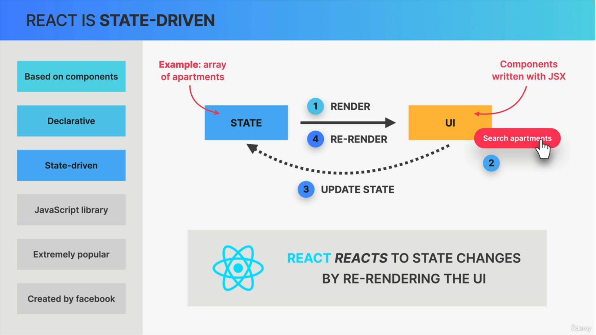
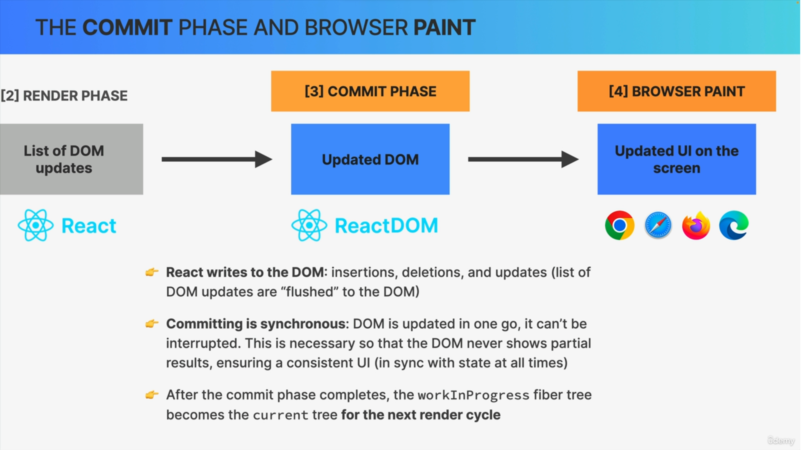
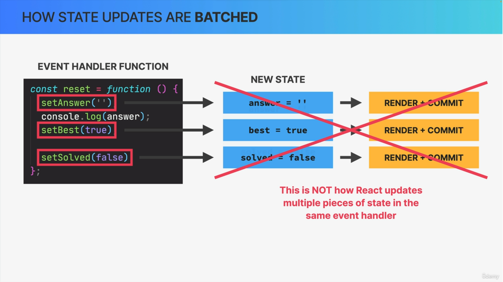
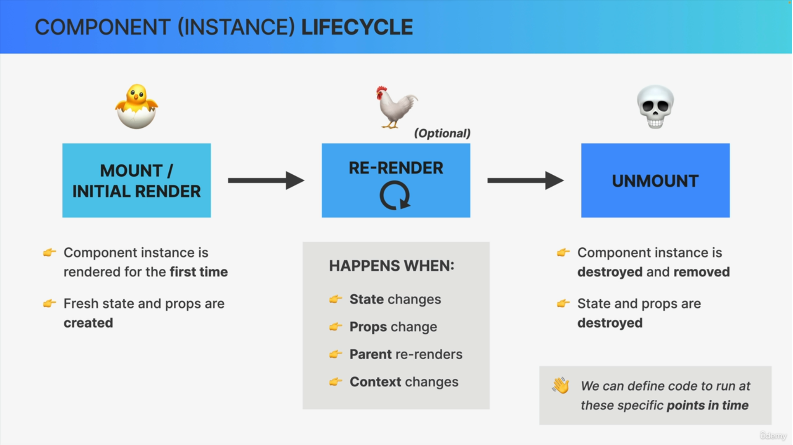
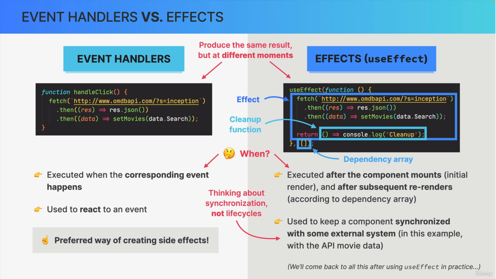
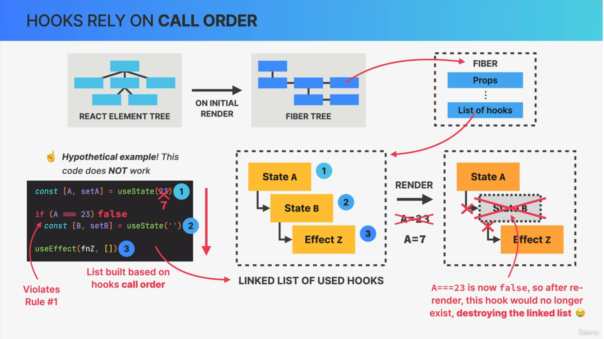
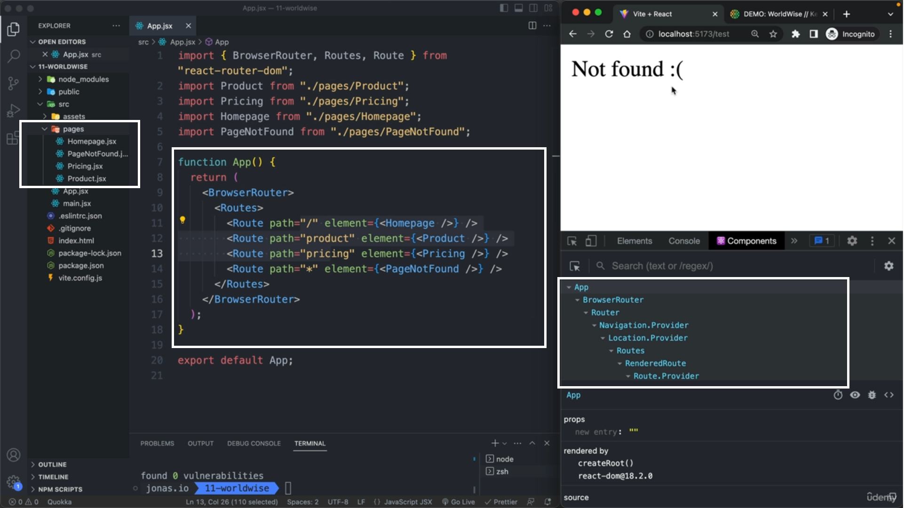

### 📘Informatics Things

* Type **React.new** in Address bar for open react code panel
* Values Persist
```js
// useState
const [total,setTotal] = useState(0)

//useRef
const inputRef = useRef(0)

// Normal Variable
let total = 0;

// On every render normal total variable value get reset to zero but in useState and useRef value will not reset on every render it will persist the value
```
* **React only cares about showing content and handling user events**

---

### 📘How Bundle.js files create


---

### 📘Why we require React
* Server-Side-Rendering vs Client-Side-Rendering


* Example of UI in sync with Data


* Problem with Vanilla Javascript


* Why Do Front-End Frame-Works Exist ?


---

### 📘What is react
* **React is Javascript Library for building user interfaces**


* Based on Components


* Declarative


* State-Driven



* Javascript-library


* React Summary


---
### 📘Pure React (CDN Links)
* Pure React means **writing react with react Objects and React Elements**


* Getting useState and useEffect from React Object


---

### 📘Create-React-App


```
npx create-react-app project-name
```
---

### 📘Review of Essential javascript for React

* Destructuring, spread Operator, Template Literals, ternaries

* Short-Circuiting and Logical Operators (||, &&, ??)

  * falsy Values : **0, null, undefined, '', false**

  ```js
  // && Operator
  true && "some things"   //some things
  false && "some things"  // false

  // || Operator
  true || "Some thing" // true
  false|| "Some thing" // Some thing

  // ?? Nullish coalescing Operator
  CheckDataExist ?? "no Data exist"

  CheckDataExist == null      //  no data exist
  CheckDataExist == undefined //  no data exist
  CheckDataExist == 0         //  CheckDataExist means 0
  CheckDataExist == false     //  CheckDataExist means false
  ```

* Optional Chaining

  ```js
  let obj = {};

  obj?.employee?.firstName
  ```

* Promises

* Async/Await

* Map, Filter, Reduce, sort (in react you mostly work with immutable Arrays)

  ```js
  const arr = [3, 7, 1, 9, 6];
  const sorted = arr.sort((a, b) => a - b);
  sorted  // [ 1, 3, 6, 7, 9 ]

  const desc = arr.sort((a, b) => b - a)
  desc    // [ 9, 7, 6, 3, 1 ]


  const sorted = books.slice().sort((a , b) => a.pages - b.pages);
  ```

* Working with immutable Arrays

  ```js
  const books = [
      {
          id: 1,
          title: "book 1",
          author: "book 1"
      },
      {
          id: 2,
          title: "book 2",
          author: "book 2"
      },
      {
          id: 3,
          title: "book 3",
          author: "book 3"
      }
  ]

  // 1) Add book object to array
  const newBook = {
      id: 6,
      title: "Harry Potter and the Chamber of Secrets",
      author: "J.k Rowling"
  }

  const booksAfterAdded = [...books, newBook];

  booksAfterAdded
  /*
  [ { id: 1, title: 'book 1', author: 'book 1' },
    { id: 2, title: 'book 2', author: 'book 2' },
    { id: 3, title: 'book 3', author: 'book 3' },
    { id: 6,
      title: 'Harry Potter and the Chamber of Secrets',
      author: 'J.k Rowling' } ]
  */

  // 2) Delete book object from array
  const booksAfterDelete = booksAfterAdded.filter(item => item.id != 1);

  booksAfterDelete
  /*
  [ { id: 2, title: 'book 2', author: 'book 2' },
    { id: 3, title: 'book 3', author: 'book 3' },
    { id: 6,
      title: 'Harry Potter and the Chamber of Secrets',
      author: 'J.k Rowling' } ]
  */

  // 3) Update book object in the array
  const booksAfterUpdate = booksAfterDelete.map(book => book.id == 2 ? {...book, nickName : 'John'} : book);

  booksAfterUpdate
  /*
  [ {id: 2, title: 'book 2', author: 'book 2', nickName : 'John'},
    { id: 3, title: 'book 3', author: 'book 3' },
    { id: 6,
      title: 'Harry Potter and the Chamber of Secrets',
      author: 'J.k Rowling' } ]
  */
  ```
----
### 📘Component as Building Blocks

* **Component has main three features :**

  1. Data

  2. Logic

  3. Appearance


  

* Component Tree

  

---
### 📘JSX


* For example if we want to update a simple text in DOM by using **javascript or jquery** we first select element by **getElementByQuery** etc then **append or replace** data, but in **React** we use **states** which automatically update our data after **re-rendering**


⚠️ **Note :** in Strict mode every thing print twice

---

### 📘 Separation of concern
* One Technology per File

  

* One Component per file

  

* Separation Summary

  

---

### 📘Style in JSX


1. Inline CSS

    ```html
    <h1 style={{color : 'Red', height : '20px'}}>
        Hello World
    </h1>
    ```
2. Module CSS

    ```js
    import { NavLink } from "react-router-dom";
    import styles from "./PageNav.module.css";

    function PageNav() {
      return (
        <nav className={styles.nav}>
          <ul>
            <li>
              <NavLink to="/">Home</NavLink>
            </li>
            <li>
              <NavLink to="/price">Price</NavLink>
            </li>
            <li>
              <NavLink to="/product">Product</NavLink>
            </li>
          </ul>
        </nav>
      );
    }

    export default PageNav;
    ```

    ```css
    .nav {
      background-color: orangered;
    }

    .nav ul {
      list-style-type: none;
      display: flex;
      justify-content: space-between;
    }
    ```
    

3. Make *Global CSS* From Module CSS, majorly use when classes are provided from external resources

    ```css
    .nav ul {
      list-style-type: none;
      display: flex;
      justify-content: space-between;
    }

    /* using global function */
    .nav :global(.active) {
      background-color: lightgreen;
    }
    ```


4. Global CSS : just like normal class which we include normally. it majorly *includes common elements* css like *forms, body, \*, heading elements, variables etc*

    ```css
    :root {
      font-family: Inter, system-ui, Avenir, Helvetica, Arial, sans-serif;
      line-height: 1.5;
      font-weight: 400;

      color-scheme: light dark;
      color: rgba(255, 255, 255, 0.87);
      background-color: #242424;

      font-synthesis: none;
      text-rendering: optimizeLegibility;
      -webkit-font-smoothing: antialiased;
      -moz-osx-font-smoothing: grayscale;
      -webkit-text-size-adjust: 100%;
    }

    a {
      font-weight: 500;
      color: #646cff;
      text-decoration: inherit;
    }
    a:hover {
      color: #535bf2;
    }

    body {
      margin: 0;
      display: flex;
      place-items: center;
      min-width: 320px;
      min-height: 100vh;
    }

    h1 {
      font-size: 3.2em;
      line-height: 1.1;
    }

    button {
      border-radius: 8px;
      border: 1px solid transparent;
      padding: 0.6em 1.2em;
      font-size: 1em;
      font-weight: 500;
      font-family: inherit;
      background-color: #1a1a1a;
      cursor: pointer;
      transition: border-color 0.25s;
    }
    button:hover {
      border-color: #646cff;
    }
    button:focus,
    button:focus-visible {
      outline: 4px auto -webkit-focus-ring-color;
    }
    ```
---

### 📘Props

* Definition about Props

  

* Props are Read Only

  

  ⚠️ **Note :** **Side Effect** Side effect happens when ever you change some data that's located outside of the current function (current component). React How ever is all about pure functions, so functions without Side Effects, at least when it's about a component's data (props and state).

  

* One way data Flow

  

**📚 conceptual Example :** using of destructing of props {...rest}

```js
import React from 'react'

function Button({ children, ...rest }) {
  return <button {...rest}>{children} </button>
}

function App() {
  const onClick = () => {
    console.log("Button Click")
  }

  const onMouseMove = () => {
    console.log("On Mouse")
  }

  return <React.Fragment>
    <div>
      <Button onClick={onClick}>Click Me</Button>
    </div>
    <div>
      <Button onMouseMove={onMouseMove}>Move Mouse on Me</Button>
    </div>
  </React.Fragment>
}

export default App
```

---

### 📘Rules in JSX


---

### 📘Conditional Rendering

1. Short circuit (&&) : in short circuit always use booleans variables.

    ```js
    // Good practice
    {true && <Loading/> }

    // Bad Practice
    {propertyArray.length && <Loading/>}
    ```
2. Ternary Operator (true ? 'yes' : 'no')

    ```js
    { condition ? <h1>Hello yes</h1> : <h1>Hello No</h1> }
    ```

3. Element Variables

    ```js
    let outPut;

    if(condition){
        output = <h1>Hello yes</h1>
    } else {
        output =  <h1>Hello No</h1>;
    }

    {outPut}  // jsx code
    ```
4. Multiple Rendering

    ```js
    if(condition) {
        return ()
    } else if (condition) {
        return ()
    } else {
        return ()
    }

    // if-else is not work in jsx
    ```
---

### 📗Section-Summary-1


---

### 📘Event Handling

```js
<button onClick="()=>{alert('Hello World')}">Click Me</button>
```
---

### 📘What is state

* What is State

  

* It give us Two Major things

  

* Syntax

  ```js
  const [total, setTotal] = useState(0);
  ```
  * First parameter is **value**

  * Second Parameter is **Setter Function** for updating value

  * Update the current state

  ```js
  const [count, setCount] = useState(0);

  const eventHandlerCount() => {

      // passing here callback function for update value with asynchronously
      setCount(old => old  + 1)
  }
  ```

  ⚠️**Note :**
  1. The value of **state** always preserve until it gets **unmount**

  2. we can only call hooks like useState on the top level of the function, not inside an if statement or inside another function or inside of loop.


* State GuidLine

  


  


  

**📚 Conceptual Example :** if the current state pointing to same array/object address then React assumes no rerender is required

```js
function App() {
  const [book, setBook] = React.useState([]);

  function handleSetBook() {
    // bad code
    book.push({ id: Date.now(), name: "John" });
    console.log(book);
    setBook(book)
  }

  // solution
   function handleSetBook() {
    // solution : it creating new array with new array address
    const tempArray = [
      ...book,
      { id: Date.now(), name: "John" }
    ];
    setBook(tempArray)
  }

  return <div>
    {book.map(e => {
      return e
    })}
    <button onClick={handleSetBook}>Add</button>
  </div>
}

export default App
```


---

### 📘Controlled Elements

* In Normal cases Every inputs maintain their own states like **values** in **DOM**

* *In **Controlled Elements** with this technique react who can controls and own the state of input fields and no longer the DOM,* So since we want to now keep **input field** data inside the application so we **create states** because that form data of course changes over time and we also want to maintain out application in sync with it.

---

### 📘State Vs Props


---

## 📔Thinking in React State Management


### 📘Local Vs Global State


---

### 📘When and Where State Use


---
### 📘Lift-Up-State

  This Means is that whenever multiple sibling components need access to the same state, we move that piece of state (state, setter function) up to the first common parent component


---

## 📘Derived State

More you have **states** more you have **re-rendering**


---

### 📘Children Props

When we avoid to pass to many props then we use **children props**

```js
import React from 'react';
import "./App.css"

function Button({ onClick, backgroundColor, color, children }) {
  return <button style={{ backgroundColor, color }} onClick={onClick}>{children}</button>
}

function App() {
  return <div className='App'>
    <Button onClick={() => alert('Hello World')} color={'black'} backgroundColor={'white'}>
      Alert
    </Button>

    <Button onClick={() => alert('Alert with emojis')} color={'black'} backgroundColor={'white'}>
      Hello 😁
    </Button>

  </div>
}

export default App;
```


---

## 📔Thinking in React Components, Composition, and Reusability


### 📘How to Split a UI into component


---

### 📘Component Categories


---

### 📘Props Drilling

* When we passing props down up to nth child is called props drilling

* Example

  ```js
  function Main({ userList }) {
    return (
      <div>
        <h1>Main Component</h1>
        <ChildComponent userList={userList} />
      </div>
    );
  }

  function ChildComponent({ userList }) {
    return (
      <ol>
        {userList.map((item) => {
          return <User key={item.id} id={item.id} name={item.name} />;
        })}
      </ol>
    );
  }

  function User({ id, name }) {
    return (
      <li>
        {" "}
        id : {id} & name : {name}
      </li>
    );
  }

  export function App() {
    const array = [
      {
        id: 1,
        name: "John",
      },
      {
        id: 2,
        name: "Silvester",
      },
      {
        id: 3,
        name: "Henry",
      },
    ];
    return (
      // Prop drilling
      <Main userList={array} />
    );
  }
  ```

The solution for the prop drilling is written below with composition component.

---

### 📘Composition Component


1. Simple Example of Composition (Removing Prop-Drilling) : Make Header Links in SavaTree, infoGain Report Header example

    ```js
    import React from 'react'
    import './App.css';


    function Main({ children }) {
      return (
        <div>
          <h1>Main Component</h1>
          {children}
        </div>
      )
    }

    function ChildComponent({ userList }) {
      return (
        <ol>
          {userList.map(item => {
            return (<User key={item.id} id={item.id} name={item.name} />)
          })}
        </ol>)
    }

    function User({ id, name }) {
      return (<li> id : {id} & name : {name}</li>)
    }

    function App() {
      const array = [
        {
          id: 1,
          name: 'John'
        },
        {
          id: 2,
          name: 'Silvester'
        },
        {
          id: 3,
          name: 'Henry'
        }
      ];
      return (
        // using composition
        <Main>
          <ChildComponent userList={array} />
        </Main>
      )
    }
    export default App
    ```

2. Passing Elements as Props (Alternative to children) : Mostly use in React-Router

    ```js
    import React from 'react';
    import "./App.css"

    function MyRender({ element }) {
      return <div>
        {element}
      </div>
    }

    function Button({ onClick, backgroundColor, color, children }) {
      return <button style={{ backgroundColor, color }} onClick={onClick}>{children}</button>
    }

    function App() {
      return <div className='App'>
        <MyRender element={<Button onClick={() => alert('Hello World')} color={'black'} backgroundColor={'white'}>
          Alert
        </Button>}>
        </MyRender>
      </div>
    }

    export default App;
    ```
---

### 📘PropTypes

* Best use with **Typescript**

* **prop-types** this package automatically comes with **react-create-app**

    ```js
    import PropTypes from "prop-types";
    ```

    ```js
    // in example sending wrong data type for background property
    import React from 'react';
    import PropTypes from "prop-types";
    import "./App.css";

    function Button({ onClick, backgroundColor, color, children }) {
      const buttonStyle = {
        backgroundColor,
        color,
      };

      return <button style={buttonStyle} onClick={onClick}>{children}</button>;
    }

    Button.propTypes = {
      onClick: PropTypes.func,
      backgroundColor: PropTypes.string,
      color: PropTypes.string.isRequired,
      children: PropTypes.node
    };

    function App() {
      return (
        <div className='App'>
          <Button onClick={() => alert('Hello World')} color={'red'} backgroundColor={111}>
            Alert
          </Button>
        </div>
      );
    }

    export default App;
    ```

    

---

## 📔How React Works Behind the Scenes

### 📘Components Vs Instances Vs Elements


---

### 📘Re-Rendering (Complete process)

* Component -> Component Instance -> Rect Element -> Dom Element

  

* Render Means = Render Phase + Commit Phase

  

* Two Situations that Render Triggers

  

* The Render Phase - Creating virtual Dom

  

* How Virtual Dom get create behind the scene

  

* After creating Virtual Dom

  

* Reconciliation

  

* Fiber Tree

  

> Reconciler
* Reconciliation is processed by a **reconciler** and we can say that the reconciler really is the **engine of react**. Its like **heart** of react. So its this reconciler that allows us to never touch the DOM directly and instead simply tell react what the next snapshot of the UI should look like based on state
* and the current reconciler in React is called Fiber

> Fiber Tree
* **Fiber Tree :** : so during the initial  render of the application fiber takes the entire React element tree. so the virtual Dom and based on it builds yet another tree, which is the fiber tree. The fiber tree is a special internal tree where for each component instance and DOM element in the app there is one so-called fiber. Now what's special about this tree is that unlike react element in the virtual DOM, fibers are not recrated on every render, So the fiber tree is never destroyed, instead, it's a mutable data structure And once it has created during the initial render, it simply mutated over and over again in the future reconciliation steps. and this makes fibers the perfect place for keeping track of things like the current component state, props, side effects, list of used hooks and more, So the actual state and props of any component instance that we see the screen are internally stored inside the corresponding fiber in the fiber tree. Now, each fiber also contains a queue of work to do like updating state updating refs, running registered, side effects, performing Dom updates and so on. This is why a fiber is also defined as a unit of work.

  

  

  

* **The once the commit phase is completed, the work in progress fiber tree becomes the current tree for the next render cycle that's because Fiber tree are never discard and never recreated from scratch, instead they are reused in order to save precious rendering time and with that, we close up the commit phase.**

  

  

---

### 📘How Diffing Works


**⚠️Note :** For the above image use react component dev toll to check which component is render and which component is not.

* The below photo conveys message :  when an element is removed from the Document Object Model (DOM), its associated state values are also removed, resulting in a reset of all values.

  

* Simple meaning of below photo : if the **attributes or props** of a component change, the component will retain its current state without resetting.

  

---

### 📘Keys

* Key help to re-render the component (reset values or state) Example : **When we are using Tabs**

  

  

  

  

* Example wit **Key and Without Key**

  ```js
  import React, { useState } from "react";

  function CountButton({ parentCount }) {
    const [count, setCount] = useState(0);

    return (
      <div>
        <hr />
        <h1>Parent Count : {parentCount}</h1>
        <h1>Child Count : {count}</h1>
        <button onClick={() => setCount((e) => e + 1)}>Child Click</button>
      </div>
    );
  }

  export function App() {
    const [parentCount, setParentCount] = useState(0);
    return (
      <div className="App">
        <button onClick={() => setParentCount((e) => e + 1)}>Parent Click</button>

        {/* without key prop, it will not reset the state value when parent re-render*/}
        <CountButton parentCount={parentCount} />

        {/* with key prop, it will reset the state value when parent re-render*/}
        <CountButton parentCount={parentCount} key={parentCount} />
      </div>
    );
  }
  ```

* Use full example for **keys in list** with screen shot

  ```js
  // use full example
  import React from 'react'
  import './App.css';


  function ChildComponent({ userList, name }) {
    console.log(userList);
    console.log(name);

    return (
      <ol>
        {userList.map(item => {
          return (<User key={item.id} id={item.id} name={item.name} />)
        })}
      </ol>)
  }

  function User({ id, name }) {
    return (<li> id : {id} & name : {name}</li>)
  }

  function App() {
      const array = [
      {
        id: 1,
        name: 'Deepinder'
      },
      {
        id: 2,
        name: 'Prerana Mam'
      },
      {
        id: 3,
        name: 'Pramlila Mam'
      }
    ];
    return <div>
      <ChildComponent userList={array} name="Hello World" />
    </div>
  }

  export default App
  ```
  
---

### 📘Render Logics, Side Effect & Pure Functions


---

### 📘How state updates are batched





```js
import React, { useState } from "react";
export function App() {
  const [count, setCount] = useState(0);

  function updateSingleCount() {
    setCount(count + 1);

    // this will print one step back value because state value always update after commit
    console.log(count);
  }

  function updateThreeCount() {
    setCount((e) => e + 1);
    setCount((e) => e + 1);
    setCount((e) => e + 1);
  }

  return (
    <div>
      <h1>count : {count}</h1>
      <button onClick={updateSingleCount}>Increment by 1</button>
      <button onClick={updateThreeCount}>Increment by 3</button>
    </div>
  );
}
```
---

### 📘Event Propagation and Delegation


* As soon as the event fires, a new event object will be created, but it will not be created where the click actually happened. Instead, the object will be created at the root of the document, so at the very top of the tree. From there, the event will then travel down the entire tree during the so called capturing phase


* all the way until it reaches the target element and the target element is simply the element on which the event was actually first triggered. So at the target, we can choose to handle the event by placing and event handler function on that element.

* Then immediately after the target element has been reached, the event object travels all the way back up the entire tree during the so-called bubbling phase.


> Now there are two very important things to understand about this process

* The first is that during the capturing and bubbling phase, the event really goes through every single child and parent element one by one. in fact, it's as if the event originated or happened in each of these dom elements

* The Second important thing is that by default, event handlers listen to events not only on the target but element also during the bubbling phase. so if we put these two things together, it means that every single event handler in a parent element will also be executed during the bubbling phase, as long as it's also listening for the same type of event **For example** *if we added another click event handler to the handler element, then during this whole process, both the handlers at the target and the header element would be executed when the click happens.*

* Now, sometimes we actually don't want this behavior and so in that case, we can prevent the event from bubbling up any further simply by calling the **stop propagation** method on the event object

* and this work in vanilla javascript and also in react, but it's actually very rarely necessary so only use this if there really is no other solution.

* Okay, so this essentially how events work in the browser.


---

### 📘Synthetic Events


---

### 📘React Third Party Library


---

### Summary


---

## 📔Effects and Data Fetching

### 📘Component lifecycle

* Major point is here that component life cycle is totally depend upon **useEffect**

* **useEffect** works only after the **painting on the browser** because if we Making an API request may cause the browser to become unresponsive until it receives a response from the server.




---

### 📘SideEffect




* Use **useEffect** with **async/await** method
```js
import React, { useEffect } from 'react';
import "./App.css";
function App() {

  useEffect(() => {
    (async function () {
      let data = await fetch('https://jsonplaceholder.typicode.com/posts');
      data = await data.json();
      console.log(data);
    }()
    )
  }, [])

  return null;
}

export default App;
```
---

## 📘Error Handling in useEffect
* when ever your do any kind of **api** call you always must do **Error Handling**, always use **try-catch**
* When ever user **Lost Internet Connection**
* **1xx, 2xx, 3xx, 4xx, 5xx** Errors
```js
import { useEffect, useState } from 'react';
import "./App.css";
function App() {
  const [loading, setLoading] = useState(false);
  const [posts, setPosts] = useState([]);
  const [error, setError] = useState('');

  useEffect(() => {
    (async function () {
      setLoading(true);

      try {
        let result = await fetch('https://jsonplaceholder.typicode.com/posts');

        if (!result.ok) throw new Error("Something went wrong with fetching posts")

        let data = await result.json();
        setPosts(data);
        setError('');
      } catch (error) {
        setError(error.message);
      } finally {
        setLoading(false);
      }
    }()
    )
  }, [])

  return <div>
    {loading && <h2>Loading...</h2>}
    {!loading && !error && posts.length > 0 ? <ul>
      {posts.map(item => {
        return (<li key={item.id}>{item.title}</li>)
      })}
    </ul> : null}

    {error && <h2> {error}</h2>}

  </div>;
}
export default App;
```
---


## 📘Dependency Array


Example : How useEffect Works after painting

```js
import { useEffect } from 'react';
import "./App.css";
function App() {

  // render on initial render
  useEffect(() => {
    console.log('A');
  }, [])

  // render on every sideEffect
  useEffect(() => {
    console.log('B');
  })

  // render on every render
  // it will print first because it render first in browser hence its a render logic
  console.log('C');
  return null;
}

export default App;

/*output
// initial render
C
A
B

// on Every Render
C
B
*/
```

**📚 conceptual example :**

```js
import React, { useEffect, useState } from 'react'

function App() {

  const [count, setCount] = useState(0);

  useEffect(() => {
    document.body.addEventListener("click", function () {
      console.log(count);
    })
  }, [])

  return (
    <div>
      <h2>{count}</h2>
      <button onClick={() => setCount(c => c + 1)} > Increment</button>
    </div >
  )
}

export default App
```

---

## 📘Clean-up Function

```js
// open console and see the problem first
import React, { useEffect, useState } from 'react'

function App() {

  const [count, setCount] = useState(0);

  // this is not a good code
  useEffect(() => {
    const t = function () {
      console.log(count);
    }
    document.body.addEventListener("click", t);
  }, [])

  return (
    <div>
      <h2>{count}</h2>
      <button onClick={() => setCount(c => c + 1)} > Increment</button>
    </div >
  )
}

export default App
```


* Clean-up function always works in two situation
1. Unmount
2. Re-Rendering

```js
import { useEffect, useState } from 'react';
import "./App.css";

function List() {
  const [count, setCount] = useState(0);

  useEffect(() => {
    return function () {
      console.log('unmount count :', count);
    }
  }, [count])
  return (<div>
    <h3>count : {count}</h3>
    <button onClick={() => setCount(n => n + 1)}>Count</button>
  </div>)
}

function App() {
  const [show, setShow] = useState(true);

  return (<div>
    <button onClick={() => setShow(n => !n)}>{show ? 'Hide' : 'Show'}</button>
    {show && <List />}
  </div>)
}

export default App;
```

```js
// clean up function for http request (with dependency array)

import { useEffect, useState } from 'react';
import "./App.css";

function UserDetails({ post }) {
  return (<div>
    <h3> Id : {post.id}</h3>
    <h3> User Id : {post.userId}</h3>
    <h3> Title : {post.title}</h3>
    <h3> Body : {post.body}</h3>
  </div>)
}


function App() {
  const [loading, setLoading] = useState(false);
  const [post, setPost] = useState({});
  const [error, setError] = useState('');
  const [id, setId] = useState('');

  useEffect(() => {
    const controller = new AbortController();
    (async function (id) {
      if (id) {
        setLoading(true);
        try {
          let result = await fetch('https://jsonplaceholder.typicode.com/posts/' + id, { signal: controller.signal });
          if (!result.ok) throw new Error("Something went wrong with fetching posts")

          let data = await result.json();
          setPost(data);
          setError('');
        } catch (error) {
          console.log('name', error.name);
          console.log('message', error.message);
          if (error.name !== "AbortError") {
            setError(error.message);
          }
        } finally {
          setLoading(false);
        }
      }
    }(id)
    )
    return function () {
      controller.abort();
    }
  }, [id])

  return <div>
    <input type='text' name='id' onChange={(e) => setId(e.target.value)} value={id} />
    {loading && <h2>Loading...</h2>}
    {!loading && !error && <UserDetails post={post} />}
    {error && <h2> {error}</h2>}

  </div>;
}
export default App;
```

```js
// clean up function with empty dependency array
import { useEffect, useState } from 'react';
import "./App.css";

function HelloWorldTwo() {
  useEffect(() => {
    const keydownHandler = function (e) {
      if (e.code === "Escape") {
        console.log('close Hello world one');
      }
    }
    document.addEventListener("keydown", keydownHandler);
    return () => {
      document.removeEventListener("keydown", keydownHandler);
    }
  }, [])
}

function HelloWorldOne() {
  useEffect(() => {
    const keydownHandler = function (e) {
      if (e.code === "Escape") {
        console.log('close Hello world Two');
      }
    }
    document.addEventListener("keydown", keydownHandler);
    return () => {
      document.removeEventListener("keydown", keydownHandler);
    }
  }, [])


  return <div>
    Hello World
  </div>
}


function App() {
  const [showOne, setShowOne] = useState(false);
  const [showTwo, setShowTwo] = useState(false);
  return <div>
    <button onClick={() => setShowOne(e => !e)}> {showOne ? 'Hide One' : 'Show One'}</button>
    <button onClick={() => setShowTwo(e => !e)}> {showTwo ? 'Hide Two' : 'Show Two'}</button>
    {showOne && <HelloWorldOne />}
    {showTwo && <HelloWorldTwo />}
  </div>

}

export default App;
```
---

## 📔Custom Hooks, Refs, and More State

### 📘React Hooks and their rules





example

```js
import { useState } from 'react';
import "./App.css";

function App() {

  const [count, setCount] = useState(0);

  // this code will cause error
  /*eslint-disable*/
  if (count === 3) {
    const [show, setShow] = useState(true);
  }

  return <div>
    <h3>count : {count}</h3>
    <button onClick={() => setCount(e => e + 1)}> Increment</button>
  </div>
}

export default App;
```

---

## 📘More Details of useState

* we can initialize the values in useState Hooks by **callback function** as well
* It only works on **initial render**
* we cannot send parameters in **callback function**
* So whenever the initial value of the state depends on some sort of computation we should always pass the callback function example value from localstorage. otherwise we use separate **useEffect** function to get the value from **localstorage** and then set the value for that state
Example
```js
import { useEffect, useState } from 'react';
import "./App.css";

function App() {

  const [count, setCount] = useState(() => {
    return Number(localStorage.getItem('count')) || 0
  });

  useEffect(() => {
    localStorage.setItem('count', count);
  }, [count])

  return <div>
    <h3>count : {count}</h3>
    <button onClick={() => setCount(e => e + 1)}> Increment</button>
  </div>

}

export default App;
```


## 📘UseRef

* **useRef** is use to *stop manually selecting DOM element*
* Selecting any element by using *document.getElementBy('id')* is not good idea because you already know that *React is all about being declarative and so manually selecting a Dom element like this is not really the react way of doing things* example not doing adding classes, id etc
* **Majorly use** for
  1. Selecting element
  2. Storing Data for inputs or timer (setIntervale or setTimeout)


Example

```js
import React, { useEffect, useRef, useState } from 'react'
import './App.css';

const App = () => {
  //1. creating reference like creating element or class in vanilla javascript
  const inputElement = useRef(null);
  const [inputValue, setInputValue] = useState('');

  useEffect(() => {
    function callback(e) {

      // checking the current element
      if (document.activeElement === inputElement.current) return

      if (e.code === "Enter") {
        // make focus on selected element
        inputElement.current.focus();
        setInputValue('');
      }
    }
    document.addEventListener('keydown', callback)

    // printing the selected element which is in current property
    console.log(inputElement.current);

    // remove event listener when component get unmount
    return () => document.removeEventListener("keydown", callback)

  }, [])

  return (<div>
    <input
      type='text'
      name=''
      //2. attaching that reference which is provided by useRef by react, because react is declarative in nature
      ref={inputElement}
      value={inputValue}
      onChange={(e) => setInputValue(e.target.value)}
    />
  </div>
  )
}

export default App
```


---
## 📘Refs to persist data between Renders

* In this example Component will not re-render but the value will *persist between Renders* for example *for count value*
* best use when we don't want to show any data on DOM


```js
import React, { useRef } from 'react'
import './App.css';

const App = () => {
  const inputElement = useRef(1);

  const incrementHandler = function () {
    inputElement.current += 1
    console.log('ref', inputElement.current);
  }

  return (<div>
    <h1>Count : {inputElement.current}</h1>
    <button onClick={() => incrementHandler()}>
      Increment
    </button>
  </div>)
}

export default App
```

---
## 📘Whats are Custom Hooks When to create One


Example : Custom Hook with callback function

```js
import React, { useEffect, useState } from 'react';
import './App.css';

function useFetch(url) {
  const [data, setData] = useState([]);
  const [isLoading, setLoading] = useState(false);

  useEffect(() => {
    setLoading(true);
    fetch(url)
      .then(result => result.json())
      .then(result => {
        setLoading(false);
        setData(result);
      });
  }, [url]);

  // for callback function example with optional chaining
  const callbackFunction = n => n?.()

  return [data, isLoading, callbackFunction]
}

const App = () => {
  const [data, isLoading, callbackFunction] = useFetch('https://jsonplaceholder.typicode.com/posts');

  if (!isLoading && data.length) {
    callbackFunction(function () { console.log('Data loaded successfully') })
  }

  return (
    <div>
      {isLoading && <h3>Loading...</h3>}
      {!isLoading && <ul>
        {data.map(element => {
          return (
            <li key={element.id}>
              <h3>user Id : {element.userId}</h3>
              <h3>title :{element.title}</h3>
            </li>
          )
        })}
      </ul>}
    </div>
  );
}

export default App;
```
```js
// Another Example
import { useEffect } from 'react';
import "./App.css";

function useEventHook(event, key, callback) {
  const fn = function (e) {
    if (e.code.toLowerCase() === key.toLowerCase()) {
      callback?.(e.code);
    }
    console.log('yes');
  }
  useEffect(() => {
    document.addEventListener(event, fn);
    return () => document.removeEventListener(event, fn)
  }, []);
}

function App() {

  useEventHook("keydown", "enter", function (key) {
    console.log("You Hit Enter ", key);
  })

  useEventHook("keydown", "escape", function (key) {
    console.log("You Hit Enter ", key);
  })
  return null

}

export default App;
```
---

# 📔React Before Hooks Class-Based React

## 📘Functional Vs Class Component

```js
import React, { Component } from 'react'

export default class App extends Component {
  constructor() {
    super();
    this.state = {
      count: 0,
      cakeCount: 0
    };
  }

  componentDidMount() { }
  componentDidUpdate() { }
  componentWillUnmount() { }

  incrementCountHandler = () => {
    this.setState(e => ({
      ...e,
      count: e.count + 1
    }))
  }
  incrementCakeHandler = () => {
    this.setState(e => ({
      ...e,
      cakeCount: e.cakeCount + 1
    }))
  }

  render() {
    return (
      <div>
        <h2>Count : {this.state.count}</h2>
        <h2>Cake count : {this.state.cakeCount}</h2>
        <button onClick={this.incrementCountHandler}>Count Increment</button>
        <button onClick={this.incrementCakeHandler}>Cake Increment</button>
      </div>
    )
  }
}
```


---

# 📔The Advanced useReducer Hook


## 📘useReducer


```js
import React from 'react';
import { useReducer } from 'react';

// Initial Values
const initialState = {
  cakeCount: 0
}

// constants
const reducerConstants = {
  CAKE_INCREMENT: "CAKE_INCREMENT",
  CAKE_DECREMENT: "CAKE_DECREMENT",
  CAKE_RESET: "CAKE_RESET",
  CAKE_INCREMENT_BY_VALUE: "CAKE_INCREMENT_BY_VALUE",
}

// Reducer (Pure function)
function myReducer(state = initialState, action) {
  switch (action.type) {
    case reducerConstants.CAKE_INCREMENT: {
      return {
        ...state,
        cakeCount: state.cakeCount + 1
      }
    }
    case reducerConstants.CAKE_DECREMENT: {
      return {
        ...state,
        cakeCount: state.cakeCount - 1
      }
    }
    case reducerConstants.CAKE_RESET: {
      return {
        ...state,
        cakeCount: 0
      }
    }
    case reducerConstants.CAKE_INCREMENT_BY_VALUE: {
      return {
        ...state,
        cakeCount: state.cakeCount + action.payload
      }
    }
    default: {
      return state;
    }
  }
}

function Show({ state }) {
  return (<div>
    <p>Count : {state.cakeCount}</p>
  </div>)
}

function Button({ dispatch }) {
  return (<div>
    <button onClick={() => dispatch({ type: reducerConstants.CAKE_INCREMENT })}>Increment </button>
    <button onClick={() => dispatch({ type: reducerConstants.CAKE_DECREMENT })}>Decrement </button>
    <button onClick={() => dispatch({ type: reducerConstants.CAKE_RESET })}>Reset </button>
    <button onClick={() => dispatch({ type: reducerConstants.CAKE_INCREMENT_BY_VALUE, payload: 3 })}>Increment by 3</button>
  </div>)
}

function StructureOne() {
  const [state, dispatch] = useReducer(myReducer, initialState);
  return (
    <div>
      <Show state={state} />
      <Button dispatch={dispatch} />
    </div>
  )
}

function StructureTwo() {
  const [state, dispatch] = useReducer(myReducer, initialState);
  return (
    <div>
      <Show state={state} />
      <Button dispatch={dispatch} />
    </div>
  )
}

// Components
function App() {
  return (
    <React.Fragment>
      <StructureOne />
      <StructureTwo />
    </React.Fragment>
  )
}

export default App
```
---

## 📘useState Vs useReducer


---
# 📔React Router Building
---

## 📘Creating React App with vite
* In **Vite**, we get es-lint byDefault in it

1. Enter Command
```
npm create vite@latest
```
2. Enter Project Name
3. Select Frame work
4. Select variant
5. Install Every thing

```
npm install
npm run dev
```

* Installing **eslint**
1. Command
```
 npm install eslint vite-plugin-eslint eslint-config-react-app --save-dev
```

2. create **.eslintrc.json**

```js
{
  "extends": "react-app"
}
```
3. Edit Code in **vite.config.js**

```js
import { defineConfig } from 'vite'
import react from '@vitejs/plugin-react';
import eslint from "vite-plugin-eslint"

// https://vitejs.dev/config/
export default defineConfig({
  plugins: [react(), eslint()],
})
```


## 📘Implementing Main Pages and Routes


* command
```
 npm install react-router-dom
```

```js
import {
  BrowserRouter as Routers,
  Route,
  Link,
  Routes,
} from "react-router-dom";
import "./App.css";
import Home from "./pages/Home";
import Product from "./pages/Product";
import Price from "./pages/Pricing";

function App() {
  return (
    <div>
      <Routers>
        <Link to="/">Home</Link>
        <Link to="/price">Price</Link>
        <Link to="/product">Product</Link>
        <Routes>
          <Route path="/" element={<Home />}></Route>
          <Route path="/price" element={<Price />}></Route>
          <Route path="/product" element={<Product />}></Route>
        </Routes>
      </Routers>
    </div>
  );
}

export default App;
```



* With *NavLink* wrapper we can print **active** *class*

```js
<NavLink to="/">Home</NavLink>
```
## 📘Nested Routes
* use of **outlet** wrapper

1. Address bar is like that

```
http://localhost:5173/price/usa
```

2. App.jsx
```js
import { BrowserRouter as Routers, Route, Routes } from "react-router-dom";
import "./App.css";
import Home from "./pages/Home";
import Product from "./pages/Product";
import Price from "./pages/Pricing";
import PageNav from "./components/PageNav";

function App() {
  return (
    <div>
      <Routers>
        <PageNav />
        <Routes>
          <Route path="/" element={<Home />}></Route>
          <Route path="/price" element={<Price />}>
            {/* according to the route it will go first into price then go usa and it will print use component  */}
            <Route index element={<h1>Index Element</h1>}></Route>
            <Route path="india" element={<h1>India</h1>}></Route>
            <Route path="usa" element={<h1>Usa</h1>}></Route>
            <Route path="england" element={<h1>England</h1>}></Route>
          </Route>
          <Route path="/product" element={<Product />}></Route>
        </Routes>
      </Routers>
    </div>
  );
}

export default App;
```
3. Pricing.jsx

```js
import { Link, Outlet } from "react-router-dom";

function Pricing() {
  return (
    <div>
      Pricing
      <ul style={{ display: "flex", justifyContent: "space-between" }}>
        <li>
          <Link to="india">India</Link>
        </li>
        <li>
          <Link to="usa">USA</Link>
        </li>
        <li>
          <Link to="england">England</Link>
        </li>
      </ul>
      <Outlet />
    </div>
  );
}

export default Pricing;
```
---

## 📘Storing State in the URL (using param)


```js
// http://localhost:5173/price/england/pound

import {useParams} from "react-router-dom";

<Route
  path="india/:currency?"
  element={<Country con={"India"} />}
/>

function Country(props) {
  const id = useParams();
  return (
    <h1>
      Currency : {id.currency}
    </h1>
  );
}
```
---

## 📘Storing State in the URL (using query string)

```js
// http://localhost:5173/price/india/rupee?govt=India&Bank=RBI

import { useSearchParams } from "react-router-dom";

function Country() {
  const [queryString, setQueryString] = useSearchParams();
  const govt = queryString.get("govt");
  console.log(govt);
  const bank = queryString.get("Bank");
  console.log(bank);

  return (
    <div>
      <button onClick={() => setQueryString({ govt: "usa", Bank: "usa-bank" })}>
        Click
      </button>
    </div>
  );
}
```
---

## 📘Programmatic Navigation (with useNavigate)

```js
import { useNavigate } from "react-router-dom";

function Country() {
  const navigate = useNavigate();

  function PriceNavigation() {
    navigate("/price");
  }
  return (
    <div>
      <button type="button" onClick={PriceNavigation}>Price</button>
      <button type="button" onClick={(e)=> {
          e.preventDefault();
          navigate(-1);
        }}>Back</button>
    </div>
  );
}
```
---

## 📘Programmatic Navigation (with Navigate)

```js
import {
  BrowserRouter as Routers,
  Route,
  Routes,
  Navigate,
} from "react-router-dom";
import "./App.css";
import Home from "./pages/Home";
import Price from "./pages/Pricing";
import PageNav from "./components/PageNav";

function Country() {
  return (
    <div>
      <h1>USA</h1>
    </div>
  );
}

function App() {
  return (
    <div>
      <Routers>
        <PageNav />
        <Routes>
          <Route path="/" element={<Home />}></Route>
          <Route path="/price" element={<Price />}>
            {/* Redirecting to usa address */}
            <Route index element={<Navigate replace to="usa" />}></Route>
            <Route path="india" element={<Country />} />
            <Route path="usa" element={<Country />} />
          </Route>
        </Routes>
      </Routers>
    </div>
  );
}

export default App;
```

---

# 📔Advanced State Management The Context API

## 📘What is the Context API


1. **Context Api + useState**

```js
import React, { createContext, useContext, useState } from 'react';

// step 1 : creating context,  basically its a component
const MyContext = createContext();

function ContextComponent({ children }) {
  const [count, setCount] = useState(0);

  // step : 2 providing Data, its like props
  const propsData = {
    count: count,
    setCount: setCount
  }

  return (
    // step : 3 Creating Provider Wrapper
    <MyContext.Provider value={propsData}>
      {children}
    </MyContext.Provider>
  );
}

function ShowComponent() {
  // step 4 :  Consume the context value,
  const { count } = useContext(MyContext);
  return <div>
    <h2>Show Component</h2>
    <h3>count : {count}</h3>
  </div>
}

function ButtonComponent() {
  const { setCount } = useContext(MyContext)
  return <div>
    <h2>Button Component</h2>
    <button onClick={() => setCount(e => e + 1)}>Update</button>
  </div>
}


function App() {
  return (
    <ContextComponent>
      <ShowComponent />
      <ButtonComponent />
    </ContextComponent>
  )
}

export default App
```

⚠️ **Note :** if we try to print any context value in *App component* it will not print because provider is wrap is around the *showComponent and ButtonComponent* example

```js
function App() {
  // here it will undefined
  const data = useContext(MyContext)
  console.log(data);
  // here it will undefined

  if (!data) throw new Error('MyContext was used outside of the Provider')

  return (
    <ContextComponent>
      <ShowComponent />
      <ButtonComponent />
    </ContextComponent>
  )
}
```
2. two ContextApi

```js
import React, { createContext, useContext, useState } from 'react';

// step 1 : creating context,  basically its a component
const MyContext = createContext();
const CakeCountContext = createContext();

function ContextComponent({ children }) {
  const [count, setCount] = useState(0);

  // step : 2 providing Data, its like props
  const propsData = {
    count: count,
    setCount: setCount
  }

  return (
    // step : 3 Creating Provider Wrapper
    <MyContext.Provider value={propsData}>
      {children}
    </MyContext.Provider>
  );
}

function CakeContextComponent({ children }) {
  const [cakeCount, setCakeCount] = useState(0);

  // step : 2 providing Data, its like props
  const propsData = {
    cakeCount: cakeCount,
    setCakeCount: setCakeCount
  }

  return (
    // step : 3 Creating Provider Wrapper
    <CakeCountContext.Provider value={propsData}>
      {children}
    </CakeCountContext.Provider>
  );
}

function ShowComponent() {
  // step 4 :  Consume the context value,
  const { count } = useContext(MyContext);
  const { cakeCount } = useContext(CakeCountContext)
  return <div>
    <h2>Show Component</h2>
    <h3>count : {count}</h3>
    <h3>Cake Count : {cakeCount}</h3>
  </div>
}

function ButtonComponent() {
  const { setCount } = useContext(MyContext);
  const { setCakeCount } = useContext(CakeCountContext)
  return <div>
    <h2>Button Component</h2>
    <button onClick={() => setCount(e => e + 1)}>Update</button>
    <button onClick={() => setCakeCount(e => e + 1)}>Cake Count</button>
  </div>
}

function App() {
  return (
    <ContextComponent>
      <CakeContextComponent>
        <ShowComponent />
        <ButtonComponent />
      </CakeContextComponent>
    </ContextComponent>
  )
}

export default App
```


3. ContextApi + useReducer

```js
import React, { createContext, useContext, useReducer } from 'react';

// step 1 : creating context,  basically its a component
const MyContext = createContext();

// Initial Values
const initialState = {
  cakeCount: 0
}

// constants
const reducerConstants = {
  CAKE_INCREMENT: "CAKE_INCREMENT",
  CAKE_DECREMENT: "CAKE_DECREMENT",
  CAKE_RESET: "CAKE_RESET",
  CAKE_INCREMENT_BY_VALUE: "CAKE_INCREMENT_BY_VALUE",
}

// Reducer (Pure function)
function myReducer(state = initialState, action) {
  switch (action.type) {
    case reducerConstants.CAKE_INCREMENT: {
      return {
        ...state,
        cakeCount: state.cakeCount + 1
      }
    }
    case reducerConstants.CAKE_DECREMENT: {
      return {
        ...state,
        cakeCount: state.cakeCount - 1
      }
    }
    case reducerConstants.CAKE_RESET: {
      return {
        ...state,
        cakeCount: 0
      }
    }
    case reducerConstants.CAKE_INCREMENT_BY_VALUE: {
      return {
        ...state,
        cakeCount: state.cakeCount + action.payload
      }
    }
    default: {
      return state;
    }
  }
}

function ContextComponent({ children }) {
  const [state, dispatch] = useReducer(myReducer, initialState);

  // step : 2 providing Data, its like props
  const propsData = {
    state,
    dispatch
  }

  return (
    // step : 3 Creating Provider Wrapper
    <MyContext.Provider value={propsData}>
      {children}
    </MyContext.Provider>
  );
}

function ShowComponent() {
  // step 4 :  Consume the context value,
  const { state } = useContext(MyContext);
  return <div>
    <h2>Show Component</h2>
    <p>Count : {state.cakeCount}</p>
  </div>
}

function ButtonComponent() {
  const { dispatch } = useContext(MyContext)
  return <div>
    <h2>Button Component</h2>
    <button onClick={() => dispatch({ type: reducerConstants.CAKE_INCREMENT })}>Increment </button>
    <button onClick={() => dispatch({ type: reducerConstants.CAKE_DECREMENT })}>Decrement </button>
    <button onClick={() => dispatch({ type: reducerConstants.CAKE_RESET })}>Reset </button>
    <button onClick={() => dispatch({ type: reducerConstants.CAKE_INCREMENT_BY_VALUE, payload: 3 })}>Increment by 3</button>
  </div>
}


function App() {
  return (
    <ContextComponent>
      <ShowComponent />
      <ButtonComponent />
    </ContextComponent>
  )
}

export default App
```

> With Custom Hook

```js
import React, { createContext, useContext, useState } from 'react';

const MyContext = createContext();

function useMyCustomContext() {
  function ContextComponent({ children }) {
    const [state, dispatch] = useState(0)

    const propsData = {
      state,
      dispatch
    }

    return (
      <MyContext.Provider value={propsData}>
        {children}
      </MyContext.Provider>
    );
  }
  const allContextProperties = useContext(MyContext);

  return {
    ContextComponent,
    allContextProperties
  }
}

function ShowComponent() {
  const { allContextProperties } = useMyCustomContext();
  return <div>
    <h2>Show Component</h2>
    <h3>count : {allContextProperties.state}</h3>
  </div>
}

function ButtonComponent() {
  const { allContextProperties } = useMyCustomContext();
  return <div>
    <h2>Button Component</h2>
    <button onClick={() => allContextProperties.dispatch(e => e + 1)}>Increment </button>
    <button onClick={() => allContextProperties.dispatch(e => e - 1)}>Decrement </button>
    <button onClick={() => allContextProperties.dispatch(0)}>Reset </button>
  </div>
}

function App() {
  const { ContextComponent } = useMyCustomContext();
  return (
    <ContextComponent>
      <ShowComponent />
      <ButtonComponent />
    </ContextComponent>
  )
}

export default App
```
---

## 📘Thinking React Advance State Management


---

# 📔Performance Optimization and Advanced useEffect

## Performance Optimization and Wasted Renders


---
## The Profiler Developer Tool

[!Image](./images/profiler-dev-tools-1.png)

[!Image](./images/profiler-dev-tools-2.png)

[!Image](./images/profiler-dev-tools-3.png)

[!Image](./images/profiler-dev-tools-4.png)

* **Yellow Color** : reflect where the state actual change
* **Dark green :** reflect re-rendering
* **green :** reflect not re-render

---

## A Surprising Optimization Trick With children

* Most used concept in the real world. Mostly used with *complex or very slow render* components.

1. In this example **Static Component** dont have any *props* but still it re-render because its get re-render after changing there state
```js
// Problem
import React from 'react'
import { useState } from 'react'
import "./App.css"

function StaticChild() {

  const words = Array.from({ length: 100000 }, (_, i) => "word");

  console.log('re-render static-component');
  return <React.Fragment>
    <h3>Static Child Component</h3>
    <ul>
      {words.map((e, i) => {
        return (<li key={i}>
          {i} : {e}
        </li>)
      })}

    </ul>
  </React.Fragment>
}

function DynamicChild({ count }) {
  console.log('re-render Dynamic-component');
  return <React.Fragment>
    <h3>Dynamic Child Component</h3>
    <h4>Count : {count}</h4>
  </React.Fragment>
}

function Test() {
  const [count, setCount] = useState(0);

  return (
    <div className='App'>
      <button onClick={() => setCount(e => e + 1)}>Increase {count}</button>
      <DynamicChild count={count} />
      <StaticChild />
    </div>
  )
}

function App() {
  return (
    <Test>
    </Test>
  )
}

export default App;
```

1. In this example **Static Component** pass as composite component in **Test Component** and created before render of Test component, so it will not *re-render* again and again even the state get change in *Test component* only child components get re-render of *test Component*. This Concept will work in all scenarios where we are passing component as *children or props*


```js
// Solution

import React from 'react'
import { useState } from 'react'
import "./App.css"

function StaticChild() {

  const words = Array.from({ length: 100000 }, (_, i) => "word");

  console.log('re-render static-component');
  return <React.Fragment>
    <h3>Static Child Component</h3>
    <ul>
      {words.map((e, i) => {
        return (<li key={i}>
          {i} : {e}
        </li>)
      })}

    </ul>
  </React.Fragment>
}

function DynamicChild({ count }) {
  console.log('re-render Dynamic-component');
  return <React.Fragment>
    <h3>Dynamic Child Component</h3>
    <h4>Count : {count}</h4>
  </React.Fragment>
}

function Test({ children }) {
  const [count, setCount] = useState(0);

  return (
    <div className='App'>
      <button onClick={() => setCount(e => e + 1)}>Increase {count}</button>
      {children}
      <DynamicChild count={count} />
    </div>
  )
}

function App() {
  return (
    <Test>
      <StaticChild />
    </Test>
  )
}

export default App;
```
---

## 📘Understanding memo


⚠️ **Note :** The concept behind *memo, useMemo and useCallback* is **Memoization**

Example

* in this example when ever state get change in **App Component (parent component)** the child components also get re-render. Hence **Static Child Component** make slow whole current page like when ever you enter inputs values you will see it takes to much time to enter new value.
```js
// Problem
import React from 'react'
import { useState } from 'react'
import "./App.css"

const StaticChild = () => {
  const words = Array.from({ length: 100000 }, (_, i) => "word");

  console.log('re-render static-component');
  return <React.Fragment>
    <h3>Static Child Component</h3>
    <ul>
      {words.map((e, i) => {
        return (<li key={i}>
          {i} : {e}
        </li>)
      })}

    </ul>
  </React.Fragment>
}

function Archive({ show }) {
  return (<div>
    {show && <StaticChild />}
  </div>)
}

function App() {
  const userList = [
    { name: "a", city: "a" },
    { name: "b", city: "b" },
    { name: "c", city: "c" },
    { name: "d", city: "d" },
    { name: "e", city: "e" },
    { name: "f", city: "f" },
  ];
  const [inputValue, setInputValue] = useState('');
  const [filterValues, setFilterValues] = useState(userList);
  const [show, setShow] = useState(false);

  const searchHandler = (e) => {
    let value = e.target.value.trim();
    setInputValue(value)
    if (value.length === 0) {
      setFilterValues(userList)
    } else {
      let filterValue = userList.filter(e => e.name.includes(value));
      setFilterValues(filterValue)
    }
  }

  return (
    <div className='App'>
      <button onClick={() => setShow(e => !e)}>Archive {show ? 'true' : "false"}</button><br />
      <input type='search' name='user' value={inputValue} onChange={searchHandler} />
      <ul>
        {filterValues.map(e => {
          return (<li key={e.name}>
            Name : {e.name} <br />City : {e.city}
          </li>)
        })}
      </ul>
      <Archive show={show} />
    </div >
  )
}

export default App;
```


* Solution, after applying **memo (memoization)** Component get *cached* and it will take time in first render after that it will work very fast as compare to above example.
```js
import React, { memo } from 'react'

const StaticChild = memo(() => {
  const words = Array.from({ length: 100000 }, (_, i) => "word");

  console.log('re-render static-component');
  return <React.Fragment>
    <h3>Static Child Component</h3>
    <ul>
      {words.map((e, i) => {
        return (<li key={i}>
          {i} : {e}
        </li>)
      })}

    </ul>
  </React.Fragment>
});

// OR
const Archive = memo(({ show }) => {
  return (<div>
    {show && <StaticChild />}
  </div>)
})
```


---

## 📘Understanding useMemo and useCallback


1. **useMemo**
* The React useMemo Hook returns a memoized value.
* Think of memoization as caching a value so that it does not need to be recalculated.
* The useMemo Hook only runs when one of its dependencies update.
* This can improve performance.
* The useMemo and useCallback Hooks are similar. The main difference is that useMemo returns a memoized value and useCallback returns a memoized function.


```js
// Simple Example
import './App.css'
import { useMemo, useState } from 'react'
const App = () => {
  const [count, setCount] = useState(0);
  const [item, setItem] = useState(10);

  const isEven = useMemo(() => {
    console.log('called is even function');
    let i = 0;
    while (i < 2000000000) i++;
    return count % 2 === 0;
  }, [count])

return (
    <div className='App'>
      <div><button onClick={() => setCount((count) => count + 1)}>Count - {count}</button></div>
      <span>{isEven ? 'Even' : 'Odd'}</span>
      <div><button onClick={() => setItem((item) => item + 1)}>Item - {item}</button></div>
    </div>
  )
}

export default App;
```

Example

* So the basic concept is here that when ever we pass **object or functions** child component always re-render even if we have same values in it.

Example :
* in the below example, child component will re-render again and again even the values (name) is same but because of object on every re-render it will create a new memory address for object hence every children will re-render again, also if we use **memo** here as well it will also cause same problem. *This problem is always occur in Objects and functions because of memory address change on every render.*

* Main Concept : *we are passing as object and that object is use for derived state in child component*

```js
// Problem without memo
import React from 'react';
import { useState } from 'react';

const ChildComponent = ({ obj }) => {
  const [data] = useState(obj)
  console.log('Child component');
  return (
    <div>
      <h1>Child Component</h1>
      Name : {data.name} <br />
      Job : {data.job}
    </div>
  )
}

const App = () => {
  let obj = { name: "Deepu Bhasin", job: "React Developer" };
  const [input, setInput] = useState('');
  console.log('Parent Component');
  return (<div>
    <input type='text' name='name' placeholder='Enter Name' value={input} onChange={(e) => setInput(e.target.value)} />
    <ChildComponent obj={obj} />

  </div>)

}

export default App;
```

```js
// problem with memo

import React, { memo } from 'react';
import { useState } from 'react';

const ChildComponent = memo(({ obj }) => {
  const [data] = useState(obj)
  console.log('Child component');
  return (
    <div>
      <h1>Child Component</h1>
      Name : {data.name} <br />
      Job : {data.job}
    </div>
  )
})

const App = () => {
  let obj = { name: "Deepu Bhasin", job: "React Developer" };
  const [input, setInput] = useState('');
  console.log('Parent Component');
  return (<div>
    <input type='text' name='name' placeholder='Enter Name' value={input} onChange={(e) => setInput(e.target.value)} />
    <ChildComponent obj={obj} />

  </div>)

}

export default App;
```

```js
// Solution using memo and useMemo
import React, { memo, useMemo } from 'react';
import { useState } from 'react';

const ChildComponent = memo(({ obj }) => {
  const [data] = useState(obj)
  console.log('Child component');
  return (
    <div>
      <h1>Child Component</h1>
      Name : {data.name} <br />
      Job : {data.job}
    </div>
  )
})

const App = () => {
  let obj = useMemo(() => ({ name: "Deepu Bhasin", job: "React Developer" }), []);
  const [input, setInput] = useState('');
  console.log('Parent Component');
  return (<div>
    <input type='text' name='name' placeholder='Enter Name' value={input} onChange={(e) => setInput(e.target.value)} />
    <ChildComponent obj={obj} />
  </div>)
}

export default App;
```

2. **useCallBack**

* The React useCallback Hook returns a memoized callback function.
* Think of memoization as caching a value so that it does not need to be recalculated.
* This allows us to isolate resource intensive functions so that they will not automatically run on every render.
* The useCallback Hook only runs when one of its dependencies update.
* This can improve performance.
* The useCallback and useMemo Hooks are similar. The main difference is that useMemo returns a memoized value and
useCallback returns a memoized function

Example : in below example, We *pass Parent setCountHandler function object to Button Component* so when ever parent get re-render the setCountHandler reference always change hence child Component will re-render (Button Component), even though we use *memo*.

```js
import React, { memo, useState } from 'react';

function ShowComponent({ count }) {
  console.log('Show Component');
  return (
    <h3> Count : {count}</h3>
  )
}

const ButtonComponent = memo(
  function ({ setCount }) {
    console.log('Button Component');
    return (
      <button onClick={setCount}>Increment</button>
    )
  }
)

const App = () => {
  const [count, setCount] = useState(0);

  const setCountHandler = () => {
    setCount(e => e + 1);
  }

  console.log('Parent Count');
  return (
    <React.Fragment>
      <ShowComponent count={count} />
      <ButtonComponent setCount={setCountHandler} />
    </React.Fragment>
  );
}

export default App;
```

```js
// solution (but making handler function)
import React, { memo, useState } from 'react';

function ShowComponent({ count }) {
  console.log('Show Component');
  return (
    <h3> Count : {count}</h3>
  )
}

const ButtonComponent = memo(
  function ({ setCount }) {
    console.log('Button Component');
    return (
      <button onClick={setCount}>Increment</button>
    )
  }
)

const App = () => {
  const [count, setCount] = useState(0);

 // using callback
 const setCountHandler = useCallback(() => {
    setCount(e => e + 1);
  }, []);

  console.log('Parent Count');
  return (
    <React.Fragment>
      <ShowComponent count={count} />
      <ButtonComponent setCount={setCountHandler} />
    </React.Fragment>
  );
}

export default App;
```

⚠️ **Note :**
1. *useMemo and useCallBack* always use when ever we found *slow components* which has visible bad performance use these two hooks to optimize components. Because unnecessary use of these hooks also leads problem because it consume lots of memory

2. in below example we are passing *setter functions of useState* into child component, react gives guarantee that *setter functions of useState* always have stable identity which means that they will not change on renders like we can that these setter functions are automatically memoized.

```js
// solution (without handler function)
import React, { memo, useState } from 'react';

function ShowComponent({ count }) {
  console.log('Show Component');
  return (
    <h3> Count : {count}</h3>
  )
}

const ButtonComponent = memo(
  function ({ setCount }) {
    console.log('Button Component');
    return (
      <button onClick={() => setCount(e => e + 1)}>Increment</button>
    )
  }
)

const App = () => {
  const [count, setCount] = useState(0);

  console.log('Parent Count');
  return (
    <React.Fragment>
      <ShowComponent count={count} />
      <ButtonComponent setCount={setCount} />
    </React.Fragment>
  );
}

export default App;
```
⚠️ **Note :** Optimization can be done in following way
* *context api, redux or any props in which we are passing objects*
* Component which take too much time to render due to *Heavy calculations*.
* When component render to much and making serious effects on the other components like wasted renders

---

## 📘Optimization Bundle Size with code splitting


* If the address get change then javascript will not load again in SPA


* The js files get download later according to requirement


* Most common example for *code splitting is with routing (at page level)*. **Suspense** is a advance React feature allow some component to suspense means it allows them to wait for something to happen. in our case these lazy component are gone be suspended while they are loading. Then we can use in-built *Suspense Component* to show a fallback with in our case is loading indicator.
* Once the chunk downloaded it will not download again hence reduce our bandwidth

```js
// Simple example of lazy loading
import React, { Suspense, useState } from 'react';
const ButtonComponent = React.lazy(() => import("./ButtonComponent.js"));
const ShowComponent = React.lazy(() => import("./ShowComponent.js"));

const App = () => {
  const [count, setCount] = useState(0);
  return (
    <React.Fragment>
      <Suspense fallback={<h1>Loading ...</h1>}>
        <ShowComponent count={count} />
        <ButtonComponent setCount={setCount} />
      </Suspense>
    </React.Fragment>
  );
}

export default App;
```
---

## 📘Don't Optimize Prematurely!


## 📘useEffect Rules and Best Practice


---

# 📔Redux and Modern Redux Toolkit (With Thunks)

## 📘Redux


---

## 📘Creating Redux Store, Reducer, Action Constants (Simple Version)

```
npm install redux react-redux
```

1. Single Reducer
```js

import React from 'react';
import { createStore } from "redux";
import { Provider, useDispatch, useSelector } from 'react-redux';

// Initial Value
const initialState = {
  count: 0,
};

// Actions Constants
const actionConstants = {
  INCREMENT: "count/increment",
  DECREMENT: "count/decrement",
  RESET: "count/reset",
  INCREMENT_BY_VALUE: "count/incrementByValue",
}

// Action Creator
const actionCreator = {
  incrementAction: function () {
    return {
      type: actionConstants.INCREMENT,
      payload: 1
    }
  },
  decrementAction: function () {
    return {
      type: actionConstants.DECREMENT,
      payload: 1
    }
  },
  resetAction: function () {
    return {
      type: actionConstants.RESET,
      payload: 0
    }
  },
  incrementByValueAction: function (value) {
    return {
      type: actionConstants.INCREMENT_BY_VALUE,
      payload: value
    }
  }
}

// Reducer
function reducer(state = initialState, action) {
  switch (action.type) {
    // Write complete login Here
    case actionConstants.INCREMENT: {
      return {
        ...state,
        count: state.count + action.payload
      }
    }
    case actionConstants.DECREMENT: {
      return {
        ...state,
        count: state.count - action.payload
      }
    }
    case actionConstants.RESET: {
      return {
        ...state,
        count: 0
      }
    }
    case actionConstants.INCREMENT_BY_VALUE: {
      return {
        ...state,
        count: state.count + action.payload
      }
    }
    default: {
      return state;
    }
  }
}

// create Store
const store = createStore(reducer);

function ShowComponent() {
  const count = useSelector(state => state.count)
  return (
    <React.Fragment>
      <h3> Count : {count}</h3>
    </React.Fragment>
  )
}

function ButtonComponent() {
  const dispatch = useDispatch();
  return (
    <React.Fragment>
      <button onClick={() => dispatch(actionCreator.incrementAction())}>Increment</button><br />
      <button onClick={() => dispatch(actionCreator.decrementAction())}>Decrement</button><br />
      <button onClick={() => dispatch(actionCreator.resetAction())}>Reset</button><br />
      <button onClick={() => dispatch(actionCreator.incrementByValueAction(3))}>Increment By Value 3</button>
    </React.Fragment>
  )
}

const App = () => {
  return (
    <Provider store={store} >
      <ShowComponent />
      <ButtonComponent />
    </Provider>
  )
}

export default App;
```

2. Combine Reducer

```js
import React from 'react';
import { combineReducers, createStore } from "redux";
import { Provider, useDispatch, useSelector } from 'react-redux';

// Initial Value
const firstInitialState = {
  count: 0,
};

// Actions Constants
const firstActionConstants = {
  INCREMENT: "count/increment",
  DECREMENT: "count/decrement",
  RESET: "count/reset",
  INCREMENT_BY_VALUE: "count/incrementByValue",
}

// Action Creator
const firstActionCreator = {
  incrementAction: function () {
    return {
      type: firstActionConstants.INCREMENT,
      payload: 1
    }
  },
  decrementAction: function () {
    return {
      type: firstActionConstants.DECREMENT,
      payload: 1
    }
  },
  resetAction: function () {
    return {
      type: firstActionConstants.RESET,
      payload: 0
    }
  },
  incrementByValueAction: function (value) {
    return {
      type: firstActionConstants.INCREMENT_BY_VALUE,
      payload: value
    }
  }
}

// Reducer
function firstReducer(state = firstInitialState, action) {
  switch (action.type) {
    // Write complete login Here
    case firstActionConstants.INCREMENT: {
      return {
        ...state,
        count: state.count + action.payload
      }
    }
    case firstActionConstants.DECREMENT: {
      return {
        ...state,
        count: state.count - action.payload
      }
    }
    case firstActionConstants.RESET: {
      return {
        ...state,
        count: 0
      }
    }
    case firstActionConstants.INCREMENT_BY_VALUE: {
      return {
        ...state,
        count: state.count + action.payload
      }
    }
    default: {
      return state;
    }
  }
}

// Second Reducer
// Initial Value
const secondInitialState = {
  cake: 0,
};

// Actions Constants
const secondActionConstants = {
  INCREMENT: "cake/increment",
  DECREMENT: "cake/decrement",
  RESET: "cake/reset",
  INCREMENT_BY_VALUE: "cake/incrementByValue",
}

// Action Creator
const secondActionCreator = {
  incrementAction: function () {
    return {
      type: secondActionConstants.INCREMENT,
      payload: 1
    }
  },
  decrementAction: function () {
    return {
      type: secondActionConstants.DECREMENT,
      payload: 1
    }
  },
  resetAction: function () {
    return {
      type: secondActionConstants.RESET,
      payload: 0
    }
  },
  incrementByValueAction: function (value) {
    return {
      type: secondActionConstants.INCREMENT_BY_VALUE,
      payload: value
    }
  }
}

// Reducer
function secondReducer(state = secondInitialState, action) {
  switch (action.type) {
    // Write complete login Here
    case secondActionConstants.INCREMENT: {
      return {
        ...state,
        cake: state.cake + action.payload
      }
    }
    case secondActionConstants.DECREMENT: {
      return {
        ...state,
        cake: state.cake - action.payload
      }
    }
    case secondActionConstants.RESET: {
      return {
        ...state,
        cake: 0
      }
    }
    case secondActionConstants.INCREMENT_BY_VALUE: {
      return {
        ...state,
        cake: state.cake + action.payload
      }
    }
    default: {
      return state;
    }
  }
}

const rootReducer = combineReducers({
  countReducer: firstReducer,
  cakeReducer: secondReducer
})

// create Store
const store = createStore(rootReducer);

function ShowCountComponent() {
  const count = useSelector(state => state.countReducer.count);
  return (
    <React.Fragment>
      <h3>Count Component  <em>Count : {count}</em></h3>
    </React.Fragment>
  )
}
function ButtonCountComponent() {
  const dispatch = useDispatch();
  return (
    <React.Fragment>
      <button onClick={() => dispatch(firstActionCreator.incrementAction())}>Increment</button><br />
      <button onClick={() => dispatch(firstActionCreator.decrementAction())}>Decrement</button><br />
      <button onClick={() => dispatch(firstActionCreator.resetAction())}>Reset</button><br />
      <button onClick={() => dispatch(firstActionCreator.incrementByValueAction(3))}>Increment By Value 3</button>
    </React.Fragment>
  )
}

function ShowCakeComponent() {
  const cake = useSelector(state => state.cakeReducer.cake);
  return (
    <React.Fragment>
      <h3>Cake Component  <em>Cake : {cake}</em></h3>
    </React.Fragment>
  )
}
function ButtonCakeComponent() {
  const dispatch = useDispatch();
  return (
    <React.Fragment>
      <button onClick={() => dispatch(secondActionCreator.incrementAction())}>Increment</button><br />
      <button onClick={() => dispatch(secondActionCreator.decrementAction())}>Decrement</button><br />
      <button onClick={() => dispatch(secondActionCreator.resetAction())}>Reset</button><br />
      <button onClick={() => dispatch(secondActionCreator.incrementByValueAction(3))}>Increment By Value 3</button>
    </React.Fragment>
  )
}

function CountStructureComponent() {
  return (
    <React.Fragment>
      <ShowCountComponent />
      <ButtonCountComponent />
    </React.Fragment>
  )
}

function CakeStructureComponent() {
  return (
    <React.Fragment>
      <ShowCakeComponent />
      <ButtonCakeComponent />
    </React.Fragment>
  )
}

const App = () => {
  return (
    <Provider store={store} >
      <CountStructureComponent />
      <CakeStructureComponent />
    </Provider>
  )
}

export default App;
```

⚠️ **Note :** Placing whole *reducer functionality* into a single file like *Count Functionality (initialValue, Constants, Action Creator, reducer)* put into single file then it is called **Slice**

---
## 📘The Legacy Way of Connecting Components to Redux (Old Way)

```js
// ShowCakeComponent.js

import React from 'react';
import { connect } from "react-redux"

const ShowCakeComponent = ({ cake }) => {
    return (
        <React.Fragment>
            <h3>Cake Component  <em>Cake : {cake}</em></h3>
        </React.Fragment>
    );
}

function mapStateToProps(state) {
    return {
        cake: state.cakeReducer.cake
    }
}

export default connect(mapStateToProps, null)(ShowCakeComponent);
```

```js
// ButtonCakeComponent.js

import React from 'react';
import { connect } from "react-redux";
import { secondActionCreator } from "./App"

function ButtonCakeComponent({ dispatch }) {
    return (
        <React.Fragment>
            <button onClick={() => dispatch(secondActionCreator.incrementAction())}>Increment</button><br />
            <button onClick={() => dispatch(secondActionCreator.decrementAction())}>Decrement</button><br />
            <button onClick={() => dispatch(secondActionCreator.resetAction())}>Reset</button><br />
            <button onClick={() => dispatch(secondActionCreator.incrementByValueAction(3))}>Increment By Value 3</button>
        </React.Fragment>
    )
}

function mapDispatchToProps(dispatch) {
    return { dispatch }
}

export default connect(null, mapDispatchToProps)(ButtonCakeComponent)
```

---

## 📘Redux Middleware and Thunks (with redux devtools)


* Redux + React Redux + Thunk + Devtools
```
npm install redux
npm install react-redux
npm install redux-thunk
```

⚠️ **Note :** You have install extension in google chrome for dev tools

```js
import React from 'react';
import { createStore, applyMiddleware } from 'redux';
import { Provider, useDispatch, useSelector } from 'react-redux';
import { thunk } from 'redux-thunk';


// Initial state
const initialPostData = {
  post: [],
  loading: false,
  error: null,
};

// Constants
const postConstants = {
  DELETE_DATA: 'DELETE_DATA',
  FETCH_POSTS_REQUEST: 'FETCH_POSTS_REQUEST',
  FETCH_POSTS_SUCCESS: 'FETCH_POSTS_SUCCESS',
  FETCH_POSTS_FAILURE: 'FETCH_POSTS_FAILURE',
};

// Action Creators
const fetchPostsRequest = () => {
  return {
    type: postConstants.FETCH_POSTS_REQUEST
  }
}
const fetchPostsSuccess = (data) => {
  return {
    type: postConstants.FETCH_POSTS_SUCCESS,
    payload: data
  }
};
const fetchPostsFailure = (error) => {
  return {
    type: postConstants.FETCH_POSTS_FAILURE,
    payload: error
  }
};
const deletePostAction = () => {
  return {
    type: postConstants.DELETE_DATA,
    payload: []
  }
};

// Reducer
const reducer = (state = initialPostData, action) => {
  switch (action.type) {
    case postConstants.FETCH_POSTS_REQUEST:
      return { ...state, loading: true, error: null, post: [] };
    case postConstants.FETCH_POSTS_SUCCESS:
      return { ...state, loading: false, post: action.payload, error: null };
    case postConstants.FETCH_POSTS_FAILURE:
      return { ...state, loading: false, error: action.payload.error };
    case postConstants.DELETE_DATA:
      return { ...state, loading: false, post: action.payload, error: null };
    default:
      return state;
  }
};

// MiddleWare
const fetchPostThunkAction = () => {
  return async (dispatch, getState) => {
    dispatch(fetchPostsRequest());

    // current State
    console.log('Current State 1', getState());

    try {
      let responseData = await fetch('https://jsonplaceholder.typicode.com/posts');

      if (!responseData.ok) {
        throw new Error('Api is not working')
      }

      console.log(responseData);
      responseData = await responseData.json();
      dispatch(fetchPostsSuccess(responseData));
      console.log('Current State 2', getState());
    } catch (error) {
      dispatch(fetchPostsFailure(error));
      console.log('Current State 3', getState());
    }
  };
};


// Store
const store = createStore(
  reducer,
  applyMiddleware(thunk)
);

// Test component
function ShowDataComponent() {
  const state = useSelector((state) => state);
  const dispatch = useDispatch();

  const data = state.post.map((item) => (
    <tr key={item.id}>
      <td>{item.id}</td>
      <td>{item.title}</td>
    </tr>
  ));

  return (
    <div className="App">
      <button onClick={() => dispatch(fetchPostThunkAction())}>Fetch Data</button>
      <button onClick={() => dispatch(deletePostAction())}>Delete Data</button>

      {state.loading && <h1>Loading...</h1>}

      {!state.loading && (
        <table border="2" cellPadding="2" cellSpacing="3" style={{ textAlign: 'center' }}>
          <thead>
            <tr>
              <th>Id</th>
              <th>Title</th>
            </tr>
          </thead>
          <tbody>{data}</tbody>
        </table>
      )}
    </div>
  );
}

// App component
const App = () => (
  <Provider store={store}>
    <ShowDataComponent />
  </Provider>
);

export default App;
```


---

## 📘Redux with Redux-Saga (with get and dummy example)

```js

import React from 'react';
import { createStore, applyMiddleware, combineReducers } from 'redux';
import { Provider, useDispatch, useSelector } from 'react-redux';
import createSagaMiddleware from 'redux-saga';
import { takeEvery, put } from 'redux-saga/effects';

// Constants
const DELETE_DATA = 'DELETE_DATA';
const FETCH_POSTS_REQUEST = 'FETCH_POSTS_REQUEST';
const FETCH_POSTS_SUCCESS = 'FETCH_POSTS_SUCCESS';
const FETCH_POSTS_FAILURE = 'FETCH_POSTS_FAILURE';


// Action Creators
function fetchPostsRequestAction() {
    return { type: FETCH_POSTS_REQUEST }
};

function fetchPostsSuccess(data) {
    return { type: FETCH_POSTS_SUCCESS, payload: data }
};

function fetchPostsFailure(error) {
    return { type: FETCH_POSTS_FAILURE, payload: error }
};

function deletePostAction() {
    return { type: DELETE_DATA, payload: [] }
};

// Initial state
const initialPostData = {
    posts: [],
    loading: false,
    error: null,
};

// Reducer
const postReducer = (state = initialPostData, action) => {
    switch (action.type) {
        case FETCH_POSTS_REQUEST: {
            return { ...state, loading: true, error: null, posts: [] };
        }
        case FETCH_POSTS_SUCCESS: {
            return { ...state, loading: false, posts: action.payload, error: null };
        }
        case FETCH_POSTS_FAILURE: {
            return { ...state, loading: false, error: action.payload.error };
        }
        case DELETE_DATA: {
            return initialPostData;
        }
        default: {
            return state;
        }
    }
};

// Middleware
function* getPost() {
    try {
        const response = yield fetch('https://jsonplaceholder.typicode.com/posts');
        const responseData = yield response.json();
        yield put(fetchPostsSuccess(responseData));
    } catch (error) {
        yield put(fetchPostsFailure(error));
    }
}
function* DummyFnx(action) {
    yield 1;
    console.log("This is dummy function");
    console.log(action);
    yield put(fetchPostsSuccess(action.payload))
}

function* PostSageFunction() {
    yield takeEvery(FETCH_POSTS_REQUEST, getPost);
    yield takeEvery("Dummy", DummyFnx);
}

// Store
const configureStore = () => {
    const sagaMiddleware = createSagaMiddleware();
    const rootReducer = combineReducers({
        post: postReducer,
    });
    const store = createStore(rootReducer, applyMiddleware(sagaMiddleware));
    sagaMiddleware.run(PostSageFunction);
    return store;
}

// Test component
function ShowDataComponent() {
    const { posts, loading } = useSelector((state) => state.post);
    const dispatch = useDispatch();

    const data = posts.map((item) => (
        <tr key={item.id}>
            <td>{item.id}</td>
            <td>{item.title}</td>
        </tr>
    ));

    return (
        <div className="App">
            <button onClick={() => dispatch(fetchPostsRequestAction())}>Fetch Data</button>
            <button onClick={() => dispatch(deletePostAction())}>Delete Data</button>
            <button onClick={() => dispatch({ type: "Dummy", payload: [{ id: 1, title: "dp" }, { id: 2, title: "deep" }] })}>Dummy</button>

            {loading && <h1>Loading...</h1>}

            {!loading && (
                <table border="2" cellPadding="2" cellSpacing="3" style={{ textAlign: 'center' }}>
                    <thead>
                        <tr>
                            <th>Id</th>
                            <th>Title</th>
                        </tr>
                    </thead>
                    <tbody>{data}</tbody>
                </table>
            )}
        </div>
    );
}

// App component
const App = () => {
    const store = configureStore();
    return <Provider store={store}>
        <ShowDataComponent />
    </Provider>
};

export default App;
```

**⚠️ Note :**

1. **take()** method work in sequence / blocking sequence flow. It also work one once not matter how many time you called any function. you will use **take() & Call()**
2. **takeEvery()** method work in non-sequence / non-blocking sequence (will create a parallel thread)

---

## 📘Redux with Redux-Saga (with get and post request)

```js
import React, { useState } from 'react';
import { createStore, applyMiddleware, combineReducers } from 'redux';
import { Provider, useDispatch, useSelector } from 'react-redux';
import createSagaMiddleware from 'redux-saga';
import { takeEvery, put } from 'redux-saga/effects';

// Constants
export const postConstants = {
  DELETE_DATA: 'DELETE_DATA',
  FETCH_POSTS_REQUEST: 'FETCH_POSTS_REQUEST',
  FETCH_POSTS_SUCCESS: 'FETCH_POSTS_SUCCESS',
  FETCH_POSTS_FAILURE: 'FETCH_POSTS_FAILURE',
  ADD_POST_REQUEST: 'ADD_POST_REQUEST',
  ADD_POST_SUCCESS: 'ADD_POST_SUCCESS',
  ADD_POST_FAILURE: 'ADD_POST_FAILURE',
};

// Action Creators
export const fetchPostsRequest = () => ({ type: postConstants.FETCH_POSTS_REQUEST });
export const fetchPostsSuccess = (data) => ({ type: postConstants.FETCH_POSTS_SUCCESS, payload: data });
export const fetchPostsFailure = (error) => ({ type: postConstants.FETCH_POSTS_FAILURE, payload: { error } });
export const deletePostAction = () => ({ type: postConstants.DELETE_DATA, payload: [] });

export const addPostRequest = (title, body) => ({
  type: postConstants.ADD_POST_REQUEST,
  payload: { title, body },
});
export const addPostSuccess = (data) => ({ type: postConstants.ADD_POST_SUCCESS, payload: data });
export const addPostFailure = (error) => ({ type: postConstants.ADD_POST_FAILURE, payload: { error } });

// Initial state
const initialPostData = {
  posts: [],
  loading: false,
  error: null,
};

// Reducer
const reducer = (state = initialPostData, action) => {
  switch (action.type) {
    case postConstants.FETCH_POSTS_REQUEST:
    case postConstants.ADD_POST_REQUEST:
      return { ...state, loading: true, error: null, posts: [] };
    case postConstants.FETCH_POSTS_SUCCESS:
      return { ...state, loading: false, posts: action.payload, error: null };
    case postConstants.FETCH_POSTS_FAILURE:
    case postConstants.ADD_POST_FAILURE:
      return { ...state, loading: false, error: action.payload.error };
    case postConstants.DELETE_DATA:
      return { ...state, loading: false, posts: action.payload, error: null };
    case postConstants.ADD_POST_SUCCESS:
      return { ...state, loading: false, posts: [...state.posts, action.payload], error: null };
    default:
      return state;
  }
};

// Middleware
function* getPost() {
  try {
    const response = yield fetch('https://jsonplaceholder.typicode.com/posts');
    const responseData = yield response.json();
    yield put(fetchPostsSuccess(responseData));
  } catch (error) {
    yield put(fetchPostsFailure(error));
  }
}

function* addPost(action) {
  try {
    const { title, body } = action.payload;
    const response = yield fetch('https://jsonplaceholder.typicode.com/posts', {
      method: 'POST',
      headers: {
        'Content-Type': 'application/json',
      },
      body: JSON.stringify({ title, body }),
    });
    const responseData = yield response.json();
    yield put(addPostSuccess(responseData));
  } catch (error) {
    yield put(addPostFailure(error));
  } finally {
    yield put(fetchPostsRequest());
  }
}

function* PostSageFunction() {
  yield takeEvery(postConstants.FETCH_POSTS_REQUEST, getPost);
  yield takeEvery(postConstants.ADD_POST_REQUEST, addPost);
}

const sagaMiddleware = createSagaMiddleware();
const rootReducer = combineReducers({
  post: reducer,
});

// Store
const store = createStore(rootReducer, applyMiddleware(sagaMiddleware));
sagaMiddleware.run(PostSageFunction);

// Test component
function ShowDataComponent() {
  const { posts, loading } = useSelector((state) => state.post);
  const dispatch = useDispatch();

  const [title, setTitle] = useState('');
  const [body, setBody] = useState('');

  const data = posts.map((item) => (
    <tr key={item.id}>
      <td>{item.id}</td>
      <td>{item.title}</td>
    </tr>
  ));

  const handleFetchData = () => {
    dispatch(fetchPostsRequest());
  };

  const handleDeleteData = () => {
    dispatch(deletePostAction());
  };

  const handleAddPost = () => {
    dispatch(addPostRequest(title, body));
    setTitle('');
    setBody('');
  };

  return (
    <div className="App">
      <button onClick={handleFetchData}>Fetch Data</button>
      <button onClick={handleDeleteData}>Delete Data</button>

      <div>
        <h2>Add Post</h2>
        <input type="text" placeholder="Title" value={title} onChange={(e) => setTitle(e.target.value)} />
        <input type="text" placeholder="Body" value={body} onChange={(e) => setBody(e.target.value)} />
        <button onClick={handleAddPost}>Add Post</button>
      </div>

      {loading && <h1>Loading...</h1>}

      {!loading && (
        <table border="2" cellPadding="2" cellSpacing="3" style={{ textAlign: 'center' }}>
          <thead>
            <tr>
              <th>Id</th>
              <th>Title</th>
            </tr>
          </thead>
          <tbody>{data}</tbody>
        </table>
      )}
    </div>
  );
}

// App component
const App = () => (
  <Provider store={store}>
    <ShowDataComponent />
  </Provider>
);

export default App;
```

---

## 📘What is Redux Toolkit (RTK) (without middleware)


```
npm i @reduxjs/toolkit
```

```js
import React from 'react';
import { configureStore, createSlice } from "@reduxjs/toolkit"
import { Provider, useDispatch, useSelector } from 'react-redux';

// initialState + Action Creator + Reducer
const countSlice = createSlice({
  name: 'count',
  initialState: {
    count: 0
  },
  reducers: {
    incrementCountAction: function (state, action) {
      state.count += 1
      console.log(action);
    },
    decrementCountAction: function (state) {
      state.count -= 1
    },
    resetCountAction: function (state) {
      state.count = 0
    },
    incrementByValueCountAction: function (state, action) {
      state.count += action.payload
    },
    decrementByValueCountAction: {
      // preparing new payload, incase we are not sending objects while calling this action
      prepare(type, value) {
        return {
          payload: { type, value }
        }
      },
      reducer(state, action) {
        state.count -= action.payload.value
      }
    }
  }
});

const { incrementCountAction, decrementCountAction, resetCountAction, incrementByValueCountAction, decrementByValueCountAction } = countSlice.actions;

console.log('action', incrementCountAction());
// {type: 'count/incrementCountAction', payload: undefined}

const countReducer = countSlice.reducer;

// initialState + Action Creator + Reducer
const cakeSlice = createSlice({
  name: 'cake',
  initialState: {
    cake: 0
  },
  reducers: {
    incrementCakeAction: function (state) {
      state.cake += 1
    },
    decrementCakeAction: function (state) {
      state.cake -= 1
    },
    resetCakeAction: function (state) {
      state.cake = 0
    },
    incrementByValueCakeAction: function (state, action) {
      state.cake += action.payload
    }
  }
});

const { incrementCakeAction, decrementCakeAction, resetCakeAction, incrementByValueCakeAction } = cakeSlice.actions;
const cakeReducer = cakeSlice.reducer;


// create Store
const store = configureStore({
  reducer: {
    countReducer,
    cakeReducer
  }
});

function ShowCountComponent() {
  const count = useSelector(state => state.countReducer.count);
  return (
    <React.Fragment>
      <h3>Count Component  <em>Count : {count}</em></h3>
    </React.Fragment>
  )
}
function ButtonCountComponent() {
  const dispatch = useDispatch();
  return (
    <React.Fragment>
      <button onClick={() => dispatch(incrementCountAction())}>Increment</button><br />
      <button onClick={() => dispatch(decrementCountAction())}>Decrement</button><br />
      <button onClick={() => dispatch(resetCountAction())}>Reset</button><br />
      <button onClick={() => dispatch(incrementByValueCountAction(3))}>Increment By Value 3</button>
      <button onClick={() => dispatch(decrementByValueCountAction("Decrement Value", 3))}>Decrement By Value 3</button>
    </React.Fragment>
  )
}

function ShowCakeComponent() {
  const cake = useSelector(state => state.cakeReducer.cake);
  return (
    <React.Fragment>
      <h3>Cake Component  <em>Cake : {cake}</em></h3>
    </React.Fragment>
  )
}
function ButtonCakeComponent() {
  const dispatch = useDispatch();
  return (
    <React.Fragment>
      <button onClick={() => dispatch(incrementCakeAction())}>Increment</button><br />
      <button onClick={() => dispatch(decrementCakeAction())}>Decrement</button><br />
      <button onClick={() => dispatch(resetCakeAction())}>Reset</button><br />
      <button onClick={() => dispatch(incrementByValueCakeAction(3))}>Increment By Value 3</button>
    </React.Fragment>
  )
}

function CountStructureComponent() {
  return (
    <React.Fragment>
      <ShowCountComponent />
      <ButtonCountComponent />
    </React.Fragment>
  )
}

function CakeStructureComponent() {
  return (
    <React.Fragment>
      <ShowCakeComponent />
      <ButtonCakeComponent />
    </React.Fragment>
  )
}

const App = () => {
  return (
    <Provider store={store} >
      <CountStructureComponent />
      <CakeStructureComponent />
    </Provider>
  )
}

export default App;
```
---

## 📘Redux Toolkit (RTK) (with middleware)
* Best part of RTK is that we don't need to install any middleware likes *thunks* etc.
* Here we use **fetch method** even don't need to install any third party *http request library* for making request like axios. In RTK we get all things int (like the things i did in *SavAtree Project* for calling api)

```js
import React from 'react';
import { configureStore, createSlice } from "@reduxjs/toolkit"
import { Provider, useDispatch, useSelector } from "react-redux";

// Initial State +  Action + Reducer
const postSlice = createSlice({
  name: 'post',
  initialState: {
    post: [],
    loading: false,
    error: null,
  },
  reducers: {
    fetchPostsRequestAction: function (state) {
      state.loading = true;
    },
    fetchPostsSuccessAction: function (state, action) {
      state.loading = false;
      state.post = action.payload
    },
    fetchPostsFailureAction: function (state, action) {
      state.loading = false;
      state.error = action.payload
    },
    deletePostActionAction: function (state, action) {
      state.loading = false;
      state.post = []
    }
  }
});

const { fetchPostsRequestAction, fetchPostsSuccessAction, fetchPostsFailureAction, deletePostActionAction } = postSlice.actions;
const postReducer = postSlice.reducer;


//Middle ware (means not install any thunks)
const fetchPostThunkAction = () => {
  return async (dispatch, getState) => {
    dispatch(fetchPostsRequestAction());

    // current State
    console.log('Current State 1', getState());

    try {
      let responseData = await fetch('https://jsonplaceholder.typicode.com/posts');

      if (!responseData.ok) {
        throw new Error('Api is not working')
      }

      console.log(responseData);
      responseData = await responseData.json();
      dispatch(fetchPostsSuccessAction(responseData));
      console.log('Current State 2', getState());
    } catch (error) {
      dispatch(fetchPostsFailureAction(error));
      console.log('Current State 3', getState());
    }
  };
};


// Store
const store = configureStore({
  reducer: {
    postReducer: postReducer
  }
});

// Test component
function ShowDataComponent() {
  const state = useSelector((state) => state.postReducer);
  const dispatch = useDispatch();

  const data = state.post.map((item) => (
    <tr key={item.id}>
      <td>{item.id}</td>
      <td>{item.title}</td>
    </tr>
  ));

  return (
    <div className="App">
      <button onClick={() => dispatch(fetchPostThunkAction())}>Fetch Data</button>
      <button onClick={() => dispatch(deletePostActionAction())}>Delete Data</button>

      {state.loading && <h1>Loading...</h1>}

      {!state.loading && (
        <table border="2" cellPadding="2" cellSpacing="3" style={{ textAlign: 'center' }}>
          <thead>
            <tr>
              <th>Id</th>
              <th>Title</th>
            </tr>
          </thead>
          <tbody>{data}</tbody>
        </table>
      )}
    </div>
  );
}

// App component
const App = () => (
  <Provider store={store}>
    <ShowDataComponent />
  </Provider>
);

export default App;
```
⚠️ **Note :** For thunk in RTK we can use **createAsyncThunks functions**. but it needs lots of extra work as compare to normal Action creator Middlewares.

---

## 📘When to use Context Api or Redux


---

# 📔React Router With Data Loading (v6.4+)

## 📘A New Way Of Implementing Routes
* Main Advantage of this concept is that to centralized routing system.
* Call Api While Rendering of component same time, means api will call not execute after render of component
```
npm install react-router-dom@6
```

```js
import React from 'react';
import { createBrowserRouter, RouterProvider, Outlet, Link } from 'react-router-dom'

const router = createBrowserRouter([
  {
    element: <AppLayout />,
    children: [
      {
        path: '/',
        element: <Home />
      },
      {
        path: '/menu',
        element: <Menu />
      }
    ]
  },
  {
    path: '/show',
    element: <Show />
  }

]);
function App() {
  return (<React.Fragment>
    <RouterProvider router={router} >

    </RouterProvider>
  </React.Fragment>)
}

function Home() {
  return <React.Fragment>
    <h2>Hello From Home Page</h2>
  </React.Fragment>
}

function Menu() {
  return <React.Fragment>
    <h2>Hello From Menu Page</h2>
  </React.Fragment>
}


function Show() {
  return <React.Fragment>
    <Link to="/">Home</Link>
    <h2>Hello From Show Page</h2>
  </React.Fragment>
}

function AppLayout() {
  return <React.Fragment>
    <Link to="/">Home</Link>
    <Link to="/menu">Menu</Link>
    <Link to="/show">Show</Link>
    <h2>App Layout Component</h2>
    <Outlet />
  </React.Fragment>
}

export default App
```

---

## 📘Fetching Data With React Router Loaders

```js
import React from 'react';
import { createBrowserRouter, RouterProvider, Outlet, Link, useLoaderData } from 'react-router-dom'

const router = createBrowserRouter([
  {
    element: <AppLayout />,
    children: [
      {
        path: '/',
        element: <Home />
      },
      {
        path: '/menu',
        element: <Menu />,
        loader: getData
      }
    ]
  },
  {
    path: '/show',
    element: <Show />
  }

]);

async function getData() {
  let data = await fetch('https://jsonplaceholder.typicode.com/posts');
  return await data.json();
}

function App() {
  return (<React.Fragment>
    <RouterProvider router={router} >

    </RouterProvider>
  </React.Fragment>)
}

function Home() {
  return <React.Fragment>
    <h2>Hello From Home Page</h2>
  </React.Fragment>
}

function Menu() {
  // React fetching data at same time as it start rendering the correct route means every thing happens on same time. (best use)
  // in previous example we always fetch data on render approach, means we render the component first and then after fetch data which create data loading water falls
  const data = useLoaderData();
  return <React.Fragment>
    <h2>Hello From Menu Page</h2>
    <h3>Data</h3>
    <ul>
      {data.map(e => {
        return <li key={e.id}>{e.title}</li>
      })}
    </ul>
  </React.Fragment>
}


function Show() {
  return <React.Fragment>
    <Link to="/">Home</Link>
    <h2>Hello From Show Page</h2>
  </React.Fragment>
}

function AppLayout() {
  return <React.Fragment>
    <Link to="/">Home</Link>
    <Link to="/menu">Menu</Link>
    <Link to="/show">Show</Link>
    <h2>App Layout Component</h2>
    <Outlet />
  </React.Fragment>
}

export default App
```

---

## 📘Display Loading Indicator

```js
import React from 'react';
import { createBrowserRouter, RouterProvider, Outlet, Link, useLoaderData, useNavigation } from 'react-router-dom'

const router = createBrowserRouter([
  {
    element: <AppLayout />,
    children: [
      {
        path: '/',
        element: <Home />
      },
      {
        path: '/menu',
        element: <Menu />,
        loader: getData
      }
    ]
  },
  {
    path: '/show',
    element: <Show />
  }

]);

async function getData() {
  let data = await fetch('https://jsonplaceholder.typicode.com/posts');
  return await data.json();
}

function App() {
  return (<React.Fragment>
    <RouterProvider router={router} >

    </RouterProvider>
  </React.Fragment>)
}

function Home() {
  return <React.Fragment>
    <h2>Hello From Home Page</h2>
  </React.Fragment>
}

function Menu() {
  const data = useLoaderData();
  return <React.Fragment>
    <h2>Hello From Menu Page</h2>
    <h3>Data</h3>
    <ul>
      {data.map(e => {
        return <li key={e.id}>{e.title}</li>
      })}
    </ul>
  </React.Fragment>
}


function Show() {
  return <React.Fragment>
    <Link to="/">Home</Link>
    <h2>Hello From Show Page</h2>
  </React.Fragment>
}

function AppLayout() {

  const navigation = useNavigation();
  console.log(navigation);
  const isLoading = navigation.state === 'loading'
  return <React.Fragment>
    <Link to="/">Home</Link>
    <Link to="/menu">Menu</Link>
    <Link to="/show">Show</Link>
    <h2>App Layout Component</h2>
    {isLoading && <h2>Loading...</h2>}
    {!isLoading && <Outlet />}
  </React.Fragment>
}

export default App
```
---

## 📘Handling Errors With Error Elements

* in this case if error occur in child component it will automatically pop out error to Parent automatically if incase it not handle in there local component (using errorElement property)

```js
import React from 'react';
import {
  createBrowserRouter,
  RouterProvider,
  Outlet,
  Link,
  useLoaderData,
  useNavigation,
  useRouteError
} from 'react-router-dom'

const router = createBrowserRouter([
  {
    element: <AppLayout />,
    // handling error
    errorElement: <Error />,

    children: [
      {
        path: '/',
        element: <Home />
      },
      {
        path: '/menu',
        element: <Menu />,
        loader: getData,
        // handling error
        errorElement: <Error />
      }
    ]
  },
  {
    path: '/show',
    element: <Show />
  }

]);

async function getData() {
  // for example you put wrong address here
  let data = await fetch('https://jsonplaceholder.typicode.com/posts');
  return await data.json();
}

function Error() {
  const error = useRouteError();
  console.log(error);
  return <React.Fragment>
    <h2>{error.data}</h2>
    <h2>{error.message}</h2>
  </React.Fragment>
}

function App() {
  return (<React.Fragment>
    <RouterProvider router={router} >

    </RouterProvider>
  </React.Fragment>)
}

function Home() {
  return <React.Fragment>
    <h2>Hello From Home Page</h2>
  </React.Fragment>
}

function Menu() {
  const data = useLoaderData();
  return <React.Fragment>
    <h2>Hello From Menu Page</h2>
    <h3>Data</h3>
    <ul>
      {data.map(e => {
        return <li key={e.id}>{e.title}</li>
      })}
    </ul>
  </React.Fragment>
}


function Show() {
  return <React.Fragment>
    <Link to="/">Home</Link>
    <h2>Hello From Show Page</h2>
  </React.Fragment>
}

function AppLayout() {

  const navigation = useNavigation();
  console.log(navigation);
  const isLoading = navigation.state === 'loading'
  return <React.Fragment>
    <Link to="/">Home</Link>
    <Link to="/menu">Menu</Link>
    <Link to="/show">Show</Link>
    <h2>App Layout Component</h2>
    {isLoading && <h2>Loading...</h2>}
    {!isLoading && <Outlet />}
  </React.Fragment>
}

export default App
```
---

## 📘Fetching Post using params property

```js
import React from 'react';
import {
  createBrowserRouter,
  RouterProvider,
  Outlet,
  Link,
  useLoaderData,
  useNavigation,
  useRouteError
} from 'react-router-dom'

const router = createBrowserRouter([
  {
    element: <AppLayout />,
    errorElement: <Error />,
    children: [
      {
        path: '/',
        element: <Home />
      },
      {
        path: '/all-posts',
        element: <AllPosts />,
        loader: getData,
        errorElement: <Error />
      },
      {
        path: '/single-post/:postId',
        element: <SinglePost />,
        loader: getData,
        errorElement: <Error />
      }
    ]
  },
  {
    path: '/show',
    element: <Show />
  }
]);

// Fetch Order according params (this params property we get automatically)
async function getData({ params }) {
  let id = params.postId ? '/' + params.postId : '';
  let data = await fetch('https://jsonplaceholder.typicode.com/posts' + id);
  return await data.json();
}

function Error() {
  const error = useRouteError();
  console.log(error);
  return <React.Fragment>
    <h2>{error.data}</h2>
    <h2>{error.message}</h2>
  </React.Fragment>
}

function App() {
  return (<React.Fragment>
    <RouterProvider router={router} >

    </RouterProvider>
  </React.Fragment>)
}

function Home() {
  return <React.Fragment>
    <h2>Hello From Home Page</h2>
  </React.Fragment>
}

function AllPosts() {
  const data = useLoaderData();
  return <React.Fragment>
    <h2>Hello From All Post Page</h2>
    <h3>Data</h3>
    <ul>
      {data.map(e => {
        return <li key={e.id}>{e.title}</li>
      })}
    </ul>
  </React.Fragment>
}

function SinglePost() {
  const data = useLoaderData();
  return <React.Fragment>
    <h2>Hello From Single Page Post</h2>
    <ul>
      <li>Title : {data.userId}</li>
      <li>Id : {data.id}</li>
      <li>Title : {data.title}</li>
      <li>Body : {data.body}</li>
    </ul>
  </React.Fragment>
}

function Show() {
  return <React.Fragment>
    <Link to="/">Home</Link>
    <h2>Hello From Show Page</h2>
  </React.Fragment>
}

function AppLayout() {
  const navigation = useNavigation();
  console.log(navigation);
  const isLoading = navigation.state === 'loading'
  return <React.Fragment>
    <ul>
      <li><Link to="/">Home</Link></li>
      <li><Link to="/all-posts">All Posts</Link></li>
      <li><Link to="/single-post/12">Single Post</Link></li>
    </ul>
    <h2>App Layout Component</h2>
    {isLoading && <h2>Loading...</h2>}
    {!isLoading && <Outlet />}
  </React.Fragment>
}

export default App
```

---

## 📘Writing data with react router actions

```js
import React from 'react';
import {
  createBrowserRouter,
  RouterProvider,
  Outlet,
  Link,
  useLoaderData,
  useNavigation,
  useRouteError,
  Form,
  redirect
} from 'react-router-dom'
const router = createBrowserRouter([
  {
    element: <AppLayout />,
    errorElement: <Error />,
    children: [
      {
        path: '/',
        element: <Home />
      },
      {
        path: '/all-posts',
        element: <AllPosts />,
        loader: getData,
        errorElement: <Error />
      },
      {
        path: '/single-post/:postId',
        element: <SinglePost />,
        loader: getData,
        errorElement: <Error />
      },
      {
        path: '/order',
        element: <Order />,
        action: OrderAction
      }
    ]
  },
  {
    path: '/show',
    element: <Show />
  }
]);

function Order() {
  return <React.Fragment>
    <Form method='POST'>
      <input name='firstname' type='text' placeholder='Enter First-name' required /><br />
      <input name='lastname' type='text' placeholder='Enter Last-name' required /><br />
      <button>Submit</button>
    </Form>
  </React.Fragment>
}

async function OrderAction({ request }) {
  // its a javascript browser api for form data

  const formData = await request.formData();
  const data = Object.fromEntries(formData);

  // from here you can use data like send data to api, to redux etc
  console.log(data);
  return redirect('/');
}

// Fetch Order according params (this params property we get automatically)
async function getData({ params }) {
  let id = params.postId ? '/' + params.postId : '';
  let data = await fetch('https://jsonplaceholder.typicode.com/posts' + id);
  return await data.json();
}

function Error() {
  const error = useRouteError();
  return <React.Fragment>
    <h2>{error.data}</h2>
    <h2>{error.message}</h2>
  </React.Fragment>
}

function App() {
  return (<React.Fragment>
    <RouterProvider router={router} >

    </RouterProvider>
  </React.Fragment>)
}

function Home() {
  return <React.Fragment>
    <h2>Hello From Home Page</h2>
  </React.Fragment>
}

function AllPosts() {
  const data = useLoaderData();
  return <React.Fragment>
    <h2>Hello From All Post Page</h2>
    <h3>Data</h3>
    <ul>
      {data.map(e => {
        return <li key={e.id}>{e.title}</li>
      })}
    </ul>
  </React.Fragment>
}

function SinglePost() {
  const data = useLoaderData();
  return <React.Fragment>
    <h2>Hello From Single Page Post</h2>
    <ul>
      <li>Title : {data.userId}</li>
      <li>Id : {data.id}</li>
      <li>Title : {data.title}</li>
      <li>Body : {data.body}</li>
    </ul>
  </React.Fragment>
}

function Show() {
  return <React.Fragment>
    <Link to="/">Home</Link>
    <h2>Hello From Show Page</h2>
  </React.Fragment>
}

function AppLayout() {
  const navigation = useNavigation();
  const isLoading = navigation.state === 'loading'
  return <React.Fragment>
    <ul>
      <li><Link to="/">Home</Link></li>
      <li><Link to="/all-posts">All Posts</Link></li>
      <li><Link to="/single-post/12">Single Post</Link></li>
      <li><Link to="/order">Order</Link></li>
    </ul>
    <h2>App Layout Component</h2>
    {isLoading && <h2>Loading...</h2>}
    {!isLoading && <Outlet />}
  </React.Fragment>
}

export default App
```

---

## 📘Error handling in form actions

```js
import React from 'react';
import {
  createBrowserRouter,
  RouterProvider,
  Outlet,
  Link,
  useLoaderData,
  useNavigation,
  useRouteError,
  Form,
  redirect,
  useActionData
} from 'react-router-dom'
const router = createBrowserRouter([
  {
    element: <AppLayout />,
    errorElement: <Error />,
    children: [
      {
        path: '/',
        element: <Home />
      },
      {
        path: '/all-posts',
        element: <AllPosts />,
        loader: getData,
        errorElement: <Error />
      },
      {
        path: '/single-post/:postId',
        element: <SinglePost />,
        loader: getData,
        errorElement: <Error />
      },
      {
        path: '/order',
        element: <Order />,
        action: OrderAction
      }
    ]
  },
  {
    path: '/show',
    element: <Show />
  }
]);

function Order() {
  const formErrors = useActionData();
  console.log(formErrors);
  return <React.Fragment>
    <Form method='POST'>
      <input name='firstname' type='text' placeholder='Enter First-name' required /><br />
      {formErrors?.firstname && <p>{formErrors?.firstname}</p>}
      <input name='lastname' type='text' placeholder='Enter Last-name' required /><br />
      {formErrors?.lastname && <p>{formErrors?.lastname}</p>}
      <button>Submit</button>
    </Form>
  </React.Fragment>
}

async function OrderAction({ request }) {
  // its a javascript browser api for form data

  const formData = await request.formData();
  const data = Object.fromEntries(formData);

  const textMatch = /^[a-zA-Z]+$/;
  const errors = {};
  if (!textMatch.test(data.firstname)) errors.firstname = "Please enter alpha-characters only";
  if (!textMatch.test(data.lastname)) errors.lastname = "Please enter alpha-characters only";
  if (Object.keys(errors).length > 0) return errors;

  // from here you can use data like send data to api, to redux etc
  console.log(data);
  return redirect('/');
}

// Fetch Order according params (this params property we get automatically)
async function getData({ params }) {
  let id = params.postId ? '/' + params.postId : '';
  let data = await fetch('https://jsonplaceholder.typicode.com/posts' + id);
  return await data.json();
}

function Error() {
  const error = useRouteError();
  return <React.Fragment>
    <h2>{error.data}</h2>
    <h2>{error.message}</h2>
  </React.Fragment>
}

function App() {
  return (<React.Fragment>
    <RouterProvider router={router} >

    </RouterProvider>
  </React.Fragment>)
}

function Home() {
  return <React.Fragment>
    <h2>Hello From Home Page</h2>
  </React.Fragment>
}

function AllPosts() {
  const data = useLoaderData();
  return <React.Fragment>
    <h2>Hello From All Post Page</h2>
    <h3>Data</h3>
    <ul>
      {data.map(e => {
        return <li key={e.id}>{e.title}</li>
      })}
    </ul>
  </React.Fragment>
}

function SinglePost() {
  const data = useLoaderData();
  return <React.Fragment>
    <h2>Hello From Single Page Post</h2>
    <ul>
      <li>Title : {data.userId}</li>
      <li>Id : {data.id}</li>
      <li>Title : {data.title}</li>
      <li>Body : {data.body}</li>
    </ul>
  </React.Fragment>
}

function Show() {
  return <React.Fragment>
    <Link to="/">Home</Link>
    <h2>Hello From Show Page</h2>
  </React.Fragment>
}

function AppLayout() {
  const navigation = useNavigation();
  const isLoading = navigation.state === 'loading'
  return <React.Fragment>
    <ul>
      <li><Link to="/">Home</Link></li>
      <li><Link to="/all-posts">All Posts</Link></li>
      <li><Link to="/single-post/12">Single Post</Link></li>
      <li><Link to="/order">Order</Link></li>
    </ul>
    <h2>App Layout Component</h2>
    {isLoading && <h2>Loading...</h2>}
    {!isLoading && <Outlet />}
  </React.Fragment>
}

export default App
```