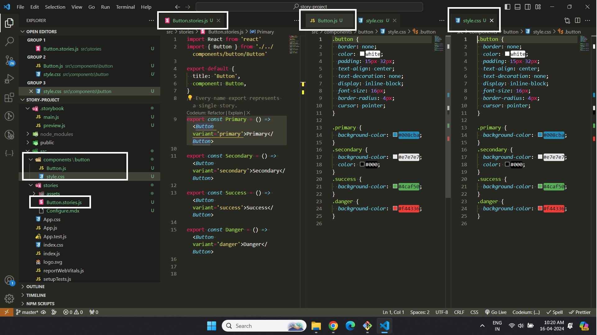
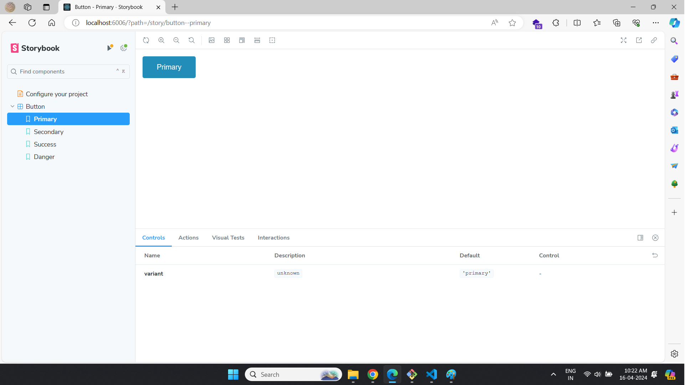
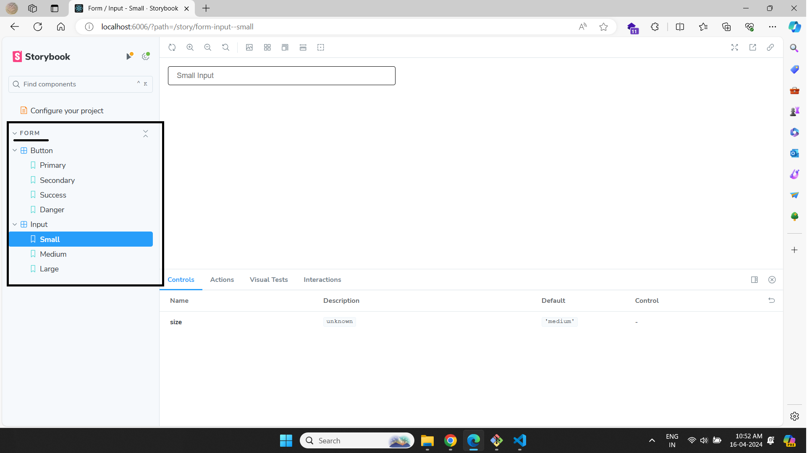
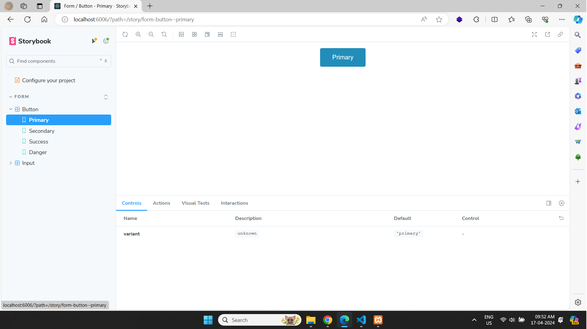
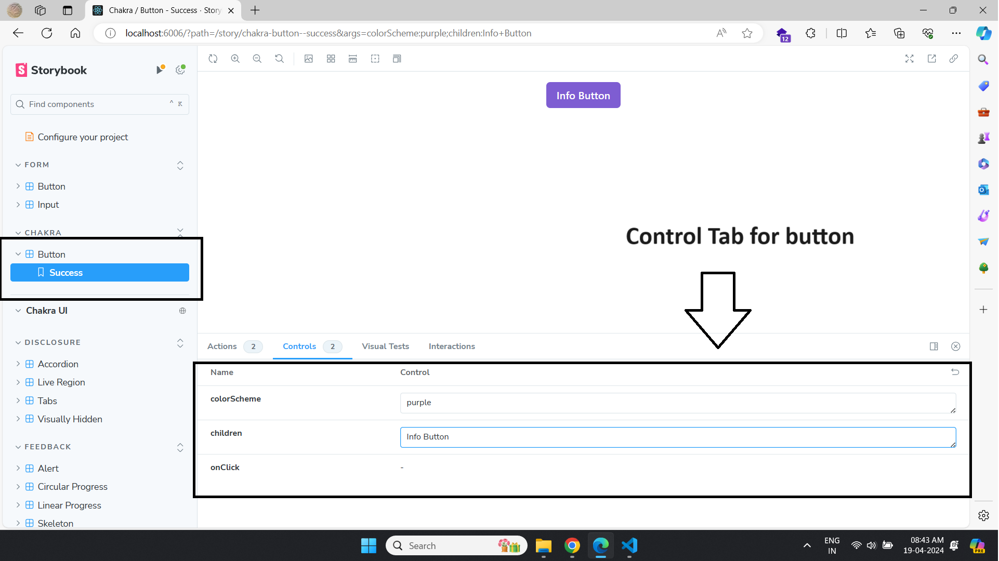
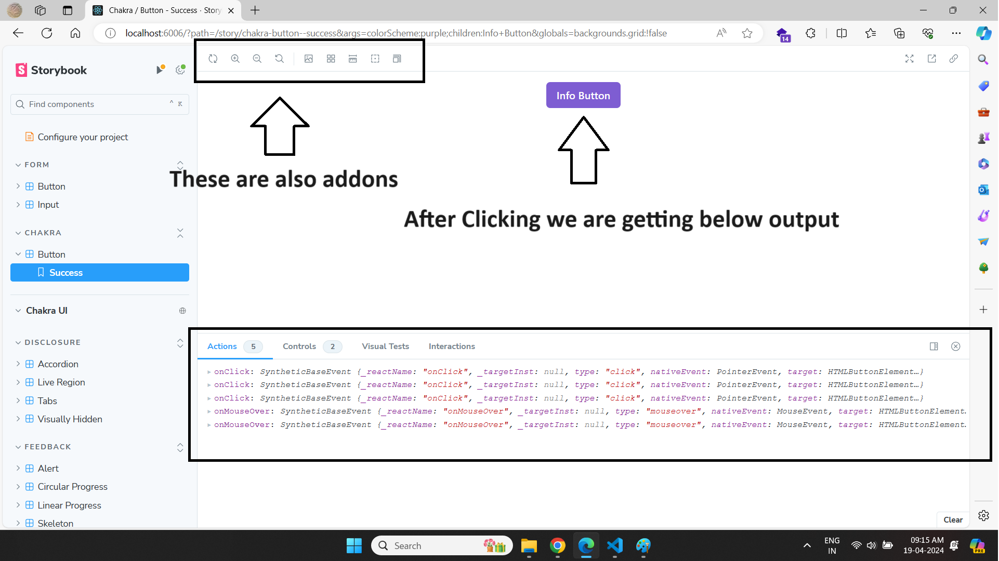
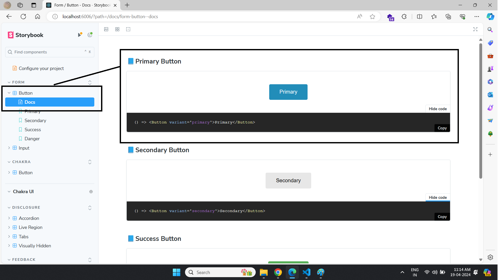
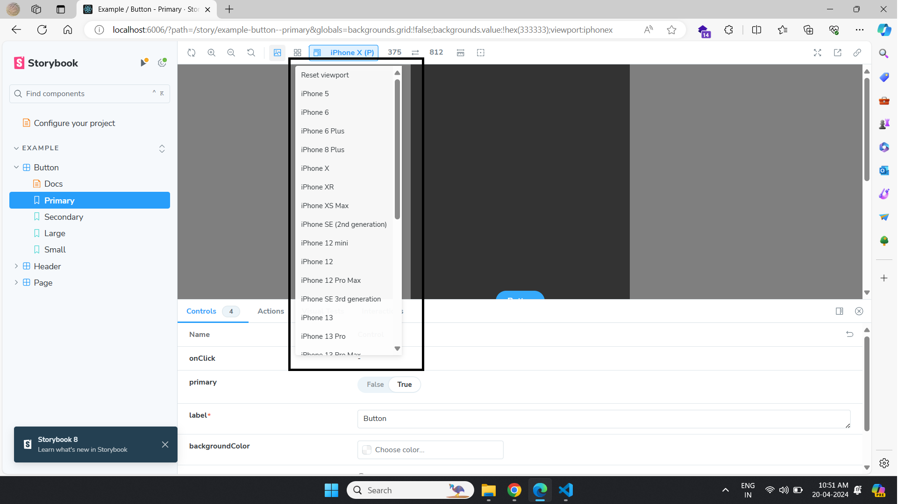
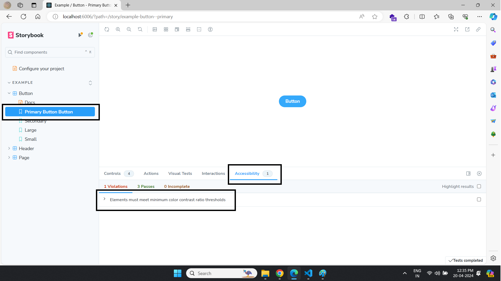
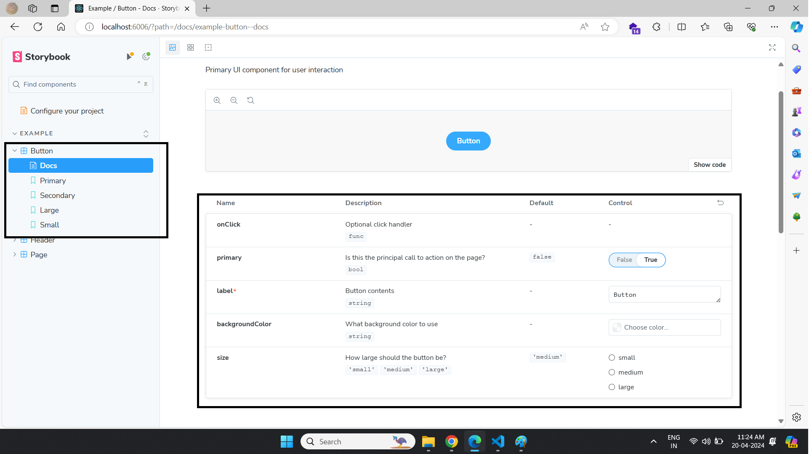

### 📘Reference Link
[Link to video tutorial playlist](https://www.youtube.com/watch?v=BySFuXgG-ow&list=PLC3y8-rFHvwhC-j3x3t9la8-GQJGViDQk)

### What and why ?
* A development environment and playground for UI components
* Create components independently.
* Showcase those components interactively in an isolated development environment.
* Ability to view the different components that have already been developed.
* View what are the different props that those developed components accept.
* Ability to visually showcase those components to your stake holders for feedback
* Dynamically change props, accessibility score

---

### 📘Installation

* This Command will create **.storybook** folder which contains **main.js** (Configuration for story file itself) & **preview.js** (configuration file for various stories files in the project)

```
npx create-react-app <project-name>
```

```
npx sb init
```
* To Run storybook
```
npm run storybook
```
**⚠️ Note:**
1. All stories files are place in  **src/stories** folder
2. Storybook only runs in development mode hence it have only devDependency.

---

### 📘Create Story
* button.js
```js
import React from 'react'
import "./style.css"

export const Button = ({ variant = 'primary', children, ...rest }) => {
    return <button className={`button ${variant}`} {...rest}>{children}</button>
}
```
* **button.css**

```css
.button {
  border: none;
  color: white;
  padding: 15px 32px;
  text-align: center;
  text-decoration: none;
  display: inline-block;
  font-size: 16px;
  border-radius: 4px;
  cursor: pointer;
}

.primary {
  background-color: #008cba;
}
.secondary {
  background-color: #e7e7e7;
  color: #000;
}
.success {
  background-color: #4caf50;
}
.danger {
  background-color: #f44336;
}
```

* **Button.stories.js**

```js
import React from 'react'
import { Button } from './../components/button/Button'

export default {
  title: 'Button',
  component: Button,
}
// Every name export represents a single story.
export const Primary = () => <Button variant='primary'>Primary</Button>

export const Secondary = () => <Button variant='secondary'>Secondary</Button>

export const Success = () => <Button variant='success'>Success</Button>

export const Danger = () => <Button variant='danger'>Danger</Button>
```

* **Command**
```
npm run storybook
```

1. when you run the above command it will go to the **main.js** (in .storybook folder) and the check various patterns of story format then pick the story to execute example stories.js etc. Then it will pick up your stories

2. The default export in story file will create side-navigation and then pick up named export for render example primary, secondary etc

3. Then it will pick up real component to render





---

### 📘Inheritance

* **Input.js**
```js
import React from 'react';
import "./style.css"

export const Input = ({ size = 'medium', ...rest }) => {
    return (
        <input className={`input ${size}`} {...rest} />
    )
}
```

* **Input.css**

```css
.input {
  display: block;
  width: 400px;
  padding-left: 1rem;
  padding-right: 1rem;
  border-radius: 0.25rem;
  border: 1px solid;
  border-color: inherit;
  background-color: #fff;
}

.small {
  height: 2rem;
  font-size: 0.875rem;
}

.medium {
  height: 2.5rem;
  font-size: 1rem;
}
.large {
  height: 3rem;
  font-size: 1.25rem;
}
```

* **Input.stories.js**

```js
import React from "react";
import { Input } from "../components/input/Input";

// To create inheritance
export default {
    title: 'Form / Input',
    component: Input
}


export const Small = () => <Input size="small" placeholder="Small Input" />
export const Medium = () => <Input size="medium" placeholder="Medium Input" />
export const Large = () => <Input size="large" placeholder="Large Input" />
```

* **Button.stories.js**

```js
// Inheritance for button code
export default {
  title: 'Form / Button',
  component: Button,
}
```



---

### 📘Using args

It is very useful when we have very long jsx

```js
// Button.stories.js
import React from 'react'
import { Button } from './../components/button/Button'

export default {
  title: 'Form / Button',
  component: Button,
  args : {
    children : "Button"   // set default value
  }
}
// Every name export represents a single story.
export const Primary = () => <Button variant='primary'>Primary</Button>

export const Secondary = () => <Button variant='secondary'>Secondary</Button>

export const Success = () => <Button variant='success'>Success</Button>

export const Danger = () => <Button variant='danger'>Danger</Button>

const Template = (args) => <Button {...args} />

export const PrimaryA = Template.bind({})

PrimaryA.args = {
  variant: 'primary',
  children: 'Primary',
}

export const SecondaryA = Template.bind({})

SecondaryA.args = {
  variant: 'secondary',
  children: 'Secondary',
}
```

### 📘Decorators(local and global)

**1. Local Decorators**

Decorators are components that wraps a story for example we want to center our all outputs

1. **Center.js**

```js
import React from 'react'
import './style.css'
export function Center({ children }) {
    return (
        <div className='center'>{children}</div>
    )
}
```
2. **style.css**

```css
.center {
  display: flex;
  justify-content: center;
  align-items: center;
}
```

3. **Button.stories.js**

```js
import React from 'react'
import { Button } from './../components/button/Button'
import { Center } from '../components/center/Center'

export default {
  title: 'Form / Button',
  component: Button,
  // its an array which return new story with wrapping decorators
  decorators: [
    (Story) => (
      // wrapping Center component around the story component
      <Center>
      {/* getting this story component from parameter */}
        <Story />
      </Center>
    ),
  ],
}
// Every name export represents a single story.
export const Primary = () => <Button variant='primary'>Primary</Button>

export const Secondary = () => <Button variant='secondary'>Secondary</Button>

export const Success = () => <Button variant='success'>Success</Button>

export const Danger = () => <Button variant='danger'>Danger</Button>
```


**2. Global**

1. create **preview.js** file **.storybook** folder

```js
import React from 'react';
import { Center } from '../src/components/center/Center';

// configuration file for various stories files in the project
/** @type { import('@storybook/react').Preview } */

const preview = {
  // add this parameter
  decorators: [
    (Story => <Center><Story /></Center>)
  ],
  parameters: {
    controls: {
      matchers: {
        color: /(background|color)$/i,
        date: /Date$/i,
      },
    },
  },
};

export default preview;
```

### 📘Apply Theming (any ui library)

We are apply theme locally

1. install chakra

```
npm i @chakra-ui/react @emotion/react @emotion/styled framer-motion
```

2. ChakraButton.stories.js

```js
import React from "react";
import { Button, theme, ThemeProvider, CSSReset } from "@chakra-ui/react";

export default {
    title: "Chakra / Button",
    component: Button,
    decorators: [
        (Story) => (
            <ThemeProvider theme={theme}>
                <CSSReset />
                <Story />
            </ThemeProvider>
        ),
    ],
}

export const Success = () => <Button colorScheme='green'>Button</Button>;

export const Danger = () => <Button colorScheme="red">Button</Button>;
```

[theme](./images/theme.png)

### 📘Addons
Addons are extra feature for storybook to make them more useful

Some Addons

1. Actions Panel (will use for passing various arguments)
2. Control Panel (will use for events)
3. Docs Panel (will show documentation of component code)
4. View Port Panel (to view various viewPorts)


### 📘Action & Control Panel

Control means props

**1.1 For Controls & Actions Panel by using args Mechanism**


* main.js (here we register our addons)

```js
// Configuration for story file itself

/** @type { import('@storybook/react-webpack5').StorybookConfig } */
const config = {
  stories: [
    "../src/**/*.mdx",
    "../src/**/*.stories.@(js|jsx|mjs|ts|tsx)",
    "../src/**/*.story.@(js|jsx|mjs|ts|tsx)"
  ],
  addons: [
    // All Addons will register here
    "@storybook/preset-create-react-app",
    "@storybook/addon-actions",
    "@storybook/addon-onboarding",
    "@storybook/addon-links",
    "@storybook/addon-essentials",
    "@chromatic-com/storybook",
    "@storybook/addon-interactions",

    //For adding view port addons
    "@storybook/addon-viewport"
  ],
  framework: {
    name: "@storybook/react-webpack5",
    options: {},
  },
  docs: {
    autodocs: "tag",
  },
  staticDirs: ["..\\public"],
};
export default config;
```

* ButtonChakra.stories.js
```js
import React from "react";
import { Button, theme, ThemeProvider, CSSReset } from "@chakra-ui/react";

export default {
    title: "Chakra / Button",
    component: Button,
    decorators: [
        (Story) => (
            <ThemeProvider theme={theme}>
                <CSSReset />
                <Story />
            </ThemeProvider>
        ),
    ],
    // this will help change argument dynamically and Control & Action tab will appear by using argTypes Mechanism
    argTypes: {
        // use for adding color feature
        colorScheme: { control: 'text' },

        // use for children props
        children: { control: 'text' },

        // use for click events
        onClick: {
            action: 'onClick',
        },
        onMouseOver: {
            action: 'onMouseOver',
        }
    }
}

const Template = args => <Button {...args} />

export const Success = Template.bind({});

Success.args = {
    colorScheme: 'green',
    children: 'success',
}
```





**1.2 For Actions Panel by using action & actions**

```js
import React from "react";
import { Button, theme, ThemeProvider, CSSReset } from "@chakra-ui/react";
import { action, actions } from "@storybook/addon-actions"

export default {
    title: "Chakra / Button",
    component: Button,
    decorators: [
        (Story) => (
            <ThemeProvider theme={theme}>
                <CSSReset />
                <Story />
            </ThemeProvider>
        ),
    ],
}

// for single-single actions
export const Success = () => <Button colorScheme='green' onClick={action("onClick")} onMouseOver={action("onMouseOver")}>Success</Button>;

// for multiple actions
export const Danger = () => <Button colorScheme='red' {...actions("onClick", "onMouseOver")}> Danger</Button >;
```

**2. For Console**

* **Command**

```
npm i @storybook/addon-console -D
```
* **Button.stories.js**

```js
import React from 'react'
import { Button } from './../components/button/Button';
import '@storybook/addon-console'

export default {
  title: 'Form / Button',
  component: Button,
}
// Every name export represents a single story.
export const Primary = () => <Button variant='primary' onClick={() => console.log("clicked")}>Primary</Button>
```


### 📘Docs Panel

1. **Package**

```
npm i @storybook/addon-docs -D
```

2. **Button.stories.js**

```js
import React from 'react'
import { Button } from './../components/button/Button'

export default {
  title: 'Form / Button',
  component: Button,
}
// Every name export represents a single story.
export const Primary = () => <Button variant='primary'>Primary</Button>

export const Secondary = () => <Button variant='secondary'>Secondary</Button>

export const Success = () => <Button variant='success'>Success</Button>

export const Danger = () => <Button variant='danger'>Danger</Button>
```

3. **Button.mdx**

```
import { Meta, Story, Canvas } from "@storybook/blocks";
import { Primary, Secondary, Success, Danger } from "./Button.stories.js";

<Meta title="Form / Button" />

### Primary Button

<Canvas of={Primary} />

### Secondary Button

<Canvas of={Secondary} />

### Success Button

<Canvas of={Success} />

### Danger Button

<Canvas of={Danger} />
```



### 📘Knobs

It is useful for change props

### 📘View Port

* To get the various options for various view ports

```js
/** @type { import('@storybook/react').Preview } */
import { INITIAL_VIEWPORTS } from "@storybook/addon-viewport"

const preview = {
  parameters: {
    controls: {
      matchers: {
        color: /(background|color)$/i,
        date: /Date$/i,
      },
    },
    // use to add parameter
    viewport: {
      viewports: INITIAL_VIEWPORTS
    }
  },

};

export default preview;
```




### 📘A11y 
This is use for accessibility (checking rules according w3c)

* Package name
```
npm install @storybook/addon-a11y
```

* add the below line in **main.js** in **addons array**

```js
"@storybook/addon-a11y"
```
* run command
```
npm run storybook
```




### 📘Environment Variable
* Add the below code in package.json
```js
"storybook": "set STORYBOOK_TEST=dark && storybook dev -p 6006",
```

* Add the below code in any story file
```js
console.log('color', process.env.STORYBOOK_TEST);
```

**⚠️ Note:** you can set any variable the  only condition need a prefix with **STORYBOOK_** example **STORYBOOK_CONSTANT_NAME**

### Best Configuration

```js
import { fn } from '@storybook/test';
import { Button } from './Button';

// More on how to set up stories at: https://storybook.js.org/docs/writing-stories#default-export
export default {
  title: 'Example/Button',
  component: Button,
  parameters: {
    // Optional parameter to center the component in the Canvas. More info: https://storybook.js.org/docs/configure/story-layout
    layout: 'centered',
  },
  // This component will have an automatically generated Autodocs entry: https://storybook.js.org/docs/writing-docs/autodocs
  tags: ['autodocs'],
  // More on argTypes: https://storybook.js.org/docs/api/argtypes
  argTypes: {
    backgroundColor: { control: 'color' },
  },
  // Use `fn` to spy on the onClick arg, which will appear in the actions panel once invoked: https://storybook.js.org/docs/essentials/actions#action-args
  args: { onClick: fn() },
};

// More on writing stories with args: https://storybook.js.org/docs/writing-stories/args
export const Primary = {
  // can set dynamic name
  name: 'Primary Button Button',
  args: {
    primary: true,
    label: 'Button',
  },
};

export const Secondary = {
  args: {
    label: 'Button',
  },
};

export const Large = {
  args: {
    size: 'large',
    label: 'Button',
  },
};

export const Small = {
  args: {
    size: 'small',
    label: 'Button',
  },
};
```
