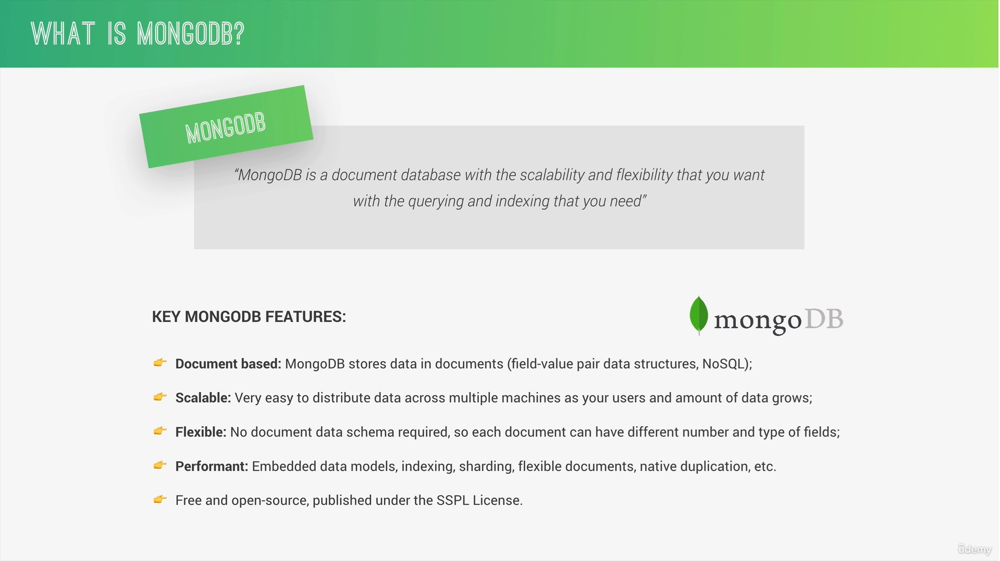
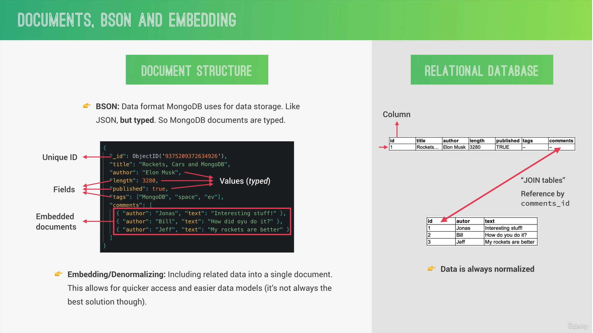

### 📘MongoDB



* MongoDb is a NoSql database (store data into objects)

* The data stored in a collection

* collection don't have a row and columns

* Data is stored in the form of object.

* Best example : in case if we want to add extra data then in sql database we have to create extra tables but on NoSql we do not need that



---

### 📘Installation

* By typing `mongosh` in any terminal like cmd, git bash etc you mongo db server will run.

* By **MongoDB Compass** its a GUI Software to access MongoDB databases just like phpMyAdmin, through this you can perform crud operations directly. It also provide terminal to execute commands

---

### 📘Commands

**Database Commands**

1. Create Database and select : this command will create database no matter database exist or not.

    ```
    use Database-name
    ```
2. To Show Databases

    ```
    show dbs
    ```


3. To Delete Database : This command will run if you have already selected a database.

    ```
    db.dropDatabase();
    ```

**Collections Commands**


1. To create Collection

    ```
    db.createCollection('tours')
    ```

2. To Show collections

    ```
    show collections
    ```

3. To Delete collection

    ```
    db.tours.drop();
    ```

**Insert Commands**

1. Create collection with single entry

    ````
    db.tours.insertOne({firstName : "Deep", lastName : "Singh"})
    ````

2. Create collection with multiple enter

    ```
    db.tours.insertMany([{"name":"Product A","price":19.99,"rating":4.5},{"name":"Product B","price":29.49,"rating":4.0},{"name":"Product C","price":9.99,"rating":3.8},{"name":"Product D","price":45.00,"rating":4.7},{"name":"Product E","price":15.75,"rating":3.9}]);
    ```

3. To see inserted data

   ```
   db.tours.find()
   ```

**Select Query**

1. To Find any record among collections (easy way)

    ```
    db.tours.find({name : "Product A"})
    ```
2. To find less then or equal to (<=) : `$` sign is use as operator in mongoDB

    ```
    db.tours.find({price : {$lte : 10}})
    ```

3. AND Query : To find less then and greater then or equal to

    ```
    db.tours.find({price : {$lt : 25}, rating : {$gte : 4}})
    ```

4. OR Query

    ```
    db.tours.find({$or :  [{ price : {$lt : 10}}, {rating : {$lte : 4}}]});
    ```

5. OR Query with selection of specific key

    ```
    db.tours.find({$or :  [{ price : {$lt : 10}}, {rating : {$lte : 4}}]}, {name : 1});
    ```

**Update Query**

1.  Update Query :

    1. first object is use to select and second one is use to set value or can insert new value

    ```
    db.tours.updateOne({ name : 'Product A'}, {$set : {price : 1000, color : white}});
    ```
    **⚠️Note :** updateOne method always update first record no matter if there are many with same conditions like name is same etc.


    2. For update many records
    ```
    db.tours.updateMany({rating : {$gt : 4}}, {$set : { isAdmin : false}});
    ```

**Delete Query**

1.  To Delete One Row

    ```
    db.tours.deleteOne({name : "Product E"})
    ```
     **⚠️Note :** deleteOne method always delete first record no matter if there are many with same conditions like name is same etc.

2. To Delete all records (be careful this command )

    ```
    db.tours.deleteMany({});
    ```
---

### 📘Select Query

```sql
SELECT name , author from authors ORDER BY name ASC
```

```
db.authors.find({}, { name: 1, author: 1, _id: 0 }).sort({ name: 1 });
```

**⚠️ Note :** in mongoose package some query write in different way like select('name author id'), sort('-price')

---


### 📘Comparison Commands

1. eq : equal

2. ne : not equal

3. gt : greater than

4. gte : greater than or equal to

5. lt : less than

6. lte : less than or equal to

7. in & or : to select defined values

    ```
    db.tours.find({ price : {$in : [10, 15, 20]}});

    db.tours.find({ price : {$or : [10, 15, 20]}});
    ```

8. nin : not in

---

### 📘logical Operators (or & and)

1. OR

    ```
    db.tours.find().or([{price : 100}, { isPublished : true }]);
    ```

2. AND

    ```
    db.tours.find().and([{price : 100}, { isPublished : true }]);
    ```

---

### 📘Regular Express

* Start with Test: It will find those authors which start with Test word.

    ```
    db.tours.find({author : /^Test/});
    ```

* End with test :  It will find those authors which end with Test word.

    ```
    db.tours.find({author : /$test/i});
    ```
* Contain test :  It will find those authors which contains Test word.

    ```
    db.tours.find({author : /.*test.*/i});
    ```
---

### 📘Count

To get Count

```
db.tours.find().count();
```

---

### 📘Pagination

```js
const pageNumber = 2;
const pageSize = 10;

db.tours.find().skip((pageNumber-1) * pageSize).limit(pageSize);
```

### 📘Update operators

1. $currentDate : Sets the value of a field to current date, either as a Date or a Timestamp.

2. $inc : Increments the value of the field by the specified amount.

3. $min : Only updates the field if the specified value is less than the existing field value.

4. $max : Only updates the field if the specified value is greater than the existing field value.

5. $mul : Multiplies the value of the field by the specified amount.

6. $rename : Renames a field.

7. $set : Sets the value of a field in a document.
 
8. $setOnInsert : Sets the value of a field if an update results in an insert of a document. Has no effect on update operations that modify existing documents.

9. $unset : Removes the specified field from a document.

