### 📘Information

1. For Node Documentations (all api's)

    ```
    https://nodejs.org/docs/latest/api/
    ```

2. Data Can be store in following modules

   1. Json-File
   2. Mysql
   3. MondoDB

3. In Node first parameter in every function (callback) will be **error** parameter and second one will be **data**. In Node when every we pass any *callback* that means that function is asynchronous function. Example when *readFile* read file completely then it will call that callback function.

    ```js
    // Example
    fs.readFileSync('./input.txt', 'utf-8', (error, data) => {
        console.log('data : ', data);
        console.log('error', error);
    })
    ```
---
### 📘Syllabus

* Module System

  * File System

  * OS

  * events

  * http

* Node Package Manager (NPM)

* Building restFull apis with express

* Asynchronous Javascript

* Storing Data into MongoDB using mongoose

* Authentication and Authorization using JWT (Json Web Token) system

* Handling and logging Errors

* Deployment

---
### 📘What is Node.js

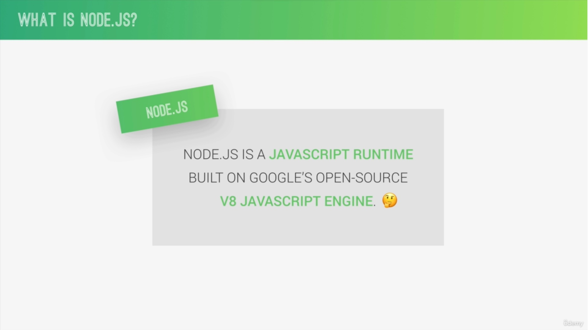


---
### 📘Node Vs Javascript

* Node is not a language or any framework. Its a runtime Environment but Code syntax of javascript and Node is same (but it is not exactly same).

* Node is single threaded language but it is async in nature.

* Build fast, highly scalable network applications (back-end) like create api, due to their non-blocking asynchronous nature. Its a default behavior of node.

* Node.js can access file system, Operating system, Database but javascript not.

* Node.js use chrome's V8 engine to execute code.

* Node.js mostly used for api and its is super fast, so we can connect the same database with web App and Mobile App.


---
### 📘Node vs Browser

* Node provide module scope while browser provide global scope. So in Node every file is Module and variables, functions are defined in that file are scoped to that module

    ```js
    // For Node
    // index-1.js
    function sum(a + b) {
      return a + b;
    }
    module.exports = sum;

    // index-2.js
    function sum(a + b) {
      return a + b;
    }
    module.exports = sum;

    // index-3.js
    function sum(a + b) {
      return a + b;
    }
    module.exports = sum;

    // For Browser
    // index-1.js
    function sum(a + b) {
      return a + b;
    }
    window.sum(1, 2);
    ```

* window, this and document object does not exist in node we will get undefined because the scope of any code only exist in current file due to module system.

* Node and Chrome both have V8 engine

* Browser functions such as console, setInterval, setTimeout these are different from javascript because window object does not exist

  ```js
  window.console.log('Hello World') // browser and this will not work in node environment
  console.log("Hello World")        // node


  var a = 10;
  window.a = 20;    // this line will not work in window
  global.a = 30     // this line will not work in window
  console.log(a)    // 30
  ```
---
### 📘Modules, Module Wrapper function Types, and Useful variables

* Every code we write in node its a module.

* There are 3 Types of Modules

  1. Inbuilt : fs. http etc

  2. User-defined : import or export type

  3. Third party modules : express

* Global & Non-Global Module : Global module are those module which we do not import and accessible all the time and Non-Global are those which we need to import to access.

    ```js
    console.log('Hello World')  // This is global module

    const fs = require('fs');   // This is non-global module
    fs.writeFileSync('hello.txt', 'Hello World');
    ```


* In Node, every file is Module so variables and functions are defined in that file are scoped to that module they are not available outside the module. see in below example module variable exist in local scope.

  ```js
  // Module wrapper function
  function(exports, require, module, __filename, __dirname) {

    // your code...

    var log = 10;

    // all are same thing
    module.exports = log;
    module.exports.log = log;
    exports.log = log;  // its a shortcut of module.export

    // don't use this
    exports = log;  // it will change the reference of module.exports
  }
  ```
* __dirname : to print current working directory.

* __filename : to print current working file name.

* path : to get current directory path (best one)

    ```js
    const path = require('path');

    const redirectToFolder = path.join(__dirname, '/any-folder-name');
    ```

**Exporting Modules**

* Exporting with using Object
  ```js
  // app.js
  function sayHello(name) {
      console.log('Hello ' + name)
  }

  module.exports.sayHello = sayHello;

  // script.js
  var app = require('./app');

  app.sayHello('John Singh')
  ```
* Exporting with names

  ```js
  // app.js
  function sayHello(name) {
      console.log('Hello ' + name)
  }

  module.exports= sayHello;

  // script.js
  var app = require('./app');

  app('John Singh')
  ```

* Export Everything
  ```js
  // index.js
  exports.sum = (a, b) => {
    return a + b;
  };

  exports.isAdmin = true;

  exports.subtract = (a, b) => {
    return a - b;
  };

  // app.js
  const d = require('./index');

  console.log(d.sum(1, 2));
  ```
---
### 📘REPL & Global variables,

1. Node terminal called REPL (Read Evaluate Print Loop), type *node* to enter into REPL & type *.exit* to exit from REPL. **.help** command is use for check all commands. Last result always store in *_* (underscore)

    ```js
        var a = 10;
        _  // 10

        var c = "Hello World";
        _  // "Hello World"

        var b = 10 + 10;
        _  // 20
    ```

2. Press **tab** key word you can see a list of global variables, You can see various methods in function constructor using **String.** then press tab, We can write any thing in terminal like js example creating variable, print output etc

3. Various global variables are `console.log()`, `setTimeout`, `setInterval`, `clearInterval` instead of this node have other.

---

## 📘Synchronous Vs Asynchronous

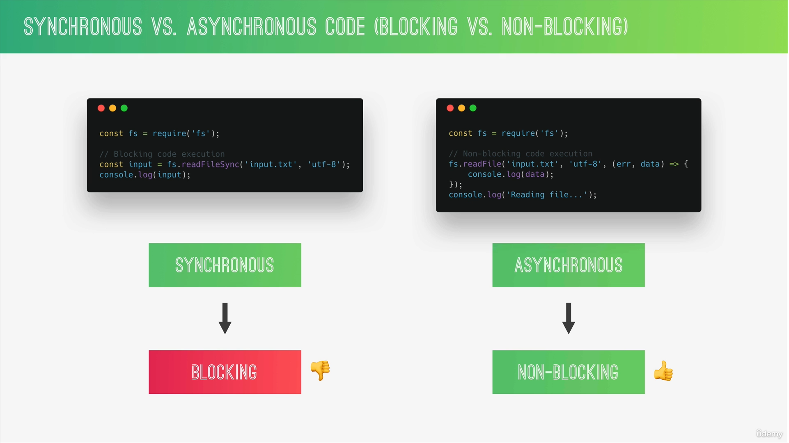


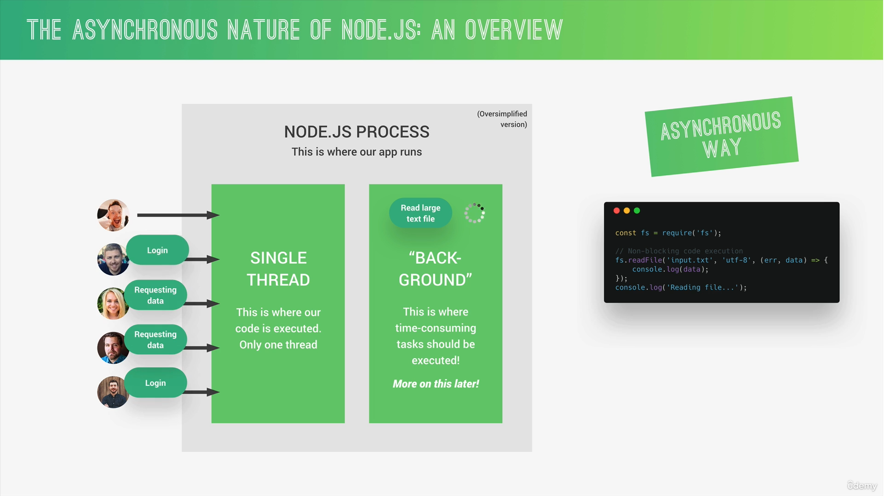

There are three ways in which we can deal with asynchronous code

1. Callbacks

2. Promises

3. Async/Await

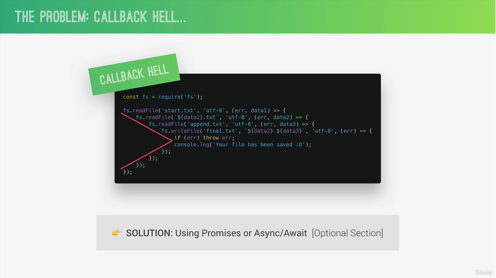


```js
// callback example
console.log("Before");

getUser(1, (user) => {
  console.log("User", user);
  getRepositories(user, (repos) => {
    getCommits(repos, (commits) => {
      console.log("Commits", commits);
    });
  });
});

console.log("After");

// to return from these functions we use callback
function getUser(id, callback) {
  setTimeout(() => {
    callback({ id: id, name: "John Doe" });
  }, 2000);
}

// to return from these functions we use callback
function getRepositories(user, callback) {
  setTimeout(() => {
    callback(["repo1", "repo2", "repo3"]);
  }, 2000);
}

// to return from these functions we use callback
function getCommits(repo, callback) {
  setTimeout(() => {
    callback(["commit1", "commit2", "commit3"]);
  }, 2000);
}
```

```js
// Named callback functions to remove callback hell
console.log("Before");

getUser(1, getRepositoriesCallback);

console.log("After");

function getRepositoriesCallback(user) {
  console.log(user);
  getRepositories(user.name, getCommitsCallback);
}

function getCommitsCallback(repos) {
  console.log("Repositories:", repos);
  getCommits(repos[0], displayCommits);
}

function displayCommits(commits) {
  console.log("Commits:", commits);
}

function getUser(id, callback) {
  setTimeout(() => {
    callback({ id: id, name: "John Doe", gitHubUsername: "johnDoe" });
  }, 2000);
}

function getRepositories(username, callback) {
  setTimeout(() => {
    callback(["repo1", "repo2", "repo3"]);
  }, 2000);
}

function getCommits(repo, callback) {
  setTimeout(() => {
    callback(["commit1", "commit2", "commit3"]);
  }, 2000);
}
```

**⚠️Note :** In real life we use mostly promises all the times. If you see callbacks hell just convert them into promises


---

## 📘Reading and Writing Files in Synchronous way VS Asynchronous way

* In file system module you will get synch and async code always. Synch files are given for simplicity (to understand) but avoid as much as you can and try async in real application because node is single threaded language & synchronous code can block that whole thread.

```js
// This 'fs' module allows us to read, write functions on files
const fs = require('fs');
```

**Synchronous Way**


* **input.txt**
```
Hello may name is Deep Singh. I am working as front end engineer. My Primary technology is React.
```

* **app.js**
```js
// default function for files
const fs = require('fs');

/*
    Read data from file
    1. First parameter is path name
    2. second parameter is character set
*/
const textIn = fs.readFileSync('./input.txt', 'utf-8');
console.log(textIn);

const textOut = `this is text which is adding through coding. ${textIn}\n Created on ${Date.now()}`;

/*
    writing content in file
    1. First parameter is path name (it wll generate new file)
    2. second parameter is write text to
*/
fs.writeFileSync('./output.txt', textOut);  // this file will generate automatically
```

```
node app.js
```

**Asynchronous Way**

* **input.txt**
```
Hello may name is Deep Singh. I am working as front end engineer. My Primary technology is React.
```

* **Reading Data**

```js
console.log('Execute Start');

const fs = require('fs');

/*
    Read data from file
    1. First parameter is path name
    2. second parameter is character set
    3. Third is callback
*/

fs.readFile('./input.txt', 'utf-8', (error, data) => {
    if (error) {
        return console.log('Error !!! file not found')
    }
    console.log('data : ', data);
    console.log('error', error);

    /*
        Write data into file
        1. First parameter is path name
        2. second parameter is character set
        3. Third is callback
    */

    fs.writeFile('./output.txt', data + ' Coming data from async code', 'utf-8', err => {
        console.log('Your fetch file and code written successfully');
    })
})

console.log('Executed End');
/*
  Execute Start
  data :  Hello may name is Deep Singh. I am working as front end engineer. My Primary technology is React.
  error null
  Your fetch file and code written successfully
*/
```

**⚠️Note :** If we do not pass *'utf-8'* as parameter then it will return *Buffer* instead of text. This Buffer means its data is saved into temporary memory.

---
### 📘Create Files and Directory

```js
const path = require('path');
const fs = require('fs');
const directoryName = 'files';

fs.mkdirSync(directoryName);

const dirPath = path.join(__dirname, directoryName);
for (let i = 1; i <= 5; i++) {
  fs.writeFileSync(`${dirPath}/file-${i}.txt`, 'hello world');
}

fs.readdir(dirPath, (err, files) => {
  if (err) {
    console.log(err);
  } else {
    files.forEach((file) => {
      console.log(file);
    });
  }
});
```

**⚠️Note :** When ever we run node in any folder it will create that folder as web server or kind of server therefore we cannot access any files outside of this server like in D drive, C Drive etc it is good other wise hacker can easily access your data.

---
### 📘Getting inputs from command line

* You can get parameters from terminal in node using ```process.argv``` (argument Vector). It will return array in which first two elements are predefined.

* index.js

    ```js
    // index.js
    const fs = require('fs');

    const action = process.argv[2];
    const fileName = process.argv[3];
    const fileContent = process.argv[4];

    if (action === 'add') {
        fs.writeFileSync(fileName, fileContent, (err) => {
            if (err) {
            console.log(err);
            } else {
            console.log('File created successfully');
            }
        });
    } else if (action === 'remove') {
        fs.unlinkSync(fileName, (err) => {
            if (err) {
            console.log(err);
            } else {
            console.log('File removed successfully');
            }
        });
    } else {
        console.log('Invalid action');
    }
    ```

* Command

    ```
    node index.js add hello.txt 'Hello World from react'

    node index.js remove hello.txt
    ```
---
## 📘Creating a Simple Web Server with server response

This built-in http module, which allows you to create an HTTP server.

```js
const http = require('http');
```

* Steps to build server

  1. Create a server

  2. Start a server to consume


```js
// app.js
const http = require('http');

/*
    use to create server
    1. First parameter will be request Parameter
    2. Second Parameter will be response Parameter
*/

// creating server
const server = http.createServer((request, response) => {

    // use to send response to client
    console.log(request)

    // use to send response to client
    response.end('Hello from server!');
});

/*
    use to create server
    1. First parameter will be Port Number
    2. Second Parameter will be callback
*/

// Listening request
server.listen(8000, '127.0.0.1', () => {
    console.log('Listening to request on port 8000');
});
```

**⚠️Note :** This code `const server = http.createServer()` This **server** variable is eventEmitter so you can do this `server.on`, `server.addEventListener`, `server.emit`.


* Run Command
```
node index.js
```

* Hit this address in google chrome
```
http://127.0.0.1:8000
```

**⚠️ Note :** if you mention other the *80* then we have to write complete address example http://127.0.0.1:8000 otherwise we don't need to add port number you can write like http://127.0.0.1 only

---

### 📘Routing using Http Module & Returning json Data

```js
const http = require('http');
const fs = require('fs');


/* This code will run only once */
const data = fs.readFileSync('./product.json', 'utf-8');
$responseBody = data;


/* this code will run again and again because it is in callback function of http.createServer so when ever we hit request this call back function will be executed */
const server = http.createServer((request, response) => {

    const pathName = request.url;

    if (pathName === '/' || pathName === '/overview') {
        response.end('Welcome to our homepage');
    } else if (pathName === '/about') {
        response.end('Welcome to our about page');
    } else if (pathName === '/product') {
        // sending json data

        $statusCode = 200;
        $headers = {
            'Content-type': 'application/json',
        }

        response.writeHead($statusCode, $headers);
        response.end($responseBody);

    } else {
        // sending html data

        $statusCode = 404;
        $headers = {
            'Content-type': 'text/html',
            'my-own-header': 'hello-world'
        }
        $responseBody = '<h1>page not found</h1>';

        response.writeHead($statusCode, $headers);
        response.end($responseBody);
    }
});

server.listen(8000, '127.0.0.1', () => {
    console.log('Listening to request on port 8000');
});
```
---
### 📘Node Vs Npm, Package.json, Commands for Packages, Types of Packages, Version, Version Indicators

* **Node Vs Npm**

   1. node and npm are different things npm stands for node package manager. This thing get install automatically to deal with packages while node is run time environment.

   2. `node -v` to check version of node & `npm -v` to check version of npm (their version can be different from each other)


* **Install package.json file**

  ```
  npm init -y
  ```

* **Various Commands**

    1. To Install specific Package :

       ```
       npm i <package-name>
       ```

    2. Install package with specific version : example npm i @4.1.1 or npm i @4 (it will install best version related to 4). This is also called downgrade version.

        ```
         npm i <package-name>@<version-number>
        ```

    3. Install multiple packages

       ```
       npm i <package-name> <package-name> ...
       ```

    4. To Remove package :
        ```
        npm r or npm uninstall or npm un <package-name>
        ```
    5. To update the packages :
        ```
        npm update <package-name>
        ```

    6. To check outdate package : run this command in terminal directly. If all the packages are update to date then this command will not return any thing.
        ```
        npm outdated
        ```
        Example : suppose this is not latest version of  "express": "^2.3.0" then the above command will return you latest **current, wanted, latest**, current means current version, wanted means which us near to "^2.3.0" because of cap sign and latest means full latest.

        

    7. To check installed packages with their versions

        See local packages list without depth

          ```
          npm list
          ```

          ```
          npm list --depth=0
          ```
        See local packages list without depth

          ```
          npm list -g
          ```

        See list with depth

          ```
          npm list --depth=1
          ```

    8. To check complete detail of package:

        Complete information about package
        ```
        npm view <package-name>
        ```

        Show current version
        ```
        npm view <package-name> -v
        ```

        Show installed packages dependencies
        ```
        npm view <package-name> dependencies
        ```

        Show all installed packages histories
        ```
        npm view express <package-name>
        ```

    9. To publish package : follow these steps

        ```
        npm login
        ```
        ```
        username :
        ```
        ```
        password :
        ```
        ```
        email :
        ```
        ```
        npm publish
        ```

    10. Updating a published package : Do changes and then run command according to change like minor, major, patch

        ```
         npm version minor
        ```

        ```
         npm publish
        ```
**⚠️Note :** package-lock.json file is also very important file because it store the versions of the dependency packages.

* **Type of packages**

  * **Normal Dependency :** These are those packages which provide core functionality to run application, **without these packages we cannot run our applications**.

  * **Dev Dependency :** These package are those packages which provide just additional features while developing application in development mode, **without these package we can run our applications as well.**


* **Versions** : This Indicate version of the package this will be like **MajorVersion.MinorVersion.PatchVersion** (12.3.11)

    * Patch Version : it defines that its only fix bugs.

    * MinorVersion : It defines that it introduce new feature but it does not include breaking changes

    * MajorVersion : It defines that its a huge change which can have breaking changes

  * **Version Indicator :**

    * *: Matches any version of the package. It is the most permissive and allows any update, regardless of major, minor, or patch changes. (not good one can lead to breaking changes code)

    * ^ (caret): Allows updates that do not change the first non-zero number (Major Version). For example, ^1.2.3 will allow updates to 1.x.x but not 2.x.x. It is more permissive.

    * ~ (tilde): Allows updates that do not change the minor version number (Patch version). For example, ~1.2.3 will allow updates to 1.2.x but not 1.3.x. It is more restrictive.(this one is more save because its only accept patches)

    * Exact Version : "1.1.1" it will download exact version
---

### 📘Some useful packages


1. **Slugify :** it is use to make readable url's. It is basically a function use to create slugs, slugs is basically just the last part of the url that contains a unique string that identify the resource that the website is displaying example 127.0.0.1:8000/product/**fresh-avocados** (in simple words use slugs instead of numbers like ?id=1 use this ?id=fresh-avocado).

    ```
    npm i slugify
    ```

    ```js
    const slugify = require('slugify');
    console.log(slugify('Some Title', { lower: true }));    // some-title
    ```


    Check the documentation for various options

2. **Nodemon :** called Node Monitor,  It helps node js applications by automatically restarting when ever we change some files. (here index.js file will be server file)

    ```js
    "scripts": {
        "start": "nodemon index.js"
    },
    ```

    **⚠️Note :**

    1. when you want to run any thing locally you have to write command under **scripts** otherwise in case of global install you will write direct command example : *nodemon index.js*

    2. **start** is kind of default one for development you we can write *npm start* instead of *npm run start*

---

### 📘What Happen when we access a webpage

Now, in order to get a better understanding of how the web actually works, let's start by asking the question: ‫What does actually happen each time ‫that we type a URL into our browser ‫in order to open up a new webpage? ‫Or each time that we request data from some API? ‫Which is actually quite the same ‫and so let's just focus on a simple website example here. ‫Well, the most simple answer is that our browser ‫which is also called a client sends a request ‫to the server where the webpage is hosted. ‫And the server will then send back a response, ‫which is gonna contain the webpage that we just requested. **And this process is called the request-response model or also the client-server architecture**.

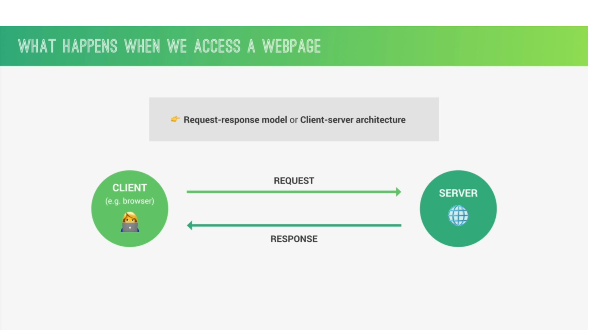


Now let's say that we wanna access Google Maps by writing google.com/maps into our browser as the URL. ‫And every URL gets an HTTP or HTTPS, ‫which is for the protocol that will be used ‫on the connection. ‫‫Then we have the domain name here, ‫which is google.com in this case, ‫and also after a slash, the so-called resource ‫that we're going to access, ‫and in this case, /maps. ‫Now what you need to know here is that the domain name ‫like google.com is not actually the real address ‫of the server that we are trying to access ‫but just a nice name that is easy for us to memorize. ‫So we need a way of kind of converting the domain name ‫to the real address of the server ‫and that happens through a DNS. ‫So DNS stands for Domain Name Server, ‫which are special servers that are basically ‫like the phone-books of the internet.

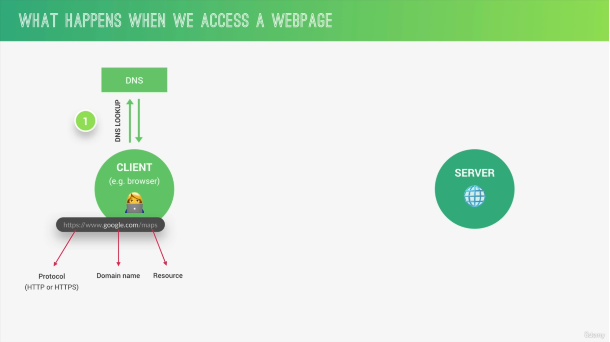


So the first step that happens when we open up a website is the the browser makes a request to a DNS and this special server will then simply match the web address that we typed into the browser to the server's real IP address. Actually this happens through your internet service provider or ISP ‫but the complete details don't really matter for us. What you need to retain from this part is that the domain is not the real address and that a DNS will convert it to that real IP address, which a browser can then call after it being sent back to our browser.

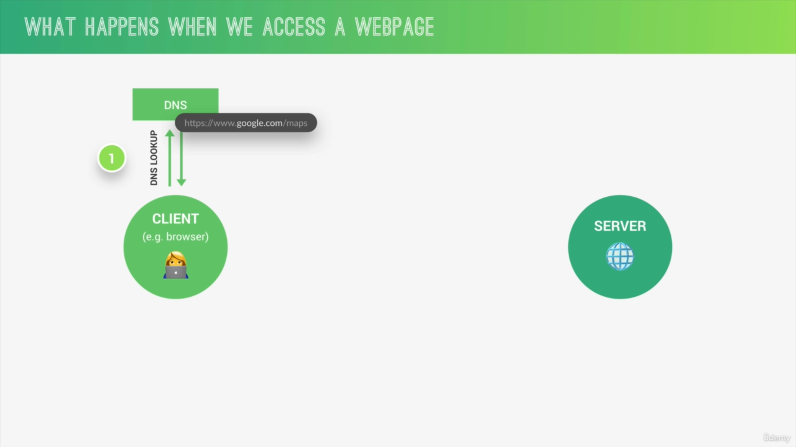


So this is how the real address looks like, so it still has the protocol, but then comes the IP address. And also the port that we accessed on the server. And the port number is really just to identify a specific service running on a server and so you can think of it like a sub-address. Remember how we listened to port 8000 on our web server when we set it up in the intersection that is exactly what this port is. Also please note that the port number has nothing to do with the Google Maps resource that we want to access. That resource will actually be sent over in the HTTP request as we will see in a moment.


So once we have the real web address, ‫a TCP socket connection is established ‫between the browser and the server, ‫which are now finally connected. ‫And this connection is typically kept alive ‫for the entire time it takes to transfer ‫all the files of the website. ‫Now, what are our TCP and IP? ‫Well, TCP is the Transmission Control Protocol ‫and IP is the Internet Protocol, ‫and together they are communication protocols ‫that define exactly how data travels across the web. ‫So they're basically ‫the internet's fundamental control system, ‫because, again, they are the ones who set the rules about how data moves on the internet.

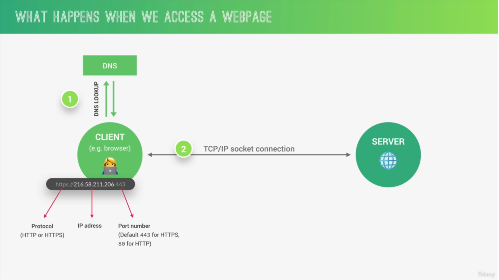


Anyway, now it's time to finally make our request. And the request that we make is an HTTP request ‫where HTTP stands for HyperText Transfer Protocol. ‫So after TCP/IP, HTTP is yet another communication protocol. ‫And by the way, a communication protocol ‫is simply a system of rules ‫that allows two or more parties to communicate. ‫And in the case of HTTP, it's just a protocol ‫that allows clients and web servers to communicate ‫by sending requests and response messages ‫from client to server and back.

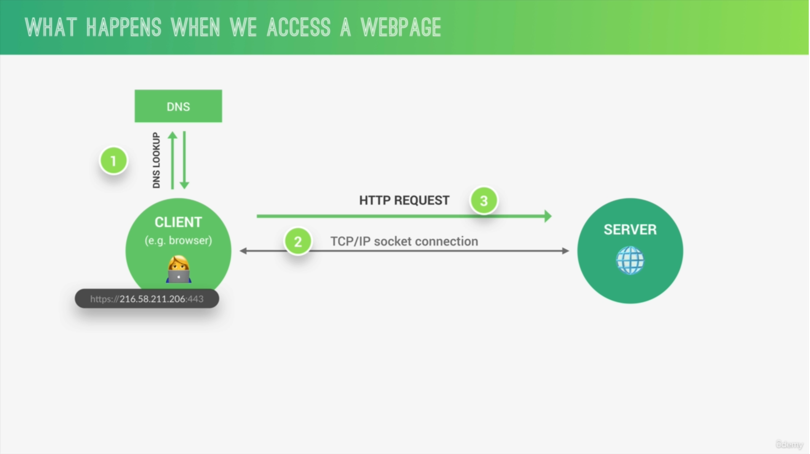

So Now, a request message will look something like this. ‫So the beginning of the message is the most important part ‫called the start line, which contains the HTTP method ‫that's used in the request, ‫then the request target and the HTTP version. So about HTTP methods, there are many available ‫but the most important ones are get ‫for simply requesting data, post for sending data and put and patch to basically modify data.‫So you see an HTTP request to the server is not only for getting data but we can also send data. Anyway, about the request target, this is where the server is thought that we want to access the maps resource in this example. Remember that? So we had /maps in our URL and now it's sent as the target in the HTTP request so that the server can then figure out what to do with it. ‫And if this is empty, so if it was just a slash, basically, ‫then we would be accessing the website's root ‫which would be just google.com in this example. ‫Then the next part of the request are the request headers ‫which is just some information that we send ‫about the request itself, ‫and there are tons of different headers available ‫like what browser is used to make the request, ‫at what time, the user's language and many, many others. ‫Finally, in the case we're sending data to the server, ‫there will also be a request body containing that data, for example, coming from an HTML form.‫ So that is the HTTP request.

‫Now, of course, it's not us developers who manually write these requests but it's still extremely important that you understand what an HTTP request and also a response look like because you will be working with them a ton, okay? Also, I want to mention that there's also HTTPS as you probably know. And the main difference between HTTP and HTTPS is that HTTPS is encrypted using TLS or SSL, which are yet some more protocols but I'm not gonna bore you with these. But besides these additional encryption, the logic between HTTP requests and responses still applies to HTTPS. All right, so our request now hits the server, which will be working on it until it has our website ready to send back. And it will send it back using, as you can guess, an HTTP response.

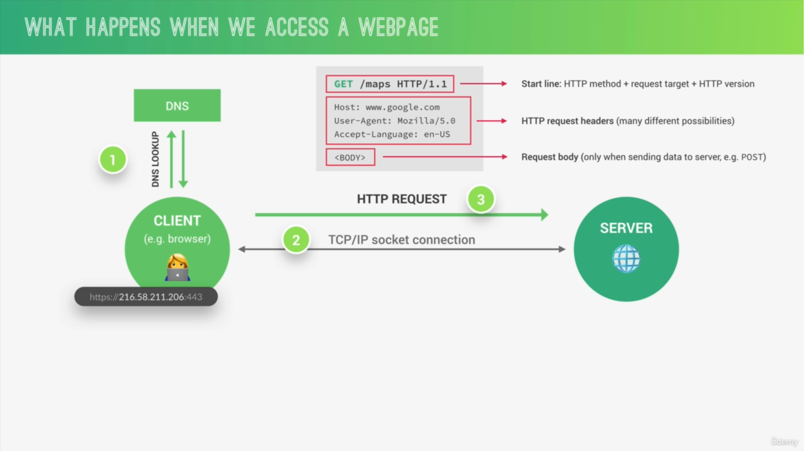

And the HTTP response message actually looks quite similar to the request. ‫So also with a start line, headers and a body. The start line has, besides the HTTP version, ‫a status code and a message. ‫So, basically, to let the client know ‫whether the request has been successful or not. ‫This 200, for example, means okay, ‫and the one that everyone knows is status code 404 ‫which means not found. ‫And so this is where this 404 code ‫that you already knew comes from. ‫Then the response headers or information ‫about the response itself. ‫So just like before, and there are a ton available ‫and we can also actually make up our own headers. ‫Now, what's different about response headers ‫is that it's actually the back-end developer like you ‫who specifies them and sends them back in the response. ‫All right. ‫Finally, the last part of the response ‫is, again, the body, which is actually present ‫in most responses. ‫And it's also the developer who specifically sends back ‫the body in the response. ‫And we actually already did this back in the intersection ‫using response.end, remember? ‫And the body should usually contain the HTML of the website ‫we requested or, for example, JSON data coming back ‫from an API or something like that. ‫So we talked in great detail ‫about the most important parts here, ‫which are the HTTP request and the response. ‫But in our imaginary example, we only just did one request ‫to google.com and got one response. ‫However, if it's a website that we're trying to access, ‫there will be many, many more requests and responses. ‫And that is because when we do the first request, ‫all we get back is just the initial HTML file, ‫that file will then gets scanned for all the assets ‫that it needs to build the entire website ‫like JavaScripts, CSS files, image files or other assets. ‫And for each of these different files, ‫the browser will then make a new HTTP request to the server. ‫So, basically, this entire back and forth ‫between client and server that it just explained ‫happens for every single file ‫that is included in the website. ‫There can, however, be multiple requests and responses ‫happening at the same time. ‫But the amount is actually limited ‫because, otherwise, the connection would start to slow down. ‫Okay, and then finally, when all the files have arrived, ‫the website is rendered in the browser ‫according to the HTML, CSS and JavaScript specifications that you might already know.

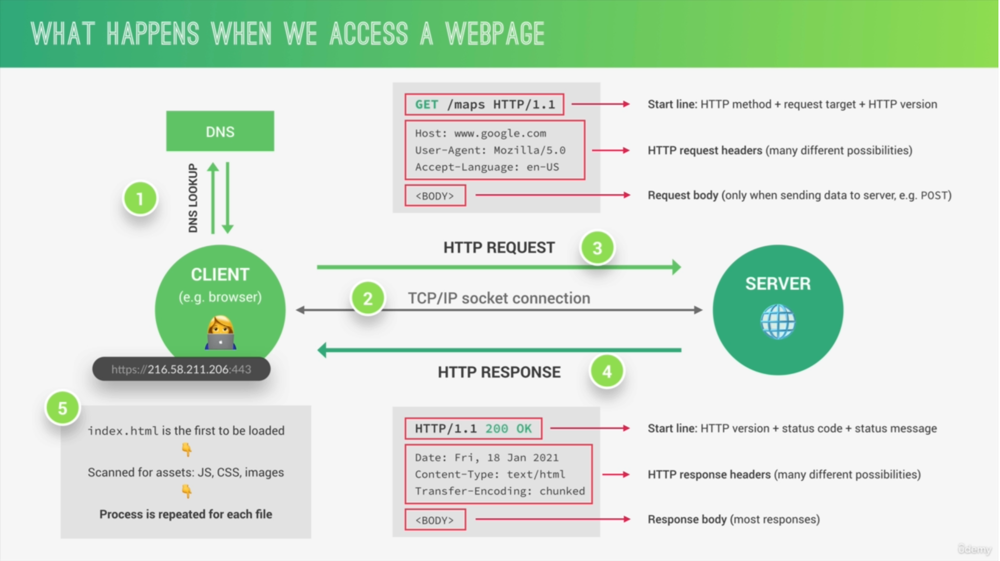

here is what you need to know. First, the job of TCP is to break out the requests ‫and responses into thousands of small chunks called packets ‫before they are set. ‫Then once they get to their destination, ‫it will reassemble all the packets ‫into the original request or response ‫so that the message arrives at the destination ‫as quick as possible, which would not be possible ‫if we sent the website as one big chunk. ‫So that would be like trying to go ‫through dance traffic with like the biggest bus ‫that you can imagine. ‫So, not a good idea. ‫Now, at the second part, the job of the IP protocol ‫is to actually send and route all of these packets ‫through the internet. ‫So it ensures that all of them arrive at the destination ‫that they should go using IP addresses on each packet. ‫And again, this is just a very broad overview ‫of what really happens behind the scenes of the web, ‫because that is actually way too much information ‫than you actually need in order to become ‫a great back-end developer. ‫But I hope that you still found this information useful ‫and interesting, and also not all too confusing. ‫Now, in the next video, we will then actually do ‫some HTTP requests so that you become a bit more familiar ‫with the protocol.


---

### 📘Static Vs Dynamic Vs API

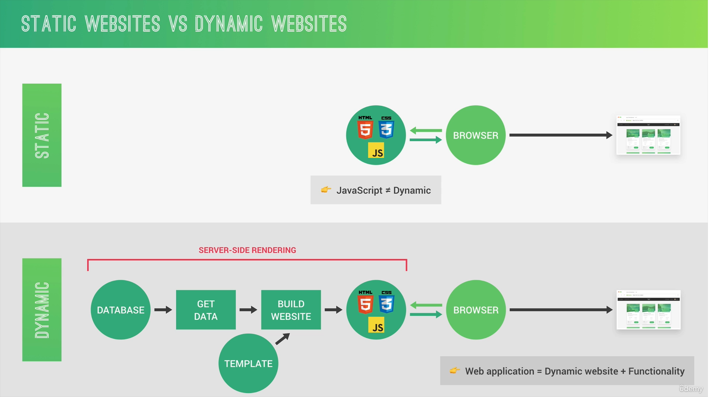


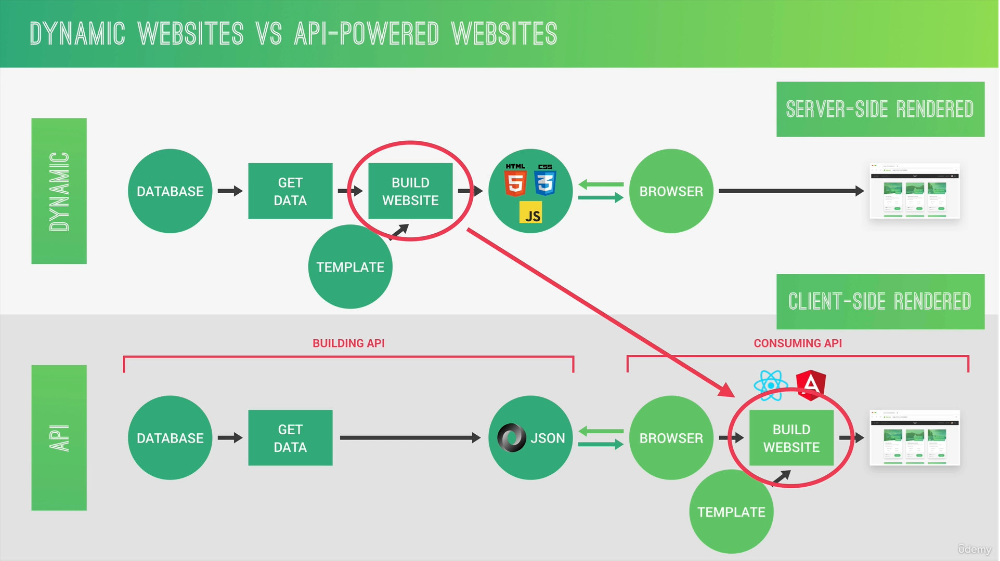

API : Application Programming Interface: a piece of software that can be used by another piece of software, in order to allow applications to talk to each other.


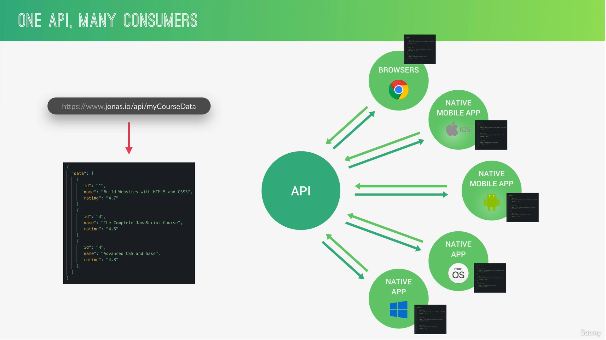

---

### 📘Node Architecture and Node Thread

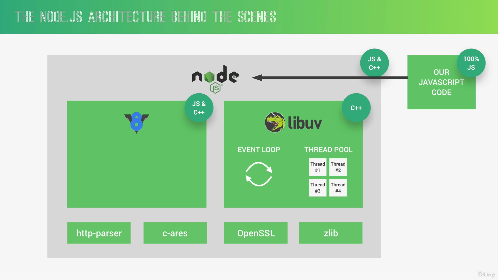

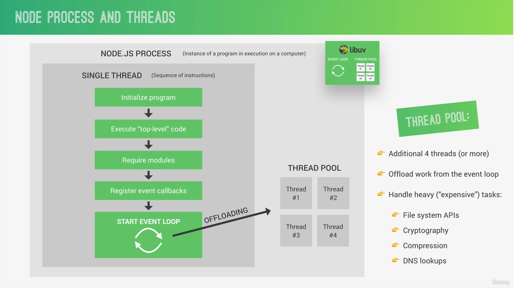

---

### 📘Asynchronous

This is same as in javascript

---

### 📘Whats is express and why use it and Basic Code

* You can check document for more details.

* Its is complete replacement of http package for routing

* Express is minimal **node.js framework**, a higher level of abstraction and it is built on the node.js

* Express contains a very robust set of features: complex routing, easier handling of request and response, middlewares, server-side rendering etc.

* Express allows for rapid development of node.js application. we don't have to re-invent the wheel;

* Express makes it easier to organize our application into the MVC architecture.

* Core Fundamentals of express is Middlewares. Express is al about middlewares. Example app.use(express.json()) this method read the request and if there is json object in the body then it will parse the body object into a json object then it will set to req.body property

Basic Code

* Install package name

    ```
    npm i express
    ```

* Package.json

    ```js
    "scripts": {
        "start": "node app.js"
    }
    ```

* app.js

    ```js
    const express = require('express');

    // call express to create app
    const app = express();

    // this is a middleware
    app.use(express.json())

    // Routes with http method (this callback function use for request and response is also a middleware)
    app.get('/', (req, res) => {
        // return type of res.send() is string
        res.send('Hello World')

        //OR

        // return type of res.json() is object with convert into string
        res.status(200).json({ message: 'Hello World' });
    });

    // listen to port
    const port = 3000;
    app.listen(port, () => console.log(`Server started on port ${port}...`));
    ```

* command

  ```
  npm run start
  ```
---

### 📘API and Rest Architecture

* Application Programming Interface: a piece of software that can be used by another piece of software, in order to allow applications to talk to each other.


* Why json is used

  * Its very light weight can easily transfer on internet.

  * Every one is using and readable for humans and computers as well.

  * Right now it is majorly use in every softwares.


Rest Architecture

1. Separate API into logic

2. Expose Structure resource-based URL's

3. Use HTTP methods (verb)

4. Send Data as JSON (usually)

5. Be Stateless

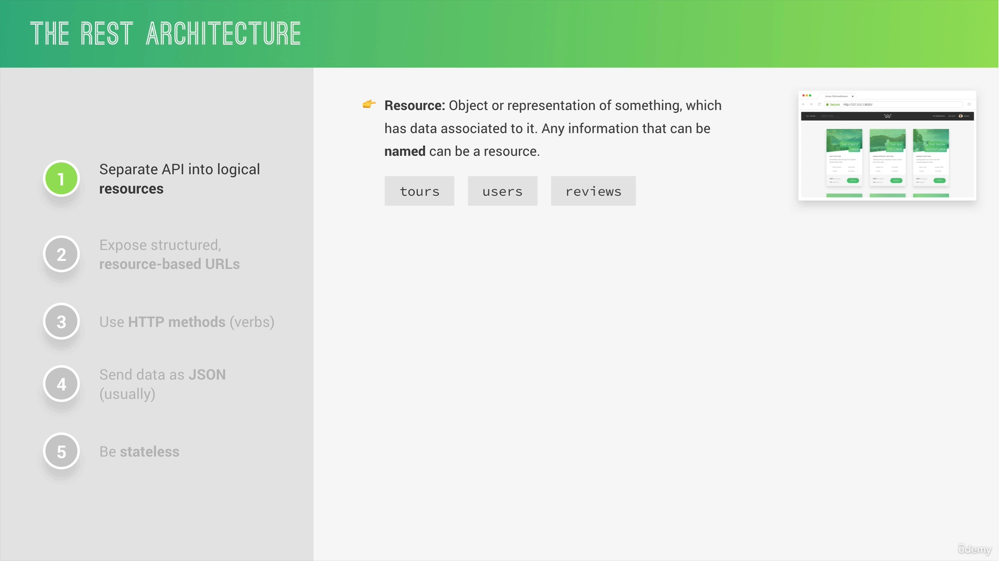

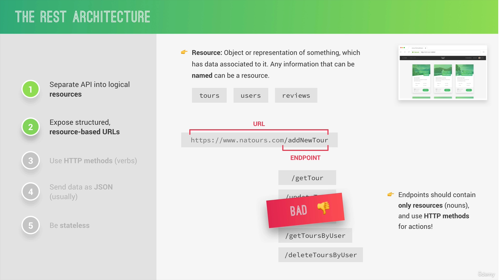

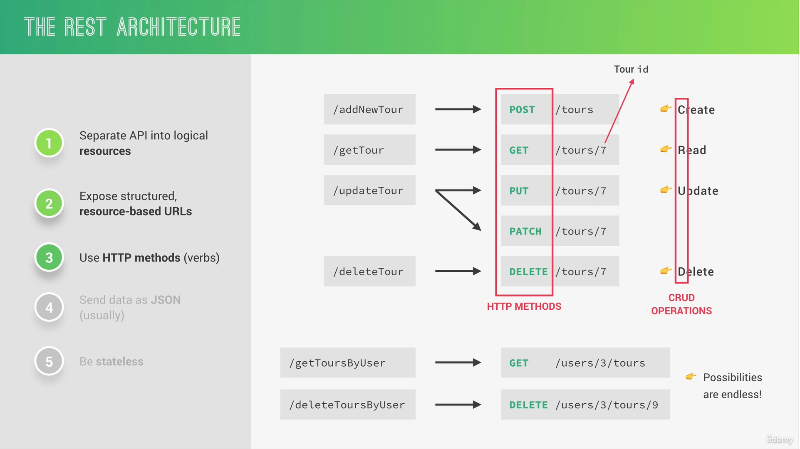

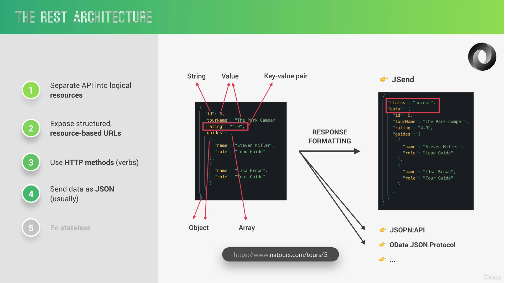

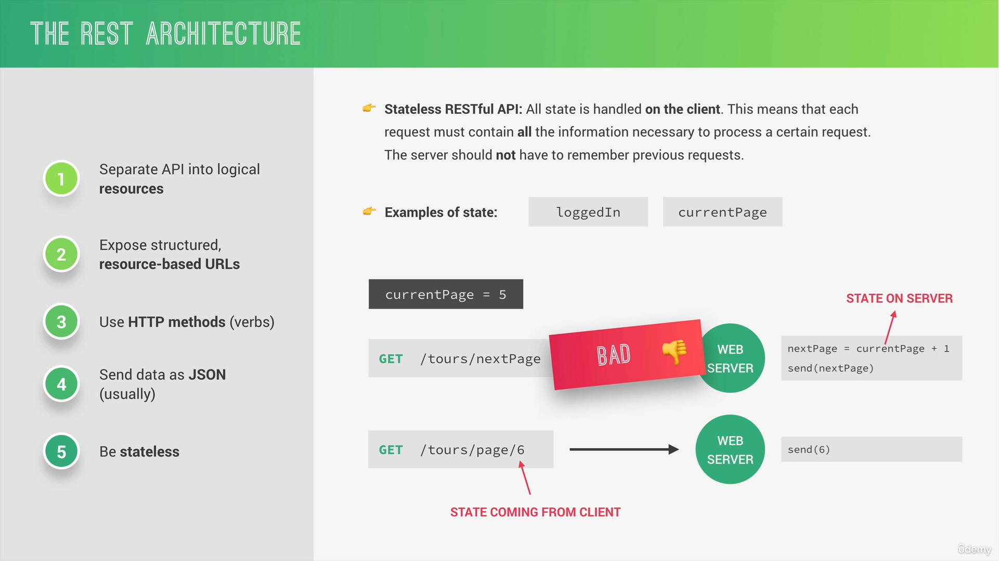

**⚠️Note :**

1. major advantage of these rest full methods is that we can apply all method on same route

2. Always use return statements while sending response.

---

### 📘Get Method with express (show json data and html page)

* user.json

    ```js
    {
        "firstName": "John",
        "lastName": "Doe",
        "email": "joe@doe",
        "password": "joe123"
    }
    ```

* app.js

    ```js
    const express = require('express');
    const fs = require('fs');

    const app = express();

    const user = JSON.parse(fs.readFileSync(`user.json`, 'utf-8'));

    // for json
    app.get('/', (req, res) => {
       return  res.status(200).json({
            status: 'success',
            data: {
            user,
            },
        });
    });

    // for html
    app.get('/', (req, res) => {
        return res.status(200).send('<h1>Hello from express</h1>');
    });

    const port = process.env.PORT || 3000;
    app.listen(port, () => {
        console.log(`App running on port ${port}...`);
    });
    ```
    **⚠️Note :** you can create links as well using same href tag


* package.json

    ```js
    "scripts": {
        "start": "node app.js"
    }
    ```
---

### 📘Post Method with express

* app.js

  ```js
  const express = require('express');

  const app = express();
  // its a middleware to use body parser (it is use to enabling parsing of json object in the body of request)
  app.use(express.json());

  // this is use if body data send in x-www-form-urlencoded
  app.use(express.urlencoded({ extended: true }));0

  app.post('/', (req, res) => {

    // all data come into req.body for json & urlencoded
    console.log(req.body);

    return res.status(200).send('Hello World');

  });

  const port = process.env.PORT || 3000;
  app.listen(port, () => {
    console.log(`App running on port ${port}...`);
  });
  ```

* From postman

  ```js
  {
      "username" : "John"
  }
  ```


**⚠️Note :**

1. Body-Form:

  * Description: The body-form refers to sending data as JSON or another format in the request body. It's commonly used in APIs where you need to send structured data, like a JSON object.

  * Content-Type: Typically application/json.

  * Example: Sending **{ "name": "John", "age": 25 }** as data.

  * Usage: Suitable when you need to send complex data structures.

    ```js
    // JSON data in body-form
    {
      "username": "john",
      "password": "secret123"
    }
    ```

2. Form-URL-Encode:
  * Description: The form-url-encode sends data as key-value pairs, similar to how data is sent in a URL query string, but in the request body. It's commonly used for submitting HTML forms.

  * Content-Type: application/x-www-form-urlencoded.

  * Example: Sending **name=john&age=25** as data.

  * Usage: Often used when sending simple form data or working with traditional web forms.

    ```
    // Data in form-url-encode
    username=john&password=secret123
    ```

Key Difference:

 * Body-Form is for more complex data.

 * Form-URL-Encode is for simpler, form-like data.

```js
// Body-form example
fetch('https://example.com/api/login', {
  method: 'POST',
  headers: {
    'Content-Type': 'application/json'
  },
  body: JSON.stringify({
    username: 'john',
    password: 'secret123'
  })
});

// Form-url-encode example
fetch('https://example.com/api/login', {
  method: 'POST',
  headers: {
    'Content-Type': 'application/x-www-form-urlencoded'
  },
  body: 'username=john&password=secret123'
});
```


---

### 📘Params and Query Params in address-bar with express

* Params are use when parameter are required while query params are use when parameters are optional example : xyz.com/isAdmin/true?age=18

```js
const express = require('express');

const app = express();

// its a middleware to use body parser
app.use(express.json());

app.post('/:id/:name/:age?', (req, res) => {

  // This is for normal params (age is optional parameter)
  console.log(req.params);      // { id: '1', name: 'john', age: '24' }
  // This is for query params
  console.log(req.query);       // { testing: 'true' }

  return res.status(200).send('Hello World');
});

const port = process.env.PORT || 3000;
app.listen(port, () => {
  console.log(`App running on port ${port}...`);
});
```

```
http://127.0.0.1:3000/1/jhon/24?testing=true
```
---

### 📘Patch Request using express


* Put : is use for update the whole object.

* Patch : is use for update the some properties.


```js
const express = require('express');
const app = express();

app.use(express.json()); // Middleware to parse JSON bodies

// Sample data - a list of users
let users = [
  { id: 1, name: 'Alice', age: 25 },
  { id: 2, name: 'Bob', age: 30 },
  { id: 3, name: 'Charlie', age: 35 },
];

// PATCH endpoint to update a user's age
app.patch('/users/:id', (req, res) => {
  const userId = parseInt(req.params.id);
  const { age } = req.body;

  // Find the user by ID
  const user = users.find((u) => u.id === userId);
  if (!user) {
    return res.status(404).send('User not found');
  }

  // Update the user's age
  if (age !== undefined) {
    user.age = age;
  }

  return res.send(user);
});

// Start the server
const port = 3000;
app.listen(port, () => {
  console.log(`Server is running on port ${port}`);
});
```

```
http://127.0.0.1:3000/users/1
```

```js
// postman value
{
    "age" : "63"
}
```
---

### 📘Delete method using express

* use Delete method

---

### 📘All Methods with Route function

Use get, post and patch method. For post and patch use body props

```js
const express = require('express');
const app = express();

app.use(express.json()); // Middleware to parse JSON bodies

const getRequest = (req, res) => {
  res.status(200).send({
    message: 'Hello from the server',
  });
};

const postRequest = (req, res) => {
  res.status(200).send({
    message: { ...req.body },
  });
};

const putRequest = (req, res) => {
  res.status(200).send({
    message: { ...req.body },
  });
};

// without id
app.route('/api/v1/tours').get(getRequest).post(postRequest);

// with id
app.route('/api/vi/tours/:id').get('functionName').patch('functionName').put(putRequest);

const port = 3000;
app.listen(port, () => {
  console.log(`App running on port ${port}...`);
});
```

```js
// for post and patch
{
    "name" : "john"
}
```

```
http://127.0.0.1:3000/api/v1/tours
```

---
### 📘Simplest Example Express API without any database

```js
const express = require("express");
const course = [];

const app = express();

app.use(express.json());

app.get("/", (req, res) => {
  res.send("Hello World!");
});

app.get("/api/courses", (req, res) => {
  return res.json({ status: "success", data: course });
});

app.get("/api/courses/:id", (req, res) => {
  const course = course.find((c) => c.id === parseInt(req.params.id));
  return res.json({ status: "success", data: course });
});

app.post("/api/courses", (req, res) => {
  const temp = {
    id: course.length + 1,
    name: req.body.name,
  };
  course.push(temp);
  res.json({ status: "success", data: temp });
});

app.listen(3000);
```

---
### 📘Middleware and Request-Response Cycle

* Middleware are functions which are only use with routes. With the help of middleware we can access or modify http request and response.

* It is very easy to create and can use easily.

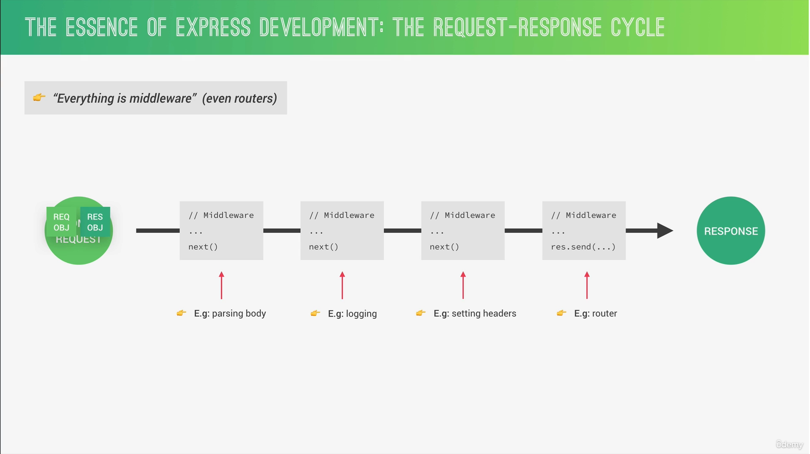

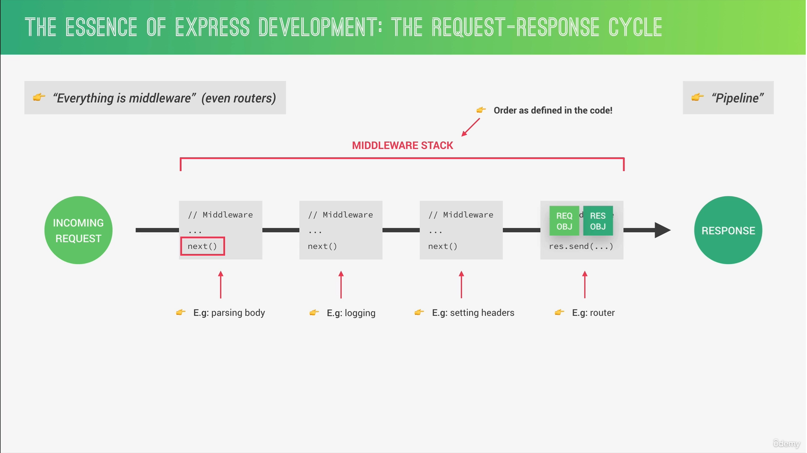

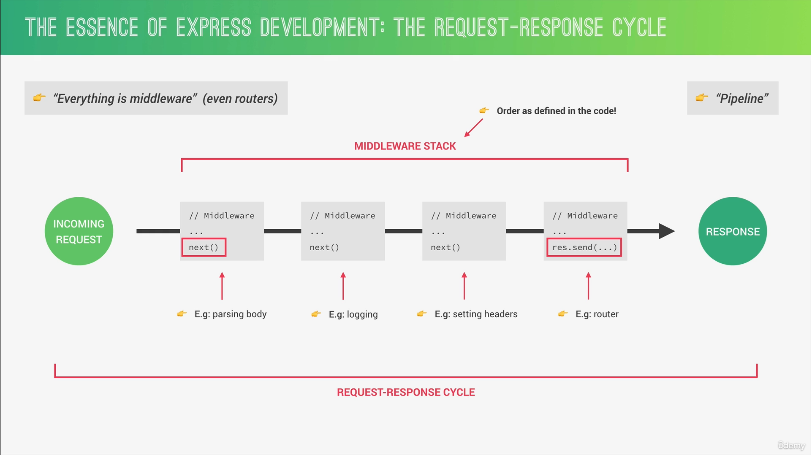

**⚠️Note :** **route()** method is the last middleware of middleware stack


Various Types of Middlewares

1. Application-level : it apply on whole routes

2. Route-level : it will apply on specific route or group of route

3. Error-handling

4. Built-in

5. Third-party


**Example of Application-level middleware (with custom middlewares)**

```js
const express = require('express');
const app = express();

app.use(express.json());

// first middleware
const firstCustomMiddleWare = (req, resp, next) => {
  console.log('Hello from the first middleware 👋');
  // without this next method next middleware will not be executed
  next();
};

const secondCustomMiddleWare = (req, resp, next) => {
  console.log('Hello from the second middleware 👋');

  // checking some conditions
  if (!req.query.age) {
    return resp.status(422).send({ error: 'You must provide an age' });
  }

  if (req.query.age < 18) {
    return resp.status(422).send({ error: 'You must be at least 18 years old' });
  }

  // without this next method next middleware will not be executed
  next();
};

// This is called application middleware
app.use(firstCustomMiddleWare);
app.use(secondCustomMiddleWare);

app.get('/', (req, resp) => {
  // route is our last middleware in chain
  console.log('Hello World');
  resp.status(200).send({ message: 'Welcome to the server' });
});

app.listen(3000, () => {
  console.log('Application is running on port 3000');
});
```

**⚠️Note :**  When ever you create custom middleware you should place in separate files its a good practice


**Example of Route level middleware (single and group)**

```js
// Single level middleware

const express = require('express');
const app = express();

app.use(express.json());

const authentication = (req, resp, next) => {
  if (!req.query.admin) {
    return resp.status(401).send({ error: 'Unauthorized' });
  }
  if (req.query.admin !== '12345') {
    return resp.status(401).send({ error: 'Unauthorized' });
  }
  next();
};

const ageRequired = (req, resp, next) => {
  console.log('Hello from the second middleware 👋');

  if (!req.query.age) {
    return resp.status(422).send({ error: 'You must provide an age' });
  }

  if (req.query.age < 18) {
    return resp.status(422).send({ error: 'You must be at least 18 years old' });
  }
  next();
};

// This is called single middleware
app.get('/home', ageRequired, (req, resp) => {
  console.log('Hello World');
  resp.status(200).send({ message: 'Welcome to the server' });
});

// This is called single middleware
app.get('/admin', authentication, (req, resp) => {
  resp.status(200).send({ message: 'Welcome to the admin dashboard' });
});

// This is use for all routes
app.get('*', (req, resp) => {
  resp.status(404).send({ error: 'Page not found' });
});

app.listen(3000, () => {
  console.log('Application is running on port 3000');
});
```

```js
// Group level middleware

const express = require('express');
const app = express();

app.use(express.json());

// To create group routes (this is called real middleware)
const adminRoute = express.Router();
const userRoute = express.Router();

const authentication = (req, res, next) => {
  console.log('Hello from the authentication middleware 👋');
  if (!req.query.admin) {
    return res.status(401).send({ error: 'Unauthorized' });
  }
  if (req.query.admin !== '12345') {
    return res.status(401).send({ error: 'Unauthorized' });
  }
  next();
};

const ageRequired = (req, res, next) => {
  console.log('Hello from the age middleware 👋');

  if (!req.query.age) {
    return res.status(422).send({ error: 'You must provide an age' });
  }

  if (req.query.age < 18) {
    return res.status(422).send({ error: 'You must be at least 18 years old' });
  }
  next();
};

// Apply middleware to group routes
adminRoute.use(authentication);
userRoute.use(ageRequired);

// All admin routes
adminRoute.get('/home', (req, res) => {
  res.status(200).send({ message: 'Welcome to the admin dashboard' });
});

adminRoute.get('/profile', (req, res) => {
  res.status(200).send({ message: 'Welcome to your profile' });
});

adminRoute.get('/change-password', (req, res) => {
  res.status(200).send({ message: 'Change your password' });
});

// User route
userRoute.get('/home', (req, res) => {
  console.log('Hello World');
  res.status(200).send({ message: 'Welcome to the server' });
});

// Default path with middleware instance
app.use('/admin', adminRoute);
app.use('/user', userRoute);

// This is used for all other routes
app.get('*', (req, res) => {
  res.status(404).send({ error: 'Page not found' });
});

app.listen(3000, () => {
  console.log('Application is running on port 3000');
});

/*
Example URLs:
- http://localhost:3000/admin/home?admin=12345
- http://localhost:3000/user/home?age=18
*/

// OR

const express = require('express');
const app = express();

app.use(express.json());

// To create group routes
const adminRoute = express.Router();
const userRoute = express.Router();

// Apply middleware to group routes (called mounting routing)
adminRoute.use((req, res, next) => {
  console.log('Hello from the middleware 👋');
  next();
});

// Mount the admin routes under /api/v1
app.use('/api/v1', adminRoute);
app.use('/api/v1', userRoute);

// All admin routes (using route keyword)
adminRoute
  .route('/admin')
  .get((req, res) => {
    res.status(200).send({ message: 'Welcome to the admin dashboard' });
  })
  .post((req, res) => {
    res.status(200).send({ message: { ...req.body } });
  });

userRoute
  .route('/user')
  .get((req, res) => {
    res.status(200).send({ message: 'Welcome to the user dashboard' });
  })
  .post((req, res) => {
    res.status(200).send({ message: { ...req.body } });
  });

app.get('*', (req, res) => {
  res.status(404).send({ message: 'Page not found' });
});

app.listen(3000, () => {
  console.log('Application is running on port 3000');
});
```

---
### 📘Param Middleware

```js
const express = require('express');
const app = express();
const adminRouter = express.Router();

// This middle ware will run only :id
adminRouter.param('id', (req, res, next, value) => {
  console.log('this is middleware', value);
  next();
});

adminRouter.route('/home/:id').get((req, res) => {
  res.status(200).send('admin page');
});

app.use('/admin', adminRouter);

app.get('*', (req, res) => {
  res.status(404).send('page not found');
});

app.listen(3000, () => {
  console.log('Server is running on port 3000');
});
```
```
http://localhost:3000/admin/home/30
```

---
### 📘Chaining middleware
```js
const express = require('express');
const app = express();
const adminRouter = express.Router();
app.use(express.json());

const firstMiddleware = (req, res, next) => {
  if (!req.body.name) {
    return res.status(400).send('name is required');
  }
  next();
};

const secondMiddleware = (req, res, next) => {
  if (!req.body.age) {
    return res.status(400).send('age is required');
  }
  next();
};

const thirdMiddleware = (req, res, next) => {
  if (!req.body.email) {
    return res.status(400).send('email is required');
  }
  next();
};

adminRouter
  .route('/home')
  .get((req, res) => {
    res.status(200).send('admin page');
  })
  // Chaining middlewares
  .post(firstMiddleware, secondMiddleware, thirdMiddleware, (req, res) => {
    res.status(200).send('admin post');
  });

app.use('/admin', adminRouter);

app.get('*', (req, res) => {
  res.status(404).send('page not found');
});

app.listen(3000, () => {
  console.log('Server is running on port 3000');
});
```
---

### 📘Morgan (Third-part middleware)

* It is very popular logging middleware, this is useful to show request data in console.

* Very useful package

```
npm i morgan
```

```js
const express = require('express');
const app = express();
const morgan = require('morgan');

// This is used to add Middleware stack
app.use(morgan('dev'));
app.use(express.json());

app.get('/', (req, res) => {
  res.status(200).send('Hello from express');
});

app.get('/about', (req, res) => {
  res.status(200).send('Hello from about');
});

app.get('/home', (req, res) => {
  res.status(200).send('Hello from home');
});

app.listen(3000, () => {
  console.log('Listening on port 3000');
});
```

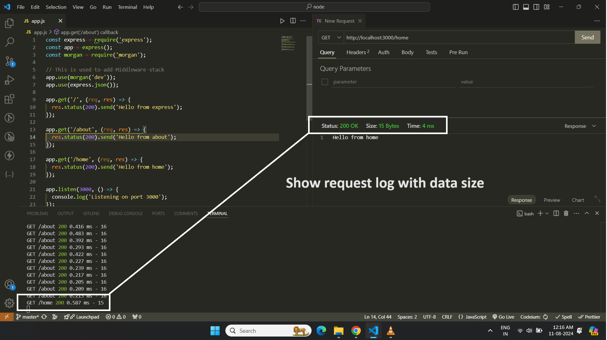

---

### 📘Run Static Files
* public/index.js

  ```html
  <!DOCTYPE html>
  <html lang="en">

  <head>
      <meta charset="UTF-8">
      <meta name="viewport" content="width=device-width, initial-scale=1.0">
      <title>Document</title>
  </head>

  <body>
      <h1>Hello World</h1>
  </body>

  </html>
  ```

* App.js

  ```js
  // app.js
  const express = require('express');
  const app = express();

  app.use(express.static('public'));

  app.listen(3000, () => {
    console.log('app is listening on port 3000');
  });
  ```
* Address
  ```
  http://localhost:3000/
  ```

We are not mentioning **public** folder in address bar because express is pointing to root address, if it do not find any route or address then it will find the file into public folder.


---

### 📘Environment variables

1. Direct way(not good one) : use to store small values

  ```js
  const express = require('express');
  const app = express();

  // this will print only development mode
  console.log(app.get('env'));

  // its a print all environment variables which are defined in computer
  console.log(process.env);
  ```
  * package.json (these commands for windows)

  ```js
  "scripts": {
    "start": "set NODE_ENV=development&&set X=20&&set Y=20&&nodemon app.js"

    // OR

    "start": "set NODE_ENV=development&&set X=20 && set Y=20 && node app.js"
  },

  // If run directly in terminal
  NODE_ENV=production X=29 Y=20 node app.js
  ```

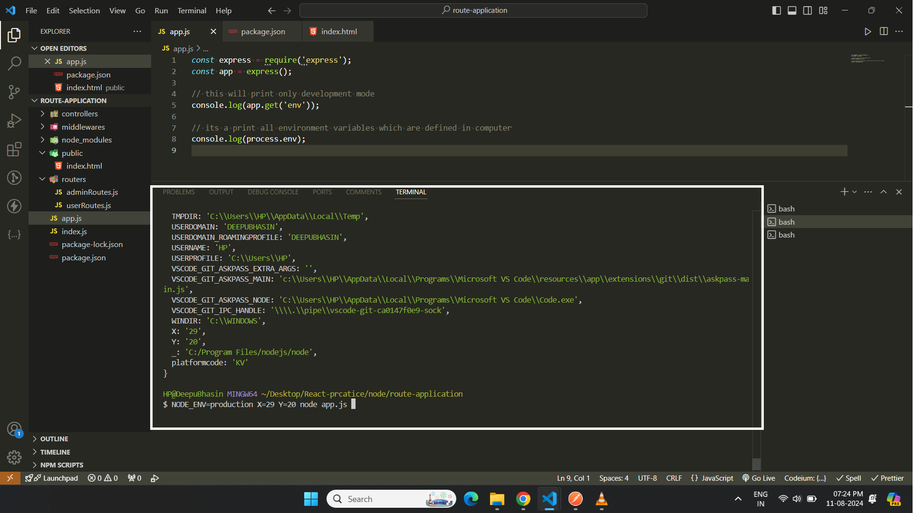


2. Using dot env Package(best one) : use to store large data

* Create file with any name

  * **.env** (i think this is best one)
  * **.env.development**
  * **config.env**

  ```
  NODE_ENV=development
  PORT=8000
  USER=jonas
  PASSWORD=12345
  X=20
  Y=30
  ```
* Package name

  ```
  npm i dotenv
  ```

* app.js

  ```js
  // it should always on the top of every package
  const dotenv = require('dotenv');

  // provide file name path & it should be placed immediately after import of dotenv
  dotenv.config({ path: './.env' });

  // printing all environment variables
  console.log(process.env);
  ```

* command

  ```
  node app.js
  ```

  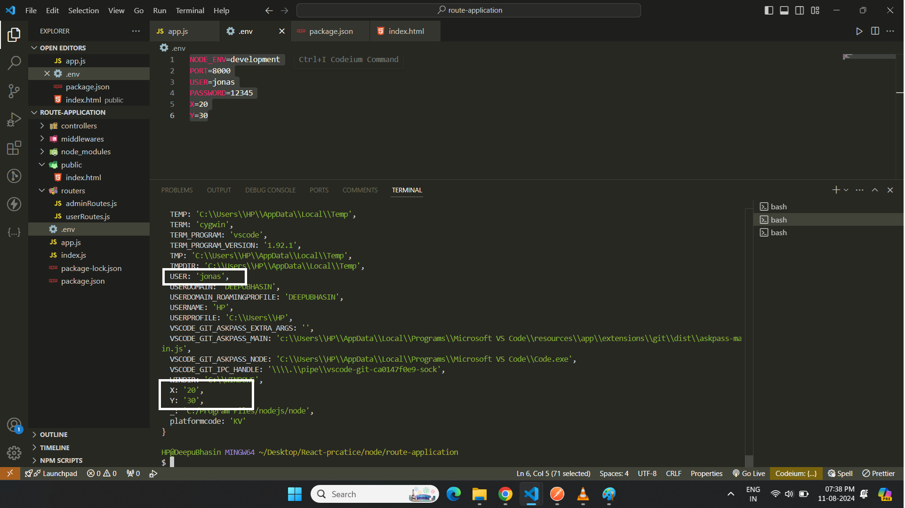

3. Using Config Package

* Package Name

   ```
   npm i config
   ```

* Create three files in config folder

   ```js
   // default.json
   {
       "file": "default.json",
       "name": "Default app",
       "application": {
           "port": 3000
       }
   }

   // development.json
   {
       "file": "default.json",
       "name": "Development App",
       "application": {
           "port": 3000
       }
   }

   // production.json
   {
       "file": "default.json",
       "name": "Production App",
       "application": {
           "port": 3000
       }
   }
   ```

* app.js

   ```js
   const config = require("config");

   console.log("file :", config.get("file"));
   console.log("name :", config.get("name"));
   console.log("application.port :", config.get("application.port"));
   ```

 * package.json

   ```js
     "scripts": {
       "default": "nodemon app.js",
       "dev": "set NODE_ENV=development&& nodemon app.js",
       "prod": "set NODE_ENV=production&& nodemon app.js"
   },
   ```


**⚠️Note :** Secrete key should be store in **.env** files or environment variables

---
### 📘Connections to MongoDB using Node & CRUD Commands

You can connect to the various Database like mongoDB, Mysql, SqlLite, Oracle, PostgreSql etc. You can check various details regarding Databases in *Database Integration* section of documentation.

* Before proceeding into mongoDB commands first create Database with name **test** and collection name with **tours**.


Package
```
npm i mongodb;
```

Database

```
use test

db.tours.insertMany([{"name":"Product A","price":19.99,"rating":4.5},{"name":"Product B","price":29.49,"rating":4.0},{"name":"Product C","price":9.99,"rating":3.8},{"name":"Product D","price":45.00,"rating":4.7},{"name":"Product E","price":15.75,"rating":3.9}])
```

**Connection with MongoDB**

```js
// app.js
const { MongoClient } = require("mongodb");
const url = "mongodb://127.0.0.1:27017";

const client = new MongoClient(url);

async function dbConnection(databaseName, collectionName) {
  let result = await client.connect();
  db = result.db(databaseName);
  return db.collection(collectionName);
}

// toArray return promise

// using then methods
dbConnection("test", "tours").then((res) => {
  res
    .find()
    .toArray()
    .then((data) => {
      console.log(data);
    });
});

// using async and await
const main = async () => {
  let result = await dbConnection("test", "tours");
  let data = await result.find().toArray();
  console.log(data);
};

main();
```
**Insert Into MongoDB**

```js
const { MongoClient } = require("mongodb");
const url = "mongodb://127.0.0.1:27017";

const client = new MongoClient(url);

// connection
async function dbConnection(databaseName, collectionName) {
  let result = await client.connect();
  db = result.db(databaseName);
  return db.collection(collectionName);
}

// insert
async function insert() {
  let data = await dbConnection("test", "tours");

  // for single
  let result = await data.insertOne({ name: "test", age: 24 });

  // for multiple
  let result = await data.insertMany([
    { name: "test", age: 24 },
    { name: "test", age: 24 },
  ]);

  if (result.acknowledged) {
    console.log("Insert Data successfully");
  } else {
    console.log("Insert Data failed");
  }
}
insert();
```

**Update into MongoDB**

* dbConnection file is already created above

```js
async function update() {
  let data = await dbConnection("test", "tours");
  let result = await data.updateOne(
    { name: "Product A" },
    { $set: { price: 100, dollarRate: 10, test: true } }
  );
  if (result.modifiedCount) {
    console.log("updated successfully");
  } else {
    console.log("not updated");
  }
}
update();
```


**Delete into MangoDB**

```js
async function deleteMethod() {
  let data = await dbConnection("test", "tours");
  let result = await data.deleteOne({ name: "Product A" });
  if (result.deletedCount) {
    console.log("deleted successfully");
  } else {
    console.log("not deleted");
  }
}
deleteMethod();
```

---

### 📘Express API + MongoDB

* Get, Post, Put, Patch, Delete Methods

```js
// this point is main one
const { MongoClient, ObjectId } = require("mongodb");
const url = "mongodb://127.0.0.1:27017";
const express = require("express");

const app = express();

app.use(express.json());

const client = new MongoClient(url);

// connection
async function dbConnection(databaseName, collectionName) {
  let result = await client.connect();
  db = result.db(databaseName);
  return db.collection(collectionName);
}

// get method
app.get("/", async (req, res) => {
  let data = await dbConnection("test", "tours");
  let result = await data.find({}).toArray();
  return res.status(200).send({ message: result });
});


// delete method
app.delete("/:id", async (req, res) => {
  let data = await dbConnection("test", "tours");
  let result = await data.deleteOne({
    _id: new ObjectId(req.params.id),
  });
  return res.status(200).send({ message: result });
});

app.listen(80, () => {
  console.log("listening on port 80");
});
```

---

### 📘Mongoose (best one)

* Its a advance version of mongoDB package which provide schemes and model

* Some queries get changed in mongoose package

  1. findById : to find data by id

  2. select : to select keys

  3. set : to get value example .set({isPublished : true, author : 'Author Name'})

```js
// Importing the Mongoose library to interact with MongoDB
const mongoose = require("mongoose");

// Function to establish a connection to the MongoDB database
async function dbConnection(databaseName) {
  try {
    // Connect to the MongoDB instance running locally, specifying the database name and it return promise
    await mongoose.connect(`mongodb://127.0.0.1:27017/${databaseName}`);
    console.log("Connected to the database");
  } catch (error) {
    // Log an error message if the connection fails
    console.error("Error connecting to the database:", error);
  }
}

// Defining a schema for the products collection
// A schema defines the structure of the documents in a collection
const productSchema = new mongoose.Schema({
  name: {type : String, default : 'Default Name'}, // Name of the product (String)
  price: Number, // Price of the product (Number)
  brand: String, // Brand of the product (String)
  tags : [String]  // array of string
});

// Creating a model based on the productSchema
// A model is a wrapper for the schema and provides an interface to interact with the collection
const ProductModel = mongoose.model("Product", productSchema);

// CRUD Operations

// Create: Insert a new product into the collection
async function createProduct(data) {
  try {
    // Create a new instance of the ProductModel with the provided data
    const product = new ProductModel(data);
    // Save the product to the database
    const response = await product.save();
    console.log("Product Created:", response);
  } catch (error) {
    // Log an error message if the creation fails
    console.error("Error creating product:", error);
  }
}

// Read: Fetch products from the collection based on a filter
// If no filter is provided, it will return all products
async function readProducts(filter = {}) {
  try {
    // Find documents in the collection that match the filter criteria
    const products = await ProductModel
    .find(filter)
    .limit(3)
    .sort({name : -1})  // sorting in descending order
    .select({
      name: 1,  // to select key name
      tags: 1,
    });
    console.log("Products Found:", products);
  } catch (error) {
    // Log an error message if the read operation fails
    console.error("Error reading products:", error);
  }
}

// Update: Update existing products in the collection that match the filter
async function updateProduct(filter, updateData) {
  try {
    // You can also use save method here to update data (for single record)

    // Update the documents that match the filter with the new data
    const response = await ProductModel.updateMany(filter, updateData);
    console.log("Product Updated:", response);
  } catch (error) {
    // Log an error message if the update fails
    console.error("Error updating product:", error);
  }
}

/*
  1. findById
  2. findByIdAndUpdate('66caacf2c3f84327f498e8be', {$set : {price : true}}, {new : true})

*/


// Delete: Remove products from the collection that match the filter
async function deleteProduct(filter) {
  try {
    // Delete the documents that match the filter criteria
    const response = await ProductModel.(filter);
    console.log("Product Deleted:", response);
  } catch (error) {
    // Log an error message if the deletion fails
    console.error("Error deleting product:", error);
  }
}

/*
  1. findByIdAndUpdate('66caacf2c3f84327f498e8be', {$set : {price : true}}, {new : true})
*/

// Example usage of the CRUD operations
async function main() {
  // Establish a connection to the database named "test"
  await dbConnection("test");

  // Create a new product
    // Create a new product
  await createProduct({
    name: "iPhone",
    price: 1000,
    brand: "Apple",
    tags: ["node", "backend"],
  });

  // Read products with the brand "Apple"
  await readProducts({ brand: "Apple" });

  // Update products with the brand "Apple" to change the price
  await updateProduct({ brand: "Apple" }, { $set: { price: 1100 } });

  // Delete products with the brand "Apple"
  await deleteProduct({ brand: "Apple" });

  // Close the connection to the database when done
  await mongoose.connection.close();
}

// Run the example operations
main();
```

* You can also create API using mongoose + express

---
### 📘Upload Image

```
npm i multer
```

```js
const express = require("express");
const multer = require("multer");
const directoryName = "uploads";
const fs = require("fs");
const formFileInputName = "image";

const app = express();
const port = 3001;

// checking if directory exists
const directoryExistMiddleware = (req, res, next) => {
  if (!fs.existsSync(directoryName)) {
    fs.mkdirSync(directoryName);
  }
  next();
};

// Set up multer to store uploaded files in the 'uploads' folder
const uploadImageMiddleware = multer({
  storage: multer.diskStorage({
    destination: (req, file, callBack) => {
      callBack(null, directoryName);
    },
    filename: (req, file, callBack) => {
      callBack(null, `${file.originalname}-${Date.now()}.jpg`);
    },
  }),
}).single(formFileInputName); // for uploading single image

// Define the upload route
app.post(
  "/upload",
  directoryExistMiddleware,
  uploadImageMiddleware,
  (req, res) => {
    try {
      // File uploaded successfully
      res.status(200).json({
        success: true,
        message: "Image uploaded successfully",
        filename: req.file.filename,
      });
    } catch (error) {
      // Handle any error
      res.status(500).json({
        success: false,
        message: "Failed to upload image",
        error: error.message,
      });
    }
  }
);

// Start the server
app.listen(port, () => {
  console.log(`Server running on port ${port}`);
});
```
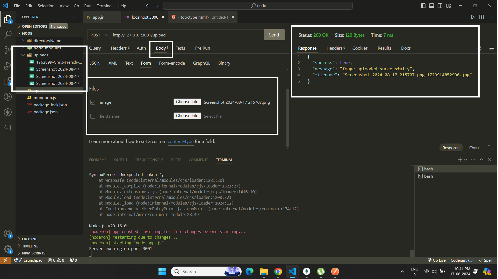

---

### 📘OS-Module

```js
const express = require("express");
const os = require("os");
const app = express();

app.get("/", (req, res) => {
  res.status("200").send({
    hostName: os.hostname(),
    platform: os.platform(),
    userInfo: os.userInfo(),
    architecture: os.arch(),
    freeMemory: `${os.freemem() / (1024 * 1024 * 1024)} GB`,
    totalMemory: `${os.totalmem() / (1024 * 1024 * 1024)} GB`,
    OS: os, // not very useful
  });
});

// Start the server
app.listen(80, () => {
  console.log(`Server running on port 80`);
});
```
---

### 📘Events and Event Emitter in node.js

* In node every thing is event based (ist same like javascript)

* **event :** A Signal that something has happened and it is pass by emitter

* **EventEmitter :** is a Class and is like generating event on any event signal for example button.

* In node js you cannot make any button click, then only event you can create is api.

* Emit means making noise, produce something - signalling that event is occurring.

  ```js
  const express = require("express");
  let count = 0;
  let cake = 0;

  // its a class that why we use capital letter
  const EventEmitter = require("events");

  // creating event instance
  const event = new EventEmitter();

  // event name
  event.on("countIncrement", (e) => {
    count = count + e.count;
    cake = cake + e.cake;
  });

  const app = express();
  const port = 80;

  app.get("/", (req, res) => {
    // calling event
    event.emit("countIncrement", { count: 1, cake: 2 });
    res.status(200).send({ count, cake });
  });

  app.get("/home", (req, res) => {
    // calling event
    event.emit("countIncrement", { count: 2, cake: 2 });
    res.status(200).send({ count, cake });
  });

  app.listen(port, () => {
    console.log(`Example app listening at http://localhost:${port}`);
  });
  ```

* Emitter hav always module scope it cannot be called into another file. To make it common you have to create common class.
*
  ```js
  // index.js
  const EventEmitter = require("events");
  class Logger extends EventEmitter {
    constructor() {
      super();
    }
    log(fnName, e) {
      this.emit(fnName, e);
    }
  }

  module.exports = Logger;

  // app.js
  const express = require("express");
  const Logger = require("./index");
  const app = express();
  const logger = new Logger();
  let count = 0;

  logger.on("countIncrement", (e) => {
    count = count + e.count;
  });

  app.get("/", (req, res) => {
    logger.log("countIncrement", { count: 1 });
    res.status(200).send({ count });
  });

  app.listen(80);
  ```

---
### 📘Mysql with Node (CRUD)

```
npm i mysql
```

```sql
create database testing;

use testing;

CREATE TABLE `users` (
  `id` int(11) NOT NULL PRIMARY KEY  AUTO_INCREMENT,
  `first_name` varchar(150) NOT NULL,
  `last_name` varchar(150) NOT NULL,
  `created_dt` datetime NOT NULL
) ENGINE=InnoDB DEFAULT CHARSET=utf8mb4 COLLATE=utf8mb4_general_ci;

INSERT INTO `users` (`first_name`, `last_name`, `created_dt`) VALUES ('John', 'Doe', NOW()),('Jane', 'Smith', NOW()),('Alice', 'Johnson', NOW()),('Bob', 'Williams', NOW());
```

```js
const express = require("express");
const mysql = require("mysql");

const app = express();

// Middleware
app.use(express.json());

// MySQL Connection
const db = mysql.createConnection({
  host: "localhost",
  user: "root",
  password: "",
  database: "testing",
});

// applying middleware to db to check if connected
app.use((req, res, next) => {
  if (db.state === "disconnected") {
    db.connect((err) => {
      if (err) {
        console.error("Error connecting to MySQL:", err.message);
        return res.status(500).send({ status: "error", message: err });
      }
      next();
    });
  } else {
    next();
  }
});

// Get all users
app.get("/", (req, res) => {
  const sql = "SELECT * FROM users ORDER BY first_name";
  db.query(sql, (err, results) => {
    if (err) {
      res.status(500).send({ status: "error", message: err });
      return;
    }
    res.status(200).send({ status: "success", data: results });
  });
});

// Create a user
app.post("/users", (req, res) => {
  console.log(req.body);

  const { firstName, lastName } = req.body;

  if (!firstName || !lastName) {
    res.status(400).send({
      status: "error",
      message: "firstName and lastName are required fields",
    });
    return;
  }

  const dateTime = new Date().toISOString().slice(0, 19).replace("T", " ");

  const sql =
    "INSERT INTO users (first_name, last_name, created_dt) VALUES (?, ?, ?)";
  db.query(sql, [firstName, lastName, dateTime], (err, result) => {
    if (err) {
      res.status(500).send({ status: "error", message: err });
      return;
    }
    res.status(201).send({
      status: "success",
      message: `User created with id: ${result.insertId}`,
    });
  });
});

// Get a single user
app.get("/users/:id", (req, res) => {
  const userId = req.params.id;
  const sql = "SELECT * FROM users WHERE id = ?";
  db.query(sql, [userId], (err, result) => {
    if (err) {
      res.status(500).send({ status: "error", message: err });
      return;
    }
    if (result.length === 0) {
      res.status(404).send({ status: "error", message: "User not found" });
      return;
    }
    res.status(200).json(result[0]);
  });
});

// Update a user
app.put("/users/:id", (req, res) => {
  const userId = req.params.id;
  const { firstName, lastName } = req.body;
  const sql = "UPDATE users SET first_name = ?, last_name = ? WHERE id = ?";
  db.query(sql, [firstName, lastName, userId], (err, result) => {
    if (err) {
      res.status(500).send({ status: "error", message: err });
      return;
    }
    if (result.affectedRows === 0) {
      res.status(404).send({ status: "error", message: "User not found" });
      return;
    }
    res.status(200).send({ status: "success", message: "User updated" });
  });
});

// Delete a user
app.delete("/users/:id", (req, res) => {
  const userId = req.params.id;

  const sql = "DELETE FROM users WHERE id = ?";
  db.query(sql, [userId], (err, result) => {
    if (err) {
      res.status(500).send({ status: "error", message: err });
      return;
    }
    if (result.affectedRows === 0) {
      res.status(404).send({ status: "error", message: "User not found" });
      return;
    }
    res.status(200).send({ status: "success", message: "User deleted" });
  });
});

// Start server
const PORT = process.env.PORT || 3001;
app.listen(PORT, () => console.log(`Server running on port ${PORT}`));
```

### 📘NODE VS PHP

* Node become very costly for developing small applications while php not

* Both languages are stable and from very long in market

* Node provide Performance, speed and request handling which is soo much better than php due their asynchronous nature.

* Node Hosting mainly done on cloud

* Both language can connect with database but stand alone javascript not.

* Apis are more powerful than creating website in php or node js.