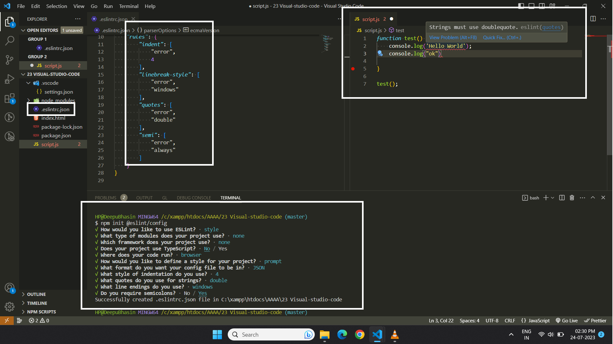

## 📘ES-Lint

**Simplest way**

You can take the reference from the documentation.


1. First install

   1. ESLint Extension (Integrates ESLint JavaScript into VS Code by microsoft)

   2. Prettier Extension

2. You need to install **npm package.json** (with basic configuration)

```
npm init -y
```

3. You have to install **npm install eslint** package

```
npm install eslint
```

4. Add Configuration File for **eslint** by command

```
npm init @eslint/config
```

- Select Options

5. To check syntax only

```
-To check syntax and find problems
-To check syntax, find problems, and enforce code style (select this one)
```

6. JavaScript modules (import/export)

```
-JavaScript modules (import/export)
-CommonJS (require/exports)
-None of these(select this one)
```

7. Which framework does your project use?

```
-React
-Vue.js
-None of these (select this one)
```

8. Does your project use TypeScript?

```
- no (select this one)
- yes
```

9. Where does your code run?

```
-Browser (select this one)
-Node
```

10. How would you like to define a style for your project?

```
-Use a popular style guide
-Answer questions about your style (select this option)
```

11. What format do you want your config file to be in?

```
-JavaScript
-YAML
-JSON (select this one)
```

12. What style of indentation do you use?

```
-Tabs
-Spaces (select this option)
```

13. What quotes do you use for strings?

```
-Double (select this option)
-Single
```

14. What line endings do you use? .

```
-Unix
-Windows (select this option)
```

15. Do you require semicolons?

```
-yes (select this option)
-no
```

16. Would you like to install them now?
```
-yes (select this option)
-no
```

17. Which package manager do you want to use?

```
-npm (select this option)
-yarn
-pnpm
```

after this **.eslintrc** file will automatically create

18. You will get this message : **Successfully created .eslintrc.json**




**Reference ChatGpt**

1. Install ESLint

    ```
    npm install eslint --save-dev
    ```
2. Initialize ESLint Configuration

    ```
    npx eslint --init
    ```

3. During the setup, you’ll be prompted to answer a few questions:

   * How would you like to use ESLint? (Select an option, such as "To check syntax, find problems, and enforce code style")

   * What type of modules does your project use? (Choose "JavaScript modules (import/export)" or "CommonJS (require/exports)" depending on your setup)

   * Which framework does your project use? (Select the appropriate option, such as "None of these" if not using a framework like React or Vue)

   * Does your project use TypeScript? (Select "Yes" if your project uses TypeScript)

   * Where does your code run? (Select "Node")

   * How would you like to define a style for your project? (Choose an option like "Use a popular style guide" or "Answer questions about your style" based on your preference)

   * Which style guide do you want to follow? (If you chose "Use a popular style guide," select one like Airbnb, Standard, or Google)

   * What format do you want your config file to be in? (Choose JSON, YAML, or JavaScript)

After that **eslint.config.mjs** file will create

4. Configure ESLint (Optional)

    ```js
    // .eslintrc.json
    {
        "env": {
            "browser": true,
            "es2021": true,
            "node": true
        },
        "extends": "eslint:recommended",
        "parserOptions": {
            "ecmaVersion": "latest",
            "sourceType": "module"
        },
        "rules": {
            "indent": ["error", 2],
            "linebreak-style": ["error", "unix"],
            "quotes": ["error", "single"],
            "semi": ["error", "always"],
            "no-console": "error",
            "no-unused-vars": "error"
        }
    }
    ```

5. Command for EsLint

    For File
    ```
    npx eslint fileName.js
    ```

    For folder

    ```
    npx eslint src/
    ```

**⚠️Note :** if you are not getting any error please refresh VS code once.