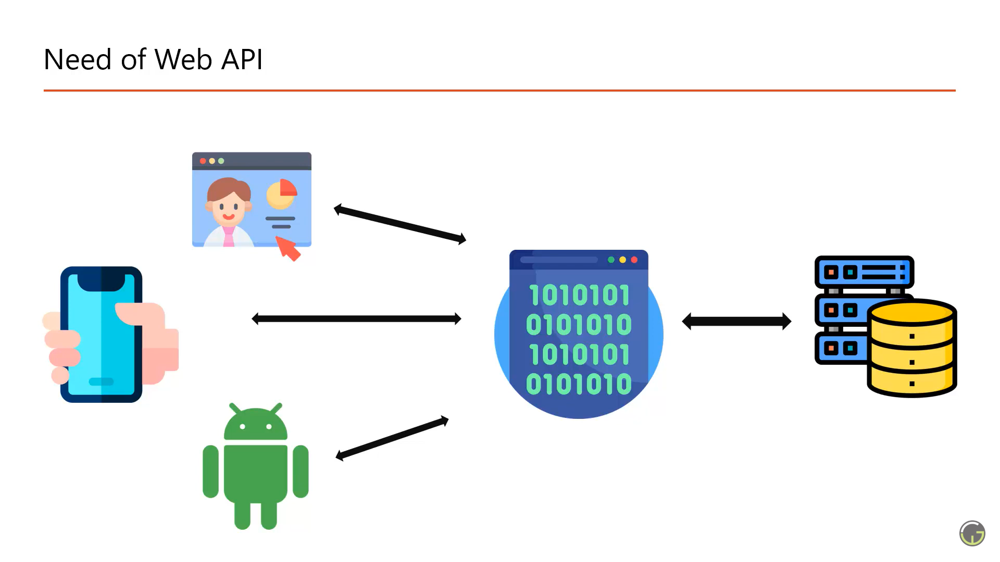

### 📘What is Web API

* API Stands for Application programming interface

* Web api is a concept(not a technology) that works on HTTP protocols and it is used to extend the functionality of an application

* We can create web api using multiple technologies such as java, .net node js, php etc.

---
### 📘What is Web Api

* Web API is allow you to help communication with web, mobile app, window application  etc

* Front end applications cannot talk with database directly

* Avoid business login duplication

* Extend application functionality

* Abstraction (hiding the business logic from end user)

    

---
### 📘What is Rest

* REpresentation State Transfer.

* REST is combination of couple of principles that must be followed by the web api

    * URL Structure

    * HTTP Verbs

    * Status Code

    * Stateless, etc.

---
### 📘What is HTTP

* HTTP is stand for Hyper Text Transfer Protocol for distributed, collaborative, hypermedia information systems.

* Http is used for the communication between client and the web server (browser end server)

---
### 📘What is HTTP request and its Components

* When client make request to the server it is called HTTP request

* Major Components

  * Url

  * Verbs (Method)

  * Request Headers

  * Body

  * Data

---
### 📘What is HTTP Response and its Components

* When server make response to the client it is called HTTP response

* Major Components

  * Status Code

  * Response Headers/ Multiple headers

  * Data

---
### 📘HTTP Verbs (Major One)

1. Get : The Get Method is used to retrieve data example book data, search a book etc

2. Post : The Post Method is used to make a new entry in the database Example Add a new book

3. Put :  The Put Method is used to update all the properties of current resource in the database example update all properties (column) of an existing book etc.

4. Patch : The Patch Method is similar to put but it is used to update partial properties of current resource in the database Example update few properties (columns) of an existing book etc.

5. Delete : The Delete Method is used to delete the resource from the database. There are two types for delete

   1. Soft delete : Here we will use patch method to update an existing book from database like isVisible

   2. Hard Delete : Here we will use delete method to delete an existing book from database etc.

---
### 📘Status Code

* Status code are issued from the server and they gives the information about the responses

* All HTTP response status code are divided into five categories

  1. 1xx - Information response

  2. 2xx - Successful

  3. 3xx - Redirection

  4. 4xx - Client error

  5. 5xx - Server error

* Frequently used status Code

  1. 200 : OK

  2. 201 : New Resource created

  3. 204 : No Content (The server proceed the request successfully and it is not returning any content)

  4. 301 : Moved Permanently

  5. 302 : Moved Temporarily

  6. 400 : Bad Request (because we send wrong data in HTTP request)

  7. 401 : Unauthorized (If you looking for a resource that don't have access in that situation it will return 401)

  8. 404 : Not Found (If you looking for a resource that does not exist example if you looking for a required with specific id which does not exist in database in that case it will return 404)

  9. 405 : Methods not allowed (instead of GET you are using POST)

  10. 500 : Internal server error (all errors on server)

  11. 503 : Service unavailable (ex - down for maintenance)