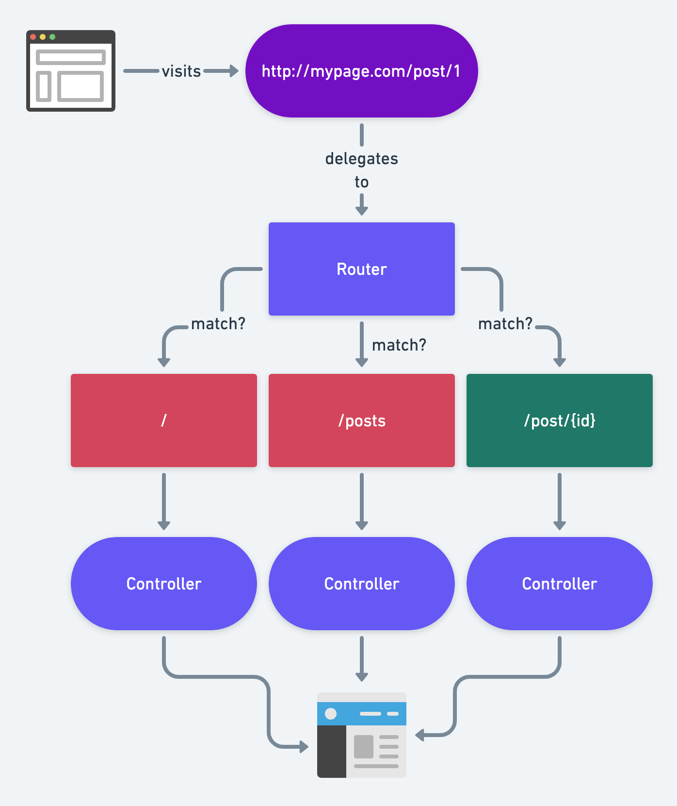

### 📘Information

type : font > Font Ligatures > open setting.json > paste the below code

```js
"editor.fontLigatures": true,
"editor.fontFamily": "\"Cascadia Code\", \"Input Mono\", \"Fira Code\", monospace"
```


### 📘Install and Run Project
* To install Laravel Globally

   ```
   composer global require laravel/installer
   ```

* To install Project

   ```
   laravel new <project-name>
   ```

* To run Project

   ```
   php artisan serve
   ```
---

### 📘Routes



* path : *routes > web.php*

* Some HTTP Verbs

   1. GET
   
   2. POST
   
   3. PATCH/PUT

   4. DELETE


1. To check all commands for routes

   ```
   # It will return all route commands
   php artisan route -h

   # It will return all routes of laravel
   php artisan route:list

   # It will return all routes of laravel which have api word
   php artisan route:list | grep api

   # It will return only user created routes
   php artisan route:list --except-vendor

   # It will return all routes related to name example user or related to user
   php artisan route:list --path=user
   ```


2. Routes

   ```php
   // Render direct view
   Route::view("/home", "<fileName>")->name("home.index");

   // Simple Route
   Route::get("/home", function ($name) {
       return view("home");
   });

   //Dynamic Routing with data and with optional
   Route::get("/user/{name?}", function (string $name = "defaultValue") {
       echo $name;
   });

   //Redirect
   Route::get('/', function () {
      return redirect('/user');           // route (if name is not provided)
   });

   //Fallback Route
   Route::fallback(function () {
      return '404 | page not found';
   });
   ```

3. Named Route : majorly use for complex address

   ```php
   // For static urls
   Route::get('/about/javascript/detail/summary', function () {
      echo "Named Route";
   })->name('summary');

   <a href="{{ route('summary') }}">Summary Page </a>

   // in controller for redirection
   public function show() {
      return to_route('summary');
   }

   // for dynamic urls
   Route::get('/about/javascript/detail/summary/{data}', function (string $data = "default value") {
      echo $data;
   })->name('summary');

   // in controller for redirection
   public function show() {
      return to_route('summary', ['data' => 'jquery']);
   }

   //Redirect
   Route::get('/', function () {
      return redirect()->route('summary');   // route name (if name is provided)
   });
   ```


3. Route Constraints

   ```php
   //To get only numbers in address bar
   Route::get('/userId/{id}', function (string $id) {
      echo $id;
   })->whereNumber('id');

   Route::get('/userId/{id}', function (string $id) {
      echo $id;
   })->where('id', '[0-9]+');

   //To get only alpha characters in address bar
   Route::get('/userId/{id}', function (string $id) {
      echo $id;
   })->whereAlpha('id');

   // use where (best one)
   Route::get('/userId/{id}', function (string $id) {
      echo $id;
   })->where('id', '[a-zA-Z]+');

   //To get alpha and numeric characters in address bar
   Route::get('/userId/{id}', function (string $id) {
      echo $id;
   })->whereAlphaNumeric('id');

   Route::get('/userId/{id}', function (string $id) {
      echo $id;
   })->where('id', '[a-zA-Z0-9]+');

   //To get only defined values in params
   Route::get('/userId/{id}', function (string $id) {
      echo $id;
   })->whereIn('id', ['movie', 'song', 'painting']);

   //To get tow params with different-different validations
   Route::get('/userId/{id}/courseId/{cid}', function (string $id, string $cid) {
      echo "$id & $cid";
   })->where('id', '[a-zA-Z]+')->whereNumber('cid');
   ```

4. Grouped Routes (with complete example)

   1. Route group with Prefix

      ```php
      Route::prefix('user')->group(function () {
         Route::get('/', [UserController::class, 'index']);
         Route::get('/show', [UserController::class, 'show']);
         Route::get('/add', [UserController::class, 'add']);
         Route::get('/update', [UserController::class, 'update']);
         Route::get('/delete', [UserController::class, 'delete']);
      });
      ```

   2. Route group with Controller

      ```php
      Route::controller(UserController::class)->group(function () {
         Route::get('/user/','index');
         Route::get('/user/show','show');
         Route::get('/user/add','add');
         Route::get('/user/update','update');
         Route::get('/user/delete/{deleteId?}','delete');
      });
      ```

   3. Controller (this will use in any of above examples)

      ```php
      namespace App\Http\Controllers;
      class UserController extends Controller
      {
         public function index()
         {
            return "<p>Index Route </p>";
         }
         public function show() {
            return "<p>Show Route </p>";
         }

         public function add() {
            return "<p>Add Route </p>";
         }

         public function update() {
            return "<p>Update Route </p>";
         }

         public function delete(string $deleteId) {
            return "<p>Delete Route $deleteId </p>";
         }

      }
      ```
5. Various Methods

   ```php
   Route::get('/', [UserController::class]);
   Route::post('/', [UserController::class]);
   Route::delete('/', [UserController::class]);
   Route::patch('/', [UserController::class]);
   Route::put('/', [UserController::class]);

   // it will work with any method (not very useful)
   Route::any('/', [UserController::class]);

   // it will work with get and post method
   Route::match(['get', 'post'], '/user',  [UserController::class]);
   ```

---

### 📘Controller

*app > Http > Controllers*


* There are three controllers

  1. Basic Controller : Mainly use for every purpose
     ```
     php artisan make:controller UserController
     ```

  2. Single Action Controller : Mainly use for make single method

     ```
     php artisan make:controller UserController --invoke
     ```
  3. Resource Controller : Mainly use in CRUD system (Create, Read, Update, Delete)

     ```
     php artisan make:controller UserController --resource or -r
     ```
     

*  Basic Controller Example

   1. Command for creating any controller, It will create User.php Controller in _app > Http > Controllers > UserController.php_ folder

      ```
      php artisan make:controller UserController
      ```

      ```php
      // it will create this kind of file
      namespace App\Http\Controllers;
      use Illuminate\Http\Request;

      class UserController extends Controller
      {
         public function index(string $name = 'Default Name')
         {
            return view('welcome', ['name' => $name]);
         }

         public function getWelcome()
         {
            return view('welcome');
         }
      }
      ```

   2. How to use in Routes

      ```php
      // add this line
      use App\Http\Controllers\UserController;

      // calling index method from UserController
      Route::get('/user/{name?}',[UserController::class,'index']);

      // calling getWelcome method from UserController
      Route::get('/welcome',[UserController::class,'getWelcome']);
      ```

   3. View File

      ```php
      <h1>Hello World {{ $name }}</h1>
      ```

   4. Hit the address

      ```
      http://localhost:8000/user
      ```

* Resource Controller Example

   


  1. Command

     ```
     php artisan make:controller StudentController -r
     ```

  2. StudentController (This is generated file from command)

     ```php
     namespace App\Http\Controllers;

     use Illuminate\Http\Request;

     class StudentController extends Controller
     {
        public function index()
        {
           //
        }

        public function create()
        {
           //
        }

        public function store(Request $request)
        {
           //
        }

        public function show(string $id)
        {
           //
        }

        public function edit(string $id)
        {
           //
        }

        public function update(Request $request, string $id)
        {
           //
        }

        public function destroy(string $id)
        {
           //
        }
     }
     ```

  3. Route

      1. If we use all methods
         ```php
         Route::resource('student', StudentController::class);

         /*
         php artisan route:list --name=student

         GET|HEAD        student .......................................................... student.index › StudentController@index
         POST            student .......................................................... student.store › StudentController@store
         GET|HEAD        student/create ................................................. student.create › StudentController@create
         GET|HEAD        student/{student} .................................................. student.show › StudentController@show
         PUT|PATCH       student/{student} .............................................. student.update › StudentController@update
         DELETE          student/{student} ............................................ student.destroy › StudentController@destroy
         GET|HEAD        student/{student}/edit ............................................. student.edit › StudentController@edit
         */
         ```
         All methods are automatically generated and handle by laravel automatically.

         | Verb      | URI                     | Action  | Route Name      |
         | --------- | ----------------------- | ------- | --------------- |
         | GET       | /student                | index   | student.index   |
         | GET       | /student/create         | create  | student.create  |
         | POST      | /student                | store   | student.store   |
         | GET       | /student/{student}      | show    | student.show    |
         | PUT       | /student/{student}/edit | edit    | student.edit    |
         | PUT/PATCH | /student/{student}      | update  | student.update  |
         | DELETE    | /student/{student}      | destroy | student.destroy |

      2. If we use some methods

         ```php
         Route::resource('student', StudentController::class)->only(['index', 'create']);

         /*
         php artisan route:list --name=student
         GET|HEAD       student ........................................................... student.index › StudentController@index
         GET|HEAD       student/create .................................................. student.create › StudentController@create
         */
         ```
      3. If we use not some methods

         ```php
         Route::resource('student', StudentController::class)->except(['index', 'create']);

         /*
         php artisan route:list --name=student

         POST            student .......................................................... student.store › StudentController@store
         GET|HEAD        student/{student} .................................................. student.show › StudentController@show
         PUT|PATCH       student/{student} .............................................. student.update › StudentController@update
         DELETE          student/{student} ............................................ student.destroy › StudentController@destroy
         GET|HEAD        student/{student}/edit ............................................. student.edit › StudentController@edit
         */
         ```

     1. If you want to change route name

        ```php
        Route::resource('student', StudentController::class)->names([
           'index' => 'student.first',
           'create' => 'student.generate',
           'store' => 'student.save',
           'show' => 'student.read',
           'edit' => 'student.update',
           'update' => 'student.saveUpdate',
           'destroy' => 'student.delete',
        ]);

        /*
        php artisan route:list --name=student

        GET|HEAD        student .......................................................... student.first › StudentController@index
        POST            student ........................................................... student.save › StudentController@store
        GET|HEAD        student/create ............................................... student.generate › StudentController@create
        GET|HEAD        student/{student} .................................................. student.read › StudentController@show
        PUT|PATCH       student/{student} .......................................... student.saveUpdate › StudentController@update
        DELETE          student/{student} ............................................. student.delete › StudentController@destroy
        GET|HEAD        student/{student}/edit ........................................... student.update › StudentController@edit
        */
        ```


---

### 📘Views

*resources > views*

* There are two ways to create view files

   1. Can create manually

   2. Can create command, it will create file *resource > views > view.blade.php*

      ```
      php artisan make:view about
      ```

      Always create small caps file name as per good practice


*  Passing data from controller to view

   1. Using array

      ```php
      public function index()
      {
         $name = 'John';
         $city = 'USA';

         return view('welcome', ['name' => $name, 'city'=> $city]);
      }
      ```

   2. Using with method (best one)

      ```php
      public function index()
      {
         $name = 'John';
         $city = 'USA';

         return view('welcome')->with(['name' => $name])->with(['city' => $city]);
      }
      ```

   3. Using Compact method

      ```php
      public function index()
      {
         $name = 'John';
         $city = 'USA';

         return view('welcome', compact('name', 'city'));
      }
      ```
*  To check if view exist or not

   ```php
   use Illuminate\Support\Facades\View;
   public function getWelcome(string $name = 'Default Name') {
      if(View::exists('welcome')) {
         return view('welcome', ['name' => $name]);
      } else {
         echo 'View does not exist';
      }
   }
   ```
* To create file in a folder (common is folder name and footer is file name)

   ```
   php artisan make:view common.footer
   ```
---

### 📘Blade Engine

```php
<h1>Hello {{ $name }} </h1>
<p> {{ 1 + 2}}</p>

{{-- conditional  --}}
@if(true)
<p>true</p>
@else
<p>false</p>
@endif

{{-- loop  --}}
@for ($i = 0; $i <= 4; $i++)
    <p>{{ $i }}</p>
@endfor

@forelse($users as $user)
   <div>{{ $user }}</div>
   @empty
      <p>No users</p>
@endforelse


{{-- include another file from include folder  --}}
@include('include.section', ['page' => $name])

{{-- include another file from include folder if condition is true  --}}
@includeIf('include.section', ['page' => $name])


// start yield-content
<div class="title">@yield('title')</div>

<div class="content">@yield('content')</div>

//  another file

@yield('content')

@extends('filename')    // enter file name from where you want to fetch html code

@section('content', ['anyVariable'=> 'anyValue'])     // use that yield section

<h1>Hello World</h1>
<p>Hello Data </p>

@endSection

// end yield-content
```

---

### 📘Components

These are use to make reusable codes of ui for example message code in all my projects

* Command

   ```
   php artisan make:Component Message
   ```

   This command will create two files

     1. Create Component file, *app > view > components > Messages.php*, write class code here

     2. Create View file, *view > components >message.blade.php*, write html code here

* Add Variable in Component class

   ```php
   namespace App\View\Components;

   use Closure;
   use Illuminate\Contracts\View\View;
   use Illuminate\View\Component;

   class Message extends Component
   {

      public $msg;
      public function __construct($msg)
      {
         $this->msg = $msg;
      }
      public function render(): View|Closure|string
      {
         return view('components.message');
      }
   }
   ```

* Add UI code in View File

   ```php
   <div>
      <h1>This is Message {{ $msg }}</h1>
   </div>
   ```

* Use Component

  ```php
  <x-message msg="Login successfully"> </x-message>
  ```

Some time it make cache issue so do hard refresh while testing

---

## 📔Forms

### 📘Input Form

1. Controller

   ```php
   namespace App\Http\Controllers;
   use Illuminate\Http\Request;

   class UserController extends Controller
   {
      public function index(string $name = 'Default Name')
      {
         return view('welcome', ['name' => $name]);
      }

      public function getUser(Request $request )
      {
         echo $request->name;    // to print single value
         return $request;        // to print whole values
      }
   }
   ```

2. Route

   ```php
   use Illuminate\Support\Facades\Route;
   use App\Http\Controllers\UserController;


   Route::get('/user',[UserController::class,'index']);
   Route::post('/user', [UserController::class, 'store'])->name('user');
   ```

3. View

   ```html
   <form action="{{ route('user') }}" method="POST">
     <!-- This is important to send post request  -->
     @csrf
     <div>
       <label for="name">Name</label>
       <input type="text" name="name" id="name" placeholder="Enter your name" />
     </div>
     <div>
       <label for="email">Email</label>
       <input
         type="email"
         name="email"
         id="email"
         placeholder="Enter your email"
       />
     </div>
     <div>
       <label for="password">Password</label>
       <input
         type="password"
         name="password"
         id="password"
         placeholder="Enter your password"
       />
     </div>
     <button type="submit">Submit</button>
     <button type="reset">Reset</button>
   </form>
   ```

4. For various method

   ```html
   <form action="{{ route('user') }}" method="POST">
      <!-- This is important to send post request  -->
      @csrf
      <input type="hidden" name="_method" value="PUT">

      <input type="hidden" name="_method" value="DELETE">

      <input type="hidden" name="_method" value="PATCH">
   </form>
   ```

---

### 📘Form Validations and Validation Errors

* Command : This command is use to publish language folder which help to determine all default error messages

   ```
   php artisan lang:publish
   ```


1. Writing all validations in controller file

   1. Controller

      ```php
      public function getUser(Request $request)
      {
         $request->validate([
            'name' => 'required|min:3|max:10|alpha_num',
            'email' => 'required|email|between:18,20, unique:App\Models\User,email_Field',
            'password' => 'required',
            'mobile' = > 'size:10',

         ],

         // for custom messages pass this array otherwise ignore this array
         [
            'name.required' => 'Name filed is must must required',
            'name.alpha_num' => 'Name filed is must must best one',
            'name.min:3' => 'Name required required',
         ]);
         return $request;
      }
      ```

   2. View

      ```php
      @if($errors->any())
      <h2>All Errors</h2>
      @foreach($errors->all() as $error)
      <p style="color: red;">{{$error}}</p>
      @endforeach
      @endif

      <form action="/user" method="post">
         @csrf
         <div>
            <label for="name">Name</label>
            <input type="text" name="name" id="name" placeholder="Enter your name" value="{{ old('name')}}"
            class="{{ @errors->first('name') ? 'class-name' : ''}}" />
            @error('name')
            <p style="color: red;">{{$message}}</p>
            @enderror

         </div>
         <div>
            <label for="email">Email</label>
            <input type="email" name="email" id="email" placeholder="Enter your email" value="{{ old('email')}}">
            @error('email')
            <p style="color: red;">{{$message}}</p>
            @enderror
         </div>


         <div>
            <label for="password">Password</label>
            <input type="password" name="password" id="password" placeholder="Enter your password">
            @error('password')
            <p style="color: red;">{{$message}}</p>
            @enderror
         </div>
         <button type="submit">Submit</button>
         <button type="reset">Reset</button>
      </form>
      ```

2. Custom Validation Rules using Request Method

   1. Command, your file name must model file
   ```
   php artisan make:request UserRequest
   ```

   2. UserRequest (It will created under *app > Http > Requests*)

   ```php
   namespace App\Http\Requests;

   use Illuminate\Foundation\Http\FormRequest;

   class UserRequest extends FormRequest
   {
      public function authorize(): bool
      {
         return true;   // set it true
      }

      public function rules(): array
      {
         return [
               'name' => 'required',
               'email' => 'required',
               'password' => 'required',
         ];
      }

      // to create custom messages
      public function messages()
      {
         return [
            'name.required' => 'This :attribute is required!',    // to add field in error message
            'email.required' => 'User Email is required!',        // customize error message
            'password.required' => 'User Password is required!',
         ];
      }

      // you want to use laravel default error messages but change attribute
      public function attributes()
      {
         return [
               'name' => 'User Name',
               'email' => 'User Email',
               'password' => 'User Password',
         ];
      }

      // After validation and before inserting we perform some action on data
      protected function prepareForValidation(): void
      {
         $this->merge([
            'name' => Str::slug($this->name),      // make lower add - symbol in string
            'email' => strtoupper($this->email),
            'password' => bcrypt($this->password),
         ]);
      }
   }

   ```

   3. Controller

      ```php
      use App\Http\Requests\UserRequest;

      public function save(UserRequest $request)
      {
         // print all values
         return $request->all();

         // print only selected values
         return $request->only(['name', 'email']);

         // print only selected values
         return $request->input('name');

         // print only selected value
         return $request->name;

         // will not print selected value
         return $request->except(['password']);
      }
      ```

   4. View File (it is same file)


3. Custom validation Rules

   1. Rule Object (Can use many time in a website)

      1. Command

         ```
         php artisan make:rule UpperCase
         ```

      2. UpperCase File

         ```php
         use namespace App\Rules;
         use Closure;
         use Illuminate\Contracts\Validation\ValidationRule;

         class UpperCase implements ValidationRule
         {
            public function validate(string $attribute, mixed $value, Closure $fail): void
            {
               if (strtoupper($value) !== $value) {
                     $fail('The :attribute must contain at least one uppercase letter.');
               }
            }
         }
         ```

      3. UserController

         ```php
         public function save(Request $request)
         {
            $request->validate([
                  'name' => ['required', new UpperCase],
                  'email' => 'required',
                  'password' => 'required',
            ]);
            return $request->all();
         }
         ```

   2. use Closure (Can use one time in a website)

      1. Controller

      ```php
      use Closure;
      use Illuminate\Http\Request;
      public function save(Request $request)
      {
         $request->validate([
               'name' => ['required', function (string $attribute, mixed $value, Closure $fail) {
                  if (strtoupper($value) !== $value) {
                     $fail('The :attribute must contain at least one uppercase letter.');
                  }
               }],
               'email' => 'required',
               'password' => 'required',
         ]);
        return $request->all();
      }
      ```
---


## 📔Migrations

### 📘Basics Commands

You can read more about migrations and data types from laravel documentation

1. Command for making migrations, Table name should be plural

   ```
   php artisan make:migration create_students_table
   ```

2. Command to create tables in database

   ```
   php artisan migrate
   ```

3. Command to check status for migration files

   ```
   php artisan migrate:status
   ```

4. Command to rollback last migration file (mostly use)

   ```
   php artisan migrate:rollback
   ```

5. Command to rollback up to particular step migration file

   ```
   php artisan migrate:rollback --step=3
   ```

6. Command to remove all tables using migration

   ```
   php artisan migrate:reset
   ```

7. Command to rollback and then migrate (best one)

   ```
   php artisan migrate:refresh
   ```

8. Command to drop and then migrate (Best and majorly use in testing purpose)

   ```
   php artisan migrate:fresh
   ```

9. Command to create migration and model with same name (best one)

   ```
   php artisan make:model User -m
   ```

**Note :** Never Delete Migration files until if we created wrong file.

---

### 📘Modification with Migration

Column Modification

1. Add New Column (after flag write table name, example : --table=students, students is table name)

   ```
   php artisan make:migration update_students_table --table=students
   ```

   This command will create new file in migration folder

   ```php
   Schema::table('students', function (Blueprint $table) {
      $table->after('id', function (Blueprint $table) {
            $table->string('name', 100);
            $table->string('email', 100);
            $table->string('phone', 100);
      });
   });
   ```

   This code will add columns after id column.

2. Rename Column

   ```php
   $table->renameColumn('id', 'student_id');
   ```

3. Delete Column

   ```php
   // Delete Single Column
   $table->dropColumn('city');

   // Delete Multiple column
   $table->dropColumn(['city', 'avatar', 'location']);
   ```

4. Change Column Order

   ```php
   $table->after('id', function (Blueprint $table) {
         $table->string('name', 100);
         $table->string('email', 100);
         $table->string('phone', 100);
   });
   ```

5. Change Datatype or size of column

   ```php
      // Single option Change
      $table->string('name', 50)->change();

      // Multi options Change
      $table->integer('votes')->unsigned()->default(1)->comment('my comment')->change();
   ```

Table Modification

1. Rename Table

   ```php
   Schema::rename('students', 'students_main');
   ```

2. Delete Table

   ```php
   // drop table
   Schema::drop('users');

   // check and drop table
   Schema::dropIfExists('users');
   ```

3. Check Table exist

   ```php
   if(Schema::hasTable('users')) {
      // The "users" table exists...
   }
   ```

4. Check Column exist

   ```php
   if(Schema::hasTable('users')) {
      // The "users" table exists and has an "email" column...
   }
   ```
---

### 📘Constraints with Migration

1.  Not Null

    ```php
    $table->string('email')->nullable();
    ```

2.  Unique

    ```php
    $table->string('email')->unique();
    ```

3.  Default

    ```php
    $table->string('city')->default('Agra');
    ```

4.  Primary Key

    ```php
    $table->primary('id');

    $table->dropPrimary('user_id_primary')
    ```

5.  Foreign Key

    ```php
    $table->foreign('user_id')->reference->('id')->on('users');

    $table->dropForeign('posts_user_id_foreign');

    $table->dropForeign(['user_id']);
    ```

6.  Check

    ```php
    DB::statement("AlTER TABLE users ADD CONSTRAINTS age CHECK (age > 18) ;")
    ```

7.  Laravel Constraints

    ```php
    ->integer('column')

    ->string('column', 'length')

    ->float('amount', 3, 2)

    ->boolean('column')

    ->after('column')

    ->autoIncrement()

    ->comment('My comment')

    ->first()

    ->from($integer)

    ->invisible()

    ->unsigned()

    ->useCurrent()

    ->useCurrentOnUpdate()
    ```

Example for Primary and Foreign key concept with cascade example

```php
//Students migration
Schema::create('students', function (Blueprint $table) {
   $table->id();
   $table->string('name', 30);
   $table->string('email', 30)->unique()->nullable();
   $table->timestamps();
});

//Libraries migration
 Schema::create('libraries', function (Blueprint $table) {
   $table->id();
   $table->unsignedBigInteger('stu_id');

   // cascade allow functionality if we want to update or delete data from parent table
   $table->foreign('stu_id')->references('id')->on('students')->onUpdate('cascade')->onDelete('cascade');

   //OR
   $table->foreign('stu_id')->constrained()->cascadeOnDelete();

   $table->string('book', 100);
   $table->date('due_date')->nullable();
   $table->boolean('status');
   $table->timestamps();
});

// Other ways
cascadeOnUpdate();      // cascade on update

cascadeOnDelete();      // cascade on delete

restrictOnUpdate();     // restrict on update default behavior

restrictOnDelete();     // restrict on delete default behavior

nullOnDelete();         // set value to null in foreign table if data delete from parent table
```

---

## 📔Seeding


To insert Dummy/Real Data into Database then we use seeder. Types of Seeder

1. Seeder : To insert Real data like country code, states of country etc, Mostly use in every case.

2. Factory :

   1. To insert fake data in development mode like user table data, student table data

   2. In factory we can insert to those tables which have relations.

Basic Commands

```
#To make seeder file
php artisan make:seeder StudentSeeder

#To run seeder file
php artisan db:seed

#To run particular seeder file
php artisan db:seed --class=UserSeeder

#To run seeder file on server
php artisan db:seed --force

php artisan db:seed --class=UserSeeder --force

#To run migration and seed files (best one for migrate and seeder)
php artisan migrate:fresh --seed

#To make seeder and model
php artisan make:Seeder StudentSeeder --model=Student

#To make factory and model
php artisan make:factory StudentFactory --model=Student

#To make Model and Factory (best one for model and factory)
 php artisan make:model Student -f
```

### 📘Using Seeder

Steps :
   1. Create migration Files
      ```
      php artisan make:migration create_students_table
      ```

      Following Code will created
      ```php
       Schema::create('students', function (Blueprint $table) {
            $table->id();
            $table->string('first_name', 50);
            $table->string('last_name', 50);
            $table->string('email', 100);
            $table->timestamps();
        });
      ```


   2. Command to make model (Name should be singular)

      ```
      php artisan make:model Student
      ```

   3. Command to make Seeder (Seeder File name : TableName + Seeder)

      ```
      php artisan make:seeder StudentSeeder
      ```

   4. Insert Data

      1. Below code for inserting data using direct values

         ```php
         public function run(): void
         {
            // to create multiple data
            $student = [
                  [
                     'first_name' => 'Testing-1',
                     'last_name' => 'Testing-1',
                     'email' => 'Testing-1@gmail.com',
                  ],
                  [
                     'first_name' => 'Testing-2',
                     'last_name' => 'Testing-2',
                     'email' => 'Testing-2@gmail.com',
                  ],
                  [
                     'first_name' => 'Testing-3',
                     'last_name' => 'Testing-3',
                     'email' => 'Testing-3@gmail.com',
                  ],
            ];
            $student = collect($student);
            $student->each(function ($student) {
                  Student::create($student);
            });

            // to create single data
            Student::create([
                  'first_name' => 'John',
                  'last_name' => 'Doe',
                  'email' => 'BfBtZ@example.com',
            ]);
         }
         ```
      2. Insert using json files (This is very use full when you want to insert very large data)

         create json file under database > dummy_data > student.json

         ```json
         [
            {
               "first_name": "Testing-1",
               "last_name": "Testing-1",
               "email": "Testing-1@gmail.com"
            },
            {
               "first_name": "Testing-2",
               "last_name": "Testing-2",
               "email": "Testing-2@gmail.com"
            },
            {
               "first_name": "Testing-3",
               "last_name": "Testing-3",
               "email": "Testing-3@gmail.com"
            }
         ]
         ```

         ```php
         use App\Models\Student;
         use Illuminate\Database\Seeder;
         use Illuminate\Support\Facades\File;

         public function run(): void
         {
            $student = File::get(path: 'database/dummy-data/students.json');
            $student = collect(json_decode($student));
            $student->each(function ($student) {
                  Student::create([
                     'first_name' => $student->first_name,
                     'last_name' => $student->last_name,
                     'email' => $student->email
                  ]);
            });
         }
      ```
      3. Insert Data using faker

         ```php
         public function run(): void
         {
            Student::create([
                  'first_name' => fake()->firstName(),
                  'last_name' => fake()->lastName(),
                  'email' => fake()->unique()->safeEmail(),
            ]);
         }
         ```
---

### 📘Using Factory

**⚠️Note :** You can take the reference from the existing user factory file (best one)

Steps :

1. Make model and factory
   ```
   php artisan make:factory StudentFactory --model=Student
   ```

   write thr below code in Student Model

   ```php
   class Student extends Model
   {
      use HasFactory;
   }
   ```

2. Make Factory

   Write below code in StudentFactory

   ```php
   public function definition(): array
   {
      return [
            'name' => fake()->name(),
            'email' => fake()->unique()->safeEmail(),
            'email_verified_at' => now(),
            'password' => static::$password ??= Hash::make('password'),
            'remember_token' => Str::random(10),
      ];
   }

   public function unverified(): static
   {
      return $this->state(fn (array $attributes) => [
         'email_verified_at' => null,
      ]);
   }
   ```

   Write below Code in Database Seeder

   ```php
   public function run(): void
   {
      User::factory()->count(10)->create();
      User::factory(2)->unverified()->create();    // this is use to run unverified method which help to insert 2 more rows with unverified email column
   }
   ```
---

## 📔Database

Laravel support Various Database

1. MySql

2. PostgreSql

3. SqlLite

4. SqlServer

There are two to perform any actions on database

1. Query Builders :

   1. In query builder we write our code in Controllers.

   2. We perform CRUD operations

   3. It protect your application from SQL injection attack by using PDO parameter binding.

   4. It work with all of laravel's supported database systems, such as Mysql, PostgreSql, SqlLite and Sql Server.

   5. Select Query Example

      ```php
      DB::table('users')->all();
      ```

2. Eloquent ORM :

   1. In Eloquent ORM we write our code in models.

   2. Its stand for Object Relation Mapper

   3. Complex relationship between

      1. one-to-one

      2. one-to-many

      3. many-to-many

   4. It also provide Observer and Scope

   5. Select Query Example

      ```php
      User::all();
      ```
---

### 📘Query Builders

Query builders are basically use for making conditions


Basic Commands

1. Fetch Data with where conditions

   ```php
   // Select * from students
   return DB::table('students')->get();

   // Select first_name, last_name
   return DB::table('students')->select('first_name', 'city')->get();

   // Select * from students where city = 'goa'
   return DB::table('students')->where('city', 'goa')->get();
   return DB::table('students')->where('city', '=', 'goa')->get();

   // Select * from student where city = 'goa' and age > 18
   return DB::table('students')->where('city', '=', 'goa')->where('age', '>', 18)->get();

   //OR

   return DB::table('students')->where([
      ['city', '=', 'goa'],
      ['age', '>', 18]
   ])->get();


   // Select * from student where city = 'goa' or age > 18
   return DB::table('students')->where('city', '=', 'goa')->orWhere('age', '>', 18)->get();

   //Range id between 1-10
   ->whereBetween('id', [1, 10])

   //Range id not between 1-10
   ->whereNotBetween('id', [1, 10])

   //In Query
   ->whereIn('id', [1, 2, 3]);

   //Not In Query
   ->whereNotIn('id', [1, 2, 3]);

   //Null
   ->whereNull('email');

   //Not Null
   ->whereNotNull('email');

   //Date and Time
   ->whereYear()
   ->whereMonth()
   ->whereDay()
   ->whereTime()

   //Order By
   ->orderBy('name', 'asc')

   //Only get first record
   ->first()
   ```

2. Insert Queries

   ```php
   // add single data
   $user = DB::table('students')->insert([
      'first_name' => 'John',
      'last_name' => 'Doe',
      'email' => '5oTfM@example.com',
      'created_at' => now(),
      'updated_at' => now(),

   ]);

   // add multiple data
    $user = DB::table('students')->insert([
      'first_name' => 'John',
      'last_name' => 'Doe',
      'email' => '5oTfM@example.com',
      'created_at' => now(),
      'updated_at' => now(),

   ],
   [
      'first_name' => 'Testing',
      'last_name' => 'testing',
      'email' => 'testing@example.com',
      'created_at' => now(),
      'updated_at' => now(),

   ]);

   //In Model File for remove create_at and update_at
   public $timestamps =  false;

   //if value exist then it will ignore otherwise it will insert
   ->insertOrIgnore([
      // code ...
   ]);

   //this will check if data exist then it will update otherwise it will create new data
   ->upsert([
      // code ...
   ],['uniqueColumn', ['updateToWhichColumn(it optional)']]);

   //Last inserted Id
   ->insertGetId([
      //code...
   ])
   ```

3. Update Query

   ```php
   DB::table('students')->where('id', 1)->update(['status', 1])

   //If value exits then it will update otherwise insert
   DB::table('students')->where('id', 1)->updateOrInsert()

   //To increment value by one
   DB::table('students')->where('id', 1)->increment('columnName', 'incrementByValue');

   //Decrement
   DB::table('students')->where('id', 1)->decrement('columnName', 'incrementByValue', ['city' => 'goa', 'status' => 1]);
   ```

4. Delete Query

   ```php
   DB::table('students')->where('id', 1)->delete();

   DB::table('students')->truncate();
   ```

5. Joins

   ```php
   DB::table('students')->joins('cities', 'student.city', '=', 'cities.cid')->get();

   ->leftJoin()

   ->rightJoin()

   ->crossJoin()
   ```

6. Raw Query

   ```php
   DB::raw('SELECT * FROM students')->get();
   ```

7. GroupBy

   ```php
   DB::raw('SELECT * FROM students')->groupBy('name')->orderBy('name', 'ASC')->get();
   ```

8. To get last query

   ```php
   ->toSql()
   ```

9. When Method (to make conditions)

   ```php
   // like if condition
   DB::table('students')->when(true, function($query) {
      $query->where('cities', '=', 'goa');
   })->get();

   // like if-else condition
   DB::table('students')->when(true, function($query) {
      $query->where('cities', '=', 'goa');
   }, function($query) {
      $query->where('age', '>', '18');
   })->get();
   ```

10. Chunk Data (save ram on server)

   ```php
   ->chunk()
   ```
---

### 📘Raw SQL Queries (at the back end its using PDO)

1. Select

   ```php
   DB::select("SELECT * FROM users");

   DB::select("SELECT * FROM users WHERE id = ?", [2]);

   DB::select("SELECT * FROM users WHERE id = :id", ['id' => 2]);
   ```

2. Insert

   ```php
   DB::insert('INSERT into student (name, age) values(?, ?)', ["John", 20]);
   ```
3. Update

   ```php
   DB::update('UPDATE users set email="test#gmail.com" WHERE id = ?', [29]);
   ```
4. Delete

   ```php
   DB::delete('DELETE FROM users WHERE id = ?', [29]);
   ```

5. Statement (These queries don't return any thing )

   ```php
   DB::statement("drop table statements");
   ```

6. Unprepared (Mostly use with update and delete), these queries are not secure

   ```php
   DB::unprepared("DELETE FROM students where id = 5");
   ```

7. Raw Methods with Query Builders

   ```php
   // select
   DB::table('users')->selectRaw('name, age')->get();

   // where
   DB::table('users')->whereRaw('age > 20 AND status = 1')->get();

   // whereRaw
   DB::table('users')->whereRaw('age > ?', [20])->get();
   ```

---

### 📘ORM


1. Command for making controller and model with same name

   ```
   php artisan make:model user --controller --resource
   ```

   it will create below code

   ```php
   namespace App\Models;

   use Illuminate\Database\Eloquent\Factories\HasFactory;
   use Illuminate\Database\Eloquent\Model;

   class User extends Model
   {
      use HasFactory;

      public $timestamps = false;
   }
   ```

2. Command to Inspecting Model

   ```
   php artisan model:show User
   ```

   it will show user table details

3. Basic Commands

   1. Select Query

      ```php
      use App\Models\User;

      public function show()
      {
         return User::all();

         return User::select('name', 'city')->get();

         return User::find([1, 4], ['name', 'city']);   // it will select primary key column which is id and it will return array

         return User::findOrFail([1, 4], ['name', 'city']);  // it will return 404 page if no record found

         return User::latest('id')->where('age', '>', 20)->get();   // it will return data in dec id order

         return User::count();      // it will return count

         return User::where([['city', 'goa'], ['age', '>', 20]])->get();

          return User::where([['city', 'goa'], ['age', '>', 20]])->toRawSql();

         return User::whereCity('Delhi')->whereAge('18')->get();

         return User::where('city', '=', 'goa')->get();

         return User::where('city', '=', 'goa')->where('id', '=', '1')->get();

         return User::where('city', '=', 'goa')->orWhere('age', '>', '18')->get();

         return User::whereNot('age', '>', '18')->get();

         return User::whereBetween('age', '>', '18')->get();

         return User::whereNull('age', '>', '18')->get();

         return User::whereIn('age', '>', '18')->get();

         return User::whereMonth('age', '>', '18')->get();

         return User::min('columnName');

         return User::max('columnName');

         return User::sum('columnName');
      }
      ```
   2. Insert Query

      ```php
      // single entry
      $user = new User();
      $user->first_name = 'Testing';
      $user->last_name = 'Testing';
      $user->email = 'testing@example.com';
      $user->password = 'Testing';
      $user->uuid = 'Testing';
      $user->save();

      $user = User::insert([
         'first_name' => 'Testing',
         'last_name' => 'Testing',
         'email' => 'testing@gmail.com',
         'password' => 'testing',
         'uuid' => 'testing'
      ]);

      return redirect()->route('user.index')->with('status', 'New user added successfully');
      ```

   3. Update Query

      ```php
      // update Single data
      $user = new User();
      $user = User::find(2);
      $user->name = "New Update Name";
      $user->save();

      $user = User::where('id', 1)->update([
         'first_name' => 'Testing',
         'last_name' => 'Testing',
         'email' => 'testing@gmail.com',
         'password' => 'testing',
         'uuid' => 'testing'
      ]);
      ```

   4. Delete Query

      ```php
      // Delete Single data
      $user = User::where('email', 'john@gmail.com')->delete();

      // Delete Multiple data
      User::destroy(2);

      User::destroy(1, 2, 3);

      User::destroy([1, 2, 3]);

      // Truncate
      User::truncate();
      ```

4. Raw methods for eloquent ORM : we can use same quires as Query Builders.

5. Condition base : we can use same quires as Query Builders.

6. Joins : we can use same quires as Query Builders.


### 📘Eloquent Model Conventions

```php
// To change table
protected $table = "any name";

// To primary key column (useful)
protected $primaryKey = "user_id";

// To make increment false
public $increment = false;

// To change type for primary key
protected $keyType = 'string';

// To remove created_at and update_at
public $timestamps = false;


// to change names
const CREATED_AT = 'creation_date';
const UPDATE_AT = 'updated_date';

// to set default value
protected $attribute = [
   'age' => 18,
   'city' => 'Goa'
];

// to set database for a model
protected $connection = 'sqlite';

// To save random code in primary key
use HasUuids;     // 36 characters long

use HasUlids;     // 26 characters long

```

---

### 📘One to One Relationship

Mostly use when you want large amount of data for every related data

* Creating Relationship between model

   ```php
   // Book Model
   use Illuminate\Database\Eloquent\Factories\HasFactory;
   use Illuminate\Database\Eloquent\Model;

   class Book extends Model
   {
      use HasFactory;

      public function reviews()
      {
         return $this->hasMany(Review::class);
      }
   }

   // Review Model
   use Illuminate\Database\Eloquent\Factories\HasFactory;
   use Illuminate\Database\Eloquent\Model;

   class Review extends Model
   {
      use HasFactory;

      protected $fillable = [
         'review',
         'rating',
         'book_id',
      ];

      public function book()
      {
         // this create a relationship between books and reviews
         return $this->belongsTo(Book::class);
      }
   }
   ```
* Various Queries

   ```php
   // get single book with their all reviews
   Route::get('/books/{id}', function (int $id) {
      $data = Book::with('reviews')->find($id);
      return $data;
   });

   // get 3 books with their all reviews
   Route::get('/threeBooks', function () {
      $data = Book::with('reviews')->take(3)->get();
      return $data;
   });

   // get all book with their all reviews
   Route::get('/books', function () {
      $data = Book::with('reviews')->get();
      return $data;
   });

   // get counts of review along their books
   Route::get('/reviewCounts', function () {
      $data = Book::withCount('reviews')->get();
      return $data;
   });

   // get review with their book
   Route::get('reviews', function () {
      $data = Review::with('book')->get();
      return $data;
   });
   ```


---

### 📘Eloquent Model (ORM : Object relation mapper) : Query Builder

1. Command for creating mode, Model name should be always _Plural_ example if _users_ is _able name_ then User is _Model name_. This command will create in _app > model> User.php_

   ```
   php artisan make:model User
   ```

   ```php
   // it will create this file
   namespace App\Models;

   use Illuminate\Database\Eloquent\Factories\HasFactory;
   use Illuminate\Database\Eloquent\Model;

   class User extends Model
   {
      use HasFactory;

      // Extra options
      protected $table = 'new_users';  // if table is different from model

      // dummy function
      public function dummyFn(){
         return 'dummy';
      }
   }

   ```

2. Controller

   ```php
   namespace App\Http\Controllers;

   use App\Models\User;

   class UserController extends Controller
   {
      public function index()
      {
         // to get user model object any function
         $userModelObj = new User();
         echo $userModelObj->dummyFn();

         // to get all table
         return User::all();

         // with where condition
         return User::where('id', '>', 6)->get();
      }
   }
   ```
---

### 📘Tinker

This is use to execute query builders commands in terminal

1. Command to run terminal

   ```
   php artisan tinker
   ```

2. Query build command to fetch data from database

   ```
   $u = new App\Models\User();

   $u::all();
   ```

3. To create any dummy data

   ```
   $u = new App\Models\User();

   $u::create([
      'customer_uuid' => (string) \Illuminate\Support\Str::uuid(),
      'case_number' => 'CASE123456',
      'customer_name' => 'John Doe',
      'customer_phone_number' => '9876543210',
   ]);
   ```


4. To create direct fake data

   ```
   $user::factory()->count(5)->create()
   ```

---

## 📔API

1. Install Package (install Sanctum Package)

   ```
   php artisan install:api
   ```
   I will create api file under Routes > api.php


1. First Step Command (it will create resource controller with skip of show, edit etc methods)

```
php artisan make:controller Api/AttendeeController --api
```


---


## 📔Authentication

1. Session Based Authentication (Same as Core PHP)

2. Manually Authentication with Auth Class

3. Starter Kit

   Various Packages

      1. Laravel Breeze

      2. Laravel JetStream

      3. Laravel Fortify

   Various Features

      1. Registration / Login Page

      2. Forgot Password

      3. Email Verification

      4. Two-Factor Authentication

4. API Authentication

### 📘Manually Authentication with Auth Class

Note : When ever we use auth class, this auth class always use users table by default

Default configurations are in **Config/auth.php**

1. Auth::attempt  // use to

2. Auth::user() // return data of the logged in user.

3. Auth::id()  // return id of the logged in user.

4. Auth::check() // use to check weather user is logged in or not.

5. Auth::guest()  // use to check weather use is not logged in.

6. Auth::logout() // use to logout

majorly we use middlewares to verify user log in.

---

### 📔Middlewares


* Middleware is layer between between the user and application (user -> Middleware -> controller/view)

* Middleware conditions are only apply on https request and it make conditions on routs

* Major Middlewares are:

  1. Authenticated User

  2. Authenticated and Administrator

  3. Valid Age

  4. Save Log information

  5. Ip address checks

* Work With

   1. Web

   2. Api

* Type of Middlewares

  1. Route Middlewares

  2. Middleware Groups

  3. Global Middleware


* Command (common for all middleware)

   ```
   php artisan make:middleware ValidUser
   ```

   it will create file in *App/http/middleware/ValidUser.php*

---
### 📘Route Middleware (mostly use)

* Command

   ```
   php artisan make:middleware ValidUser
   ```
   After this command file will create in this path : *app/Http/Middleware/ValidUser*

   ```php
   class ValidUser
   {
      public function handle(Request $request, Closure $next): Response
      {
         // to check condition
         if($request->age > 18) {
            echo "You are adult";
         } else {
            echo "You are not adult";
         }
         return $next($request);
      }
   }
   ```

* Register Middleware

   ```php
   // for single middleware
   Route::post('loginMatch', [UserController::class, 'login'])->middleware(ValidUser::class);

   // for multiple middleware
   Route::get('dashboard', [UserController::class, 'dashboard'])->name('dashboard')->middleware([ValidUser::class, TestUser::class]);
    ```

* Alias and Passing props from middleware

  1. bootstrap > app.php

     ```php
     ->withMiddleware(function (Middleware $middleware) {
           // register this alias
          $middleware->alias([
              'testRoot' => App\Http\Middleware\TestRoot::class,
          ]);
      })
     ```

  2. app > Http > Middleware > TestRoot.php

     ```php
     public function handle(Request $request, Closure $next, string $role): Response
     {
        echo "<h1>Role : $role</h1>";
        return $next($request);
     }
     ```

  3. web.php

     ```php
     Route::get('/', function () {
        echo "yes";
     })->middleware(['testRoot:admin']);
     ```

* Some Default middlewares provide by laravel

   ```php
   // this auth middleware automatically handle authentication
   Route::middleware(['auth'])->group(function () {
      Route::get('dashboard', [UserController::class, 'dashboard'])->name('dashboard');
      Route::get('inner', [UserController::class, 'inner'])->name('inner');
   });
   ```

---

### 📘Group Middleware

* Majorly use in every case

   *bootstrap > app.php* file

   ```php
   // to register single middleware in global level
   ->withMiddleware(function (Middleware $middleware) {
      $middleware->appendToGroup('ok-user-1', [
         ValidUser::class,
         ValidAge::class
      ]);

       $middleware->appendToGroup('ok-user-2', [
         ValidUser::class,
         ValidAge::class
      ]);
   })
   ```

* Register Middleware

   ```php
   // for single middleware
   Route::post('loginMatch', [UserController::class, 'login'])->middleware('ok-user');

    // for grouping middleware
   Route::middleware([ValidUser::class, TestUser::class])->group(function () {
      Route::get('dashboard', [UserController::class, 'dashboard'])->name('dashboard');
      Route::get('inner', [UserController::class, 'inner'])->name('inner');
   });

   // if we don't want to pass middleware on a particular route
   Route::middleware([ValidUser::class, TestUser::class])->group(function () {
      Route::get('dashboard', [UserController::class, 'dashboard'])->name('dashboard');
      Route::get('inner', [UserController::class, 'inner'])->name('inner')->withoutMiddleware([ValidUser::class]);
   });

   // if we don't want to pass middleware on a particular route
   Route::withoutMiddleware([ValidUser::class, TestUser::class])->group(function () {
      Route::get('dashboard', [UserController::class, 'dashboard'])->name('dashboard');
      Route::get('inner', [UserController::class, 'inner'])->name('inner')->middleware([ValidUser::class]);
   });
   ```

---
### 📘Global Middleware

* Mostly use in log case

   *bootstrap > app.php* file

   ```php
   // to register single middleware in global level
   ->withMiddleware(function (Middleware $middleware) {
      $middleware->append(ValidUser::class);
   })

   // To register multiple middleware in global level
   ->withMiddleware(function (Middleware $middleware) {
      $middleware->use([ValidUser::class, ValidAge::class]);
   })
   ```

---
### 📘Sessions

* use to save temporary values

1. User Authentications

2. Shopping Cart

3. Flash Messages

4. Multi-Step From

* All Methods of sessions

   ```php
   Route::get('/', function () {
      $value = session()->all();

      echo "<pre>";
      print_r($value);
      exit;
   });

   Route::get('/storeSession', function () {
      // using array
      session(['name' => 'Deep', 'count' => rand(1, 10)]);

      // using put method
      session()->put('count', 100);
      session()->put('name', 'Deep');
      return "Session Set";
   });


   Route::get('/getSession', function () {
      // to get session values
      echo session('count');
      echo session()->get('name');

      // return only count session values
      echo session()->only('count');
      return session()->get('count');
   });


   Route::get('/deleteSession', function () {
      // to delete single value
      session()->forget('count');

      // to delete single value
      session()->pull('count');

      // to delete multiple values
      session()->forget(['name', 'count']);

      // to delete all created session
      session()->flush();
      return "Session Deleted";
   });

   Route::get('/checkSession', function () {
      // it will check key and values (check null)
      if (session()->has('name')) {
         echo "Session Exists";
      } else {
         echo "Session Not Exists";
      }

      // it will check only key (it will not check null)
      if (session()->exists('name')) {
         echo "Session Exists";
      } else {
         echo "Session Not Exists";
      }
   });

   Route::get('/sessionRegenerate', function () {
      // to regenerate session
      session()->regenerate();
      return "Session Regenerated";
   });


   Route::get('/setFlashSession', function () {
      // to set flash session (these are temporary session and will be deleted after one request)
      session()->flash('profession', 'Frontend Developer');
      session()->flash('Skill', 'React');
      return "Session Set";
   });

   Route::get('/getFlashSession', function () {
      // to get flash session
      echo session()->get('profession');
      echo "<br>";
      echo session()->get('Skill');

      // other methods (check methods from net)
      session()->reflash();
      session()->keep(['Skill']);
   });
   ```
---

### 📘Url Generation

These are global functions no need to import
```php
// return current url
{{ URL::current()}}
{{ url()->current()}}

// return full url with query string
{{ URL::full()}}
{{ url()->full()}}

// return full url with query string
{{ URL::previous()}}

// to create link
<a href="{{URL::to('about-page')}}">About Page</a>

// to create dynamic link
<a href="{{URL::to('about-page', ['anil'])}}">Anil</a>
```
---

### 📘HTTP Clients

```php
use Illuminate\Support\Facades\Http;

class UserController extends Controller
{
    public function index()
    {
      $response = Http::get('https://jsonplaceholder.typicode.com/posts/1');
      echo "<pre>";
      print_r($response->body());
      echo "<br/>";
      print_r($response->status());
      echo "<br/>";
      print_r($response->headers());
    }
}
```
---

### 📘HTTP Request Class

   ```php
   public function login(Request $request) {
      echo "Request method is ". $request->method();
      echo "<br/>";
      echo "Request Method is ". $request->path();
      echo "<br/>";
      echo "Request url is ". $request->url();
      echo "<br/>";
      echo "name is ". $request->input('name');
      echo "<br/>";
      echo "name is ". $request->name;
      echo "<br/>";
      echo $request->isMethod('post') ? 'Post Method' : 'Get Method';
      echo "<br/>";
      echo $request->is('user') ? 'Execute path is user' : 'Execute path is not user';
      echo "<br/>";
      echo "Ip address is ". $request->ip';
   }
   ```
---

### 📘Request & Response


### 📘Upload Files


```php
store('images')

store('images', 'public')

/*
FileSystem Disks
1. local
2. public
*/

storeAs('images', 'filename.jpg', 'public');

move(base_path('\myFolder\images'), 'fileName.jpg');


```


---


Best Commands

1. To create Controller Migration Seeder Factory (best one)

   ```
   php artisan make:model User -c -m -s -f
   ```

2. To run migration files and Seeder files

   ```
   php artisan migrate:fresh --seed
   ```

3. To make util functions

   ```
   php artisan make:class Utilities\/DateFormatter
   ```


---

Use Full helper

```php
// if value does not exist
abort_if(!isset($post[$id]), 404)

```php

php artisan key:generate
php artisan config:clear
php artisan view:clear
php artisan cache:clear
php artisan route:clear