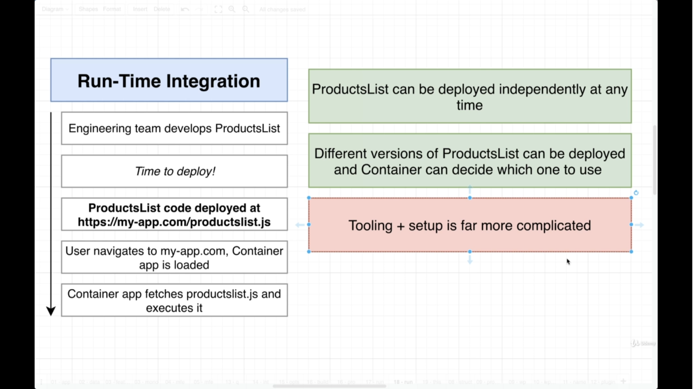
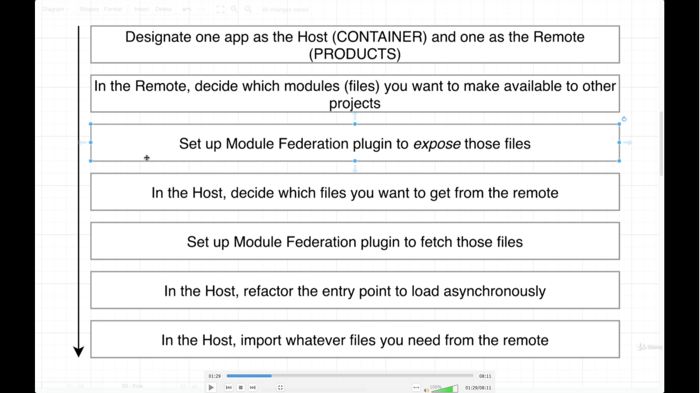
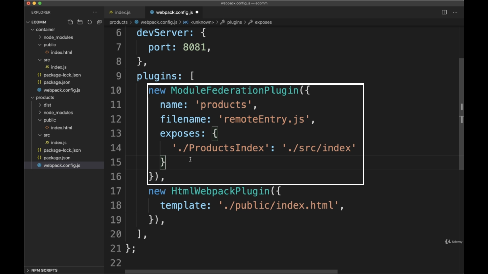
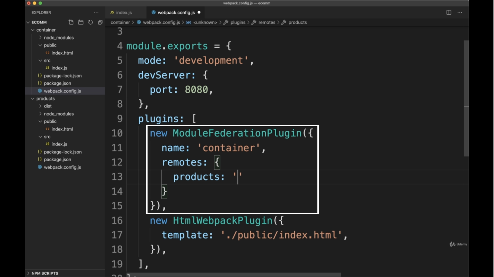
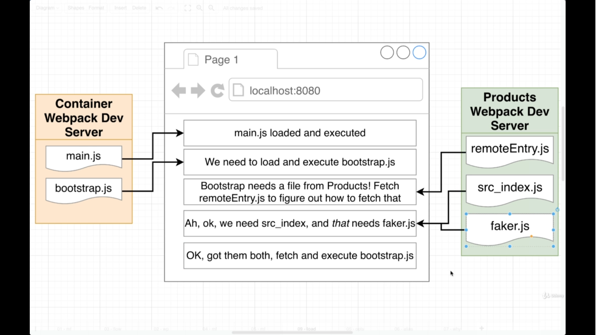
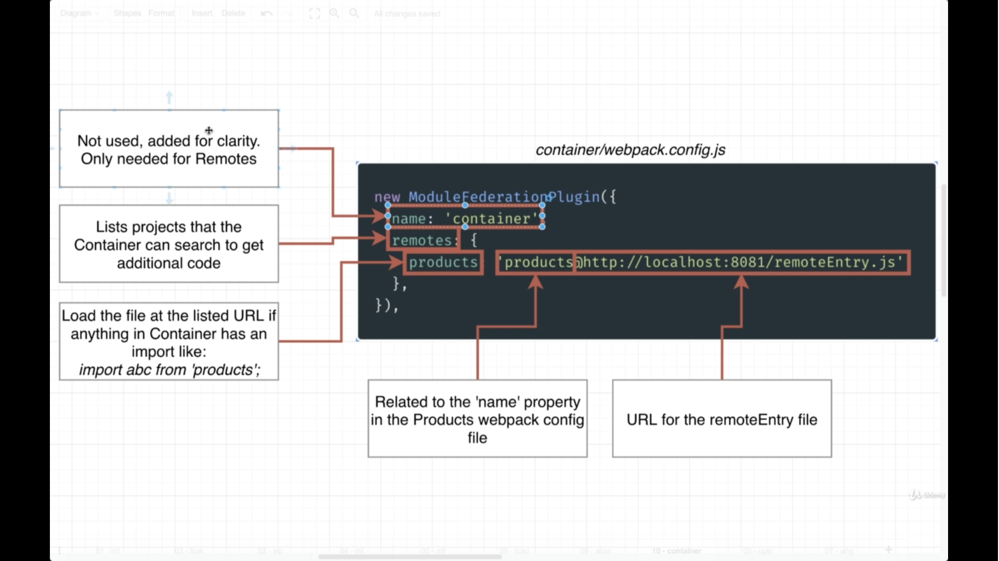

## 📘Run-Time Intigration



## 📘Html Webpack Plugin


* This Plugin automatically add various **javascript files** which is generated from **webpack** into **html File**.

## 📘Various Steps
* Various Steps



* Adding Module Plugin in **Remote**


* Adding Module Object in **Remote** plugin



* Adding Module Object in **Host** plugin



```javascript
remotes : {
    products : "products@http:/localhost:8081/remoteEntry.js"
}
```
## 📘Network Call
1. Loading Files From Remote MFE


* **main.js :** Main file is created by bundler
* **remoteEntry.js :** This file is developed by ModuleFederationPlugin like **manifesto** which has list of all loading files from MFE example *componentIndex.tsx*, it provide direction to another MFE for which file you need to load.
* **src_index.js :** which have all the components files in it

2. Loading Files in Host MFE

* When container loads its first load **index.js** file and allow **webpack** to load other **MFEs** files in **Host** example 
```javascript
import {useStore} from "container/StoreModule"
```
this like will load all files from mfe


3. Combining All things



## 📘Configuration
1. For Container (Host)



```javascript
import {useStore} from "products/StoreModule";
```
* in this case if webpack do not able to find **products** dependency in **node module**, then it will look into **ModuleFeedrationPlugin** *remotes* object for that module.

```javascript
remotes : {
    products : 'products@http://localhost:8081/remoteEntry.js'
}
```
* it will match with that **products** key

```javascript
// Making Another Example

// Naming Key
remotes : {
    productsApp : 'products@http://localhost:8081/remoteEntry.js'
}

// import
import {useStore} from "productsApp/StoreModule";
```

2. For Products (remote)


## 📘Share Dependencies


```javascript
// synchronouse
import {} from "node_module";

// asynchronous
import('file.js');
```

* Share Dependency with **singleton**


```javascript
if(process.env.NODE_ENV === 'development') {
    
}
```