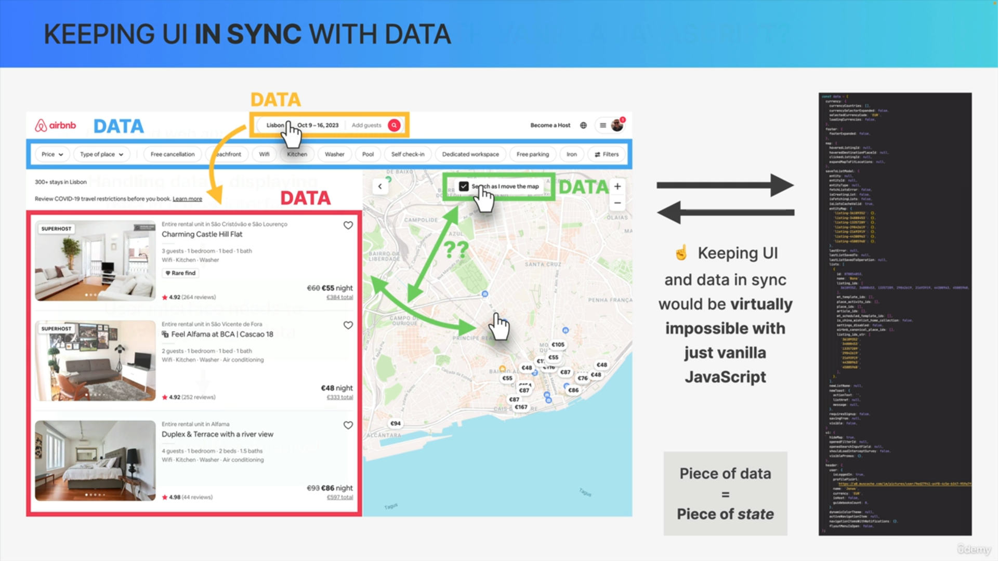
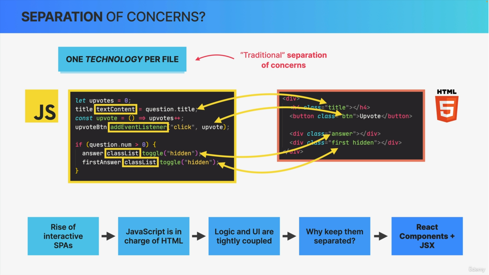
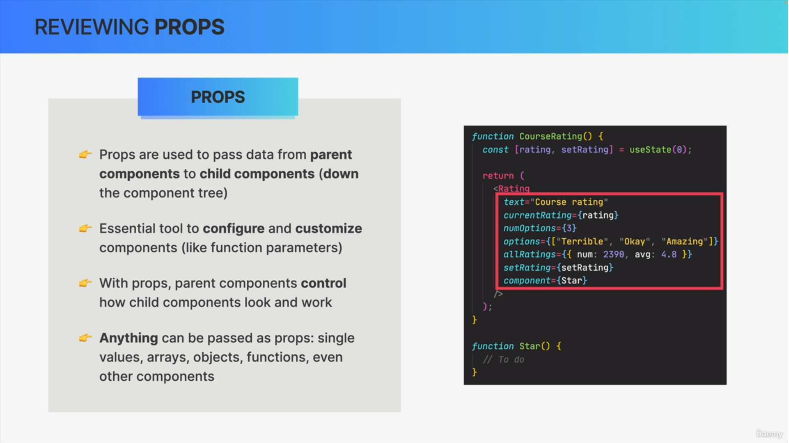
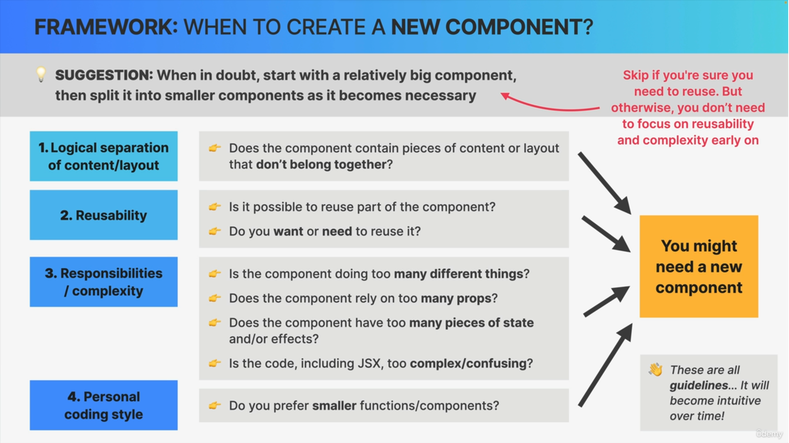
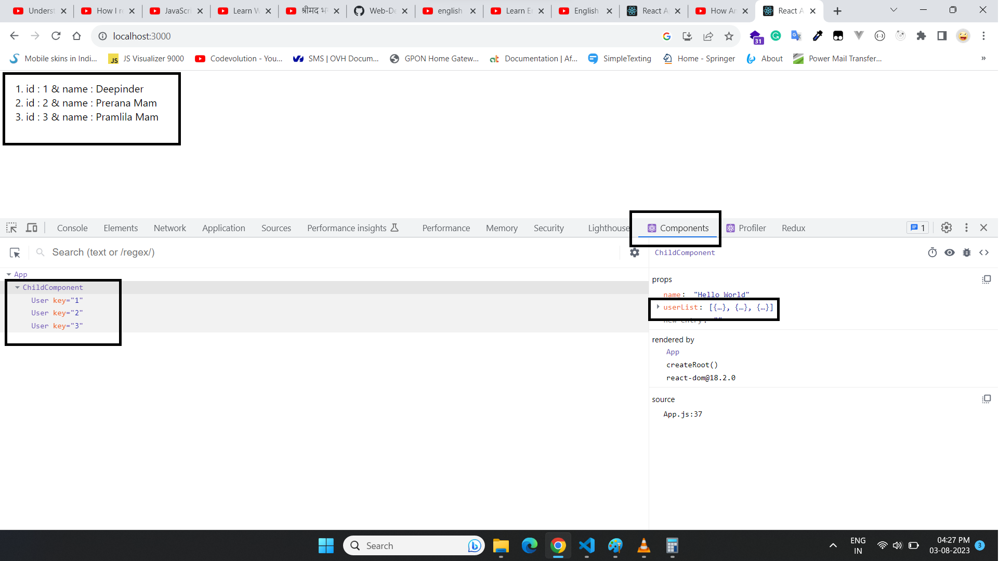
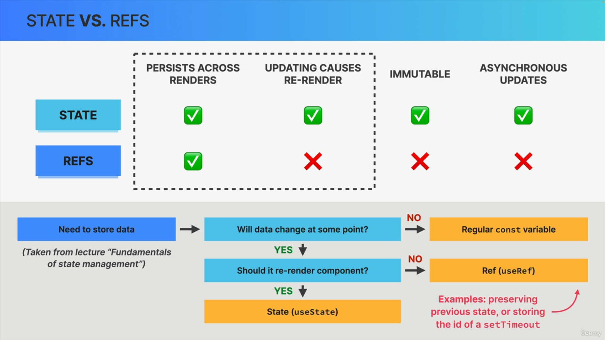
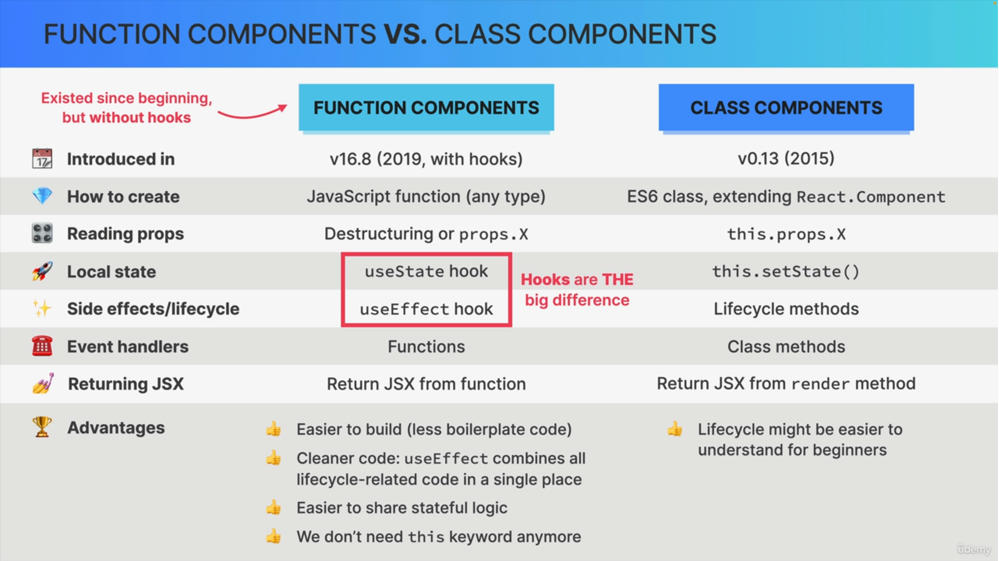

## 📘Informatics Things

* Type **React.new** in Address bar for open react code panel
* Values Persist
```js
// useState
const [total,setTotal] = useState(0)

//useRef
const inputRef = useRef(0)

// Normal Variable
let total = 0;

// On every render normal total variable value get reset to zero but in useState and useRef value will not reset on every render it will persist the value
```

## 📘Why we require React
* Server-Side-Rendering vs Client-Side-Rendering


* Example of UI in sync with Data



* Problem with Vanilla Javascript


* Why Do Front-End Frame-Works Exist ?


## 📘What is react
* **React is Javascript Library for building user interfaces**


* Based on Components


* Declarative


* State-Driven


* Javascript-library


* React Summary


## 📘Pure React (CDN Links)
* Pure React means **writing react with react Objects and React Elements**


* Getting useState and useEffect from React Object


## 📘Create-React-App


```
npx create-react-app project-name
```
---

## 📘Review of Essential javascript for React
* Destructuring, spread Operator, Template Literals, ternaries
* Short-Circuiting and Logical Operators (||, &&, ??)
  * falsy Values : **0, null, undefined, ''**
```js
// && Operator
true && "some things"   //some things
false && "some things"  // false

// || Operator
true || "Some thing" // true
false|| "Some thing" // Some thing

// ?? Nullish coalescing Operator
CheckDataExist ?? "no Data exist"

CheckDataExist == null      //  no data exist
CheckDataExist == undefined //  no data exist
CheckDataExist == 0         //  CheckDataExist means 0
CheckDataExist == false     //  CheckDataExist means false
```
* Optional Chaining
```js
let obj = {};

obj?.employee?.firstname
```

* Promises
* Async/Await
* Map, Filter, Reduce, sort (in react you mostly work with immutable Arrays)

```js
const arr = [3, 7, 1, 9, 6];
const sorted = arr.sort((a, b) => a - b);
sorted  // [ 1, 3, 6, 7, 9 ]

const desc = arr.sort((a, b) => b - a)
desc    // [ 9, 7, 6, 3, 1 ]


const sorted = books.slice().sort((a , b) => a.pages - b.pages);
```

* Working with immutable Arrays

```js
const books = [
    {
        id: 1,
        title: "book 1",
        author: "book 1"
    },
    {
        id: 2,
        title: "book 2",
        author: "book 2"
    },
    {
        id: 3,
        title: "book 3",
        author: "book 3"
    }
]

const newBook = {
    id: 6,
    title: "Harry Potter and the Chamber of Secrets",
    author: "J.k Rowling"
}

const booksAfterAdded = [...books, newBook];

booksAfterAdded
/*
[ { id: 1, title: 'book 1', author: 'book 1' },
  { id: 2, title: 'book 2', author: 'book 2' },
  { id: 3, title: 'book 3', author: 'book 3' },
  { id: 6,
    title: 'Harry Potter and the Chamber of Secrets',
    author: 'J.k Rowling' } ]
*/

// 2) Delete book object from array
const booksAfterDelete = booksAfterAdded.filter(item => item.id != 1);

booksAfterDelete
/*
[ { id: 2, title: 'book 2', author: 'book 2' },
  { id: 3, title: 'book 3', author: 'book 3' },
  { id: 6,
    title: 'Harry Potter and the Chamber of Secrets',
    author: 'J.k Rowling' } ]
*/

// 3) Update book object in the array
const booksAfterUpdate = booksAfterDelete.map(book => book.id == 2 ? {...book, nickName : 'Deepu Bhasin'} : book);

booksAfterUpdate
/*
[ {id: 2, title: 'book 2', author: 'book 2', nickName : 'Deepu Bhasin'},
  { id: 3, title: 'book 3', author: 'book 3' },
  { id: 6,
    title: 'Harry Potter and the Chamber of Secrets',
    author: 'J.k Rowling' } ]
*/
```
----
## 📘Component as Building Blocks
* Component
* **Component has main three features :**
  1. Data
  2. Logic
  3. Appearance


* Component Tree


---
## 📘JSX


* For example if we want to update a simple text in DOM by using **javascript or jquery** we first select element by **getElementByQuery** etc then **append or replace** data, but in **React** we use **states** which automatically update our data after **re-rendering**


⚠️ **Note :** in Strict mode every thing print twice

## 📘 Separation of concern
* One Technology per File



* One Component per file


* Separation Summary


## 📘Style in JSX


```
<h1 style={{color : 'Red', height : '20px'}}>
    Hello World
</h1>
```

## 📘Props
* Definition about Props



* Props are Read Only


⚠️ **Note :** **Side Effect** means changing some data that's located outside of the current function. React How ever is all about pure functions, sp functions without side effects, at least when it's about a component's data.


* One way data Flow


## 📘Rules in JSX


## 📘Conditional Rendering
1. && (Short circuit)

```js
// Good practice
{true && <Loading/> }

// Bad Practice
{propertyArray.length && <Loading/>}
```
2. ternary Operator ( true ? 'yes' : 'no')

```js
{ condition ? <h1>Hello yes</h1> : <h1>Hello No</h1> }
```

3. Element Variables

```js
let outPut;

if(condition){
    output = <h1>Hello yes</h1>
} else {
    output =  <h1>Hello No</h1>;
}

{outPut}
```
4. Multiple Rendering

```js
if(true) {
    return ()
} else {
    return ()
}

// if-else is not work in jsx
```
---
## 📗Section-Summary-1


---

## 📘Event Handling

```js

<button onClick="()=>{alert('Hello World')}">Click Me</button>
```
---
## 📘What is state

* What is State


* It give us Two Major things


```js
const [total, setTotal] = useState(0);
```
* First parameter is **value**
* Second Parameter is **Setter Function** for updating value

⚠️**Note :** 
1. The value of **state** always preserve until it gets **unmount**
2. we can only call hooks like use state on the top level of the function, not inside an if statement or inside another function or inside of loop.

* Update the current state

```js
const [count, setCount] = useState(0);

const eventHandlerCount() => {

    // passing here callback function for update value with asynchronously
    setCount(old => old  + 1)
}
```


---
## 📘Controlled Elements

* In Normal cases Every inputs maintain their own states like **values** in **DOM**
* *In **Controlled Elements** react can controls and owns the states of input fields no longer by the DOM,* So since we want to keep to now keep **input field** data inside the application so we **create states**. because that form data of course changes over time and we also want to maintain out application in sync with it.

---
## 📘State Vs Props


---
# 📔Thinking in React State Management

## 📘Local Vs Global State


---

## 📘When and Where State Use


---
## 📘Lift-Up-State


---

## 📘Derived State

* More you have **states** more you have **re-rendering**


---

## 📘Children Props

* when we avoid to pass to many props then we use **children props**

```js
import React from 'react';
import "./App.css"

function Button({ onClick, backgroundColor, color, children }) {
  return <button style={{ backgroundColor, color }} onClick={onClick}>{children}</button>
}

function App() {
  return <div className='App'>
    <Button onClick={() => alert('Hello World')} color={'black'} backgroundColor={'white'}>
      Alert
    </Button>

    <Button onClick={() => alert('Alert with emojis')} color={'black'} backgroundColor={'white'}>
      Hello 😁
    </Button>

  </div>
}

export default App;
```


# 📔Thinking in React Components, Composition, and Reusability
---
## 📘How to Split a UI into component





---
## 📘Key

```js
import React from 'react'
import './App.css';


function ChildComponent({ userList, name }) {
  console.log(userList);
  console.log(name);

  return (
    <ol>
      {userList.map(item => {
        return (<User key={item.id} id={item.id} name={item.name} />)
      })}
    </ol>)
}

function User({ id, name }) {
  return (<li> id : {id} & name : {name}</li>)
}

function App() {
  const array = [
    {
      id: 1,
      name: 'Deepinder'
    },
    {
      id: 2,
      name: 'Prerana Mam'
    },
    {
      id: 3,
      name: 'Pramlila Mam'
    }
  ];
  return <div>
    <ChildComponent userList={array} name="Hello World" />
  </div>
}

export default App
```


---

## 📘Component Categories


---
## 📘Props Drilling

* When we passing props down up to nth child is called props drilling

---

## 📘Composition Component


* Simple Example of Composition (Removing Prop-Drilling)

```js
import React from 'react'
import './App.css';


function Main({ children }) {
  return (
    <div>
      <h1>Main Component</h1>
      {children}
    </div>
  )
}

function ChildComponent({ userList }) {
  return (
    <ol>
      {userList.map(item => {
        return (<User key={item.id} id={item.id} name={item.name} />)
      })}
    </ol>)
}

function User({ id, name }) {
  return (<li> id : {id} & name : {name}</li>)
}

function App() {
  const array = [
    {
      id: 1,
      name: 'Deepinder'
    },
    {
      id: 2,
      name: 'Prerana Mam'
    },
    {
      id: 3,
      name: 'Pramlila Mam'
    }
  ];
  return (
    // using composition 
    <Main>
      <ChildComponent userList={array} />
    </Main>
  )
}
export default App
```
## 📘Passing Elements as Props (Alternative to children)
* mostly use in React-Router 
```js
import React from 'react';
import "./App.css"

function MyRender({ element }) {
  return <div>
    {element}
  </div>
}

function Button({ onClick, backgroundColor, color, children }) {
  return <button style={{ backgroundColor, color }} onClick={onClick}>{children}</button>
}

function App() {
  return <div className='App'>
    <MyRender element={<Button onClick={() => alert('Hello World')} color={'black'} backgroundColor={'white'}>
      Alert
    </Button>}>
    </MyRender>
  </div>
}

export default App;
```
---
## 📘PropTypes
* Best use with **Typescript**
* **prop-types** this package automatically comes with **react-create-app**

```js
import PropTypes from "prop-types";
```

```js
// in example sending wrong data type for background property
import React from 'react';
import PropTypes from "prop-types";
import "./App.css";

function Button({ onClick, backgroundColor, color, children }) {
  const buttonStyle = {
    backgroundColor,
    color,
  };

  return <button style={buttonStyle} onClick={onClick}>{children}</button>;
}

Button.propTypes = {
  onClick: PropTypes.func,
  backgroundColor: PropTypes.string,
  color: PropTypes.string.isRequired,
  children: PropTypes.node
};

function App() {
  return (
    <div className='App'>
      <Button onClick={() => alert('Hello World')} color={'red'} backgroundColor={111}> 
        Alert
      </Button>
    </div>
  );
}

export default App;
```


---

# 📔How React Works Behind the Scenes

## 📘Components Vs Instances Vs Elements


---
## 📘Re-Rendering


* **Reconciliation :** 
* deciding exactly which DOM elements needs to be inserted, deleted or updated in order to reflect the latest state changes so the result of the reconciliation process is going to be a list of DOM operation that are necessary to update the current DOM with new state. 
* Reconciliation is processed by a **reconciler** and we can say that the reconciler really is the **engine of react**. Its like **heart** of react. So its this reconciler that allows us to never touch the DOM directly and instead simply tell react what the next snapshot of the UI should look like based on state 
* and the current reconciler in React is called Fiber
* *The Fiber tree represents the virtual DOM that allows React to keep track of the work that needs to be done in a more fine-grained way. Each Fiber in the tree represents a unit of work that needs to be performed, such as updating a component or rendering a new element.*


## 📘How Diffing Works


## 📘Keys 

* Key help to re-render the component (reset values or state) Example : **When we are using Tabs**


## 📘Render Logics


## 📘React Third Party Library


## 📘useEffect


## Handling Error 

* Go to the network tab
* Select **Slow 3g** option first
* while calling the option select **offline** option

```js
import React, { useState } from 'react'
import './App.css';

const App = () => {
  const [data, setData] = useState([]);
  const [isLoading, setIsLoading] = useState(true);
  const [message, setMessage] = useState('Loading...');

  const getData = async () => {
    try {
      let newData = await fetch('https://jsonplaceholder.typicode.com/posts');

      if (!newData.ok) {
        throw new Error("Failed to fetch data")
      }

      newData = await newData.json();
      setData(newData)
      setIsLoading(false);
    } catch (err) {
      console.log('Api response failed')
      setMessage(err.message)
    }
  }

  useState(() => {
    getData();
  }, [])

  return (isLoading ? <h1> {message}</h1 > :
    <div>
      {data.map(item => {
        return (<li key={item.id}>id : {item.id} &  body : {item.body}</li>)
      })}
    </div>
  )
}

export default App
```


## 📘Hooks


* we can initialize the values in useState Hooks by **callback function** as well
* It only works on **initial render**
* we cannot send parameters in **callback function**
* best use when we are getting values from local storage and try to initialize in first render.

```js
import React, { useState } from 'react'
import './App.css';

const App = () => {
  const [data, setData] = useState(() => {
    const data = [{ id: 1, body: 'ok' }, { id: 2, body: '22' }, { id: 3, body: '33' }];
    return data;
  });

  return (<div>
    {data.map(item => {
      return (<li key={item.id}>id : {item.id} &  body : {item.body}</li>)
    })}
  </div>
  )
}

export default App
```


## 📘UseRef




```js
import React, { useEffect, useRef } from 'react'
import './App.css';

const App = () => {
  //1. creating reference like creating element or class in vanilla javascript
  const inputRef = useRef(null);

  useEffect(() => {

    // printing the selected element which is in current property
    console.log(inputRef.current);
    
    // make focus on selected element
    inputRef.current.focus();
  }, [])

  return (<div>
    <input
      type='text'
      name=''
      //2. attaching that reference which is provided by useRef by react, because react is declarative in nature
      ref={inputRef}
    />
  </div>
  )
}

export default App
```


```js
import React, { useRef } from 'react'
import './App.css';

const App = () => {
  const inputValue = useRef('test');
  const inputHandler = (e) => {
    inputValue.current = e.target.value

    // it will print 
    console.log(inputValue.current);
  }

  // it will print only in install render after that it will not work
  console.log(inputValue.current);

  return (<div>
    {inputValue.current}
    <br />
    <input
      type='text'
      name=''
      onChange={inputHandler}
    />
  </div>
  )
}

export default App
```

## 📘Custom Hooks


## 📘Functional Vs Class Component


## 📘useReducer


## 📘Router


