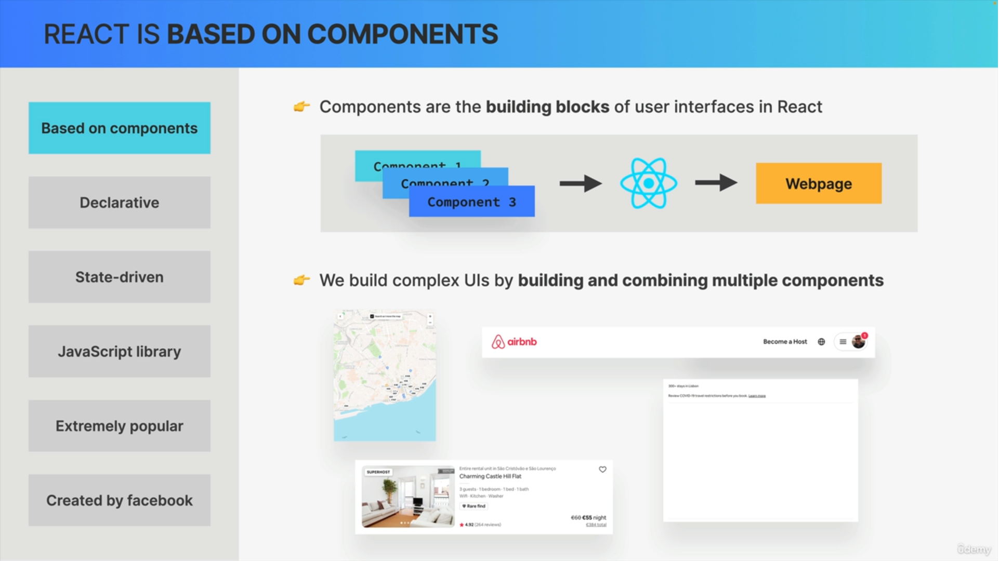

## 📘Why we require React
* Server-Side-Rendering vs Client-Side-Rendering

* Example of UI in sync with Data

* Problem with Vanilla Javascript
  

* Why Do Front-End Frame-Works Exist ?

## 📘What is react
* **React is Javascript Library for building user interfaces**

* Based on Components

* Declarative

* State-Driven

* Javascript-library

* React Summary

