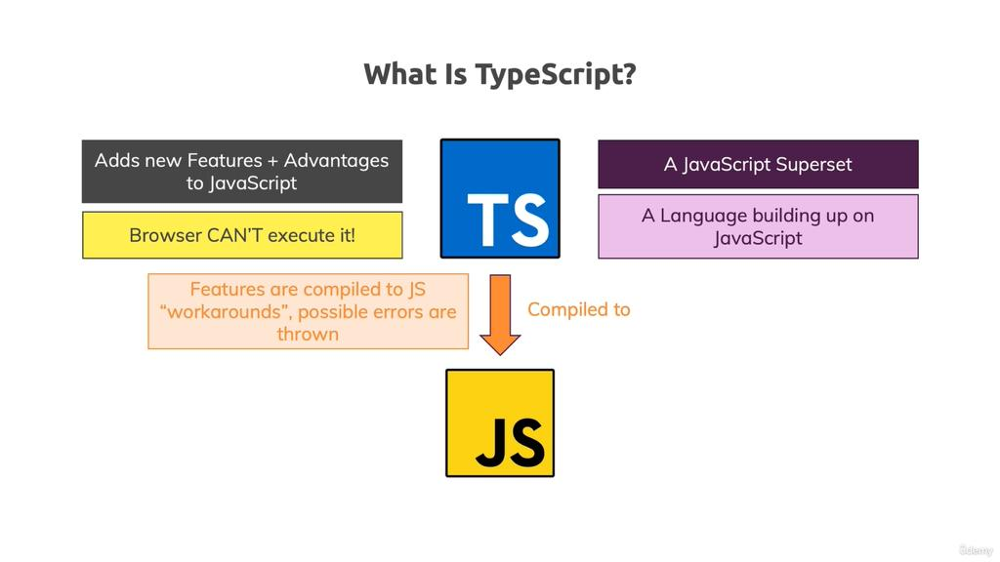

## 📘What is TypeScript


* **TypeScript :** type system only helps you during development (i.e before the code gets **compiled**) which force you to write Filter, cleaner and better code.

📚 **Conceptual Example :** 

```javascript
 function add(num1, num2) {
    if (typeof num1 === 'number' && typeof num2 === 'number') {
        return num1 + num2;
    } else {
        return +num1 + +num2;
    }
}
console.log(add(1, 2));
console.log(add('1', '2'));
```

Command for installing Typescript on Globally

```
npm install -g typescript
```
* TypeScript is *Programming language* heance need **complier** for execute the codes.
* Extention is **.ts**

Example 

```javascript
// index.ts
const btn = document.querySelector('#button')! as HTMLButtonElement;
const num1 = document.querySelector('#num1')! as HTMLInputElement;

function add(num1 : number, num2 : number) {
    return +num1 + +num2;
    
}
console.log(add(1, 2));
```

Command to execute File
```
npx tsc index.ts
```
This command will create a new file **index.js** and convert your whole typescript code into javascript code

```javascript
var btn = document.querySelector('#button');
var num1 = document.querySelector('#num1');
function add(num1, num2) {
    return +num1 + +num2;
}
console.log(add(1, 2));
```
⚠️ **Note :** always import javascript files in *html files* *beacuse* browser can only understand *javascript* not the *typescript*

## 📘Core Types


* Core javascript Example for **type checking**, but we are checking Error on **Run Time**, which effect our speed 
```javascript
function add(n1, n2) {
    if (typeof n1 !== 'number' || typeof n2 !== 'number') {
        throw new Error('Invalid Input');
    }
    return n1 + n2;
}

console.log(add(2, 3.5));   // 5.5
console.log(add('2', 3));   // Error
```
⚠️ **Note :** The key difference is: **Javascript use "dynamic types"** (resolved at runtime), **TypeScript uses "static types"** (set during development)

```javascript
// Number Type
let age : number = 1;

function add (n1:number, n2:number) {
    return n1 + n2;
}

// Boolean Type
let isLogin : boolean = true;

// String Type
let fullName : string = 'Deepinder Singh';

// Object Type
type Person{
    name : String;
    age : Number
}

let person : Person={
    name : 'Deepu',
    age : 30
}
console.log(person.name);

// Array Strimg & Nested Array
type Product {
  id: String;
  price: Number;
  tags: String[];
  randomData : any[];
  isAccess : Boolean[];
  details: {
    title: String;
    description: String;
  }
}
const product : Product = {
  id: 'abc1',
  price: 12.99,
  tags: ['great-offer', 'hot-and-new'],
  randomData : ['test', 1, true]
  isAccess : [true, false, true]
  details: {
    title: 'Red Carpet',
    description: 'A great carpet - almost brand-new!'
  }
}
```

⚠️ **Note :** 
* Where to use or not
```javascript
// its not a good practice
let age : number = 1; 


// Good practice
let age : number;
age = 10;
```
* Avoid **any** type as much you can

