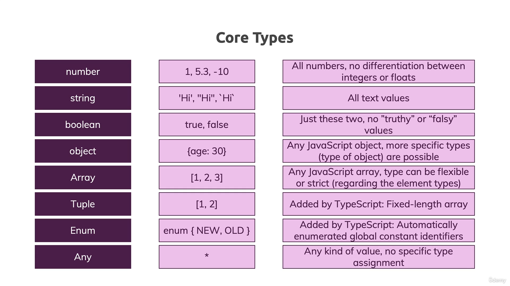

## 📘What is TypeScript


* **TypeScript :** type system only helps you during development (i.e before the code gets **compiled**) which force you to write Filter, cleaner and better code.

📚 **Conceptual Example :** 

```javascript
 function add(num1, num2) {
    if (typeof num1 === 'number' && typeof num2 === 'number') {
        return num1 + num2;
    } else {
        return +num1 + +num2;
    }
}
console.log(add(1, 2));
console.log(add('1', '2'));
```

Command for installing Typescript on Globally

```
npm install -g typescript
```
* TypeScript is *Programming language* heance need **complier** for execute the codes.
* Extention is **.ts**

Example 

```javascript
// index.ts
const btn = document.querySelector('#button')! as HTMLButtonElement;
const num1 = document.querySelector('#num1')! as HTMLInputElement;

function add(num1 : number, num2 : number) {
    return +num1 + +num2;
    
}
console.log(add(1, 2));
```

Command to execute File
```
npx tsc index.ts
```
This command will create a new file **index.js** and convert your whole typescript code into javascript code

```javascript
var btn = document.querySelector('#button');
var num1 = document.querySelector('#num1');
function add(num1, num2) {
    return +num1 + +num2;
}
console.log(add(1, 2));
```
⚠️ **Note :** always import javascript files in *html files* *beacuse* browser can only understand *javascript* not the *typescript*

## 📘Core Types


* Core javascript Example for **type checking**, but we are checking Error on **Run Time**, which effect our speed 
```javascript
function add(n1, n2) {
    if (typeof n1 !== 'number' || typeof n2 !== 'number') {
        throw new Error('Invalid Input');
    }
    return n1 + n2;
}

console.log(add(2, 3.5));   // 5.5
console.log(add('2', 3));   // Error
```
⚠️ **Note :** The key difference is: **Javascript use "dynamic types"** (resolved at runtime), **TypeScript uses "static types"** (set during development)
* Number Type
```javascript
let age : number = 1;

function add (n1:number, n2:number) {
    return n1 + n2;
}
```
* Boolean Type 
```javascript
let isLogin : boolean = true;
```
* String Type

```javascript
let fullName : string = 'Deepinder Singh';
```
* Object Type
```javascript
type Person{
    name : String;
    age : Number
}

let person : Person={
    name : 'Deepu',
    age : 30
}
console.log(person.name);
```
* Array String & Nested Array

```javascript
type Product {
  id: String;
  price: Number;
  tags: String[];
  randomData : any[];
  isAccess : Boolean[];
  details: {
    title: String;
    description: String;
  }
}
const product : Product = {
  id: 'abc1',
  price: 12.99,
  tags: ['great-offer', 'hot-and-new'],
  randomData : ['test', 1, true]
  isAccess : [true, false, true]
  details: {
    title: 'Red Carpet',
    description: 'A great carpet - almost brand-new!'
  }
}
```
* Tuple
```javascript
type Person {
    name : String;
    age : Number;
    role : [Number, String];    // only can add two types
}

let person : Person = {
    name : 'Deepinder',
    age : 19,
    role : [2, 'Admin']
}

// Because in tupal we cannot add more than two element
person.role.push('operator')    // Error
```
* Enum Type
  
```javascript
enum Role {ADMIN = 1, READ_ONLY = 2, AUTHOR = 3};
let person = {
    name : 'Deepinder',
    age : 19,
    role : Role.ADMIN
}

if(person.role === Role.ADMIN) {
    console.log('Admin')
}
```
* Any
  
```javascript
type Person {
    role : any[];
}

let person : Person = {
    role : [2, 'Admin', true]
}
```
* Union Type
  
```javascript
let age : number | string;

```
* Literal Type
```javascript
function test (name : 'Deepu' | 'Dp') {
    return name
}

test('Dp');
test('ok'); // cause error because value not in option
```

* Types Aliases Custom Types

```javascript
type Role = number | string;
type ValidUser = boolean | number;

let role: Role; 
let isLogin  : ValidUser;
```
* Function Return Type

```javascript
// returning number
function add(n1 : number, n2 : number) : number {
    return n1 + n2;
}

// returning void
function printValue () : void {
    console.log('Hello World')
} 

add(1,2);
```
* Function Type Callback

```javascript
function cal(n1 : number, n2 : number, cb : (res : number) => void) : void{
    let result  = n1 + n2;
     cb(result);
}

cal(1, 2, (result) => console.log(result));
```
* The never Type

```javascript
function generateError(message : string, code : number) : never {
    // through types error are never type
    throw {message: message, errorCode : code}
}

const result = generateError('An error occured !', 500);

console.log(result) // not print undefined
```

⚠️ **Note :** 
* Where to use or not
```javascript
// its not a good practice
let age : number = 1; 


// Good practice
let age : number;
age = 10;
```
* Avoid **any** type as much you can

