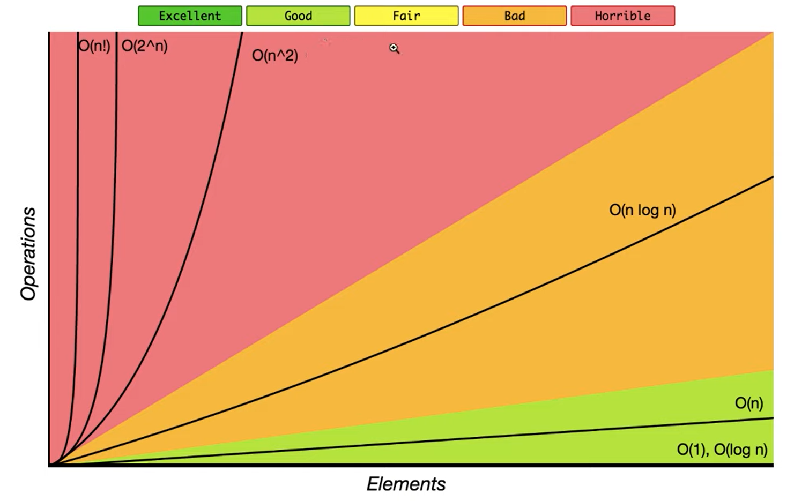

## Big O Notation Bar Graph

---
## What does _Better_ implementation means ?

> "Better" means faster time to finish and to use less memory (RAM), although there is much stronger emphasis on the former


```javascript
const sumUpToV1 = n => {
 let total = 0;
 for (let i = 1; i <= n; i++) {
  total += i;                        // here is 1 * N operations => O(n) : Big O Notation
 };
 return total;
}

const sumUpToV2 = n => {
    return (n * (n + 1) / 2);        // here is 3 operations = O(3)  : Big O Notation
}

console.time('v1');
console.log(sumUpToV1(100000000));
console.timeEnd('v1');

console.time('v2');
console.log(sumUpToV2(100000000));
console.timeEnd('v2');	
```

---
## Identifying Runtime Complexity (Rules of Thumb)

1. Iterating over a collection OR using N as a pointer with a for loop  : O(n)
2. Iterating over the same collection with nested for loops  : O(n^2)
3. Iterating over different collection with nested for loops : O(n*m)

---
## Rules for big O Notation
1. Constants do Not Matter 
		
	* O(12)  	-> O(1)
	* O(702)  	-> O(1)
	* O(2n)   	-> O(n)
	* O(n/2)  	-> O(n)
	* O(13n^2) -> O(n^2)

1. Smaller Terms do Not Matter

	* O(n+10) 			-> O(n)
	* O(1337n + 50)		-> O(n)
	* O(n^2 + 13n + 8)	-> O(n^2)

> Other terms for Big O Notation/ Time Complexity

   * O(1) 	-> Constant Time 	: good_
   * O(n) 	-> Linera Time 		: fair		
   * O(n^2) -> Quaratic Time	: bad
	 
	 _O(1) > O(n) > O(n^2)		: performance_ 

---
## Space Complexity versus Time Complexity

* Space Complexity : How much more memory use (RAM) do we need as the inputs provided to the code gets larger ?
* Time Complexity : How much more runtime do we need as the inputs provided to the code gets larger ? 
 
	> *Both of the above still use Big O notation*

Space Complexity Rules of thumb
* Storing values in variables always takes up memory
1. Most Primitive (Boolean and Numbers) takes up O(1) / Constant Space
	* var x=100 and var x = 200 take up same amount of memory
1. String, Arrays and Objects take up O(n) / Linear Space
	* An Array with 4 elements takes up twice the memory of Array with 2 elements 

Examples 

```javascript		
function Owith1(n) {
  for (let i = 0; i < n; i++) {
    console.log("whats up DP ?");
  }
}

//O(1) Space Complexity

function Owith1withNumber(arr) {
  let total = 0;
  arr.map(item => total += item);
  return total;
}
//O(1) Space Complexity

function OwithN(str) {
  let reveresedStr = '';
  for (let i = 0; i < str.length; i++) {
    reveresedStr = str[i] + reveresedStr;
  }
  return reveresedStr;
}
//O(n) Space Complexity

function OwithNDivideBy2(arr) {
  let resArr = [];
  arr.map(item => {
    if (Math.random() < 0.5) {
      resArr.push(item)
    }
  })
  return resArr;
};

//O(n/2) -> O(n) Space Complexity    (because removing of constants rule)
```
> Why is Time Complexity Prioritized Over space Complexity
	
* Costs to produce and run processors are much higher compared to RAM. 
* Better use of time writing code that is easier on the processor...
* Consumers / users in general care more about speed than Ram usage. example : Google Chrome...    		 		
---
## Logarithms
	
	 Log2 8 = 3						Log2 16 = 4 

> if the input / N is doubled then we only have to do one more operation.

Example : 
1. Question : 
	
	I am thinking of a #from 1 to 50 (Answers is 1)
		
		is the number 25 ? -> "No it is less than that"
		is the number 12 ? -> "No it is less than that"
		is the number 6 ? -> "No it is less than that"
		is the number 3 ? -> "No it is less than that"
		is the number 2 ? -> "No it is less than that"	
		is the number 1 ? -> "Yes"

		6 "Operations" / Guesses (Worst Case)

2. Question : 

	I am thinking of a #from 1 to 100 (Answers is 1)

		is the number 50 ? -> "No it is less than that"
		is the number 25 ? -> "No it is less than that"
		is the number 12 ? -> "No it is less than that"
		is the number 6 ? -> "No it is less than that"
		is the number 3 ? -> "No it is less than that"
		is the number 2 ? -> "No it is less than that"	
		is the number 1 ? -> "Yes"
		
		7 "Operations" / Guesses (Worst Case)

		Big notiation only considered worst case	

The Guessing Numbers Game : Log N

* Our Guessing Numbers game has log N implementation, because we can elminate Half the remaining gusesse with each guess.
* We are able to elminate Half the gusesse with each guess, since the game rules allow us to know if our guess is SMALLER or 
		GREATER on each guess
* what would a more "inefficent" and less "fun" Guessing Numbers Game look like ?

1. Question  
	
	I am thinking of a #from 1 to 50 (Answers is 1)

		is the number 25 ? -> "No it is less than that"
		is the number 12 ? -> "No it is less than that"
		is the number 6 ? -> "No it is less than that"
		is the number 3 ? -> "No it is less than that"
		is the number 2 ? -> "No it is less than that"	
		is the number 1 ? -> "Yes"
		
		50 "Operations" / Guesses (Worst Case)

2. Question
		
	I am thinking of a #from 1 to 100 (Answers is 1)

		is the number 50 ? -> "No it is less than that"
		is the number 25 ? -> "No it is less than that"
		is the number 12 ? -> "No it is less than that"
		is the number 6 ? -> "No it is less than that"
		is the number 3 ? -> "No it is less than that"
		is the number 2 ? -> "No it is less than that"	
		is the number 1 ? -> "Yes"
		
		100 "Operations" / Guesses (Worst Case)
		
		Big notiation only considered worst case

		
* *O(log N) - Logarithmic Time Complexity*
	* you can think of it as either ....
	* If the input is doubled then we only have to do one more Operation. 
		
		OR
	* EveryTime we do an "operation" like Guessing, we can elminate Half the remaining operations.							

---
## Algorithms 
 
> Algorithms require consistent pratice to remain after the initial leaning period

Link : [Youtube-Alg-DS-Course-Starter-Code](https://github.com/KevinRSDNguyen/Youtube-Alg-DS-Course-Starter-Code "Youtube-Alg-DS-Course-Starter-Code")

---
## Reverse Algorithm
	
1. Turn the string into an array
2. Use array method of reverse() to reverse contents of array
3. Turn the reversed array back into string

> Without inbuilt Methods

1. Forward Loop
				
```javascript
function reverse(str) {
  let count = str.length;
  let strRev = '';
  for (let i = 0; i < count; i++) {
    strRev = str[i] + strRev;
  }
  return strRev;
}

```	
2. Backword loop
		
```javascript
function reverse(str) {
  let count = str.length;
  let strRev = '';
  for (let i = count - 1; i >= 0; i--) {
    strRev += str[i];
  }
  return strRev;
}
```
> With inbuilt methods
1. Split + reverse + join
	
```javascript
function reverse(str) {
  return str.split('').reverse().join('');
}
```	
2. Reduce
	
```javascript	
function reverse(str) {
  let reverseString = str.split('').reduce((acc, cum) => {
    acc = cum + acc;
    return acc;
  }, '');

  return reverseString;
}
```	
* *Time Complexity : O(N) we go over every charcter in input String Space Complexity : O(N )* 

---
## Palindrome Algorithm

Example
* Madam === madaM
* TEsT  === TsET	 

Without inbuilt method

```javascript	
function palindrome(str) {
  str = str.toLowerCase();
  let revrseString = str.split('').reverse().join('');
  if (str == revrseString) return true;
  else return false;
}
```	
With inbuilt method
```javascript
function palindrome(str) {
  str = str.toLowerCase();
  let reverse = '';

  for (let i = 0; i < str.length; i++) {
    reverse = str[i] + reverse;
  }
  if (reverse === str) return true;
  else return false;
}
```	
---
## ReverseInt Algorithm

Example 
* reverseInt(13) === 31
* reverseInt(404) === 404
* reverseInt(100) === 1
* reverseInt(-13) === -31
* reverseInt(-100) === -1

Steps
1. Turn numbers into string
1. Reverse the String1
1. Turn the string into a number
```javascript
function reverseInt(n) {
  let reverse = n.toString().split('').reverse().join('');
  reverse = parseInt(reverse);
  if (n < 0) {
    reverse = reverse * -1;
  }
  return reverse;
}	
```
* *Time complexity : O(Log N) if the input increse by factor of 10, we do one more operation*

---
## MaxChar Algorithm
* maxChar("I loveeeeeee noodles") === "e"
* maxChar("1337") === "3"
```javascript
function maxChar(str) {
  let charCountObj = {};
  let maxChar = '';
  let maxCount = 0;

  if (typeof (str) !== 'string') return 'Please provide valid String';

  for (let i of str) {
    charCountObj[i] = charCountObj[i] + 1 || 1;
    if (charCountObj[i] > maxCount) {
      maxChar = i;
      maxCount = charCountObj[i];
    }
  }
  return maxChar;
}
```	
* *Time Complexity : O(N)* we visit every charcter in input string
* *Space Complexity : O(1)* charcter count Obj will have at most 26 key-val pairs (beacuse 26 charcter in our Letters)	
---
## Fizzbuzz Algorithm
Write a program that console logs the numbers
	 from 1 to n. But for multiples of three print
	 “fizz” instead of the number and for the multiples
	 of five print “buzz”. For numbers which are multiples
	 of both three and five print “fizzbuzz”.

Example	 
* fizzBuzz(5);
* 1
* 2
* fizz
* 4
* buzz

```javascript
function fizzBuzz(n) {
  for (let i = 1; i <= n; i++) {
    let str = '';
    if (i % 3 === 0) {
      str += 'fizz';
    }

    if (i % 5 === 0) {
      str += 'buzz';
    }

    if (str == '') {
      str = i;
    }
    console.log(str)
  }
}
```
* *Time complexity for fizzBuzz Complexity Analysis : O(N)*
---
## Capitalize Algorithm

```javascript
function capitalize(str) {
  str = str.toLowerCase();
  str = str.split(" ");
  for (let i = 0; i < str.length; i++) {
    str[i] = str[i][0].toUpperCase() + str[i].slice(1);
  }
  str = str.join(" ");
  return str;
}
```	
* *Time complexity for Capitalize Complexity Analysis : O(N)*
---
## Chunk Algorithm
Examples
* chunk(["a", "b", "c", "d"], 2) --> [[ "a", "b"], ["c", "d"]]
* chunk([0, 1, 2, 3, 4, 5], 4) -->  [[0, 1, 2, 3], [4, 5]]

>My soluction 
 
 ```javascript
function chunk(array, size) {
  let count = array.length;
  let newArray = [];
  let temp = [];
  for (let i = 0; i < count; i++) {
    let tempNumber = i + 1;

    temp.push(array[i]);

    if (tempNumber % size == 0) {
      newArray.push(temp)
      temp = [];
    }

    if (count === tempNumber) {
      if (temp.length > 0) {
        newArray.push(temp)
        temp = [];
      }
    }
  }
  return newArray;
}
```	
> Provide Solution
 ```javascript
function chunk(array, size) {
  let res = [];
  for (let i = 0; i < array.length; i++) {
    const item = array[i];
    const last = res[res.length - 1];
    console.log(last);

    if (!last || last.length === size) {
      res.push([item]);
    } else {
      last.push(item)
    }
  }
  return res;
}
```
* *Time complexity and Space Complexity : chunk Complexity Analysis : O(N)*
---
## Anagrams Algorithm
Examples
* anagrams('heart', 'earth') --> True
* anagrams('heart', '  earth') --> True
* anagrams('Heart!', 'EARTH') --> True
* anagrams('lol', 'lolc') --> False

> Without inBuilt Method
 ```javascript
function anagrams(stringA, stringB) {
  stringA = stringA.toLowerCase().replace(/[\W_]+/g, '').trim();
  stringB = stringB.toLowerCase().replace(/[\W_]+/g, '').trim();

  if (stringA.length !== stringB.length) return false;

  let stringACharCount = {};

  for (let i of stringA) {
    stringACharCount[i] = stringA[i] + 1 || 1;
  }

  for (let i of stringB) {
    if (!stringACharCount[i]) {
      return false;
    } else {
      stringACharCount[i]--;		// setting character to zero or undefined
    }
  }
  return true;
}
```
* *Time complexity : O(N + M) we go over character in both input string*
* *Space Complexity : O(1) Character Count object has at most 26 key-val pairs*

>With in Built Method

```javascript
function anagrams(stringA, stringB) {
  stringA = stringA.toLowerCase().replace(/[\W_]+/g, '').trim();
  stringB = stringB.toLowerCase().replace(/[\W_]+/g, '').trim();

  stringA = stringA.split('').sort().join('');
  stringB = stringB.split('').sort().join('');

  if (stringA !== stringB) {
    return false;
  }
  return true;
}
```
* *Time complexity : O(N * Log N) we made use of a Sort algorithm beacuse of sort() it is implementing nested for loop*
* *Space complexity : O(N) Sorted Strings as long as input string*
---

## Steps Algorithm
Examples
* steps(2)
	* '# '
	* '##'
* steps(3)
	* '#  '
	* '## '
	* '###'
* steps(4)
    * '#   '
    * '##  '
    * '### '
    * '####'

```javascript
function steps(n) {
  str = '';
  for (let i = 1; i <= n; i++) {
    for (let j = 1; j <= i; j++) {
      str += '#';
    }
    for (let j = n; j > i; j--) {
      str += '*';
    }
    str += '\n';
  }
  console.log(str);
  return str
}
```
* *Time Complexity : O(N^2) Both Inner and Outer For loops run N Times*
---
## Pyramid Algorithm

Examples
* pyramid(1)
  * '#'
* pyramid(2)
 	* ' # '
 	* '###'
* pyramid(3)
 	* '  #  '
 	* ' ### '
 	* '#####'
```javascript
function pyramid(n) {
  let str = ''
  for (let i = 1; i <= n; i++) {
    for (let j = n; j > i; j--) {
      str += ' '
    }
    for (let j = 0; j < i; j++) {
      str += '#'
    }
    for (let j = 1; j < i; j++) {
      str += '#'
    }
    str += '\n';
  }
  return str;
}	
```
* *Time Complexity : O(N^2) Outer loop runs N times, Inner Loop run roughly N Times*
---

## Vovles Count Algorithm
Examples
* vowels('What') --> 1
* vowels('Why?') --> 0
* vowels('aEiOu') --> 5
* vowels('I am a world-class developer using iterations') --> 16

> With indexOf  

```javascript
function vowels(str) {
  let count = 0;
  let vovles = 'aeiou'.split('');
  for (let i of str.toLowerCase()) {
    if (vovles.indexOf(i) !== -1) {
      count++
    }
    return count;
  }
}
```

> With includes  
```javascript
function vowels(str) {
  let count = 0;
  let vovles = 'aeiou'.split('');
  for (let i of str.toLowerCase()) {
    if (vovles.indexOf(i) !== -1) {
      count++
    }
    if (i.includes('a')
      || i.includes('e')
      || i.includes('i')
      || i.includes('o')
      || i.includes('u')
    ) {
      count++;
    }
  }
  return count;
}
```
* *Time Complexity : O(N) All Characters of input string must be checked to see if it is a vowel*
* *Space Complexity : O(1)*

---
## Searching Algorithm
Various Methods
* inclues()
* indexOf()
* find()
* findIndex()
* filter()

```javascript
const inventory = ["bikes", "backpackes", "laptops", "eggs"];

inventory.includes("backpackes")			// true
inventory.indexOf("backpackes")   			// 1
inventory.find(item => item == "backpackes") 		// backpackes
inventory.findIndex(item => item == "backpackes") 	// 1
inventory.filter(item => item == "backpackes"); 	// ["backpackes"]

``` 

