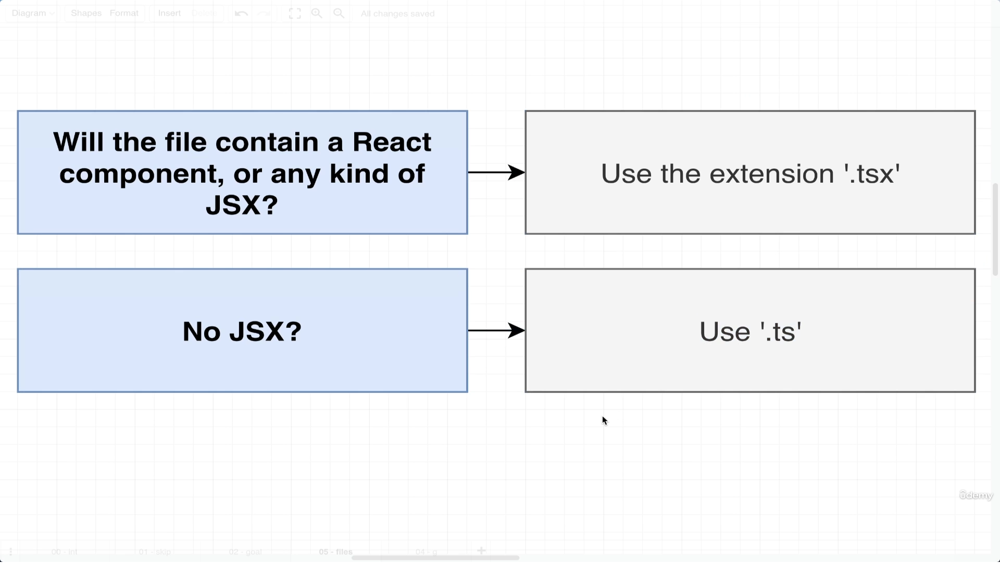
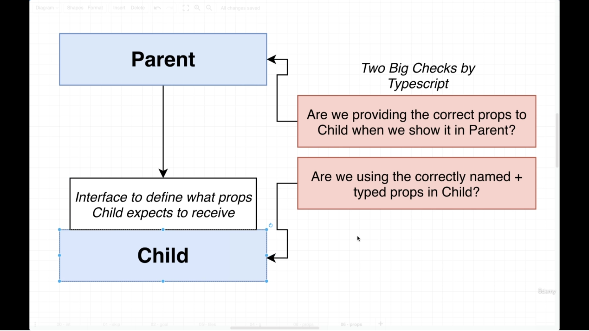
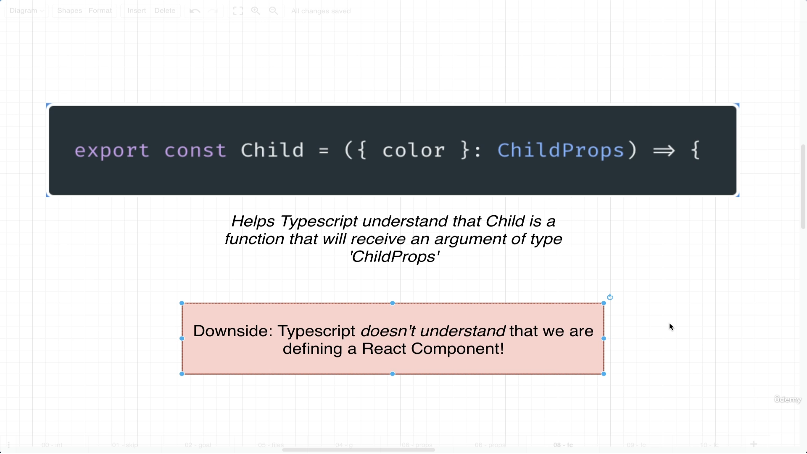
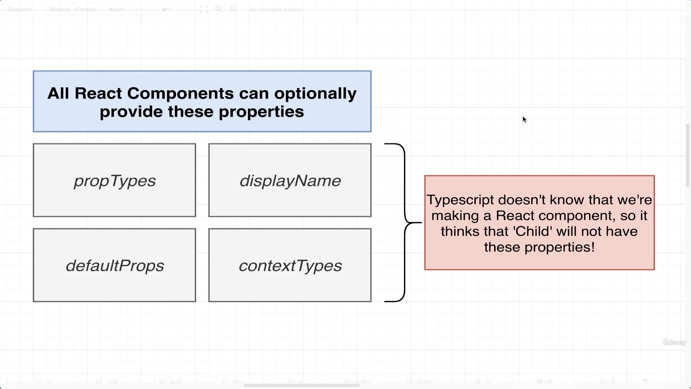
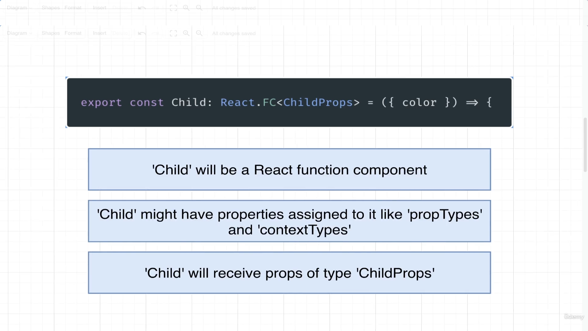

### Command
```
npx create-react-app <appname> --template typescript
```
### Rules for TypeScript in React


### Types in Props


### Basic Example of PropType (String)

```javascript
import './App.css';

// creating interface 
interface ChildProps {
  color : string
}
function Child({color} : ChildProps) {
  return (
    <div>Hello World {color}</div>
  );
}

function App() {
  return (
    <div className="App">
        <Child color='red'/>
    </div>
  );
}

export default App;
```
* Here is problem in this approach beacuse its basically strictly tight to only _TypeScript_ not to _React_.



* We did not get various options according to React like default value etc



```javascript
interface ChildProps {
  color : string
}

const Child: React.FC<ChildProps> = ({color})=> {
  return (
    <div>Hello World {color}</div>
  );
}

// Or 

const Child: React.FunctionComponent<ChildProps> = ({color})=> {
  return (
    <div>Hello World {color}</div>
  );
}

```
* Best Apporach for React with TypeScript and you will get all the various above options as well like default value etc.




### Basic Example of PropType (Function)

```javascript

import './App.css';

interface ChildProps {
  onClick : ()=> void
}

const Child: React.FunctionComponent<ChildProps> = ({color, onClick})=> {
  return (
    <div>
      <button onClick={onClick}>Click Me</button>
    </div>
  );
}


function App() {
  return (
    <div className="App">
        <Child onClick={()=> console.log('Hello World')}/>
    </div>
  );
}
export default App;
```

### PropType with UseState

```javascript
// string type
const [name, setName] = useState<string>('');

// String of Array
const [guest, setGuest] = useState<string[]>([]);

// Union Type
const [user,setUser] = useState<{name : string, age : number} | undefined>();

// checking curcit condition
{user && user.name}
```