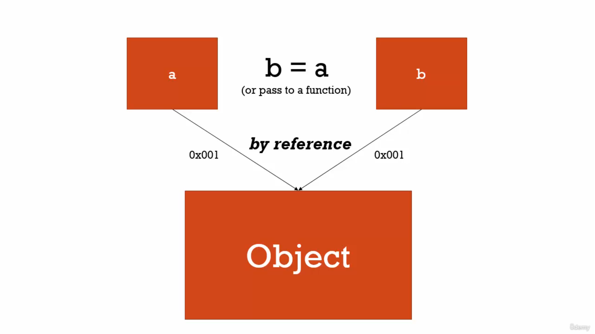

# 📔 ES5
## 📘 Developer Responsibility

Write good code so everyone can read and understand easily
---
## 📘 Operators are functions

* in Example 1 : **=** is an *operator (function)*  which takes **2** parameters **a** and **3** and then assign value.
* in Example 2 : **+** is an *operator (function)*  which takes **2** parameters **3** and **2** and then return and expression.

```javascript
// Example 1
var a = 3;

// Example 2
var b = 3 + 2;
```
---

## 📘 Conceptual Aside
1. **Syntax Parsers** : A program that reads your code and determines what it does and if its grammar is valid, e.g., an interpreter or a compiler.
2. **Execution Contexts** : *A Wrapper to help manage the code that is running*. There are lots of lexical environments. which one is currently running is managed via execution context. it can contain things beyond what you've written in your code.
3. **Lexical Environments** : *where something sits physically in the code you write*. 'Lexical' means 'having' to do with words or grammar. A lexical environment exists in programming languages in which **where** you write something is important.

---
## 📘 Name/Value Pairs and Objects
* A Name which **maps** to a **unique value**. eg *Address = '100 Main St.'*.
* The name may be defined more than once, but only can have one value in any given **context**.
* That value may be more name/value pairs.
* **Object** : *A Collection of name values pairs*. The simplest definition when talking about javascript.


---
## 📘Creation & Hoisting

⚠️ **Why Hoisting?**
* Using function before actual declaration.
* var hoisting is just a byproduct.

Javascript Execution Context has two phase<br/>
1. **Creation Phase** : Set up memory for variables and functions, also set placeholder for variables called **undefined**.
2. **Execution Phase** : means assigns values to variables but not for functions.

In javascript __variables and functions__ are all hoisted to the top of the scope in which they are declared. The scope is usually either global scope or a function scope.

 * variables are always __partially hoisted__ and set to __undefined__.
 * functions are always __fully hoisted__.


so during the creation phase javascript engine moves your variables and function declarations of the top their respective scope
```javascript
console.log(number1);
var number1 = 10;

// javascript is doing this process in background
var number1;

console.log(number1);

number1 = 10;
```

```javascript
var num = 50;

function logNumber() {
    console.log(num);   // undefined
    var num = 10;
}

logNumber();
```

⚠️ Note <br/>
* __let, const, function Expression and classes__ are not hoisted.
* In **const** : Only **Primitive Values** are **immutable** but *Array and Objects* are **non-primitive** types values
* __Temporal Dead Zone__ :
  * is the time between the __declaration__ and __the initialization__ of _let_ and _const_ variables.
  * Temporal Dead Zone is the term to describe the state where variables are in the scope but they are not yet declared.
  * why TDZ : **Make it easier to avoid and catch errors**, accessing variables before declaration is a bad practice and should be avoided.


```javascript
function logNumber() {
    var num1 = num2 = 10;
}

console.log(num1)   // error
console.log(num2)   // 20 because it become global variable

logNumber();
```


```javascript
function test() {
    let total = 0;
    if (true) {
        var numberOne = 10;
        let numberTwo = 20;
        total = numberOne + numberTwo;
    }
    numberOne; // 10 because of function scope
    numberTwo; // error because of block scope
    total; // 30 because of test function block scope
}
test();
```
---
## 📘Undefined vs Not Defined
* **undefined** : is special value in javascript, it will take memory space.

```javascript
// undefined : means value is not set
var number1;
console.log(number1);
number1 = 10;
```
```javascript
// Not defined : means does not exist
console.log(number1);
```
---
## 📘The Global Environment and The Global Object
* when ever code is run in javascript it's run inside an execution context. Meaning a wrapper that the javascript engine wrap that up, that code that you've written in **global execution**.


* There will be always a **Gloabl Object**. in *Browser* it is **window**, each new tab have there own Global Execution context hence has its own window object
* in **Browser** : *window==this*

```javascript
var a = 10;
function b() {
    console.log('hello world');
}
a         // 10
window.a  // 10
this.a    // 10

b();        // hello world
window.b();
this.window.b();
```
---
## 📘 The Execution Context : Code Execution (Your Code)
Code Execute line by line

```javascript
test();

console.log(a);             // undefined

var a = 'Hello world';

console.log(a);

function test() {
    console.log('Hello world');
}
```
---
## 📘Single Threaded, Synchronous Execution
 * **Single Threaded :** one command at a time. Under the hood of the browser, maybe not.
 * **Synchronous :** one at a time.
---

## Function Invocation and The Execution Stack
* **Invocation** : Running a function. in javascript, by using **parenthesis()**
* when ever a function get invoke it will create new **Execution Context** for it for example **a() && b()** creating its own execution context.


---
## 📘 Functions, Context and Variable Environments
* **Variable Environments :** Where the variables live. and how they related to each other in memory.


* Value of variables also depend upon **scope**. in below example the value of **myVar** depends upon scope.
```javascript
function b(){
    var myVar;
    console.log(myvar);
}
function a() {
    var myVar = 2;
    console.log(myVar);
    b();
}

var myVar = 1;
console.log(myVar);
a();
console.log(myVar);
```
---
## The Scope Chain

* **Scope :** where a variable is available in your code. and if it's truly the same variable or a new copy

```javascript
// function 'b' is sit lexically sits on top of global environment, in the other words it's not inside function 'a', it is sitting at the global level

function b() {
    console.log(myVar);
}

function a() {
    var myVar = 2;
    b();
}

var myVar = 1;
a();

```


```javascript
// function 'b' is sit lexically inside the function 'a'

function a() {
    function b() {
        console.log(myVar);
    }

    var myVar = 2;
    b();
}

var myVar = 1;
a();

```


---

## 📘 What about Asynchronous Callbacks
* **Asynchronous :** more than one at a time.

```javascript
// long running function

function waitThreeSeconds() {
    var ms = 3000 + new Date().getTime();
    while(new Date() < ms){}
    console.log('finished function');
}

function clickHandler() {
    console.log('click event!');
}

// listen for the click event
document.addEventListener('click', clickHandler)

waitThreeSeconds();
console.log('finished execution');
```
---

* Long running code also effect event loops events for example while executing this code if you click immidately click it will not print because while loop is executing that time.

---
## 📘 Types and Javascript
* **Dynamic Typing :** : you don't tell the engine what type of data a variable holds, it figures it out while your coding is running. Variables can hold different types of values because it's all figured out during execution.

``` javascript
// Static  Typing

bool isNew = 'hello'; // an error

// Dynamic Typing
var isNew = true;   // no error
isNew = 'yup!';
isNew = 1;
```
---
## 📘 Primitive types
* **Primitive type :** A type of data that represents a single value. That is, not an object.

1. **undefined :** undefined represents lack of existence (you should'nt set a variable to this)
2. **Null :** null represents lack of existence (you can set a variable to this)
3. **Boolean** : true or false
4. **Number :** Floating point number (there's always some decimals). Unlike other programming languages, there's only one 'number' type ... and it can make math weird.
5. **String :** a sequence of character (both '' and "" can be used)
6. **Symbol :** used in ES6

---

## 📘 Operator Precedence and Associativity
* **Operator Precedence :** which operator function gets called first. Functions are called in order of precedence (HIGHER precendence wins). Example : BDMAS
```javascript
var a = 3 + 4 * 5;
console.log(a); //23
```
* **Associativity :** What order operator functions get called in: LEFT-TO-RIGHT or RIGHT-TO-LEFT. when functions have the *same* precedence. Example : 1+2+3/3/4
---
## 📘 Coercion
* **Coercion :** Converting a value from one type to another. This happens quite in javascript because it's dynamically typed. This happens quite often in javascript because it's dynamically typed.

```javascript
var a = 1 + '2';
console.log(a);     //
```
## 📘 Comparison

```javascript
var a = 3 < 2 < 1 ;
console.log(a);

var a = 1 < 2 < 3
console.log(a);

Number(undefined) // NaN
Number(null)    // 0
Number(false)   // 0
Number(true)    // 1

1 == '1'    // true
1 === '1'   // false
```
---
## 📘 Existence and Booleans

```javascript
Boolean(undefined)      // false
Boolean(null)           // false
Boolean("")             // false
Boolean(0)              // false

// Example 1
var a;
if(a) {                 // will not execute
    console.log('Something is there');
}

// Example 2
var a;
a = 0;

if(a || a === 0) {      // will execute
//  because === has higher order precedence than or operator
 console.log('Something is there');
}
```
---


## 📘 Default Value
* operators are functions example || (OR Operator is a function)
```javascript
undefined || 'hi'       // hi
'hi' || 'hello'         // hi
null || 'hi'            // hi
0 || 'hi'               // hi

// Example 1
function greet(name) {
    // '||' operator has high precedence then '='
    name = name || '<Your name here>';
    console.log('Hello' + name);
}
greet();

// Example 2
var libraryName = "Lib 1";
window.libraryName = window.libraryName || 'lib 2';
console.log(libraryName);
```
---
## 📘 Objects and Dot


```javascript
var person = new Object();

// [] is a operator

person['firstname'] = "Tony";
person['lastname'] = "Alicea";

var firstNameProperty = "firstname";
console.log(person);
console.log(person[firstNameProperty]);

// . is a operator
console.log(person.firstname);

person.address = new Object();

// . has left-to-right associativity
person.address.street = "51 d street no 3 ranjit nagar near seona chowk patiala punjab";

console.log(person.address.street);
console.log(person['address']['street']);
```
⚠️ **Note** :
1. Major difference between **Dot** and **Brackets** by using *brackets* we can *access or create* any dynamic value for example

```js
const nameKey = "name";
var obj = {
    firstname : "Deepinder",
    lastname : "Singh"
}

obj['first' + nameKey];
obj['last' + nameKey];
```
2. If we try to **access** value which does not exist in Object then we will get **undefined**
---
## 📘Objects and Object Literals

```javascript
// comparing current example with above example the object literals are easy to write and easy to read
var person = {
    firstname : 'Tony',
    lastname : 'Alicea',
    addres : {
        street : "51 d street no 3 ranjit nagar near seona chowk patiala punjab"
    }
};
console.log(person);

// Example of creating Object on Fly
function greet(person) {
    console.log('Hi' + person.firstname);
}

var Tony = {
    firstname : 'Tony',
    lastname : 'Alicea',
    addres : {
        street : "51 d street no 3 ranjit nagar near seona chowk patiala punjab"
    }
};

greet(Tony);

// creating object on fly
greet({
    firstname : 'Mary',
    lastname : 'Doe'
});

```
---
## 📘 Namespace :
* **Namespace :** a container for variables and functions. Typically to keep variables functions with the same name separate.

```javascript
var greet = 'Hello!';
var greet = 'Hola!';
console.log(greet);

// namespacing helping to resolve the issue of namespace collisions (means same name variables)
var english = {};
var spanish = {};

english.greet = 'Hello!';
spanish.greet = 'Hola!';

console.log(english.greet);
console.log(spanish.greet);
```
---
## 📘 JSON and Object Literals

* **JSON :** javascript object notation.

```javascript

var objectLiteral = {
    firstname : 'Mary',
    isAprogrammer : true
}

console.log(objectLiteral)

// json format
{
    "firstname" : 'Mary',
    "isAprogrammer" : true
}
```
1. **JSON,stringify(ObjectLiteral) :** it will convert JS Object into JSON String.
2. **JSON.parse(string) :** it will convert JSON string into JS Object.

## 📘 Functions are Object
* **First Class Functions :** Everything you can do with other types you can do with functions. Assign them to variables, pass them around, create them on the fly.


```javascript

function greet() {
    console.log('hi');
}

// adding property to function
greet.language = 'english';

// print name property of function
console.log(greet)

// printing property which we are attaching to it
console.log(greet.language)
```


---

## 📘 Function Statements and Function Expressions
* **Expression :** A unit of code that results in a value. It does n't have to save to a variable.

```javascript
// mean concept is that what ever the variable returning a value is called expression like number, object etc
var a = 3
var b = 1 + 2;
var c = {greeting : 'hi'}

// here (a === 3) is expression because it return some value && if is just simply statement it not returning any value.

// so statement just does work and an expression results in a value
if (a == 3) {

}
```
* **Function Statement :** the statement which does not return any thing, it just statement.

```javascript
function greet() {
    console.log('hi');
}
```
* **Function Expression :** the statement which retun any thing.

```javascript
// because here function is considered as object and creating on fly && it returns an object heance its a value
var anonymousGreet = function () {
    console.log('hi');
}
anonymousGreet();


```


⚠️ **Note** : Function Expressions are not hoisted this is the only main difference between **Function Declaration** and **Function Expressions**

```javascript
// Functions expressions considered as variable and According to Hoisting variables are set to undefined

anonymousGreet();   // error : undefined is not a function

var anonymousGreet = function () {
    console.log('hi');
}
```

📚 **Conceptual Example :**

```javascript

function log(a) {
    console.log(a);     // for not function

    a();                // for function
}

log(1);             // create number on fly

log('Hello');       // create string on fly

log(function(){ console.log('Hi')}) // create function as  object on fly && it is considered as function expression
```
Functions can pass as parameter in which you can pass function as paremeter use them like you do varaiables to other functions as well *introduces an entirely new class of programming called **Functional Programming***

---
## 📘 Pass By Value Vs By Reference

* **Mutate :** To change something.
* **Immutable :** means it can't be changed.


* **Pass by value :** Simply means we copy the value and we create that value some where else in memory all **primitves types** are *Pass by refernce* examples. number, boolean, string etc
```javascript
var a = 10;
var b = a;
var a = 11;

console.log(a) // 11
console.log(b) // 10
```


*  __Pass by Reference__ : Objects in javacsript are stored in memory and are passed by reference. This means that we don't copy the value are did with primitive types. All **Objects types** are *Pass by reference* examples. array, funtions and objects

```javascript
let obj1 = { name: "Deepu", password: "123" };
let obj2 = obj1;
obj2.password = '456';

// { name: "Deepu", password: "456" };
console.log(obj1);

// { name: "Deepu", password: "456" };
console.log(obj2);
```

* **By Reference (even as Parameter)**

```javascript
function changeGreeting(obj) {
    obj.name = 'dp'; // mutate
}

changeGreeting(obj2);

// { name: "dp", password: "456" };
console.log(obj1);

// { name: "dp", password: "456" };
console.log(obj2);

// equals operators sets up a new memrory space (new Address)
obj1 = {name : 'Noni', password : '123'};

console.log(obj1)
// {name : 'Noni', password : '123'}

console.log(obj2)
// { name: "dp", password: "456" };
```

## 📘Cloning of Object

1. **Shallow Cloning :** Copy all properties up to only for *first level*, it is done by **Object.assign({}, alreadyDeclaredObject)**

```js
 const obj1 = {
    firstName: "Deepinder",
    lastName: "Singh",
    age: 29
}

const obj2 = Object.assign({}, obj1);
obj2.firstName = "Deepu";
obj2.lastName = "Bhasin";

console.log('obj1', obj1);  // {firstName: 'Deepinder', lastName: 'Singh', age: 29}
console.log('obj2', obj2)   // {firstName: 'Deepu', lastName: 'Bhasin', age: 29}
```
2. **Deep Cloning :** Copy all properties up to *all level*. it is done by
* **JSON.parse(JSON.stringify(alreadyDeclaredObject))**
* Lodash library
```js
const obj1 = {
    firstName: "Deepinder",
    lastName: "Singh",
    age: 29
}

const obj2 = JSON.parse(JSON.stringify(obj1));
obj2.firstName = "Deepu";
obj2.lastName = "Bhasin";

console.log('obj1', obj1);  // {firstName: 'Deepinder', lastName: 'Singh', age: 29}
console.log('obj2', obj2)   // {firstName: 'Deepu', lastName: 'Bhasin', age: 29}
```

---
## 📘 Objects, Functions and This
The __this__ keyword is actually pretty straightforward to understand __what is does is it refers to whatever object it is directly inside (property) of.__

* On Global Level : __this === window object__
* On Object Level : __this === current Object__

```javascript
// globale execution context
console.log(this);       // window object

// Function A Execution context and getting own this kwyword but it pointing to window object (same memory location)
function a() {
    console.log(this);   // window object
    this.newVariable = 'hello';
}
a();

// Function B Execution context and getting own this kwyword but it pointing to window object (same memory location)
var b = function () {
    console.log(this);   // window object
}

console.log(newVariable);   // hello

b();
```
```javascript
let obj = {
    firstName: 'Deepu',
    lastName: 'Singh',
    // here this is attached to the current object by javascript engine
    log: function(){
        this.name = 'Deepinder',
        console.log(this);
    },
    getFullName: function () {
        return this.firstName + ' ' + this.lastName;
    }
}

obj.firstName // Deepu
obj.getFullName() // Deepu Bhasin
```


### 📑Self and Scope (with This)
Problem

```javascript
var firstName = "Deepinder";

let obj = {
    firstName: "Deepu",
    getFullName: function () {
        console.log('First Name', this.firstName);

        function test() {
        // here it 'this' will refere to the window object
            console.log('First Name', this.firstName);
        }
        test();
    }
}

obj.getFullName();
```

Solution

1. By Passing reference of current object

```javascript
var firstName = "Deepinder";

let obj = {
    firstName: "Deepu",
    getFullName: function () {
        console.log('First Name', this.firstName);

        // passing reference
        var self = this;

        function test() {
            console.log('First Name', self.firstName);
        }
        test();
    }
}

obj.getFullName();
```
2. By binding 'this' with bind function

```javascript
var firstName = "Deepinder";

let obj = {
    firstName: "Deepu",
    getFullName: function () {
        console.log('First Name', this.firstName);

        function test() {
            console.log('First Name', this.firstName);
        }
        test.bind(this)();
    }
}

obj.getFullName();
```

3. By using Arrow function

```javascript
var firstName = "Deepinder";
let obj = {
    firstName: "Deepu",
    getFullName: function () {
        console.log('First Name', this.firstName);
        const test = () => {
            console.log('First Name', this.firstName);
        }
        test();
    }
}
obj.getFullName();
```
## 📘 Arrays (Collections of Anything)

* Arrays are dyanmically type in javascript

```javascript
var arr = new Array();

// Array Literals
var arr = [1, 2, 3];

var array = [
    1,                  // number
    false,              // boolean
    {                   // object
        name : 'Tony',
        address : '51 -d street no 3 ranjit nagar'
    },
    function (name) {   // function expression
        var gretting = 'Hello',
        console.log(greeting + ' ' + name)
    },
    "hello"             // string
];

arr[3](arra[2].name)   // Hello Tony
```
## 📘 arguments and Spread
* **Arguments :** The parameters you pass to a function. javascript gives you keyword of the same name which contains them all. These are useful when you want to **send more parameter then defined**.
* 'arguments' : is something special that the javascript engine sets up for you.
* **Arrow Functions** do not have this **arguments** keyword. means it will not work in arrow functions


```javascript

function greet(firstname, lastname, language, ...other){

    language = language || 'en';

    if(arguments.length ===0){
        console.log('Missing Parameters !');
        console.log('--------------------');
        return;
    }

    console.log(firstname);
    console.log(lastname);
    console.log(language);
    console.log(arguments);    //["john", "Doe", "en"]
    console.log('arg 0 ' + arguments[0]);      // john
    console.log('-------------------');
    console.log(others);
}

greet();                    // undefined , undefined, undefined
greet('john');              // john , undefined, undefined
greet('john','Doe');        // john , Doe, undefined
greet('john','Doe', 'es');  // john , Doe, es
greet('john','Doe', 'es', 'patiala', 'punjab');  // john , Doe, es
```
⚠️ **Note** : In javascript *Function OverLoading Does not exist*.

---
## 📘Framework Aside
* *Dangerous Aside :* Automatic Semicolon Insertion, means its not compulsory to add Semicoln at the end of line because javascript do automatically.
* It only occurs in the case of **returns**


```javascript
// Problem
function getPerson() {
    return
    {
        firstname : 'Tony'
    }
}

// because of automatic semicolon
console.log(getPerson());       // undefined


// Solution
function getPerson() {
    return {
        firstname : 'Tony'
    }
}

console.log(getPerson());       // {firstname : 'Tony'}
```
* **WhiteSpace :** invisible character that create literal 'space' in your written code. Carriage returns, tabs, spaces.

* javascript remove automatically white space if we provided.
* White spaces allowed to add comments which make easy to read code.

```javascript
var
    // firstname
    firstname,

    //lastname
    lastname,

    // language
    language

var person = {
    // firstname
    firstname : 'john',

    // lastname
    lastname : 'Doe'
}
```
---
## 📘 IIFEs
* **Immediately Invoked Function Expressions** - A function that is executed right after it is created.

```javascript

3;                  // valid
"Hello World";      // valid
{
    name : "Deepu"  // valid
};

function(name) {    // invalid
    return name
}

// () is a operator which help to execute expresions like (3+4)
(3 + 5) * 5;        // valid

// we are creating function and running it all the same time
(function (name){   // valid
    return name
}('Deepu'))

// you never put statements in expressions
(if () {})          // invalid

// function are special objects, here we are creating function object and function has sepcial property that '() invoking a function' hence called IIFE
(function doubleNumber(num){
    return num * 2;
}(5));  // 10


// Function object get called
var greeting = function(name) {
    return 'Hello' + name;
}('Tony');

console.log(greeting)       // Hello Tony
```


```javascript
// Execution Context

(function (name){
    var greeting = 'Hello';
    console.log(greeting +' '+ name);
}('john'));
```


⚠️ Why are they used ? <br/>

The main reason to use and IIFE that, its __preserve a private scope with in your function__ which help to not overridding any global variables.

```javascript
var greeting = 'Hola';

(function (name){
    var greeting = 'Hello';
    console.log(greeting + ' ' + name);
}('John'));
```


---

## 📘Closure

A **closure** is an inner function that has access to the scope of an enclosing function.<br/>

A Closure has access to **variables** in 3 separate Scopes :
1. Variables in its own scope.
2. Variables in the scope of the outer function.
3. Variables in the global scope.

The closure also has access to __parameters__ :
1. Its own Parameters.
2. Parameters of outer function(s).

```javascript
const globalVariable = 'global var';

function outterFunc(param1) {

    const variable1 = 'var one';

    function innerFunc(param2) {
        const variable2 = 'var two';
        console.log('globalVariable: ', globalVariable);
        console.log('variable1: ', variable1);
        console.log('variable2: ', variable2);
        console.log('param1: ', param1);
        console.log('param2: ', param2);
    }

    innerFunc('param one');
}

outterFunc('param two');
```

```javascript
function greet(whattosay){
    // it return function object which is created on fly
    return function (name) {
        console.log(whattosay + ' ' + name)
    }
}

var sayHi = greet('Hi');

// then we are invoking a function
sayHi('Tony');
```


```javascript
// Comman Example
function buildFunctions () {
    var arr = [];
    for(var i = 0; i < 3; i++) {
        arr.push(function(){console.log(i)});
    }
    return arr;
}

var fs = buildFunctions();
// all are getting same 3 value because there environment is same means they all are referering to same 'i' variable
fs[0]();    //3
fs[1]();    //3
fs[2]();    //3

// solutions
// 1. Let : by block scope
// 2. IIFE : if execute the function same time (on fly) not after some time then IIFE can help us

arr.push(
    (
        function(j){
            return function () {
            // it create new execution context for j variable
                console.log(j)
            }
        }(i))
    );
```
📚 **Conceptual Example :** Function Factories Pattern

```javascript
function makeGreeting (langauge) {
    return function (firstname, lastname){
        if(language === 'en') {
            console.log('Hello '+ firstname + ' ' + lastname)
        }

        if(language === 'es') {
            console.log('Hola '+ firstname + ' ' + lastname)
        }
    }
}
// it will create its own execution context even though it have same lexical environment
var greetEnglish = makeGreeting('en');

// it will create its own execution context even though it have same lexical environment
var greetSpanish = makeGreeting('es');

greetEnglish('john', 'Doe');
greetSpanish('john', 'Doe');
```


---

## 📘Closures and Callbacks

* **Callback Function :** A function you give to another function, to be run when the other function is finished. so the function you call (i.e invoke), 'calls back' by calling the function you gave it when it finishes.

```javascript
function tellMeWhenDone(callback) {
    var a = 1000;
    var b = 2000;

    callback();
}

// send function expression
tellMeWhenDone(function() {
    console.log('I am Done !');
})

// send function expression
tellMeWhenDone(function() {
   alert('I am Done !');
})
```
---
## 📘Currying
* This is technique in which, __function can take multiple parameters and__ instead using __currying , modify it into a function that takes one parameter at a time__
* **Function Currying :** Creating a copy of a function but with some preset parameters. Very useful in mathematical situations.

```javascript
function tripleAdd(num1, num2, num3) {
    return num1 + num2 + num3;
}

// converted into currying function

const tripleAdd = num1 => num2 => num3 => num1 + num2 + num3;

tripleAdd(10)(20)(30); // 60
```
Why is this usefull ? <br/>

Because now i can create __mulitple utility functions__ out of this For example:

```javascript
const carriedMultiple = (number1) => number2 => number1 * number2;

const carriedMutipleBy5 = carriedMultiple(5);

carriedMutipleBy5(4); // 20
```

```javascript
// Write a function that keep track of how many times it was called and return that number
function myfunction() {
    let count = 0;
    return function () {
        count++;
        return count;
    }
}

let output = myfunction();

console.log(output());  // 1
console.log(output());  // 2
console.log(output());  // 3
console.log(output());  // 4
console.log(output());  // 5
```
---

## 📘 Call, Apply and Bind Methods

These methods are used to __manipulate__ the __this__ keyword.


```javascript

functionObject.call(object, argument1,agrgument2, argument3, ...argumentn);

functionObject.apply(object,[argument1,agrgument2, argument3, ...argumentn]);

// it will return new copy of function
functionObject.bind(object, argument1,agrgument2, argument3, ...argumentn);

```

Mostly used cases <br/>
1. __Function Borrowing__ : Taking function from other


```javascript
let obj1 = {
    firstName: "Deepu",
    lastName: "Bhasin",
    getFullName() {
        return this.firstName + ' ' + this.lastName
    }
}

let obj2 = {
    firstName: "Deepinder",
    lastName: "Singh"
}

obj1.getFullName.apply(obj2);

```

2. __Partial application__ : Partial refers to partially giving function parameter and then provide all parameter later.

```javascript
function multiply(a, b) {
    return a * b;
}

// window == this

let multiplyByTwo = multiply.bind(window, 2);
multiplyByTwo(4)    // 8

let multiplyByTen = multiply.bind(this, 10);
multiplyByTwo(5)    // 50
```
---

## 📘 Functional Programming

* Libraries : underscore , lodash

```javascript
// Example 1
function mapForEach(arr, fn) {
    var newArr = [];
    for (var i =0; i < arr.length; i++) {
        newArr.push(fn(arr[i]));
    }
}

var arr1= [1, 2, 3];
console.log(arr1);

var arr2 = mapForEach(arr1, function(item) {
    return item * 2;
});
console.log(arr2);

var arr3 = mapForEach(arr1, function(item) {
    return item > 2;
});
console.log(arr3);

var checkPastLimit = function (limiter, item) {
    return item > limiter
}
var arr4 = mapForEach(arr1, checkPastLimit(this, 1));
console.log(arr4);

// this is good one for conceptual thing
var checkPastLimitSimplified = function (limiter) {
    return function (limiter, item) {
        return item > limiter;
    }.bind(this, limiter);
}
var arr5 = mapForEach(arr1, checkPastLimitSimplified(1));
console.log(arr5);

// Example 2
function sum(a , b) {
    return a + b;
}

function sub(a , b) {
    return a - b;
}

function mulitply(a , b) {
    return a * b;
}

function divide(a , b) {
    return a / b;
}

function mathProgram(num1, num2, fn) {
    fn(num1,num2);
}

var output1 = mathProgram(1,2, sum);
var output2 = mathProgram(2,1, sub);
```
---

## 📘 Object-Oriented Javascript and Prototypal Inheritence (Classical Vs Prototypal Inheritance)
* **Inheritance :** One object gets access to the properties and methods of another object.
* Classical Inheritance :  Verbose.
* Prototypal Inheritance : Simple.

---
## 📘 Understanding the Prototype
* **Prototype Chain :** is a chain which allow you to access properties of methods of another object.


```javascript
var person = {
    firstName: 'Deepinder',
    lastName: 'Singh',
    age: 29,
    getfullName() {
        return this.firstName + ' ' + this.lastName;
    }
}
var john = {
    firstName: 'john',
    lastName: 'Doe'
}

// don't do this EVER! for demo purposes only
john.__proto__ = person;
console.log(john);
console.log(john.age);

```


```javascript
var a = [];
var b = '';
var c = 1;
var d = () => { };
var e = true;
var f = {};

a.__proto__ = Array.prototype   // true
```


## 📘 Reflection and Extend
* **Reflection :** An Object can look at itself, listing and changing its properties and methods.

```javascript

// 1. by Key Value
if (objectName.key !== undefined) {
    // value Exist
}

// 2. in Operator
if ('keyName' in ObjectName) {
    // value Exist
}

// 3. For loop (it will also print prototype chaine values)
for (var key in ObjectName) {
    console.log(key)
}

// 4. Check Property in Base Object
if (ObjectName.hasOwnProperty('keyName')) {
    // value exist in its base object not in prottotype property
}

```
---
## 📘 Building Objects
1. Object Literals
```javascript
var object = {};
```

2. **Function Constructors :** A Normal function that is used to *construct objects*. The 'this' variables points a new empty object, and that object is returned from the function automatically.

   1. **new** keyword will create an empty object first, if we do not use **return** keyword it will return empty object other wise normal return value
   2. then **Person('john','Deo')** function will called with values, which help to add new **properties** and **methods** to *newly created object*
   3. then **this** keyword will bind according to the current object by new keyword.

```javascript
function Person(firstname, lastname) {
    this.firstname = firstname;
    this.lastname = lastname;
}

var john = new Person('john','Deo');
var dp = new Person('Deepinder', 'Singh');
```
---

## 📘 Function Constructors and '.prototype'
* **'.prototype' :** property always created automatically  with function constructor only.
* Function Constructors has **first letter** always **capital**


```javascript
function Person(firstname, lastname) {
    this.firstname = firstname;
    this.lastname = lastname;
}

Person.prototype.getFullName = function () {
    return this.firstname + ' ' + this.lastname;
}

var john = new Person('John', 'Doe');
var jane = new Person('Jane', 'Doe');

console.log(john.getFullName());
console.log(john.getFullName == Person.prototype.getFullName)   // true

console.log(john.__proto__ == Person.prototype);    // true
```
⚠️ Why we are adding function into prototype ?
* because **it save our memory**. When ever we create an object it use memory to store properties and methods, if we storing same method in every object then every object consume very large amount of memory, while creating method using prototype then all objects will refers to that method.
* so for better optimization always add methods to prototype
---
## 📘 Built-in function Constructors

```javascript
var a = new String('Hello');    // here a will become object
var b = new Array([1,2,3,4]);   // here b will become object
var c = new Boolean(0);         // here c will become object
var d = new Number(3);          // here d will become object

var date = new Date('31/1/2023')// here date will become object

'Hello'.lenght      // String class will create wrapper and produce object.

// Prototype Inheritance Example
String.prototype.isLengthGreaterThan = function (limit) {
    return this.length > limit;
}

// isLengthGreaterThan method will access by all string because of prototype inheritence
console.log("John".isLengthGreaterThan(3))
```

📚 **Conceptual Example :**

```javascript
Number.prototype.isPostive = function () {
    return this > 0;
}

3.isPostive()   // error  : Unexpected token Illegal

'Hello'.lenght  // no error

// because javascript is not to much smart because javascript convert string into object automatically but not to number

var a = new Number(3).isPostive();  // true
```

**Dangerous Aside :**

```javascript
var a = 3;             // primitve value
var b = new Number(3); // b is not number here its a object
var c = Number("3")    // its converting into number
a == b                 // true
a === b                // false (number === object)
```

⚠️ Note : **Moment.js** (is best library for related to dates)

---

## 📘Dangerous Side Arrays and for in
In javascript Arrays are objects that is the reason we access property like this
```javascript
var a = ['aa','bb','cc'];

a[0] // a

// 0 : Key name & aa : is Value name
```
* For Array always use **simple for loop**
* For Objects always use **for in Loop**

```javascript
Array.prototype.myCustomeFeatures = 'cool!';

var arr = ['john', 'jane', 'jim'];

for(var prop in arr) {
    console.log(prop + ' : ' + arr[prop]);
}

// john
// jane
// jim
// 'cool!'      // it will occur because Array are objects

```
## 📘 Object.create and Pure Prototypal Inheritance

```javascript

const personPrototype = {
  greet: function() {
    console.log("Hello!");
  }
};

// it will create new empty object and then pointing out this prototype object

const person = Object.create(personPrototype);
console.log(person);     // empty object

// Add Proprerties to the empty object
person.name = "John";
person.age = 30;

console.log(person); // { name :"John", person.age : 30}
```
* **PolyFill :** code that adds a features which the engine may lack.

```javascript
// PolyFill of Object.create

if (!Object.create) {
    Object.create = function (o) {
        if (arguments.length > 1) {
            throw new Error('Object.create implementation only accept the first parameter');
        }
        function F() { }
        F.prototype = o;
        return new F();
    }
}
```
## 📘ES6 and Classes
* Classes are another way to create Object
* **Syntactic Sugar :** A Different way to type something that doesn't change how it works under the hood.
* at the end, its all Prototypol Inheritance
```javascript
/*
//just like

function Person (firstName, lastName) {
    this.firstname = firstname;
    this.lastname = lastname
}

Person.prototype.greet = function () {
    return 'Hi ' + this.firstname
}

var john = new Person('john', 'Doe');
*/

class Person {
    constructor(firstname, lastname) {
        this.firstname = firstname;
        this.lastname = lastname;
    }

    greet() {
        return 'Hi ' + this.firstname;
    }
}

var john = new Person('john', 'Doe');

/*
//just like

var InformalPerson.__proto__ = Person;
*/

class InformalPerson extends Person {
    constructor(firstname, lastname) {
        super(firstname, lastname)
    }
    greet() {
        return 'Yo ' + this.firstname;
    }
}

```
---
## 📘 Odds and Ends
### 1. typeOf , instanceOf and FiguringOut what Something is

```javascript
var a = 3;
console.log(typeof a);              // number

var b = "Hello";
console.log(typeof b);              // string

var c = {};
console.log(typeof c);              // Object

var d = [];
console.log(typeof d);  // weird
console.log(Object.prototype.toString.call(d)); // [object Array]
console.log(Array.isArray(d));      // true

function Person(name) {
    this.name = name;
}

console.log(typeof Person);         // function

var e = new Person('Jane');
console.log(typeof e);              // object
console.log(e instanceof Person);   // true

console.log(typeof undefined);      // undefined
console.log(typeof null);           // object

var z = function () { };
console.log(typeof z)               // function
console.log(typeof Array);          // function
console.log(typeof Object)          // function
```

### 2. Strict Mode

__Main Purpose :__ Enforce stricter parsing and error handling in your code.

1. Prevents the use of global variables

```javascript
// Example 1
city = 'London';    // become global variable

console.log(city);

// Example 2
var city;

cityy = 'London';    // cityy is undefined
console.log(cityy);

// another example
function test(){
   'use strict'
    var a = b = 10;
    console.log(a); // error
    console.log(b); // error
}
test();
```
⚠️ Note : it is very usefull but every browser do not work according "use strict mode"

---

## 📘Method Chaining

Calling one method after another, and each method. Affects the parent object. So obj.method1().method2() where both methods end up with a 'this' variable poiting at 'obj'

---

## 📘Transpile
Convert the syntax of one programming language, to another. In this case language that don't really ever run anywhere, but instead are processed by 'transpilers' that generate javascript.

---
## 📘 Promises, Async and Await

* **Promise :** A Standarized approach to dealing with asynchronouse events and callbacks.

```javascript

const PENDING = 0;
const FULFILLED = 1;
const REJECTED = 2;

function CustomPromise(executor) {
    let state = PENDING;
    let value = null;
    let handlers = [];
    let catches = [];

    function resolve(result) {
        if (state !== PENDING) {
            return;
        }
        state = FULFILLED;
        value = result;
        handlers.forEach((h) => h(value));
    }

    function reject(err) {
        if (state !== PENDING) {
            return;
        }

        state = REJECTED;
        value = err;
        catches.forEach((c) => c(value));
    }

    this.then = function (callback) {
        if (state === FULFILLED) {
            callback(value);
        } else {
            handlers.push(callback);
        }
    }

    executor(resolve, reject);
}

const doWork = (res, rej) => {
    setTimeout(() => { res("hello World") }, 1000)
}

let someText = new CustomPromise(doWork);

someText.then((val) => {
    console.log('1st log : ' + val);
});

someText.then((val) => {
    console.log('2st log : ' + val);
});

setTimeout(() => {
    someText.then(val => {
        console.log('3rd log : ' + val);
    })
}, 3000);
```

---
# 📔ES6

## 📘Block Scoping
* **Block Scoping :2** variable scope is defined lexically by a block. in Javascript's case, curly braces.
---
## 📘Block Statements and Lexical Environments

* In the Execution Context there are two types of Environment

  1. **Lexical Environment :** when ever we use *curly braces {}* like with *if-statement, function statements etc* a new **lexical environment is cerated with in same execution context**

  2. **Variable Environment** so when ever we create variable with **var** example *myVar* it will automatically created in **Variable Environment**


---
## 📘Let

* Variable defined by **let or const** are moved to lexical Envrionment because both have block scope.


* *Lexical enviroment* has also has reference to the outer variables like as *Variable Environment*


* Creating 2 lexical environment
```javascript
// First one lexical environment
let firstname = 'Tony';

// second one lexical environment
{
    let firstname = 'Anthony';
    console.log(firstname);     // 'Anthony'
}

console.log(firstname)      // 'Tony'
```
* Let Variable get hoisted

```javascript
let firstname;
console.log(firstname)  // undefined
```

* *let or const* variable do not attached with **window object**

```javascript
let firstname = 'Tony';

console.log(firstname)          // Tony

// because firstname sit in lexical environment not in variable Environment
console.log(window.firstname)   // undefined
```

📚 **Conceptual Example :**

```javascript
let firstname = 'Tony';
switch (firstname) {
    case 'Tony':
        let lastname = 'Singh'
    case 'Deepu':
        let lastname = 'Bhasin' //  'lastname' has already been declared (at index.html:18:21)
}

// because here both lastname are on same lexical environment example : curly braces for switch block

// solution
let firstname = 'Tony';
switch (firstname) {
    case 'Tony':
        { let lastname = 'Singh' }
    case 'Deepu':
        { let lastname = 'Bhasin' }
}
```
---

## 📘Binding

* The connection (pointer) bewteen a variable name and a specific location in the computer's memory that holds a value;


---

## 📘Const

* **const :** with const, what cannot be changed is the binding, not the value.

```javascript

const firstname = 'Tony';
firstname = 'Anthony';      // cause error
console.log(firstname);

// because '=' create a new memory location eg binding new address which cause error in case of const.
```
---
## 📘Templates

**Why ?** : To remove the concationation Problem.

**Featurs :**
1. Can add white space
2. can add Multi-line strings

```javascript
var fullname = `Deepinder
Singh bhasin from
patiala punjab
`;
```
---

## 📘Interpolation

* Replacing portions of string with other strings. you 'insert' or 'inject' strings into another string.
* Can print variables
* Can print expressions
* Can print functions
```javascript
// Simple Example
const firstname = 'Tony';
const lastname = 'Alicea';
const fullname = `Hello,
` + firstname + `
` + lastname ;

console.log(fullname);


// in better way
const firstname = 'Tony';
const lastname = 'Alicea';
const fullname = `Hello, ${firstname}'s ${lastname} ${1 + 1}`;

console.log(fullname);
```
---
## 📘Class
* A structure in a programing language that provides a way to create objects.
* Classes in other languages like C# or Java are fundamental structures for creating new types.
* In javascript they are just a way of creating objects and the prototype chain.
* **Syntactic Sugar :** A Different way to accomplish something in a prohgramming language, that doesn't actually introduce anything new under-the-hood.

---

## 📘Declarations and Expressions
```javascript
// Declarations

class Person {

}

// Expression

let P = class {

}

typeof(p)   // function

// Hence in the javascript there is no Classes Object in javascript, they are Syntactic Sugar , they are functions
```
```javascript
// class === function

// isClassConstructor = true;
class Person {

}

function person {

}

// both are same thing, at the backend javascript engine convert that class into function.

// Class object has special property called isClassConstructor = true which help to make differenciate
```

```javascript
class Person {

}

class p = class {

}

function logClass(c) {
    console.log(c);
}

logClass(p);

// creating class on fly
logClass(class {});
```
⚠️ Note : Main Concept is **classes are objects**

---
## 📘 Instance :

* The actual Object created from an object feature (like a class).
* **Public :** Directly accessible to both code written inside the object (methods), and code written outside the object.

```javascript

class Person {
    firstname = 'Tony';         // creating variable
}

let me = new Person();

console.log(me) // {firstname : 'Tony'}

// trying to invoke function but it will give me error

Person();   // Class Constructor Person cannot be invoked without 'new'
```
---
## 📘 Constructor
* Constructor methods always exist wheather you defined or not defined.
```javascript
class Person {
    firstname;

    constructor(name) {
        this.firstname = name;
    }
}

let me = new Person('Tony');
let me2 = new Person('Dp');

console.log(me);
console.log(me2);

// Prototype chain
me.__proto // {constructor: ƒ}
me.__proto__ === Person.prototype   // true
```


---
## 📘 Methods

```javascript

class Person {
    firstname;

    constructor(name) {
        this.firstname = name;
    }

    greet() {
        return `Hello, ${this.firstname}`
    }
}

let me = new Person('Tony');
console.log(me.greet());

console.log(me.__proto__);
console.log(me);
```


---
## 📘 Extends and Prototypal Inheritance

```javascript

class Person {
    firstname;

    constructor(name) {
        this.firstname = name;
    }
    greet() {
        return `hello ${this.firstname}`;
    }
}

class Tony extends Person {
    meet() {
        return `Nice to meet you`;
    }
}

let me = new Tony('Tony');

console.log(me.greet());
console.log(me.meet());

console.log(me.__proto__);
console.log(me.__proto__ === Tony.prototype);
console.log(me.__proto__.__proto__);
console.log(Tony.prototype.__proto__ === Person.prototype);
console.log(Tony.__proto__);
```


📚 **Conceptual Example :** Extending Existing Class

```javascript

class myNumber extends Number{
    addOne() {
        return this + 1;
    }
}

let num = new myNumber(3.053);
console.log(num.toFixed(1));
console.log(num.addOne());
```
---
## 📘Super

```javascript

class Person {
    firstname;
    constructor(name) {
        this.firstname = name;
    }

    greet() {
        return `Hello, ${this.firstname}`;
    }
}

class Tony extends Person {
    constructor() {
        super('Tony');
    }

    greet() {
        let greeting = super.greet();
        return `${greeting}. I'm Tony.`;
    }
    meet() {
        return `Nice to meet you`;
    }
}

let me = new Tony();
console.log(me.greet());
```
---

## 📘Public Static Fields

```javascript
class Person {
    firstname;

    constructor(name) {
        this.firstname = name;
    }
    greet() {
        return `Hello, ${this.firstname}`;
    }

    // this will attach to Person Property
    static residence = 'Earth';

    // this will attach to Person Property
    static goodMorning() {
        return 'Good Morning';
    }
}

let me = new Person();

me.residence        // error
me.goodMorning()    // error

console.log(Person.goodMorning());      // Earth
console.log(Person.residence);          // Good Morning
console.log(me.__proto__);
```
---

## 📘Private Fields with Getters and Setters, Private Methods

```javascript
class Person {

    // Private Variable
    #firstName;
    #lastName;

    constructor(fname,lname) {
        this.#firstName = fname;
        this.#lastName = lname;
    }
    // getter
    get fname() {
        return this.#firstName;
    }

    // setter
    set fname(fn) {
        this.#firstName = fn;
    }

    // Public method
    greet() {
        return `Hello , ${this.#firstName}`;
    }

    // Private Method
    #fullName() {
        return {id : 1};
    }

    // Public Method
    getFullName() {
        return this.#fullName();
    }
}

let me = new Person('Tony', 'Alicea');
console.log(me.greet());
me.#firstName = 'Anthony';      // Cause Error

console.log(me.greet());
me.fname = 'Anthony';
console.log(me.greet());
console.log(me.fname);
console.log(me.getFullName())
```
---
## 📘 Arrow Functions

Why ?

* F(x) = x<sup>2</sup> (is Mathematic Expression)
* F:x |-> x<sup>2 </sup> (isn Mathematic Expression)
* by default **arrow functions** are *anonymous*
```javascript
// Normal Syntax
let add = (a, b) => {
    return a + b;
}

// Arrow Function Expression
(()=>{console.log('Hello World')}());

// Arrow Function on Fly
function logThis(fn) {
    console.log(fn(1,2));
}

logThis((a, b) => { return a + b});
```

---
## 📘 Arrow with 'this'

* **Arrow Function** doen't have **this** keyword byDefault as other function.


```javascript
let me = {
    firstname : 'Tony',
    greet: function() {
        console.log(this);

        let logMe = () => {
            console.log(this);
        }
        logMe();
    }
}

me.greet();
```
---
## 📘 Returning Value

```javascript
let add = (a, b) => a + b;

let sqr = x => x * x;
```
## 📘 Readability & Limitation

```javascript
// good for if you are from mathematic background
let longExpression = x => y => z => z ? y : x;

// 1. Count '=>' , hence 3 functions
// 2. check parameters

// good for if you are not from mathematic background
let longExpression = function(x) {
    return function(y) {
        return function (z) {
            return z ? y : x;
        }
    }
}
let result1 = longExpression('Tony')('Anthony')(true);
let result2 = longExpression('Tony')('Anthony')(false);
```

```javascript
// limitation
let me = {
    firstname : 'Tony',
    greet: function() {
        console.log(this);

        let logMe = () => {
            console.log(this);
        }
        logMe();
    },
    greet2 : () => {
        console.log(this.firstname);    // undefined
    }
}

me.greet();
me.greet2();
```
----
## 📘Symbols & Using Symbols
* **Hash Code :** A value generated from another value. The same value is always generated from the same input.
* Symbols use **Memory Address** as value and return that value because its always unique. The value which we are providing is called **label** for reference Example

```javascript
// symbol returning a unique value which will be memory address and 'firstname' is label for that address
const firstname = Symbol('firstname');
```
* Name is Really not important in **Symbol** Example

```javascript
const grt1 = Symbol('greet');
const grt2 = Symbol('greet');

grt1 === grt2   // false
```
* Symbol Majorly use in **Object Properties** as *Property Name (string)*

```javascript
const firstname = Symbol('firstname');

let obj = {};
// its like obj[464847xvdgd646474] = 'Deepinder';
obj[firstname] = 'Deepinder';


obj.firstname = 'Dp';

console.log(obj); // {firstname: 'Dp', Symbol(firstname): 'Deepinder'}

console.log(obj.firstname)  // Dp

// accessing Symbol Value
console.log(obj[firstname]) // 'Deepinder'
```
* **Magic Strings :** Strings that have a special meaning or usage in your program. This makes your program fragile, easily susceptible to bugs.
* For Global use, we create **Global variables** with **Symbol.for** to avoid *collision* and *stop retendency*

```javascript
const HAIR_STRAIGHT = Symbol.for('Stright');
const HAIR_CURLY = Symbol.for('Curly');
const HAIR_WAVY = Symbol.for('Wavy');

let curly = Symbol.for('Curly');
console.log(curly === HAIR_CURLY); // true
console.log(Symbol.keyFor(HAIR_CURLY));
```

**Well-Known Symbols :** Symboles already built into the javascript engine, used by the engine for certain tasks.

---
## 📘ITeration
* **Repeating a block of code, often by moving through a list or sequence of values.**
* **Enumerable :** A Property which will appear when looping over the properties of an object (it's 'enumerable' flag is set to true). The term comes from mathematics, where it means 'countable'.

## 📘For.of and For.in

```javascript
let names = ['Tony', 'Anthony', 'Alicea'];

// For values
for( const name of names) {
    console.log(name)
}
// Tony
// Anthony
// Alicea

// For keys
for(const name in names) {
    console.log(name)
}

// 0
// 1
// 2
```
## 📘 Iterators
* **Protocol :** Rules for how to exchange information
* **Iteration Protocol :** The information that must be provided by an object to let itself be iterated over.
* **Iterate Over :** To move from value to value across a set or list of values.

```javascript
// concept of iterator in javascript
let numbers = {
    getIterator : function (start, end) {
        let nextValue = start;
        return {
            next: () => {
                if(nextValue < end) {
                    let nextObj = { value : nextValue, done : false};
                    nextValue++;
                }
                return { value : nextValue, done: true}
            }
        }

    }
}

let iterator = numbers.getIterator(2, 5);
console.log(iterator.next());
console.log(iterator.next());
console.log(iterator.next());
console.log(iterator.next());
console.log(iterator.next());
```
---
## 📘Iterable and Symbol.Iterable

* **iterable :** An object that has the expected function which returns an iterator.

```javascript
// concept of iterator in javascript
let numbers = {
    [Symbol.iterator] : function () {
        const start = 0;
        const end = 5;
        let nextValue = start;
        return {
            next: () => {
                if(nextValue < end) {
                    let nextObj = { value : nextValue, done : false};
                    nextValue++;
                }
                return { value : nextValue, done: true}
            }
        }

    }
}

for (const num of numbers) {
    console.log(num);
}

let iterator = numbers[Symbol.iterator]();
let next = iterator.next();

while(!next.done) {
    console.log(next.value);
    next = iterator.next();
}
```

## 📘 Default Parameters

```javascript
function greet(fname = 'Tony', lname = 'Alicea') {
    return `Hi ${fname} ${lname}`;
}

let greeting1 = greet();
console.log(greeting1); //Hi Tony Alicea

let greeting2 = greet('Anthony');
console.log(greeting2); // Hi Anthony Alicea

// Good Example
let greeting3 = greet(null, 'p. Alicea');
console.log(greeting3); // Hi null p.Alicea

// Good Example
let greeting4 = greet(undefined, 'P. Alicea');
console.log(greeting4); // Hi Tony P.Alicea```
```

```javascript
function greet(fname = 'Tony', lname = 'Alicea', phrase = () => {return `Hi ${fname} ${lname}`}) {
    return phrase();
}

let greeting1 = greet();
console.log(greeting1);     // Hi Tony Alicea


// Good example
function greet(fname = 'Tony', phrase = () => {return `Hi ${fname} ${lname}`}, lname = 'Alicea') {
    return phrase();
}

let greeting1 = greet();
console.log(greeting1);     // Hi Tony Alicea
```

## 📘Destructuring  (on Array and Objects)
* Destructuring is used to Destructure the values 
* Major Differnec beteen Object And Array Destructuring is **Order matter in array Destructuring but in Object only name**
* Rest Operator is used for get all values and always use at the end

1. Array Destructuring

* Simple Example
```js
// Main Problem with out destructuring
const array = [1, 2, 3];
const first = array[0];
const second = array[1];
const third = array[2];

// Solution
const array = [1, 2, 3];
const [first, second, third] = array;
```
* Swaping Two Numbers
```js
let a = 10;
let b = 20;
[b, a] = [a, b];
```

* Destructuring Nested Array
```js
const array = [1, 2, [3, 4]];
const [first, second, [three, four]] = array;
console.log(three);
```

* Default Values

```js
const array = [1, 2];
const [first = 1, second = 2, three = 3] = array;
console.log(three);
```

2. Object Destructuring

* Aliase Name
```js
const obj = {
    firstname: "Deepinder",
    lastname: "singh",
    phone: "9915099247",
    address: {
        street: 3,
        houseNo: "51D"
    }
}

const { firstname: first, lastname: last } = obj;
console.log(first);
console.log(last);
```
* Nested Object

```js
const obj = {
    firstname: "Deepinder",
    lastname: "singh",
    phone: "9915099247",
    address: {
        street: 3,
        houseNo: "51D"
    }
}

const { firstname, lastname, address: { street } } = obj;
console.log(street);
```


* Providing Default Value (even values does not exist we can provide default value)
```js
const obj = {
    firstname: "Deepinder",
    lastname: "singh",
    phone: "9915099247",
    address: {
        street: 3,
        houseNo: "51D"
    }
}
const { job = "Frontend Engineer" } = obj;
console.log(job);
```
* Using Rest Operator for getting other values
```js
const data = {
    "employees": [
        {
            "id": 1,
            "name": "John Doe",
            "age": 30,
            "department": "IT",
            "email": "john.doe@example.com"
        },
        {
            "id": 2,
            "name": "Jane Smith",
            "age": 28,
            "department": "Marketing",
            "email": "jane.smith@example.com"
        }
    ],
    "products": [
        {
            "id": "p1",
            "name": "Widget A",
            "price": 19.99,
            "stock": 50
        },
        {
            "id": "p2",
            "name": "Widget B",
            "price": 24.99,
            "stock": 30
        }
    ],
    "customers": [
        {
            "id": "c1",
            "name": "Alice Johnson",
            "email": "alice.johnson@example.com",
            "address": "123 Main Street"
        },
        {
            "id": "c2",
            "name": "David Brown",
            "email": "david.brown@example.com",
            "address": "456 Oak Avenue"
        }
    ],
    "developer": {
        firstName: "Deepinder",
        lastName: "Singh",
        mobile: "9915099247",
        job: "React Developer"
    }
}

// Destructuring & Rest Operator
const { products, developer: frontEnd, ...others } = data

products    // print all products object
others      // print all other values which are not destructures
frontEnd    // print only developer object


// Spread Oparator
const company = [...products, {     // creating new Object
    firstName: "Deepinder",
    lastName: "Singh",
    mobile: "9915099247",
    job: "React Developer"
}]

```
* **Conceptual Example :** for destructring of object in which order does not matter
```js
function test({ first = 'default', last = 'default', job = 'default', dob = 'default' }) {
    console.log(dob, job, last, first);
}

test({
    job: "Web Developer",
    dob: "24-11-1993",
    last: - "Singh",
    first: "Deepu"
});
```
---
## 📘 Spread Operator
* basically use to expand an array into all its elements, so basically unpacking all the array element at one.
* All the **data structures** in Javascript are **iterables** eg arrays, strings, maps, sets but **Objects** are not.
* Sperad Operators work with both **iterables** and Objects

* Spread Opertor do this

```js
const arr = [1, 2, 3];
console.log(..arr)  // (1, 2, 3)
console.log(1, 2, 3)
```

```js
// Problem
const arr = [7, 8, 6];
const badNewArr = [1, 2, arr[0], arr[1], arr[2]];
console.log(badNewArr); //[1, 2, 7, 8, 6]

// Solution (creating new array)
const arr = [7, 8, 6];
const badNewArr = [1, 2, arr[0], arr[1], arr[2]];
console.log(badNewArr); //[1, 2, 7, 8, 6]

// Solution (creating new object)
const obj = {first : 'Deepu'}
const obj1 = {...obj, last : 'Singh'}
console.log(obj1);
```
---
## 📘Rest Operator
* The **spread operator** is to unpack an array while **rest operator** is to pack elements into an array

* For Arrays
```js
// spread because on right side of =
const arr = [1, 2, ...[3, 4]];

// Rest because on the left side of =
const [a, b, ...others] = [1, 2, 3, 4, 5];
console.log(a, b, others);
```
* For Objects
```js
let obj = { first: 'Deepu', last: 'Singh', phone: '9915099247' };
const { first, ...others } = obj
console.log(first);
console.log(others);
```

* For Functions
```js
function sum(...numbers) {
     // its now array
    console.log(numbers);      
}
sum(1, 2, 3, 4, 5, 6, 7, 8, 9);
```
---

## 📘Short Circuit
* OR Operator (||)  : it will return **true** value always

```js
undefined || null || '' || false || 0 || 'Hello' || 23  // 'Hello'
'test' || 'ok'  // test 
'' || 'ok'  // ok
```
* AND Operator (&&) : it will return **false** value if the first value is false, it works opposite to **OR Operator**

```js
0 && 'jonas'    // 0
1 && 'Deepu'    // Deepu
'hello' && 23 && null && 'jonas'    // null
```
---

## 📘Nullish
* Only check **null** or **undefined** value
* Not include **0 (zero)** or **"" (empty string)**
```js
const test = 0;
console.log(test || 'Hello');   // hello

// Nullish : null and undefined (Not 0 or '')
console.log(test ?? 'Hello');   // 0
```
---
## 📘Arrays Methods
1. Map
2. Filter
3. Reduce
4. Sort
5. include
6. some
7. every
8. indexOf

```js
const arr = [3, 7, 1, 9, 6];
const sorted = arr.sort((a, b) => a - b);
sorted  // [ 1, 3, 6, 7, 9 ]

const desc = arr.sort((a, b) => b - a)
desc    // [ 9, 7, 6, 3, 1 ]
```

## 📘What is DOM
* *In Simple words DOM is basically a connection point between HTML documents and Javascript Code. *
* DOM is automatically created by the browser as soon as the HTML page loads and it's stored in a tree structure like in the given image, in this each html element is one object


* **DOM** and **DOM Methods** are actually part of something called the **web APIs**. so the web API are like **libraries** that browsers implement and that we can access from our javascript.
* Web Api are basically libraries that are also written in javascript and that are automatically available for us to use.
* And there is actually an official DOM specification that browser implement, which is the reason why DOM manipulation works the same in all browsers.
* There are various API like timer, fetch


---
# 📔DOM Manipulation Api's

## 📘Selectors

* **querySelector**
* use to select particular element
* for **class** use **'.'** and for **id** use **#**
```html
<div id="message">Hello World ...</div>
<script>
    console.log(document.querySelector('#message'));
</script>
```


---
## 📘Assigner

* **textContent**
* use to **get** the text content in the element
* use to **set** the text content for the element
```js
const msg = document.querySelector('#message');1
// Hello World ...
console.log(msg.textContent);

// setting new test
msg.textContent = 'testing ....';

// to select Body element
const bodyElement = document.querySelector('body');

```
---

## 📘Event Listeners
* An Event is something that happens on the page for example a mouse click, or a mouse moving or a key press or many other events Then with an event listener we can wait for a certain event to happen and then react to it.

```html
<button id="btn"> Click Me</button>
<script>
    let btn = document.querySelector("#btn");
    btn.addEventListener("click", function () {
        alert("Hello World")
    })
</script>
```
⚠️ **Note :** when ever you get *any value* from DOM  the *type* of that value is always **string**

## 📘Style

```html
<button id="btn">Change</button>
<div id="message">Hello World</div>
<script>
    let btn = document.querySelector("#btn");
    btn.addEventListener("click", function () {
        const msg = document.querySelector('#message');
        msg.style.color = 'red';
        msg.style.fontStyle = 'italic';
        msg.style.fontSize = '50px';
        msg.style.backgroundColor = 'yellow';
        msg.style.marginTop = '20px'
        msg.style.marginLeft = '20px';
    })
</script>
```
