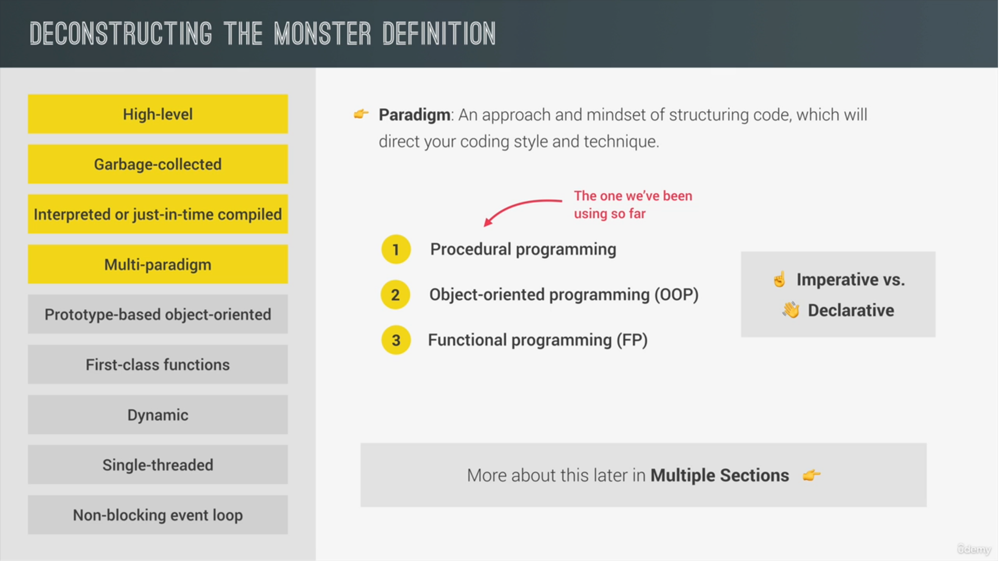
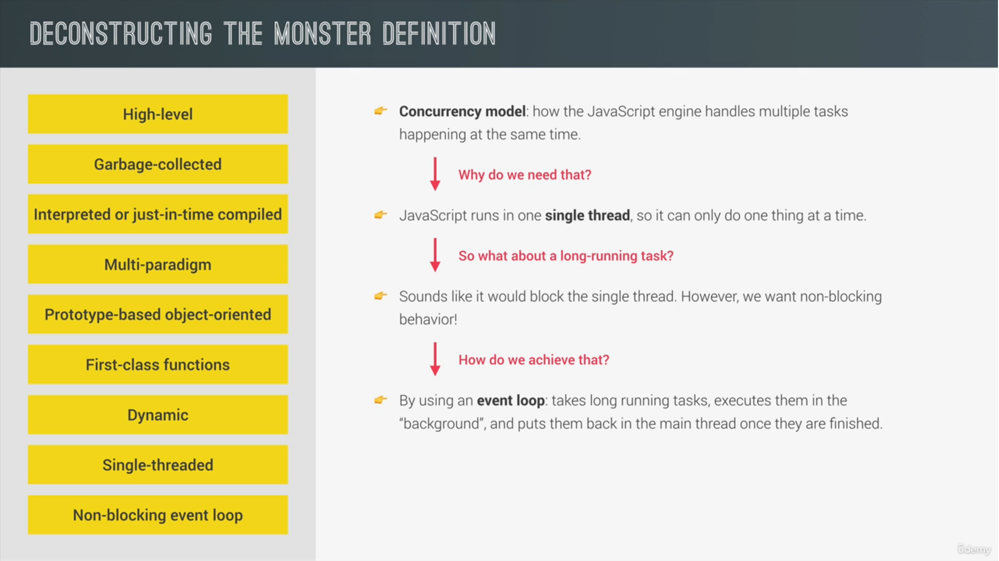
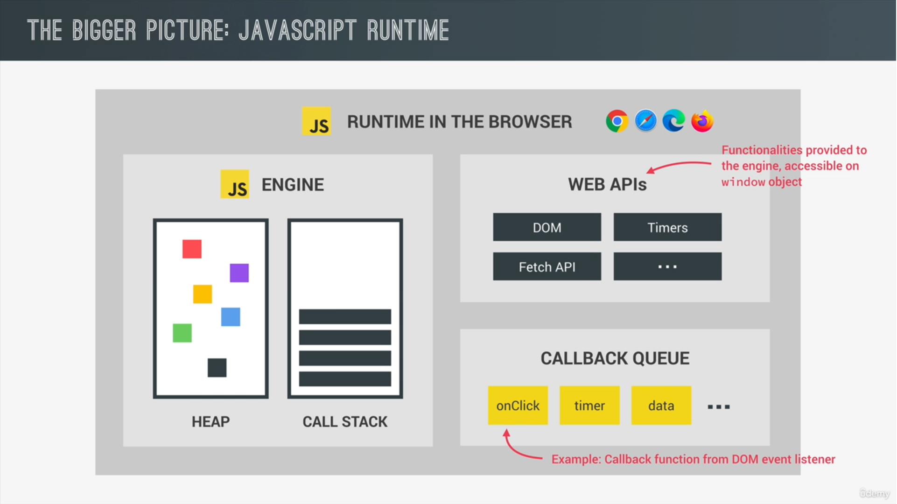
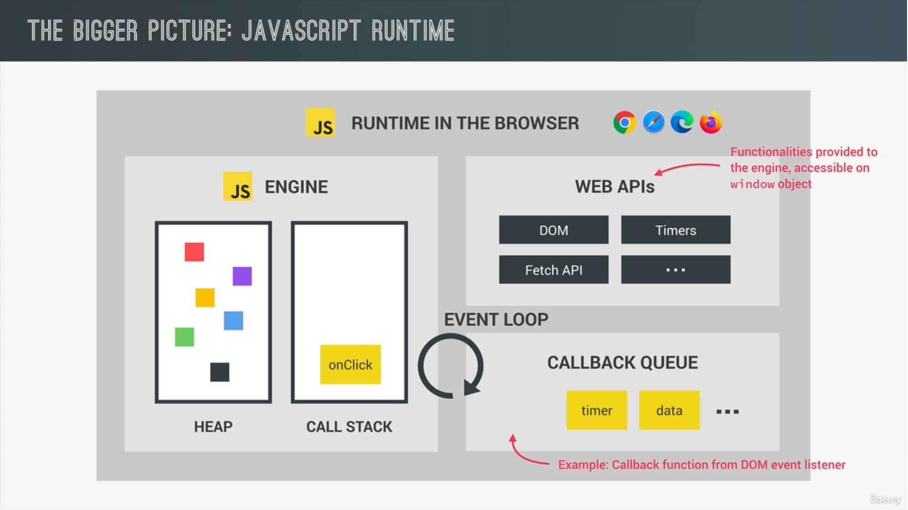

 # 📔Javascript Tricks

## 📘Basic Information











---
## 📘Destructuring

* Converting Array into object
```js
var techBrand = [
    "Facebook",
    "Apple",
    "Amazons",
    "Netflix",
    "Google"
]

var object = { ...techBrand };
console.log(object);
```
* Bases on condition

```js
const state = true;
const student = {
    sid: 101,
    ...(state && { grade: 'pass' })
}

console.log(student);
```

## 📘Console

* console.time
```js
console.time();
var arr = Array(1000).fill('Hello world')
console.timeEnd();
```
* console.table
```js
// Array Example
var teckBrand = [
    {
        id: 1,
        name: 'Deepinder',
        job: 'Web developer'
    },
    {
        id: 2,
        name: 'Deepu',
        job: 'Web developer'
    },
    {
        id: 3,
        name: 'Dp',
        job: 'Web developer'
    }
];
console.table(teckBrand);

// Object Example

var response = {
    approvedPrograms: [
        { id: 1, name: 'Deepu' },
        { id: 2, name: 'Deepinder' },
        { id: 3, name: 'Deepi' }
    ],
    recomendedPrograms: [
        { id: 1, name: 'Deepu' },
        { id: 2, name: 'Deepinder' },
        { id: 3, name: 'Deepi' }
    ]
}
console.table(response)
```
* Color in Console

```js
console.log("%c Hello %cWorld", "color:yellow;", "background-color: red;")
```
* console.group

```js
console.group("New Group");
console.log('Hello world 1');
console.log('Hello world 2');
console.log('Hello world 3');
console.log('Hello world 4');
console.groupEnd();
```
## 📘Operators

* use the **!!** operator to convert the result of an **expression into Boolean value**
```js
const grade1 = 'Pass';
console.log(!!grade1);

const grade2 = '';
console.log(!!grade2);
```


* Return Expression

```js
function isAdult(age) {
    return age >= 18;       // true or false
}
```
* This **+** operator is use for
  * concatenate the strings
  * Converting into Number
  * Adding the Numbers

```js
console.log("a" + "b");     // ab
console.log("a" + +"b");    // aNaN
console.log(+"a" + +"b");   // NaN
console.log(+"a" + "b");    //NaNb
```

---
## 📘Strings

```js
var str = 'Hello My name is Deepinder singh and I am working as React Engineer. I am working in various companies. I working very hard to learn new things. I am also working in backend some time';

//exist how many times
var sub = 'working';
var result = str.split(sub).length - 1;
console.log(result);
```
---
## 📘Arrays

* Create New array with in react (for dummy)

```js
Array.from({length : 20}, (_,i) => i +1).map(item => `value : ${item}`)
```
* Sort Method

```js
const array = [
{
    id: 5,
    description: 'Hello ij'
},
{
    id: 4,
    description: 'Hello ef'
},
{
    id: 1,
    description: 'Hello cd'
},
{
    id: 3,
    description: 'Hello gh'
},
{
    id: 2,
    description: 'Hello ab'
}
];

let sortedArray = array.slice().sort((a, b) => a.description.localeCompare(b.description))

// Comparing String
/*output
Hello ab
Hello cd
Hello ef
Hello gh
Hello ij
*/


let sortedArray = array.slice().sort((a, b) => a.id - (b.id))
// comparing Numbers
/*
1. Hello cd
2. Hello ab
3. Hello gh
4. Hello ef
5. Hello ij
*/

```
---
## 📘Loops
* Use **For in** always on **Objects**
* Use **For of** always on **Array**
---

## 📘If-else

* Avoid nested simple if-else and use **ternary Operator**
* Avoid if-else leader and use **Guard Clauses Technique**
```js
// wrong
function test() {
    if(wifi) {
        if(login){
            if(admin) {
                seeAdminPanel();
            }else {
                console.log('Must be Authorized')
            }
        }else {
            console.log('Must be Login')
        }
    }else {
        console.log('must be wifi')
    }
}

// correct one
function test() {
    if(!wifi) {
        console.log('must be wifi')
        return;
    }
    if(!login){
        console.log('Must be Authorized')
        return;
    }
    if(!admin) {
        console.log('Must be Login')
        return;
    }
    seeAdminPanel();
}
```
* if you have **very large if-else** statements then use **switch-case** code

## 📘International

* Currency

```js
// Simple Representation
const number = 1111122223333444.1;
const f = new Intl.NumberFormat("en-us", {
    currency: 'USD',
    style: "currency"
})

console.log(f.format(number));  // $1,111,122,223,333,444.10


// Compact Representation

const number = 11133444.1;
const f = new Intl.NumberFormat("en-us", {
    notation: "compact"
})

console.log(f.format(number));          // 11M  (Million)
```
* Date Format

```js
// Simple
const f = new Intl.DateTimeFormat('en-us', {
})
console.log(f.format());        //  6/17/2023

// Simple
const f = new Intl.DateTimeFormat('en-us', {
    dateStyle: "full",
    timeStyle: "full"
})
console.log(f.format());        // Saturday, June 17, 2023 at 7:30:41 PM India Standard Time

// Complex One
const today = new Date();
console.log(today.toLocaleString());    // 17/6/2023, 7:21:53 pm

const f = new Intl.DateTimeFormat('en-us', {
    dateStyle: "full",
    timeStyle: "full"
    // dayPeriod: "long"
})

console.log(f.format(today));   // Saturday, June 17, 2023 at 7:22:03 PM India Standard Time
```
* Relative Time
```js
const f = new Intl.RelativeTimeFormat('en-us', {
    style: "long"
})
console.log(f.format(-4, "days"))
```
* Adding Or Subtracting Days from Current date

```js
const date = new Date("june 21 2017");

// Adding One Day in given Date
date.setDate(date.getDate() + 1)

// Subtracting One Day in given Date
date.setDate(date.getDate() - 1)

date.toDateString()
```
* Get **TimeStamp**
```js
console.log(new Date().getTime());  // 1692881806768
```
* Set Time

```js
const c = new Date();
c.setMinutes(c.getMinutes() + 2);
let t = c.getTime();
console.log(t)
```

## 📘Math
* creating Random Number

```js
// this will give number between 0 and 1
Math.random()

// this will give number between 0 and 6
Math.random() * 6

// this will convert 19.9999999 into 19
Math.trunc(Math.random() * 6)

// this will add 1 so we cannot get 0 
let dice = Math.trunc(Math.random() * 6) + 1;

console.log(dice)
```

---

## 📘Extra Features

* **Generate Random Numbers** in javascript

```js
console.log(crypto.randomUUID());   // 1d35cbb8-e3ff-47b0-a9dc-8d0c499b9a56
```
* use of **use strick** mode
  * Not allowed to make unwanted variables (like created after spelling mistake)
```js
const superLongVariable = "hi";
superLongVariables = "bye";
console.log(superLongVariables);    // bye

// Correct one
"use strict"
const superLongVariable = "hi";
superLongVariables = "bye";
console.log(superLongVariables);    // bye
```

```html
<!-- using by Module -->
<script type="module">
    const superLongVariable = "hi";
    superLongVariables = "bye";         // error
    console.log(superLongVariables);    // bye
</script>
```