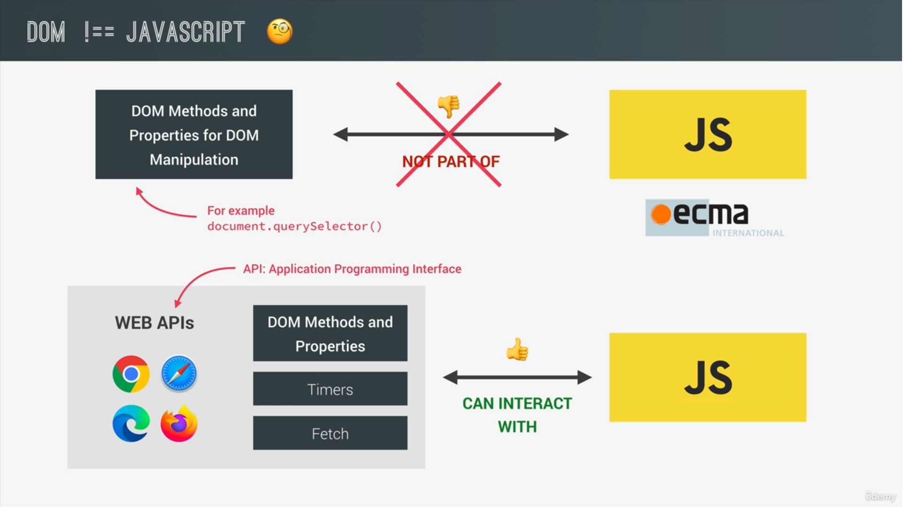

## 📘What is DOM
* *In Simple words DOM is basically a connection point between HTML documents and Javascript Code. *
* DOM is automatically created by the browser as soon as the HTML page loads and it's stored in a tree structure like in the given image, in this each html element is one object


* **DOM** and **DOM Methods** are actually part of something called the **web APIs**. so the web API are like **libraries** that browsers implement and that we can access from our javascript.
* Web Api are basically libraries that are also written in javascript and that are automatically available for us to use.
* And there is actually an official DOM specification that browser implement, which is the reason why DOM manipulation works the same in all browsers.
* There are various API like timer, fetch 



---
## 📘DOM Manipulation Api's

1. **querySelector**
* use to select particular element
* for **class** use **'.'** and for **id** use **#**
```html
<div id="message">Hello World ...</div>
<script>
    console.log(document.querySelector('#message'));
</script>
```


2. **textContent**
* use to print the text content in the element

```js
const msg = document.querySelector('#message');
// Hello World ...
console.log(msg.textContent);
``