## 📘Syllabus
1. Simple configuration
2. loaders and asset modules
3. webpack plugins
4. code spliting
5. integration with Expresson.js
6. Module Federation

---
* Webpack version 5 is best one
* Written in **Javascript**
* It is by default in React, Angular etc for builds etc
* by default is will create **production** build.
* you can write any name of **webpack.config.js**, just need to add that file in the command in the package.json file
---
## 📘Why do we need
1. Eliminate the sequence of including javascript
2. Make Build, Js & CSS Minify & entry File
3. **Load all stuff from webpack rather than loading from different-different files in a single html file example Images, CSS files, Js Files, Json Files etc**

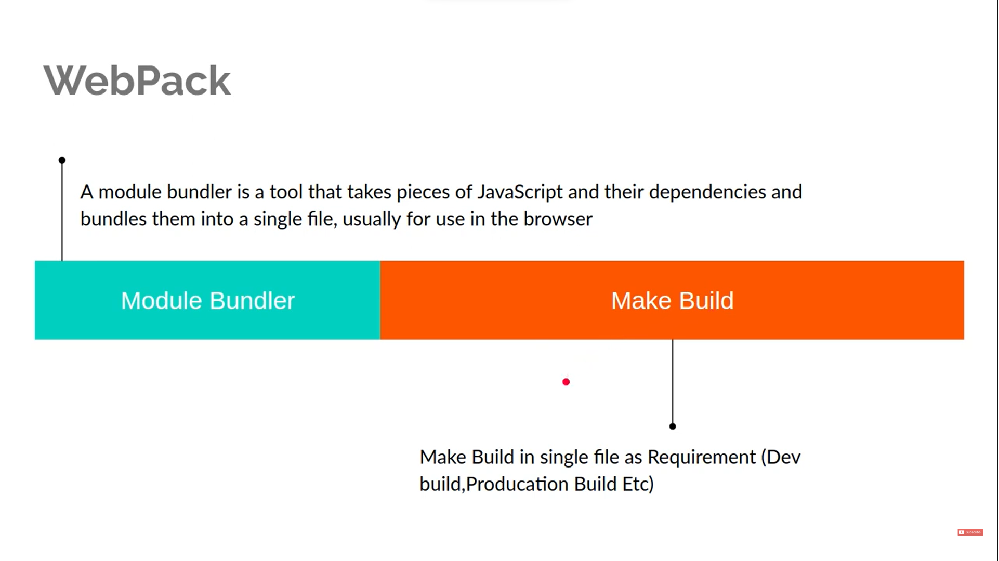


4. When we are loading every thing from **webpack** we have to load webpage after run **npx webpack** command

Example
```html
<!DOCTYPE html>
<html lang="en">

<head>
    <title>Document</title>
</head>

<body>
    <script src="./index.js"></script>
    <script src="./hello-world.js"></script>
</body>
</html>
```
```javascript
// hello-world.js
function helloWorld() {
    console.log('Hello world')
}
```

```javascript
//index.js
helleWorld();
```
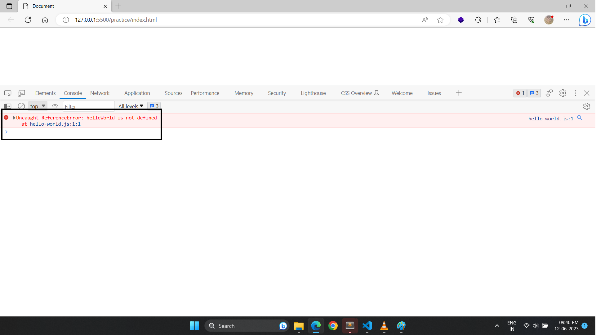

---
## 📘 Install Package

* It require 3 things to create Structure
  * dist folder & create *index.html* file for **Entry Point**
  * src folder & create *index.js* file for **Entry Point**
  * package.json file

1. Run Commands
```
npm inti -y
```

```
npm install webpack webpack-cli --save-dev
```
* webpack-cli : its a tool which allow you to run webpack from terminal

2. Create **src Folder** and Place all js files over there
* hello-world.js

```javascript
export default function helloWorld() {
    console.log('Hello world')
}
```

* Index.js
```javascript
import helloWorld from './hello-world.js'
helloWorld();
```
3. Create **index.html** as same level of **src folder** and include only singel file

```html
<!DOCTYPE html>
<html lang="en">

<head>
    <title>Document</title>
</head>

<body>
    <script src="./src/index.js"></script>
</body>
</html>
```
4. Run command

```
npx webpack
```
* this command will create **dist** folder and create **main.js** file in it
---
## 📘Custom Configuration (Basic)
* create **webpack.config.js** 
* Entry Point and Output Point


```js
// to get the absolute path, it is available in node automatically
const path = require('path');

module.exports = {
    // entry point for webpack
    entry: './src/index.js',
    
    output: {
         // output file name
        filename: 'bundle.js',

        // it will create bundler.js file in dist folder 
        path: path.resolve(__dirname, './dist')
    },
    mode: 'none'
}
```

* Then run this command
```
npx webpack
```
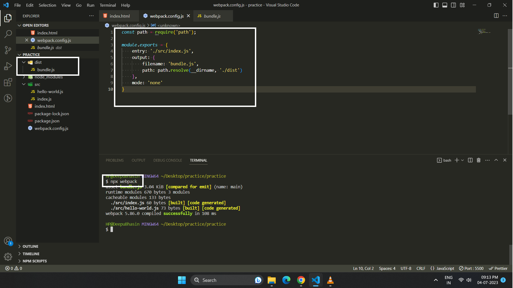

---
## 📘Assets
* There are four types of assets
1. asset/resource : use when importing large files
2. asset/inline : use when importing small files
3. asset : webpack decide automatically select one from above conditions ( condition : asset/resource > 8 kilobytes > asset/inline )
4. asset/source : Read the string and injects that string directly into javascript bundles 

## 📘1. Importing Image through webpacks (Asset/Resource)

1. Write rules in webpack (because webpack cannot understand the image files)

```js
const path = require('path');

module.exports = {
    entry: './src/index.js',
    output: {
        filename: 'bundle.js',
        path: path.resolve(__dirname, './dist')
    },
    mode: 'none',

    // adding rules for loading images
    module: {
        rules: [
            {   
                // loading tff files
                test: /\.(ttf)$/,
                type: 'asset/resource'

            },
            {
                // loading png or jpg files
                test: /\.(png|jpg)$/,
                type: 'asset/resource'
            }
        ]
    }
}
```
2. writing a function for importing image file (add-images.js)

```js
import work from "./wok.jpg";

function addImage() {
    const img = document.createElement('img');
    img.alt = 'Work';
    img.width = 300;
    img.src = work;
    const body = document.querySelector('body');
    body.appendChild(img);
}

export default addImage;
```

3. importing files

```js
import helloWorld from './hello-world.js'
import addImage from "./add-image.js"

helloWorld();
addImage();
```

4. Run Command

```
npx webpack
```

5. You will get out put in **dist folder** with **bundle.js** and **ff034541606f59c6b4e5.jpg** (some random name)

## 📘 PublicPath
1. Adding Specific Folder
* this is use to load image from sepecific path like **local Path**, **CDN Path**
* this features only works in **webpaack5**
```js
const path = require('path');

module.exports = {
    entry: './src/index.js',
    output: {
        filename: 'bundle.js',
        path: path.resolve(__dirname, './dist'),
        
        // this is use to get the file from particular folder
        publicPath: './dist/'
    },
    mode: 'none',
    module: {
        rules: [
            {
                test: /\.(ttf)$/,
                type: 'asset/resource'

            },
            {
                test: /\.(png|jpg)$/,
                type: 'asset/resource'
            }
        ]
    }
}
```
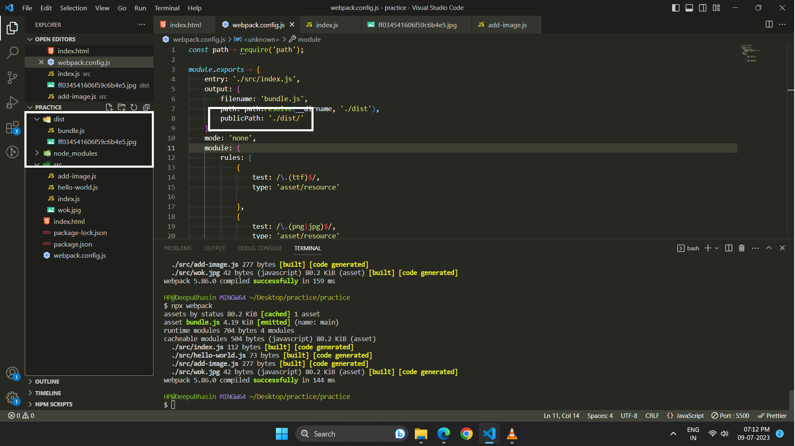

2. Adding CDN Link
* this link will **append to every images which will generated from webpack**
```js
// For CDN link
publicPath: 'https://some-random-url.com/'
```
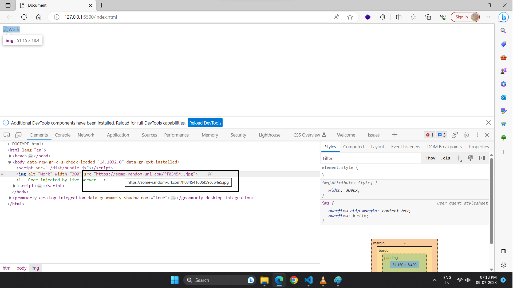

## 📘2. Importing Image through webpacks (Asset/Inline)
* Like Importing File like **base64**
* Main disadvantage is that it will **increase** js file size
* Main Advantage is that if the sizes if Normal images are very large our web page will make a **http request** to load images which is very expensive so converting into **base64** will save our **http request**

```js
const path = require('path');

module.exports = {
    entry: './src/index.js',
    output: {
        filename: 'bundle.js',
        path: path.resolve(__dirname, './dist'),
    },
    mode: 'none',
    module: {
        rules: [
            {
                test: /\.(png|jpg)$/,
                // creating base 64 images file
                type: 'asset/inline'
            }
        ]
    }
}
```
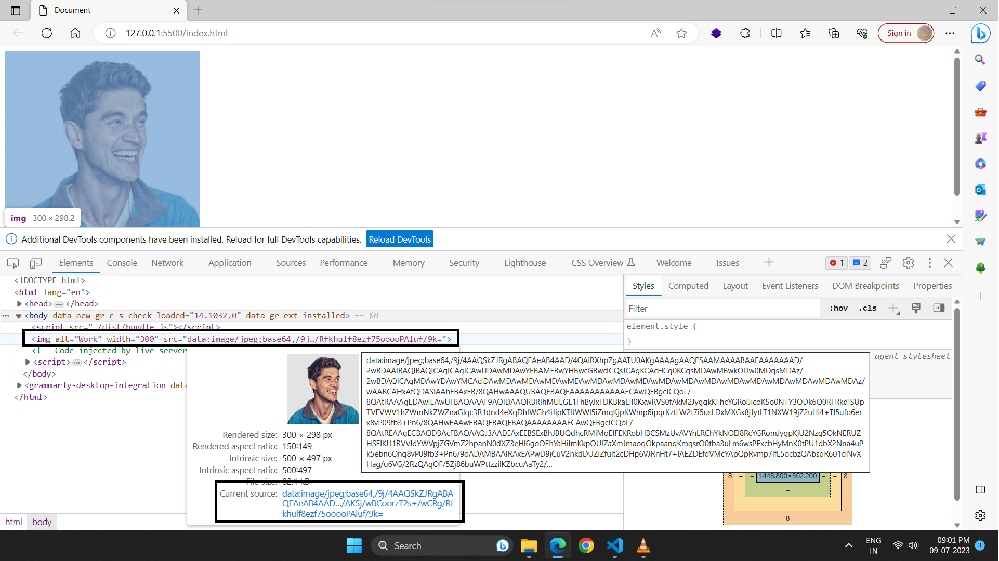

## 📘3. Importing Image through webpacks (Asset)
* webpack decide automatically and select one option from above conditions 
* ( condition : asset/resource > 8 kilobytes > asset/inline )

```js
const path = require('path');

module.exports = {
    entry: './src/index.js',
    output: {
        filename: 'bundle.js',
        path: path.resolve(__dirname, './dist'),
    },
    mode: 'none',
    module: {
        rules: [
            {
                test: /\.(png|jpg)$/,
                // asset type
                type: 'asset',
            }
        ]
    }
}
```

* Make condition for loading converting image upto a particular condition

```js
const path = require('path');

module.exports = {
    entry: './src/index.js',
    output: {
        filename: 'bundle.js',
        path: path.resolve(__dirname, './dist'),
    },
    mode: 'none',
    module: {
        rules: [
            {
                test: /\.(png|jpg)$/,
                type: 'asset',

                // Making condition
                parser: {
                    dataUrlCondition: {
                        maxSize: 300 * 1024         // 300 hunderd kilobytes
                    }
                }
            }
        ]
    }
}
```
## 📘4. Importing Image through webpacks (Asset Source)
* Asset source reads the contents of the file into a Javascript String and injects that string directly into the javascript bundle as is without any modfications similarly to asset in line
* This type of asset module doesn't generate any file in the output directory
* **Below we are reading text file**

1. Create **text** file
```js
// work.txt
Work image file
```

2. Webpack File

```js
const path = require('path');

module.exports = {
    entry: './src/index.js',
    output: {
        filename: 'bundle.js',
        path: path.resolve(__dirname, './dist'),
    },
    mode: 'none',
    module: {
        rules: [
            {
                test: /\.(png|jpg)$/,
                type: 'asset',
            },
            {
                test: /\.txt/,
                type: 'asset/source'
            }
        ]
    }
}
```
3. Command
```
npx webpack
```

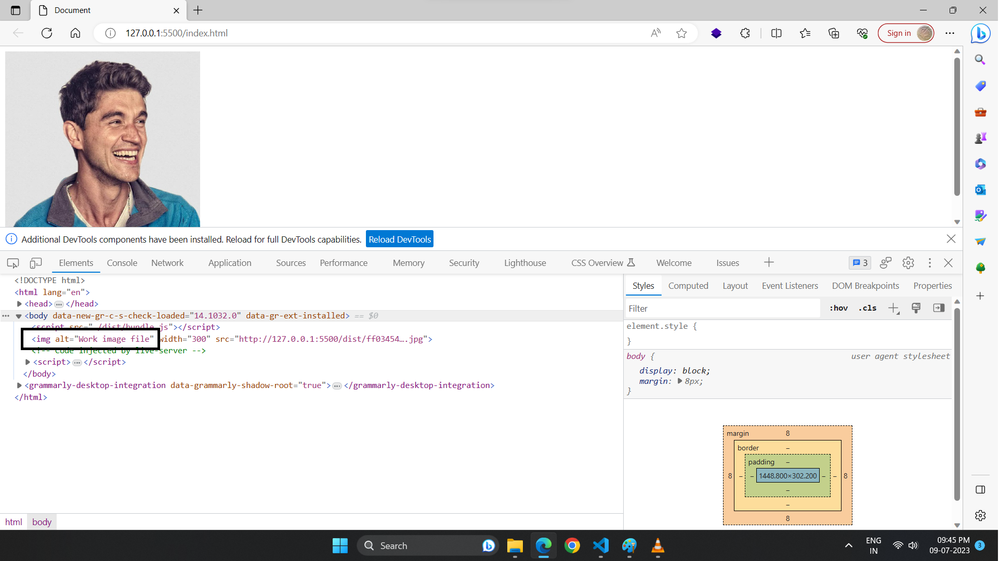
---
## 📘Loaders 
1. CSS Loader
2. SCSS Loader
3. JS Loader
4. File Loader (png, svg, jpg, gif files etc)


## 📘1. Loaders (CSS/Style)

* It help to load that files which we cannot import using modules
* Import **CSS** Files like *SASS, LESS, Handlebars, XML* and so much
* Loaders are javascript libraries which allowed you to load all stuffs
* These loader always inject our CSS code into **style tags**

1. Webpack Coding

```js
const path = require('path');

module.exports = {
    entry: './src/index.js',
    output: {
        // by the way, using style loader bundles your CSS together with your javascript into a single resulting file called bundle
        filename: 'bundle.js',
        path: path.resolve(__dirname, './dist'),
    },
    mode: 'none',
    module: {
        rules: [
            {
                test: /\.css$/,
                use: [
                    //Then second the style loader takes the CSS and inject it into the page using style tags 
                    'style-loader',

                    //first  the css loader reads the contents of the css file and return this contents, but it doesn't do anything  else with this css 
                    'css-loader'
                ]
            }
        ]
    }
}
```
⚠️ **Note:**
* Loader always load from **right to left**
* When we were using asset modules **'asset/source'**, we didn't have to install any additional NPM packages because Webpack include asset modules out of the box
* On the other hand, when using **loaders** we need to install them **explicitly**, Every Webpack loader comes as NPM package that you can add as a dependency to your application, so in this case we have to add loaders
   1. CSS Loaders
   2. Styles Loaders

```
npm install css-loader style-loader --save-dev
```

2. hello-world-button.css

```css
.hello-world-button{
    font-size: 20px;
    padding :7px 15px;
    background: green;
    color: white;
    outline: none;
}

.hello-world-text {
    color : green;
    font-weight: bold;
}
```

3. hello-world-button.js

```js
import "./hello-world-button.css"

class HelloWorldButton {
    render() {
        const button = document.createElement('button');
        button.innerHTML = 'Hello World';
        button.classList.add('hello-world-button')
        button.onclick = function () {
            const p = document.createElement('p');
            p.innerHTML = 'Hello World';
            p.classList.add('hello-world-text');
            body.appendChild(p);
        }
        const body = document.querySelector('body');
        body.appendChild(button);
    }
}

export default HelloWorldButton
```
4. index.js

```js
import HelloWorldButton from './components/hello-world-button'

const helloWorldButton = new HelloWorldButton();
helloWorldButton.render();
``` 

5. Command 

```
npx webpack
```
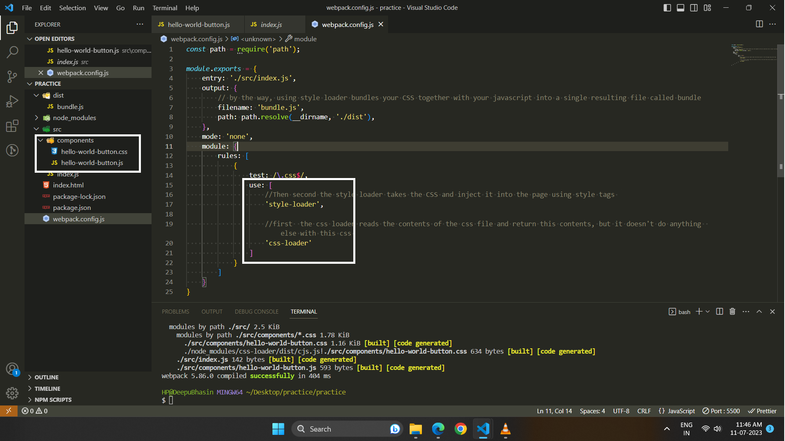

## 📘2. Loaders (SCSS)

* Command to install package

```
npm install sass-loader sass --save-dev
```

* only this code is change rest of the above code is same
```scss
// hello-world-button.scss
$font-size : 20px;
$background-color : green;
$button-font-color: white;
$text-font-color :red;

.hello-world-button {
    font-size: $font-size;
    padding: 7px 15px;
    background: $background-color ;
    color: $button-font-color;
    outline: none;
}

.hello-world-text {
    color: $text-font-color;
    font-weight: bold;
}
```

* Webpack File

```js
const path = require('path');

module.exports = {
    entry: './src/index.js',
    output: {
        filename: 'bundle.js',
        path: path.resolve(__dirname, './dist'),
    },
    mode: 'none',
    module: {
        rules: [
            {
                test: /\.css$/,
                use: ['style-loader', 'css-loader']
            },
            {   
                // load scss file
                test: /\.scss$/,
                // loader will load from right to left
                use: ['style-loader', 'css-loader', 'sass-loader']
            }
        ]
    }
}
```

## 📘3. Loader (JS)
* by default **we don't** need any loader to load JS files
* But If we to add latest feature of javascript on not fully advanced browsers in that case we use JS loader called **babel**.
* It is compiler which convert Latest javascrit code into browser compatible.

* Command to install packages

```
npm install @babel/core babel-loader @babel/preset-env @babel/plugin-proposal-class-properties --save-dev
```

* Webpack.config.js File
```js
const path = require('path');

module.exports = {
    entry: './src/index.js',
    output: {
        filename: 'bundle.js',
        path: path.resolve(__dirname, './dist'),
    },
    mode: 'none',
    module: {
        rules: [
            {
                test: /\.js$/,
                exclude: /node_modules/,
                use: {
                    loader: 'babel-loader',
                    options: {
                        // convert ES1-N => ES5 , support all latest features of ES6
                        presets: ['@babel/env'], 

                        // Laod all Latest JS Class features
                        plugins: ['@babel/plugin-proposal-class-properties']

                    }
                }
            }
        ]
    }
} 
```
* hello-world-button.js

```js
import "./hello-world-button.scss"

class HelloWorldButton {
    render() {
        this.buttonCssClass = 'hello-world-text';
        const button = document.createElement('button');
        button.innerHTML = 'Hello World';
        button.classList.add('hello-world-button')
        button.onclick = function () {
            const p = document.createElement('p');
            p.innerHTML = 'Hello World';
            p.classList.add(this.buttonCssClass);
            body.appendChild(p);
        }
        const body = document.querySelector('body');
        body.appendChild(button);
    }
}

export default HelloWorldButton
```

## 📘4. Loader (File Loader (png, svg, jpg, gif files etc))

1. Command 
```
npm install file-loader
```

2. webpack.config.js

```js
const path = require('path');
const { CleanWebpackPlugin } = require('clean-webpack-plugin');
const HtmlWebpackPlugin = require('html-webpack-plugin');

module.exports = {
    mode: 'none',
    entry: './src/work.js',
    output: {
        filename: 'bundle.js',
        path: path.resolve(__dirname, './dist/'),
        publicPath: './',
    },
    module: {
        rules: [
            {
                test: /\.(png|svg|jpg|gif|tiff)$/,
                use: ['file-loader']
            }
        ]
    },
    plugins: [
        new CleanWebpackPlugin(),
        new HtmlWebpackPlugin({
            title: 'Hello World',
            filename: 'index.html',
            user: 'Admin',
            template: './index.html'
        })
    ]
}
```

3. Work.js

```js
// any random file
import wok from "./download.png"

class WorkImage {
    render() {
        const img = document.createElement('img');
        img.src = wok;
        img.alt = "Work Image";
        const bodyDomElement = document.querySelector('body');
        bodyDomElement.appendChild(img);
    }
}
export default WorkImage;
```

4. index.html

```html
<!DOCTYPE html>
<html lang="en">

<head>
    <meta charset="UTF-8">
    <meta name="viewport" content="width=device-width, initial-scale=1.0">
    <title>
        <%= htmlWebpackPlugin.options.title %>
    </title>
</head>

<body>
    <h1>Hello <%= htmlWebpackPlugin.options.user %>
    </h1>
</body>

</html>
```
5. Command 

```
npx webpack
```


---

## 📘Plugins

* Plugins are additionl javascript libraries that do everything that loaders cannot do.
* Plugins can also modify how the bundles themselves are created. For Example, **uglifyJSplugin** takes the bundle.js and minimize the contents to decrease the bundle size.
* You can add other various **plugins from webpack official website**

## 📘1. Minification Plugin (for javascript)
* if the javascript files size is less hence your websites will load fast.
* if you have mobile uses then your website is crucial for them
* Less size website consume less internet traffic

* **TerserPlugin :** this plugin is use to reduce the size of **bundle.js**

1. webpack.config.js
```js
const path = require('path');

// Loading terser-webpack-plugin plugin, this is inbuilt in webpack 5 otherwise we have to install separately
const TerserPlugin = require('terser-webpack-plugin');

module.exports = {
    entry: './src/index.js',
    output: {
        filename: 'bundle.js',
        path: path.resolve(__dirname, './dist'),
    },
    mode: 'none',
    module: {
        rules: [
            {
                test: /\.css$/,
                use: ['style-loader', 'css-loader']
            },
            {
                test: /\.scss$/,
                use: ['style-loader', 'css-loader', 'sass-loader']
            }
            ]
    },
    plugins: [
        new TerserPlugin()
    ]
} 
```

2. Run Command

```
npx webpack
```

## 📘2. MiniCssExtractPlugin (with single File for css)
* Use to Extract our CSS into a separate File
* This will create a single file where it will put all css code into single file, but in **css-loader & style-loader** it will inject css code into style according to files.

1. Command for install package

```
npm install mini-css-extract-plugin --save-dev
```

2. webpack.config.js

```js
const path = require('path');
// installing package
const TerserPlugin = require('terser-webpack-plugin');
const MiniCssExtractPlugin = require('mini-css-extract-plugin');

module.exports = {
    entry: './src/index.js',
    output: {
        filename: 'bundle.js',
        path: path.resolve(__dirname, './dist'),
    },
    mode: 'none',
    module: {
        rules: [
            {
                test: /\.css$/,
                
                // loading MiniCssExtractPlugin style loader instead of normal Loader
                use: [MiniCssExtractPlugin.loader, 'css-loader']
            },
            {
                test: /\.scss$/,

                // loading MiniCssExtractPlugin style loader instead of normal Loader
                use: [MiniCssExtractPlugin.loader, 'css-loader', 'sass-loader']
            },
            {
                test: /\.js$/,
                exclude: /node_modules/,
                use: {
                    loader: 'babel-loader',
                    options: {
                        presets: ['@babel/env'], // convert ES1-N => ES5 , support all latest features of ES6
                        plugins: ['@babel/plugin-proposal-class-properties']

                    }
                }
            }
        ]
    },
    plugins: [
        new TerserPlugin(),
        // loading MiniCssExtractPlugin Class 
        new MiniCssExtractPlugin({

            // Making output file name
            filename: 'styles.css',
        })
    ]
} 
```

## 📘3. MiniCssExtractPlugin (with double Files for css)
* created Two separate files for **js and css**
* When we **build**, all **CSS** code goes into **style.css** and all **js** code goes into **bundle.js**

1. webpack.config.js (same code above one)
2. hello-world-button.js & hello-world-button.css (same code above one)
3. heading.js

```js
import './heading.css';

class Heading {
    render() {
        const h1 = document.createElement('h1');
        const body = document.querySelector('body');
        h1.innerHTML = 'Webpack is awesome';
        body.appendChild(h1);
    }
}
export default Heading;
```

4. heading.css

```css
h1 {
    color:  grey;
} 
```
5. Run build Command

```
npx webpack
```


## 📘Browser Caching

* just add this line, it will create a some random file name
* If the content is not change then filename will be same, if the content get change it will create new file and file name will change

1. For Javascript Files
```js
filename: 'bundle.[contenthash].js',
``` 
2. For CSS Files
```js
filename: 'styles[contenthash].css',
```

## 📘Cleaning Dist Folder Before Generating New Bundle

1. Command to install Package
```
npm install clean-webpack-plugin
``` 

2. webpack.config.js

* by using **mini-css-extract-plugin** Plugin
* This is best option then other
```js
const path = require('path');
const TerserPlugin = require('terser-webpack-plugin');
const MiniCssExtractPlugin = require('mini-css-extract-plugin');

// package  
const { CleanWebpackPlugin } = require('clean-webpack-plugin');
module.exports = {
    entry: './src/index.js',
    output: {
        filename: 'bundle.[contenthash].js',

        // this is our default folder which will delete while cleaning files
        path: path.resolve(__dirname, './dist'),
    },
    mode: 'none',
    module: {
        rules: [
            {
                test: /\.css$/,
                use: [MiniCssExtractPlugin.loader, 'css-loader']
            },
            {
                test: /\.scss$/,
                use: [MiniCssExtractPlugin.loader, 'css-loader', 'sass-loader']
            },
            {
                test: /\.js$/,
                exclude: /node_modules/,
                use: {
                    loader: 'babel-loader',
                    options: {
                        presets: ['@babel/env'], // convert ES1-N => ES5 , support all latest features of ES6
                        plugins: ['@babel/plugin-proposal-class-properties']

                    }
                }
            }
        ]
    },
    plugins: [
        new TerserPlugin(),
        new MiniCssExtractPlugin({
            filename: 'styles[contenthash].css',
        }),

        // creating instance for cleaning webpack
        new CleanWebpackPlugin()
    ]
}
```
* By using **clean:true** parameter in **output** Object, but will work in greater than **5.20** version of webpack

```js
output: {
    filename: 'bundle.[contenthash].js',
    path: path.resolve(__dirname, './dist'),

    //just add this line 
    clean: true
}
```

## 📘Generating HTML Files Automatically During Webpack Build Process

* This **html-webpack-plugin** plugin is use to create html file with adding newly generated files (with random names) of **js** or **css** automatically.
* It will create a new **index.html** file in **dist folder** (beacuse we have mention about dist folder) 


1. webpack.config.js

```js
const path = require('path');
const TerserPlugin = require('terser-webpack-plugin');
const MiniCssExtractPlugin = require('mini-css-extract-plugin');
const { CleanWebpackPlugin } = require('clean-webpack-plugin');

// Plugin to create html file
const HtmlWebpackPlugin = require('html-webpack-plugin');

module.exports = {
    entry: './src/index.js',
    output: {
        filename: 'bundle.[contenthash].js',

        // Output file folder
        path: path.resolve(__dirname, './dist/'),
        
        // Adding directory in file
        publicPath: './'
    },
    mode: 'none',
    module: {
        rules: [
            {
                test: /\.css$/,
                use: [MiniCssExtractPlugin.loader, 'css-loader']
            },
            {
                test: /\.scss$/,
                use: [MiniCssExtractPlugin.loader, 'css-loader', 'sass-loader']
            },
        ]
    },
    plugins: [
        new TerserPlugin(),
        new MiniCssExtractPlugin({
            filename: 'styles[contenthash].css',
        }),
        new CleanWebpackPlugin(),

        // instance of creating html file
        new HtmlWebpackPlugin()
    ]
} 
```
2. Command 

```
npx webpack
```


* For Various Options to create HTML File

1. Setting Filename and Title
```js
 new HtmlWebpackPlugin({
    // to add titles
    title : 'Hello World',
    // output file name
    filename :'custom_filename.html',
    meta : {
        description: 'Some Description'
    }
 })

```
⚠️ Note : you can check various other options on internet

---
## 📘Integration with Template 

* With **webpack** (best one)
1. webpack.config.js

```js
const path = require('path');
const { CleanWebpackPlugin } = require('clean-webpack-plugin');
const HtmlWebpackPlugin = require('html-webpack-plugin');

module.exports = {
    mode: 'none',
    // it just empty file
    entry: './src/index.js',
    output: {
        filename: 'bundle.js',
        path: path.resolve(__dirname, './dist/'),
        publicPath: './'
    },
    plugins: [
        new CleanWebpackPlugin(),
        new HtmlWebpackPlugin({
            title: 'Hello World',
            filename: 'index.html',
            user: 'Admin',
            template: './index.html'
        })
    ]
}
```
2. index.html

```html
<!DOCTYPE html>
<html lang="en">

<head>
    <meta charset="UTF-8">
    <meta name="viewport" content="width=device-width, initial-scale=1.0">
    <title>
        <!-- Adding Dynamic Content to html using webpack -->
        <%= htmlWebpackPlugin.options.title %>
    </title>
</head>

<body>
    <!-- Adding Dynamic Content to html using webpack -->
    <h1>Hello <%= htmlWebpackPlugin.options.user %>
    </h1>
</body>

</html>
```

3. command

```
npx webpack
```
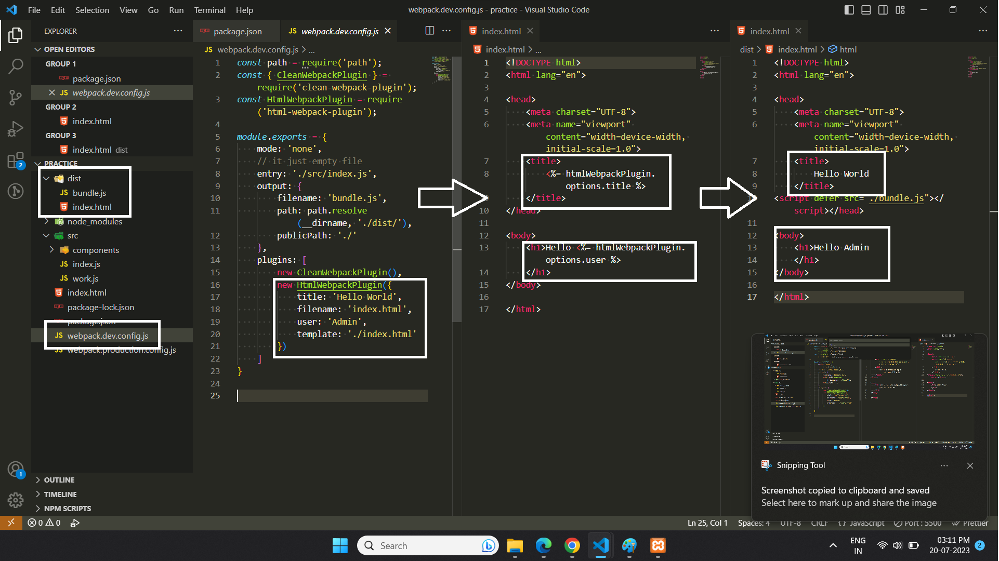


* With **Handlebars**


Handlebars

* Handlebars is a template engine for javascript that allows you to separate the business login from presentation.
* If you find yourself generating HTML inside your javascript then probably need some kind of a template engine

1. Create HandleBar file **index.hbs** (file saved in src folder in our example)

```html
<!DOCTYPE html>
<html>

<head>
    <meta charset="utf-8">
    <title>{{htmlWebpackPlugin.options.title}}</title>
    <meta name="viewport" content="width=device-width, initial-scale=1">
</head>

<body>
    <h1>{{htmlWebpackPlugin.options.heading}}</h1>
</body>

</html>
```

2. webpack.config.js

```js
const path = require('path');
const TerserPlugin = require('terser-webpack-plugin');
const MiniCssExtractPlugin = require('mini-css-extract-plugin');
const { CleanWebpackPlugin } = require('clean-webpack-plugin');
const HtmlWebpackPlugin = require('html-webpack-plugin');

module.exports = {
    entry: './src/index.js',
    output: {
        filename: 'bundle.[contenthash].js',
        path: path.resolve(__dirname, './dist/'),
        publicPath: './'
    },
    mode: 'none',
    module: {
        rules: [
            {
                test: /\.css$/,
                use: [MiniCssExtractPlugin.loader, 'css-loader']
            },
            {
                test: /\.scss$/,
                use: [MiniCssExtractPlugin.loader, 'css-loader', 'sass-loader']
            },
            {
                test: /\.js$/,
                exclude: /node_modules/,
                use: {
                    loader: 'babel-loader',
                    options: {
                        presets: ['@babel/env'], // convert ES1-N => ES5 , support all latest features of ES6
                        plugins: ['@babel/plugin-proposal-class-properties']

                    }
                }
            },
            {
                //Adding handling handle for a Handlerbar File
                test: /\.hbs$/,
                use: ['handlebars-loader']
            }
        ]
    },
    plugins: [
        new TerserPlugin(),
        new MiniCssExtractPlugin({
            filename: 'styles[contenthash].css',
        }),
        new CleanWebpackPlugin(),

        new HtmlWebpackPlugin({
            // take template file from this folder
            template: './src/index.hbs',

            // variable name
            title: 'Hello World',

            // variable name
            heading: 'Hello Deepinder Singh'
        })
    ]
} 
```
3. Command

```
npx webpack
```
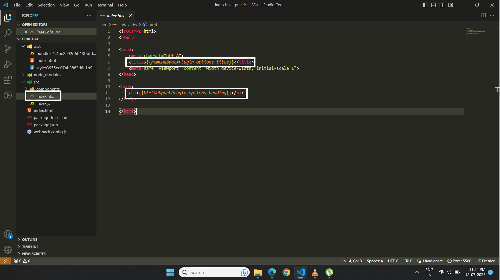

---

## 📘Production Vs Development Builds

* Usually producation builds require a different setup than development builds in production
* In Production, we want our website to be fast as possible and our bundles should be as small as possible
* On the other hand, during development we often want to see an additional information inside our javascript code like for example source maps and other stuff

1. webpack.config.js
```js
// to set mode
module.exports = {
    mode: 'production',
} 


// OR 

"scripts": {
    "build": "webpack --mode=development",
    "dev": "webpack --mode=production"
  },


```
* You us need to add **mode** option, and various options are
  * none
  * development
  * production

⚠️ **Note :
* ** when we use **producation mode** our bundle get automatically minified  and in **Development mode** our files get remain same as written. 
* In **Production mode** by default **TerserPlugin** is already installed

2. Js file

```js
// to Print variable
if (process.env.NODE_ENV === 'production') {
    console.log('Production Mode');
} else if (process.env.NODE_ENV === 'development') {
    console.log('Development Mode');
} else if (process.env.NODE_ENV === 'none') {
    console.log('None Mode');
} else {
    console.log('No mode');
}
```

Example 

* for Development file : **webpack.dev.config**

```js
const path = require('path');
const { CleanWebpackPlugin } = require('clean-webpack-plugin');
const HtmlWebpackPlugin = require('html-webpack-plugin');

module.exports = {
    mode: 'development',
    entry: './src/index.js',
    output: {
        filename: 'bundle.js',
        path: path.resolve(__dirname, './dist/'),
        publicPath: './'
    },
    module: {
        rules: [
            {
                test: /\.css$/,
                use: ['style-loader', 'css-loader']
            },
            {
                test: /\.scss$/,
                use: ['style-loader', 'css-loader', 'sass-loader']
            },
            {
                test: /\.js$/,
                exclude: /node_modules/,
                use: {
                    loader: 'babel-loader',
                    options: {
                        presets: ['@babel/env'], // convert ES1-N => ES5 , support all latest features of ES6
                        plugins: ['@babel/plugin-proposal-class-properties']

                    }
                }
            }
        ]
    },
    plugins: [
        new CleanWebpackPlugin(),
        new HtmlWebpackPlugin()
    ]
} 
```
* For Production : **webpack.production.config.js**

```js
const path = require('path');
const MiniCssExtractPlugin = require('mini-css-extract-plugin');
const { CleanWebpackPlugin } = require('clean-webpack-plugin');
const HtmlWebpackPlugin = require('html-webpack-plugin');

module.exports = {
    mode: 'production',
    entry: './src/index.js',
    output: {
        filename: 'bundle.[contenthash].js',
        path: path.resolve(__dirname, './dist/'),
        publicPath: './'
    },
    module: {
        rules: [
            {
                test: /\.css$/,
                use: [MiniCssExtractPlugin.loader, 'css-loader']
            },
            {
                test: /\.scss$/,
                use: [MiniCssExtractPlugin.loader, 'css-loader', 'sass-loader']
            },
            {
                test: /\.js$/,
                exclude: /node_modules/,
                use: {
                    loader: 'babel-loader',
                    options: {
                        presets: ['@babel/env'], // convert ES1-N => ES5 , support all latest features of ES6
                        plugins: ['@babel/plugin-proposal-class-properties']

                    }
                }
            }
        ]
    },
    plugins: [
        new MiniCssExtractPlugin({
            filename: 'styles[contenthash].css',
        }),
        new CleanWebpackPlugin(),
        new HtmlWebpackPlugin()
    ]
} 
```

* Package.json File 

```js
"scripts": {
    "build": "webpack --config=webpack.production.config.js",
    "dev": "webpack --config=webpack.dev.config.js"
  }

// OR 

"scripts": {
    "build": "webpack --mode=production --config=webpack.production.config.js",
    "dev": "webpack --mode=development --config=webpack.dev.config.js"
},
```
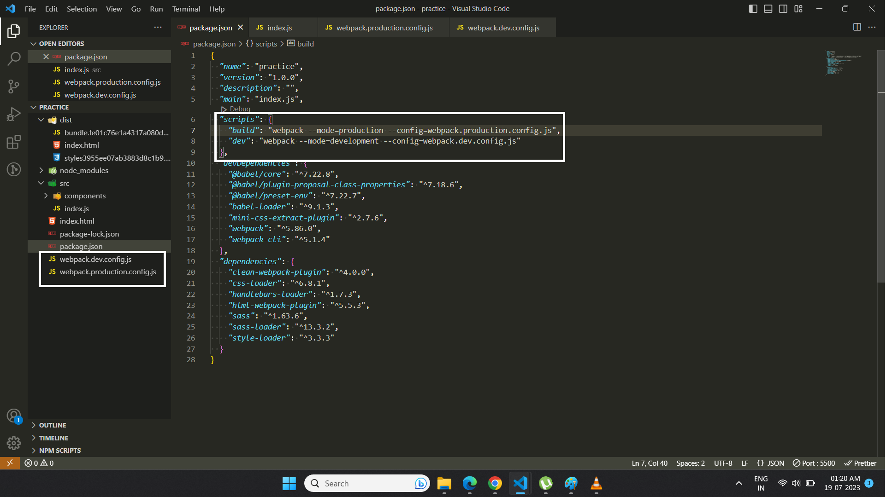
---

## 📘Live Server
* it will run our application as **live server**
* When ever we change any thing in the file and then save the file, it will reload automatically.


1. webpack.config.js : Add this Object in **module.exports** 
```js
devServer: {
    port: 9000,
    static: {
        // point to which directory to be run 
        directory: path.resolve(__dirname, './dist')
    },
    devMiddleware: {
        // pointing file name which will use as index file
        index: 'index.html',
        // application will write in disk means in ram 
        writeToDisk: true
    },
    open: true,
    historyApiFallback: true,
    hot: true,
    compress: true
}
```
1. Package need to install
```
npm install webpack-dev-server --save-dev
```


3. Package.json

```
"dev": "webpack serve --mode=development --config=webpack.dev.config.js --hot"
```

3. Command

```
npm run dev
```
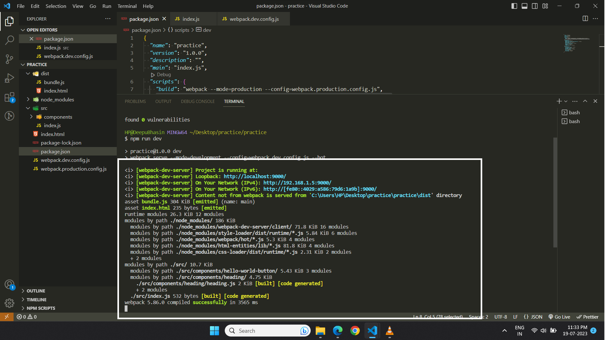