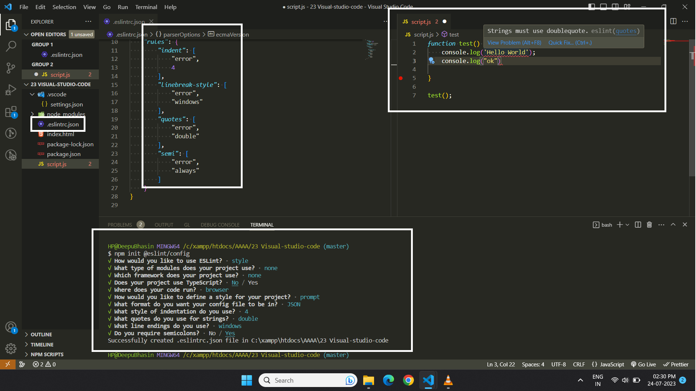

## 📘ES-Lint
1. You need to install **npm package.json** (with basic configuration)
```
npm package.json
```

* You have to install **npm install eslint** package
```
npm install eslint
```

* Add Configuration File for **eslint**  by command
```
npm init @eslint/config
``` 

* Select Options

1. To check syntax only
```
-To check syntax and find problems
-To check syntax, find problems, and enforce code style (select this one)
```
2. JavaScript modules (import/export)

```
-CommonJS (require/exports)
-None of these(select this one)
```

3. Which framework does your project use? 

```
-React
-Vue.js
-None of these (select this one)
```
4. Does your project use TypeScript?

```
- no (select this one)
- yes 
```
5. Where does your code run?
```
-Browser (select this one)
-Node
```
6. How would you like to define a style for your project? 
```
-Use a popular style guide
-Answer questions about your style (select this option)
```

7. What format do you want your config file to be in?
```
-JavaScript
-YAML
-JSON (select this one)
```
8. What style of indentation do you use?

```
-Tabs
-Spaces (select this option)
```

9. What quotes do you use for strings?
```
-Double (select this option)
-Single
```
11. What line endings do you use? .
```
-Unix
-Windows (select this option)
```
12. Do you require semicolons? 

```
-yes (select this option)
-no
```

13. You will get this message : **Successfully created .eslintrc.json**

