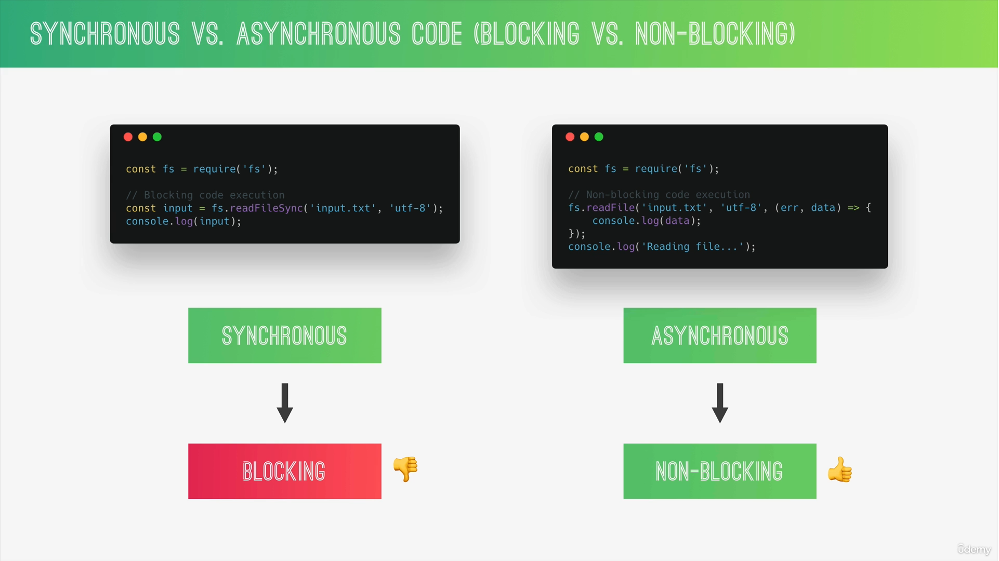
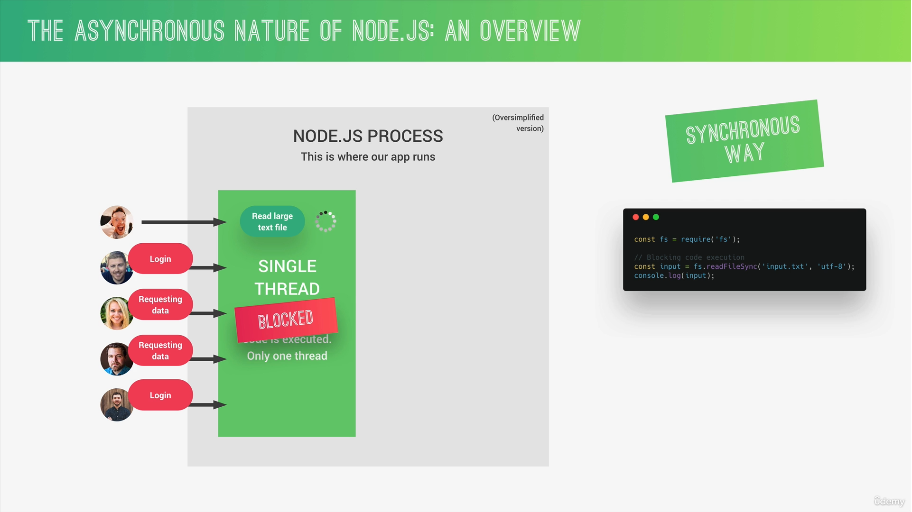
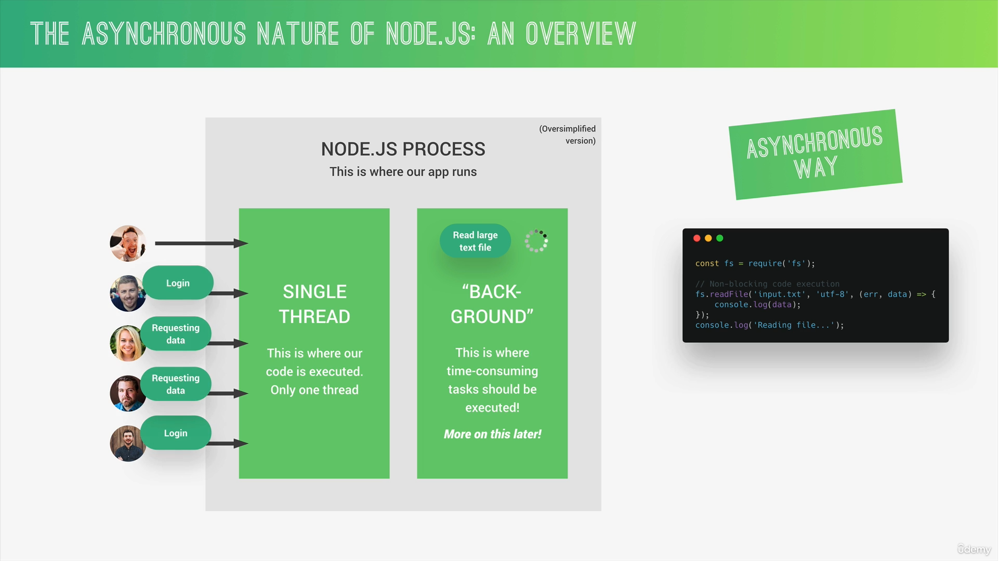

## 📘What is Node.js


## 📘Reading and Writing Files (synchronous way)

* input.txt
```
Hello may name is Deepinder Singh. I am working as front end engineer. My Primary technology is React.
```

* app.js
```js
// default function for files
const fs = require('fs');

// Read data from file
const textIn = fs.readFileSync('./input.txt', 'utf-8');
console.log(textIn);

const textOut = `this is text which is adding through coding. ${textIn}\n Created on ${Date.now()}`;

// writing content in file
fs.writeFileSync('./output.txt', textOut);  // this file will generate automatically
```

```
node app.js
```

## 📘Synchronous Vs Asynchronous






## 📘Reading and Writing Files (asynchronous way)
* Reading Data
```js
console.log('Execute Start');

const fs = require('fs');
fs.readFile('./input.tsssxt', 'utf-8', (error, data) => {
    console.log('data : ', data);
    console.log('error', error);
})

console.log('Executed End');

// Execute Start
// Executed End
// data :  Hello may name is Deepinder Singh. I am working as front end engineer. My Primary technology is React.
```
* Reading and writing Data
```js
console.log('Execute Start');

const fs = require('fs');
fs.readFile('./input.txt', 'utf-8', (error, data) => {
    if(error) return console.log('Error !!! file not found')
    console.log('data : ', data);
    console.log('error', error);
    fs.writeFile('./output.txt', data + ' Coming data from async code', 'utf-8', err => {
        console.log('Your fetch file and code written successfully');
    })
})

console.log('Executed End');
```
## 📘Creating a Simple Web Server

* app.js
```js
const http = require('http');

const server = http.createServer((request, response) => {
    response.end('Hello from server');
});

server.listen(8000, '127.0.0.1', () => {
    console.log('Listening to request on port 8000');
});
```
* Hit this address in google chrome
```
http://127.0.0.1:8000/
```

## 📘Routing
* mostly we use *Express*


## 📘Creating and Loading Modules

* Exporting with using Object
```js
// app.js
function sayHello(name) {
    console.log('Hello ' + name)
}

module.exports.sayHello = sayHello;
```

```js
// script.js
var app = require('./app');

app.sayHello('Deepinder Singh')
```
* Exporting with names
```js
// app.js
function sayHello(name) {
    console.log('Hello ' + name)
}

module.exports= sayHello;
```

```js
// script.js
var app = require('./app');

app('Deepinder Singh')
```

```
node script.js
```
