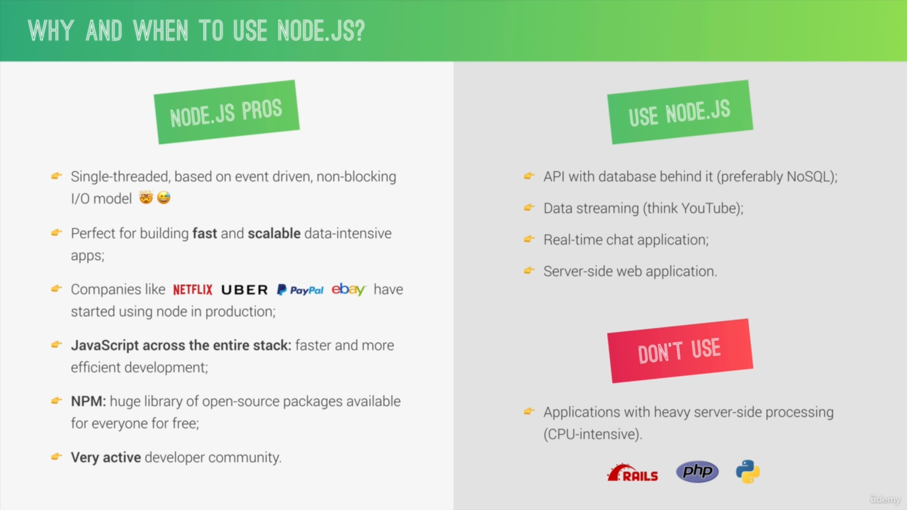

## 📘What is Node.js




## 📘Reading and Writing Files

* input.txt
```
Hello may name is Deepinder Singh. I am working as front end engineer. My Primary technology is React.
```

* app.js
```js
// default function for files
const fs = require('fs');

// Read data from file
const textIn = fs.readFileSync('./input.txt', 'utf-8');
console.log(textIn);

const textOut = `this is text which is adding through coding. ${textIn}\n Created on ${Date.now()}`;

// writing content in file
fs.writeFileSync('./output.txt', textOut);  // this file will generate automatically
```


## 📘Creating and Loading Modules

* Exporting with using Object
```js
// app.js
function sayHello(name) {
    console.log('Hello ' + name)
}

module.exports.sayHello = sayHello;
```

```js
// script.js
var app = require('./app');

app.sayHello('Deepinder Singh')
```
* Exporting with names
```js
// app.js
function sayHello(name) {
    console.log('Hello ' + name)
}

module.exports= sayHello;
```

```js
// script.js
var app = require('./app');

app('Deepinder Singh')
```

```
node script.js
```
