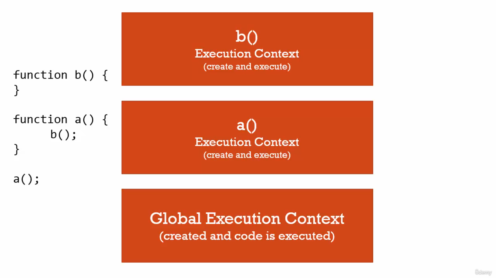
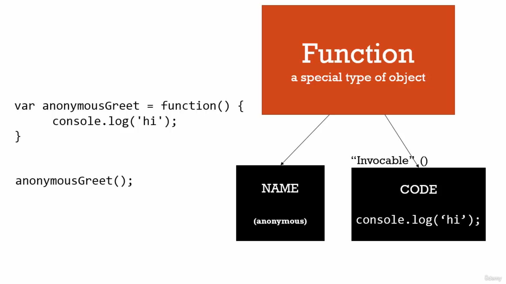
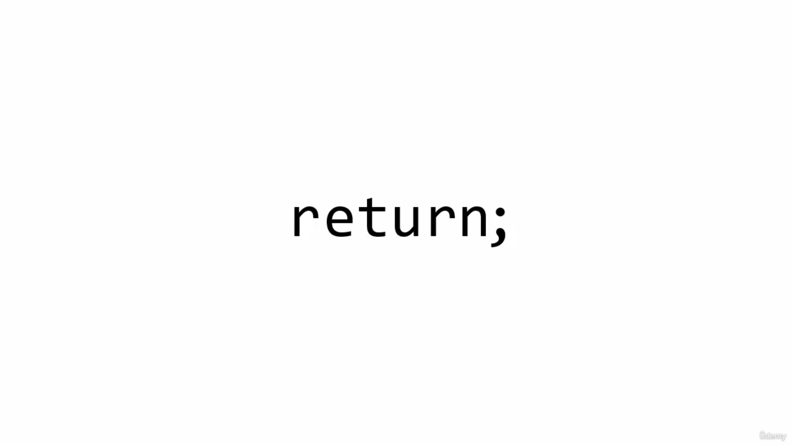

## 📘 Developer Resposibilty

Write a Good code so every one can read and understand easily
 
---
## 📘 Operators are functions

* in Example 1 : **=** is an *operator (function)*  which takes **2** parameters **a** and **3** and then assign value.
* in Example 2 : **+** is an *operator (function)*  which takes **2** parameters **3** and **2** and then return and expression.

```javascript
// Example 1
var a = 3;

// Example 2
var b = 3 + 2;

```
---

## 📘 Conceptual Aside
1. **Syntax Parsers** : A program that reads your code and determines what it does and if its grammer is valid. eg interprator or compiler
2. **Execution Contexts** : *A Wrapper to help manage the code that is running*. There are lots of lexical environments. which one is currently running is managed via execution context. it can contain things beyond what you've written in your code.
3. **Lexical Environments** : *where something sits physically in the code you write*. 'Lexical' means 'having' to do with words or grammer. A lexical environment exists in programming languages in which **where** you write something is important. 

---
## 📘 Name/Value Pairs and Objects
* A Name which **maps** to a **unique value**. eg *Address = '100 Main St.'*. 
* The name may be defined more than once, but only can have one value in any given **context**. 
* That value may be more name/value pairs.
* **Object** : *A Collection of name values pairs*. The simplest defination when talking about javascript.


---
## 📘Creation & Hoisting

Javascript Execution Context has two phase<br/>
1. **Creation Phase** : Set up memory for variables and functions, also set placeholder for variables called **undefined**.
2. **Execution Phase** : means assigne values to variables but not for functions.

In javascript __variables and functions__ are all hoisted to the top of the scope in which they are declared. The scope is usually either global scope or a function scope.
 
 * varibles are always __partially hoisted__ and set to __undefined__.
 * functions are always __fully hoisted__.


so during the creation phase javascript engine moves your variables and function decelarations of the top their respective scope 
```javascript
console.log(number1);
var number1 = 10;

// javascript is doing this process in background
var number1;

console.log(number1);

number1 = 10;
```

```javascript
var num = 50;

function logNumber() {
    console.log(num);   // undefined
    var num = 10;
}

logNumber();
```

⚠️ Note <br/>
* __let, const, function Expression and classes__ are not hosited.
* __Temporal Dead Zone__ : 
  * is the time between the __decelaration__ and __the initialization__ of _let_ and _const_ variables.
  * Temporal Dead Zone is the term to describe the state where variables are in the scope but they are not yet declared.
  


```javascript
function logNumber() {
    var num1 = num2 = 10;
}

console.log(num1)   // error    
console.log(num2)   // 20 beacuse it become global variable

logNumber();
```


```javascript
function test() {
    let total = 0;
    if (true) {
        var numberOne = 10;
        let numberTwo = 20;
        total = numberOne + numberTwo;
    }
    numberOne; // 10 beacuse of function scope
    numberTwo; // error beacuse of block scope
    total; // 30 beacuse of test function block scope
}
test();
```
---
## 📘Undefined vs Not Defined
* **undefined** : is special value in javascript, it will take memory space.

```javascript
// undefined : means value is not set
var number1;
console.log(number1);
number1 = 10;
```
```javascript
// Not defined : means does not exist
console.log(number1);
```
---
## 📘 The Global Environment and The Global Object
* when ever code is run in javascript it's run inside an execution context. Meaning a wrapper that the javascript engine wrap that up, that code that you've written in **global execution**.


* There will be always a **Gloabl Object**. in *Browser* it is **window**, each new tab have there own Global Execution context hence has its own window object 
* in **Browser** : *window==this*

```javascript
var a = 10;
function b() {
    console.log('hello world');
}
a         // 10
window.a  // 10
this.a    // 10   

b();        // hello wolrd
window.b(); 
this.window.b();
```
---
## 📘 The Execution Context : Code Execution (Your Code)
Code Execute line by line

```javascript
test();

console.log(a);             // undefined

var a = 'Hello world';

console.log(a);

function test() {
    console.log('Hello world');
}
```
---
## 📘Single Threaded, Synchronouse Execution
 * **Single Threaded :** one command at a time. Under the hood of the browser, maybe not.
 * **Synchronouse :** one at a time.
---

## Function Invocation and The Execution Stack
* **Invocation** : Running a function. in javascript, by using **parenthesis()**
* when ever a function get invoke it will create new **Execuion Context** for it for example **a() && b()** creating its own execution context.



---
## 📘 Functions, Context and Variable Environments
* **Variable Environments :** Where the variables live. and how they related to each other in memory.


* Value of variables also depend upon **scope**. in below example the value of **myVar** depends upon scope.
```javascript
function b(){
    var myVar;
    console.log(myvar);
}
function a() {
    var myVar = 2;
    console.log(myVar);
    b();
}

var myVar = 1;
console.log(myVar);
a();
console.log(myVar);
```
---
## The Scope Chain

* **Scope :** where a varaiable is available in your code. and if it's truly the same variable or a new copy

```javascript
// function 'b' is sit lexically sits on top of global environment, in the other words it's not inside function 'a', it is sitting at the global level

function b() {
    console.log(myVar);
}

function a() {
    var myVar = 2;
    b(); 
}

var myVar = 1;
a();

```


```javascript
// function 'b' is sit lexically inside the function 'a'

function a() {
    function b() {
        console.log(myVar);
    }

    var myVar = 2;
    b(); 
}

var myVar = 1;
a();

```


---

## 📘 What about Asynchronouse Callbacks
* **Asynchronouse :** more than one at a time.

```javascript
// long running function

function waitThreeSeconds() {
    var ms = 3000 + new Date().getTime();
    while(new Date() < ms){}
    console.log('finished function');
}

function clickHandler() {
    console.log('click event!');
}

// listen for the click event
docuemnt.addEventListener('click', clickHandler)

waitThreeSeconds();
console.log('finished execution');
```
---

* Long running code also effect event loops events for example while executing this code if you click immidately click it will not print beacuse while loop is executing that time. 

---
## 📘 Types and Javascript
* **Dynamic Typing :** : you don't tell the engine what type of data a variable holds, it figures it out while your coding is running. Variables can hold different types of values beacuse it's all figured out during execution.

``` javascript
// Static  Typing

bool isNew = 'hello'; // an error

// Dynamic Typing 
var isNew = true;   // no error
isNew = 'yup!';
isNew = 1;
```
---
## 📘 Primitive types
* **Primitive type :** A type of data that represents a single value. That is, not an object.

1. **undefined :** undefined represents lack of existance (you should'nt set a varaible to this)
2. **Null :** null represents lack of existance (you can set a variable to this)
3. **Boolean** : true or false
4. **Number :** Floating point number (there's always some decimals). Unlike other programming languages, there's only one 'number' type ... and it can make math weird. 
5. **String :** a sequence of character (both '' and "" can be used)
6. **Symbol :** used in ES6   

---

## 📘 Operator Precedence and Associativity
* **Operator Precedence :** which operator function gets called first. Functions are called in order of precedence (HIGHER precendence wins). Example : BDMAS
```javascript
var a = 3 + 4 * 5;
console.log(a); //23 
```
* **Associativity :** What order operator functions get called in: LEFT-TO-RIGHT or RIGHT-TO-LEFT. when functions have the *same* precedence. Example : 1+2+3/3/4
---
## 📘 Coercion
* **Coercion :** Converting a value from one type to another. This happens quite in javascript beacuse it's dynamically typed. This happens quite often in javascript beacuse it's dynamically typed. 

```javascript
var a = 1 + '2';
console.log(a);     //
```
## 📘 Comparsion

```javascript
var a = 3 < 2 < 1 ;
console.log(a);

var a = 1 < 2 < 3
console.log(a);

Number(undefined) // NaN
Number(null)    // 0
Number(false)   // 0
Number(true)    // 1

1 == '1'    // true
1 === '1'   // false
```
---
## 📘 Existence and Booleans

```javascript
Boolean(undefined)      // false
Boolean(null)           // false
Boolean("")             // false
Boolean(0)              // false

// Example 1
var a;
if(a) {                 // will not execute
    console.log('Something is there');
}

// Example 2
var a;
a = 0;

if(a || a === 0) {      // will execute 
//  because === has higher order precedence than or operator    
 console.log('Something is there');
}
```
---


## 📘 Default Value
* operators are functions example || (OR Operator is a function)
```javascript
undefined || 'hi'       // hi
'hi' || 'hello'         // hello
null || 'hi'            // hi
0 || 'hi'               // hi

// Example 1
function greet(name) {
    // '||' operator has high precendece then '='
    name = name || '<Your name here>';
    console.log('Hello' + name);
}
greet();

// Example 2
var librarName = "Lib 1";
window.libraryName = window.libraryName || 'lib 2';
console.log(libraryName);
```
---
## 📘 Objects and Dot


```javascript
var person = new Object();

// [] is a operator

person['firstname'] = "Tony";
person['lastname'] = "Alicea";

var firstNameProprty = "firstname";
console.log(person);
console.log(person[firstNameProprty]);

// . is a operator
console.log(person.firstname);

person.address = new Object();

// . has left-to-right associativity
person.address.street = "51 d street no 3 ranjit nagar near seona chowk patiala punjab";

console.log(person.address.street);
console.log(person['address']['street']);
```
---
## 📘Objects and Object Literals

```javascript
// comparing current example with abov example the object literials are easy to write and easy to read
var person = { 
    firstname : 'Tony',
    lastname : 'Alicea',
    addres : {
        street : "51 d street no 3 ranjit nagar near seona chowk patiala punjab"
    } 
};
console.log(person);


// Example of creating Object on Fly

function greet(person) {
    console.log('Hi' + person.firstname);
}

var Tony = { 
    firstname : 'Tony',
    lastname : 'Alicea',
    addres : {
        street : "51 d street no 3 ranjit nagar near seona chowk patiala punjab"
    } 
};

greet(Tony);

// creating object on fly
greet({
    firstname : 'Mary',
    lastname : 'Doe'
});

```
---
## 📘 Namespace : 
* **Namespace :** a container for variables and functions. Typically to keep variables functions with the same name separate.

```javascript
var greet = 'Hello!';
var greet = 'Hola!';
console.log(greet);

// namespacing helping to resolve the issue of namespace collisions (means same name variables)
var english = {};
var spanish = {};

english.greet = 'Hello!';
spanish.greet = 'Hola!';

console.log(english.greet);
console.log(spanish.greet);
```
---
## 📘 JSON and Object Literals

* **JSON :** javascript object notation.

```javascript

var objectLiteral = {
    firstname : 'Mary',
    isAprogrammer : true
}

console.log(objectLiteral)

// json format
{
    "firstname" : 'Mary',
    "isAprogrammer" : true
}
```
1. **JSON,stringify(ObjectLiteral) :** it will convert JS Object into JSON String.
2. **JSON.parse(string) :** it will convert JSON string into JS Object.

## 📘 Functions are Object
* **First Class Functions :** Everything you can do with other types you can do with functions. Assign them to variables, pass them around, create them on the fly.


```javascript

function greet() {
    console.log('hi');
}

// adding property to function
greet.language = 'english';

// print name property of function
console.log(greet)

// printing property which we are attaching to it
console.log(greet.language)
```


---

## 📘 Function Statements and Function Expressions
* **Epression :** A unit of code that results in a value. It does n't have to save to a variable.

```javascript
// mean concept is that what ever the variable returnning a value is called expression like number, object etc 
var a = 3
var b = 1 + 2;
var c = {greeting : 'hi'}

// here (a === 3) is expression beacuse it return some value && if is just simply statement it not returnning any value.

// so statment just does work and an expression results in a value
if (a == 3) {

}
```
* **Function Statement :** the statement which does not return any thing, it just statement.

```javascript
function greet() {
    console.log('hi');
}
```
* **Function Expression :** the statement which retun any thing.
  
```javascript
// beacuse here function is considered as object and creating on fly && it returns an object heance its a value 
var anonymousGreet = function () {
    console.log('hi');
}
anonymousGreet();


```


⚠️ **Note** : Function Expresions are not hoisted

```javascript
// Functions expressions considered as variable and According to Hoisting variables are set to undefined

anonymousGreet();   // error : undfined is not a function

var anonymousGreet = function () {
    console.log('hi');
}

```

📚 **Conceptual Example :**

```javascript

function log(a) {
    console.log(a);     // for not function

    a();                // for function
}

log(1);             // create number on fly

log('Hello');       // create string on fly

log(function(){ console.log('Hi')}) // create function as  object on fly && it is considered as function expression
```
Functions can pass as parameter in which you can pass function as paremeter use them like you do varaiables to other functions as well *introduces an entirely new class of programming called **Functional Programming*** 

---
## 📘 Pass By Value Vs By Reference

* **Mutate :** To change something.
* **Immutable :** means it can't be changed.


* **Pass by value :** Simply means we copy the value and we create that value some where else in memory all **primitves types** are *Pass by refernce* examples. number, boolean, string etc
```javascript
var a = 10;
var b = a;
var a = 11;

console.log(a) // 11
console.log(b) // 10
```


*  __Pass by Reference__ : Objects in javacsript are stored in memory and are passed by reference. This means that we don't copy the value are did with primitive types. All **Objects types** are *Pass by reference* examples. array, funtions and objects

```javascript
let obj1 = { name: "Deepu", password: "123" };
let obj2 = obj1;
obj2.password = '456';

// { name: "Deepu", password: "456" };
console.log(obj1);

// { name: "Deepu", password: "456" };
console.log(obj2);
```

* **By Reference (even as Parameter)**

```javascript
function changeGreeting(obj) {
    obj.name = 'dp'; // mutate
}

changeGreeting(obj2);

// { name: "dp", password: "456" };
console.log(obj1);

// { name: "dp", password: "456" };
console.log(obj2);

// equals operators sets up a new memrory space (new Address)
obj1 = {name : 'Noni', password : '123'};

console.log(obj1)
// {name : 'Noni', password : '123'}

console.log(obj2)
// { name: "dp", password: "456" };
```
---
## 📘 Objects, Functions and This
The __this__ keyword is actually pretty straightforward to understand __what is does is it refers to whatever object it is directly inside (property) of.__

* On Global Level : __this === window object__
* On Object Level : __this === current Object__ 

```javascript
// globale execution context
console.log(this);       // window object

// Function A Execution context and getting own this kwyword but it pointing to window object (same memory location)
function a() {
    console.log(this);   // window object  
    this.newVariable = 'hello';
}
a();

// Function B Execution context and getting own this kwyword but it pointing to window object (same memory location)
var b = function () {
    console.log(this);   // window object
}

console.log(newVariable);   // hello

b();
```
```javascript
let obj = {
    firstName: 'Deepu',
    lastName: 'Singh',
    // here this is attached to the current object by javascript engine
    log: function(){
        this.name = 'Deepinder',
        console.log(this);
    }, 
    getFullName: function () {
        return this.firstName + ' ' + this.lastName;
    }
}

obj.firstName // Deepu
obj.getFullName() // Deepu Bhasin
```
### 📑Self and Scope (with This)
Problem 

```javascript
var firstName = "Deepinder";

let obj = {
    firstName: "Deepu",
    getFullName: function () {
        console.log('First Name', this.firstName);
        
        function test() {
        // here it 'this' will refere to the window object
            console.log('First Name', this.firstName);
        }
        test();
    }
}

obj.getFullName();    
```

Solution 

1. By Passing reference of current object

```javascript
var firstName = "Deepinder";

let obj = {
    firstName: "Deepu",
    getFullName: function () {
        console.log('First Name', this.firstName);
        
        // passing reference 
        var self = this;
        
        function test() {
            console.log('First Name', self.firstName);
        }
        test();
    }
}

obj.getFullName();    
```
2. By binding 'this' with bind function

```javascript
var firstName = "Deepinder";

let obj = {
    firstName: "Deepu",
    getFullName: function () {
        console.log('First Name', this.firstName);
        
        function test() {
            console.log('First Name', this.firstName);
        }
        test.bind(this)();
    }
}

obj.getFullName();    
```

1. By using Arrow function

```javascript
var firstName = "Deepinder";

let obj = {
    firstName: "Deepu",
    getFullName : () => {
        console.log('First Name', this.firstName);
        
        function test() {
            console.log('First Name', this.firstName);
        }
        test();
    }
}

obj.getFullName();
```
## 📘 Arrays (Collections of Anything) 

* Arrays are dyanmically type in javascript

```javascript
var arr = new Array();

// Array Literals 
var arr = [1, 2, 3];

var array = [
    1,                  // number
    false,              // boolean
    {                   // object
        name : 'Tony',
        address : '51 -d street no 3 ranjit nagar'
    },
    function (name) {   // function expression
        var gretting = 'Hello', 
        console.log(greeting + ' ' + name)
    },
    "hello"             // string
];

arr[3](arra[2].name)   // Hello Tony
```
## 📘 arguments and Spread
* **Arguments :** The parameters you pass to a function. javascript gives you keyword of the same name which contains them all.
* 'arguments' : is something special that the javascript engine sets up for you.


```javascript

function greet(firstname, lastname, language, ...other){
    
    language = language || 'en';

    if(arguments.length ===0){
        console.log('Missing Parameters !');
        console.log('--------------------');
        return;
    }
    
    console.log(firstname);
    console.log(lastname);
    console.log(language);
    console.log(arguments);    ["john", "Doe", "en"]
    console.log('arg 0 ' + arguments[0]);      // john
    console.log('-------------------');
    console.log(others);
}

greet();                    // undefined , undefined, undefined
greet('john');              // john , undefined, undefined
greet('john','Doe');        // john , Doe, undefined
greet('john','Doe', 'es');  // john , Doe, es
greet('john','Doe', 'es', 'patiala', 'punjab');  // john , Doe, es
```
⚠️ **Note** : In javascript *Function OverLoading Does not exist*. 

---
## 📘Framework Aside
* *Dangerous Aside :* Automatic Semicolon Insertion, means its not compulsory to add Semicoln at the end of line because javascript do automatically.
* It only occurs in the case of **returns** 



```javascript
// Problem
function getPerson() {
    return 
    {
        firstname : 'Tony'
    }
}

// beacuse of automatic semicolon
console.log(getPerson());       // undefined


// Solution
function getPerson() {
    return {
        firstname : 'Tony'
    }
}

console.log(getPerson());       // {firstname : 'Tony'} 
```
* **WhiteSpace :** invisible character that create literal 'space' in your written code. Carriage returns, tabs, spaces.

* javascript remove automatically white space if we provided. 
* White spaces allowed to add comments which make easy to read code. 

```javascript
var 
    // firstname
    firstname,

    //lastname
    lastname,

    // language
    language

var person = {
    // firstname
    firstname : 'john',
    
    // lastname
    lastname : 'Doe'
}
```
---
## 📘 IIFEs
* **Immediately Invoked Function Expressions** - A function that is executed right after it is created.

```javascript

3;                  // valid
"Hello World";      // valid
{
    name : "Deepu"  // valid
};

function(name) {    // invalid
    return name
}

// () is a operator which help to execute expresions like (3+4) 
(3 + 5) * 5;        // valid

// we are creating function and running it all the same time
(function (name){   // valid    
    return name
}('Deepu'))

// you never put statements in expressions
(if () {})          // invalid

// function are special objects, here we are creating function object and function has sepcial property that '() invoking a function' hence called IIFE
(function doubleNumber(num){
    return num * 2;
}(5));  // 10


// Function object get called
var greeting = function(name) {
    return 'Hello' + name;
}('Tony');

console.log(greeting)       // Hello Tony
```


```javascript
// Execution Context

(function (name){
    var greeting = 'Hello';
    console.log(greeting +' '+ name);
}('john'));
```


⚠️ Why are they used ? <br/>

The main reason to use and IIFE that, its __preserve a private scope with in your function__ which help to not overridding any global variables. 

```javascript
var greeting = 'Hola';

(function (name){
    var greeting = 'Hello';
    console.log(greeting + ' ' + name);
}('John'));
```


---

## 📘Closure

A **closure** is an inner function that has access to the scope of an enclosing function.<br/>

A Closure has access to **variables** in 3 separate Scopes : 
1. Variables in its own scope.
2. Variables in the scope of the outer function.
3. Variables in the global scope.

The closure also has access to __parameters__ :
1. Its own Parameters.
2. Parameters of outer function(s).

```javascript
const globalVariable = 'global var';

function outterFunc(param1) {
    
    const variable1 = 'var one';

    function innerFunc(param2) {
        const variable2 = 'var two';
        console.log('globalVariable: ', globalVariable);
        console.log('variable1: ', variable1);
        console.log('variable2: ', variable2);
        console.log('param1: ', param1);
        console.log('param2: ', param2);
    }
    
    innerFunc('param one');
}

outterFunc('param two');
```

```javascript
function greet(whattosay){
    // it return function object which is created on fly
    return function (name) {
        console.log(whattosay + ' ' + name)
    }
}

var sayHi = greet('Hi');

// then we are invoking a function
sayHi('Tony');
```


```javascript
// Comman Example
function buildFunctions () {
    var arr = [];
    for(var i = 0; i < 3; i++) {
        arr.push(function(){console.log(i)});
    }
    return arr;
}

var fs = buildFunctions();
// all are getting same 3 value because there environment is same means they all are referering to same 'i' variable
fs[0]();    //3
fs[1]();    //3
fs[2]();    //3

// solutions
// 1. Let : by block scope
// 2. IIFE : if execute the function same time (on fly) not after some time then IIFE can help us

arr.push(
    (
        function(j){
            return function () {
            // it create new execution context for j variable
                console.log(j)      
            }
        }(i))
    );
```
📚 **Conceptual Example :** Function Factories Pattern

```javascript
function makeGreeting (langauge) {
    return function (firstname, lastname){
        if(language === 'en') {
            console.log('Hello '+ firstname + ' ' + lastname)
        }

        if(language === 'es') {
            console.log('Hola '+ firstname + ' ' + lastname)
        }
    }
}
// it will create its own execution context even though it have same lexical environment
var greetEnglish = makeGreeting('en');

// it will create its own execution context even though it have same lexical environment
var greetSpanish = makeGreeting('es');

greetEnglish('john', 'Doe');
greetSpanish('john', 'Doe');
```


---

## 📘Closures and Callbacks 

* **Callback Function :** A function you give to another function, to be run when the other function is finished. so the function you call (i.e invoke), 'calls back' by calling the function you gave it when it finishes.

```javascript
function tellMeWhenDone(callback) {
    var a = 1000;
    var b = 2000;

    callback();
}

// send function expression
tellMeWhenDone(function() {
    console.log('I am Done !');
})

// send function expression
tellMeWhenDone(function() {
   alert('I am Done !');
})
```
---
## 📘Currying
* This is technique in which, __function can take multiple parameters and__ instead using __currying , modify it into a function that takes one parameter at a time__
* **Function Currying :** Creating a copy of a function but with some preset parameters. Very useful in mathematical situations.

```javascript
function tripleAdd(num1, num2, num3) {
    return num1 + num2 + num3;
}

// converted into currying function

const tripleAdd = num1 => num2 => num3 => num1 + num2 + num3;

tripleAdd(10)(20)(30); // 60
```
Why is this usefull ? <br/>

Beacuse now i can create __mulitple utility functions__ out of this For example:

```javascript
const carriedMultiple = (number1) => number2 => number1 * number2;

const carriedMutipleBy5 = carriedMultiple(5);

carriedMutipleBy5(4); // 20
```

```javascript
// Write a function that keep track of how many times it was called and return that number
function myfunction() {
    let count = 0;
    return function () {
        count++;
        return count;
    }
}

let output = myfunction();

console.log(output());  // 1
console.log(output());  // 2
console.log(output());  // 3
console.log(output());  // 4
console.log(output());  // 5
```
---

## 📘 Call, Apply and Bind Methods

These methods are used to __manipulate__ the __this__ keyword.


```javascript

functionObject.call(object, argument1,agrgument2, argument3, ...argumentn);

functionObject.apply(object,[argument1,agrgument2, argument3, ...argumentn]);

// it will return new copy of function
functionObject.bind(object, argument1,agrgument2, argument3, ...argumentn); 

```

Mostly used cases <br/>
1. __Function Borrowing__ : Taking function from other


```javascript
let obj1 = {
    firstName: "Deepu",
    lastName: "Bhasin",
    getFullName() {
        return this.firstName + ' ' + this.lastName
    }
}

let obj2 = {
    firstName: "Deepinder",
    lastName: "Singh"
}

obj1.getFullName.apply(obj2);

```

2. __Partial application__ : Partial refers to partially giving function parameter and then provide all parameter later.

```javascript
function multiply(a, b) {
    return a * b;
}

// window == this

let multiplyByTwo = multiply.bind(window, 2);
multiplyByTwo(4)    // 8

let multiplyByTen = multiply.bind(this, 10);
multiplyByTwo(5)    // 50
```
--- 

## 📘 Functional Programming

```javascript
// Example 1
function mapForEach(arr, fn) {
    var newArr = [];
    for (var i =0; i < arr.length; i++) {
        newArr.push(fn(arr[i]));
    }
}

var arr1= [1, 2, 3];
console.log(arr1);

var arr2 = mapForEach(arr1, function(item) {
    return item * 2;
});
console.log(arr2);

var arr3 = mapForEach(arr1, function(item) {
    return item > 2;
});
console.log(arr3);

var checkPastLimit = function (limiter, item) {
    return item > limiter
}
var arr4 = mapForEach(arr1, checkPastLimit(this, 1));
console.log(arr4);

// this is good one for conceptual thing
var checkPastLimitSimplified = function (limiter) {
    return function (limiter, item) {
        return item > limiter;
    }.bind(this, limiter);
}
var arr5 = mapForEach(arr1, checkPastLimitSimplified(1));
console.log(arr5);

// Example 2
function sum(a , b) {
    return a + b;
}

function sub(a , b) {
    return a - b;
}

function mulitply(a , b) {
    return a * b;
}

function divide(a , b) {
    return a / b;
}

function mathProgram(num1, num2, fn) {
    fn(num1,num2);
}

var output1 = mathProgram(1,2, sum);
var output2 = mathProgram(2,1, sub);


```


## 📘use strict

__Main Purpose :__ Enforce stricter parsing and error handling in your code.
1. Prevents the use of global variables 

```javascript
city = 'London';    // become global variable

console.log(city);

// after using 'use strict'

'use strict'

city = 'London';    // cause error

console.log(city);


// another example 
'use strict'

function test(){
    var a = b = 10;
}

console.log(a); // error
console.log(b); // error

test();

```
---


## 📘Array Methods
1. .push
2. .pop