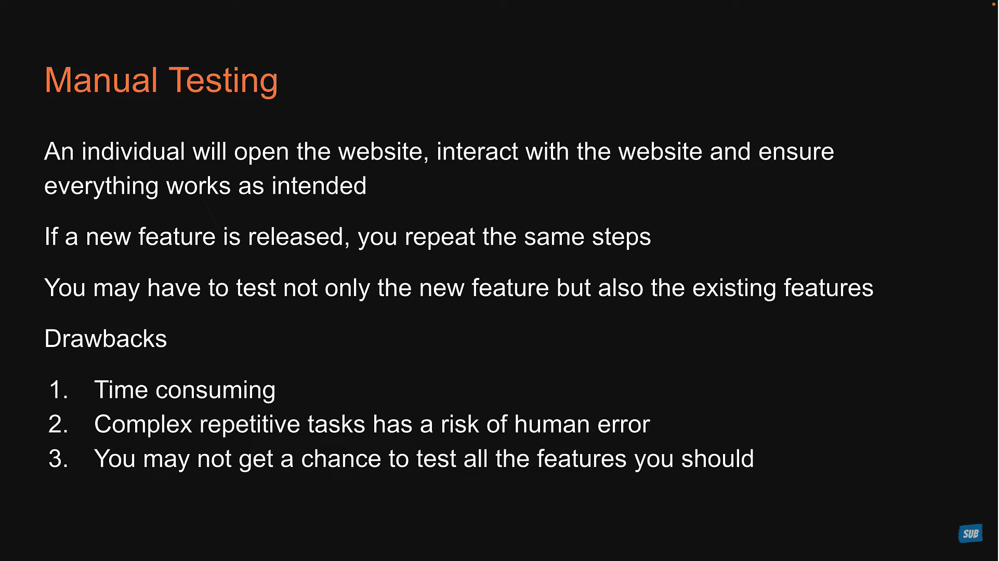
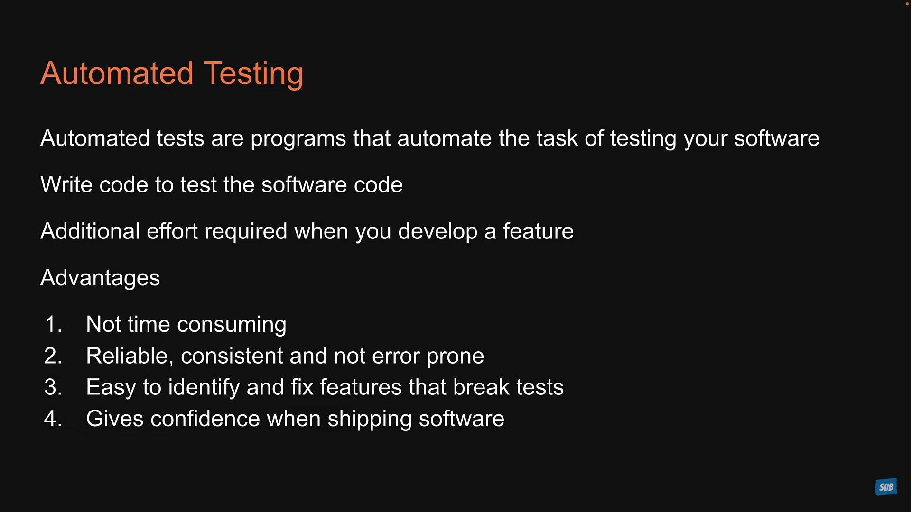
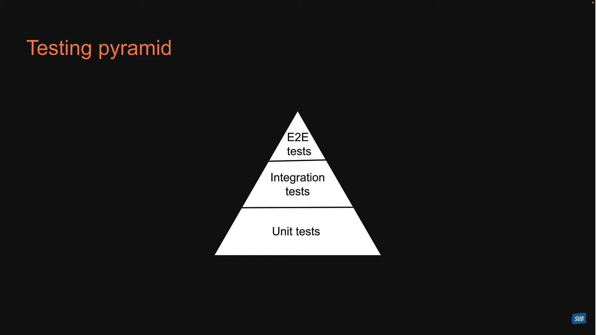

### Manual Testing vs Automated testing





__Course Structure__

1. Jest and React Testing Library
2. Fundamentals of writing test
3. Test components with user interactions
4. Test components wrapped in a provider
5. Test componets with mocking 
6. static analysis testing
---
### Jest Vs RTL 

__JEST__ : 
* Jest is javascript testing framework
* Jest is a test runner that find tests, runs the tests, determines whether the tests passed or failed and reports it back in a human readable manner.

__RTL__ : 
* javascript testing utility that provides virtual DOM for testing React Component.
* Testing library is infact a family packages which helps test UI components
* The core library is called DOM testing library and RTL is simaply a wrapper around this core library to test React applications in an easier way.
---
### Types of Test 

1. Unit tests
2. Integration tests
3. E2E tests (End to End Test)

__Unit tests__
1. Focus is on testing the individual blocks of an application such as a class or a function or a component.
2. Each unit or building block is tested in isolation, independent of other units
3. Dependencies are mocked
4. Run in a short amount of time and make it very easy to pinpoint failures.
5. Relatively easier to write and maintain

__Integration Test__

1. Focus is on testing a combination of units and ensuring they work together
2. Take longer than unit tests

__E2E tests__

1. Focus is on testing the entire appplication flow and ensuring it works as designed from start to finish.
2. Involves in a real UI, a real backend database, real services etc.
3. Take the longest as they cover the most amount of code.
4. Have a cost implication as you interact with real APIs that may charge based on the number of requests.

__E2E tests__



---
### Testing Libraries

---
### Extention of Test Files

---
### Syntax and Explaination

```javascript
// syntax
test(name, fn, timeout);
```
1. __name__ : This first argument is the test name used to identify the test.
2. __fn__ : The second argument is a function that contains the expectations to test.
3. __timeout__ : The Third argument is timeout which is an optional argument for specifying how long to wait before aborting the test. The default timeout value is 5 second.

Example
```javascript
// Greet.tsx
const Greet = () => {
    return (
        <div>Hello</div>
    )
}

export default Greet;
```


```javascript
// Great.test.tsx
import { render, screen } from "@testing-library/react"
import Greet from "./Greet"

test('Greet Render Correctly',()=> {
    render(<Greet/>);
    const textElement = screen.getByText(/Hello/i); // making case in-senstive
    expect(textElement).toBeInTheDocument();
}) 
```
```
npm run test
```


## Complete Explaination


in this image, when ever we __render__ a __component__ a __Fake Browser Environment__ is created in __NodeJs Environment__ by library called __JS Dom__ it like create html elements over there.  


in this image, we can access the element that are created in Fake Browser Environment by using __screen__ object and that is imported from __react-testing-library__ 


These are the various roles used while testing

> Various Queries

__Screen Methods__ 

|Sri|Query|Detail|
|---|-----|------|
|1. |getAllByRoles|Will find mutilple elements in fake environment|
|2. |getByRoles|Will find exact Single elements in fake environment if it found more then one or less than one it will return error|
|3. |getByText|To check that text exist on the document|

__Expect Methods__ 

|Sri|Query|Combine with|Detail|
|---|-----|------|------------|
|1.|toBeInTheDocument|getByText|Find the text with in the document|


These are the various expect (matchers) use while testing


```javascript
    import users from "@testing-library/user-event";
```

You will get all simulates in user Object.