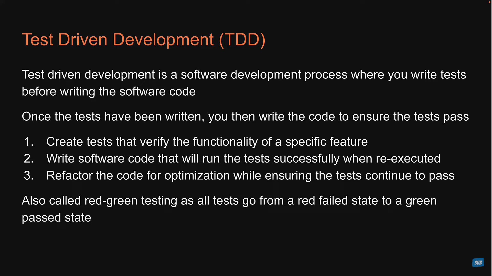
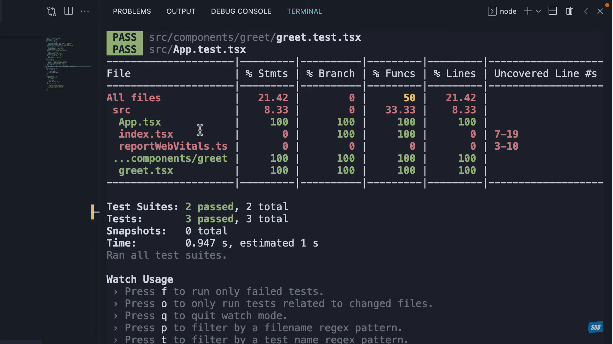

### Testing Libraries


---

### ARIA ROLE && Finding Element
#### 1. Role 

|Sr no|Html Elements | Aria Role|
|-|-|-|
|1|input,type="text"|screen.getbyRole('textbox')|
|2|button|button|
|3|h1 - h6|heading|
|4|ul li|list|
|5|a|link|
|6|table thead|rowgroup|
|7|table tbody|rowgroup|
|8|table td|cell|
|9|table tr|row|
|10|table th|columnheader|

#### 2. Label

```html
<label htmlFor="email"> Enter Email </lable>
<input id="email"/>

<script>
    // 1 method
    screen.getByLabelText(/enter email/i);
    
    // 2 method (best one)
    screen.getByRole('textbox', {name : /enter email/i});
</script> 
```
* very useful in the case of re-order of html input elements

#### Excape hatches

* __These is not a good practice for testing__ but __data-testid__ is more use than __container.querySelector()__ 
* Sometimes finding elements by role just doesn't work well
* Two 'excape hatches' - ways to find elements when then preffered 'role' approach doesn't work 
  
  
  1. data-testid _Fallback #1_ 
  2. conatiner.querySelector() _Fallback #2_ 

```javascript
import React from "react";
const UserList = ({ users }) => {
const renderedUsers = users.map((user) => {
    return <tr key={user.name}>
        <td>{user.name}</td>
        <td>{user.email}</td>
    </tr>
});

return <>
    <table>
        <thead>
            <tr>
                <th>Name</th>
                <th>Email</th>
            </tr>
        </thead>
        <tbody data-testid="users">
            {renderedUsers}
        </tbody>
    </table>
</>
}
export default UserList;
```

```javascript
// using data-testid
test('render one row per user', () => {
    const users = [
        { name: 'jane', email: 'jane@jane.com' },
        { name: 'same', email: 'same@sam.com' },
    ]

    // render
    render(<UserList users={users} />);

    // find all the row in the table
    const rows = within(screen.getByTestId('user')).getAllByRole('rows');
    
    //Assertion
    expect(rows).toHaveLength(2);
});
```

```javascript
import { render, screen, within } from "@testing-library/react"
import UserList from "./UserList.tsx";

function renderComponent() {
    const users = [
        { name: 'jane', email: 'jane@jane.com' },
        { name: 'same', email: 'same@sam.com' },
    ];

    // render
    render(<UserList users={users} />);
    return {
        users
    }
}

describe('UserList', () => {
    test('render one row per user', () => {

        renderComponent();

        // find all the row in the table
        const rows = within(screen.getByTestId('users')).getAllByRole('row');

        //Assertion
        expect(rows).toHaveLength(rows.length);
    });

    test('render the email and name of each user ', () => {
        const { users } = renderComponent();

        for (let user of users) {
            let name = screen.getByRole('cell', { name: user.name });
            let email = screen.getByRole('cell', { name: user.email });
            expect(name).toBeInTheDocument();
            expect(email).toBeInTheDocument();
        }
    })
})
```
---
### Testing Playground

```javascript
screen.logTestingPlaygroundURL();


//  https://testing-playground.com/#markup=DwEwlgbgfMAuCGAjANgUxrAFq+IMCcNMoA5eAW1WAHosioBRc+MZGu9w97XDRAexABPAhjwAreADsqtPHAnTUAAUkyAdAGN+5dvNpdYhvAGcKs2PMtQzlZba069MAy9gDhbpGhfhoQA
```
this comment will give you __URL__ in terminal you just need to copy paste that link after that you will get suggestions for various __queries__

### Assertion
|Sr no| Type| Explain|
|-|-|-|
|1|toHaveLength(2)|will find exact 2 number ot things|
|2|toBeinTheDocument()|will find the element in the document|
|3|expext(nameInput).toHaveValue('')| will find the exact value of any input|


### Jest Vs RTL 

__JEST__ : 
* Jest is javascript testing framework
* Jest is a test runner that find tests, runs the tests, determines whether the tests passed or failed and reports it back in a human readable manner.

__RTL__ : 
* javascript testing utility that provides virtual DOM for testing React Component.
* Testing library is infact a family packages which helps test UI components
* The core library is called DOM testing library and RTL is simaply a wrapper around this core library to test React applications in an easier way.
---

### 📘Anatom of a Test

```javascript
// syntax
test(name, fn, timeout);
```
1. __name__ : This first argument is the test name used to identify the test.
2. __fn__ : The second argument is a function that contains the expectations to test.
3. __timeout__ : The Third argument is timeout which is an optional argument for specifying how long to wait before aborting the test. The default timeout value is 5 second.

📖 Example
```javascript
// Greet.tsx
type GreetProps  = {
    name? : string
}
const Greet = (props : GreetProps) => {
    return (
        <div>Hello {props.name}</div>
    )
}

export default Greet;
```


```javascript
// Great.test.tsx
import { render, screen } from "@testing-library/react"
import Greet from "./Greet"

test('Greet Render Correctly',()=> {
    render(<Greet/>);
    const textElement = screen.getByText(/Hello/i);
    expect(textElement).toBeInTheDocument();
}) 

test('Greet Render Correctly',()=> {
    render(<Greet name="Deepu"/>);
    const textElement = screen.getByText(/Hello Deepu/i);
    expect(textElement).toBeInTheDocument();
}) 
```
```
npm run test
```
⚠️Note :  __test__ and __expect__ we are getting _globally_ from the _jest library_


### Test Drive Development

---

### Jest Watch Mode
* Watch mode is an option that we can pass to jest asking to watch files that have changed since the last commit and execute tests related only to those changed files.
* An Optimization designed to make your tests run fast regardless of how many tests you have.

### 📘 Code Coverage
A metric that can help you understand how much of your software code is tested.

* __Statement Coverage__ : how many of the statements in the software code have been executed.
* __Branches coverage__ : how many of the branches of the control strcutues(if statement for instance) have been executed.
* __Function Coverage__ : how many of the function defined have been called and finally.
* __Line Coverage__ : how many of lines of source code have been tested.

```javascript
// add this line into json-packege.json
"coverage" : "yarn test --coverage"         
```
1. _yarn test --coverage_ : will return data when files get changed.
2. _yarn test --coverage --watchAll_ : will return all test with meaningful report.
3. _yarn test --coverage --watchAll --collectCoverageFrom='src/components/**/*.{ts,tsx}'_ : it will cover all the files which are located in __src/component/__ folders with __ts__ or __tsx__ extentions  
4. _yarn test --coverage --watchAll --collectCoverageFrom='!src/components/**/*.{types, stories,contants,test,spec}.{ts,tsx}'_ : this is use for ignoring all other files which are located in src folder using __!__ (not operator)  


---


### Extention of Test Files

* Files with __.test.js__ or __.test.tsx__ suffix.
* Files with ___.spec.js__ or __.spec.tsx__ suffix.
* Files with __.js__ or __.tsx__ suffix in __\__tests__\__ folders (create that test folder in src folder)
* __Recommendation__ is always put your tests next to the code they are testing so that relative imports are shorter.


---

### Jest Watch Mode

* Watch mode is an option that we can pass to jest asking to watch files that have changed since the last commit and excute tests related only to those changed files.
* An Optimization designed to make your tests run fast regardless of how many tests you have.

### Descibe Method

* use for grouping the test

```javascript
describe('string',()=> {});
```

```javascript
describe('Greet', ()=> {
    test('Greet Render Correctly',()=> {
        render(<Greet/>);
        const textElement = screen.getByText(/Hello/i);
        expect(textElement).toBeInTheDocument();
    }) 

    test('Greet Render Correctly',()=> {
        render(<Greet name="Deepu"/>);
        const textElement = screen.getByText(/Hello Deepu/i);
        expect(textElement).toBeInTheDocument();
    }) 
})

```

---
## Complete Explaination


in this image, when ever we __render__ a __component__ a __Fake Browser Environment__ is created in __NodeJs Environment__ by library called __JS Dom__ it like create html elements over there.  


in this image, we can access the element that are created in Fake Browser Environment by using __screen__ object and that is imported from __react-testing-library__ 


These are the various roles used while testing

> Various Queries

__Screen Methods__ 

|Sri|Query|Detail|
|---|-----|------|
|1. |getAllByRoles|Will find mutilple elements in fake environment|
|2. |getByRoles|Will find exact Single elements in fake environment if it found more then one or less than one it will return error|
|3. |getByText|To check that text exist on the document|

__Expect Methods (Assertions)__ 

|Sri|Query|Combine with|Detail|
|---|-----|------|------------|
|1.|toBeInTheDocument|getByText|Find the text with in the document|


These are the various expect (matchers) use while testing


```javascript
    import users from "@testing-library/user-event";
```

You will get all simulates in user Object.