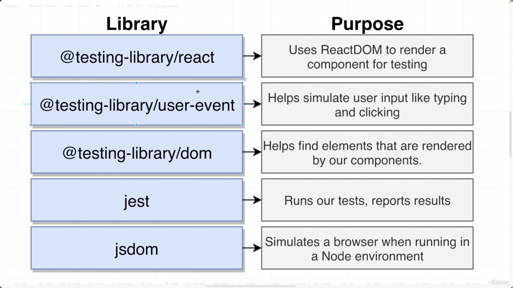
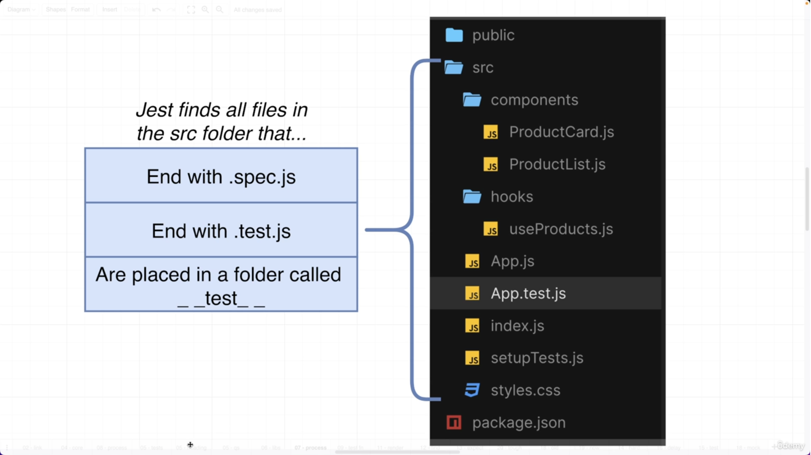
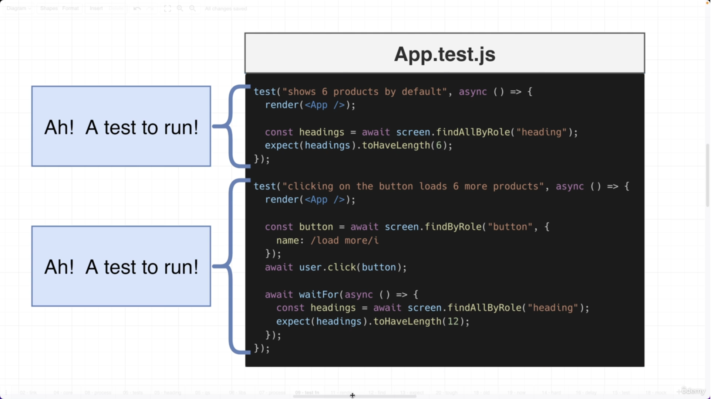
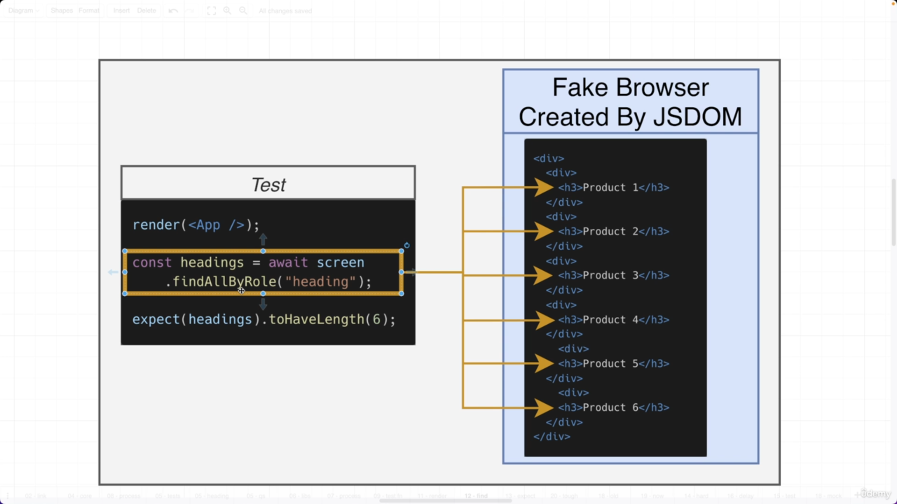
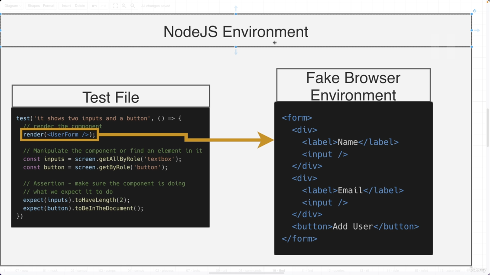
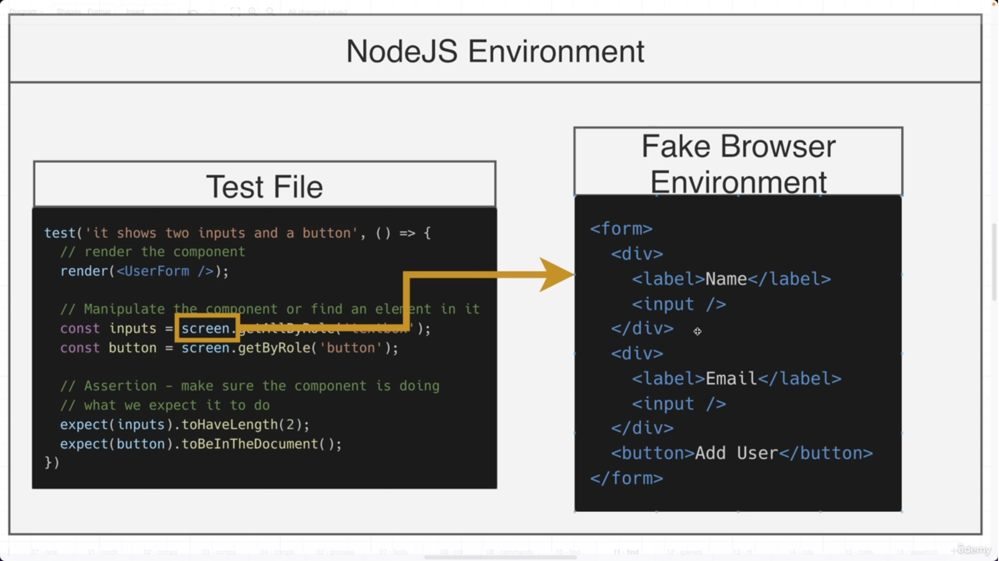
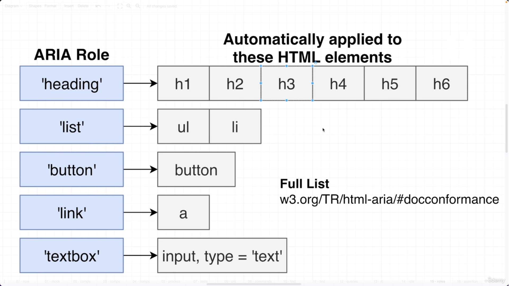
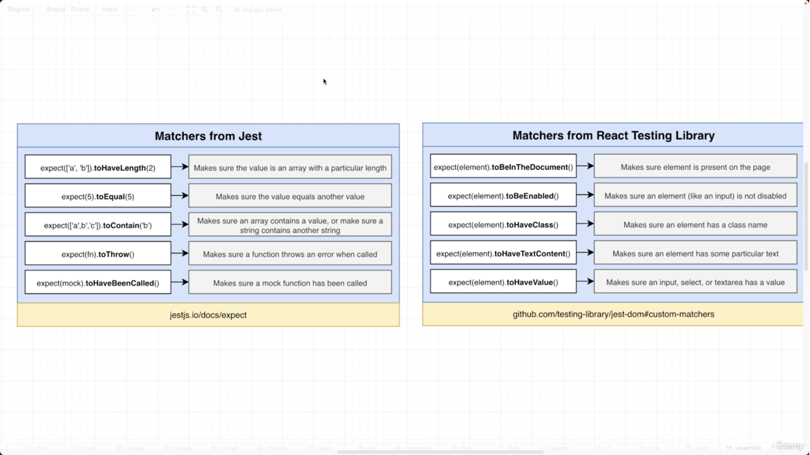
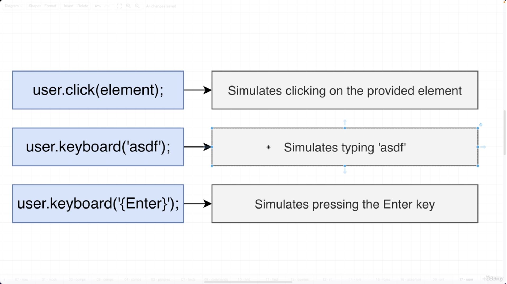

### Testing Libraries


### Extention of Test Files


### Syntax and Explaination




## Complete Explaination



in this image, when ever we __render__ a __component__ a __Fake Browser Environment__ is created in __NodeJs Environment__ by library called __JS Dom__ it like create html elements over there.  



in this image, we can access the element that are created in Fake Browser Environment by using __screen__ object and that is imported from __react-testing-library__ 



These are the various roles used while testing

> Various Queries

|Sri|Query|Detail|
|---|-----|------|
|1. |getAllByRoles|Will find mutilple elements in fake environment|
|2. |getByRoles|Will find exact Single elements in fake environment if it found more then one or less than one it will return error|



These are the various expect (matchers) use while testing



```javascript
    import users from "@testing-library/user-event";
```

You will get all simulates in user Object.