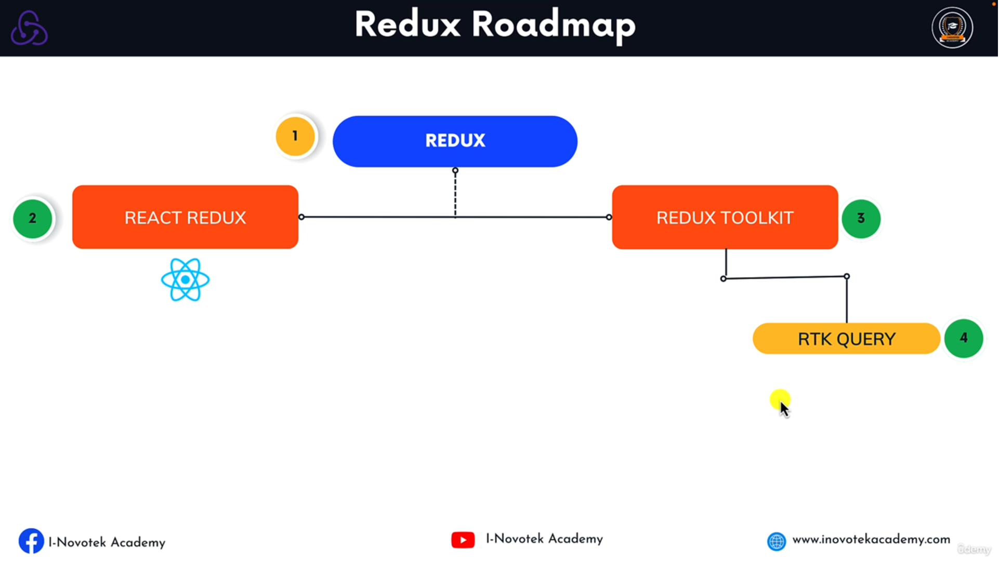
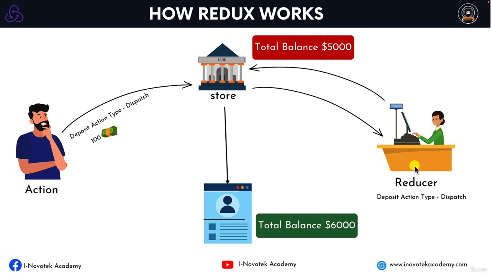
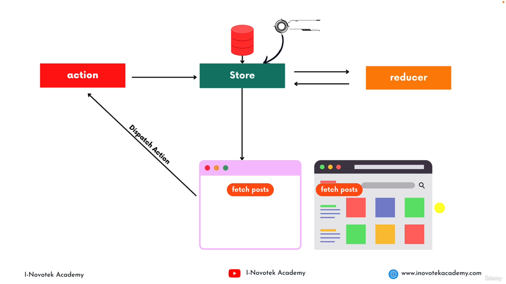

### What is Redux ?
* Redux is an open-source javascript library for __managing__ and __centralizing__ application state.
* A __Predicatble State Container__ for JS APP.
---  
### Redux Road Map

---
### Whats is State ?
* Any data in your application that can change based on conditions. 
* Its a data store that is used to manage the component data.
---
### What is state management ?
* it's the ability to control the information that is passed between React Component.
* State management is the process of determining how to manage state information in a web application.
* State management can be used to track
  * User Data
  * Session Data
  * Application Data
  * Component Data
---
### Type of Data Source
* Server Data (like from api)
* Global state (like redux)
* Local State (useState)
* Url State (passing id in address bar)
* Routing (like queries)
* Local Storage (save token or cart)
---
### Ways of managing state in react
* useState()
* useContext()
* Redux
* RTK (redux toolkit)
* RTK (redux toolkit Query)
---
### When to Use Redux
* You should use Redux when you have a complex state object that is difficult to manage with the local state alone.
* The app state is updated frequently
* The logic to update that state may be complex
* The app has a medium or large-sized codebase and might be wroked on bt many people
---
### Redux Terminologies
* __Actions__ : Actions are the driving force of every dynamic application, as they are the medium by which all changes are communicated within a Redux Application.
* __Reducers__ : Reducers are event Listeners which handles event based on the actions type.
* __Stroe__ : It stores the application data.

---  
### How Redux Works

---
### Example Of Redux

---
### Store Methods
* __getState()__ : Returns the current State tree of your application.
* __dispatch()__ : This is the only way to trigger a state change.
* __subsribe()__ : Listening to any change.
---
### Acion Vs Action Creator
* __Action__ : An Action is simply a __javascript object__ that contains information about an event that has occured in your app.
* __Action Creator__ : Action Creators are __function__ that create and returns actions.
---
#### Action Properties (paramters)
* It has a __type__ field as a property which is required.
* It can accept additional properties __(payload)__. This is optional
---
### Reducer
A Reducer is a function that receives the __current state__ and __an action object__, _decides how to update the state base on the action and returns the new state._
---
#### Rules of Reducers
* The new state value should only be calculated based on the state and action arguments.
* Reducers are not allowed to modify the existing state.
---
### Store 
* __It store the application data__.
* __It doesn't contain business logic.__
* It receives actions and pass to all the registered middleware.
* The only way to change the state inside it is to dispatch an action.
---
⚠️ When it receives an actions that causes a change to the state, the store will notify all the registered listeners that a change to the state has been made. This allow various parts of the system, like the UI, to update themselves according to the new state. 
---
### Command for Redux

```
npm install redux
```
---
### Complete Example of Redux

```javascript
// Counter.js

const { createStore } = require('redux');

// initial State
const initialState = {
    count: 0
};

// constanst
const INCREMENT = "increment";
const DECREMENT = "decrement";
const RESET = "reset";
const INCREASE_BY_AMT = "incerase_by_amt";


//Action + Action creator
const incermentAction = () => {
    return {
        type: INCREMENT
    }
}

const decrementAction = () => {
    return {
        type: DECREMENT
    }
}

const resetAction = () => {
    return {
        type: RESET
    }
}

const incerementByAmt = (payload) => {
    return {
        type: INCREASE_BY_AMT,
        payload: payload
    }
}

// Reducer

const counterReducer = (state = initialState, action) => {
    switch (action.type) {
        case INCREMENT: {
            return { ...state, count: state.count + 1 }
        }
        case (DECREMENT): {
            return { ...state, count: state.count - 1 }
        }
        case (RESET): {
            return { ...state, count: 0 }
        }
        case (INCREASE_BY_AMT): {
            return { ...state, count: state.count + action.payload }
        }
        default: {
            return { ...state };
        }
    }
};

const store = createStore(counterReducer);

store.subscribe(() => {
    const data = store.getState()
    console.log(data);
    console.log("------------------------------")
})

store.dispatch(incermentAction());
store.dispatch(incermentAction());
store.dispatch(resetAction());
store.dispatch(incerementByAmt(10));
store.dispatch(decrementAction(10));

```


```
node counter.js
```
---