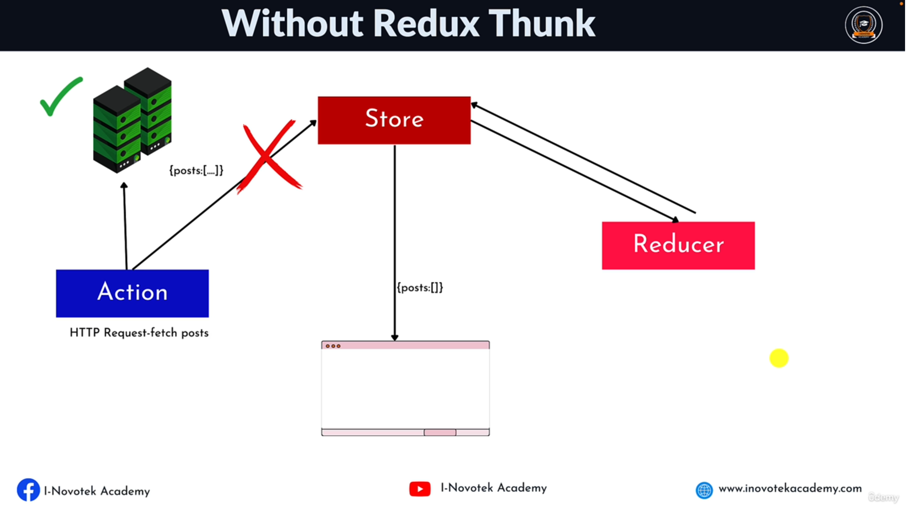

### What is Redux ?
* Redux is an open-source javascript library for __managing__ and __centralizing__ application state.
* A __Predicatble State Container__ for JS APP.
---  
### Redux Road Map

---
### Whats is State ?
* Any data in your application that can change based on conditions. 
* Its a data store that is used to manage the component data.
---
### What is state management ?
* it's the ability to control the information that is passed between React Component.
* State management is the process of determining how to manage state information in a web application.
* State management can be used to track
  * User Data
  * Session Data
  * Application Data
  * Component Data
---
### Type of Data Source
* Server Data (like from api)
* Global state (like redux)
* Local State (useState)
* Url State (passing id in address bar)
* Routing (like queries)
* Local Storage (save token or cart)
---
### Ways of managing state in react
* useState()
* useContext()
* Redux
* RTK (redux toolkit)
* RTK (redux toolkit Query)
---
### When to Use Redux
* You should use Redux when you have a complex state object that is difficult to manage with the local state alone.
* The app state is updated frequently
* The logic to update that state may be complex
* The app has a medium or large-sized codebase and might be wroked on bt many people
---
### Redux Terminologies
* __Actions__ : Actions are the driving force of every dynamic application, as they are the medium by which all changes are communicated within a Redux Application.
* __Reducers__ : Reducers are event Listeners which handles event based on the actions type.
* __Stroe__ : It stores the application data.

---  
### How Redux Works

---
### Example Of Redux

---
### Store Methods
* __getState()__ : Returns the current State tree of your application.
* __dispatch()__ : This is the only way to trigger a state change.
* __subsribe()__ : Listening to any change.

---
### Acion Vs Action Creator
* __Action__ : An Action is simply a __javascript object__ that contains information about an event that has occured in your app.
* __Action Creator__ : Action Creators are __function__ that create and returns actions.
---
#### Action Properties (paramters)
* It has a __type__ field as a property which is required.
* It can accept additional properties __(payload)__. This is optional
---

#### Action Types OR Action Contants

* const __CONSTANTNAME__ = __"constant_value"__;

### Reducer
A Reducer is a function that receives the __current state__ and __an action object__, _decides how to update the state base on the action and returns the new state._
---
#### Rules of Reducers
* The new state value should only be calculated based on the state and action arguments.
* Reducers are not allowed to modify the existing state.
---
### Store 
* __It store the application data__.
* __It doesn't contain business logic.__
* It receives actions and pass to all the registered middleware.
* The only way to change the state inside it is to dispatch an action.
---
⚠️ When it receives an actions that causes a change to the state, the store will notify all the registered listeners that a change to the state has been made. This allow various parts of the system, like the UI, to update themselves according to the new state. 
---
### Command for Redux

```
npm install redux
```
---
### Complete Example of Redux

```javascript
// Counter.js

const { createStore } = require('redux');

// initial State
const initialState = {
    count: 0
};

// Action constanst
const INCREMENT = "increment";
const DECREMENT = "decrement";
const RESET = "reset";
const INCREASE_BY_AMT = "incerase_by_amt";


//Action + Action creator
const incermentAction = () => {
    return {
        type: INCREMENT
    }
}

const decrementAction = () => {
    return {
        type: DECREMENT
    }
}

const resetAction = () => {
    return {
        type: RESET
    }
}

const incerementByAmt = (payload) => {
    return {
        type: INCREASE_BY_AMT,
        payload: payload
    }
}

// Reducer

const counterReducer = (state = initialState, action) => {
    switch (action.type) {
        case INCREMENT: {
            return { ...state, count: state.count + 1 }
        }
        case (DECREMENT): {
            return { ...state, count: state.count - 1 }
        }
        case (RESET): {
            return { ...state, count: 0 }
        }
        case (INCREASE_BY_AMT): {
            return { ...state, count: state.count + action.payload }
        }
        default: {
            return { ...state };
        }
    }
};

const store = createStore(counterReducer);

store.subscribe(() => {
    const data = store.getState()
    console.log(data);
    console.log("------------------------------")
})

store.dispatch(incermentAction());
store.dispatch(incermentAction());
store.dispatch(resetAction());
store.dispatch(incerementByAmt(10));
store.dispatch(decrementAction(10));

```


```
node counter.js
```
---

### Combine Reducer
* it's a function that combine individual reducers to pass to redux store.

Example 

```javascript
const { createStore, combineReducers } = require('redux');

// initial Post State
const initialState = {
    posts: []
};

// initial User State
const usersInitialState = {
    users: []
}

// Action constanst
const ADDPOST = "add_post";
const DELETEPOST = "delete_post";
const ADDUSER = "add_user";
const DELETEUSER = "delete_user";

//Action + Action creator
const addPostAction = (payload) => {
    return {
        type: ADDPOST,
        payload: payload
    }
}

const addUserAction = (payload) => {
    return {
        type: ADDUSER,
        payload: payload
    }
}

const deletePostAction = (payload) => {
    return {
        type: DELETEPOST,
        payload: payload
    }
}

const deleteUserAction = (payload) => {
    return {
        type: DELETEUSER,
        payload: payload
    }
}

// Reducer
const postReducer = (state = initialState, action) => {
    switch (action.type) {
        case ADDPOST: {
            return { ...state, posts: [...state.posts, action.payload] };
        }
        case DELETEPOST: {
            let tempPostArray = [...state.posts];
            let newPosts = tempPostArray.filter(item => item.id != action.payload.id);
            return { ...state, posts: newPosts }
        }
        default: {
            return { ...state };
        }
    }
};

const userReducer = (state = usersInitialState, action) => {
    switch (action.type) {
        case ADDUSER: {
            return { ...state, users: [...state.users, action.payload] };
        }
        case DELETEUSER: {
            let tempPostArray = [...state.users];
            let newusers = tempPostArray.filter(item => item.id != action.payload.id);
            return { ...state, users: newusers }
        }
        default: {
            return { ...state };
        }
    }
};

// rootReducer
const rootReducer = combineReducers({
    posts: postReducer,
    users: userReducer
})

// store
const store = createStore(rootReducer);

// subscribe 
store.subscribe(() => {
    const data = store.getState()

    console.log("--------------------Output ------------------------------");
    console.log('users', data.users);
    console.log('posts', data.posts);

});

// dispatch
store.dispatch(addPostAction({ id: 1, title: 'Computer' }));
store.dispatch(addUserAction({ id: 1, name: 'Deepu Bhasin' }));
store.dispatch(addPostAction({ id: 2, name: 'Mobile' }));
store.dispatch(addPostAction({ id: 3, name: 'Keyboard' }));
store.dispatch(addUserAction({ id: 2, name: 'Dp' }));

store.dispatch(deletePostAction({ id: 1 }));
store.dispatch(deleteUserAction({ id: 1 }));

```
---

### Asynchronous Redux

Problems 

* data is never received, or is received out of order.
* it can make it difficult to debug your code.
* the redux store will not be updated and no changes will be made to your application state.

Answer <br/>
⚠️ **Reducers** are imediatelly return a new data if the correct action is dipatch without waiting for the action payload. 

### Configuration of store
#### Middleware
* Redux middleware is a powerful tool that can be used to customize and extend the functionality of Redux. 
* **Middleware** is basically a **function** that takes in **an action** and can decide how to handle it.

#### Uses of Middleware
* Handle the action
* Dispatch new action (i.e create a side-effect such as making an API Call)
* Log the action to the console / inside the browser by using **redux-dev-extention** tool.

⚠️ Note
* Middlewares are used to enable advanced functionality in a redux store that would not be possible with just a reducer alone.
* Middlewares are composed and executed within a Redux store using the **applyMiddleware()** function.

Example 

```
npm install redux-logger
```

```javascript
const { createStore, applyMiddleware } = require("redux");

// third party middleware
const loggerMiddleware = require("redux-logger").createLogger();

// initial Post State
const initialState = {
    posts: []
};

// custome middleware 
const customLogger = () => next => action => {
    console.log('Action Fired', action);
    next(action);
}

// Action constanst
const FETCHREQUEST = "fetch_request";
const FETCHSUCCESS = "fetch_success";
const FETCHFAILED = "fetch_failed"

//Action + Action creator
const fetchPostRequestAction = (payload) => {
    return {
        type: FETCHREQUEST,
        payload: payload
    }
}

const fetchPostSuccessAction = (payload) => {
    return {
        type: FETCHSUCCESS,
        payload: payload
    }
}

const FetchPostFailedAction = (payload) => {
    return {
        type: FETCHFAILED,
        payload: payload
    }
}

// Reducer
const postReducer = (state = initialState, action) => {
    switch (action.type) {
        case FETCHREQUEST: {
            return { ...state, posts: ["HTML"] };
        }
        default: {
            return { ...state };
        }
    }
};


// store
const store = createStore(postReducer, applyMiddleware(loggerMiddleware, customLogger));

// subscribe 
store.subscribe(() => {
    const data = store.getState()

    console.log("--------------------Output ------------------------------");
    console.log('users', data);

});

// dispatch
store.dispatch(fetchPostRequestAction('ok'));
```
### Redux Thunk 
* Redux Thunk is a **middleware** that allows you to write **asynchronous** actions




#### Facts about redux thunk (important)

* it's function (action creator) that **return a function** instead of an action object.
* This function *receives* this **dispatch** method as an *argument*, which allows you to **dispatch** *actions inside the function*
* This is often used when you need to perform an async operation, such as making an **Ajax request**, before dispatching an action.

#### Example of Thunk 
```
npm install axios

npm install redux-thunk
```
```javascript
const axios = require("axios");
const { createStore, applyMiddleware } = require("redux");
const thunk = require("redux-thunk").default;

// initial Post State
const initialState = {
    posts: [],
    error: "",
    loading: false
};

// Action constanst
const REQUESTSTARTED = "REQUEST_STARTED";
const FETCHSUCCESS = "FETCH_SUCCESS";
const FETCHFAILED = "FETCH_FAILED";


//Action + Action creator
const fetchPostRequestAction = () => {
    return {
        type: REQUESTSTARTED,
    }
}

const fetchPostSuccessAction = (payload) => {
    return {
        type: FETCHSUCCESS,
        payload: payload
    }
}

const FetchPostFailedAction = (payload) => {
    return {
        type: FETCHFAILED,
        payload: payload
    }
}

// MiddleWare [Redux Thunx] (action to make request)
const fetchPosts = () => {
    return async (dispatch, getState) => {
        try {
            console.log('Current State', getState());
            dispatch(fetchPostRequestAction());
            const data = await axios.get('https://jsonplaceholder.typicode.com/posts');
            dispatch(fetchPostSuccessAction(data.data));

        } catch (error) {
            dispatch(FetchPostFailedAction(error.message))
        }
    }
}


// Reducer
const postReducer = (state = initialState, action) => {
    switch (action.type) {
        case REQUESTSTARTED: {
            return { ...state, loading: true };
        }
        case FETCHSUCCESS: {
            return { ...state, loading: false, posts: action.payload }
        }
        case FETCHFAILED: {
            return { ...state, loading: false, error: action.payload }
        }
        default: {
            return { ...state };
        }
    }
};

// store
const store = createStore(postReducer, applyMiddleware(thunk));

// subscribe 
store.subscribe(() => {
    const data = store.getState()

    console.log("--------------------Output ------------------------------");
    console.log('users', data);

});

// dispatch
store.dispatch(fetchPosts());

```


