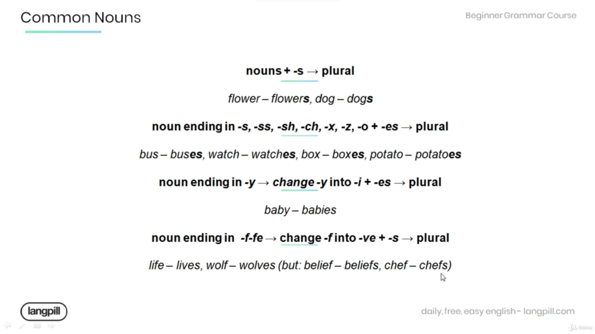
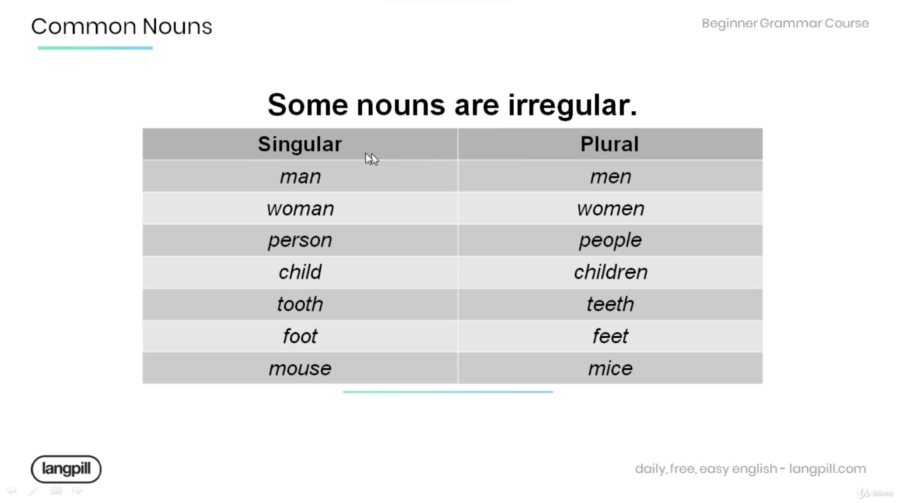
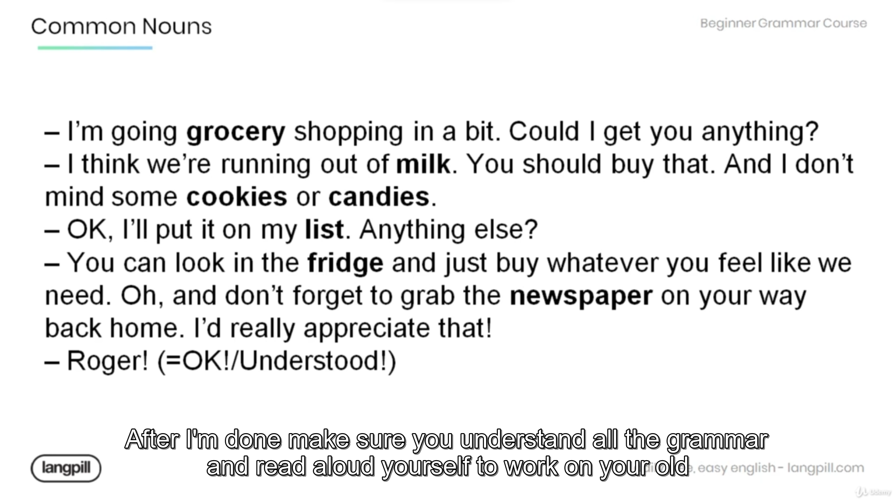

## 📘Nouns
* A noun is a word used to identify people, place, or things (common noun) or to name a particular one of these (proper noun) example *you can buy coffee at starbucks* where as *coffee* is common noun and *starbucks* is proper noun.
* A common noun is a noun showing a class of objects or a concept as opposed to a particular individual. example *There was a **sofa**, two **chairs**, and a **wardrobe** in the **room***.

⚠️ Note : **that common nouns are general names. They are not capitalized unless they begin a sentence or are part of a title.**

* **Capitals** of the countries are usually very large cities. *London is the capital of **Great Britain***.

* **Rules for converting from Singular to Plural**

* **Some noun are irregular**

| Sr no | Singular | Plural   |
| ----- | -------- | -------- |
| 1     | man      | men      |
| 2     | woman    | women    |
| 3     | person   | people   |
| 4     | child    | children |
| 5     | tooth    | teeth    |
| 6     | foot     | feet     |
| 7     | mouse    | mice     |

🧾 Questions
1. *Fruit* and *vegetables* are good for you.
2. *Books* can help you learn something new.
3. map : *maps*, cake : *cakes*
4. sandwich : *sandwiches*, cross : *crosses*, fox : *foxes*, tomato :*tomatoes*
5. lily : *lilies*
6. wife : *wives*, calf : *calves*, life : lives
7. don't forget to take your jacket ! it's really cold outside today

* Example 
