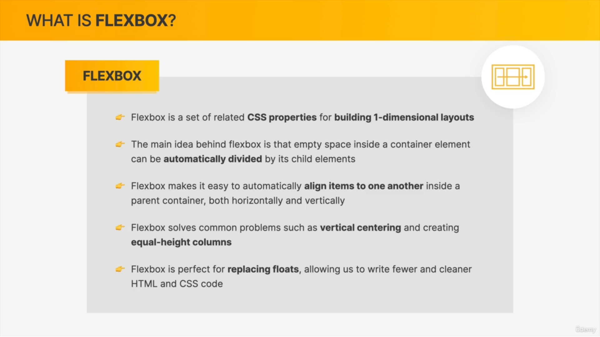
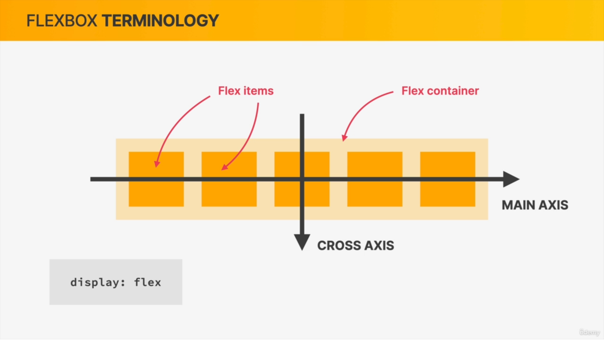
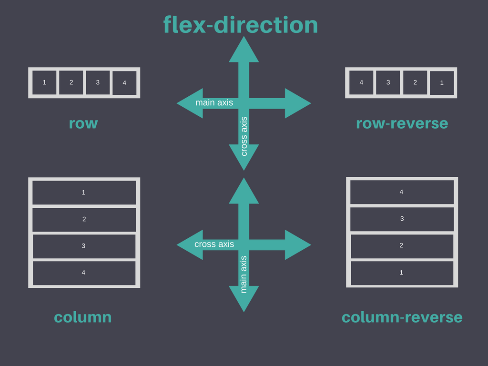
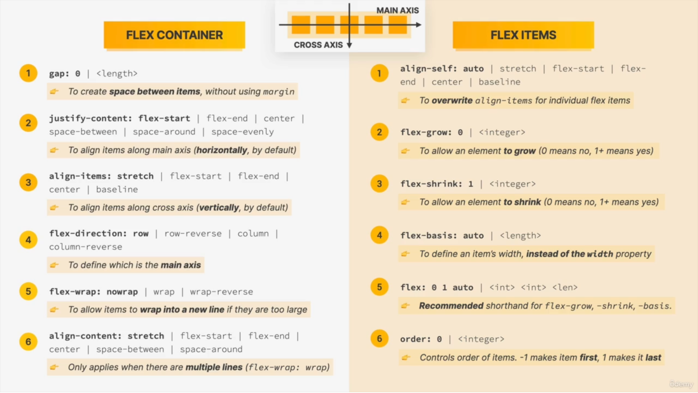

## CSS
> What is CSS
* Cascading Style Sheets
* CSS describes the __visual style and presentation__ of the __content written in HTML__
* CSS consists of countless __properties__ that developers use to format the content: properties about font, text, spacing, layout, etc.

### CSS Tricks  

* Always use __background-color : property__ for testing any elements

### CSS Rules

### Types of CSS
> Inline CSS
```html
<h1 style="color:blue; font-style: italic;">📘 The Code Magazine</h1>
```
> Internal CSS 
```html
<style>
    h1 {
        color: blue;
        font-style: italic;
    }
</style>
```   
> External CSS

```html
<link rel="stylesheet" href="./style.css">
```
### Comments
```css
/*h1 {
    color: red;   
}*/ 
```
### Specity of CSS Selectors


> Pseudo Class Example


* __a__ is not getting _red_ color beacuse __a__ element has less priority then __Pseudo selector__.

> !important Example


* __p__ is getting _green_ color beacuse __!important__ has high priority then others properties. 
```html
<style>
#text {
    color: green;
}    
.text {
    color: green;
}
h1 {
    color: green;
}        
</style>

<h1 id="text" color="text">Hello World</h1>
```
* __color__ for __h1__ will be __green__ beacuse of _Specity_

### Selector

> Element Selector
```css
p {
    text-align: center;
    color: red;
}
```


> Id Selectore
```html
<style>
#heading {
    color:blue;
    font-size : 20px;
}
</style>    

<h1 id="heading">Hello World</h1>
```
> Class Selector
```html
<style>
.heading-text {
    color:blue;
    font-size : 20px;
}
</style>    

<h1 class="heading-text">Hello World</h1>
```
* In real applications we mostly use __classes__ as compair to __id__ because of future use.

> Grouping selectors
```css
h1, h2, h3, h4,  p, li {
    font-family: sans-serif;
}
```
> Descendent Selector
```css
footer p {
    font-family : 20px
}    
```
* it will select all __p__ tags with in __footer__ tag

> Adjacent Sibling

```html
 <style>
    .main h1+p {
        color: red;
        font-size: 30px;

    }
</style>

<div class="main">
    <h1>Hello h1</h1>
    <p>hello p</p>
    <p>hello p</p>
    <h1>hello h1</h1>
    <h1>hello h1</h1>
    <p>hello p</p>
</div>
```


### Styling Font

```css
h1 {
    font-family:sans-serif;
    font-style: italic;
    font-size: 26px;
    font-weight : bold; /* to bold */
}
```
### Styling-Text
```css
h1 {
    text-decoration: underline dotted red;
    text-transform: uppercase;
    text-align: center;
}
```

### Spacing
```css
p {
    line-height: 1.5;       /* font-size x 1.5 */
    letter-spacing: 2px;    /* horizontal Spacing */
}
```
### Colors


> Color
```css
h1 {
    color : #1098ad;    
}

h2 {
    color : rgb(126,189,68,0.5);
}

h3 {
    color : blue;
}
```
> Background Color

```css
h1 {
    background-color : #1098ad;    
}
```

### Border

```css
h1 {
    border : 2px solid red;
}

h2 {
    border-top: 5px solid #1098ad;
    border-bottom: 5px solid #1098ad;
}
```

### Pseudo Class (:)
#### Pseudo Class for multiple elements 
* These __classes__ are use where __multiple elements__ exist like __li__ in ol,__tr__ in table, __p__ element _(but it should be direct elements to parent element and only __p__ elements should in parent element)_ in Semantics elements etc

```html
<ul>
    <li>1 Item</li>
    <li>2 Item</li>
    <li>3 Item</li>
    <li>4 Item</li>
</ul>

<article>
    <p>paragraph 1</p>
    <p>paragraph 2</p>
    <p>paragraph 3</p>
    <p>paragraph 4</p>
</article>
```


> First Child of selected element

```css
li:first-child {
    font-weight : bold;
}

article p:first-child {
    font-weight : bold;
}
```

> Last Child of selected element
```css
li:last-child {
    font-weight : bold;
}

article p:last-child {
    font-weight : bold;
}
```
> Nth Child of selected element

```css
li:nth-child(2) {           /* select only 2nd element*/
    font-weight : bold;
}

article p:nth-child(2) {    /* select only 2nd element*/
    font-weight : bold;
}
```

> All Odd Childs of selected element

```css
li:nth-child(odd) {           /* select all odd element*/
    font-weight : bold;
}

article p:nth-child(odd) {    /* select all odd element*/
    font-weight : bold;
}
```

> All Even Childs of selected element

```css
li:nth-child(even) {           /* select all even element*/
    font-weight : bold;
}

article p:nth-child(even) {    /* select all even element*/
    font-weight : bold;
}
```

> Using Formula

```css
li:nth-child(2n) {            /* select all even element*/
    font-weight: bold;
}

article p:nth-child(even) {   /* select all even element*/
    font-weight : bold;
}

li:nth-child(2n+1) {          /* select all odd element*/
    font-weight: bold;
} 

article p:nth-child(2n+1) {   /* select all odd element*/
    font-weight : bold;
}

```
#### Pseudo Class for Links

```css
a:link {         /* which have href attribute*/
    color : red;
}

a:visited {     /* when we visited already*/
    color : grey;
}

a:hover {
    text-decoration : yellow;
    color : red;
    font-weight : bold;
}    

a:active {      /* when we clicking*/
    color : green;
}

/* LVHA Order */
```
### Inheritence


> Body Vs Universal(*) selector  
* Universal Selector simply applies to all the elements and there is no inheritance involved and therefore, this is perfect if you want to apply a certain property that does not automatically get inherited to all the elements.
* Body selector, any style that we put here in the body gets inherited  
* _Example :_ __Border__ Property is not get inherite in case of __body selector__ it will only apply to __body of html__. __Universal(*) selector__ will apply __Border property__ to all elements.
  


### DevTools


### CSS Box Model
> Css Box Model


> Real world example


> Element Height and Width Calculation


### Reseting Layout
> This reseting values must always be used before doing any Design 
```css
* {
    margin: 0;
    padding: 0;
    box-sizing : border-box;
}
```
### Padding

```css
h1 {
    padding-left : 20px;
    padding-right : 20px;
    padding : 20px 40px;   /* left-right Top-Bottom */
    padding : 10px 20px 30px 40px; /*Top Right Bottom Left */ 
}
```

### Margin

```css
h1 {
    margin-left : 20px;
    margin-right : 20px;
    margin : 20px 40px;   /* left-right Top-Bottom */
    margin : 10px 20px 30px 40px; /*Top Right Bottom Left */ 
}
```

#### Collapsing margins


### Height and Width

```css
div {
    width : 100%;
    height : auto; 
}
```

### Border-box

* __box-sizing__ values are  _content-box_ (default value) & _border-box_


Example

* Without box-sizing


* With box-sizing


### Center Div

```html
<style>
.container {
    width : 700px;
    margin : 0 auto;
}
</style>

<div class="container">Hello World</div>
```
### Display Property

> Block Level Element


Example


* __Block__ elements take whole width
* __margin-top & margin-bottom__ can apply on _Block_ elements

> Inline Element


Example


* __inline__ elements take content width only
* __margin-top & margin-bottom__ cannot apply on _Block_ elements
* __top-left-right-bottom__ positions dont not work on inline elements

> Inline-Block Element


Example


* __images__ are _inline-block_ elements

### Positions Property

> Relative Vs Absoulte


> Absolute Position with relative Example


* Element with __position : absolute__ will take position according to parent position with __position : relative__

### Pseudo Elements (::)

* All Pseudo elements are __inline-elements__
  
> After

```css
h2::after {
    content: "TOP";             /* Mandatory Property */
    background-color: #ffe70e;
}
```  
* we can create element same as html element using __after or before__ properties

Example


> Before

```css
h2::before {
    content: "TOP";  /* Mandatory Property */
}
```

> First-letter

```css
h1::first-letter{
    font-size: 50px;
    font-style: normal;

}
```
> First-line

```css
p::first-line {
    color :red;
}
```
### Page Layout


### Float
```css
h1 {
    float : left; 
}
h2 {
    float : right;
}
```

> Collapsing Height


* in above example height of navbar get collapse beacuse __h1__ using _float : left_ property and __nav__ using _float : right_ property. Now its showing little bit height (in red color) beacuse  of _padding_ property.

> Clear Float


* We have to add one more element after all floated elements. 
```css
  .clear {
    clear : both;
  }
``` 
* __Clearfix Hack__ just add this class in _Parent element_ to aviod _extra div_ 

```css
  .clearfix::after {
    content : "";
    clear : both;
    display : block;

  }
  ``` 

### Flex-box

> For Practice of Flex-Box

Link : [Froggy Website](https://flexboxfroggy.com/)

> What is Flex box







* __justify-content__ property always depend upon __Main Axis__
* __align-items__ property depend upon __Cross Axis__ 
* Default value of __flow-direction : row__ therefore __Main axis__ is along to __row__
* Most __application use__ of _flex-box_ is center the _div_ 


> All Properties of Flex Box



* if we provide _height_ to any __item__ other items will take same height by default, but if we provide __align-items: flex-start__ _(stretch is default value for align-items)_ then it will not allowed to take same height to other elements.
* __flex-basics__ calculate optimal width automatically even we provide much more width then content of element.
* You can add __margin, padding__ properties also. 
* we add manually spacing by using __margin__ property to each _items_
* We can use __gap__ property with _px_ value
* __flex : 0 0 200px__ short-hand of _flex-grow flwx-shrink flex-basics (width)_.

> Cheat Sheet of Flex-Box


