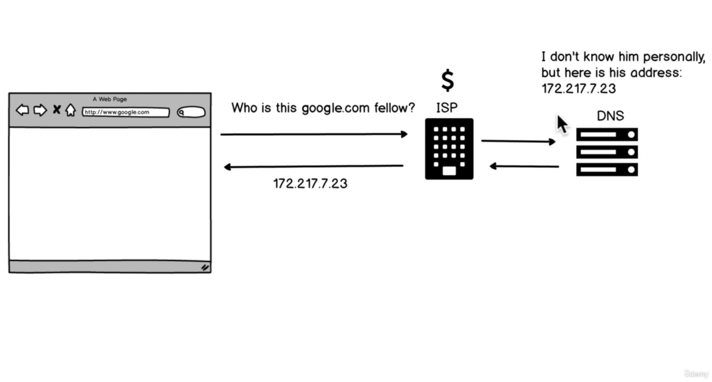
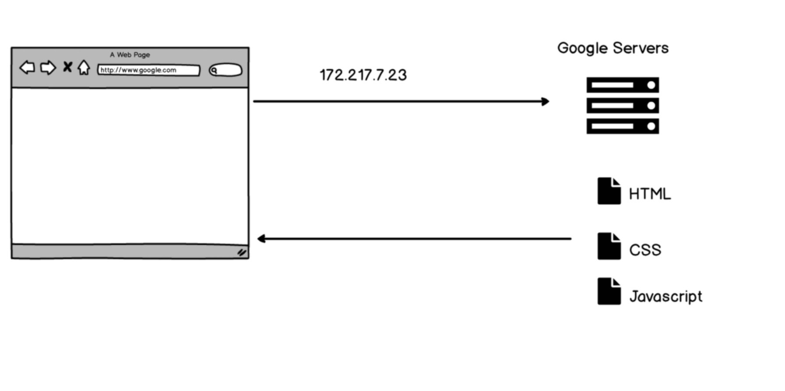
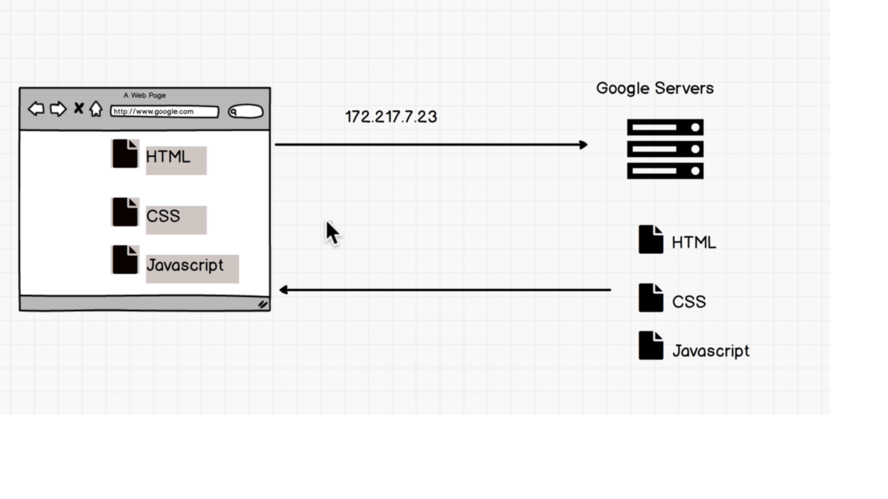
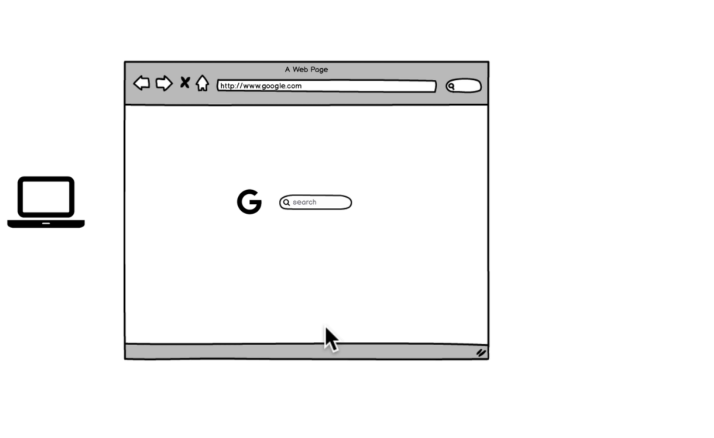

## The Complete Web Developer
* Web Foundation
* HTML5
* CSS3
* Bootstrap
* CSS Grid
* Javascript (Core fundental)
* DOM Manipulation
* Developer Environment
* Git/Github
* NPM/NPM Scripts
* React.js (Redux  + Hooks)
* Node.js
* Api

## Browsing the Web

When we enter Google.com we press __Enter__ on key board we ask question who's ? this __Google.com fellow__ ? and that question gets asked all the way down to our __ISP__ (ISP is Internet Service Provider) and These ISP service like Internet service are provided by various companies and charges depends upon according countries, So they get that request and they send that off to something called the __DNS Server__ so Domain Name Server but essentially it's a phone book - a phone book that has the list of all these URL's like Google.com and it has the addresses of them, so exactly like a phone book, They know where Google.com is so they say "Hey you know, I don't know __Mr. Google.com__" personally, but I do know his address, so you should go check him out, so they send off the request back through the ISP and the website of the web browser, Google Chrome, in this case gets "172.217.7.23" alright cool, but nothing is shwoing up yet, There's no there's Google.com. I can't do any searches yet

Ok we receive - it's what we call an __IP Address__ so think of "172.217.7.23" as something that every single computer has one, anything that's connected to the internet has its own address so the laptop that i'm working on right now an IP Address, your laptop or computer. So this "172.217.7.23" IP Address allows the internet to work essentially, it knows out location our address. So what we do now with __Google.com__ we know this IP address - the browser sends off another request to the Google servers and it knows where the Google servers are beacuse, well because we have this address so we go seek it out and you can think of servers as computers essentially, my laptop could be a server, your computer could be server. Server are essentially computers that are sometimes in basements or in huge server farms and they have a piece of software running that just like at a restaurant where a server brings you food. It knows how to send you files when you request for them, So we send this "172.217.7.23" off and the google servers say oh yeah no problem let me give you my __HTML CSS and JavaScript__ and They are text files that Google is going to send to the browser so we can have google working. So we're copying these files and Google server's saying yeah no problem thank for asking for Google Here it is and the web browser receives the HTML, CSS and javascript

so if we go to the next section boom we have google.com and everything's working 

Now that sounded like a whole bunch of stuff that happened in between and when we're on the internet every thing is quite fast but yet underneath the hood all of that us happening and it's crazy to think how fast everything works __like if we know the address of google can we just you know go into "172.217.7.23" directly and just instead of putting Google.com, just put in this in our search bar and it automatically goes to the google servers__

